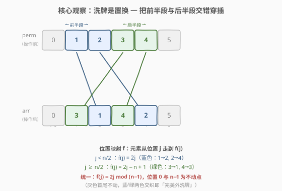
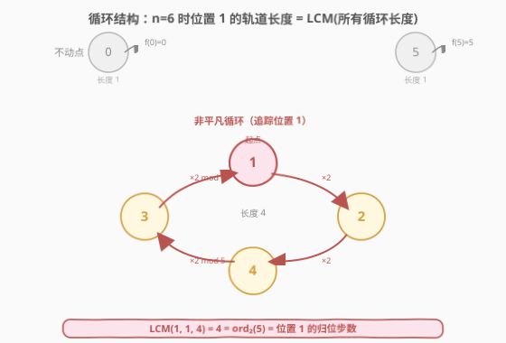
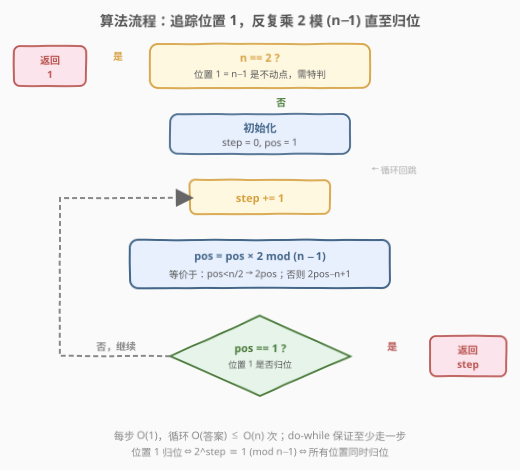
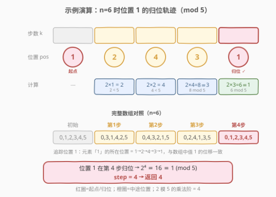

# 还原排列的最少操作步数

- **题目名称**：还原排列的最少操作步数
- **链接**：[1806. 还原排列的最少操作步数](https://leetcode.cn/problems/minimum-number-of-operations-to-reinitialize-a-permutation/)
- **难度**：中等
- **标签**：数组、数学、模拟、置换群

## 1. 题目概述

给定一个偶数 $n$，初始排列 $\text{perm} = [0, 1, 2, \dots, n-1]$（即 $\text{perm}[i] = i$）。每步操作按下述规则生成新数组 $\text{arr}$，再赋值回 $\text{perm}$：

- 若 $i \bmod 2 = 0$，$\text{arr}[i] = \text{perm}[i / 2]$
- 若 $i \bmod 2 = 1$，$\text{arr}[i] = \text{perm}[n / 2 + (i - 1) / 2]$

求使 $\text{perm}$ 回到初始排列所需的最小**非零**操作步数。

**示例 1**：

```text
输入：n = 2
输出：1
解释：perm = [0,1]，一步操作后 arr = [0,1]，已回到初始，故答案为 1。
```

**示例 2**：

```text
输入：n = 4
输出：2
解释：
  初始 perm = [0,1,2,3]
  第 1 步 arr  = [0,2,1,3]   （首尾不动，中间 1↔2 互换）
  第 2 步 arr  = [0,1,2,3]   （回到初始）
```

**示例 3**：

```text
输入：n = 6
输出：4
解释：
  初始 perm = [0,1,2,3,4,5]
  第 1 步 arr  = [0,3,1,4,2,5]   （首尾不动，中间 4 个位置循环）
  第 2 步 arr  = [0,4,3,2,1,5]
  第 3 步 arr  = [0,2,4,1,3,5]
  第 4 步 arr  = [0,1,2,3,4,5]   （回到初始）
```

**约束条件**：

- $2 \le n \le 1000$
- $n$ 为偶数

> 💡 **关键直觉**：单步操作本质上是一次**完美洗牌**——把数组的「前半段」与「后半段」交错穿插（$\text{arr} = [\text{perm}[0], \text{perm}[n/2], \text{perm}[1], \text{perm}[n/2+1], \dots]$）。洗牌是一个**置换**，而「回到初始」等价于求这个置换的**阶**（order）——即所有循环长度的最小公倍数。一旦看透这一层，问题从「模拟整个数组」跃升为「追踪单个元素的归位周期」。

---

## 2. 解题思路

### 2.1 暴力思路：逐数组模拟

最直观的做法：每步照题意重建整个 $\text{arr}$，再与初始排列 $[0,1,\dots,n-1]$ 比较，直到相同为止。每步 $O(n)$，步数至多 $O(n)$（置换的阶不超过 $n$），总计 $O(n^2)$。$n \le 1000$ 时 $10^6$ 量级，足以通过。

但这样做有「**浪费**」：我们维护了 $n$ 个位置的状态，却只关心「整体是否复原」。能否只盯住**一个**代表元素？

### 2.2 核心观察：置换的阶 = 单元素归位周期



把单步操作看作位置映射 $f$：$\text{arr}[i] = \text{perm}[j]$ 意味着「位置 $j$ 上的元素挪到了位置 $i$」，即元素从 $j$ 走到 $f(j)$。逐条展开规则：

- $j < n/2$（前半段）：$\text{arr}[2j] = \text{perm}[j]$，故 $f(j) = 2j$；
- $j \ge n/2$（后半段）：令 $j = n/2 + k$，$\text{arr}[2k+1] = \text{perm}[n/2+k]$，故 $f(j) = 2(j - n/2) + 1 = 2j - n + 1$。

于是得到统一形式：

$$
f(j) = \begin{cases} 2j & 0 \le j < n/2 \\ 2j - n + 1 & n/2 \le j < n \end{cases}
$$

> 💡 **化简为模运算**：对 $j \in \{0, 1, \dots, n-2\}$，可验证 $f(j) = 2j \bmod (n-1)$（因为 $j < n/2$ 时 $2j < n-1$ 取自身；$j \ge n/2$ 时 $2j \in [n, 2n-2]$，模 $n-1$ 后得 $2j-n+1$）。而位置 $n-1$ 与位置 $0$ 都是**不动点**（$f(0)=0$、$f(n-1)=n-1$）。因此非平凡的位置只有 $\{1, 2, \dots, n-2\}$，其上的运动是「反复乘 2 对 $n-1$ 取模」。

置换的**阶**等于其所有循环长度的最小公倍数。而在映射 $j \mapsto 2j \bmod (n-1)$ 下：

- 位置 $1$ 的轨道为 $1 \to 2 \to 4 \to \cdots \to 2^k \bmod (n-1)$，恰好在 $2^k \equiv 1 \pmod{n-1}$ 时归位，长度 = **2 模 $n-1$ 的乘法阶**；
- 任意位置 $j$ 的轨道长度是使 $(2^k - 1)\,j \equiv 0 \pmod{n-1}$ 的最小 $k$，它必然**整除** 2 的乘法阶；
- 故所有循环长度的 LCM = 位置 $1$ 的循环长度 = $\text{ord}_2(n-1)$。



> ⚠️ **$n = 2$ 特例**：此时 $n-1 = 1$，位置 $1$ 即位置 $n-1$（不动点），追踪它立即「归位」会得到 $0$，但题意要求**非零**步数。实际上 $n=2$ 时一步操作后 $\text{arr}=[0,1]$ 已是初始排列，故直接返回 $1$。对 $n \ge 4$，位置 $1 \in \{1,\dots,n-2\}$ 为非平凡位置，追踪法成立。

**结论**：只需追踪位置 $1$ 经过多少步回到自身，即为答案（$n=2$ 时返回 $1$）。每步 $O(1)$，总共 $O(\text{答案}) \le O(n)$。

### 2.3 算法流程图



### 2.4 示例演算

以 $n = 6$ 为例（$n - 1 = 5$），追踪位置 $1$：



| 步数 $k$ | 位置 $\text{pos}$ | 计算 $2\,\text{pos} \bmod 5$ | 说明 |
|----------|-------------------|------------------------------|------|
| 0 | $1$ | — | 起点 |
| 1 | $2$ | $2 \times 1 = 2$ | $2 < 5$，直接取 |
| 2 | $4$ | $2 \times 2 = 4$ | $4 < 5$，直接取 |
| 3 | $3$ | $2 \times 4 = 8 \equiv 3$ | $8 \bmod 5 = 3$ |
| 4 | $1$ | $2 \times 3 = 6 \equiv 1$ | 归位 ✓ |

$\text{pos}$ 在第 $4$ 步回到 $1$ → **返回 4** ✓

对照完整数组验证（$n=6$）：

```text
初始  [0,1,2,3,4,5]
第1步 [0,3,1,4,2,5]   ← 位置1的元素(=1)到了位置2，即 f(1)=2
第2步 [0,4,3,2,1,5]   ← 元素1继续从位置2走到位置4，f(2)=4
第3步 [0,2,4,1,3,5]   ← 元素1从位置4走到位置3，f(4)=3
第4步 [0,1,2,3,4,5]   ← 元素1从位置3回到位置1，f(3)=1 ✓ 整体归位
```

> 💡 **单元素追踪为何够用？** 因为位置 $1$ 的循环长度 = 所有循环长度的 LCM = 置换的阶。一旦位置 $1$ 归位，**所有**位置必然同时归位（所有循环长度都整除它）。这是「追踪代表元」成立的核心保证。

---

## 3. 参考代码

### Python（追踪位置 1）

```python
class Solution:
    def reinitializePermutation(self, n: int) -> int:
        if n == 2:
            return 1
        step, pos = 0, 1
        while True:
            step += 1
            pos = pos * 2 % (n - 1)
            if pos == 1:
                break
        return step
```

### C++（追踪位置 1）

```cpp
class Solution {
public:
    int reinitializePermutation(int n) {
        if (n == 2) return 1;
        int step = 0, pos = 1;
        do {
            ++step;
            pos = pos * 2 % (n - 1);
        } while (pos != 1);
        return step;
    }
};
```

### C++（暴力模拟整个数组，备用）

```cpp
class Solution {
public:
    int reinitializePermutation(int n) {
        vector<int> perm(n), arr(n);
        iota(perm.begin(), perm.end(), 0);
        vector<int> target = perm;
        int step = 0;
        do {
            for (int i = 0; i < n; ++i) {
                if (i % 2 == 0) arr[i] = perm[i / 2];
                else            arr[i] = perm[n / 2 + (i - 1) / 2];
            }
            perm = arr;
            ++step;
        } while (perm != target);
        return step;
    }
};
```

> 💡 **实现细节**：① `pos = pos * 2 % (n - 1)` 直接套用化简后的模运算形式，比 `if (pos < n/2) pos*=2; else pos=2*pos-n+1;` 更短且不易写错。② 用 `do-while`（C++）或 `while True + 先算后判`（Python）保证至少执行一步，规避「初始即归位」返回 $0$ 的陷阱。③ $n=2$ 特判：位置 $1=n-1$ 是不动点，追踪法失效，但答案恒为 $1$。

---

## 4. 复杂度分析

| 维度 | 复杂度 | 说明 |
|------|--------|------|
| 时间 | $O(\text{ord}_2(n-1)) \le O(n)$ | 追踪位置 $1$ 到归位，步数 = 2 模 $n-1$ 的乘法阶，不超过 $\varphi(n-1) \le n-2$ |
| 空间 | $O(1)$ | 仅两个整型变量 `step`/`pos` |

> ⚠️ 暴力模拟法为 $O(n \cdot \text{答案})$ 时间、$O(n)$ 空间，$n \le 1000$ 同样可通过，但常数与空间均劣于追踪法。追踪法的精髓在于**用置换群的阶把 $n$ 维状态压缩到 1 维**。

---

## 5. 扩展：置换群视角与阶的数学求法

### 5.1 完美洗牌的阶

本题操作是经典的**完美外洗牌**（out-shuffle）：把牌堆对半分，再交错穿插，首尾两张不动。洗牌 $k$ 次后复原的 $k$ 即洗牌置换的阶。对 $n$ 张牌的外洗牌，其阶恰为 $2$ 模 $n-1$ 的乘法阶——这是本题的群论本质。

### 5.2 直接求乘法阶

若 $n$ 更大（如 $n \le 10^{18}$），逐位置模拟不可行，可对 $n-1$ 分解质因数，求得 $\varphi(n-1)$，再枚举其因子求最小 $k$ 使 $2^k \equiv 1 \pmod{n-1}$，复杂度 $O(\sqrt{n} \cdot \log n)$（分解）+ $O(\sqrt{\varphi}\cdot \log n)$（枚举因子）。

```cpp
long long mulmod(long long a, long long b, long long m) {
    return (__int128)a * b % m;
}
long long mpow(long long a, long long e, long long m) {
    long long r = 1 % m;
    for (; e; e >>= 1, a = mulmod(a, a, m))
        if (e & 1) r = mulmod(r, a, m);
    return r;
}
long long phi(long long x) {
    long long r = x;
    for (long long p = 2; p * p <= x; ++p)
        if (x % p == 0) {
            r = r / p * (p - 1);
            while (x % p == 0) x /= p;
        }
    if (x > 1) r = r / x * (x - 1);
    return r;
}
// 求 2 模 m 的乘法阶（要求 gcd(2,m)=1，即 m 为奇数）
long long order2(long long m) {
    long long p = phi(m), res = p;
    for (long long d = 2; d * d <= p; ++d)
        if (p % d == 0) {
            while (res % d == 0 && mpow(2, res / d, m) == 1) res /= d;
            long long dd = p / d;
            while (res % dd == 0 && mpow(2, res / dd, m) == 1) res /= dd;
        }
    return res;
}
```

> 💡 本题 $n \le 1000$ 无需此法，但它揭示了「追踪法 $O(n)$」背后真正的数学复杂度只有 $O(\sqrt n \log n)$——模拟的瓶颈不在数学，而在 $n$ 太小不值得上重武器。

---

## 6. 面试要点

1. **为什么追踪位置 $1$ 而不是位置 $0$ 或 $n-1$？**

   > 位置 $0$ 与 $n-1$ 都是**不动点**（$f(0)=0$、$f(n-1)=n-1$），追踪它们立即「归位」得不到有效信息。位置 $1$（$n\ge4$ 时属于 $\{1,\dots,n-2\}$）是非平凡位置，其循环长度恰为 2 模 $n-1$ 的乘法阶，等于所有循环长度的 LCM。

2. **「位置 $1$ 归位」为何等价于「整个数组复原」？**

   > 位置 $1$ 的循环长度 = 所有循环长度的 LCM = 置换的阶。当位置 $1$ 归位时，经历的步数 $k$ 是 2 的乘法阶，此时 $2^k \equiv 1 \pmod{n-1}$，对任意位置 $j$ 有 $2^k j \equiv j$，即所有位置同时归位。

3. **$n = 2$ 为什么要特判？**

   > $n=2$ 时 $n-1=1$，位置 $1$ 即位置 $n-1$（不动点），追踪法会返回 $0$，但题意要求**非零**步数。实际一步操作后 $\text{arr}=[0,1]$ 已是初始排列，答案为 $1$。

4. **模拟法与追踪法的本质区别是什么？**

   > 模拟法维护**整个置换的状态**（$n$ 维），逐数组重建并比对，是「自底向上」的朴素再现；追踪法利用**置换群的阶**这一抽象性质，把问题压缩为「单元素的归位周期」（$1$ 维），是「自顶向下」的数学降维。两者结果一致，但追踪法把 $O(n^2)/O(n)$ 降到 $O(n)/O(1)$。

5. **如果 $n$ 不是偶数呢？**

   > 题目保证 $n$ 为偶数，规则依赖「对半分」。若 $n$ 为奇数，「前半段/后半段」长度不等，映射不再是上述整齐的 $2j \bmod (n-1)$ 形式，需重新推导。本题的优美结论（阶 = $\text{ord}_2(n-1)$）正是建立在 $n$ 偶数、$n-1$ 奇数、$\gcd(2,n-1)=1$ 之上。

> 💡 **一句话总结**：洗牌是置换，置换的阶 = 循环长度的 LCM = 位置 $1$ 的归位周期 = $2$ 模 $n-1$ 的乘法阶；追踪位置 $1$ 归位即得答案，$O(n)/O(1)$。

---

## 7. 同类练习题

- [1550. 存在连续三个奇数的数组](https://leetcode.cn/problems/three-consecutive-odds/)：同为数组模拟判定题，但本题的精髓在于「跳过模拟直接看置换结构」，对照「朴素模拟 vs 数学降维」的取舍
- [918. 环形子数组的最大和](https://leetcode.cn/problems/maximum-sum-circular-subarray/)（[题解](../0901-1000/918_环形子数组的最大和.md)）：同样把「环形/周期」结构抽象后降维——用 $\text{total} - \text{min\_sum}$ 化环形为线性，与本题「置换的阶化整组为单点」同属「抓结构降维」范式
- [1015. 可被 K 整除的最小整数](https://leetcode.cn/problems/smallest-integer-divisible-by-k/)：求最小的 $n$ 使 $10^n \bmod K = 1$（或 $1\underbrace{00\cdots0}_{n}$ 被 $K$ 整除），本质即 $10$ 模 $K$ 的乘法阶，与「$\text{ord}_2(n-1)$」同构
- [1800. 最大升序子数组和](https://leetcode.cn/problems/maximum-ascending-subarray-sum/)：紧邻题号的数组一次遍历题，对照「需要群论抽象」与「一遍扫描即可」两种题型的边界
- [528. 按权重随机选择](https://leetcode.cn/problems/random-pick-with-weight/)（[题解](../0501-0600/528_按权重随机选择.md)）：前缀和 + 二分中蕴含的「模运算定位」思想，与本题 $2j \bmod (n-1)$ 的位置映射同属「用模运算表达周期性」
