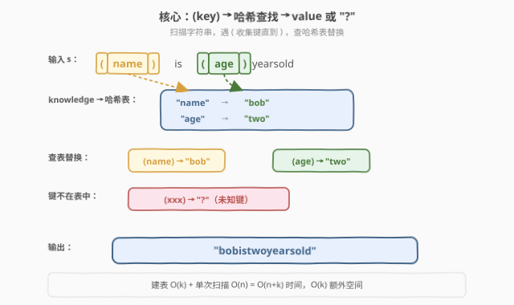
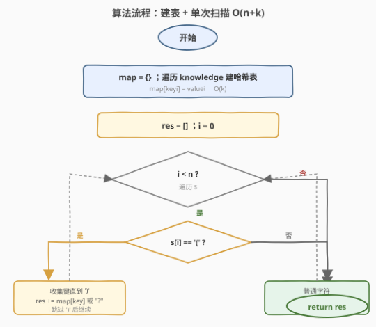
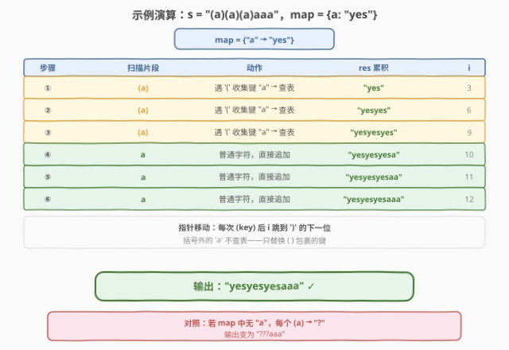

# 替换字符串中的括号内容

- **题目名称**：替换字符串中的括号内容
- **链接**：[1807. 替换字符串中的括号内容](https://leetcode.cn/problems/evaluate-the-bracket-pairs-of-a-string/)
- **难度**：中等
- **标签**：哈希表、字符串

## 1. 题目概述

给定一个字符串 `s`，它包含若干括号对，每个括号中包含一个**非空**的键。例如 `"(name)is(age)yearsold"` 中有两个括号对，分别包含键 `"name"` 和 `"age"`。

另给一个二维字符串数组 `knowledge`，其中 `knowledge[i] = [key_i, value_i]` 表示键 `key_i` 对应的值为 `value_i`。需要替换**所有**括号对：

- 键在 `knowledge` 中存在：将键和括号一起用对应值替换；
- 键不在 `knowledge` 中：将键和括号一起用 `"?"` 替换。

`s` 中**不会有嵌套括号**，且每个左括号都有对应的右括号。

**示例 1**：

```text
输入：s = "(name)is(age)yearsold", knowledge = [["name","bob"],["age","two"]]
输出："bobistwoyearsold"
解释："(name)" → "bob"，"(age)" → "two"
```

**示例 2**：

```text
输入：s = "hi(name)", knowledge = [["a","b"]]
输出："hi?"
解释：键 "name" 不在 knowledge 中，"(name)" → "?"
```

**示例 3**：

```text
输入：s = "(a)(a)(a)aaa", knowledge = [["a","yes"]]
输出："yesyesyesaaa"
解释：相同的键可能出现多次，括号外的 'a' 不被替换
```

**约束条件**：

- $1 \le s.length \le 10^5$
- $0 \le knowledge.length \le 10^5$
- $knowledge[i].length == 2$
- $1 \le key_i.length, value_i.length \le 10$
- `s` 只包含小写英文字母和 `'('` `')'`
- `s` 中每个 `'('` 都有对应的 `')'`，括号内键非空、无嵌套
- `key_i`、`value_i` 只含小写英文字母，`knowledge` 中键不重复

> 💡 **关键结构**：括号不嵌套 ⇒ 单次扫描即可定位每个 `(key)`；键不重复 ⇒ 用哈希表 $O(1)$ 查值。难点不在算法而在**避免反复字符串拼接**的 $O(n^2)$ 陷阱。

---

## 2. 解题思路

### 2.1 暴力思路

对每个出现的键，用 `string.replace` 全局替换。问题有二：① 需先从 `s` 中抽出所有键再逐一替换，逻辑绕；② `knowledge` 中不含的键无法靠 `replace` 处理（要替成 `"?"`），仍需扫描识别括号。更直接的暴力是：遇到 `'('` 就向后找 `')'`，切片得键，线性查 `knowledge` 找值——但线性查找使每次替换 $O(k)$，最坏 $O(n \cdot k)$，$n, k \le 10^5$ 时 $10^{10}$，**超时**。

> ⚠️ **症结**：① 逐个线性查表；② 用 `s += chunk` 在某些语言（如 C++ 旧实现、Python CPython 的 `+=` 对不可变字符串也涉及拷贝）中会因反复分配使整体退化为 $O(n^2)$。

### 2.2 核心观察：哈希表建索引 + 单次扫描 + 可变缓冲区



三个关键点把暴力优化到线性：

**① 哈希表建索引**：先把 `knowledge` 转成哈希表 `map[key] = value`，$O(k)$ 建表、$O(1)$ 查值，消除逐个线性查找。

**② 单次扫描 + 状态切换**：括号不嵌套，故只需一个游标 `i` 线性扫 `s`：

- 遇 `'('`：进入「收集键」模式，从 `i+1` 起读到 `')'`，切片得 `key`；
- 查 `map`：命中则追加 `value`，未命中则追加 `"?"`；
- 跳过 `')'`，游标 `i` 直接跳到 `')'` 的下一位；
- 遇普通字符：直接追加。

**③ 可变缓冲区追加**：用 `std::string`（C++）/ `list` 拼接（Python）作为结果缓冲，**只追加、不修改**已写入部分，避免反复拷贝。C++ `std::string::append` 均摊 $O(1)$；Python 可直接 `res += chunk`（CPython 对 `+=` 有就地优化）或用 `"".join(parts)`。

> 💡 **直觉理解**：把 `s` 想成一条流水线，括号是「需查表加工」的工位，其余字符直通。哈希表是工位旁的速查手册，一次翻到、即时出料。游标只在括号处停留，普通字符一掠而过。

### 2.3 算法流程图



具体步骤：

1. **建表**：遍历 `knowledge`，`map[key_i] = value_i`。
2. **初始化**：`res` 为空缓冲，游标 `i = 0`。
3. **扫描循环**（`i < n`）：
   - 若 `s[i] == '('`：令 `j = i + 1`，向后找到 `s[j] == ')'`；取 `key = s[i+1 : j]`；
     - `res += map.get(key, "?")`；
     - `i = j + 1`（跳过整段 `(key)`）。
   - 否则：`res += s[i]`；`i += 1`。
4. **返回** `res`。

> ⚠️ **细节**：找 `')'` 时用 `while s[j] != ')'` 而非 `find`——两者皆 $O(\text{键长})$，但手写循环更易控制游标跳跃。由于无嵌套，从 `'('` 起第一个 `')'` 即配对，无需栈。

### 2.4 示例演算

以 `s = "(a)(a)(a)aaa"`，`knowledge = [["a","yes"]]` 为例（`map = {"a": "yes"}`）：



| 步骤 | 扫描片段 | 动作 | res 累积 | i 跳到 |
|------|----------|------|----------|--------|
| ① | `(a)` | 收集键 "a" → 查表命中 "yes" | `"yes"` | 3 |
| ② | `(a)` | 同上 | `"yesyes"` | 6 |
| ③ | `(a)` | 同上 | `"yesyesyes"` | 9 |
| ④ | `a` | 普通字符，直接追加 | `"yesyesyesa"` | 10 |
| ⑤ | `a` | 普通字符，直接追加 | `"yesyesyesaa"` | 11 |
| ⑥ | `a` | 普通字符，直接追加 | `"yesyesyesaaa"` | 12（结束） |

> 💡 **对照**：若 `map` 中没有 `"a"`，三个 `(a)` 各替换成 `"?"`，输出变为 `"???aaa"`。注意括号**外**的 `'a'` 是普通字符，**不查表、不替换**——这是本题与「全文替换某字符」的关键区别。

---

## 3. 参考代码

### C++

```cpp
class Solution {
public:
    string evaluate(string s, vector<vector<string>>& knowledge) {
        unordered_map<string, string> mp;
        for (auto& kv : knowledge) {
            mp[kv[0]] = kv[1];
        }

        string res;
        res.reserve(s.size());
        int n = s.size();
        int i = 0;
        while (i < n) {
            if (s[i] == '(') {
                int j = i + 1;
                while (s[j] != ')') {
                    j++;
                }
                string key = s.substr(i + 1, j - i - 1);
                auto it = mp.find(key);
                res.append(it == mp.end() ? "?" : it->second);
                i = j + 1;
            } else {
                res.push_back(s[i]);
                i++;
            }
        }
        return res;
    }
};
```

### Python

```python
class Solution:
    def evaluate(self, s: str, knowledge: List[List[str]]) -> str:
        mp = {k: v for k, v in knowledge}

        res = []
        i, n = 0, len(s)
        while i < n:
            if s[i] == '(':
                j = s.find(')', i)
                key = s[i + 1:j]
                res.append(mp.get(key, "?"))
                i = j + 1
            else:
                res.append(s[i])
                i += 1
        return "".join(res)
```

> 💡 **实现细节**：① C++ 用 `res.reserve(s.size())` 预分配，减少 `append` 时的重分配；`append`/`push_back` 均摊 $O(1)$，整体 $O(n)$。② Python 用 `list` 收集片段再 `"".join`，避免对不可变字符串反复 `+=` 的潜在拷贝；`s.find(')', i)` 一步定位 `')'`，比手写 `while` 更简洁且同样 $O(\text{键长})$。③ 游标 `i` 在括号段直接跳到 `j + 1`，普通字符才 `i += 1`，保证每段只处理一次。

---

## 4. 复杂度分析

| 维度 | 复杂度 | 说明 |
|------|--------|------|
| 时间复杂度 | $O(n + k)$ | 建表遍历 `knowledge` 为 $O(k)$；扫描 `s` 时游标只在普通字符处 +1、在括号段跳到 `')'` 后，整体每个字符最多被访问常数次，为 $O(n)$；哈希查表每次 $O(1)$（键长 $\le 10$，哈希与比较为常数） |
| 空间复杂度 | $O(n + k)$ | 哈希表存 `knowledge` 占 $O(k)$（键值总长 $\le 2 \times 10^5$）；结果字符串占 $O(n)$；若不计输出则为 $O(k)$ |

> 💡 键长、值长均 $\le 10$，故哈希表单条记录为常数大小，$k$ 条共 $O(k)$。$n, k \le 10^5$，总体运算量在 $10^5$ 量级，远低于时限。

---

## 5. 扩展：状态机视角

单次扫描本质上是一个**两状态自动机**：

| 当前状态 | 输入字符 | 动作 | 下一状态 |
|----------|----------|------|----------|
| `PLAIN`（普通） | `'('` | 开始收集键 | `IN_KEY` |
| `PLAIN` | 其他 | 追加到 res | `PLAIN` |
| `IN_KEY`（键内） | `')'` | 查表替换、追加到 res | `PLAIN` |
| `IN_KEY` | 其他 | 累加到 key buffer | `IN_KEY` |

本题因「无嵌套括号」退化为两状态；若允许嵌套（如 `"(a(b)c)"`），则需栈结构维护层级，状态机也随之复杂化。这一视角把「括号配对」问题统一到自动机框架，便于迁移到括号匹配、表达式解析等场景。

---

## 6. 面试要点

**Q1：为什么用哈希表而不是排序后二分查找 `knowledge`？**

> 键不重复且只需「精确匹配取值」，哈希表 $O(1)$ 查找最优。二分需 $O(k \log k)$ 排序 + 每次 $O(\log k)$ 查找，对 $10^5$ 量级明显劣于哈希。只有当内存极紧或需范围查询时才考虑排序。

**Q2：游标 `i` 在括号段为什么直接跳到 `j + 1` 而不是 `i += 1`？**

> 整个 `(key)` 已被一次性替换为值，括号内的字符不应再被当作普通字符处理。若 `i += 1`，会把键名 `name` 的字母逐个追加到结果，产生错误输出。跳跃保证每段只处理一次，也是线性复杂度的保证。

**Q3：Python 中 `res += chunk` 与 `res.append` + `join` 哪个更好？**

> 对 CPython，`str +=` 因字符串不可变会创建新对象，最坏 $O(n^2)$；`list.append` 均摊 $O(1)$，最后 `"".join` 一次性拼接为 $O(n)$，总体 $O(n)$ 更稳。实际中 CPython 对 `+=` 有「单引用就地扩容」优化，但 `join` 写法更明确、无隐含依赖。

**Q4：括号不嵌套这个条件起到了什么作用？**

> 无嵌套 ⇒ 从 `'('` 起向后扫到的第一个 `')'` 必是其配对，无需栈记录层级，单变量 `j` 即可定位键。若允许嵌套，需用栈判断配对、且需定义「嵌套键如何求值」（递归替换？），复杂度显著上升。

**Q5：如果 `knowledge` 中同一键出现多次会怎样？**

> 题目保证不重复。若允许重复且取「最后一条」，建表时 `map[key] = value` 后写覆盖先写即得最后一条；若取「第一条」则需先判存在再写。本题无需处理。

---

## 7. 同类练习题

- [833. 字符串中的查找与替换](https://leetcode.cn/problems/find-and-replace-in-string/)（[题解](../0801-0900/833_字符串中的查找与替换.md)）：同为「按规则替换字符串片段」，但替换位置由索引数组给出，需排序后顺序应用，对照本题按括号结构驱动替换
- [890. 查找和替换模式](https://leetcode.cn/problems/find-and-replace-pattern/)（[题解](../0801-0900/890_查找和替换模式.md)）：字符串匹配替换的变体，核心是双射判定而非查表替换，对照「替换语义」的两种形态
- [205. 同构字符串](https://leetcode.cn/problems/isomorphic-strings/)（[题解](../0201-0300/205_同构字符串.md)）：同样是「键→值」映射，但任务是**判定**双射是否成立而非执行替换，映射方向对照
- [290. 单词规律](https://leetcode.cn/problems/word-pattern/)（[题解](../0201-0300/290_单词规律.md)）：205 的单词级版本，双向哈希双射判定，与本题的「单向查表替换」形成映射处理的对照视角
