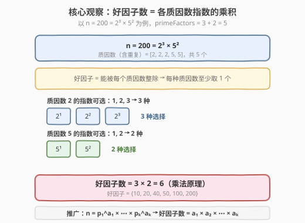
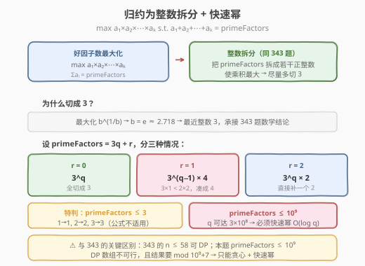
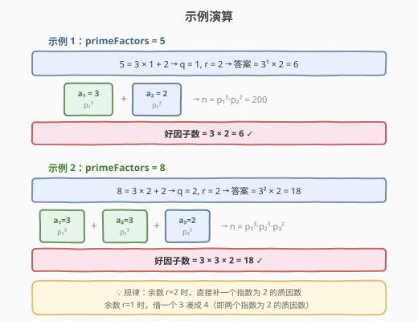

# 好因子的最大数目

- **题目名称**：好因子的最大数目
- **链接**：[1808. 好因子的最大数目](https://leetcode.cn/problems/maximize-number-of-nice-divisors/)
- **难度**：困难
- **标签**：数学、贪心、快速幂

## 1. 题目概述

给定正整数 `primeFactors`，需要构造一个正整数 $n$，满足：

- $n$ 的质因数总数（**含重复**）不超过 `primeFactors` 个；
- $n$ 的「好因子」数目最大化。

**好因子**定义：若 $n$ 的一个因子能被 $n$ 的**每一个质因数**整除，则称其为好因子。例如 $n = 12$，质因数为 $[2, 2, 3]$，则 $6 = 2 \times 3$ 和 $12 = 2 \times 2 \times 3$ 是好因子（都含至少一个 $2$ 和至少一个 $3$），但 $3$ 和 $4$ 不是。

返回好因子数目的最大值，对 $10^9 + 7$ 取余。

**示例 1**：

```text
输入：primeFactors = 5
输出：6
解释：n = 200 = 2³ × 5²，质因数 [2,2,2,5,5] 共 5 个；
      好因子 = {10, 20, 40, 50, 100, 200}，共 6 个。
```

**示例 2**：

```text
输入：primeFactors = 8
输出：18
```

**约束条件**：

- $1 \le \text{primeFactors} \le 10^9$

> 💡 **关键约束**：`primeFactors` 可达 $10^9$，意味着任何 $O(n)$ 或 $O(n^2)$ 的 DP 都不可行，只能走**数学贪心 + 快速幂**路线。这与 [343. 整数拆分](../0301-0400/343_整数拆分.md)（$n \le 58$）和剑指 Offer 14-II（$n \le 1000$ 取模）形成「同一思想、不同规模」的递进。

---

## 2. 解题思路

### 2.1 暴力思路

枚举所有可能的 $n$ 及其质因数分解，统计好因子数。问题有二：① $n$ 的取值无穷无尽，无法枚举；② 即使固定质因数个数，分配方案（各质因数的指数如何分）也是整数划分问题，方案数随 `primeFactors` 指数增长，$10^9$ 时完全不可行。

> ⚠️ **症结**：好因子数取决于各质因数指数的**分配方式**，而非质因数的具体取值——这提示我们应直接在「指数分配」层面建模，跳过 $n$ 本身。

### 2.2 核心观察：好因子数 = 各指数之乘积



设 $n = p_1^{a_1} \times p_2^{a_2} \times \cdots \times p_k^{a_k}$，其中 $p_i$ 为互异质数，$a_i \ge 1$。质因数总数（含重复）为 $a_1 + a_2 + \cdots + a_k \le \text{primeFactors}$。

**好因子的条件**：因子必须被**每个**质因数整除，即对每个 $p_i$，因子中 $p_i$ 的指数至少为 $1$。因此：

- $p_1$ 的指数可取 $1, 2, \ldots, a_1$ → 共 $a_1$ 种选择；
- $p_2$ 的指数可取 $1, 2, \ldots, a_2$ → 共 $a_2$ 种选择；
- ……
- $p_k$ 的指数可取 $1, 2, \ldots, a_k$ → 共 $a_k$ 种选择。

由**乘法原理**，好因子数目 $= a_1 \times a_2 \times \cdots \times a_k$。

> 💡 **以 $n = 200 = 2^3 \times 5^2$ 验证**：$2$ 的指数取 $1\sim3$（$3$ 种），$5$ 的指数取 $1\sim2$（$2$ 种），好因子 $= 3 \times 2 = 6$ 个 $\{10, 20, 40, 50, 100, 200\}$，与示例一致。

于是问题归约为：**在 $a_1 + a_2 + \cdots + a_k \le \text{primeFactors}$（各 $a_i \ge 1$）的约束下，最大化 $a_1 \times a_2 \times \cdots \times a_k$。**

**两个简化**：

1. **用满预算**：若 $\sum a_i < \text{primeFactors}$，可将剩余预算加到任意 $a_i$ 上，乘积只增不减，故最优解必有 $\sum a_i = \text{primeFactors}$。
2. **质数取值无关**：好因子数只依赖指数 $a_i$，与 $p_i$ 具体是哪个质数无关。我们可以把任意 $a_i$ 个预算分配给「某个新质数」——只要质数够多（质数无穷），分配方案不受限。

至此，问题等价于：**把正整数 `primeFactors` 拆成若干正整数之和，使乘积最大**——这正是 [343. 整数拆分](../0301-0400/343_整数拆分.md)。

### 2.3 归约为整数拆分 + 快速幂



承接 343 题的数学结论：最大化乘积的最优策略是**尽量多切 3**（因为 $e \approx 2.718$ 的最近整数是 $3$，$3^{1/3} > 2^{1/2} > 4^{1/4}$）。设 $\text{primeFactors} = 3q + r$（$r \in \{0, 1, 2\}$）：

| 余数 $r$ | 最优拆法 | 乘积（答案） | 说明 |
|----------|---------|-------------|------|
| $0$ | $q$ 个 $3$ | $3^q$ | 全切成 3 |
| $1$ | $q-1$ 个 $3$ + 一个 $4$ | $3^{q-1} \times 4$ | $3 \times 1 = 3 < 2 \times 2 = 4$，把一个 3 和余 1 凑成 4 |
| $2$ | $q$ 个 $3$ + 一个 $2$ | $3^q \times 2$ | 直接补一个 2 |

> ⚠️ **与 343 题的关键区别**：
>
> - 343 题要求 $k \ge 2$（至少拆两段），所以 $n = 2 \to 1, n = 3 \to 2$（拆反变小）。**本题没有「至少拆两段」的约束**——当 `primeFactors` 很小时，只分给一个质因数（$k = 1$）也是合法的，此时好因子数 $= a_1 = \text{primeFactors}$。故特判为：`primeFactors ≤ 3` 时直接返回 `primeFactors`。
> - 343 的 $n \le 58$，DP 可行；本题 `primeFactors ≤ 10^9`，$q$ 可达 $3 \times 10^8$，$3^q$ 是天文数字，**必须取模 + 快速幂**，$O(\log q)$ 计算。

### 2.4 示例演算



**示例 1**：`primeFactors = 5`

- $5 = 3 \times 1 + 2$ → $q = 1, r = 2$ → 答案 $= 3^1 \times 2 = 6$
- 对应 $n = p_1^3 \times p_2^2$（如 $2^3 \times 5^2 = 200$），好因子 $= 3 \times 2 = 6$ ✓

**示例 2**：`primeFactors = 8`

- $8 = 3 \times 2 + 2$ → $q = 2, r = 2$ → 答案 $= 3^2 \times 2 = 18$
- 对应 $n = p_1^3 \times p_2^3 \times p_3^2$，好因子 $= 3 \times 3 \times 2 = 18$ ✓

> 💡 **规律**：$r = 2$ 时补一个指数为 $2$ 的质因数；$r = 1$ 时借一个 $3$ 拆成 $2 + 2$（即两个指数为 $2$ 的质因数，乘积贡献 $4$ 而非 $3 \times 1 = 3$）。

---

## 3. 参考代码

### C++

```cpp
class Solution {
    const long long MOD = 1e9 + 7;

    long long quickPow(long long base, long long exp) {
        long long res = 1;
        base %= MOD;
        while (exp > 0) {
            if (exp & 1) res = res * base % MOD;
            base = base * base % MOD;
            exp >>= 1;
        }
        return res;
    }
public:
    int maxNiceDivisors(int primeFactors) {
        if (primeFactors <= 3) return primeFactors;
        int q = primeFactors / 3, r = primeFactors % 3;
        if (r == 0)      return quickPow(3, q);
        else if (r == 1) return quickPow(3, q - 1) * 4 % MOD;
        else             return quickPow(3, q) * 2 % MOD;
    }
};
```

### Python

```python
class Solution:
    def maxNiceDivisors(self, primeFactors: int) -> int:
        MOD = 10**9 + 7
        if primeFactors <= 3:
            return primeFactors
        q, r = divmod(primeFactors, 3)
        if r == 0:
            return pow(3, q, MOD)
        elif r == 1:
            return pow(3, q - 1, MOD) * 4 % MOD
        else:
            return pow(3, q, MOD) * 2 % MOD
```

> 💡 **实现细节**：① Python 内置 `pow(base, exp, mod)` 原生支持模快速幂，C 预实现底层用 Montgomery 乘法，比手写更快。② C++ 需手写快速幂，注意 `base %= MOD` 预处理防止首次相乘溢出（`long long` 范围内两数 $\le 10^9$ 相乘不溢出，但稳妥起见先取模）。③ `r == 1` 时 `q - 1` 不会为负：因为 `primeFactors >= 4` 且 `r == 1` 时 `primeFactors = 3q + 1 >= 4` → `q >= 1`，故 `q - 1 >= 0`。

---

## 4. 复杂度分析

| 维度 | 复杂度 | 说明 |
|------|--------|------|
| **时间复杂度** | $O(\log(\text{primeFactors}))$ | 快速幂计算 $3^q$，$q \le \text{primeFactors}/3 \le 3.3 \times 10^8$，循环次数 $\approx \log_2 q \le 29$ 次；其余为 $O(1)$ 整数运算 |
| **空间复杂度** | $O(1)$ | 只用常数个变量，无额外数据结构 |

> 💡 `primeFactors = 10^9` 时，快速幂仅约 $29$ 次迭代，远低于时限。对比 DP 的 $O(n)$ 或 $O(n^2)$ 在 $10^9$ 下完全不可行，体现了「数学降维」的威力。

---

## 5. 扩展：从 343 到 1808 的演进

本题与 [343. 整数拆分](../0301-0400/343_整数拆分.md)、剑指 Offer 14-II「剪绳子 II」构成一条完整的演进链：

| 题目 | 规模 | 是否取模 | 最优解法 | 关键差异 |
|------|------|---------|---------|---------|
| 343. 整数拆分 | $n \le 58$ | 否 | DP $O(n^2)$ / 贪心 $O(1)$ | 要求 $k \ge 2$，小值特判返回 $n - 1$ |
| 剑指 14-II 剪绳子 II | $n \le 1000$ | 是 | 贪心 + 快速幂 | DP 会溢出，贪心 + 取模 |
| **1808. 好因子** | $\le 10^9$ | 是 | **贪心 + 快速幂** | 无 $k \ge 2$ 约束，小值返回 $n$；需推导好因子数 $=$ 指数之积 |

**演进逻辑**：

1. **343** 是母题，DP 思路（枚举第一刀）是所有「切分型 DP」的模板，数学贪心（切 3 最优）给出 $O(1)$ 闭式解。
2. **剑指 14-II** 把 $n$ 放大到 $1000$ 并取模，DP 因中间值溢出而失效（即使最终取模，中间 `dp[i] = max(j*(i-j), j*dp[i-j])` 仍可能溢出 `int`），逼迫改用贪心 + 快速幂。
3. **1808** 进一步把规模推到 $10^9$，DP 连数组都开不出；同时引入「好因子」概念，要求先**数学建模**（好因子数 $=$ 指数乘积）再归约为整数拆分，多了一层抽象。

> 💡 **面试策略**：若面试官出本题，可先讲 343 的「切 3 最优」结论，再说明本题的两层转化（好因子 → 指数乘积 → 整数拆分），最后落地快速幂取模。一条完整思维链展示「建模 → 归约 → 实现」能力。

---

## 6. 面试要点

**Q1：好因子数目为什么等于各质因数指数的乘积？**

> 设 $n = p_1^{a_1} \times \cdots \times p_k^{a_k}$。好因子要求被每个 $p_i$ 整除，即因子中 $p_i$ 的指数 $\ge 1$。故 $p_i$ 的指数取值范围为 $\{1, 2, \ldots, a_i\}$，共 $a_i$ 种。各质因数独立（乘法原理），好因子总数 $= a_1 \times a_2 \times \cdots \times a_k$。关键在于「好因子的指数下界是 $1$ 而非 $0$」，区别于普通因子（下界 $0$，总数 $\prod(a_i + 1)$）。

**Q2：为什么最优解一定用满 `primeFactors` 个预算？**

> 若 $\sum a_i < \text{primeFactors}$，将剩余预算 $\Delta$ 加到任意 $a_i$ 上，该项从 $a_i$ 变为 $a_i + \Delta$，乘积从 $\ldots \times a_i \times \ldots$ 变为 $\ldots \times (a_i + \Delta) \times \ldots$，严格增大（因 $a_i \ge 1, \Delta \ge 1$）。故最优解必满足 $\sum a_i = \text{primeFactors}$。

**Q3：本题与 343 题的小值特判为何不同？**

> 343 题要求至少拆成两段（$k \ge 2$），所以 $n = 2 \to 1$（$1+1$）、$n = 3 \to 2$（$1+2$），拆反而变小。本题**无此约束**——`primeFactors = 1` 时令 $n = p^1$（单个质因数），好因子就是 $p$ 本身，数目为 $1$；`primeFactors = 3` 时令 $n = p^3$，好因子有 $p, p^2, p^3$ 共 $3$ 个。故 `primeFactors ≤ 3` 直接返回 `primeFactors`。

**Q4：为什么必须用快速幂，不能用循环连乘？**

> `primeFactors ≤ 10^9`，$q \le 3.3 \times 10^8$。循环连乘 $3^q$ 需 $3 \times 10^8$ 次迭代，超时；且中间值 $3^q$ 远超任何数值类型范围。快速幂 $O(\log q) \approx 29$ 次迭代，配合每次取模将中间值控制在 $10^{18}$ 以内（`long long` 范围），既高效又避免溢出。

**Q5：$r = 1$ 时为什么是 $3^{q-1} \times 4$ 而非 $3^q \times 1$？**

> 余数 $1$ 作为单独因子贡献乘以 $1$，不增不减；但若从 $q$ 个 $3$ 中借一个出来与余 $1$ 合成 $4 = 2 + 2$，代价是少一个 $3$（$\div 3$），收益是多了因子 $4$（$\times 4$），净增益 $4/3 > 1$。具体：$3^q \times 1 = 3^q$，而 $3^{q-1} \times 4 = 3^q \times \frac{4}{3} > 3^q$，故凑 $4$ 更优。注意 $q \ge 1$（因 `primeFactors ≥ 4` 且 $r = 1$），$q - 1 \ge 0$ 不会越界。

---

## 7. 同类练习题

- [343. 整数拆分](https://leetcode.cn/problems/integer-break/)（[题解](../0301-0400/343_整数拆分.md)）：本题的母题，$n \le 58$ 可 DP，数学贪心「切 3 最优」给出闭式解，1808 是其大规模取模 + 建模转化版
- [50. Pow(x, n)](https://leetcode.cn/problems/powx-n/)（[题解](../0001-0100/50_Powx_n.md)）：快速幂模板题，本题 $3^q \bmod 10^9{+}7$ 的核心工具，$O(\log n)$ 二进制分解指数
- [剑指 Offer 14-II. 剪绳子 II](https://leetcode.cn/problems/jian-sheng-zi-ii-lcof/)：343 的取模变体，$n \le 1000$，DP 中间值溢出逼迫改贪心 + 快速幂，是 343 到 1808 的中间过渡
- [29. 两数相除](https://leetcode.cn/problems/division/)（[题解](../0001-0100/29_两数相除.md)）：同为位运算加速数值计算（左移翻倍成倍减模拟除法），与快速幂的「二进制分解 + 累积」思想同源
