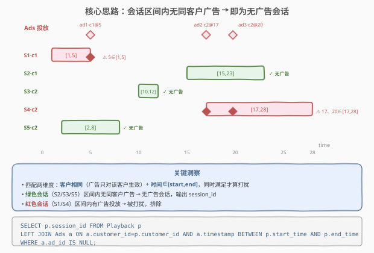
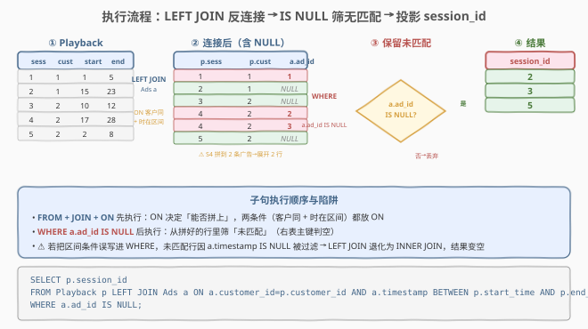
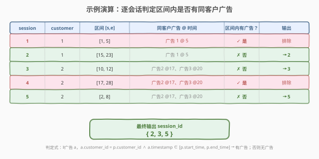

# LeetCode 没有广告的剧集 题解

## 1. 题目概述

- **标题 / 题号**：没有广告的剧集（#1809，easy）
- **链接**：https://leetcode.cn/problems/ad-free-sessions/
- **难度**：简单
- **标签**：SQL、多表连接、LEFT JOIN、反连接（Anti-Join）、`IS NULL`、区间判定

**题意**：给定两张表：

- `Playback`：记录用户的**观看会话**，每行包含会话编号、客户编号、会话起止时间。
- `Ads`：记录**广告投放**，每行包含广告编号、被投放客户、投放时间戳。

要求找出**没有被任何广告打扰的会话**——即对该会话所属客户，在会话时间区间 $[\text{start\_time}, \text{end\_time}]$ 内**没有**投放过任何广告。返回这些会话的 `session_id`。

**表结构**：

```text
Table: Playback
+-------------+---------+
| Column Name | Type    |
+-------------+---------+
| session_id  | int     |  ← 会话主键
| customer_id | int     |  ← 观看客户
| start_time  | int     |  ← 会话开始时间
| end_time    | int     |  ← 会话结束时间
+-------------+---------+
(session_id 是主键)

Table: Ads
+-------------+---------+
| Column Name | Type    |
+-------------+---------+
| ad_id       | int     |  ← 广告主键
| customer_id | int     |  ← 被投放客户
| timestamp   | int     |  ← 广告投放时间
+-------------+---------+
(ad_id 是主键)
```

> ⚠️ **匹配维度有两个**：① **客户相同**——广告只对该客户生效，跨客户的广告不算打扰该会话；② **时间落在区间内**——`timestamp` 必须 $\in [\text{start\_time}, \text{end\_time}]$（闭区间）。两个条件**同时**满足才算「该会话被打扰」。要找的是**不满足**任何一条匹配的会话。

**示例 1**：

```text
输入：
Playback 表:
+------------+-------------+------------+----------+
| session_id | customer_id | start_time | end_time |
+------------+-------------+------------+----------+
| 1          | 1           | 1          | 5        |
| 2          | 1           | 15         | 23       |
| 3          | 2           | 10         | 12       |
| 4          | 2           | 17         | 28       |
| 5          | 2           | 2          | 8        |
+------------+-------------+------------+----------+

Ads 表:
+-------+-------------+-----------+
| ad_id | customer_id | timestamp |
+-------+-------------+-----------+
| 1     | 1           | 5         |
| 2     | 2           | 17        |
| 3     | 2           | 20        |
+-------+-------------+-----------+

输出：
+------------+
| session_id |
+------------+
| 2          |
| 3          |
| 5          |
+------------+
```

**解释**：

| session_id | customer | 区间 | 同客户广告及时间戳 | 区间内是否有广告？ | 结论 |
|------------|----------|------|--------------------|--------------------|------|
| 1 | 1 | $[1,5]$ | 广告 1 @ 5 | ✓（5 ∈ [1,5]） | 打扰 → 排除 |
| 2 | 1 | $[15,23]$ | 广告 1 @ 5 | ✗（5 ∉ [15,23]） | **无广告 → 保留** |
| 3 | 2 | $[10,12]$ | 广告 2 @ 17、广告 3 @ 20 | ✗（均不在区间） | **无广告 → 保留** |
| 4 | 2 | $[17,28]$ | 广告 2 @ 17、广告 3 @ 20 | ✓（17、20 ∈ [17,28]） | 打扰 → 排除 |
| 5 | 2 | $[2,8]$ | 广告 2 @ 17、广告 3 @ 20 | ✗（均不在区间） | **无广告 → 保留** |

最终输出 `session_id = {2, 3, 5}`。

**约束**：

- `session_id`、`ad_id` 分别为两表主键，行唯一无重复。
- `1 <= start_time <= end_time`，时间戳为正整数。
- 结果可按任意顺序返回，仅需输出 `session_id` 列。

> 💡 **关键结构**：本题是 SQL **"多表反连接（Anti-Join）+ 区间判定"** 招牌题——核心是 `LEFT JOIN` 配 `IS NULL` 找「匹配不到」的行，匹配条件含**等值（客户相同）**与**区间（时间落在 [start, end]）**两维。考点不在写法多花哨，而在三件事：① 把「无广告」翻译成「找不到匹配广告」的反连接；② 匹配条件必须**同时**约束客户与时间区间；③ 区间用 `BETWEEN`（闭区间）还是 `<`/`>` 的取舍。

## 2. 解题思路

### 2.1 暴力思路：相关子查询逐会话判定

最直觉的过程式思维是：对 `Playback` 的每个会话，去 `Ads` 表里扫描所有同 `customer_id` 的广告，看是否有 `timestamp` 落在 $[\text{start\_time}, \text{end\_time}]$ 内；若一个都没有，则该会话无广告。

```text
result = []
for p in Playback:
    has_ad = False
    for a in Ads:
        if a.customer_id == p.customer_id and p.start_time <= a.timestamp <= p.end_time:
            has_ad = True
            break
    if not has_ad:
        result.append(p.session_id)
return result
```

转成 SQL 即「相关子查询 + `NOT EXISTS`」。逻辑正确，但**纯迭代视角**容易让人忽略「跨客户的广告不应匹配」这一过滤——若 `ON`/`WHERE` 漏写 `customer_id` 相等条件，会把别家客户的广告也算作打扰，结果错位。

> ⚠️ **症结**：① 嵌套循环最坏 $O(|P| \cdot |A|)$，数据量大时慢；② 匹配条件是**复合**的（等值 + 区间），漏任一项都错。SQL 的连接语义能把这两件事一次性表达清楚。

### 2.2 核心观察：LEFT JOIN + IS NULL（反连接）



把「**找不到匹配广告**」直接写成 `LEFT JOIN ... WHERE 右表.键 IS NULL`——这是 SQL 中 **Anti-Join（反连接）** 的标准模式：

- `LEFT JOIN Ads a ON a.customer_id = p.customer_id AND a.timestamp BETWEEN p.start_time AND p.end_time`：对每个会话，尝试拼接「同客户且时间落在区间内」的广告。匹配不到时，右表字段全部填 `NULL`。
- `WHERE a.ad_id IS NULL`：只保留**没拼到广告**的会话——这正是「无广告打扰」的会话。

**匹配条件的两维度**写在 `ON` 子句里（不是 `WHERE`！），缺一不可：

| 维度 | `ON` 中的条件 | 含义 |
|------|---------------|------|
| 客户相同 | `a.customer_id = p.customer_id` | 广告只对该客户生效，跨客户广告不算 |
| 时间在区间 | `a.timestamp BETWEEN p.start_time AND p.end_time` | 广告投放时间落在会话起止之间（闭区间） |

> ⚠️ **`ON` vs `WHERE` 的区别（关键陷阱）**：对外连接，条件写在 `ON` 里只影响**连接匹配**，写错位置会改变语义。若把 `a.timestamp BETWEEN ...` 误写到 `WHERE`，`LEFT JOIN` 会退化为 `INNER JOIN`——所有右表为 `NULL` 的行（本该保留的无广告会话）因 `a.timestamp IS NULL` 不满足 `WHERE` 而被全部过滤，结果变空。**反连接的匹配条件必须放 `ON`，筛选「无匹配」用 `WHERE 右表.键 IS NULL`**。

> 💡 **直觉理解**：把每个会话想成一段录像带 $[\text{start}, \text{end}]$，广告是录像带上按时间戳贴的红色标签。`LEFT JOIN` 是「给每段录像带尝试贴上同客户的广告标签」；贴不上的（右表 `NULL`）就是干净录像带——无广告会话。

### 2.3 算法流程图



**逻辑执行步骤**：

| 步骤 | 子句 | 作用 |
|------|------|------|
| ① | `FROM Playback p` | 读取全部会话 |
| ② | `LEFT JOIN Ads a ON a.customer_id = p.customer_id AND a.timestamp BETWEEN p.start_time AND p.end_time` | 对每个会话，匹配同客户且时间在区间的广告；匹配不到则右表全 `NULL` |
| ③ | `WHERE a.ad_id IS NULL` | 只保留没匹配到广告的会话（反连接） |
| ④ | `SELECT p.session_id` | 投影会话编号 |

> 💡 **SQL 子句执行顺序**：`FROM`（含 `JOIN`/`ON`）→ `WHERE` → `GROUP BY` → `HAVING` → `SELECT` → `ORDER BY` → `LIMIT`。`ON` 在 `JOIN` 阶段先决定哪些行能拼上；`WHERE` 再对拼好的行做筛选。`a.ad_id IS NULL` 必须在 `WHERE`，且依赖 `LEFT JOIN` 保留的未匹配行——这是反连接能成立的基石。

### 2.4 示例演算

以示例 1 数据为例，观察 `LEFT JOIN` 逐会话的匹配结果：



**步骤 ①②：`LEFT JOIN Ads` 匹配**

| p.session_id | p.customer | p.区间 | 拼上的广告 a.ad_id | 右表状态 |
|--------------|------------|--------|---------------------|----------|
| 1 | 1 | $[1,5]$ | 1（@5，同客户 1，5∈[1,5]） | 非 `NULL`（匹配到） |
| 2 | 1 | $[15,23]$ | —（广告 1 @5 不在 [15,23]） | `NULL`（未匹配） |
| 3 | 2 | $[10,12]$ | —（广告 2@17、3@20 均不在 [10,12]） | `NULL`（未匹配） |
| 4 | 2 | $[17,28]$ | 2（@17）、3（@20） | 非 `NULL`（匹配到，且一行展开为两行） |
| 5 | 2 | $[2,8]$ | —（17、20 均不在 [2,8]） | `NULL`（未匹配） |

> ⚠️ 会话 4 拼到 2 条广告，`LEFT JOIN` 会把它**展开成两行**（每个匹配一行）。这不影响结果——后面 `WHERE a.ad_id IS NULL` 会把这两行都过滤掉（因为 `a.ad_id` 非 `NULL`）。

**步骤 ③：`WHERE a.ad_id IS NULL`**

只保留右表为 `NULL` 的行 → 会话 2、3、5。

**步骤 ④：`SELECT p.session_id`**

| session_id |
|------------|
| 2          |
| 3          |
| 5          |

与示例输出一致。

> 💡 **对照**：若误把时间条件写进 `WHERE` 而非 `ON`，会话 2/3/5 因右表 `NULL`、`a.timestamp` 不满足 `BETWEEN` 而被过滤，结果变空——这是反连接最常见的踩坑点。

## 3. 参考代码

### SQL（解法 A：LEFT JOIN + IS NULL，推荐）

```sql
SELECT p.session_id
FROM Playback p
LEFT JOIN Ads a
    ON a.customer_id = p.customer_id
   AND a.timestamp BETWEEN p.start_time AND p.end_time
WHERE a.ad_id IS NULL;
```

> 💡 **写法要点**：
> - `LEFT JOIN`：保留所有会话，匹配不到广告时右表填 `NULL`。
> - `ON` 含**两个**条件：客户相同 + 时间在区间。两者都放 `ON`，不能放 `WHERE`。
> - `WHERE a.ad_id IS NULL`：用右表主键判空，筛出未匹配的会话。用主键 `ad_id` 比 `timestamp` 更稳妥（语义明确「无匹配行」）。
> - `BETWEEN` 是闭区间（含两端），与题意「区间内」一致；示例会话 1 @ 时间 5 落在 $[1,5]$ 端点即被算作打扰。
> - ✓ **最自然**：一条 `LEFT JOIN` 把「匹配 + 反筛选」一气呵成，可读性最佳。

### SQL（解法 B：NOT EXISTS 相关子查询）

```sql
SELECT session_id
FROM Playback p
WHERE NOT EXISTS (
    SELECT 1
    FROM Ads a
    WHERE a.customer_id = p.customer_id
      AND a.timestamp BETWEEN p.start_time AND p.end_time
);
```

> 💡 **与解法 A 的区别**：`NOT EXISTS` 把「无广告」直接表达为「不存在匹配的广告行」，语义最贴近自然语言。现代优化器通常会把 `LEFT JOIN ... IS NULL` 与 `NOT EXISTS` 优化成**相同的 Anti-Join 执行计划**，性能等价。`SELECT 1` 表示只判存在性、不取实际列，是 `EXISTS` 子查询的习惯写法。可读性上 `NOT EXISTS` 更直白地表达「否定」，面试中推荐用它讲清思路。

### SQL（解法 C：NOT IN 子查询）

```sql
SELECT session_id
FROM Playback
WHERE session_id NOT IN (
    SELECT p.session_id
    FROM Playback p
    JOIN Ads a
      ON a.customer_id = p.customer_id
     AND a.timestamp BETWEEN p.start_time AND p.end_time
);
```

> 💡 **写法要点**：先在子查询里找出「被打扰的会话」集合（`INNER JOIN` 取交集），外层用 `NOT IN` 取补集。逻辑正确，但要注意 **`NOT IN` 与 `NULL` 的陷阱**：若子查询结果含 `NULL`，`x NOT IN (..., NULL, ...)` 恒为 `UNKNOWN`，会把所有行过滤掉。本题 `session_id` 为主键非空，子查询投影的也是 `session_id`，故安全；但工程实践中 `NOT EXISTS` 更稳健——它不受 `NULL` 影响。面试答：「`NOT IN` 要确保子查询列非空，否则用 `NOT EXISTS`。」

### Python（pandas）

```python
import pandas as pd

def ad_free_sessions(playback: pd.DataFrame, ads: pd.DataFrame) -> pd.DataFrame:
    merged = playback.merge(
        ads,
        how='left',
        left_on='customer_id',
        right_on='customer_id',
        suffixes=('', '_ad'),
    )
    in_session = (merged['timestamp'] >= merged['start_time']) & (merged['timestamp'] <= merged['end_time'])
    merged.loc[~in_session, 'ad_id'] = None
    has_ad = merged.groupby('session_id')['ad_id'].apply(lambda s: s.notna().any())
    ad_free = has_ad[~has_ad].index
    return pd.DataFrame({'session_id': ad_free.tolist()})
```

> 💡 **pandas 对照**：`merge(..., how='left')` 对应 `LEFT JOIN`；左连接后，对不满足区间条件的匹配行手动把 `ad_id` 置 `None`（模拟「该广告不算匹配」）；再按 `session_id` 分组判「是否存在非空 `ad_id`」，取反即为无广告会话。pandas 没有原生的 `ON a.timestamp BETWEEN ...` 连接，故需合并后再用布尔条件过滤匹配——这是 pandas 表达非等值连接的通用模式。

## 4. 复杂度分析

| 维度 | 复杂度 | 说明 |
|------|--------|------|
| **时间** | $O(|P| \cdot |A|)$ 最坏；有索引时更优 | 无索引时，`LEFT JOIN`/`NOT EXISTS` 对每个会话扫描 `Ads` 同客户行，最坏两表乘积。若 `Ads(customer_id, timestamp)` 建复合索引，可降至 $O(|P| \cdot \log |A|)$ 或 $O(|P| + |A|)$ |
| **空间** | $O(|P| + |A|)$ | 连接中间结果大小取决于匹配行数；最坏展开为 $O(|P| \cdot |A|)$，但反连接只需保留未匹配的会话，输出 $O(|P|)$ |
| **结果行数** | $\le |P|$ | 无广告会话数不超过会话总数 |

> ⚠️ SQL 复杂度取决于**执行计划与索引**。本题数据规模小，三种写法性能相当。工程中建议在 `Ads(customer_id, timestamp)` 上建复合索引，使「同客户 + 时间区间」查询走索引范围扫描，避免全表乘积。面试中说明「最坏两表乘积 $O(|P| \cdot |A|)$，可用 `Ads(customer_id, timestamp)` 复合索引优化」即可。

## 5. 扩展：反连接三写法对比

### 5.1 LEFT JOIN + IS NULL vs NOT EXISTS vs NOT IN

| 维度 | `LEFT JOIN ... IS NULL` | `NOT EXISTS` | `NOT IN` |
|------|--------------------------|--------------|----------|
| **语义** | 左连接后取右表为 `NULL` 的行 | 不存在匹配子查询行 | 不在子查询结果集合中 |
| **NULL 安全** | ✓ 安全 | ✓ 安全 | ⚠️ 子查询含 `NULL` 时失效 |
| **可读性** | 需理解 Anti-Join 模式 | 最贴近自然语言「不存在」 | 直白「不在...中」 |
| **执行计划** | Anti-Join | 通常与左连接反连接等价 | 可能展开为 Anti-Semi-Join |
| **非等值条件** | 直接放 `ON` | 直接放 `WHERE` | 子查询内 `JOIN` 表达 |
| **推荐场景** | 通用，连接条件复杂时清晰 | 否定语义、`NULL` 稳健 | 子查询列为非空主键时 |

> 💡 **选择口诀**：**否定语义用 `NOT EXISTS`，连接式反连接用 `LEFT JOIN + IS NULL`，确保非空时可用 `NOT IN`**。本题三种写法等价，`NOT EXISTS` 语义最贴近题意「无广告」，`LEFT JOIN` 把匹配条件集中放 `ON` 最清晰。面试中能讲清三者差异与 `NULL` 陷阱即可。

### 5.2 区间判定的边界

| 写法 | 区间类型 | 是否含端点 |
|------|----------|------------|
| `a.timestamp BETWEEN p.start_time AND p.end_time` | 闭区间 $[s, e]$ | 含两端 |
| `a.timestamp >= p.start_time AND a.timestamp <= p.end_time` | 闭区间 $[s, e]$ | 含两端（与 `BETWEEN` 等价） |
| `a.timestamp > p.start_time AND a.timestamp < p.end_time` | 开区间 $(s, e)$ | 不含两端 |

> 💡 本题按**闭区间**处理（会话 1 在时间 5 落在 $[1,5]$ 端点算打扰）。`BETWEEN` 与 `>= ... AND <=` 完全等价，`BETWEEN` 更简洁；面试中若题目对端点有歧义，主动确认「区间含不含端点」是加分项。

## 6. 面试要点

1. **为什么用 `LEFT JOIN` 而不是 `INNER JOIN`？**

   - 要找的是「**没有**匹配广告」的会话。`INNER JOIN` 只保留能匹配上的行，会直接丢掉无广告会话——结果恰好反了。`LEFT JOIN` 保留所有会话、匹配不到时右表填 `NULL`，再用 `WHERE a.ad_id IS NULL` 筛出这些「未匹配」行。这是反连接的标准骨架：**外连接 + 右表判空**。

2. **时间区间条件为什么必须放 `ON` 而不是 `WHERE`？**

   - 对**外连接**，`ON` 只决定「能否拼上」，`WHERE` 决定「拼好后保留哪些」。若把 `a.timestamp BETWEEN ...` 写进 `WHERE`，所有右表为 `NULL` 的未匹配行因 `a.timestamp IS NULL` 不满足 `BETWEEN` 会被过滤，`LEFT JOIN` 退化成 `INNER JOIN`，无广告会话全部丢失。**反连接的匹配条件放 `ON`，判空放 `WHERE`**，这是本题最大的陷阱。

3. **`NOT EXISTS` 和 `LEFT JOIN ... IS NULL` 哪个性能更好？**

   - 现代优化器（如 MySQL 8、PostgreSQL）通常把两者优化成**相同的 Anti-Join 执行计划**，性能等价。选择更多看可读性：`NOT EXISTS` 直接表达「不存在」，语义贴近自然语言；`LEFT JOIN ... IS NULL` 把所有匹配条件集中放 `ON`，连接关系更清晰。工程中两者皆可，按团队习惯选。

4. **`NOT IN` 的 `NULL` 陷阱是什么？**

   - 若子查询结果含 `NULL`，`x NOT IN (a, b, NULL)` 等价于 `x != a AND x != b AND x != NULL`，最后一项是 `UNKNOWN`，导致整个谓词对任何 `x` 都非 `TRUE`，结果集变空。本题子查询投影 `session_id`（主键非空），故安全；但若子查询列可能为 `NULL`，必须改用 `NOT EXISTS` 或加 `WHERE col IS NOT NULL`。

5. **如果 `Ads` 表很大，如何优化？**

   - 建 `Ads(customer_id, timestamp)` 复合索引：对每个会话，按 `customer_id` 等值定位 + `timestamp` 范围扫描，避免遍历全部广告，把 $O(|P| \cdot |A|)$ 降为 $O(|P| \cdot \log |A| + \text{匹配数})$。进一步可对 `Playback` 按 `customer_id` 分桶，使同客户会话连续处理，提升缓存命中。面试中提到「复合索引覆盖等值 + 区间两维」即可。

> 💡 **一句话总结**：1809 是 SQL **"反连接 + 区间判定"入门招牌题**——核心就一句 `LEFT JOIN Ads ON 客户相同 AND 时间在区间 WHERE a.ad_id IS NULL`。考点覆盖三件事：**反连接（外连接 + 右表判空找「无匹配」）、复合匹配条件（等值 + 区间同放 ON）、ON 与 WHERE 的语义差异（写错位置连接退化）**。掌握这条骨架，所有「找不匹配」类 SQL 题都能迁移。

## 同类练习题

| # | 题目 | 与本题的关联 |
|---|------|-------------|
| 1148 | [文章浏览 I](https://leetcode.cn/problems/article-views-i/)（[题解](../1101-1200/1148_文章浏览I.md)） | SQL 基础过滤去重招牌题——`WHERE` 等值 + `DISTINCT`，对照 1809 的「反连接找无匹配」，理解正向筛选与反向反连接的边界 |
| 570 | [至少有 5 名直接下属的经理](https://leetcode.cn/problems/managers-with-at-least-5-direct-reports/) | `GROUP BY` + `HAVING` 聚合筛选——正向统计型多表查询，对照 1809 的反连接否定型 |
| 577 | [员工奖金](https://leetcode.cn/problems/employee-bonus/) | `LEFT JOIN` + `IS NULL` 找「没有奖金」的员工——与 1809 同为反连接骨架，但匹配条件只有等值、无区间，是 1809 的退化入门版 |
| 1068 | [产品销售分析 I](https://leetcode.cn/problems/product-sales-analysis-i/) | `LEFT JOIN` 多表关联 + 投影——对照 1809 理解「外连接用于补齐」与「外连接用于反筛选」两种用法 |
| 197 | [上升的温度](https://leetcode.cn/problems/rising-temperature/) | `JOIN` + 非等值条件（`DATEDIFF` + `>`）——与 1809 共享「非等值匹配条件」的写法，对照日期型非等值与数值区间型非等值 |
