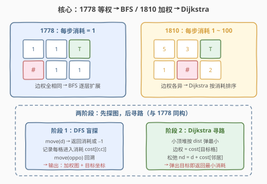
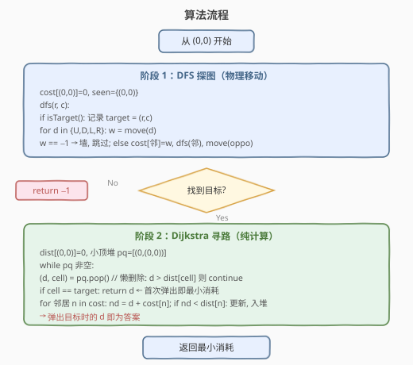
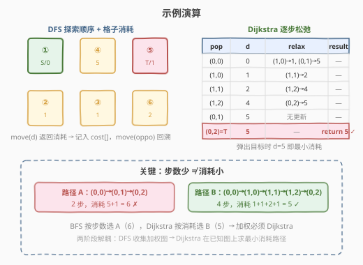

# LeetCode 隐藏网格下的最小消耗路径 题解

## 1. 题目概述

- **标题 / 题号**：隐藏网格下的最小消耗路径（#1810，medium）
- **链接**：https://leetcode.cn/problems/minimum-path-cost-in-a-hidden-grid/
- **难度**：中等
- **标签**：深度优先搜索、最短路、堆（优先队列）、交互

**题意**：这是一道**交互题**，也是 [1778. 未知网格中的最短路径](../1701-1800/1778_未知网格中的最短路径.md) 的**加权升级版**。在一个未知的网格中，机器人从 $(0, 0)$ 出发，目标是到达网格中的**目标格**，且要求路径**总消耗最小**。

与 1778 的关键差异：每一步移动不再消耗固定 $1$ 步，而是有一个 **$1 \sim 100$ 的可变消耗**——因此「最少步数」不再等于「最小消耗」，BFS 失效，需改用 **Dijkstra**。

**GridMaster 接口**：

| 方法 | 说明 |
|------|------|
| `move(direction)` | 尝试向该方向移动。若邻格可通行（空地或目标），**移动并返回进入该格的消耗**（$1 \sim 100$）；若不可通行（墙壁或越界），返回 $-1$ 且**不移动** |
| `isTarget()` | 返回机器人**当前所在格**是否为目标格 |

`direction` 取值为 `'U'`（上）、`'D'`（下）、`'L'`（左）、`'R'`（右），对应行列增量 $(-1,0), (1,0), (0,-1), (0,1)$。

> 💡 **与 1778 接口对比**：1778 用 `canMove(d)`（只检测不移动）+ `move(d)`（移动，假设可通行）两个方法；1810 合并为单一 `move(d)`——返回 $-1$ 表示不可通行（等同于 `canMove == False`），返回正数表示消耗（同时完成移动）。一次调用同时获取「可通行性」与「消耗」，更紧凑。

**目标**：返回从 $(0, 0)$ 到目标格的**最小总消耗**；若目标格不可达，返回 $-1$。

**网格类型**：

- 空地：可通行，有一个 $1 \sim 100$ 的进入消耗
- 墙壁 `'#'`：不可通行，`move` 返回 $-1$
- 目标格：可通行，也有进入消耗，`isTarget()` 返回 `True`
- 起始格 $(0, 0)$：始终是空地，消耗为 $0$（从不需要「进入」起点）

**约束**：

- 网格行列数有上限（但对解题者不可见）
- 每个可通行格的进入消耗 $1 \le \text{cost} \le 100$
- 网格中至多一个目标格
- 起始格 $(0, 0)$ 始终是空地，不是目标格
- `move`、`isTarget` 的调用总次数有上限

**示例**（隐藏网格，解题者不可见）：

```text
网格（数字 = 进入消耗，# = 墙）：
0  5  1!       ← (0,0)=起点消耗0  (0,1)=消耗5  (0,2)=目标消耗1
1  1  2        ← (1,0)=消耗1      (1,1)=消耗1  (1,2)=消耗2

输出：5
解释：
  路径A：(0,0)→(0,1)→(0,2)      2步，消耗 5+1 = 6
  路径B：(0,0)→(1,0)→(1,1)→(1,2)→(0,2)  4步，消耗 1+1+2+1 = 5  ← 最优
  路径B 步数更多但消耗更小 → BFS 失效，必须 Dijkstra
```

> 💡 **关键特征**：网格对解题者**完全不可见**，且边权**各不相同**。这与 1778 的双重差异——不可见（需探图）+ 加权（需 Dijkstra）——构成了本题的核心挑战。

## 2. 解题思路

### 2.1 暴力思路：直接在未知网格上 BFS

继承 [1778](../1701-1800/1778_未知网格中的最短路径.md) 的分析，直接 BFS 面临两个层面的困难：

**① 探图层面**（与 1778 相同）：BFS 出队节点与机器人物理位置脱节，无法「随机访问」节点来扩展邻居。`move(d)` 只能在机器人位于当前格时检测邻格，BFS 的 FIFO 顺序与物理移动约束根本不兼容。

**② 寻路层面**（1810 独有）：即使网格已知，BFS 也只能找**最少步数**路径，而非**最小消耗**路径。上例中路径 A（2 步，消耗 6）步数更少，但路径 B（4 步，消耗 5）消耗更小。BFS 逐层扩展的前提是「所有边权相等」，一旦边权各异，先弹出的不一定是最优的。

> ⚠️ **双重症结**：① 未知网格要求先物理探索（BFS 不兼容）；② 加权边权要求按消耗排序（BFS 的 FIFO 不保证消耗递增）。两个困难叠加，BFS 在两个阶段都不适用。

### 2.2 核心观察：DFS 探图 + Dijkstra 寻路



破解之道与 1778 一脉相承——**将探索与寻路解耦**为两个独立阶段，但寻路阶段从 BFS **升级为 Dijkstra**：

**阶段 1：DFS 盲探（物理移动）**

DFS 的核心优势与 1778 完全一致——**自然回溯**。不同之处在于 `move(d)` 一次调用同时完成「检测 + 移动 + 返回消耗」：

1. 对每个方向调用 `move(d)`：
   - 返回 $-1$ → 邻格是墙或越界，标记已探，跳过（机器人未移动）。
   - 返回正数 $w$ → 机器人**已移到**邻格，记录 `cost[(nr,nc)] = w`（进入该格的消耗）。
2. 递归 `dfs(邻格)` 探索完后，`move(oppo[d])` 回溯到当前格。
3. 用 `isTarget()` 标记目标位置。

> 💡 **`move` 返回值的双重含义**：$-1$ = 不可通行（等同于 1778 的 `canMove == False`），正数 = 可通行且消耗为此值（等同于 1778 的 `canMove == True` + 移动）。因此 1810 **不需要 `canMove`**——一次 `move` 调用同时获取了可通行性与消耗，更高效。

**阶段 2：Dijkstra 寻路（纯计算）**

有了 `cost` 字典（每个可达格的进入消耗）和目标坐标后，加权地图完全已知。此时在已知图上跑 **Dijkstra**：

- **节点**：每个可达格 $(r, c)$。
- **边权**：从 $(r,c)$ 到相邻可达格 $(nr,nc)$ 的边权 $= \text{cost}[(nr,nc)]$（进入目标格的消耗）。
- **起点**：$(0,0)$，$\text{dist}[(0,0)] = 0$（起点不需要「进入」）。
- **目标**：首次从堆中弹出目标格时，`dist` 即为最小消耗。

> 💡 **为何 Dijkstra 而非 BFS？** BFS 的 FIFO 要求「先入队 = 先弹出 = 距离更小」，这在等权图（1778）中成立。但 1810 的边权 $1 \sim 100$ 各异——步数少的路径可能消耗更大。Dijkstra 用小顶堆保证**按 dist 升序弹出**，首次弹出某格时 dist 必为最小值，这是加权最短路的核心保证。

### 2.3 算法流程图



**阶段 1 详细流程**：

1. 初始化 `cost = {(0,0): 0}`，`seen = {(0,0)}`，`target = None`。
2. 调用 `dfs(0, 0)`：
   - 若 `isTarget()` 为 `True`，记录 `target = (r, c)`。
   - 对每个方向 $d \in \{U, D, L, R\}$：
     - 计算邻居 $(n_r, n_c)$。
     - 若 $(n_r, n_c) \notin \text{seen}$：
       - 将 $(n_r, n_c)$ 加入 `seen`（无论墙或路，都标记已探，避免重复 `move`）。
       - $w = \text{move}(d)$。
       - 若 $w == -1$：墙，跳过（机器人未移动）。
       - 若 $w > 0$：`cost[(n_r, n_c)] = w`，递归 `dfs(n_r, n_c)`，然后 `move(oppo[d])` 回溯。
3. DFS 结束后，机器人回到 $(0,0)$，`cost` 包含所有可达格及其消耗。

**阶段 2 详细流程**：

4. 若 `target is None`，返回 $-1$。
5. Dijkstra：`pq = [(0, (0,0))]`，`dist = {(0,0): 0}`。
6. 弹出 $(d, \text{cell})$，若 $d > \text{dist}[\text{cell}]$（懒删除，跳过过期记录）。
7. 若 $\text{cell} == \text{target}$，返回 $d$（首次弹出即最小消耗）。
8. 对 4 方向邻居 $(n_r, n_c)$：若在 `cost` 中，$n_d = d + \text{cost}[(n_r, n_c)]$；若 $n_d < \text{dist}[\text{邻居}]$，更新并入堆。
9. 队列空仍未到达 → 返回 $-1$。

### 2.4 示例演算

以隐藏网格 $\begin{bmatrix} 0 & 5 & 1_T \\ 1 & 1 & 2 \end{bmatrix}$ 为例，起点 $(0,0)$，目标 $(0,2)$。



**阶段 1：DFS 探索**

| 步骤 | 动作 | 机器人位置 | 记录 |
|------|------|-----------|------|
| ① | 起点 | $(0,0)$ | `cost[(0,0)]=0` |
| ② | `move('D')` → $1$ | $(1,0)$ | `cost[(1,0)]=1` |
| ③ | `move('R')` → $1$ | $(1,1)$ | `cost[(1,1)]=1` |
| ④ | `move('U')` → $5$ | $(0,1)$ | `cost[(0,1)]=5` |
| ⑤ | `move('R')` → $1$ | $(0,2)$ | `isTarget()` → **True**，`target=(0,2)` |
| ⑥ | `move('D')` → $2$ | $(1,2)$ | `cost[(1,2)]=2` |
| | 回溯 `move('U')`→`move('L')`→`move('D')`→`move('L')`→`move('U')` | $(0,0)$ | 机器人回到起点 ✓ |

> ⚠️ **回溯的 `move` 也有返回值**：从 $(1,2)$ 回溯到 $(0,2)$ 时，`move('U')` 返回 $\text{cost}[(0,2)]=1$（重新进入 $(0,2)$ 的消耗）。但我们**不需要记录**回溯方向的消耗——Dijkstra 只用「进入目标格」的消耗作为边权，而每个格子的进入消耗在首次 `move` 时已记录，回溯返回值可忽略。

**阶段 2：Dijkstra 寻路**

| pop | dist | relax 邻居 | result |
|-----|------|------------|--------|
| $(0,0)$ | $0$ | $(1,0) \to 1$，$(0,1) \to 5$ | — |
| $(1,0)$ | $1$ | $(1,1) \to 2$ | — |
| $(1,1)$ | $2$ | $(1,2) \to 4$ | — |
| $(1,2)$ | $4$ | $(0,2) \to 5$ | — |
| $(0,1)$ | $5$ | 无更新（$(0,2)$ 已为 $5$，$5+1=6 > 5$） | — |
| $(0,2)=T$ | $5$ | — | **return 5 ✓** |

Dijkstra 第 6 次弹出目标 $(0,2)$，返回最小消耗 $5$。最优路径为 $(0,0) \to (1,0) \to (1,1) \to (1,2) \to (0,2)$，消耗 $1+1+2+1=5$。

> 💡 **对比**：若用 BFS（只看步数），会选路径 A $(0,0) \to (0,1) \to (0,2)$（2 步），但消耗 $5+1=6$ 更大。这正是「步数少 ≠ 消耗小」的核心体现——加权图必须用 Dijkstra。

## 3. 参考代码

### C++

```cpp
class Solution {
public:
    int findShortestPath(GridMaster* master) {
        const char dChar[4] = {'U', 'D', 'L', 'R'};
        const int  dRow[4]  = {-1, 1, 0, 0};
        const int  dCol[4]  = {0, 0, -1, 1};
        const char oppo[4]  = {'D', 'U', 'R', 'L'};

        unordered_map<int, int> cost;   // 编码坐标 -> 进入消耗
        unordered_set<int> seen;        // 已探测格子（含墙）
        int targetKey = -1;

        function<void(int, int)> dfs = [&](int r, int c) {
            if (master->isTarget()) targetKey = encode(r, c);
            for (int i = 0; i < 4; ++i) {
                int nr = r + dRow[i], nc = c + dCol[i];
                int nkey = encode(nr, nc);
                if (seen.count(nkey)) continue;
                seen.insert(nkey);                  // 标记已探，避免重复 move
                int w = master->move(dChar[i]);
                if (w == -1) continue;              // 墙/越界，机器人未移动
                cost[nkey] = w;                     // 记录进入消耗
                dfs(nr, nc);
                master->move(oppo[i]);              // 回溯
            }
        };

        seen.insert(encode(0, 0));
        cost[encode(0, 0)] = 0;
        dfs(0, 0);
        if (targetKey == -1) return -1;

        // Dijkstra
        priority_queue<pair<int,int>, vector<pair<int,int>>, greater<>> pq;
        unordered_map<int,int> dist;
        dist[encode(0, 0)] = 0;
        pq.push({0, encode(0, 0)});

        while (!pq.empty()) {
            auto [d, key] = pq.top(); pq.pop();
            auto it = dist.find(key);
            if (it == dist.end() || d > it->second) continue;  // 懒删除
            if (key == targetKey) return d;
            int r = key / 1003 - 501;
            int c = key % 1003 - 501;
            for (int i = 0; i < 4; ++i) {
                int nr = r + dRow[i], nc = c + dCol[i];
                int nkey = encode(nr, nc);
                auto cit = cost.find(nkey);
                if (cit == cost.end()) continue;    // 不在 cost = 墙/未达
                int nd = d + cit->second;
                auto dit = dist.find(nkey);
                if (dit == dist.end() || nd < dit->second) {
                    dist[nkey] = nd;
                    pq.push({nd, nkey});
                }
            }
        }
        return -1;
    }

private:
    int encode(int r, int c) const {
        return (r + 501) * 1003 + (c + 501);
    }
};
```

### Python

```python
class Solution:
    def findShortestPath(self, master: 'GridMaster') -> int:
        dirs = {'U': (-1, 0), 'D': (1, 0), 'L': (0, -1), 'R': (0, 1)}
        oppo = {'U': 'D', 'D': 'U', 'L': 'R', 'R': 'L'}

        cost = {(0, 0): 0}   # 坐标 -> 进入消耗
        seen = {(0, 0)}      # 已探测格子（含墙）
        target_pos = None

        def dfs(r: int, c: int) -> None:
            nonlocal target_pos
            if master.isTarget():
                target_pos = (r, c)
            for d in ('U', 'D', 'L', 'R'):
                nr, nc = r + dirs[d][0], c + dirs[d][1]
                if (nr, nc) in seen:
                    continue
                seen.add((nr, nc))
                w = master.move(d)
                if w == -1:
                    continue
                cost[(nr, nc)] = w
                dfs(nr, nc)
                master.move(oppo[d])

        dfs(0, 0)

        if target_pos is None:
            return -1

        import heapq
        pq = [(0, 0, 0)]            # (dist, r, c)
        dist = {(0, 0): 0}
        while pq:
            d, r, c = heapq.heappop(pq)
            if d > dist.get((r, c), float('inf')):
                continue            # 懒删除
            if (r, c) == target_pos:
                return d
            for dr, dc in ((-1, 0), (1, 0), (0, -1), (0, 1)):
                nr, nc = r + dr, c + dc
                if (nr, nc) not in cost:
                    continue
                nd = d + cost[(nr, nc)]
                if nd < dist.get((nr, nc), float('inf')):
                    dist[(nr, nc)] = nd
                    heapq.heappush(pq, (nd, nr, nc))
        return -1
```

> 💡 **坐标编码**：C++ 中用 `encode(r, c) = (r + 501) * 1003 + (c + 501)` 将二维坐标压缩为单个 `int`，偏移 501 保证负坐标映射到正整数域。Dijkstra 中用 `r = key / 1003 - 501`、`c = key % 1003 - 501` 解码还原坐标以枚举邻居。Python 直接用 `(r, c)` 元组作哈希键，无需编码/解码。
>
> 💡 **`seen` vs `cost`**：`seen` 记录所有**已探测**格子（含墙），防止对同一墙格重复调用 `move`；`cost` 只记录**可通行**格子的进入消耗。Dijkstra 阶段只查 `cost`——不在 `cost` 中的格子即为墙或未达，直接跳过。
>
> ⚠️ **回溯时忽略返回值**：`master.move(oppo[i])` 回溯时会返回重新进入当前格的消耗，但该值已在首次进入时记录，无需使用。回溯的唯一目的是让机器人**物理回到**当前格，以便继续探测其他方向。

## 4. 复杂度分析

| 维度 | 复杂度 | 说明 |
|------|--------|------|
| 时间 | $O(V \log V)$ | DFS 探图 $O(V)$（$V$ = 可达格数）；Dijkstra 每格最多入堆 4 次（四方向各松弛一次），堆操作 $O(\log V)$，总计 $O(V \log V)$ |
| 空间 | $O(V)$ | `cost`/`seen`/`dist` 各 $O(V)$；DFS 递归栈最坏 $O(V)$（蛇形网格）；堆最坏 $O(V)$ |
| 接口调用 | $O(V)$ | `move` 调用 $\le 4V$ 次（每格 4 方向，含墙格的探测）；`isTarget` 调用 $\le V$ 次（每格一次） |

> 💡 $V$ 为可达格总数（不含墙）。DFS 的 `move` 调用包含对墙格的探测（返回 $-1$），但每个格子最多被 4 个邻居各探测一次，总计 $\le 4V$ 次。Dijkstra 阶段**不调用任何接口**——纯内存计算。

## 5. 扩展：1778 → 1810 的升级路径

### 5.1 接口升级：canMove + move → move

| 维度 | 1778 | 1810 |
|------|------|------|
| 探测接口 | `canMove(d)` → `bool` | 合并进 `move(d)` |
| 移动接口 | `move(d)` → `void`（假设可通行） | `move(d)` → `int`（$-1$ = 墙，正数 = 消耗） |
| 目标判定 | `isTarget()` → `bool` | `isTarget()` → `bool`（相同） |
| 接口调用 | `canMove` + `move` 两次 | `move` 一次（更紧凑） |

1810 的 `move` 一次调用同时返回「可通行性」和「消耗」，将 1778 的两步合为一步。代价是：`move` 对墙格也会被调用一次（返回 $-1$），而 1778 的 `canMove` 对墙格也需调用一次——调用次数相同，但 1810 少了一次 `move` 调用（墙格不移动）。

### 5.2 寻路升级：BFS → Dijkstra

| 维度 | 1778 | 1810 |
|------|------|------|
| 边权 | 全部 $= 1$（等权） | $1 \sim 100$（加权） |
| 寻路算法 | BFS（FIFO 队列） | Dijkstra（小顶堆） |
| 最优性保证 | 先入队 = 步数更少 | 先弹出 = 消耗更小 |
| 时间复杂度 | $O(V)$ | $O(V \log V)$ |
| 核心差异 | 逐层扩展 | 按 dist 升序弹出 |

> 💡 **升级的本质**：等权图的 BFS 是 Dijkstra 的特例——当所有边权相同时，小顶堆退化为 FIFO 队列（先入堆的一定 dist 更小），$O(V \log V)$ 退化为 $O(V)$。1810 的边权打破了这个退化条件，必须用堆维护「按 dist 排序」。

### 5.3 两阶段框架的不变性

尽管接口和寻路算法都升级了，**两阶段解耦的框架完全不变**：

1. **阶段 1**：DFS 盲探（`move` 前进 + `move(oppo)` 回溯）→ 收集地图信息。
2. **阶段 2**：在已知地图上跑最短路算法 → 求最优路径。

这一框架可推广到更多交互题变体：只要「环境部分未知，需通过有限接口收集信息后再求解」，都可以套用「先探图后计算」的模板，只需根据边权性质选择 BFS（等权）或 Dijkstra（加权）。

## 6. 面试要点

**Q1：为什么不能用 BFS 直接求解？**

> 两层原因：① 与 1778 相同——网格不可见，BFS 出队节点与机器人物理位置脱节，无法随机访问节点扩展邻居；② 1810 独有——边权 $1 \sim 100$ 各异，BFS 的 FIFO 只保证「步数少先弹出」，不保证「消耗小先弹出」，无法求最小消耗路径。

**Q2：`move(d)` 返回 $-1$ 时机器人移动了吗？需要回溯吗？**

> 不需要。`move(d)` 返回 $-1$ 表示邻格是墙或越界，机器人**没有移动**，仍在原位。因此不需要配对 `move(oppo)` 回溯。只有 `move(d)` 返回正数时机器人才移动，才需要 `move(oppo[d])` 回溯。

**Q3：Dijkstra 阶段的边权是什么？为什么是「目标格的消耗」而不是「当前格的消耗」？**

> 边权 $= \text{cost}[\text{目标格}]$，即进入目标格的消耗。因为路径的总消耗 = 沿途进入每个格子（除起点外）的消耗之和。从 $(r,c)$ 走到 $(nr,nc)$，消耗的是「进入 $(nr,nc)$」的代价，即 `cost[(nr,nc)]`。起点 $(0,0)$ 的 `cost` 设为 $0$（不需要进入）。

**Q4：为什么 Dijkstra 首次弹出目标格时就是最小消耗？**

> Dijkstra 用小顶堆保证**按 dist 升序弹出**。所有边权为正（$1 \sim 100$），一旦某格被弹出，其 dist 不会被后续松弛更新得更小（因为后续弹出的格 dist 更大，加上正边权只会更大）。因此首次弹出目标格时，dist 已锁定为全局最小。

**Q5：回溯时 `move(oppo[d])` 的返回值需要记录吗？**

> 不需要。回溯的目的是让机器人物理回到当前格。`move(oppo[d])` 返回的是重新进入当前格的消耗，但该消耗在首次进入当前格时已通过 `move(d)` 记录在 `cost` 中。回溯返回值是冗余信息，直接忽略。Dijkstra 只用 `cost` 字典中首次记录的值。

> 💡 **一句话总结**：隐藏网格最小消耗路径 = DFS 盲探（`move(d)` 返回消耗或 $-1$，记录 `cost`，`move(oppo)` 回溯）+ Dijkstra 寻路（小顶堆，边权 = 目标格 `cost`，懒删除），$O(V \log V)$ 时间。是 1778 的加权升级版——两阶段框架不变，寻路从 BFS 升级为 Dijkstra。

## 同类练习题

| # | 题目 | 与本题的关联 |
|---|------|-------------|
| 1778 | [未知网格中的最短路径](https://leetcode.cn/problems/shortest-path-in-a-hidden-grid/)（[题解](../1701-1800/1778_未知网格中的最短路径.md)） | **最同构的姊妹题**——同为隐藏网格交互题，两阶段框架完全一致。差异：1778 等权（BFS），1810 加权（Dijkstra）。对照体会「等权→BFS / 加权→Dijkstra」的升级路径 |
| 743 | [网络延迟时间](https://leetcode.cn/problems/network-delay-time/)（[题解](../0701-0800/743_网络延迟时间.md)） | 堆优化 Dijkstra 单源最短路模板题，本题阶段 2 的 Dijkstra 写法（懒删除 + 小顶堆）完全复用此模板 |
| 778 | [水位上升的泳池中游泳](https://leetcode.cn/problems/swim-in-water/)（[题解](../0701-0800/778_水位上升的泳池中游泳.md)） | Dijkstra 变体（松弛时 `nd = max(d, grid[v])` 而非 `d + w`），同为网格加权最短路但边权定义不同，对照理解 Dijkstra 的可变形 |
| 1730 | [获取食物的最短路径](https://leetcode.cn/problems/shortest-path-to-get-food/)（[题解](../1701-1800/1730_获取食物的最短路径.md)） | 网格直接给定的 BFS 最短路径，对照 1778/1810 体会「已知地图直接 BFS」与「未知地图先 DFS 探图再寻路」的差异 |
