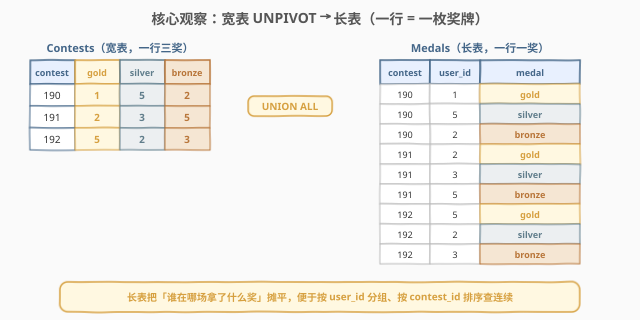
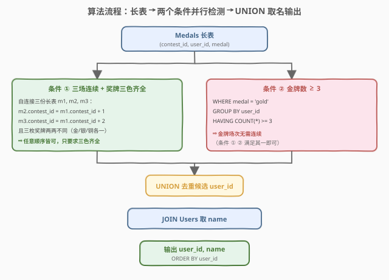
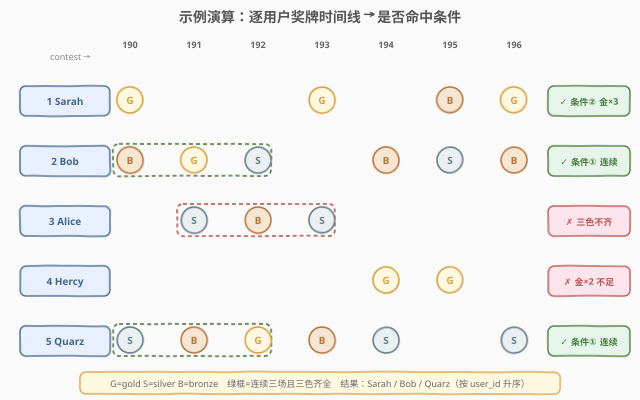

# 寻找面试候选人

- **题目名称**：寻找面试候选人
- **链接**：[1811. 寻找面试候选人 🔒](https://leetcode.cn/problems/find-interview-candidates/)
- **难度**：中等
- **标签**：数据库、SQL、`UNION ALL`（逆透视 UNPIVOT）、自连接（Self-Join）、窗口函数 `LEAD`、`GROUP BY` + `HAVING`、连续区间判定、`JOIN`、LeetCode 锁题

## 1. 题目概述

自 2018 年起，Google 通过举办 Kickstart 比赛招募新员工。每场比赛的**金、银、铜牌**得主记录在 `Contests` 表中。现需从中筛选**面试候选人**——满足以下**任一**条件即入选：

1. **连续三场且三色齐全**：在**三个 `contest_id` 连续**的比赛中，该用户赢得了**金、银、铜三枚奖牌各一枚**（顺序不限，但三场必须是 `c, c+1, c+2`）；
2. **金牌数 ≥ 3**：累计赢得**至少 3 枚金牌**（场次无需连续）。

**表结构**：

```text
Table: Contests
+-------------+------+
| Column Name | Type |
+-------------+------+
| contest_id  | int  |  ← 主键，具有唯一值
| gold_medal  | int  |  ← 该场金牌得主的 user_id
| silver_medal| int  |  ← 该场银牌得主的 user_id
| bronze_medal| int  |  ← 该场铜牌得主的 user_id
+-------------+------+
每一行记录一场比赛及其金/银/铜牌得主。

Table: Users
+-------------+-------------+
| Column Name | Type        |
+-------------+-------------+
| user_id     | int         |  ← 主键，具有唯一值
| mail        | varchar(50) |
| name        | varchar(30) |
+-------------+-------------+
```

> ⚠️ **同一场比赛三奖分属三人**：`gold_medal`、`silver_medal`、`bronze_medal` 是三个**不同**的 `user_id`，故**同一用户在同一场比赛最多赢一枚奖牌**。这一约束是条件①「三场三色」语义成立的前提。

**示例 1**：

```text
输入：
Contests 表:
+------------+------------+--------------+--------------+
| contest_id | gold_medal | silver_medal | bronze_medal |
+------------+------------+--------------+--------------+
| 190        | 1          | 5            | 2            |
| 191        | 2          | 3            | 5            |
| 192        | 5          | 2            | 3            |
| 193        | 1          | 3            | 5            |
| 194        | 4          | 5            | 2            |
| 195        | 4          | 2            | 1            |
| 196        | 1          | 5            | 2            |
+------------+------------+--------------+--------------+

Users 表:
+---------+----------------------+---------+
| user_id | mail                 | name    |
+---------+----------------------+---------+
| 1       | sarah@leetcode.com   | Sarah   |
| 2       | bob@leetcode.com     | Bob     |
| 3       | alice@leetcode.com   | Alice   |
| 4       | hercy@leetcode.com   | Hercy   |
| 5       | quarz@leetcode.com   | Quarz   |
+---------+----------------------+---------+

输出:
+---------+--------+
| user_id | name   |
+---------+--------+
| 1       | Sarah  |
| 2       | Bob    |
| 5       | Quarz  |
+---------+--------+
```

**解释**：

| 用户 | 奖牌时间线（contest_id: 奖牌） | 命中条件 |
|------|-------------------------------|----------|
| Sarah (1) | 190:金、193:金、195:铜、196:金 | ② 金牌 ×3 ≥ 3 ✓ |
| Bob (2) | 190:铜、191:金、192:银、194:铜、195:银、196:铜 | ① 190–192 连续三场且金/银/铜齐全 ✓ |
| Alice (3) | 191:银、192:铜、193:银 | 191–193 连续但三色不齐（缺金）✗ |
| Hercy (4) | 194:金、195:金 | 仅 2 场、金牌 ×2 < 3 ✗ |
| Quarz (5) | 190:银、191:铜、192:金、193:铜、194:银、196:银 | ① 190–192 连续三场且金/银/铜齐全 ✓ |

**约束条件**：

- `contest_id` 是 `Contests` 表具有唯一值的列（主键）
- `user_id` 是 `Users` 表具有唯一值的列（主键）
- `Contests` 中的 `gold_medal` / `silver_medal` / `bronze_medal` 均引用 `Users.user_id`，且同一行三者**互不相同**
- 结果按 `user_id` **升序**排列

> 💡 本题是 SQL **"宽表逆透视 + 连续区间判定"招牌题**——两大难点：① 把「一场三奖」的宽表摊成「一行一奖」的长表（`UNION ALL` 实现 UNPIVOT）；② 在长表上检测「`contest_id` 连续 + 奖牌三色齐全」的三元组。条件②则是朴素的 `GROUP BY` + `HAVING COUNT ≥ 3`。

---

## 2. 解题思路

### 2.1 暴力思路：逐行读宽表逐用户判定

最直觉的过程式思路：对每个用户，遍历 `Contests` 的每一行，检查他是否出现在 `gold_medal`/`silver_medal`/`bronze_medal` 中，收集其全部 `(contest_id, 奖牌)` 记录；再扫描该用户的时间线，查找是否存在三个连续 `contest_id` 且奖牌三色齐全；同时数金牌数是否 ≥ 3。

问题在于**纯 SQL 没有显式逐行循环**，「逐用户扫描时间线、滑窗判连续」需换成集合式表达。直接对宽表操作还要在每行做三次列比对（`user_id IN (gold, silver, bronze)`），写法臃肿且难以表达「连续」。

> ⚠️ **症结**：宽表的「金/银/铜」是**三列**，而「连续三场」需要按 `contest_id` 排序后**跨行**比较——列式存储与行式比较维度不匹配。必须先把宽表**逆透视**成「一行一奖」的长表，才能用 `JOIN`/窗口函数做跨行分析。

### 2.2 核心观察：UNION ALL 逆透视 + 双条件并行检测



三个关键点把宽表问题转化为可分析的集合：

**① UNION ALL 逆透视（UNPIVOT）**：把 `Contests` 的三列 `gold_medal`/`silver_medal`/`bronze_medal` 各自 `SELECT` 出来并打上奖牌标签，用 `UNION ALL` 拼成一张长表 `Medals(contest_id, user_id, medal)`。三列变三行，每个「谁在哪场拿了什么奖」成为一条独立记录。`UNION ALL` 而非 `UNION`——同行三奖分属三人，本就无重复，`ALL` 保留全部行且省去去重开销。

**② 条件①——自连接三元组判连续 + 三色齐全**：对长表 `Medals` 做**自连接三份** `m1`、`m2`、`m3`，约束：
- `m2.contest_id = m1.contest_id + 1`（第二场紧接第一场）；
- `m3.contest_id = m1.contest_id + 2`（第三场紧接第二场）；
- 三者 `user_id` 相同（同一用户）；
- 三枚奖牌**两两不同**（`m1.medal <> m2.medal AND m1.medal <> m3.medal AND m2.medal <> m3.medal`）——三种奖牌只有金/银/铜三类，两两不同即恰好三色齐全。

> 💡 **为何「两两不同」等价于「三色齐全」**：奖牌只有 3 种取值（gold/silver/bronze），三个奖牌两两不同 ⟺ 它们是这 3 种的一个排列 ⟺ 金银铜各一。用 `<>` 判两两不同比 `IN` 枚举 6 种排列更简洁。

**③ 条件②——朴素聚合**：在长表上 `WHERE medal = 'gold'` 过滤后 `GROUP BY user_id`，`HAVING COUNT(*) >= 3` 即得金牌数 ≥ 3 的用户。

两条件结果 `UNION`（去重，同一用户可能同时满足两条件）后 `JOIN Users` 取 `name`，按 `user_id` 排序输出。

> 💡 **直觉理解**：宽表像「每场比赛的成绩单」横着排三列奖牌，难以追问「某人的成长曲线」。逆透视把成绩单拆成「一条颁奖记录一行」的流水账，于是「连续三场拿全三色」变成「流水账里能否找到三行：同一个人、`contest_id` 递增 1、奖牌三色不重」——标准的自连接三元组匹配。

### 2.3 算法流程图



**逻辑执行步骤**：

| 步骤 | 操作 | 作用 |
|------|------|------|
| ① | `UNION ALL` 三列 → `Medals(contest_id, user_id, medal)` | 宽表逆透视为长表，3n 行 |
| ② | 自连接 `m1 ⋈ m2 (cid+1) ⋈ m3 (cid+2)` + 奖牌两两不同 | 条件①：连续三场且三色齐全 |
| ③ | `WHERE medal='gold' GROUP BY user_id HAVING COUNT≥3` | 条件②：金牌数 ≥ 3 |
| ④ | `UNION` ②③的 `user_id` | 合并候选（去重） |
| ⑤ | `JOIN Users` 取 `name`，`ORDER BY user_id` | 关联姓名并排序输出 |

> ⚠️ **自连接的连接条件**：`m2.contest_id = m1.contest_id + 1` 而非 `m2.contest_id > m1.contest_id`——前者精确锁定「紧接的下一场」，后者会匹配所有后续场次产生 $O(n^2)$ 笛卡尔积。`contest_id` 上的等值连接可走索引或哈希连接，是性能关键。

### 2.4 示例演算

以示例 1 数据为例，观察「逆透视 → 逐用户时间线 → 条件判定」的逐步过程：



**步骤 ①：UNION ALL 逆透视**

`Contests` 7 行 → `Medals` 21 行（每行三奖 → 三行）。按 `user_id`、`contest_id` 排序后得到各用户的奖牌时间线：

| 用户 | (contest_id, medal) 序列 | 金牌数 |
|------|--------------------------|--------|
| Sarah (1) | (190,金), (193,金), (195,铜), (196,金) | 3 |
| Bob (2) | (190,铜), (191,金), (192,银), (194,铜), (195,银), (196,铜) | 1 |
| Alice (3) | (191,银), (192,铜), (193,银) | 0 |
| Hercy (4) | (194,金), (195,金) | 2 |
| Quarz (5) | (190,银), (191,铜), (192,金), (193,铜), (194,银), (196,银) | 1 |

**步骤 ②：条件①——自连接找连续三元组**

对每个用户扫描 `contest_id` 连续递增 1 的三元组，并判三枚奖牌是否两两不同：

| 用户 | 候选三元组 (cid₁, cid₂, cid₃) | 奖牌 | 三色齐全? |
|------|-------------------------------|------|-----------|
| Sarah | 无连续三元组（190→193 跳号） | — | ✗ |
| Bob | (190,191,192) | 铜/金/银 | ✓ 三色齐全 |
| Bob | (194,195,196) | 铜/银/铜 | ✗ 铜重复 |
| Alice | (191,192,193) | 银/铜/银 | ✗ 银重复 |
| Hercy | 仅 2 场，无三元组 | — | ✗ |
| Quarz | (190,191,192) | 银/铜/金 | ✓ 三色齐全 |
| Quarz | (192,193,194) | 金/铜/银 | ✓ 三色齐全 |

⇒ 条件①命中：Bob、Quarz。

**步骤 ③：条件②——金牌数 ≥ 3**

| 用户 | 金牌数 | ≥ 3? |
|------|--------|------|
| Sarah | 3 | ✓ |
| Bob | 1 | ✗ |
| Hercy | 2 | ✗ |
| Quarz | 1 | ✗ |

⇒ 条件②命中：Sarah。

**步骤 ④⑤：UNION + JOIN Users + 排序**

候选 `{Bob, Quarz} ∪ {Sarah} = {1, 2, 5}`，关联 `Users` 取 `name`，按 `user_id` 升序输出：

```text
(1, Sarah), (2, Bob), (5, Quarz)
```

> 💡 **关键对比**：Alice 的 191–193 三场虽 `contest_id` 连续，但奖牌是「银/铜/银」，**银重复、缺金**，不满足「三色齐全」——这正是「两两不同」判定要排除的情形。若误把条件①写成「连续三场各拿一奖」而漏判奖牌种类，会错误纳入 Alice。

---

## 3. 参考代码

### SQL（解法 A：`UNION ALL` 逆透视 + 自连接三元组，推荐）

```sql
WITH Medals AS (
    SELECT contest_id, gold_medal   AS user_id, 'gold'   AS medal FROM Contests
    UNION ALL
    SELECT contest_id, silver_medal AS user_id, 'silver' AS medal FROM Contests
    UNION ALL
    SELECT contest_id, bronze_medal AS user_id, 'bronze' AS medal FROM Contests
),
Cond1 AS (
    SELECT DISTINCT m1.user_id
    FROM Medals m1
    JOIN Medals m2
      ON m2.user_id = m1.user_id AND m2.contest_id = m1.contest_id + 1
    JOIN Medals m3
      ON m3.user_id = m1.user_id AND m3.contest_id = m1.contest_id + 2
    WHERE m1.medal <> m2.medal
      AND m1.medal <> m3.medal
      AND m2.medal <> m3.medal
),
Cond2 AS (
    SELECT user_id
    FROM Medals
    WHERE medal = 'gold'
    GROUP BY user_id
    HAVING COUNT(*) >= 3
)
SELECT u.user_id, u.name
FROM Users u
JOIN (
    SELECT user_id FROM Cond1
    UNION
    SELECT user_id FROM Cond2
) c ON u.user_id = c.user_id
ORDER BY u.user_id;
```

> 💡 **写法要点**：
> - **`Medals` CTE 用 `UNION ALL`**：三列各查一次拼接，不去重（同行三奖分属三人本无重复，`ALL` 省去去重开销）。这一步是「宽表 → 长表」的逆透视，后续所有分析都基于长表。
> - **`Cond1` 自连接三份 `m1/m2/m3`**：连接条件 `contest_id = m1.contest_id + 1/+2` 精确锁定「紧接的下一场」与「再下一场」，避免 `>` 产生的笛卡尔积膨胀。`WHERE` 里三个 `<>` 判奖牌两两不同，等价于「金银铜各一」。
> - **`Cond2` 聚合**：长表过滤金牌后 `GROUP BY user_id` + `HAVING COUNT(*) >= 3`，朴素且高效。
> - **外层 `UNION` 去重 + `JOIN Users`**：两条件结果 `UNION`（自动去重，同一用户可能双命中），再 `INNER JOIN Users` 取 `name`。`INNER JOIN` 而非 `LEFT JOIN`——候选必在 `Users` 中，且只需出现命中用户。
> - ✓ **最推荐**：不依赖窗口函数，兼容 MySQL 5.7 及所有主流数据库；自连接走 `contest_id` 等值连接可高效匹配。

### SQL（解法 B：`UNION ALL` 逆透视 + `LEAD` 窗口函数）

```sql
WITH Medals AS (
    SELECT contest_id, gold_medal   AS user_id, 'gold'   AS medal FROM Contests
    UNION ALL
    SELECT contest_id, silver_medal AS user_id, 'silver' AS medal FROM Contests
    UNION ALL
    SELECT contest_id, bronze_medal AS user_id, 'bronze' AS medal FROM Contests
),
Consec AS (
    SELECT
        user_id, contest_id, medal,
        LEAD(contest_id, 1) OVER (PARTITION BY user_id ORDER BY contest_id) AS next_cid,
        LEAD(contest_id, 2) OVER (PARTITION BY user_id ORDER BY contest_id) AS next2_cid,
        LEAD(medal, 1)      OVER (PARTITION BY user_id ORDER BY contest_id) AS next_medal,
        LEAD(medal, 2)      OVER (PARTITION BY user_id ORDER BY contest_id) AS next2_medal
    FROM Medals
),
Cond1 AS (
    SELECT DISTINCT user_id
    FROM Consec
    WHERE next_cid IS NOT NULL
      AND next2_cid IS NOT NULL
      AND contest_id + 1 = next_cid
      AND contest_id + 2 = next2_cid
      AND medal <> next_medal
      AND medal <> next2_medal
      AND next_medal <> next2_medal
),
Cond2 AS (
    SELECT user_id
    FROM Medals
    WHERE medal = 'gold'
    GROUP BY user_id
    HAVING COUNT(*) >= 3
)
SELECT u.user_id, u.name
FROM Users u
JOIN (
    SELECT user_id FROM Cond1
    UNION
    SELECT user_id FROM Cond2
) c ON u.user_id = c.user_id
ORDER BY u.user_id;
```

> 💡 **解法 B 的思路**：用 `LEAD(..., 1)` / `LEAD(..., 2)` 窗口函数按 `user_id` 分组、`contest_id` 排序后，把「下一场」与「再下一场」的 `contest_id` 和 `medal` 平移到当前行。于是「连续三场 + 三色齐全」变为对**同一行**的逐行判定：`contest_id + 1 = next_cid AND contest_id + 2 = next2_cid`（连续）+ 三个 `<>`（三色齐全）。
>
> **与解法 A 的区别**：解法 A 用自连接把三行拼成一行判，解法 B 用 `LEAD` 把后两行平移到当前行判——思路对偶，结果一致。`LEAD` 写法在「连续区间较长」（如判 5 连续）时扩展性更好（只改平移步数），而解法 A 需增加自连接份数。窗口函数需 MySQL 8.0+。

### Python（pandas）

```python
import pandas as pd

def find_interview_candidates(contests: pd.DataFrame, users: pd.DataFrame) -> pd.DataFrame:
    # 1. 逆透视：宽表三列 -> 长表 (contest_id, user_id, medal)
    parts = []
    for col, medal in [('gold_medal', 'gold'), ('silver_medal', 'silver'), ('bronze_medal', 'bronze')]:
        p = contests[['contest_id', col]].rename(columns={col: 'user_id'})
        p['medal'] = medal
        parts.append(p)
    medals = pd.concat(parts, ignore_index=True)

    # 2. 条件①：每个用户按 contest_id 排序后，找连续三元组且奖牌两两不同
    g = medals.sort_values(['user_id', 'contest_id']).groupby('user_id', group_keys=False)
    m = medals.sort_values(['user_id', 'contest_id']).copy()
    m['next_cid']    = g['contest_id'].shift(-1)
    m['next2_cid']   = g['contest_id'].shift(-2)
    m['next_medal']  = g['medal'].shift(-1)
    m['next2_medal'] = g['medal'].shift(-2)
    cond1 = m.dropna(subset=['next_cid', 'next2_cid'])
    cond1 = cond1[
        (cond1.contest_id + 1 == cond1.next_cid) &
        (cond1.contest_id + 2 == cond1.next2_cid) &
        (cond1.medal != cond1.next_medal) &
        (cond1.medal != cond1.next2_medal) &
        (cond1.next_medal != cond1.next2_medal)
    ]
    c1 = cond1['user_id'].unique()

    # 3. 条件②：金牌数 >= 3
    gold = medals[medals['medal'] == 'gold']
    c2 = gold.groupby('user_id').size()
    c2 = c2[c2 >= 3].index.tolist()

    # 4. 合并候选 + 关联 name + 排序
    cand = set(c1.tolist()) | set(c2)
    out = users[users['user_id'].isin(cand)][['user_id', 'name']]
    return out.sort_values('user_id').reset_index(drop=True)
```

> 💡 **pandas 对照**：
> - `pd.concat` 三份 `DataFrame` 对应 SQL 的 `UNION ALL` 逆透视。
> - `groupby('user_id').shift(-1)/shift(-2)` 对应 `LEAD(contest_id, 1/2) OVER (PARTITION BY user_id ORDER BY contest_id)`——`shift(-k)` 向前看 k 行（即「下 k 行」）。
> - 逐行布尔条件 `(contest_id+1==next_cid) & ...` 对应 `WHERE` 子句。
> - `groupby('user_id').size()` 对应 `GROUP BY user_id` + `COUNT(*)`。

---

## 4. 复杂度分析

| 维度 | 解法 A（自连接三元组） | 解法 B（`LEAD` 窗口函数） |
|------|------------------------|---------------------------|
| **时间** | $O(n)$～$O(n \log n)$ | $O(n \log n)$ |
| **空间** | $O(n)$ | $O(n)$ |
| **是否依赖窗口函数** | 否 | 是（MySQL 8.0+） |
| **连续区间扩展性** | 5 连续需自连接 5 份 | 仅改 `LEAD` 步数为 4 |
| **可读性** | ✓ 直观（三元组匹配清晰） | ✓ 紧凑（逐行平移判定） |
| **推荐度** | ✓ **首选**（兼容性好） | ✓ 现代数据库备选 |

> - $n$ = `Contests` 表行数；逆透视后 `Medals` 为 $3n$ 行。
> - **解法 A 时间**：`UNION ALL` 逆透视 $O(n)$；自连接 `m1 ⋈ m2 (cid+1)` 与 `⋈ m3 (cid+2)` 是 `contest_id` 上的等值连接，因 `contest_id` 在每用户组内唯一，每个 `m1` 行至多匹配一个 `m2`、一个 `m3`，连接结果不超过 $3n$ 行——若 `contest_id` 有索引或走哈希连接为 $O(n)$，排序归并为 $O(n \log n)$；`Cond2` 聚合 $O(n)$。
> - **解法 B 时间**：`PARTITION BY user_id ORDER BY contest_id` 排序 $O(n \log n)$；`LEAD` 每行 $O(1)$ 平移共 $O(n)$；`Cond2` 聚合 $O(n)$。
> - **空间**：两者均需 $O(n)$ 存放 `Medals` CTE 及中间结果。
> - **索引优化**：在 `Contests(contest_id)` 上有主键索引；逆透视后若数据库物化 `Medals`，建议在 `(user_id, contest_id)` 上建索引以加速自连接与窗口排序。

---

## 5. 扩展：连续 k 场的通用解法

题目可推广为「**连续 k 场且 k 种奖牌齐全**」（本题 k=3）。两种解法的扩展性对比：

**解法 B（`LEAD`）扩展更优**：只需把平移步数从 1/2 增加到 1/2/…/k−1，并判 k 个奖牌两两不同。伪码：

```sql
-- k 连续 + k 色齐全（k>3 时需奖牌种类也扩为 k 种）
SELECT DISTINCT user_id
FROM (
    SELECT user_id, contest_id, medal,
           LEAD(contest_id, 1) OVER w AS c1, ... , LEAD(contest_id, k-1) OVER w AS c_{k-1},
           LEAD(medal, 1)      OVER w AS m1, ... , LEAD(medal, k-1)      OVER w AS m_{k-1}
    FROM Medals
    WINDOW w AS (PARTITION BY user_id ORDER BY contest_id)
) t
WHERE c1 = contest_id + 1 AND ... AND c_{k-1} = contest_id + k - 1
  AND <k 个奖牌两两不同>;
```

**解法 A（自连接）**则需自连接 k 份，SQL 文本随 k 线性增长，可读性下降。

> 💡 **连续区间判定的两种范式**：
> - **自连接法**：`t1 ⋈ t2 ON t2.id = t1.id + 1 ⋈ ...`，用连接表达「相邻」，适合 k 较小、无窗口函数的环境。
> - **窗口函数法**：`LEAD(col, d) OVER (PARTITION BY ... ORDER BY id)` 把第 d 行平移到当前行，用 `id + d = LEAD(id, d)` 判相邻，适合 k 较大或需灵活调整步长。
> - 二者均要求**排序键（此处 `contest_id`）在分组内唯一**，否则「相邻」语义歧义。本题 `contest_id` 是主键，天然满足。

---

## 6. 面试要点

**Q1：为什么用 `UNION ALL` 而不是 `UNION` 做逆透视？**

> `UNION` 会对结果去重，`UNION ALL` 保留全部行。同一比赛的金银铜分属三个不同用户，逆透视后不会产生完全相同的 `(contest_id, user_id, medal)` 三元组（`user_id` 不同即整行不同），故无重复可去。用 `UNION ALL` 省去排序去重的 $O(n \log n)$ 开销，语义也更准确——「每枚奖牌一条记录」。

**Q2：条件①中「两两不同」为何等价于「金银铜各一」？能否用更简洁的判定？**

> 奖牌只有 gold/silver/bronze 三种取值。三个奖牌两两不同（`m1.medal <> m2.medal AND m1.medal <> m3.medal AND m2.medal <> m3.medal`）⟺ 它们是这 3 种的一个全排列 ⟺ 金银铜各一。也可给奖牌编码（金=1/银=2/铜=3）后判 `SUM=6` 且 `COUNT(DISTINCT medal)=3`，但 `<>` 三连写法最直观且无需编码映射。

**Q3：自连接为什么用 `m2.contest_id = m1.contest_id + 1` 而非 `m2.contest_id > m1.contest_id`？**

> `= m1.contest_id + 1` 精确锁定「紧接的下一场」，每个 `m1` 行至多匹配一个 `m2`，连接结果线性增长。若用 `>`，会匹配所有后续场次，产生 $O(n^2)$ 笛卡尔积——例如某用户参加 100 场，`m1` 的第一场会与后 99 场都连接。等值连接还能利用 `contest_id` 索引或哈希连接加速，是不等连接无法企及的。

**Q4：解法 B 中 `LEAD` 后为什么要 `WHERE next_cid IS NOT NULL`？**

> `LEAD(col, 2)` 在每个分组的最后两行返回 `NULL`（没有「再下一场」）。若不排除，`contest_id + 2 = next2_cid` 中 `NULL` 参与比较结果为 `NULL`（非真），该行虽被过滤但不显式判空易在边界数据上出问题。显式 `IS NOT NULL` 是防御性写法，表明「需要存在后两场才判连续」。

**Q5：同一用户同时满足两条件时，结果为何不会重复？**

> 外层用 `UNION`（而非 `UNION ALL`）合并 `Cond1` 与 `Cond2` 的 `user_id`，自动去重。例如某用户既有连续三色三元组又有 ≥3 金牌，`UNION` 保证其在候选集中只出现一次，最终 `JOIN Users` 输出一行。若误用 `UNION ALL`，同一 `user_id` 会与 `Users` 连接出两行，结果重复。

> 💡 **一句话总结**：1811 是 SQL **"宽表逆透视 + 连续区间判定"招牌题**——核心模板「`UNION ALL` 把三列奖牌摊成长表 → 自连接三元组（`cid+1`/`cid+2`）+ 奖牌两两不同判连续三色 / `GROUP BY`+`HAVING` 判金牌 ≥3 → `UNION` 合并 + `JOIN Users` 取名」。最大要点：**宽表先逆透视才能跨行分析**；条件①的「连续」要用**等值连接 `cid+1`** 精确锁定相邻，「三色」用**两两不同**等价判全。

---

## 7. 同类练习题

- [180. 连续出现的数字](https://leetcode.cn/problems/consecutive-numbers/)（[题解](../0101-0200/180_连续出现的数字.md)）：连续区间检测的母题，自连接/`LEAD` 判「同一数字连续出现 3 次」，是 1811 条件①「连续三场」的直接前置
- [603. 连续空余座位](https://leetcode.cn/problems/consecutive-available-seats/)（[题解](../0601-0700/603_连续空余座位.md)）：自连接 `seat_id + 1` 判相邻空座，与 1811 条件①的 self-join `contest_id + 1` 同构
- [1454. 活跃用户 🔒](https://leetcode.cn/problems/active-users/)（[题解](../1401-1500/1454_活跃用户.md)）：`ROW_NUMBER` + 日期差判连续登录，连续区间进阶（按日期而非自增 id 判连续）
- [1174. 即时食物配送 II 🔒](https://leetcode.cn/problems/immediate-food-delivery-ii/)（[题解](../1101-1200/1174_即时食物配送II.md)）：`ROW_NUMBER` 分组取首单再聚合算比例，共享「`PARTITION BY` 找组内最值」的窗口函数骨架，对照 1811 的 `PARTITION BY user_id ORDER BY contest_id`
