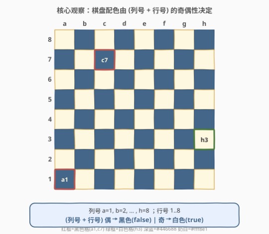
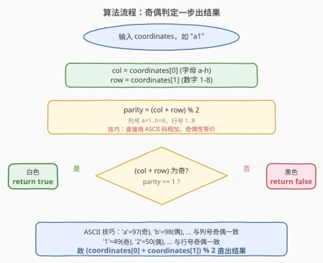
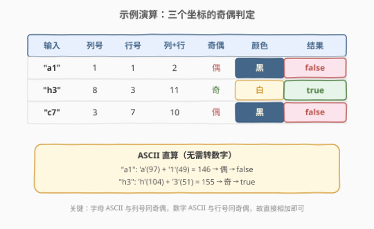

# 判断国际象棋棋盘中一个格子的颜色

- **题目名称**：判断国际象棋棋盘中一个格子的颜色
- **链接**：[1812. 判断国际象棋棋盘中一个格子的颜色](https://leetcode.cn/problems/determine-color-of-a-chessboard-square/)
- **难度**：简单
- **标签**：数学、几何

## 1. 题目概述

给你一个字符串 `coordinates`，表示国际象棋棋盘上某个格子的坐标（如 `"a1"`、`"h3"`）。坐标的第一个字符是列字母（`'a'` 到 `'h'`），第二个字符是行数字（`'1'` 到 `'8'`）。

如果该格子是**白色**的，返回 `true`；如果是**黑色**的，返回 `false`。

> ⚠️ 国际象棋棋盘的约定：**左下角 `a1` 是黑色格**。棋盘 8×8 共 64 格，黑白交替排列，相邻格异色。

**示例 1**：

```text
输入：coordinates = "a1"
输出：false
解释：a1 是黑色格。
```

**示例 2**：

```text
输入：coordinates = "h3"
输出：true
解释：h3 是白色格。
```

**示例 3**：

```text
输入：coordinates = "c7"
输出：false
解释：c7 是黑色格。
```

**约束条件**：

- `coordinates.length == 2`
- `'a' <= coordinates[0] <= 'h'`
- `'1' <= coordinates[1] <= '8'`

> 💡 **核心矛盾**：棋盘只有 64 格，最朴素的做法是预存一张颜色表直接查。但棋盘的「交替」排列背后是一条简洁的**奇偶规律**——只需一次取模即可判定，无需任何预处理。

---

## 2. 解题思路

### 2.1 暴力思路：预存棋盘颜色表

最直观的做法：先构造一个 `8×8` 的二维数组 `board`，按「`a1` 为黑、相邻交替」的规则填好 64 个格子的颜色，再把输入坐标转换为行列下标查表。

```text
board[0][0] = 黑   (a1)
board[0][1] = 白   (b1)
board[1][0] = 白   (a2)
...
查表返回 board[col][row]
```

时间 $O(1)$（查表），空间 $O(64)$。能 AC，但**浪费空间**——64 个格子的颜色完全可以由一个公式生成，没必要存。

> 💡 转机：棋盘的「交替」排列意味着每个格子的颜色只取决于它在棋盘上的**位置奇偶性**。能否用一个公式直接算出来？

### 2.2 核心观察：配色由 (列号 + 行号) 的奇偶性决定



把列字母转为数字（`a=1, b=2, …, h=8`），行数字保持（`1..8`），观察几个已知格子：

| 坐标 | 列号 | 行号 | 列+行 | 奇偶 | 颜色 |
|------|------|------|-------|------|------|
| `a1` | 1 | 1 | 2 | 偶 | 黑 |
| `b1` | 2 | 1 | 3 | 奇 | 白 |
| `a2` | 1 | 2 | 3 | 奇 | 白 |
| `h3` | 8 | 3 | 11 | 奇 | 白 |
| `c7` | 3 | 7 | 10 | 偶 | 黑 |

规律一目了然：

$$\text{列号} + \text{行号} \text{ 为偶} \Rightarrow \text{黑色} \Rightarrow \texttt{false}$$

$$\text{列号} + \text{行号} \text{ 为奇} \Rightarrow \text{白色} \Rightarrow \texttt{true}$$

> 💡 **为什么？** 棋盘的「交替」排列意味着：**每走一格（无论横向还是纵向），颜色必翻转**。横向走一步列号 $+1$，纵向走一步行号 $+1$，所以每走一步 $(\text{列号}+\text{行号})$ 的奇偶性必翻转。以 `a1`（偶→黑）为基准，走奇数步到奇（白），走偶数步到偶（黑）。这就是交替排列的代数本质。

### 2.3 算法流程图



整个算法只有三步：取字符 → 算奇偶 → 判定。无需循环、无需预处理。

> 💡 **ASCII 技巧**：列号 $= \text{coordinates}[0] - \text{'a'} + 1$，但 `'a'` 的 ASCII 码是 $97$（奇），`'b'` 是 $98$（偶），……与列号的奇偶性**完全一致**。同理行数字 `'1'=49$（奇）、`'2'=50$（偶）也与行号同奇偶。故 $(\text{coordinates}[0] + \text{coordinates}[1]) \bmod 2$ 直接等价于 $(\text{列号} + \text{行号}) \bmod 2$，连数字转换都省了。

### 2.4 示例演算



以题目给出的三个示例为例，分别用「列号+行号」和「ASCII 直算」两种方式验证：

| 输入 | 列号 | 行号 | 列+行 | 奇偶 | 颜色 | 结果 | ASCII 和 | $\bmod\ 2$ |
|------|------|------|-------|------|------|------|----------|--------|
| `"a1"` | 1 | 1 | 2 | 偶 | 黑 | `false` | $97+49=146$ | 0 |
| `"h3"` | 8 | 3 | 11 | 奇 | 白 | `true` | $104+51=155$ | 1 |
| `"c7"` | 3 | 7 | 10 | 偶 | 黑 | `false` | $99+55=154$ | 0 |

两种方式结果完全一致——ASCII 和的奇偶性与数值和的奇偶性等价。

---

## 3. 参考代码

### C++

```cpp
class Solution {
  public:
    bool squareIsWhite(string coordinates) {
        return (coordinates[0] + coordinates[1]) % 2 == 1;
    }
};
```

### Python

```python
class Solution:
    def squareIsWhite(self, coordinates: str) -> bool:
        return (ord(coordinates[0]) + ord(coordinates[1])) % 2 == 1
```

> 💡 **一行即终**。`coordinates[0]` 是列字母，`coordinates[1]` 是行数字字符。两者 ASCII 码之和的奇偶性等价于（列号 + 行号）的奇偶性：奇 → 白色 → `true`，偶 → 黑色 → `false`。Python 中字符串索引得到单字符，需用 `ord()` 转为 ASCII 码才能做算术运算；C++ 中 `char` 本身就是整数，可直接相加。
>
> ⚠️ **不用 ASCII 也行**，显式转换更易读：`return (coordinates[0] - 'a' + 1 + coordinates[1] - '0') % 2 == 1;`。两者等价，ASCII 版更简洁。

---

## 4. 复杂度分析

| 维度 | 奇偶公式法 | 预存颜色表法 |
|------|-----------|-------------|
| **时间复杂度** | $O(1)$ | $O(1)$ |
| **空间复杂度** | $O(1)$ | $O(64)$ |
| **预处理** | 无需 | 需构造 8×8 表 |
| **核心操作** | 一次加法 + 一次取模 | 数组查表 |

> 💡 本题的最优解做到了 $O(1)$ 时间 + $O(1)$ 空间，关键在于把「64 格颜色表」压缩成「一个奇偶公式」。这种「用数学规律替代存储」的思路在简单题中很常见。

---

## 5. 扩展：ASCII 奇偶等价性的证明

### 5.1 为什么 ASCII 和的奇偶性与数值和一致？

设列字母为 $c$（`'a'` 到 `'h'`），行数字字符为 $r$（`'1'` 到 `'8'`）。

**列号** $= c - \text{'a'} + 1 = c - 97 + 1 = c - 96$。由于 $96$ 是偶数，故：

$$\text{列号} \bmod 2 = (c - 96) \bmod 2 = c \bmod 2$$

**行号** $= r - \text{'0'} = r - 48$。由于 $48$ 是偶数，故：

$$\text{行号} \bmod 2 = (r - 48) \bmod 2 = r \bmod 2$$

因此：

$$(\text{列号} + \text{行号}) \bmod 2 = (c + r) \bmod 2$$

即 ASCII 码之和的奇偶性完全等价于数值之和的奇偶性。**减去一个偶数不改变奇偶性**——这就是 ASCII 技巧的数学根基。

### 5.2 如果 a1 是白色会怎样？

若题目约定 `a1` 为白色（与标准国际象棋相反），只需把判定条件取反：

$$\text{列号} + \text{行号} \text{ 为偶} \Rightarrow \text{白色} \Rightarrow \texttt{true}$$

即 `(coordinates[0] + coordinates[1]) % 2 == 0`。奇偶规律不变，只是基准色翻转导致结果取反。这说明**交替排列的奇偶结构是本质，具体哪格是黑是白只是基准选择**。

---

## 6. 面试要点

**Q1：如何 O(1) 判断棋盘格颜色？**

> 将列字母转为数字（`a=1, …, h=8`），与行数字相加。和为偶 → 黑色（`false`），和为奇 → 白色（`true`）。一次加法 + 一次取模，$O(1)$ 时间 $O(1)$ 空间。

**Q2：为什么「交替排列」等价于「奇偶判定」？**

> 棋盘每走一格（横向或纵向）颜色必翻转。横向走列号 $+1$，纵向走行号 $+1$，每走一步 $(\text{列号}+\text{行号})$ 的奇偶性必翻转。以 `a1`（偶→黑）为基准，走奇数步到奇（白），走偶数步到偶（黑）。交替排列的代数本质就是和的奇偶性交替。

**Q3：为什么可以直接用 ASCII 码相加，不用转数字？**

> 列号 $= c - 96$，行号 $= r - 48$，减去的 $96$ 和 $48$ 都是偶数，不改变奇偶性。故 $(c + r) \bmod 2 = (\text{列号}+\text{行号}) \bmod 2$，直接用字符 ASCII 码相加取模即可。

**Q4：a1 为什么是黑色？这个约定重要吗？**

> `a1` 为黑色是国际象棋的标准约定（白后在白格，白王在 e1，由此反推 a1 必为黑）。对算法而言，它只是确定了「偶→黑」这一基准。若基准翻转为「偶→白」，只需把结果取反，奇偶结构不变。

**Q5：如果棋盘不是 8×8 而是 N×N 呢？**

> 奇偶判定与棋盘大小无关。只要棋盘仍是交替配色且左下角为黑，$(\text{列号}+\text{行号})$ 偶→黑的公式对任意 $N \times N$ 棋盘都成立。本题的 $8 \times 8$ 约束只是国际象棋的固定规格，不参与计算。

---

## 7. 同类练习题

- [258. 各位相加](https://leetcode.cn/problems/add-digits/)：同为 $O(1)$ 数学公式题，数字根公式 $(num-1) \bmod 9 + 1$ 一步出结果，体会「数学规律替代循环」
- [292. Nim 游戏](https://leetcode.cn/problems/nim-game/)：同为找数学规律的简单题，$n \bmod 4 \ne 0$ 必胜，一行公式解决博弈判定
- [319. 灯泡开关](https://leetcode.cn/problems/bulb-switcher/)：同为数学规律题，只有完全平方数有奇数个因子故最终亮着，$O(1)$ 公式 $\lfloor\sqrt{n}\rfloor$
- [1281. 整数的各位积和之差](https://leetcode.cn/problems/subtract-the-product-and-sum-of-digits-of-an-integer/)：同为简单数学计算题，逐位提取做积与和，对照本题的字符→数值转换
