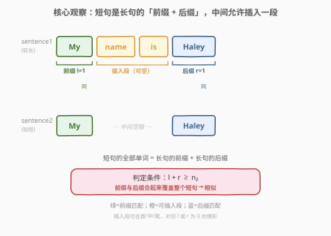

# 句子相似性 III

- **题目名称**：句子相似性 III
- **链接**：[1813. 句子相似性 III](https://leetcode.cn/problems/sentence-similarity-iii/)
- **难度**：中等
- **标签**：数组、双指针、字符串

## 1. 题目概述

给定两个字符串 `sentence1` 和 `sentence2`，每个表示一个由**单个空格**分隔的**单词**序列，开头和结尾没有多余空格，每个单词只含大小写英文字母。

如果可以通过往**其中一个**句子中**插入一个任意句子**（可以是空句子）得到另一个句子，则称两句子**相似**。注意：插入的句子必须与现有单词**用空格隔开**。

**示例 1**：

```text
输入：sentence1 = "My name is Haley", sentence2 = "My Haley"
输出：true
解释：可以往 sentence2 中 "My" 和 "Haley" 之间插入 "name is"，得到 sentence1。
```

**示例 2**：

```text
输入：sentence1 = "of", sentence2 = "A lot of words"
输出：false
解释：没法往其中一个句子只插入一个句子就得到另一个句子。
```

**示例 3**：

```text
输入：sentence1 = "Eating right now", sentence2 = "Eating"
输出：true
解释：可以往 sentence2 的结尾插入 "right now"，得到 sentence1。
```

**约束条件**：

- $1 \le sentence1.length, sentence2.length \le 100$
- `sentence1` 和 `sentence2` 只包含大小写英文字母和空格
- `sentence1` 和 `sentence2` 中的单词都只由单个空格隔开

> 💡 **关键直觉**：「插入一个句子」等价于在较长句子的**某个位置**塞进一段连续单词。这意味着较短句子的所有单词，必须**按原顺序**出现在较长句子中，并且这些匹配上的单词只能构成较长句子的一个**前缀**和一个**后缀**——中间夹着那段就是被插入的内容。⚠️ 注意「用空格隔开」天然由「按单词比较」保证：`"Frog"` 和 `"Frogs"` 是两个不同单词，不会发生半个单词的拼接。

---

## 2. 解题思路

### 2.1 暴力思路：枚举插入位置

朴素做法是枚举在较长句子的每个间隙（共 $n_1+1$ 个位置）插入较短句子的某个连续子段，再判定能否拼出对方。但「插入的内容」本身是任意句子，长度与位置都不定，暴力枚举的分支极多，且判定拼接相等需要 $O(n)$，总复杂度退化到 $O(n^2)$ 级别，写起来也易错。

### 2.2 核心观察：前缀 + 后缀夹逼匹配



换一个视角：**不再问"往哪里插入"，而是问"较短句子的单词能否被较长句子的前后两端完全吃下"**。把两句子切成单词数组 $w_1$、$w_2$，并保证 $n_1 \ge n_2$（不满足就交换）。然后：

- 从**左**用指针 $l$ 同步比较 $w_1[l]$ 与 $w_2[l]$，相等就 $l{+}{+}$，遇到第一个不等即停——这是**最长公共前缀**；
- 从**右**用指针 $r$ 同步比较 $w_1[n_1-1-r]$ 与 $w_2[n_2-1-r]$，相等就 $r{+}{+}$，遇到第一个不等即停——这是**最长公共后缀**。

如果前缀和后缀合起来**覆盖了整个较短句子**，即 $l + r \ge n_2$，那么中间没被匹配上的那段 $w_1[l \dots n_1-1-r]$ 正是「被插入的句子」，两句子相似。

> 💡 **为什么允许 $l + r \ge n_2$ 而非严格 $=$？** 当两句子完全相同（$n_1=n_2$）时，前缀会把整个短句吃完（$l=n_2$），后缀也会再吃一遍（$r=n_2$），此时 $l+r=2n_2 > n_2$，对应「插入一个空句子」的合法情形。所以只要前缀与后缀**联合覆盖**短句即可，允许重叠。

> ⚠️ **「用空格隔开」如何被保证？** 因为我们按**整词**比较。`"Frog cool"` 与 `"Frogs are cool"` 切词后分别是 `["Frog","cool"]` 与 `["Frogs","are","cool"]`，前缀第一词 `"Frog" ≠ "Frogs"` 立刻失败，绝不会把 `"Frog"` 和 `"s are"` 拼到一起。这正是题目强调空格分隔的用意——按单词粒度处理即可规避半词拼接。

### 2.3 算法流程图


三步走：① 按空格切分得 $w_1$、$w_2$；② 保证 $w_1$ 为较长者（否则交换）；③ 左右各扫一遍求 $l$、$r$，返回 $l + r \ge n_2$。每个单词至多被左右各访问一次，总复杂度 $O(n)$。

### 2.4 示例演算

以示例 1 `s1 = "My name is Haley"`、`s2 = "My Haley"`（$n_1=4, n_2=2$）为例：


| 步骤 | 比较 | 结果 | 指针 |
|------|------|------|------|
| ① 前缀 | $w_1[0]$ vs $w_2[0]$：`My` vs `My` | 相等 ✓ | $l=1$ |
| ② 前缀 | $w_1[1]$ vs $w_2[1]$：`name` vs `Haley` | 不等 ✗ 停 | $l=1$ |
| ③ 后缀 | $w_1[3]$ vs $w_2[1]$：`Haley` vs `Haley` | 相等 ✓ | $r=1$ |
| ④ 后缀 | $w_1[2]$ vs $w_2[0]$：`is` vs `My` | 不等 ✗ 停 | $r=1$ |

$l+r=2 \ge n_2=2$ → **返回 true** ✓（中间 $w_1[1..2]=\text{"name is"}$ 即被插入段）

对照示例 2 `"of"` vs `"A lot of words"`（$n_1=4, n_2=1$）：前缀 `A ≠ of`（$l=0$），后缀 `words ≠ of`（$r=0$），$0+0 < 1$ → **返回 false** ✓

对照示例 3 `"Eating right now"` vs `"Eating"`（$n_1=3, n_2=1$）：前缀 `Eating == Eating`（$l=1$，已覆盖短句），后缀 `now ≠ Eating`（$r=0$），$1+0 \ge 1$ → **返回 true** ✓（在尾部插入 `right now`）

---

## 3. 参考代码

### Python

```python
class Solution:
    def areSentencesSimilar(self, sentence1: str, sentence2: str) -> bool:
        w1 = sentence1.split()
        w2 = sentence2.split()
        if len(w1) < len(w2):
            w1, w2 = w2, w1
        n1, n2 = len(w1), len(w2)
        l = 0
        while l < n2 and w1[l] == w2[l]:
            l += 1
        r = 0
        while r < n2 and w1[n1 - 1 - r] == w2[n2 - 1 - r]:
            r += 1
        return l + r >= n2
```

### C++

```cpp
class Solution {
public:
    bool areSentencesSimilar(string sentence1, string sentence2) {
        vector<string> w1 = split(sentence1), w2 = split(sentence2);
        if (w1.size() < w2.size()) swap(w1, w2);
        int n1 = w1.size(), n2 = w2.size();
        int l = 0;
        while (l < n2 && w1[l] == w2[l]) l++;
        int r = 0;
        while (r < n2 && w1[n1 - 1 - r] == w2[n2 - 1 - r]) r++;
        return l + r >= n2;
    }
private:
    vector<string> split(const string& s) {
        vector<string> res;
        istringstream iss(s);
        string tok;
        while (iss >> tok) res.push_back(tok);
        return res;
    }
};
```

> 💡 **实现细节**：① 先交换保证 $w_1$ 为较长者，后续所有下标都以「长句短句」统一处理，避免双向对称写两套。② 前缀 $l$ 上限为 $n_2$（短句长度），后缀 $r$ 同理——因为短句只有 $n_2$ 个词可匹配，越过即无意义。③ 后缀下标用 `n1-1-r` 与 `n2-1-r` 同步从右端起比较，$r$ 表示「已匹配的尾部词数」。④ Python 的 `str.split()` 无参即按任意空白切分且自动去首尾空格；C++ 用 `istringstream >>` 流提取天然按空格分词。

---

## 4. 复杂度分析

| 维度 | 复杂度 | 说明 |
|------|--------|------|
| 时间 | $O(n)$ | 切词 $O(n)$；前缀扫描每个词至多访问一次，后缀同理，合计 $O(n)$；总字符数 $n = |s_1| + |s_2|$ |
| 空间 | $O(n)$ | 切词后存放两个单词数组，总长度 $\le n$；若原地用双指针扫描字符则可降到 $O(1)$，但实现复杂、收益有限 |

> ⚠️ 若不切词而直接在原字符串上用双指针按字符比较，需自行处理「跳过空格对齐到下一个单词首字母」的逻辑，边界繁琐易错。切词方案以 $O(n)$ 空间换取清晰的按词比较，是本题的推荐写法。

---

## 5. 扩展：双向夹逼的等价视角与边界

### 5.1 等价于「短句是长句的子序列且匹配位置呈前缀+后缀形」

普通子序列判定（[392. 判断子序列](https://leetcode.cn/problems/is-subsequence/)）允许匹配位置**任意分散**；本题则要求匹配位置**只集中在首尾两端**——这等价于「存在一个切分点 $k$，使 $w_2[0..k-1]$ 是 $w_1$ 的前缀、$w_2[k..n_2-1]$ 是 $w_1$ 的后缀」。$l + r \ge n_2$ 正是这一条件的紧凑表达：前缀吃了 $l$ 个、后缀吃了 $r$ 个，合起来盖住整个 $w_2$。

### 5.2 三种插入位置的统一处理

| 插入位置 | $l$ | $r$ | $l+r \ge n_2$ |
|----------|-----|-----|----------------|
| 插在**尾部**（短句是长句前缀） | $n_2$ | $0$ | $n_2 \ge n_2$ ✓ |
| 插在**首部**（短句是长句后缀） | $0$ | $n_2$ | $n_2 \ge n_2$ ✓ |
| 插在**中间** | $l$ | $r$ | $l+r \ge n_2$ 视匹配而定 |
| 两句**完全相同**（插空句） | $n_2$ | $n_2$ | $2n_2 \ge n_2$ ✓ |

可见 $l+r \ge n_2$ 一式涵盖所有合法情形，无需对插入位置分类特判。

> 💡 **设计启示**：当题目允许「至多一次某操作」时，先想清楚这次操作在结构上留下什么痕迹。本题的「一次插入」痕迹就是「较长序列被分成前缀+后缀两段匹配区」——把这个结构特征量化为一个不等式，代码自然极简。

---

## 6. 面试要点

1. **为什么交换 $w_1$、$w_2$ 让 $w_1$ 较长？**

   > 后缀匹配的下标 `n1-1-r` 与 `n2-1-r` 依赖「$w_1$ 是长句」这一前提。保证 $n_1 \ge n_2$ 后，$w_1$ 的右端一定在 $w_2$ 右端「之外或对齐」，从右向左同步推进时 $w_2$ 先耗尽即停，逻辑统一。若不交换则需分两套对称代码处理，徒增出错面。

2. **$l + r \ge n_2$ 中为何用 $\ge$ 而非 $=$？**

   > 前缀和后缀的匹配区**允许重叠**。当两句子完全相同时，前缀扫描会把短句全部吃完（$l=n_2$），后缀扫描又从右端再吃一遍（$r=n_2$），$l+r=2n_2$，对应「插入一个空句子」的合法情形。用 $\ge$ 一次性涵盖这种边界，无需特判相等。

3. **如何保证「插入内容用空格隔开」这一约束？**

   > 按整词比较天然保证。切词后 `"Frog"` 与 `"Frogs"` 是两个不同单词，前缀首词即失配，绝不会把半个单词拼进另一个单词。题目强调空格分隔，正是在引导我们按单词粒度而非字符粒度处理。

4. **能否不切词、用字符级双指针做到 $O(1)$ 空间？**

   > 可以。维护四个指针分别指向两句子「当前单词起点」与「整体右端」，每次比较时跳过空格对齐到下一个单词首字母，逐字符比较直至遇到空格或串尾判定一词相等。但边界（连续空格虽题目保证不出现、末尾处理）繁琐，收益仅从 $O(n)$ 降到 $O(1)$ 空间，面试中切词写法更稳更清晰。

5. **如果允许插入「至多 $k$ 段」而非 1 段，如何推广？**

   > 「$k$ 段插入」等价于较短句子的单词在较长句子中按序出现，且匹配位置被分成**至多 $k+1$ 个连续段**（前缀、$k-1$ 个中间段、后缀）。可改为：用双指针把短句「贪心」地尽量靠左匹配到长句，统计匹配过程中「断开重续」的次数 $c$，判定 $c \le k$。本题即 $k=1$ 的特例（$c=0$ 表示前缀一路吃下即插入在尾，$c=1$ 表示前缀+后缀两段）。

> 💡 **一句话总结**：切词后保证长句在前，左扫前缀、右扫后缀，`l + r >= len(短句)` 即相似——把「一次插入」的结构痕迹压缩成一个不等式。

---

## 7. 同类练习题

- [392. 判断子序列](https://leetcode.cn/problems/is-subsequence/)（[题解](../0301-0400/392_判断子序列.md)）：双指针贪心子序列判定，匹配位置可任意分散；本题是其「匹配位置只能集中在首尾两段」的受限变体，对照体会约束变强后判据如何简化
- [161. 相隔为 1 的编辑距离](https://leetcode.cn/problems/one-edit-distance/)（[题解](../0101-0200/161_相隔为1的编辑距离.md)）：「至多一次编辑操作」的相似性判定，与本题「至多一次插入」同属「单操作容差」家族，都是把一次操作的痕迹量化为前缀/后缀对齐
- [28. 找出字符串中第一个匹配项的下标](https://leetcode.cn/problems/find-the-index-of-the-first-occurrence-in-a-string/)（[题解](../0001-0100/28_找出字符串中第一个匹配项的下标.md)）：字符级子串匹配（KMP），对照「子串连续」与本题「单词级前缀+后缀非连续」的区别，体会按词切分如何改变匹配结构
- [14. 最长公共前缀](https://leetcode.cn/problems/longest-common-prefix/)（[题解](../0001-0100/14_最长公共前缀.md)）：求多个字符串的最长公共前缀，是本题「前缀匹配 $l$」的纯前缀版，对照后缀匹配 $r$ 如何与前缀配合夹逼
