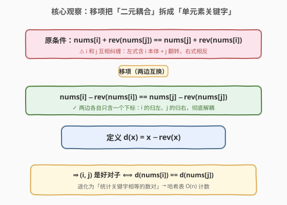
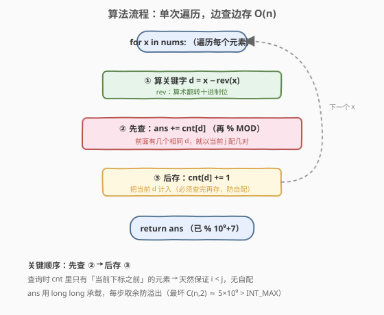

# 统计一个数组中好对子的数目

- **题目名称**：统计一个数组中好对子的数目
- **链接**：[1814. 统计一个数组中好对子的数目](https://leetcode.cn/problems/count-nice-pairs-in-an-array/)
- **难度**：中等
- **标签**：数组、哈希表、数学

## 1. 题目概述

给你一个数组 `nums`，数组中只包含**非负整数**。定义 `rev(x)` 为「把 `x` 的十进制位翻转后得到的整数」（翻转后去掉前导零，例如 `rev(13)=31`、`rev(120)=21`、`rev(0)=0`）。

满足下述条件的下标对 `(i, j)` 称为**好对子**：

- `0 <= i < j < nums.length`
- `nums[i] + rev(nums[j]) == nums[j] + rev(nums[i])`

请你返回 `nums` 中**好对子的数目**。由于结果可能很大，请对 $10^9 + 7$ 取余后返回。

**示例 1**：

```text
输入：nums = [42,11,1,97]
输出：2
解释：好对子为 (0,3) 和 (1,2)：
  (42,97)：42 + rev(97)=79 → 42+79=121；97 + rev(42)=24 → 97+24=121，相等 ✅
  (11,1) ：11 + rev(1)=1   → 11+1=12；  1 + rev(11)=11  → 1+11=12，  相等 ✅
```

**示例 2**：

```text
输入：nums = [13,10,35,24,76]
输出：4
解释：好对子为 (0,2)、(0,3)、(2,3)、(1,4)。
```

**约束条件**：

- `1 <= nums.length <= 10^5`
- `0 <= nums[i] <= 10^9`

---

## 2. 解题思路

### 2.1 暴力思路：两层循环枚举所有数对

最直观的做法是枚举所有 `(i, j)`（`i < j`），对每一对计算 `nums[i] + rev(nums[j])` 与 `nums[j] + rev(nums[i])` 是否相等：

```text
for i in 0..n-1:
    for j in i+1..n-1:
        if nums[i] + rev(nums[j]) == nums[j] + rev(nums[i]):
            ans += 1
```

时间复杂度 $O(n^2)$，对 $10^5$ 规模约 $10^{10}$ 次操作，必然超时。瓶颈在于：对每个 `j`，逐个枚举前面的 `i` 来判定配对——而配对条件其实可以化简成一个**单一关键字**的比较，这正是哈希表能优化到 $O(1)$ 的地方。

### 2.2 核心观察：移项变形，把「等式」化成「同关键字」



把好对子条件 `nums[i] + rev(nums[j]) == nums[j] + rev(nums[i])` 做移项：

$$
\text{nums}[i] - \text{rev}(\text{nums}[i]) \;=\; \text{nums}[j] - \text{rev}(\text{nums}[j])
$$

也就是说，令 $d(x) = x - \text{rev}(x)$，则 `(i, j)` 是好对子**当且仅当** $d(\text{nums}[i]) = d(\text{nums}[j])$。

> 💡 **关键转化**：原来的等式里 `i` 和 `j` 互相耦合（`i` 出现在左式、`j` 出现在右式），移项后两边各自只含一个下标——把「一对元素的二元关系」拆成了「每个元素各自的标量关键字 $d(x)$」。问题立刻退化为经典的**「统计关键字相等的数对」**，和 [1. 两数之和](1_两数之和.md) 的哈希查补数同源，只是这里查的是「相同」而非「互补」。

于是只需一次遍历：对当前 `nums[j]` 算出 `d = nums[j] - rev(nums[j])`，前面已经出现过多少个相同 `d` 的元素，就有多少个好对子以 `j` 结尾——用哈希表 `cnt[d]` 记录关键字 `d` 出现的次数，**边查边累加、边更新**即可。

### 2.3 算法流程图



整个流程是单层循环，每个元素只做一次 `rev` 计算 + 一次哈希表读写，总时间 $O(n)$。注意取余：答案每步累加后立即 `% MOD`，防止溢出（$n \le 10^5$ 时最大答案约 $\binom{n}{2} \approx 5 \times 10^9$，超过 `int` 范围，需用 `long long` 中间变量）。

### 2.4 示例演算

![示例演算 nums=[42,11,1,97]](../images/countnicepairs_example_walkthrough.svg)

以 `nums=[42,11,1,97]` 为例，逐个计算 $d(x) = x - \text{rev}(x)$：

| 步骤 | `x` | `rev(x)` | `d = x - rev(x)` | 查 `cnt[d]`（已有同 d 个数） | 累加到答案 | 更新后 `cnt` |
|------|-----|----------|------------------|------------------------------|------------|--------------|
| j=0 | 42 | 24 | 18 | 0 | 0 | `{18:1}` |
| j=1 | 11 | 11 | 0  | 0 | 0 | `{18:1, 0:1}` |
| j=2 | 1  | 1  | 0  | 1（前面有个 0，即 11） | **1** ⭐ | `{18:1, 0:2}` |
| j=3 | 97 | 79 | 18 | 1（前面有个 18，即 42） | **2** ⭐ | `{18:2, 0:2}` |

最终答案 `2`，对应好对子 `(11,1)` 与 `(42,97)`，与示例一致。

> ⚠️ **「先查后存」的顺序**：必须先用 `cnt[d]` 累加答案，再 `cnt[d]++`。若先存后查，会把当前元素自己也算进配对，多算一对（即错误地允许 `i == j`）。这一步和 [1. 两数之和](1_两数之和.md) 的「先查后存」完全同构——都是保证查询时表里只有「当前之前」的元素。

---

## 3. 参考代码

### C++（哈希表一次遍历）

```cpp
class Solution {
  public:
    int countNicePairs(vector<int>& nums) {
        constexpr int MOD = 1e9 + 7;
        unordered_map<int, int> cnt; // d(x) -> 出现次数
        long long ans = 0;
        for (int x : nums) {
            int d = x - rev(x); // 关键字：x - rev(x)
            ans = (ans + cnt[d]) % MOD; // 先查：前面有几个相同 d，就配几对
            cnt[d]++;                   // 后存：把当前 d 计入
        }
        return ans;
    }

  private:
    int rev(int x) {
        int r = 0;
        while (x) {
            r = r * 10 + x % 10;
            x /= 10;
        }
        return r; // x=0 时循环不执行，返回 0，正确
    }
};
```

### Python

```python
class Solution:
    def countNicePairs(self, nums: List[int]) -> int:
        MOD = 10**9 + 7
        cnt = {}  # d(x) -> 出现次数
        ans = 0
        for x in nums:
            d = x - int(str(x)[::-1])  # 关键字：x - rev(x)
            ans = (ans + cnt.get(d, 0)) % MOD  # 先查
            cnt[d] = cnt.get(d, 0) + 1          # 后存
        return ans
```

> 💡 **`rev` 的两种写法**：C++ 用算术循环 `r = r*10 + x%10`，避免字符串开销且天然处理前导零（`rev(120)=21`，因为 `021` 作为整数就是 `21`）；Python 用 `int(str(x)[::-1])` 更简洁，`int("021")` 同样自动去掉前导零。两者对 `x=0` 都返回 `0`。

---

## 4. 复杂度分析

| 维度 | 复杂度 | 说明 |
|------|--------|------|
| 时间复杂度 | $O(n \log M)$ | 遍历 $n$ 个元素，每个计算 `rev` 需 $O(\log_{10} M)$ 位（$M = 10^9$ 最多 9 位），哈希表操作 $O(1)$；通常写作 $O(n)$ |
| 空间复杂度 | $O(n)$ | 最坏情况所有 `d(x)` 互不相同，哈希表存 $n$ 个键 |

---

## 5. 扩展：为何不用排序 + 双指针？

「统计关键字相等的数对」还有另一种思路：先算出所有 `d(x)`，**排序**后用双指针/分组统计同值段的对数 $\binom{k}{2}$。时间 $O(n \log n)$、空间 $O(n)$（或 $O(1)$ 额外若原地排序）。

| 解法 | 时间 | 空间 | 备注 |
|------|------|------|------|
| 哈希表（推荐） | $O(n)$ | $O(n)$ | 单次遍历，常数小 |
| 排序 + 分组 | $O(n \log n)$ | $O(n)$ | 需额外数组存 `d(x)`，再排序统计段长 |

本题 $n \le 10^5$，哈希表线性解法更优；排序法在「不允许哈希」或「要求输出具体配对」时才更有意义。

---

## 6. 面试要点

1. **怎么想到移项变形？原始等式哪里「不友好」？**

   - 原始等式 `nums[i]+rev(nums[j])==nums[j]+rev(nums[i])` 里 `i`、`j` 互相纠缠：左式含 `i` 的本体和 `j` 的翻转，右式相反。这种「二元耦合」无法直接用单关键字查。移项把含 `i` 的项归一边、含 `j` 的项归另一边，等式变成 `nums[i]-rev(nums[i]) == nums[j]-rev(nums[j])`，两边各自独立——这是「把二元关系拆成单元素函数」的通用手法，[1492. n 的第 k 个因子] 这类「等价改写」同源。

2. **为什么是「先查后存」？反过来会怎样？**

   - 先查 `cnt[d]` 再 `cnt[d]++`，保证查询时表里只有当前下标**之前**的元素，配对天然满足 `i < j`。若先存后查，当前元素会把自己也算进 `cnt[d]`，相当于允许 `i == j`，多算一对自配——和 [1. 两数之和](1_两数之和.md) 防自配是同一个坑。

3. **答案为什么要取余？哪一步会溢出？**

   - 最坏情况所有 `d(x)` 相同，好对子数 $\binom{n}{2} = \frac{n(n-1)}{2}$，$n=10^5$ 时约 $5 \times 10^9$，超过 `int` 上限 $2.1 \times 10^9$。C++ 中 `ans` 必须用 `long long` 承载中间累加，再 `% MOD`；`cnt[d]` 本身只记次数（最大 $n$）不会溢出，但累加到 `ans` 那步会。

4. **`rev(0)` 和带前导零的情况怎么处理？**

   - `rev(0)=0`：算术循环 `while(x)` 对 `x=0` 不执行，返回 `0`；Python `int("0"[::-1])=int("0")=0`。带前导零如 `rev(120)`：算术上 `021` 即 `21`，整数表示自动消去前导零，无需特判。注意 `d(120)=120-21=99`，而非把 `021` 当字符串处理。

5. **和 [1. 两数之和] 的哈希解法本质区别是什么？**

   - 两数之和查的是**互补**（`target - a`），配对条件是「和为定值」；本题查的是**相同**（`d` 相等），配对条件是「关键字相等」。两者都是「边查边存、单次遍历」，但前者找的是「另一个特定的值」，后者找的是「所有同值元素」——所以两数之和命中即返回，本题要把命中次数**累加**而非返回。

---

## 7. 同类练习题

- [1. 两数之和](https://leetcode.cn/problems/two-sum/)（[题解](../0001-0100/1_两数之和.md)）：哈希表一次遍历查补数，本题「边查边存」的同源母题，对比「查互补」与「查相同」。
- [454. 四数相加 II](https://leetcode.cn/problems/4sum-ii/)：分组 + 哈希统计对数（Meet in the Middle），同样是「哈希计数配对」范式，本题是其单数组的退化版。
- [2001. 可互换矩形的数目](https://leetcode.cn/problems/number-of-pairs-of-interchangeable-rectangles/)：把「宽高比相同」化简为单关键字后哈希计数，和本题「移项化同关键字」完全同构。
- [2341. 数组能形成多少数对](https://leetcode.cn/problems/maximum-number-of-pairs-in-array/)：哈希频率统计配对数，思路相近但不含移项变形。
