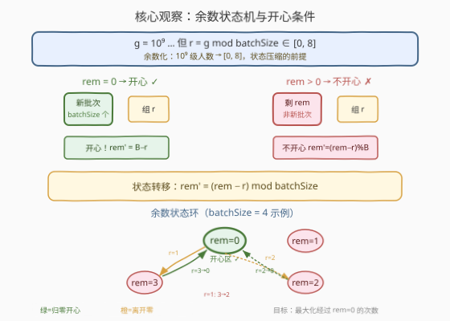
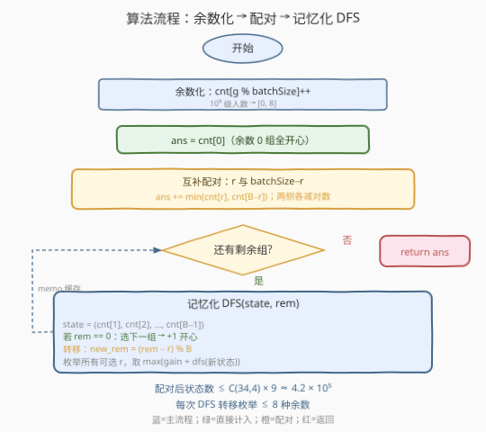
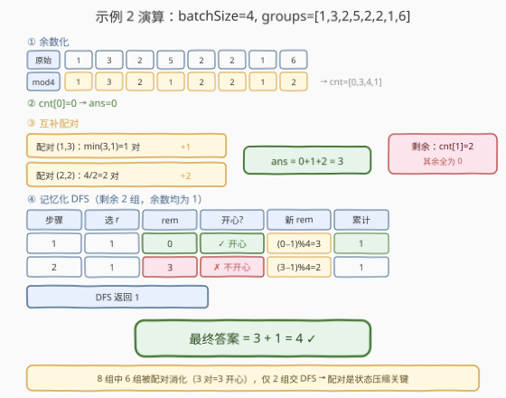

# 得到新鲜甜甜圈的最多组数

- **题目名称**：得到新鲜甜甜圈的最多组数
- **链接**：[1815. 得到新鲜甜甜圈的最多组数](https://leetcode.cn/problems/maximum-number-of-groups-getting-fresh-donuts/)
- **难度**：困难
- **标签**：状态压缩 DP、记忆化搜索、贪心、数学

## 1. 题目概述

甜甜圈商店每批次烤 `batchSize` 个甜甜圈，且烤新一批时之前所有甜甜圈必须全部售完。给定整数数组 `groups`，`groups[i]` 表示第 $i$ 批顾客的人数，每人恰好买一个甜甜圈。

一组顾客中，如果**第一位顾客**拿到的甜甜圈**不是上一组剩下的**（即来自刚烤好的新批次），这组人就开心。你可以任意安排顾客到来顺序，求**最多**有多少组开心。

**示例 1**：

```text
输入：batchSize = 3, groups = [1,2,3,4,5,6]
输出：4
解释：安排顺序 [6,2,4,5,1,3]，第 1、2、4、6 组开心。
```

**示例 2**：

```text
输入：batchSize = 4, groups = [1,3,2,5,2,2,1,6]
输出：4
```

**约束条件**：

- $1 \le \text{batchSize} \le 9$
- $1 \le \text{groups.length} \le 30$
- $1 \le \text{groups}[i] \le 10^9$

> 💡 **关键观察**：顾客人数可能高达 $10^9$，但真正影响「是否开心」的只有 $g \bmod \text{batchSize}$——因为每批烤 `batchSize` 个，剩余甜甜圈数始终在 $[0, \text{batchSize})$ 范围内循环。而 $\text{batchSize} \le 9$ 这一极小上界，暗示了以余数为状态维度的压缩 DP。

---

## 2. 解题思路

### 2.1 暴力思路：全排列枚举

枚举 `groups` 的所有排列（$30!$ 种），对每种排列模拟余数变化并统计开心组数。显然不可行。

> ⚠️ **症结**：组数高达 30，全排列 $30! \approx 2.7 \times 10^{32}$ 完全爆炸。突破口是观察到**只有余数 $g \bmod \text{batchSize}$ 影响状态转移**，且 $\text{batchSize} \le 9$，余数种类极少，可做状态压缩。

### 2.2 核心观察：余数化 + 互补配对 + 记忆化搜索



本题分三层逐步降维：

**第一层：余数化。** 每批烤 `batchSize` 个，剩余甜甜圈数 $r \in [0, \text{batchSize})$。一组 $g$ 人到来时：

- 若 $r = 0$：需烤新批次，第一位顾客拿新鲜甜甜圈 → **开心**。
- 若 $r > 0$：第一位拿上一批剩的 → 不开心。

服务后剩余 $r' = (r - g) \bmod \text{batchSize} = (r - g \bmod \text{batchSize}) \bmod \text{batchSize}$。

因此每组只需记录余数 $g \bmod \text{batchSize}$，原始人数不重要。

**第二层：余数 0 组直接开心。** 若 $g \bmod \text{batchSize} = 0$，则服务后 $r' = r$（不改变余数）。在 $r = 0$ 时服务它们，全部开心且 $r$ 始终保持 0。所以余数为 0 的组**直接计入答案**，从后续安排中移除。

**第三层：互补配对。** 对余数 $r \in [1, \text{batchSize})$，若存在余数 $\text{batchSize} - r$ 的组，则两者配对：先服务 $r$（$r = 0$ 时开心，$r' = \text{batchSize} - r$），再服务 $\text{batchSize} - r$（$r' = 0$，不开心但余数归零）。每对贡献恰好 **1 组开心**，且余数回到 0。

$$\boxed{r + (\text{batchSize} - r) \equiv 0 \pmod{\text{batchSize}} \;\Rightarrow\; \text{每对互补组贡献 } 1 \text{ 组开心}}$$

> 💡 **为什么配对总是最优？** 配对用 2 组换 1 组开心，是「2 组 1 开心」的最高效率——除非余数为 0（已移除），否则单组不可能既开心又归零。不配对则这 2 组只能参与更大的轮次，每轮仍只 1 组开心，效率不高于配对。因此**贪心配对不减总开心数**。

配对后，每个互补对 $(r, \text{batchSize} - r)$ 中至多一侧有剩余组，剩余种类数从 $\text{batchSize} - 1$ 降到 $\le \lceil (\text{batchSize}-1)/2 \rceil \le 4$。

### 2.3 算法流程图



**步骤**：

1. **余数化 + 统计**：对每组取 $g \bmod \text{batchSize}$，统计各余数计数 `cnt[0..batchSize-1]`。
2. **余数 0 组**：`ans = cnt[0]`，全部开心。
3. **互补配对**：对 $r = 1 \ldots \lfloor \text{batchSize}/2 \rfloor$：
   - 若 $r \ne \text{batchSize} - r$：配 $\min(\text{cnt}[r], \text{cnt}[\text{batchSize}-r])$ 对，`ans += 对数`，两侧各减对数。
   - 若 $r = \text{batchSize} - r$（batchSize 为偶数）：配 $\text{cnt}[r] / 2$ 对（向下取整），`ans += 对数`，`cnt[r] %= 2`。
4. **记忆化 DFS**：对配对后的剩余组，状态 = `(各余数计数, 当前余数 rem)`，`rem` 初始 0。每次选一个余数 $r$（计数 > 0），若 `rem == 0` 则 +1 开心，转移到 `(计数减一, (rem - r) % batchSize)`，取最大值。
5. **返回** `ans + dfs(剩余状态, 0)`。

> 💡 **状态空间为何可控？** 配对后至多 4 种非零余数，总计 $\le 30$ 组。状态数为「4 种计数之和 $\le 30$」的组合数 $\binom{34}{4} = 46376$，乘以 `batchSize`（$\le 9$）种 `rem` 值，约 $4.2 \times 10^5$。记忆化后完全可接受。

### 2.4 示例演算

以示例 2 `batchSize = 4, groups = [1,3,2,5,2,2,1,6]` 为例：



**第 1 步：余数化**

| 原始组 | 1 | 3 | 2 | 5 | 2 | 2 | 1 | 6 |
|--------|---|---|---|---|---|---|---|---|
| 余数 (mod 4) | 1 | 3 | 2 | 1 | 2 | 2 | 1 | 2 |

`cnt = [0, 3, 4, 1]`（cnt[0]=0, cnt[1]=3, cnt[2]=4, cnt[3]=1）。

**第 2 步：余数 0 组** → `ans = 0`。

**第 3 步：互补配对**（batchSize=4，配对 $r=1$ 与 $3$，$r=2$ 与自身）：

| 配对 | 操作 | 对数 | 剩余 |
|------|------|------|------|
| $(1, 3)$ | $\min(3, 1) = 1$ | 1 | cnt[1]=2, cnt[3]=0 |
| $(2, 2)$ | $4 / 2 = 2$ | 2 | cnt[2]=0 |

`ans = 0 + 1 + 2 = 3`。剩余状态：`cnt[1]=2, cnt[2]=0, cnt[3]=0`。

**第 4 步：记忆化 DFS**（剩余两组，余数均为 1，rem=0）

| 步骤 | 选择 | rem | 开心? | 新 rem | 累计 |
|------|------|-----|-------|--------|------|
| 1 | 余数 1 | 0 | ✓ | $(0-1)\%4 = 3$ | 1 |
| 2 | 余数 1 | 3 | ✗ | $(3-1)\%4 = 2$ | 1 |

DFS 返回 1。

**最终答案**：`ans = 3 + 1 = 4` ✓

> 💡 **看配对如何省力**：8 组中 6 组被配对消化（3 对 = 3 开心），只剩 2 组交给 DFS。若不做配对，8 组全部进入 DFS，状态空间会大得多。配对既是贪心优化，也是状态压缩的关键手段。

---

## 3. 参考代码

### C++

```cpp
class Solution {
public:
    int maxHappyGroups(int batchSize, vector<int>& groups) {
        vector<int> cnt(batchSize, 0);
        for (int g : groups)
            cnt[g % batchSize]++;

        int ans = cnt[0];

        // 互补配对
        for (int r = 1; r <= batchSize / 2; r++) {
            if (r == batchSize - r) {
                int pairs = cnt[r] / 2;
                ans += pairs;
                cnt[r] %= 2;
            } else {
                int pairs = min(cnt[r], cnt[batchSize - r]);
                ans += pairs;
                cnt[r] -= pairs;
                cnt[batchSize - r] -= pairs;
            }
        }

        // 记忆化 DFS：状态 = 各余数计数(编码) + rem
        unordered_map<long long, int> memo;

        function<int(long long, int)> dfs = [&](long long state, int rem) -> int {
            if (state == 0) return 0;
            long long key = state * 16 + rem;
            auto it = memo.find(key);
            if (it != memo.end()) return it->second;

            int best = 0;
            for (int r = 1; r < batchSize; r++) {
                int c = (state >> ((r - 1) * 5)) & 31;
                if (c > 0) {
                    long long newState = state - (1LL << ((r - 1) * 5));
                    int newRem = (rem - r % batchSize + batchSize) % batchSize;
                    int gain = (rem == 0) ? 1 : 0;
                    best = max(best, gain + dfs(newState, newRem));
                }
            }
            memo[key] = best;
            return best;
        };

        long long state = 0;
        for (int r = 1; r < batchSize; r++)
            state |= (long long)cnt[r] << ((r - 1) * 5);

        return ans + dfs(state, 0);
    }
};
```

### Python

```python
from functools import lru_cache

class Solution:
    def maxHappyGroups(self, batchSize: int, groups: List[int]) -> int:
        cnt = [0] * batchSize
        for g in groups:
            cnt[g % batchSize] += 1

        ans = cnt[0]

        # 互补配对
        for r in range(1, batchSize // 2 + 1):
            if r == batchSize - r:
                pairs = cnt[r] // 2
                ans += pairs
                cnt[r] %= 2
            else:
                pairs = min(cnt[r], cnt[batchSize - r])
                ans += pairs
                cnt[r] -= pairs
                cnt[batchSize - r] -= pairs

        # 记忆化 DFS
        @lru_cache(maxsize=None)
        def dfs(state: tuple, rem: int) -> int:
            if all(c == 0 for c in state):
                return 0
            best = 0
            for i in range(len(state)):
                if state[i] > 0:
                    r = i + 1  # 余数 = 下标 + 1
                    new_state = state[:i] + (state[i] - 1,) + state[i + 1:]
                    new_rem = (rem - r) % batchSize
                    gain = 1 if rem == 0 else 0
                    best = max(best, gain + dfs(new_state, new_rem))
            return best

        state = tuple(cnt[r] for r in range(1, batchSize))
        return ans + dfs(state, 0)
```

> 💡 **实现细节**：① **余数化**：`g % batchSize` 把 $10^9$ 级人数压到 $[0, 8]$，是后续一切的基础。② **互补配对**：对 $r$ 和 $\text{batchSize} - r$ 取 `min`，每对 1 开心；$r = \text{batchSize}/2$（偶数时）自身配对，`cnt // 2` 对。③ **C++ 状态编码**：每个余数计数 $\le 30 < 32$，用 5 bit 编码，8 种余数共 40 bit，存入 `long long`。`key = state * 16 + rem` 唯一编码状态与余数（`rem < batchSize ≤ 9 < 16`）。④ **Python** 直接用 `tuple` 作 `lru_cache` 键，简洁高效。⑤ **配对后状态空间**：至多 4 种非零余数，$\binom{34}{4} \times 9 \approx 4.2 \times 10^5$，远小于不做配对时的 $\binom{38}{8} \times 9 \approx 4.4 \times 10^8$。

> ⚠️ **配对正确性的关键**：配对 2 组得 1 开心，是「2 组 1 开心」的最高效率。不配对则这两组进入更大的轮次（3+ 组才归零），每轮仍只 1 开心，效率不高于配对。因此贪心配对不减总开心数——这是状态压缩能生效的前提。

---

## 4. 复杂度分析

| 维度 | 复杂度 | 说明 |
|------|--------|------|
| 时间 | $O(S \cdot \text{batchSize})$ | $S$ 为 DFS 状态数；配对后至多 4 种非零余数、总计 $\le 30$，$S = \binom{30+4}{4} \times \text{batchSize} \approx 4.2 \times 10^5$；每次转移枚举 $\le 8$ 种余数 |
| 空间 | $O(S)$ | 记忆化哈希表存储 $S$ 个状态，每个状态 $O(1)$ |

> 💡 **与不做配对的对比**：不做配对时 8 种余数、总计 $\le 30$，$S = \binom{38}{8} \times 9 \approx 4.4 \times 10^8$，TLE。配对把状态空间缩减约 $1000$ 倍，是本题从超时到通过的转折点。

> ⚠️ **最坏情况**：所有 30 组余数相同（如全为 1），无互补可配，但仅 1 种非零余数，$S = 31 \times 9 = 279$，反而最快。真正的最坏是 4 种余数各 ~7 组，$S \approx 4.2 \times 10^5$。

---

## 5. 扩展：为什么不做配对会超时？

不做配对时，DFS 状态为 `(cnt[1], cnt[2], ..., cnt[8], rem)`，8 种余数总计 $\le 30$。状态数为：

$$S_{\text{无配对}} = \binom{30 + 8}{8} \times 9 = \binom{38}{8} \times 9 \approx 4.4 \times 10^8$$

这远超时间限制。配对后，每个互补对 $(r, \text{batchSize} - r)$ 中至多一侧非零，非零种类数从 8 降到 4：

$$S_{\text{配对后}} = \binom{30 + 4}{4} \times 9 = \binom{34}{4} \times 9 \approx 4.2 \times 10^5$$

缩减约 $1000$ 倍。这本质上是利用了**互补组的局部最优性**——把「必然以 2 组 1 开心方式消耗」的对子提前剥离，只把「无法简单配对」的残差交给搜索。

> 💡 **更一般的思路**：当状态空间过大时，寻找**可贪心剥离的子结构**是压缩 DP 的通用技巧。本题的互补配对、[1049. 最后一块石头的重量 II](https://leetcode.cn/problems/last-stone-weight-ii/) 中「最大公约数合并」、以及区间 DP 中的「断点剪枝」，都是这一思想的体现。

---

## 6. 面试要点

**Q1：为什么只关心 $g \bmod \text{batchSize}$ 而非原始人数？**

> 每批烤 `batchSize` 个，剩余甜甜圈数 $r$ 始终在 $[0, \text{batchSize})$ 内循环。服务 $g$ 人后 $r' = (r - g) \bmod \text{batchSize}$，只依赖 $g \bmod \text{batchSize}$。人数 $10^9$ 级别但余数 $\le 8$，这是状态压缩的前提。

**Q2：余数为 0 的组为什么可以直接计入答案？**

> $g \bmod \text{batchSize} = 0$ 时，$r' = (r - 0) \bmod \text{batchSize} = r$，不改变余数。在 $r = 0$ 时连续服务它们，每一位顾客都拿到新鲜甜甜圈，全部开心且 $r$ 始终为 0。因此直接计入答案并从后续安排中移除。

**Q3：互补配对为什么总是最优？**

> 配对 $(r, \text{batchSize} - r)$ 用 2 组换 1 开心，是「非零余数组」的最高效率——单组无法既开心又归零（除非余数为 0）。不配对则这两组参与更大的轮次，每轮仍只 1 开心，效率不高于配对。形式化地：任意合法排列中，把一对互补组「提取」为独立配对不会减少总开心数。

**Q4：DFS 的状态怎么编码？为什么不会溢出？**

> Python 用 `tuple` 直接做 `lru_cache` 键；C++ 把每个余数计数（$\le 30 < 32$，5 bit）拼成 `long long`（8 种余数共 40 bit），`key = state * 16 + rem`。配对后至多 4 种非零余数，状态数 $\approx 4.2 \times 10^5$，完全可控。

**Q5：如果 batchSize 很大（如 $10^5$）怎么办？**

> 本题的关键约束是 $\text{batchSize} \le 9$，使余数种类极少、状态压缩可行。若 batchSize 很大，余数种类爆炸，需另寻思路——但本题约束已锁定小 batchSize，面试中若被问可回答「这是 NP-hard 的排列优化问题，小 batchSize 是刻意留的窗口」。

> 💡 **一句话总结**：余数化把 $10^9$ 人数压到 $[0, 8]$；余数 0 组直接开心；互补配对贪心剥离（每对 1 开心）把状态空间缩减 1000 倍；剩余组用记忆化 DFS 搜最优排列。三层降维缺一不可。

---

## 7. 同类练习题

- [526. 优美的排列](https://leetcode.cn/problems/beautiful-arrangement/)（[题解](../0401-0500/526_优美的排列.md)）：状态压缩 DP 母题——`bitmask` 记已用元素，$n \le 15$ 甜区，理解后本题的状态编码水到渠成
- [1655. 分配重复整数](https://leetcode.cn/problems/distribute-repeating-integers/)：状态压缩 DP + 子集枚举——把「物品分配给需求」转化为 bitmask DP，与本题「余数计数 + 转移」结构相似
- [1125. 最小的必要团队](https://leetcode.cn/problems/smallest-sufficient-team/)：状压 DP 求「覆盖所有需求的最小选取」——`bitmask` 表示已覆盖的需求集，与本题「余数计数编码」思路互补
- [1049. 最后一块石头的重量 II](https://leetcode.cn/problems/last-stone-weight-ii/)（[题解](../1001-1100/1049_最后一块石头的重量II.md)）：0-1 背包求最值——「相撞 ⇔ 赋 ±号」的数学转换与本题「余数化」同属「问题变形后暴露 DP 结构」的范式
- [149. 直线上最多的点数](https://leetcode.cn/problems/max-points-on-a-line/)（[题解](../0101-0200/149_直线上最多的点数.md)）：哈希表 + GCD 化简——用数学不变量（斜率）压缩状态，与本题用余数压缩人数异曲同工
