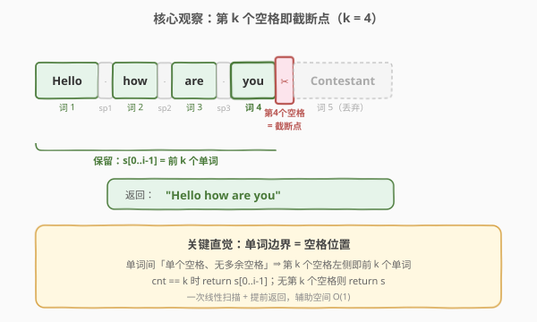
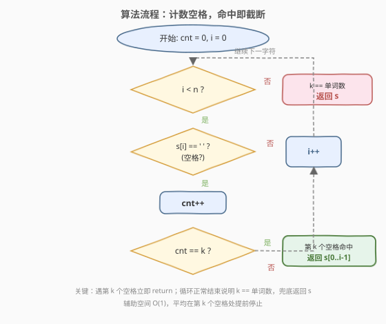
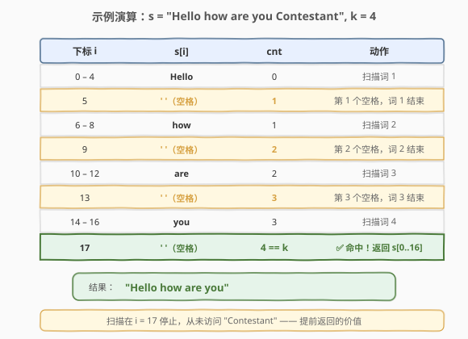

# 截断句子

- **题目名称**：截断句子
- **链接**：[1816. 截断句子](https://leetcode.cn/problems/truncate-sentence/)
- **难度**：简单
- **标签**：字符串

## 1. 题目概述

**句子**是一个单词列表，列表中的单词之间用**单个空格**隔开，且不存在前导或尾随空格。每个单词仅由大小写英文字母组成。给你一个句子 `s` 和一个整数 `k`，请你将 `s` **截断**，使截断后的句子仅含**前** `k` 个单词。返回截断后得到的句子。

**示例 1**：

```text
输入：s = "Hello how are you Contestant", k = 4
输出："Hello how are you"
解释：s 中的单词为 ["Hello", "how", "are", "you", "Contestant"]
      前 4 个单词为 ["Hello", "how", "are", "you"]，故返回 "Hello how are you"
```

**示例 2**：

```text
输入：s = "What is the solution to this problem", k = 4
输出："What is the solution"
解释：s 中单词为 ["What", "is", "the", "solution", "to", "this", "problem"]
      前 4 个单词为 ["What", "is", "the", "solution"]，故返回 "What is the solution"
```

**示例 3**：

```text
输入：s = "chopper is not a tanuki", k = 5
输出："chopper is not a tanuki"
解释：s 中恰有 5 个单词，截断后仍为原句。
```

**约束条件**：

- `1 <= s.length <= 500`
- `k` 的取值范围是 `[1,  s 中单词的数目]`
- `s` 仅由大小写英文字母和空格组成
- `s` 中单词之间由单个空格隔开
- 不存在前导或尾随空格

> 💡 本题的关键约束是「单词之间**仅由单个空格**隔开、**无多余空格**」。这意味着**空格的个数 = 单词数 − 1**，第 `k` 个单词之后必然紧跟一个空格（除非它是最后一个单词）。因此只需找到**第 `k` 个空格**的位置，其左侧（不含该空格）即为答案；若不存在第 `k` 个空格（`k` 等于单词总数），则返回整个 `s`。

---

## 2. 解题思路

### 2.1 暴力思路

最直觉的做法是「按空格切分字符串，取前 `k` 个单词再拼接」：

- **Python**：`' '.join(s.split()[:k])` 或 `' '.join(s.split(' ')[:k])`，一行解决。
- **C++**：用 `istringstream >> word` 逐词读取，存入 `vector<string>`，取前 `k` 个再用空格拼接。

这种写法正确且直观，但会**创建中间单词列表**，空间复杂度为 $O(n)$（存储所有单词副本）。而题目只需返回原串的一个前缀——**完全不必把所有单词都切出来**。

### 2.2 核心观察：定位第 k 个空格



由于「单词间单个空格、无多余空格」，前 `k` 个单词的结尾位置恰好是**第 `k` 个空格的下标**（若 `k` 小于单词总数）。设该下标为 `i`，则 `s[0..i-1]` 即为答案。

> 💡 关键直觉：**单词边界 = 空格位置**。第 `k` 个单词之后一定紧跟第 `k` 个空格（除非它是末词）。所以问题从「取前 k 个单词」转化为「找第 k 个空格」，只需一次线性扫描，**遇到第 `k` 个空格立即停止**，不必扫描整个字符串。

**算法**：从左向右遍历 `s`，用 `cnt` 统计遇到的空格数。当 `cnt == k` 时，当前下标 `i` 即第 `k` 个空格的位置，返回 `s[0..i-1]`（即 `s.substr(0, i)` / `s[:i]`）。若遍历结束 `cnt` 仍未达到 `k`（说明 `k` 等于单词总数），返回整个 `s`。

**时间复杂度**：$O(n)$（最坏遍历整个字符串，但通常在第 `k` 个空格处提前停止）；**空间复杂度**：$O(1)$ 额外空间（返回的子串是输出本身，不计入辅助空间）。

### 2.3 算法流程图



流程核心是一个 `for` 循环：遇空格则 `cnt++`，一旦 `cnt == k` 立即 `return s[0..i-1]`；循环正常结束则 `return s`。**提前返回**是效率关键——一旦定位到截断点就不再扫描后续字符。

### 2.4 示例演算



以 `s = "Hello how are you Contestant"`、`k = 4` 为例，逐字符扫描：

- 扫描 `"Hello"`：无空格，`cnt = 0`。
- `i = 5`，`s[5] = ' '` → `cnt = 1`（第 1 个空格，词 1 结束）。
- 扫描 `"how"`：`cnt` 仍为 1。
- `i = 9`，`s[9] = ' '` → `cnt = 2`（第 2 个空格，词 2 结束）。
- 扫描 `"are"`：`cnt` 仍为 2。
- `i = 13`，`s[13] = ' '` → `cnt = 3`（第 3 个空格，词 3 结束）。
- 扫描 `"you"`：`cnt` 仍为 3。
- `i = 17`，`s[17] = ' '` → `cnt = 4 == k` → **命中**，返回 `s[0..16] = "Hello how are you"`。

> 💡 注意：扫描在 `i = 17` 即停止，**从未访问** `"Contestant"` 这一段。这正是「提前返回」的价值——平均情况下访问的字符数远小于 `n`。

---

## 3. 参考代码

### C++（计数空格 + 提前截断）

```cpp
class Solution {
  public:
    string truncateSentence(string s, int k) {
        int cnt = 0;
        for (int i = 0; i < (int)s.size(); i++) {
            if (s[i] == ' ') {
                cnt++;
                if (cnt == k) return s.substr(0, i);   // 第 k 个空格处截断
            }
        }
        return s;                                       // k == 单词总数，返回原句
    }
};
```

### Python（计数空格 + 提前截断）

```python
class Solution:
    def truncateSentence(self, s: str, k: int) -> str:
        cnt = 0
        for i, c in enumerate(s):
            if c == ' ':
                cnt += 1
                if cnt == k:
                    return s[:i]
        return s
```

### Python（API 一行流，对比用）

```python
class Solution:
    def truncateSentence(self, s: str, k: int) -> str:
        return ' '.join(s.split()[:k])
```

> ⚠️ **两种写法的对比**：`split()` 写法简洁、工程中常用，但会切出全部单词列表，空间 $O(n)$；计数空格写法仅用 $O(1)$ 辅助空间，且在第 `k` 个空格处提前停止，面试中更能体现对「单词边界 = 空格位置」这一观察的把握。建议先写计数版，再提 `split()` 作为对照。

---

## 4. 复杂度分析

| 维度 | 复杂度 | 说明 |
|------|--------|------|
| 时间复杂度 | $O(n)$ | 最坏情况遍历整个字符串（如 `k` 等于单词总数需扫到末尾）；平均在第 `k` 个空格处提前停止，实际访问字符数少于 `n` |
| 空间复杂度 | $O(1)$ | 仅用计数变量 `cnt` 和下标 `i`；返回的子串是输出本身，不计入辅助空间（C++ `substr` / Python 切片构造结果串） |

> 与 `split()` 写法的对比：`split()` 时间同为 $O(n)$，但空间为 $O(n)$（存储全部单词副本）；计数空格法辅助空间 $O(1)$，且通常提前停止。

---

## 5. 扩展：利用标准库 API

### 5.1 C++ `istringstream`

C++ 可用流式读取逐词提取，读到第 `k` 个词即停止拼接：

```cpp
class Solution {
  public:
    string truncateSentence(string s, int k) {
        istringstream iss(s);
        string word, ans;
        for (int i = 0; i < k; i++) {
            iss >> word;
            if (i > 0) ans += ' ';
            ans += word;
        }
        return ans;
    }
};
```

> ⚠️ 这种写法需要逐词拷贝拼接，空间 $O(n)$，效率不如直接 `substr`。仅作为「流式提取」思路的展示。

### 5.2 `find` 定位第 k 个空格

利用 `string::find` 反复从上一次命中位置之后查找空格，第 `k` 次命中的下标即为截断点：

```cpp
class Solution {
  public:
    string truncateSentence(string s, int k) {
        int pos = -1;
        while (k--) {
            pos = s.find(' ', pos + 1);
            if (pos == string::npos) return s;   // 不足 k 个空格，返回原句
        }
        return s.substr(0, pos);
    }
};
```

> 💡 与手写计数循环等价，但语义更聚焦于「找第 k 个空格」。`find` 返回 `npos` 时说明 `k` 等于单词总数，直接返回 `s`。

---

## 6. 面试要点

1. **为什么能直接定位第 k 个空格？**

   - 题目保证「单词间**单个空格**、**无多余空格**」，因此空格数 = 单词数 − 1，第 `k` 个单词之后紧跟第 `k` 个空格（除非是末词）。第 `k` 个空格左侧即为前 `k` 个单词。若没有第 `k` 个空格，说明 `k` 等于单词总数，返回原句。这是把「取前 k 个单词」转化为「找第 k 个空格」的关键。

2. **如果有多余空格怎么办？**

   - 本题约束排除了多余空格。若放宽条件（如允许连续空格 / 前导尾随空格，类似 [58. 最后一个单词的长度](../0001-0100/58_最后一个单词的长度.md)），则不能简单数空格，需先跳过连续空格再数单词，逻辑接近 151 题的「跳过空格 → 定位单词」子操作。

3. **`cnt == k` 时为什么返回 `s[0..i-1]` 而不是 `s[0..i]`？**

   - `i` 是第 `k` 个空格的下标，`s[i]` 本身是空格，不应包含在结果中。截断后的句子保留前 `k` 个单词和它们之间的 `k-1` 个空格，正好是 `s[0..i-1]`。

4. **`split()` 写法有什么问题？**

   - 功能完全正确，Python 的 `s.split()` 会自动处理空格。但它切出了**全部单词**的副本（即便只需前 `k` 个），空间 $O(n)$；且必然扫描整个字符串。计数空格法在第 `k` 个空格处提前停止，辅助空间 $O(1)$。

5. **`k` 等于单词总数时怎么处理？**

   - 此时不存在第 `k` 个空格，循环遍历到末尾 `cnt` 仍小于 `k`，函数走到最后的 `return s`。无需特判，循环自然兜底。示例 3 即此情况。

---

## 7. 同类练习题

- [58. 最后一个单词的长度](https://leetcode.cn/problems/length-of-last-word/)（[站内题解](../0001-0100/58_最后一个单词的长度.md)）：同为字符串单词定位题；本题定位「前 k 个单词」，58 题定位「最后一个单词」，都建立在「单词边界 = 空格位置」的观察上
- [151. 反转字符串中的单词](https://leetcode.cn/problems/reverse-words-in-a-string/)（[站内题解](../0101-0200/151_反转字符串中的单词.md)）：单词切分处理家族的升级版——需定位每个单词并反转顺序、去除多余空格
- [165. 比较版本号](https://leetcode.cn/problems/compare-version-numbers/)（[站内题解](../0101-0200/165_比较版本号.md)）：字符串切分 + 逐段比较，字符串分段处理的另一形态
- [14. 最长公共前缀](https://leetcode.cn/problems/longest-common-prefix/)（[站内题解](../0001-0100/14_最长公共前缀.md)）：字符串纵向 / 横向扫描，同属字符串基础扫描题
- [8. 字符串转换整数 (atoi)](https://leetcode.cn/problems/string-to-integer-atoi/)（[站内题解](../0001-0100/8_字符串转换整数atoi.md)）：字符串逐字符扫描 + 边界处理，更复杂的字符串扫描题
