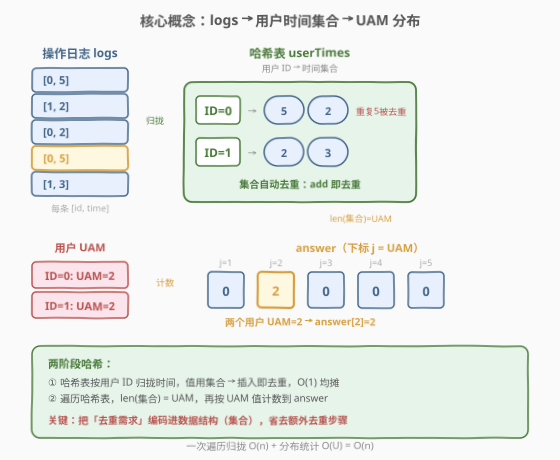
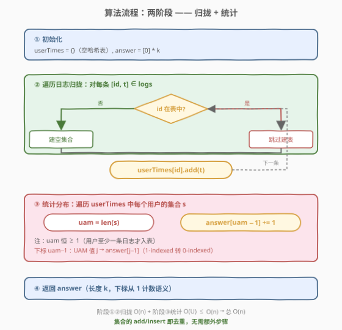
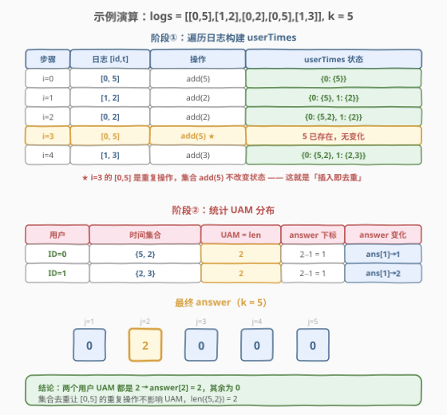

# LeetCode 查找用户活跃分钟数 题解

## 1. 题目概述

- **标题 / 题号**：查找用户活跃分钟数（#1817，medium）
- **链接**：https://leetcode.cn/problems/finding-the-users-active-minutes/
- **难度**：中等
- **标签**：数组、哈希表

**题意**：给定用户在 LeetCode 上的操作日志 `logs`，其中 `logs[i] = [ID_i, time_i]` 表示 ID 为 `ID_i` 的用户在 `time_i` 分钟执行了一次操作。**多个用户**可在同一分钟操作，**单个用户**也可在同一分钟执行**多个操作**。

定义某用户的**用户活跃分钟数（UAM）**为该用户执行操作的**唯一分钟数**（同一分钟多次操作只计一次）。

再给定整数 `k`，要求返回长度为 `k`、**下标从 1 开始**的数组 `answer`，其中 `answer[j]` 表示 UAM 恰好等于 `j` 的用户数。

**示例 1**：

```text
输入：logs = [[0,5],[1,2],[0,2],[0,5],[1,3]], k = 5
输出：[0,2,0,0,0]
解释：
  ID=0 的用户操作分钟为 {5, 2, 5}，去重后 {2, 5}，UAM = 2
  ID=1 的用户操作分钟为 {2, 3}，去重后 {2, 3}，UAM = 2
  两个用户 UAM 都是 2，故 answer[2] = 2，其余为 0
```

**示例 2**：

```text
输入：logs = [[1,1],[2,2],[2,3]], k = 4
输出：[1,1,0,0]
解释：
  ID=1 的用户操作分钟为 {1}，UAM = 1
  ID=2 的用户操作分钟为 {2, 3}，UAM = 2
  answer[1] = 1，answer[2] = 1，其余为 0
```

**约束**：

- $1 \le \text{logs.length} \le 10^4$
- $0 \le ID_i \le 10^9$
- $1 \le time_i \le 10^5$
- `k` 的取值范围为 $[\text{用户最大 UAM}, 10^5]$

> 💡 **关键观察**：题目的核心是「**按用户去重分钟数**」——同一用户同一分钟的多次操作只算一次。这天然对应「用户 ID → 该用户的时间集合」的映射，而集合的**去重**性质恰好处理了重复分钟。最终再对「UAM 值」做一次计数即可得到分布。

## 2. 解题思路

### 2.1 暴力思路：对每个用户线性扫描所有日志

最直观的做法是：先枚举所有出现过的用户 ID，对每个用户再遍历一遍 `logs`，收集其所有 `time`，再去重数个数。

```text
for each user_id in 出现过的用户:
    times = []
    for (id, t) in logs:
        if id == user_id:
            times.append(t)
    uam = len(set(times))
    answer[uam] += 1
```

若日志中有 $U$ 个不同用户、$n$ 条日志，总时间 $O(U \cdot n)$。最坏 $U = n$（每条日志一个新用户），退化为 $O(n^2) = 10^8$，效率低。问题在于：**为每个用户重复扫描了整个日志**，没有把「同一用户的记录」一次性归拢。

### 2.2 核心观察：哈希表 + 集合，一次遍历归拢



优化关键是用**哈希表** `userTimes` 把「按用户收集时间」从 $O(U \cdot n)$ 降到 $O(n)$：

1. **一次遍历归拢**：遍历 `logs`，对每条 `[id, t]`，把 `t` 加入 `userTimes[id]` 这个**集合**。集合自动去重，无需后续再 `set()`。
2. **统计分布**：遍历 `userTimes`，对每个用户的集合大小 `uam = len(userTimes[id])`，若 `1 <= uam <= k`，则 `answer[uam - 1] += 1`（下标从 1 转从 0）。

> 💡 **为什么用「集合」而非「列表」？** 题目明确「同一分钟多次操作只计一次」。若用列表收集，最终还需 `len(set(list))` 去重；直接用集合作为值，**插入即去重**，每条日志的 `add` 操作 $O(1)$ 均摊，无需额外的去重步骤。这是把「去重需求」直接编码进数据结构的典型思路。

> ⚠️ **用户 ID 范围达 $10^9$**：不能开长度 $10^9$ 的数组当哈希表，必须用真正的哈希容器（Python `dict` / C++ `unordered_map`）。键是用户 ID，值是时间集合（Python `set` / C++ `unordered_set<int>`）。

### 2.3 算法流程图



**步骤**：

1. **初始化**：空哈希表 `userTimes`（`dict[int, set[int]]`），答案数组 `answer = [0] * k`。
2. **遍历日志归拢**：对每条 `[id, t] \in logs`：执行 `userTimes[id].add(t)`（若 `id` 不存在，先建空集合）。
3. **统计分布**：对 `userTimes` 中每个用户的集合 `s`：令 `uam = len(s)`，若 `1 <= uam <= k`，`answer[uam - 1] += 1`。
4. **返回** `answer`。

> 💡 **为何要判 `uam <= k`？** 题目保证 `k >= 用户最大 UAM`，故正常情况下 `uam` 不会超过 `k`。但作为防御性编程，加上边界检查可避免越界——即便题目约束被破坏也不会崩溃。实际上由于约束保证，这步判断恒为真，可省略。

### 2.4 示例演算

以 `logs = [[0,5],[1,2],[0,2],[0,5],[1,3]], k = 5` 为例：



逐步追踪 `userTimes` 的构建过程：

| 步骤 | 日志 `[id, t]` | 操作 | `userTimes` 状态 |
|------|---------------|------|------------------|
| i=0 | `[0, 5]` | `userTimes[0].add(5)` | `{0: {5}}` |
| i=1 | `[1, 2]` | `userTimes[1].add(2)` | `{0: {5}, 1: {2}}` |
| i=2 | `[0, 2]` | `userTimes[0].add(2)` | `{0: {5, 2}, 1: {2}}` |
| i=3 | `[0, 5]` | `userTimes[0].add(5)`（5 已在集合，无变化） | `{0: {5, 2}, 1: {2}}` |
| i=4 | `[1, 3]` | `userTimes[1].add(3)` | `{0: {5, 2}, 1: {2, 3}}` |

**分布统计**：

| 用户 | 时间集合 | UAM = len(集合) | answer 索引（UAM−1） | answer 变化 |
|------|---------|----------------|---------------------|-------------|
| 0 | `{5, 2}` | 2 | 1 | `answer[1] += 1` → 1 |
| 1 | `{2, 3}` | 2 | 1 | `answer[1] += 1` → 2 |

最终 `answer = [0, 2, 0, 0, 0]`，与示例一致。

> 💡 **第 3 步的关键**：`[0, 5]` 这条日志中，用户 0 在第 5 分钟**重复操作**。由于 `userTimes[0]` 是集合，`add(5)` 对已存在的 5 不做任何改变——这正是集合「插入即去重」的体现，无需额外判断。

## 3. 参考代码

### Python

```python
class Solution:
    def findingUsersActiveMinutes(self, logs: List[List[int]], k: int) -> List[int]:
        user_times: dict[int, set[int]] = {}
        for uid, t in logs:
            if uid not in user_times:
                user_times[uid] = set()
            user_times[uid].add(t)

        answer = [0] * k
        for s in user_times.values():
            uam = len(s)
            if 1 <= uam <= k:
                answer[uam - 1] += 1
        return answer
```

### C++

```cpp
class Solution {
  public:
    vector<int> findingUsersActiveMinutes(vector<vector<int>>& logs, int k) {
        unordered_map<int, unordered_set<int>> userTimes;
        for (const auto& log : logs) {
            userTimes[log[0]].insert(log[1]);
        }

        vector<int> answer(k, 0);
        for (const auto& [uid, times] : userTimes) {
            int uam = times.size();
            if (uam >= 1 && uam <= k) {
                answer[uam - 1]++;
            }
        }
        return answer;
    }
};
```

> 💡 **实现细节**：① Python 用 `dict[int, set[int]]`，C++ 用 `unordered_map<int, unordered_set<int>>`，键是用户 ID、值是时间集合。② C++ 中 `userTimes[log[0]].insert(log[1])`：`operator[]` 在键不存在时会**默认构造**一个空 `unordered_set`，再 `insert`，省去手动 `find` 判断。③ 答案数组**下标从 1 转 0**：UAM 值 `j` 对应 `answer[j - 1]`。④ `uam >= 1` 恒成立（用户至少有一条日志才会入表），仅作防御性边界检查。

> ⚠️ **也可用「集合大小先收集再统计」的写法**：先用 `collections.defaultdict(set)` 归拢，再用 `Counter(len(s) for s in user_times.values())` 统计 UAM 频次，最后填入 `answer`。两种写法等价，前者更直接、后者更显式分离「归拢」与「统计」两阶段。本题数据量小（$n \le 10^4$），两种写法性能无差异。

## 4. 复杂度分析

| 维度 | 复杂度 | 说明 |
|------|--------|------|
| 时间复杂度 | $O(n)$ | 遍历 $n$ 条日志，每条一次集合 `add`/`insert` 均摊 $O(1)$；再遍历哈希表统计分布，用户数 $\le n$，合计 $O(n)$ |
| 空间复杂度 | $O(n)$ | 哈希表最坏存 $n$ 个键值对（每条日志一个新用户），每条日志存一个时间，合计 $O(n)$ |

> ⚠️ 暴力 $O(U \cdot n)$ 最坏 $O(n^2) = 10^8$ 次操作偏慢；优化到 $O(n) \approx 10^4$ 次集合操作，快约 $10^4$ 倍。核心是**用哈希表一次性归拢同一用户的记录**，避免对每个用户重复扫描日志。

## 5. 扩展：为什么用「集合」而不是「排序去重」？

去重还有另一种思路：先按 `(id, time)` 排序，再扫描时跳过相邻重复。对比两种方案：

| 方案 | 时间复杂度 | 空间复杂度 | 适用场景 |
|------|-----------|-----------|---------|
| 哈希表 + 集合 | $O(n)$ | $O(n)$ | 通用，无需排序，本题最优 |
| 排序 + 相邻去重 | $O(n \log n)$ | $O(\log n)$（原地排序） | 内存受限、无需保留原始顺序 |

> 💡 **选择依据**：本题 $n \le 10^4$，两者都能通过，但哈希表方案是 $O(n)$ 且代码更简洁（集合自动去重）。排序方案的优点是空间 $O(1)$（若允许修改输入），但需处理「按 id 分组后再按 time 去重」的逻辑，代码更复杂。**当去重是「按某键分组后组内去重」时，哈希表 + 集合几乎总是首选**。

> ⚠️ **若用户 ID 范围极小**（如 $ID \le 10^6$），可用数组代替哈希表，`vector<unordered_set<int>>` 下标直接索引，省去哈希开销。但本题 $ID \le 10^9$，数组方案不可行，必须用哈希容器。

## 6. 面试要点

1. **为什么用「用户 ID → 时间集合」的映射，而不是「时间 → 用户集合」？**

   > 题目求的是**每个用户的活跃分钟数**，主体是用户。用「用户 → 时间集合」可直接对每个用户求集合大小得到 UAM，逻辑直观。若反过来用「时间 → 用户集合」，求某用户的 UAM 需扫描所有时间，反而低效。**映射方向应由「最终要求统计的主体」决定**。

2. **集合的 `add`/`insert` 操作复杂度是多少？为什么能保证 $O(n)$ 总复杂度？**

   > 哈希集合的插入均摊 $O(1)$（Python `set` / C++ `unordered_set` 基于哈希表）。$n$ 条日志共 $n$ 次插入，总 $O(n)$。最坏情况（哈希冲突严重）会退化到 $O(n)$ 每次操作，但实际中哈希函数分散良好，均摊 $O(1)$ 成立。若需严格保证，可用平衡树集合（C++ `set`），但每次 $O(\log n)$，总 $O(n \log n)$。

3. **为什么答案数组是「下标从 1 转 0」？题目说下标从 1 开始是什么意思？**

   > 题目要求 `answer[j]` 表示 UAM = $j$ 的用户数，$j$ 从 1 到 $k$。但编程语言数组下标从 0 开始，故 UAM 值 $j$ 对应数组下标 `j - 1`。即 `answer[0]` 存 UAM=1 的用户数，`answer[1]` 存 UAM=2 的用户数，依此类推。这是「1-indexed 语义」与「0-indexed 实现」的常见转换。

4. **如果 `k` 远大于实际最大 UAM，答案数组会有大量 0，是否有更省空间的方案？**

   > 可以先用 `Counter` 统计 UAM 频次（只存非零项），再填充到长度 `k` 的数组中。但题目要求返回**长度为 `k` 的数组**，最终仍需 $O(k)$ 空间输出。若只关心非零分布（如做后续聚合），稀疏存储有意义；但本题必须返回完整数组，$O(k)$ 空间不可避免。$k \le 10^5$，内存开销可接受。

5. **本题与「统计出现次数」类哈希题（如 [692. 前 K 个高频单词](https://leetcode.cn/problems/top-k-frequent-words/)）的异同？**

   > 两者都用哈希表做计数，但本题是**两阶段哈希**：第一阶段用「用户 → 集合」去重归拢，第二阶段用「UAM 值 → 用户数」统计分布。而 692 是单阶段「元素 → 频次」计数后做 Top-K 排序。本题的特点是**中间产物（集合）不是简单计数，而是去重后的容器**，需再做一次 `len()` 聚合才能得到标量频次。

> 💡 **一句话总结**：本题是「哈希表 + 集合」的经典组合——哈希表按用户归拢记录，集合自动去重分钟数，最后对集合大小做分布统计。核心是把「去重需求」编码进数据结构，用 $O(n)$ 一次遍历完成归拢。

## 同类练习题

| # | 题目 | 与本题的关联 |
|---|------|-------------|
| 1 | [两数之和](https://leetcode.cn/problems/two-sum/)（[题解](../0001-0100/1_两数之和.md)） | 哈希表按值归拢下标，本题按用户 ID 归拢时间，同属「哈希表分组」基础题 |
| 692 | [前 K 个高频单词](https://leetcode.cn/problems/top-k-frequent-words/) | 哈希计数 + Top-K 排序，对照「单阶段频次计数」与本题「两阶段去重 + 分布计数」 |
| 454 | [四数相加 II](https://leetcode.cn/problems/4sum-ii/) | 分组 + 哈希 Meet in the Middle，同样是「用哈希表归拢后再查询」的范式 |
| 347 | [前 K 个高频元素](https://leetcode.cn/problems/top-k-frequent-elements/) | 哈希频次计数 + 堆/桶排取 Top-K，与本题的「统计分布」思路互补 |
| — | [面试题 16.20. T9 键盘](https://leetcode.cn/problems/t9-lcci/) | 哈希表按数字串归拢单词列表，同属「键 → 集合/列表」的映射归拢模式 |
