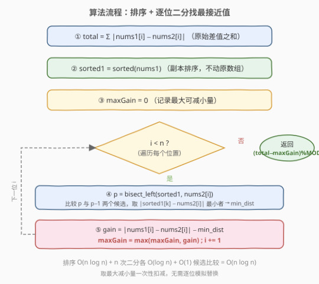
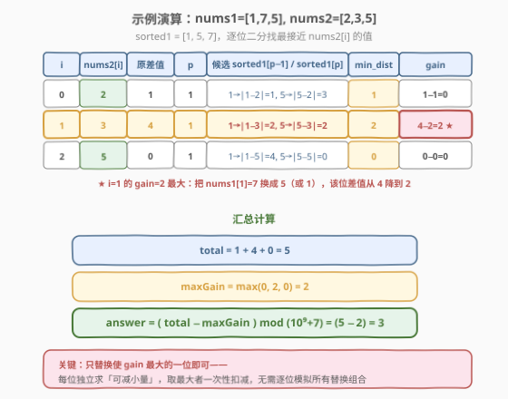

# LeetCode 最小绝对差之和 题解

## 1. 题目概述

- **标题 / 题号**：最小绝对差之和（#1818，medium）
- **链接**：https://leetcode.cn/problems/minimum-absolute-sum-difference/
- **难度**：中等
- **标签**：数组、二分查找、排序

**题意**：给定两个正整数数组 `nums1` 和 `nums2`，长度均为 `n`。定义**绝对差之和**为：

$$S = \sum_{i=0}^{n-1} \left| \text{nums1}[i] - \text{nums2}[i] \right|$$

你可以执行**至多一次**替换操作：选择某个下标 `i`，把 `nums1[i]` 替换为 `nums1` 中**任意**一个元素 `nums1[j]`（`j` 可以等于 `i`，即不替换）。求替换后**最小的**绝对差之和，结果对 $10^9+7$ 取模。

**示例 1**：

```text
输入：nums1 = [1,7,5], nums2 = [2,3,5]
输出：3
解释：
  原始差值之和 = |1−2| + |7−3| + |5−5| = 1 + 4 + 0 = 5
  把 nums1[1]=7 替换为 nums1[2]=5：新差值之和 = |1−2| + |5−3| + |5−5| = 1 + 2 + 0 = 3
```

**示例 2**：

```text
输入：nums1 = [2,10,7,5,2], nums2 = [3,4,9,1,2]
输出：8
```

**示例 3**：

```text
输入：nums1 = [1,10,4,4,2,7], nums2 = [9,3,5,1,7,4]
输出：20
```

**约束**：

- $1 \le n \le 10^5$
- $1 \le \text{nums1}[i],\ \text{nums2}[i] \le 10^5$

> 💡 **关键观察**：只替换**一位**，且该位的新值只能从 `nums1` 现有元素中选。要让总和最小，应选「替换后该位差值减小最多」的那一位——即对每个 `i` 找 `nums1` 中**最接近 `nums2[i]`** 的值，算出可减小量，取最大者一次性扣减。

## 2. 解题思路

### 2.1 暴力思路：枚举替换位置与替换值

对每个位置 `i`，枚举所有 `nums1[j]` 作为替换值，计算替换后的差值之和，取全局最小：

```text
ans = total
for i in range(n):
    for j in range(n):
        new_diff = abs(nums1[j] - nums2[i])
        gain = abs(nums1[i] - nums2[i]) - new_diff
        ans = min(ans, total - gain)
```

时间 $O(n^2)$，$n = 10^5$ 时约 $10^{10}$ 次操作，必然超时。瓶颈在于：**对每个 `i` 线性扫描整个 `nums1` 找最佳 `j`**。

> 💡 **转化**：内层「在 `nums1` 中找使 $|\text{nums1}[j] - \text{nums2}[i]|$ 最小的 `j`」本质是**在数组中找最接近目标值的元素**——这正是排序 + 二分的招牌场景。

### 2.2 核心观察：排序 + 二分找最接近值

![核心概念：替换一个元素，找最接近 nums2[i] 的值](../images/1818_concept.svg)

把 `nums1` **排序**得到 `sorted1`（用副本，不动原数组）。对每个 `i`，在有序的 `sorted1` 中二分定位 `nums2[i]` 的**插入位置** $p = \text{bisect\_left}(\text{sorted1},\ \text{nums2}[i])$（首个 $\ge \text{nums2}[i]$ 的下标）。最接近 `nums2[i]` 的值**必在 `sorted1[p]` 与 `sorted1[p-1]`** 之中：

- `sorted1[p]` 是 $\ge \text{nums2}[i]$ 的最小值（右侧最近）；
- `sorted1[p-1]` 是 $< \text{nums2}[i]$ 的最大值（左侧最近）；
- 目标值夹在两者之间，到这两个端点的距离必有一个是最小，无需扫描全表。

于是每位只需比较**两个候选**，$O(\log n)$ 二分 + $O(1)$ 比较得到 `min_dist`。

> 💡 **每位独立**：替换只发生在一位，但「该替换哪一位」可对每位独立计算「可减小量」$\text{gain}_i = \text{原差值}_i - \text{min\_dist}_i$，再取 $\text{maxGain} = \max_i \text{gain}_i$。因为只替换一位，所以选 `gain` 最大的那一位扣减即可——**无需枚举替换组合**。

> ⚠️ **gain 的下界**：`j` 可以等于 `i`，即 `nums1[i]` 本身也是候选，此时 $\text{min\_dist} \le |\text{nums1}[i] - \text{nums2}[i]| = \text{原差值}$，故 $\text{gain} \ge 0$。这意味着替换最坏也不会让总和变大，`maxGain ≥ 0` 恒成立。

### 2.3 算法流程图



**步骤**：

1. **算总和**：$\text{total} = \sum |\text{nums1}[i] - \text{nums2}[i]|$。
2. **排序副本**：`sorted1 = sorted(nums1)`。
3. **逐位求 gain**：对每个 `i`，二分得 `p`，比较 `sorted1[p]` 与 `sorted1[p-1]` 取 `min_dist`，$\text{gain} = \text{原差值} - \text{min\_dist}$，更新 `maxGain`。
4. **返回** $(\text{total} - \text{maxGain}) \bmod (10^9+7)$。

### 2.4 示例演算

以 `nums1 = [1,7,5], nums2 = [2,3,5]` 为例，`sorted1 = [1,5,7]`：



| i | nums2[i] | 原差值 | p | 候选 sorted1[p−1] / sorted1[p] | min_dist | gain |
|---|----------|--------|---|-------------------------------|----------|------|
| 0 | 2 | 1 | 1 | 1→\|1−2\|=1，5→\|5−2\|=3 | 1 | 0 |
| 1 | 3 | 4 | 1 | 1→\|1−3\|=2，5→\|5−3\|=2 | 2 | **2** |
| 2 | 5 | 0 | 1 | 1→\|1−5\|=4，5→\|5−5\|=0 | 0 | 0 |

- `total = 1 + 4 + 0 = 5`
- `maxGain = max(0, 2, 0) = 2`（i=1 把 `nums1[1]=7` 换成 5，该位差值 4→2）
- `answer = (5 − 2) mod (10^9+7) = 3`

> 💡 **i=1 的妙处**：`nums2[1]=3` 恰好在 `sorted1` 的 1 和 5 正中间，两端距离都是 2。无论换成 1 还是 5，该位差值都从 4 降到 2，减小 2。这正说明「最接近值」不必唯一，取最小距离即可。

## 3. 参考代码

### Python

```python
class Solution:
    def minAbsoluteSumDiff(self, nums1: List[int], nums2: List[int]) -> int:
        import bisect
        MOD = 10**9 + 7
        sorted1 = sorted(nums1)
        n = len(nums1)

        total = 0
        max_gain = 0
        for i in range(n):
            diff = abs(nums1[i] - nums2[i])
            total += diff
            p = bisect.bisect_left(sorted1, nums2[i])
            # 候选：插入点 p 与 p-1（注意边界）；best 初始化为 diff 保证 gain>=0
            best = diff
            if p < n:
                best = min(best, abs(sorted1[p] - nums2[i]))
            if p > 0:
                best = min(best, abs(sorted1[p - 1] - nums2[i]))
            gain = diff - best
            if gain > max_gain:
                max_gain = gain

        return (total - max_gain) % MOD
```

### C++

```cpp
class Solution {
  public:
    int minAbsoluteSumDiff(vector<int>& nums1, vector<int>& nums2) {
        const int MOD = 1e9 + 7;
        int n = nums1.size();
        vector<int> sorted1(nums1);
        sort(sorted1.begin(), sorted1.end());

        long long total = 0;
        int maxGain = 0;
        for (int i = 0; i < n; ++i) {
            int diff = abs(nums1[i] - nums2[i]);
            total += diff;

            auto it = lower_bound(sorted1.begin(), sorted1.end(), nums2[i]);
            int best = diff;  // j=i 时 min_dist <= diff，保证 gain>=0
            if (it != sorted1.end())
                best = min(best, abs(*it - nums2[i]));
            if (it != sorted1.begin())
                best = min(best, abs(*(it - 1) - nums2[i]));

            int gain = diff - best;
            maxGain = max(maxGain, gain);
        }
        return (int)((total - maxGain) % MOD);
    }
};
```

> 💡 **实现细节**：① 用 `nums1` 的**副本**排序，原数组用于算原差值 $|\text{nums1}[i]-\text{nums2}[i]|$，不能在原地上排序。② Python `bisect_left` / C++ `lower_bound` 返回首个 $\ge \text{nums2}[i]$ 的位置 `p`，需检查 `p` 与 `p−1` 两个边界。③ `best` 初始化为 `diff`（即 `j=i` 时的距离），既处理边界又保证 $\text{gain} \ge 0$，省去对空候选集的特判。④ `total` 用 64 位（C++ `long long`），最大 $n \cdot 10^5 = 10^{10}$ 超 32 位范围；Python 整数无上限。

> ⚠️ **取模时机**：$\text{total} - \text{maxGain}$ 恒非负（$\text{maxGain} \le \text{total}$），故可直接 `% MOD`。若担心中间溢出，C++ 可写 `((total % MOD) - (maxGain % MOD) + MOD) % MOD`，两者等价。

## 4. 复杂度分析

| 维度 | 复杂度 | 说明 |
|------|--------|------|
| 时间复杂度 | $O(n \log n)$ | 排序 $O(n \log n)$ + $n$ 次二分各 $O(\log n)$ + 每次 $O(1)$ 候选比较，合计 $O(n \log n)$ |
| 空间复杂度 | $O(n)$ | `sorted1` 副本占 $O(n)$（排序的 $O(\log n)$ 栈空间被吸收） |

> ⚠️ 暴力 $O(n^2) \approx 10^{10}$ 必超时；优化到 $O(n \log n) \approx 10^5 \times 17 \approx 1.7 \times 10^6$，快约 $4$ 个数量级。核心是把「找最接近值」从线性扫描升级为有序二分。

## 5. 扩展：为什么「最接近值」只需查插入点左右两个候选？

这是**有序数组上找最接近目标值**的通用结论。设 `sorted1` 升序，目标 $t = \text{nums2}[i]$，$p = \text{lower\_bound}(\text{sorted1},\ t)$（首个 $\ge t$ 的下标）：

- **$p = n$**（$t$ 大于所有元素）：最近值必是 `sorted1[n−1]`（最大值）。
- **$p = 0$**（$t$ 小于等于所有元素）：最近值必是 `sorted1[0]`（最小值）。
- **$0 < p < n$**：$\text{sorted1}[p-1] < t \le \text{sorted1}[p]$，$t$ 被夹在相邻两元素之间。对任意 $k < p-1$，$\text{sorted1}[k] \le \text{sorted1}[p-1] < t$，距离 $t - \text{sorted1}[k] \ge t - \text{sorted1}[p-1]$，不会更近；同理 $k > p$ 的右侧元素也不会更近。故只需比较这两个「夹板」。

> 💡 **推广**：此结论对「在有序序列中找最接近目标值的元素」普遍适用——排序 + `lower_bound` + 比较左右两个候选，$O(\log n)$ 定位。是二分查找家族的高频子套路。

## 6. 面试要点

1. **为什么每位独立求 gain，再取最大值就够？**

   > 替换只发生一次，且只影响被替换那一位的差值（其它位不变）。对位置 `i`，最佳替换让该位差值从 $\text{原差值}_i$ 降到 $\text{min\_dist}_i$，可减小 $\text{gain}_i = \text{原差值}_i - \text{min\_dist}_i$。由于只能替换一位，选 `gain` 最大的那一位扣减即可使总和最小。**位的独立性**是无需枚举替换组合的关键。

2. **为什么 `gain` 一定非负？**

   > 替换值可选 `nums1` 中任意元素，包括 `nums1[i]` 自身（`j = i`，即不替换）。此时该位差值不变，$\text{min\_dist} \le |\text{nums1}[i] - \text{nums2}[i]| = \text{原差值}$，故 $\text{gain} = \text{原差值} - \text{min\_dist} \ge 0$。因此 $\text{maxGain} \ge 0$，最坏情况是不替换、总和不变。

3. **二分找最接近值为什么只查 `p` 与 `p−1` 两个候选？**

   > `lower_bound` 返回首个 $\ge t$ 的位置 `p`，故 $\text{sorted1}[p-1] < t \le \text{sorted1}[p]$，$t$ 被相邻两元素夹住。离 $t$ 更远的元素距离只会更大（左侧更小、右侧更大），故最近值必在这两个「夹板」之中。边界 $p=0$ 只查 `sorted1[0]`，$p=n$ 只查 `sorted1[n−1]`。

4. **为什么必须用 `nums1` 的副本排序，不能在原数组上排序？**

   > 原差值 $|\text{nums1}[i] - \text{nums2}[i]|$ 依赖 `nums1` 的**原始顺序与原始值**。若原地排序，`nums1[i]` 与 `nums2[i]` 的对应关系被打乱，原差值就算错了。排序只为建立「找最接近值」的有序索引，不能破坏原始配对。

5. **取模有哪些坑？**

   > `total` 最大 $n \cdot \max|差| \le 10^5 \times 10^5 = 10^{10}$，超 32 位 int 范围，C++ 必须用 `long long` 累加。$\text{total} - \text{maxGain}$ 恒非负，可直接 `% MOD`。若分别取模再相减，需 `(a − b + MOD) % MOD` 防负数。Python 整数无溢出，直接 `(total − max_gain) % MOD` 即可。

> 💡 **一句话总结**：本题是「排序 + 二分找最接近值」的经典应用——把每位「找最佳替换值」从 $O(n)$ 降到 $O(\log n)$，再利用「替换一位」的独立性取最大减小量一次性扣减。核心识题信号是「在数组中找最接近目标值的元素」。

## 同类练习题

| # | 题目 | 与本题的关联 |
|---|------|-------------|
| 35 | [搜索插入位置](https://leetcode.cn/problems/search-insert-position/)（[题解](../0001-0100/35_搜索插入位置.md)） | `bisect_left` 的母题，本题二分定位插入点的直接来源 |
| 704 | [二分查找](https://leetcode.cn/problems/binary-search/)（[题解](../0701-0800/704_二分查找.md)） | 闭区间二分模板，一切二分的基础 |
| 719 | [找出第 K 小的数对距离](https://leetcode.cn/problems/find-k-th-smallest-pair-distance/)（[题解](../0701-0800/719_找出第K小的数对距离.md)） | 排序 + 二分值域，同属「排序后用二分加速查询」范式 |
| 378 | [有序矩阵中第 K 小的元素](https://leetcode.cn/problems/kth-smallest-element-in-a-sorted-matrix/)（[题解](../0301-0400/378_有序矩阵中第K小的元素.md)） | 在有序结构上二分，对照不同有序载体的二分用法 |
| 34 | [在排序数组中查找元素的第一个和最后一个位置](https://leetcode.cn/problems/find-first-and-last-position-of-element-in-sorted-array/) | `lower_bound` / `upper_bound` 进阶，巩固二分边界处理 |
