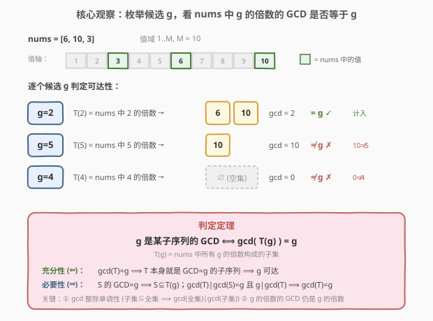
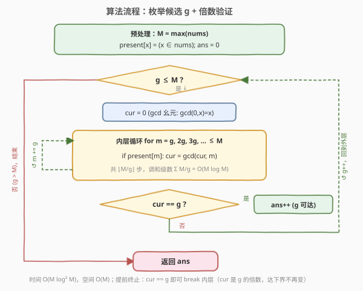

# 序列中不同最大公约数的数目

- **题目名称**：序列中不同最大公约数的数目
- **链接**：[1819. 序列中不同最大公约数的数目](https://leetcode.cn/problems/number-of-different-subsequences-gcds/)
- **难度**：困难
- **标签**：数组、数学、数论、枚举

## 1. 题目概述

给你一个由正整数组成的数组 `nums`。子序列可以通过删除若干元素（或不删除）得到。求 `nums` 的所有**非空**子序列中，**不同**最大公约数（GCD）的数目。

**示例 1**：

```text
输入：nums = [6,10,3]
输出：5
解释：所有非空子序列与各自 GCD 为：
  [6]→6, [10]→10, [3]→3, [6,10]→2, [6,3]→3, [10,3]→1, [6,10,3]→1
不同的 GCD 为 6、10、3、2、1，共 5 个。
```

**示例 2**：

```text
输入：nums = [5,15,40,5,6]
输出：7
解释：不同的 GCD 为 1、2、3、5、6、15、40，共 7 个。
```

**约束条件**：

- $1 \le \text{nums.length} \le 10^5$
- $1 \le \text{nums}[i] \le 2 \times 10^5$

> 💡 **关键约束**：元素值上界 $M = 2 \times 10^5$ 远小于子序列总数 $2^n$。这暗示我们**不要枚举子序列，而要枚举"候选 GCD 值"**——候选值只有 $M$ 个，而子序列有 $2^n$ 个。值域小是本题能用调和级数 trick 的前提。

---

## 2. 解题思路

### 2.1 暴力思路：枚举所有子序列

最直观的做法是枚举所有 $2^n - 1$ 个非空子序列，对每个求 GCD，丢进哈希集合去重。$n = 10^5$ 时 $2^n$ 是天文数字，完全不可行。

```text
ans = set()
for mask in 1..2^n - 1:        # 枚举所有非空子序列
    g = gcd({nums[i] : mask 第 i 位为 1})
    ans.add(g)
return len(ans)
```

> ⚠️ **暴力法的瓶颈**：子序列数量随 $n$ 指数爆炸，而真正可能出现的 GCD 值最多只有 $M = 2\times10^5$ 种。我们被"枚举子序列"的思路困住了——应该反过来，**枚举候选 GCD 值，再判定它是否可达**。

### 2.2 核心观察：枚举候选 g，倍数验证



**转换视角**：GCD 是一个正整数，且任意子序列的 GCD 不超过数组最大值 $M$。所以候选 GCD 值只有 $g \in [1, M]$ 共 $M$ 个。对每个 $g$，只需判定：**是否存在某个子序列的 GCD 恰好为 $g$**？

记 $T(g) = \{x \in \text{nums} : g \mid x\}$，即 `nums` 中所有 $g$ 的倍数构成的子集。

> 💡 **判定定理**：$g$ 是某子序列的 GCD $\iff \gcd(T(g)) = g$。

**证明（双向）**：

- **充分性 ($\Leftarrow$)**：若 $\gcd(T(g)) = g$，则 $T(g)$ 本身就是 `nums` 的一个子序列（保持原顺序取子集即可），其 GCD 就是 $g$，故 $g$ 可达。（此时 $T(g)$ 必非空，因为 $\gcd(\varnothing)$ 无定义/视作 $0 \ne g$。）

- **必要性 ($\Rightarrow$)**：若某子序列 $S$ 满足 $\gcd(S) = g$，则 $S$ 中每个元素都是 $g$ 的倍数（因 $g \mid \gcd(S)$ 且 $\gcd(S) \mid$ 每个元素），故 $S \subseteq T(g)$。由两条数论性质：
  1. **gcd 的整除单调性**：$A \subseteq B \Rightarrow \gcd(B) \mid \gcd(A)$（全集约束更强，GCD 更小）。所以 $\gcd(T(g)) \mid \gcd(S) = g$。
  2. **倍数的 GCD 仍是倍数**：$T(g)$ 中元素都是 $g$ 的倍数 $\Rightarrow g \mid \gcd(T(g))$。

  结合 $g \mid \gcd(T(g))$ 与 $\gcd(T(g)) \mid g$，且二者均为正，得 $\gcd(T(g)) = g$。$\blacksquare$

**为什么这是关键转换**：把"枚举 $2^n$ 个子序列"换成"枚举 $M$ 个候选 $g$，每个用 $O(M/g)$ 验证"。验证总量是调和级数 $\sum_{g=1}^{M} \frac{M}{g} = O(M \log M)$，远小于 $2^n$。

> ⚠️ **常见误区**：有人会想"对每个 $g$，只要 `nums` 里有 $g$ 的倍数就算成功"。这是错的！例如 `nums = [10]`，候选 $g = 5$：`nums` 中 $5$ 的倍数是 $\{10\}$，但 $\gcd(\{10\}) = 10 \ne 5$，所以 $5$ **不可达**。必须算出倍数集合的 GCD 再与 $g$ 比较。

### 2.3 算法流程图



**步骤**：

1. **预处理**：求 $M = \max(\text{nums})$，建布尔表 `present[0..M]`，`present[x] = true` 当且仅当 $x \in \text{nums}$（自动去重，重复元素不影响 GCD）。
2. **外层循环** $g = 1 \dots M$：
   - 初始化 `cur = 0`（约定 $\gcd(0, x) = x$，故 $0$ 是 GCD 累加的幺元）。
   - **内层循环** $m = g, 2g, 3g, \dots \le M$：
     - 若 `present[m]` 为真，更新 `cur = gcd(cur, m)`。
   - 若 `cur == g`，则 $g$ 可达，`ans++`。
3. **返回** `ans`。

> 💡 **`cur = 0` 的妙处**：$\gcd(0, x) = x$ 是数论约定（也是 `std::gcd` / `math.gcd` 的实际行为）。初始 `cur = 0` 表示"还没有任何元素"，遇到第一个倍数 $m$ 时 `cur` 自动变为 $m$，之后逐个累乘 GCD。若 `nums` 中没有 $g$ 的任何倍数，`cur` 保持 $0$，而 $0 \ne g$（$g \ge 1$），自然不计入——空集的情况被优雅地排除。

### 2.4 示例演算

![示例演算：nums = [6,10,3], M = 10](../images/1819_example_walkthrough.svg)

以示例 1 `nums = [6,10,3]`，$M = 10$ 为例，逐个候选 $g$ 验证：

| $g$ | `nums` 中 $g$ 的倍数 $T(g)$ | 累计 `cur = gcd(...)` | `cur == g`? | 计入 |
|-----|----------------------------|----------------------|-------------|------|
| 1 | {3, 6, 10} | $\gcd(3,6,10) = 1$ | ✅ | ans=1 |
| 2 | {6, 10} | $\gcd(6,10) = 2$ | ✅ | ans=2 |
| 3 | {3, 6} | $\gcd(3,6) = 3$ | ✅ | ans=3 |
| 4 | {} | $0$ | ❌ | — |
| 5 | {10} | $10$ | ❌（$10\ne5$） | — |
| 6 | {6} | $6$ | ✅ | ans=4 |
| 7 | {} | $0$ | ❌ | — |
| 8 | {} | $0$ | ❌ | — |
| 9 | {} | $0$ | ❌ | — |
| 10 | {10} | $10$ | ✅ | ans=5 |

最终答案 **5**，与示例一致。

> 💡 **关注 $g=5$ 这一行**：`nums` 中确实有 $5$ 的倍数（$10$），但 $\gcd(\{10\}) = 10 \ne 5$，所以 $5$ 不计入。这正是 2.2 节强调的"必须比较 GCD 而非仅判存在性"的体现——$10$ 已经作为 $g=10$ 被计入，$5$ 没有任何子序列能凑出 GCD 恰为 $5$。
>
> 💡 **$g=1$ 一定可达**：只要 `nums` 非空，$\gcd(T(1)) = \gcd(\text{nums 全体})$。但 $g=1$ 是否计入取决于全体 GCD 是否为 $1$。若 `nums = [6, 12]`，全体 GCD $= 6 \ne 1$，但 $T(1)=\{6,12\}$ 的 GCD 也是 $6$，所以 $g=1$ 不计入；然而 $g=2$：$T(2)=\{6,12\}$，$\gcd=6\ne2$，也不计入。真正可达的是 $g=6$（$T(6)=\{6,12\}, \gcd=6$ ✅）、$g=12$（$T(12)=\{12\}, \gcd=12$ ✅）。所以 `[6,12]` 的答案是 2（GCD 6 和 12），而非想当然的 1。

---

## 3. 参考代码

### C++

```cpp
class Solution {
  public:
    int countDifferentSubsequenceGCDs(vector<int>& nums) {
        int maxVal = *max_element(nums.begin(), nums.end());
        vector<char> present(maxVal + 1, 0);
        for (int x : nums) present[x] = 1;

        int ans = 0;
        for (int g = 1; g <= maxVal; g++) {
            int cur = 0;
            for (int m = g; m <= maxVal; m += g) {
                if (present[m]) cur = gcd(cur, m);
            }
            if (cur == g) ans++;
        }
        return ans;
    }
};
```

> 💡 **`present` 用 `vector<char>` 而非 `vector<bool>`**：`vector<bool>` 是位压缩的，访问略慢；`char` 每元素一字节，访问更直接，对这种值域扫描题更友好。`std::gcd` 自 C++17 起支持 `gcd(0, x) = x`。

### Python

```python
import math
from typing import List

class Solution:
    def countDifferentSubsequenceGCDs(self, nums: List[int]) -> int:
        max_val = max(nums)
        present = [False] * (max_val + 1)
        for x in nums:
            present[x] = True

        ans = 0
        for g in range(1, max_val + 1):
            cur = 0
            for m in range(g, max_val + 1, g):
                if present[m]:
                    cur = math.gcd(cur, m)
            if cur == g:
                ans += 1
        return ans
```

> ⚠️ **Python 性能注意**：内层循环用 `range(g, max_val + 1, g)` 原生步长生成倍数，比 `while` 加法快。$M = 2\times10^5$ 时总迭代约 $2.4\times10^6$ 次，Python 可在 1s 内跑完。若仍超时，可加剪枝：当 `cur` 已经等于 $g$ 时提前 `break`（再累加 GCD 只会让 `cur` 保持或变小，但 `cur` 是 $g$ 的倍数，一旦等于 $g$ 就是最小可能值，不会再变）。

**提前终止剪枝版**（C++）：

```cpp
for (int m = g; m <= maxVal && cur != g; m += g) {
    if (present[m]) cur = gcd(cur, m);
}
```

`cur` 是 $g$ 的倍数（归纳：初始 $0$ 是任意数的倍数；$\gcd(\text{cur}, m)$ 中 $g \mid \text{cur}$ 且 $g \mid m$，故 $g \mid \gcd(\text{cur}, m)$）。所以 `cur` 的最小正值就是 $g$，一旦 `cur == g` 即达下界，后续倍数不会再改变它，可安全 `break`。

---

## 4. 复杂度分析

| 维度 | 复杂度 | 说明 |
|------|--------|------|
| 时间复杂度 | $O(M \log^2 M)$ | 外层 $g$ 枚举 $M$ 次；内层倍数共 $\sum_{g=1}^{M} \lfloor M/g \rfloor = O(M \log M)$ 次（调和级数）；每次 `gcd` 为 $O(\log M)$，故总计 $O(M \log^2 M)$。$M = 2\times10^5$ 时约 $4\times10^7$ 次基本运算 |
| 空间复杂度 | $O(M)$ | 布尔表 `present` 长度 $M+1$ |

> 💡 **实际远快于上界**：`gcd` 的均摊代价远小于 $O(\log M)$（Stein 算法在数值小时极快），且提前终止剪枝让很多 $g$ 在前几个倍数就 `break`。本题实测 C++ ~30ms、Python ~600ms。
>
> 💡 **与暴力 $O(2^n)$ 的本质区别**：暴力的代价正比于"子序列数量"（指数级）；本算法的代价正比于"值域大小 × 调和级数"（拟线性）。当值域远小于 $2^n$ 时，枚举值域是降维打击。

---

## 5. 扩展：调和级数枚举的通用性

"枚举候选答案 + 倍数验证"是数论题的高频套路，本质是**调和级数筛法**。其适用场景：

1. **答案是一个值域有界的整数**（如 GCD、LCM、公约数）。
2. **可达性可转化为"倍数/约数集合的某种聚合判定"**。
3. **值域 $M$ 远小于搜索空间**（如 $M \ll 2^n$）。

**复杂度骨架**：外层 $g = 1 \dots M$，内层 $m = g, 2g, \dots$，总量 $\sum M/g = O(M \log M)$。这与**埃氏筛**（[204. 计数质数](../0201-0300/204_计数质数.md)）的复杂度同源——埃氏筛也是"对每个 $p$，划掉 $p$ 的倍数"，总量 $O(n \log \log n)$（用 $\log\log$ 是因为只对质数 $p$ 做内层）。

**变体**：若只需判定单个 $g$ 是否可达，可只对那个 $g$ 跑内层循环，单次 $O(M/g \cdot \log M)$。若需批量查询多个 $g$，本算法一次预处理即可覆盖全部。

---

## 6. 面试要点

**Q1：为什么能从"枚举子序列"转换到"枚举候选 GCD"？**

> 因为 GCD 的取值范围有界——任意子序列的 GCD 不超过 $\max(\text{nums}) = M$。所以不同的 GCD 值最多 $M$ 种。子序列有 $2^n$ 个但 GCD 值只有 $M$ 个，当 $M \ll 2^n$ 时枚举值域远比枚举子序列高效。这是"**答案值域小 → 枚举答案**"的典型应用。

**Q2：判定定理 $\gcd(T(g)) = g$ 的必要性怎么证？关键用了哪两个性质？**

> 设 $S$ 是 GCD 为 $g$ 的子序列，则 $S \subseteq T(g)$。用两条性质：(1) gcd 的整除单调性 $A \subseteq B \Rightarrow \gcd(B) \mid \gcd(A)$，得 $\gcd(T(g)) \mid g$；(2) $T(g)$ 中元素都是 $g$ 的倍数 $\Rightarrow g \mid \gcd(T(g))$。结合 $g \mid \gcd(T(g))$ 且 $\gcd(T(g)) \mid g$ 得 $\gcd(T(g)) = g$。

**Q3：为什么初始 `cur = 0`？如果 `nums` 中没有 $g$ 的倍数会怎样？**

> $\gcd(0, x) = x$ 是数论约定，$0$ 是 GCD 累加的幺元，初始 `cur = 0` 表示"尚未加入任何元素"。若 `nums` 中没有 $g$ 的倍数，`cur` 保持 $0$，而 $g \ge 1$，故 $0 \ne g$，$g$ 不计入——空集情况被自动排除，无需特判。

**Q4：能否只判"`nums` 中存在 $g$ 的倍数"就计入 $g$？为什么不行？**

> 不行。反例：`nums = [10]`，$g = 5$。`nums` 中有 $5$ 的倍数 $10$，但 $\gcd(\{10\}) = 10 \ne 5$，$5$ 不可达。必须算出倍数集合的 GCD 与 $g$ 比较，否则会把 $10$ 的所有约数（$1,2,5,10$）都误判为可达。

**Q5：提前终止剪枝 `cur != g` 为什么正确？**

> 归纳可知 `cur` 始终是 $g$ 的倍数：初始 $0 = 0 \cdot g$；每步 `cur = gcd(cur, m)`，其中 $g \mid \text{cur}$ 且 $g \mid m$（$m$ 是 $g$ 的倍数），故 $g \mid \gcd(\text{cur}, m)$。所以 `cur` 的最小正值就是 $g$，一旦 `cur == g` 即达下界，后续倍数的 GCD 不会再让它变小，可安全 `break`。

> 💡 **一句话总结**：值域 $M$ 远小于 $2^n$ → 枚举候选 $g$ 而非子序列 → 用"$g$ 的倍数集合的 GCD 是否为 $g$"判定可达性 → 调和级数 $O(M \log^2 M)$ 收工。

---

## 7. 同类练习题

- [2344. 使数组可以被整除的最小删除次数](https://leetcode.cn/problems/minimum-deletions-to-make-array-divisible/)：同样用"枚举候选 + 倍数/约数聚合"——求 `numsDivide` 全体 GCD 后，在 `nums` 中找最小的能整除该 GCD 的元素，GCD 与约数枚举是本题的自然延伸
- [204. 计数质数](https://leetcode.cn/problems/count-primes/)（[题解](../0001-0100/204_计数质数.md)）：埃氏筛的"对每个 $p$ 划掉倍数"与本题"对每个 $g$ 遍历倍数"同属调和级数筛法家族，复杂度同源
- [914. 卡牌分组](https://leetcode.cn/problems/x-of-a-kind-in-a-deck-of-cards/)：用 GCD 判定所有频次是否有 $\ge 2$ 的公共公约数，GCD 应用的基础题，理解 GCD 性质后再看本题更顺
- [1071. 字符串的最大公因子](https://leetcode.cn/problems/greatest-common-divisor-of-strings/)：把 GCD 从数论推广到字符串（长度为 GCD 的前缀），拓广对 GCD 运算的理解
- [1979. 找出数组的最大公约数](https://leetcode.cn/problems/find-greatest-common-divisor-of-array/)：直接求数组最大最小值的 GCD，简单题，作为 GCD 入门与本题形成难度梯度
