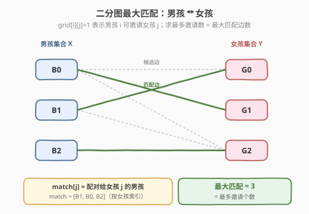
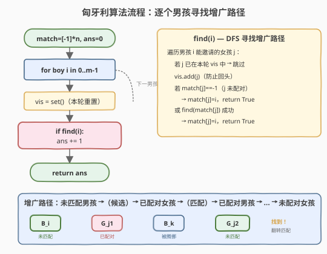
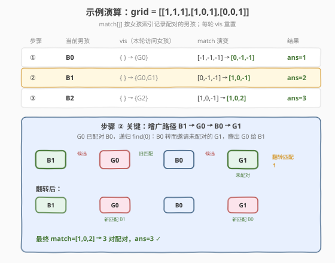

# 最多邀请的个数

- **题目名称**：最多邀请的个数
- **链接**：[1820. Maximum Number of Accepted Invitations](https://leetcode.cn/problems/maximum-number-of-accepted-invitations/) 🔒
- **难度**：中等
- **标签**：深度优先搜索、图、二分图匹配、匈牙利算法、矩阵

## 1. 题目概述

某一个班级有 $m$ 个男孩和 $n$ 个女孩，即将举行一个派对。

给定一个 $m \times n$ 的整数矩阵 `grid`，其中 `grid[i][j]` 等于 `0` 或 `1`。若 `grid[i][j] == 1`，则表示第 $i$ 个男孩可以邀请第 $j$ 个女孩参加派对。**一个男孩最多可以邀请一个女孩**，**一个女孩最多可以接受一个男孩的一个邀请**。

返回可能的**最多邀请的个数**。

**示例 1**：

```text
输入：grid = [[1,1,1],
             [1,0,1],
             [0,0,1]]
输出：3
解释：按下列方式邀请：
- 第 1 个男孩邀请第 2 个女孩。
- 第 2 个男孩邀请第 1 个女孩。
- 第 3 个男孩邀请第 3 个女孩。
```

**示例 2**：

```text
输入：grid = [[1,0,1,0],
             [1,0,0,0],
             [0,0,1,0],
             [1,1,1,0]]
输出：3
解释：按下列方式邀请：
- 第 1 个男孩邀请第 3 个女孩。
- 第 2 个男孩邀请第 1 个女孩。
- 第 3 个男孩未邀请任何人。
- 第 4 个男孩邀请第 2 个女孩。
```

**约束条件**：

- $\text{grid.length} == m$
- $\text{grid[i].length} == n$
- $1 \le m, n \le 200$
- $\text{grid[i][j]}$ 是 `0` 或 `1` 之一。

> 💡 **关键直觉**：男孩与女孩天然构成二分图的两个顶点集——`grid[i][j]==1` 是一条连边，"每人最多配一个"就是匹配约束。**最多邀请数 = 二分图最大匹配的边数**，这是匈牙利算法的招牌应用。

---

## 2. 解题思路

### 2.1 暴力思路：枚举所有配对方案

对每个男孩枚举他邀请的女孩（或不变），共有 $(n+1)^m$ 种方案，逐一检查是否存在女孩被重复邀请，取合法方案中邀请数最大值。$m=n=200$ 时方案数是天文数字，完全不可行。

**优化方向**：不要"枚举方案再验证"，而是"逐个男孩贪心地尝试配对，必要时腾挪已配对的男孩"。这正是匈牙利算法的核心——**通过寻找增广路径（augmenting path）来不断扩大当前匹配**。

### 2.2 核心观察：二分图最大匹配 + 增广路径



把男孩看作左部点 $X$、女孩看作右部点 $Y$，`grid[i][j]==1` 即边 $(B_i, G_j)$。问题等价于在这个二分图中找一个**匹配**（一组没有公共端点的边）使边数最多。

**匈牙利算法的两大支柱**：

1. **增广路径定理**：设当前匹配为 $M$。若存在一条交替路径 $P$，其起点是**未匹配**的男孩、终点是**未匹配**的女孩、边在"非匹配边 / 匹配边"间交替，则把 $P$ 上的匹配边与非匹配边**翻转**，匹配数严格 $+1$。这样的 $P$ 称为**增广路径**。
2. **最大匹配判定**：当且仅当**找不到任何增广路径**时，当前匹配即为最大匹配。

于是算法骨架极简：**从空匹配出发，对每个男孩依次尝试找一条增广路径，找到则匹配数 $+1$**。

> 💡 **为什么逐个男孩 DFS 就够？** 增广路径的起点必须是未匹配男孩。我们按男孩顺序处理，处理到 $B_i$ 时，$B_0 \dots B_{i-1}$ 已配对，$B_i$ 尚未配对，正好作为本轮增广的起点。若 $B_i$ 能腾挪出一条到某个未配对女孩的交替路径，就成功；否则 $B_i$ 暂时落单（后续男孩的腾挪不会再涉及它，因为它的配对状态本轮已确定）。

**关键实现细节**：

- `match[j]`：记录女孩 $j$ 当前配对的男孩编号（`-1` 表未配对）。注意是**按女孩索引**存，因为 DFS 中"女孩是否已被本轮访问"是去重的关键。
- `vis`：**每一轮男孩的 DFS 共享一个 `vis` 集合**，记录本轮已尝试过的女孩。作用是避免同一条增广路径里对同一个女孩反复递归（环 / 死循环）。每处理新男孩前**必须重置** `vis`。
- 递归 `find(match[j])`：当女孩 $j$ 已配给男孩 $k$ 时，尝试让 $k$ **改配别的女孩**，从而把 $j$ 腾给当前男孩 $i$。这是"腾挪"的递归本质。

> ⚠️ **常见错误**：① `vis` 不按轮重置 → 后续男孩误判"已访问"而漏掉增广路径；② `vis` 标记时机错误——必须在**递归进入前**（即检查 `j not in vis` 后立即 `vis.add(j)`）标记，否则同一女孩会在递归回溯后被重复尝试；③ 把 `match` 按男孩索引存——这样无法在 $O(1)$ 内由女孩反查男孩，腾挪逻辑写不顺。

### 2.3 算法流程图



外层循环遍历每个男孩，内层 `find(i)` 是一次 DFS：从男孩 $i$ 出发，沿候选边跳到女孩 $j$，若 $j$ 未配对则直接成功；否则沿匹配边跳到 `match[j]` 继续递归。整条路径上"候选边—匹配边—候选边—…"交替，终点必须是未配对女孩。

### 2.4 示例演算



以示例 1 `grid = [[1,1,1],[1,0,1],[0,0,1]]` 为例，`match` 初始 `[-1,-1,-1]`：

| 步骤 | 当前男孩 | 本轮 vis | match 演变 | 结果 |
|------|----------|----------|------------|------|
| ① | $B_0$ | `{ } → {G0}` | `[-1,-1,-1] → [0,-1,-1]` | $G_0$ 未配对，直接匹配，ans=1 |
| ② | $B_1$ | `{ } → {G0,G1}` | `[0,-1,-1] → [1,0,-1]` | $G_0$ 已配 $B_0$，递归 `find(0)`：$B_0$ 改配未配对的 $G_1$，腾出 $G_0$ 给 $B_1$，ans=2 |
| ③ | $B_2$ | `{ } → {G2}` | `[1,0,-1] → [1,0,2]` | $G_2$ 未配对，直接匹配，ans=3 |

> 💡 **步骤 ② 的精髓**：增广路径 $B_1 \xrightarrow{\text{候选}} G_0 \xrightarrow{\text{匹配}} B_0 \xrightarrow{\text{候选}} G_1$。翻转后，旧匹配 $B_0$-$G_0$ 断开，新匹配 $B_1$-$G_0$ 与 $B_0$-$G_1$ 建立——匹配数从 1 涨到 2。这就是"腾挪"：**让已配对的男孩让出女孩，自己改配别人，腾出的名额给新来的男孩**。

---

## 3. 参考代码

### Python

```python
class Solution:
    def maximumInvitations(self, grid: list[list[int]]) -> int:
        m, n = len(grid), len(grid[0])
        match = [-1] * n            # match[j] = 配对给女孩 j 的男孩，-1 表未配对

        def find(i: int) -> bool:
            for j in range(n):
                if grid[i][j] and j not in vis:
                    vis.add(j)      # 进入前立刻标记，防止本轮重复访问
                    if match[j] == -1 or find(match[j]):
                        match[j] = i
                        return True
            return False

        ans = 0
        for i in range(m):
            vis = set()             # 每个男孩重置 vis（本轮增广的访问集）
            if find(i):
                ans += 1
        return ans
```

### C++

```cpp
class Solution {
public:
    int maximumInvitations(vector<vector<int>>& grid) {
        int m = grid.size(), n = grid[0].size();
        vector<int> match(n, -1);          // match[j] = 配对给女孩 j 的男孩
        vector<bool> vis;

        // 递归 lambda：男孩 i 能否找到增广路径
        function<bool(int)> find = [&](int i) -> bool {
            for (int j = 0; j < n; ++j) {
                if (grid[i][j] && !vis[j]) {
                    vis[j] = true;         // 进入前立刻标记
                    if (match[j] == -1 || find(match[j])) {
                        match[j] = i;      // 把女孩 j 配给男孩 i（含腾挪后的改配）
                        return true;
                    }
                }
            }
            return false;
        };

        int ans = 0;
        for (int i = 0; i < m; ++i) {
            vis.assign(n, false);          // 每个男孩重置 vis
            if (find(i)) ans++;
        }
        return ans;
    }
};
```

> 💡 **实现细节**：① `vis` 用 `set`（Python）或 `vector<bool>`（C++），每轮重置——这是正确性关键，不能省。② C++ 用 `function<bool(int)>` 包装递归 lambda 捕获引用；若追求性能可改成成员函数 + 成员变量。③ `match` 按女孩索引存，使得由女孩反查男孩为 $O(1)$，腾挪递归 `find(match[j])` 才能顺畅写出。④ 本题 $m, n \le 200$，递归深度最多 $m$，无栈溢出风险。

---

## 4. 复杂度分析

| 维度 | 复杂度 | 说明 |
|------|--------|------|
| **时间** | $O(m \cdot n)$ | 外层 $m$ 个男孩；每个男孩的 DFS 中，`vis` 保证每个女孩至多被访问一次，单轮 DFS 遍历的边数 $\le n$（女孩数），故单轮 $O(n)$，总计 $O(mn)$。更紧的界是 $O(V \cdot E)$，但二分图 $V=m+n$、$E \le mn$，本题规模下两者同阶 |
| **空间** | $O(n)$ | `match` 数组 $O(n)$，`vis` 集合 $O(n)$，递归栈最深 $O(m)$（一条增广路径最多经过 $m$ 个男孩） |

> ⚠️ **`vis` 的摊还作用**：单轮 DFS 中每个女孩一旦被标记就不再访问，故单轮 DFS 的总迭代次数被 $n$ 钳制（而非指数爆炸）。这是匈牙利算法 $O(mn)$ 而非 $O(m^n)$ 的根本原因——`vis` 把"看似会指数展开的递归"压成了"每女孩至多访问一次的线性扫描"。

---

## 5. 扩展：匈牙利算法的本质与变体

### 5.1 为什么"逐个男孩找增广路径"能得到最大匹配？

这是 **Berge 定理**的直接推论：一个匹配是最大匹配 ⟺ 图中不存在增广路径。匈牙利算法利用了二分图的一个特殊性——**左部每个未匹配点都可作为增广路径的起点**。我们按左部点顺序逐个尝试增广：

- 若当前男孩找到增广路径，匹配数 $+1$，该男孩转为已匹配；
- 若找不到，则**在当前匹配下**该男孩永远无法被匹配（后续的增广只会在已匹配男孩间腾挪，不会凭空多出新的未匹配女孩给他——因为右部未配对女孩数量在减少）。

因此一遍扫描后，所有"能匹配的男孩"都已匹配，剩余未匹配男孩确实无路可走，匹配达到最大。

### 5.2 求最大权匹配：KM 算法

若每条边有权重，求**权值和最大**的匹配（如 [1879. 两个数组最小的异或和值](https://leetcode.cn/problems/minimum-xor-sum-of-two-arrays/)），需要 **Kuhn-Munkres（KM）算法**——匈牙利算法的加权扩展，用"顶标 + 相等子图 + 交错树"在 $O(n^3)$ 内求解。本题是无权最大匹配，匈牙利算法已足够。

---

## 6. 面试要点

1. **为什么这题是二分图最大匹配？**

   > 男孩和女孩是天然两个互不相交的顶点集（同一集合内部没有配对关系），`grid[i][j]==1` 是跨集合的边，"每人最多配一个"即"匹配边无公共端点"。求最多邀请数 = 求最大匹配边数。

2. **`vis` 为什么每轮都要重置？不重置会怎样？**

   > `vis` 记录"本轮增广路径中已尝试过的女孩"，防止同一条路径里对同一女孩反复递归成环。**换一个男孩就是新一轮增广**，旧的访问标记必须清空，否则新男孩会误以为某些女孩"已访问"而错过增广路径。不重置会导致匹配数偏小（漏解）。

3. **`vis.add(j)` 为什么要在递归前而不是递归后？**

   > 若在递归后标记，则递归 `find(match[j])` 内部还会再次遇到女孩 $j$（因为 `match[j]` 对应的男孩仍能连到 $j$），形成无限递归。进入前标记相当于"这条候选边我本轮用过了，别再回头"，是终止递归的关键。

4. **`match` 为什么按女孩索引存而不是男孩索引？**

   > 腾挪逻辑的核心是"女孩 $j$ 被占，去找占据她的男孩 `match[j]` 改配"。按女孩索引存使得这个反查是 $O(1)$。若按男孩索引存，则要扫描整个 `match` 才能找到占 $j$ 的男孩，单次腾挪退化为 $O(m)$，总复杂度变差。

5. **复杂度为什么是 $O(mn)$ 而不是指数？**

   > `vis` 保证单轮 DFS 中每个女孩至多被访问一次，单轮 $O(n)$；外层 $m$ 个男孩，总计 $O(mn)$。看似递归会指数展开，实则 `vis` 把每条候选边的访问限制在一次，是"用空间换时间避免指数爆炸"的典型。

6. **匈牙利算法和最大流什么关系？**

   > 二分图最大匹配可转化为最大流：加源点 $s$ 连所有左部点、所有右部点连汇点 $t$，原图边容量 1，跑 Dinic 即得最大匹配。匈牙利算法本质是 Dinic 在"单位容量二分图"上的特例——每轮找一条增广路，无需 BFS 分层。Dinic 更通用，匈牙利更轻量。

> 💡 **一句话总结**：男孩女孩是二分图，`grid[i][j]` 是边，求最多邀请数 = 最大匹配；逐个男孩 DFS 找增广路径，`match` 按女孩存、`vis` 每轮重置，腾挪递归让已配男孩改配别人，$O(mn)$ 求解。

---

## 7. 同类练习题

- [785. 判断二分图](https://leetcode.cn/problems/is-graph-bipartite/)（[题解](../0701-0800/785_判断二分图.md)）：二分图判定的染色法基础，理解二分图结构后再学其上的匹配问题
- [LCP 04. 覆盖](https://leetcode.cn/problems/broken-board-dominoes/)：棋盘上放多米诺骨牌，黑白格染色后即二分图最大匹配，与本题同套路
- [1349. 参加考试的最大学生数](https://leetcode.cn/problems/maximum-students-taking-exam/)：座位不能相邻，可建模为二分图匹配（也可状压 DP），对照两种建模思路
- [1947. 最大兼容性评分和](https://leetcode.cn/problems/maximum-compatibility-score-sum/)：导师—学员分配求最大权和，$n \le 8$ 可回溯，$n$ 更大时即带权匹配（KM 算法方向）
- [1879. 两个数组最小的异或和值](https://leetcode.cn/problems/minimum-xor-sum-of-two-arrays/)：求最小权完美匹配，是本题升级到"带权匹配"的延伸，用 KM 或状压 DP 求解
