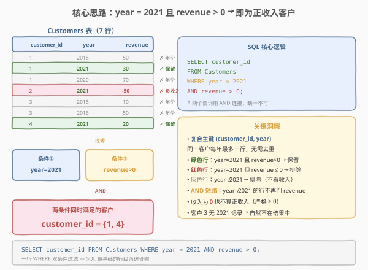
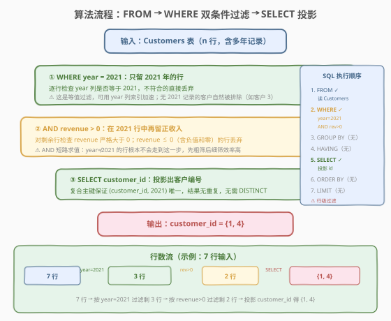
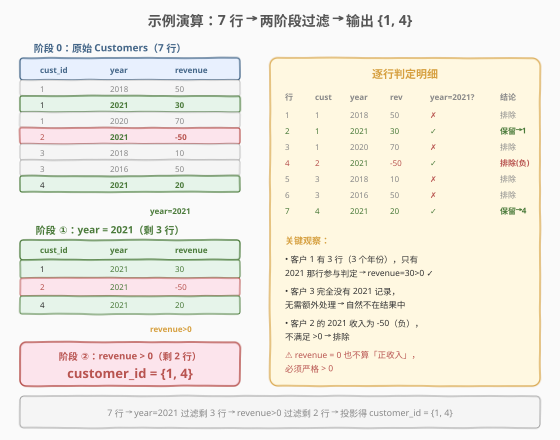

# 寻找今年具有正收入的客户

- **题目名称**：寻找今年具有正收入的客户
- **链接**：[1821. 寻找今年具有正收入的客户](https://leetcode.cn/problems/find-customers-with-positive-revenue-this-year/)
- **难度**：简单
- **标签**：SQL、WHERE 过滤、复合主键、AND 逻辑、行级筛选

## 1. 题目概述

给定 `Customers` 表，每行记录某客户在某一年的收入。编写 SQL 查询，报告在 **2021 年**收入为**正**的客户编号 `customer_id`。结果按任意顺序返回。

**表结构**：

```text
Table: Customers
+-------------+------+
| Column Name | Type |
+-------------+------+
| customer_id | int  |  ← 客户编号
| year        | int  |  ← 收入所属年份
| revenue     | int  |  ← 该年收入（可能为负）
+-------------+------+
(customer_id, year) 是主键
```

> ⚠️ **主键是复合键 `(customer_id, year)`**：同一客户在不同年份各占一行，但同一客户在**同一年**最多一行——这意味着 2021 年的筛选结果里 `customer_id` 天然无重复，**不需要 `DISTINCT`**。同时 `revenue` 可正可负，"正收入"指严格大于 0（`revenue > 0`），等于 0 不算。

**示例 1**：

```text
输入：
Customers 表:
+-------------+------+---------+
| customer_id | year | revenue |
+-------------+------+---------+
| 1           | 2018 | 50      |
| 1           | 2021 | 30      |
| 1           | 2020 | 70      |
| 2           | 2021 | -50     |
| 3           | 2018 | 10      |
| 3           | 2016 | 50      |
| 4           | 2021 | 20      |
+-------------+------+---------+

输出：
+-------------+
| customer_id |
+-------------+
| 1           |
| 4           |
+-------------+
```

**解释**：

| customer_id | 2021 年收入 | 是否为正？ | 结论 |
|-------------|-------------|-----------|------|
| 1 | 30 | ✓（30 > 0） | **保留** |
| 2 | -50 | ✗（-50 < 0） | 排除（负收入） |
| 3 | —（无 2021 记录） | ✗ | 排除（该年无数据） |
| 4 | 20 | ✓（20 > 0） | **保留** |

最终输出 `customer_id = {1, 4}`。

**约束条件**：

- `(customer_id, year)` 为复合主键，行唯一无重复。
- `revenue` 为整数，可正可负（亦可能为 0）。
- 结果可按任意顺序返回，仅需输出 `customer_id` 列。

> 💡 **关键结构**：本题是 SQL **"行级双条件过滤"入门招牌题**——核心就一句 `WHERE year = 2021 AND revenue > 0`。看似平淡，考点却在三个细节：① 把「今年」翻译成**等值条件** `year = 2021`；② 把「正收入」翻译成**范围条件** `revenue > 0`（严格大于，含 0 不算）；③ 理解**复合主键**带来的「同年同客户无重复」性质，避免画蛇添足加 `DISTINCT`。这三点覆盖了 SQL 行级筛选最基础的三要素：**等值谓词、范围谓词、AND 逻辑**。

---

## 2. 解题思路

### 2.1 暴力思路：逐行扫描判定

最直觉的过程式思维是：遍历 `Customers` 表每一行，若该行 `year == 2021` 且 `revenue > 0`，就把 `customer_id` 收集进结果集。

```text
result = []
for row in Customers:
    if row.year == 2021 and row.revenue > 0:
        result.append(row.customer_id)
return result
```

逻辑完全正确——SQL 的 `WHERE` 子句本质上就是这个逐行判定的**声明式表达**。把 `if` 条件原样翻译成 `WHERE year = 2021 AND revenue > 0` 即可。

> ⚠️ **过程式思维的陷阱**：有人会担心「同一客户有多年的行，会不会输出重复的 `customer_id`？」——不会。因为复合主键 `(customer_id, year)` 保证「同客户同年」只有一行；而 `year = 2021` 过滤后，每个客户**至多剩一行**（即 2021 那行），所以 `customer_id` 天然无重复。这是复合主键带来的隐含保证，不需要再 `DISTINCT`。

### 2.2 核心观察：WHERE 双条件过滤（等值 + 范围，AND 连接）



题目的两个要求——「**今年**」和「**正收入**」——天然对应两个**独立的行级谓词**，用 `AND` 连接即可：

| 题意要求 | SQL 谓词 | 谓词类型 | 含义 |
|----------|----------|----------|------|
| 「今年」（2021 年） | `year = 2021` | **等值谓词** | year 列等于常量 2021 |
| 「正收入」 | `revenue > 0` | **范围谓词** | revenue 严格大于 0 |

两者**同时**满足才保留该行，正是 `AND` 逻辑的语义：

$$\text{保留} \iff (\text{year} = 2021) \land (\text{revenue} > 0)$$

> 💡 **AND 的短路求值**：SQL 优化器对 `AND` 通常做短路求值——若 `year = 2021` 为假，就不再判断 `revenue > 0`。本题数据量小看不出差异，但工程中把**选择性高**（过滤掉的行多）的谓词放前面，能让短路尽早触发，减少无效判定。这里 `year = 2021` 通常比 `revenue > 0` 选择性更高（多数行年份非 2021），放前面更优——不过优化器会自动重排，写 `WHERE revenue > 0 AND year = 2021` 性能通常也一样。

> ⚠️ **「正收入」是严格 `> 0`**：题目英文原文 "positive revenue"，数学上 positive 严格大于 0。`revenue = 0` 既非正也非负，**不算正收入**，应排除。若误写成 `revenue >= 0`，会把零收入的客户也算进来，结果错位。这是本题最易踩的语义坑。

### 2.3 算法流程图



**逻辑执行步骤**：

| 步骤 | 子句 | 作用 |
|------|------|------|
| ① | `FROM Customers` | 读取全部客户收入记录（含多年） |
| ② | `WHERE year = 2021` | 等值过滤：只留 2021 年的行 |
| ③ | `AND revenue > 0` | 范围过滤：在 2021 行中再留正收入 |
| ④ | `SELECT customer_id` | 投影客户编号列 |

> 💡 **SQL 子句执行顺序**：`FROM` → `WHERE`（含 `AND` 连接的所有谓词）→ `GROUP BY`（本题无）→ `HAVING`（无）→ `SELECT`（投影）→ `ORDER BY`（无）→ `LIMIT`（无）。本题是**纯行级过滤**——没有聚合、没有分组、没有连接，`WHERE` 一次性把两个谓词作用到每一行上，过滤后直接投影输出。

### 2.4 示例演算

以示例 1 数据（7 行）为例，观察两阶段过滤的行数变化：



**步骤 ①②：`WHERE year = 2021`（等值过滤）**

对 7 行逐行检查 `year` 列是否等于 2021：

| 行 | customer_id | year | revenue | year=2021? | 去留 |
|----|-------------|------|---------|-----------|------|
| 1 | 1 | 2018 | 50 | ✗ | 丢弃 |
| 2 | 1 | 2021 | 30 | ✓ | **保留** |
| 3 | 1 | 2020 | 70 | ✗ | 丢弃 |
| 4 | 2 | 2021 | -50 | ✓ | **保留** |
| 5 | 3 | 2018 | 10 | ✗ | 丢弃 |
| 6 | 3 | 2016 | 50 | ✗ | 丢弃 |
| 7 | 4 | 2021 | 20 | ✓ | **保留** |

过滤后剩 **3 行**：`(1, 2021, 30)`、`(2, 2021, -50)`、`(4, 2021, 20)`。

> 💡 **客户 3 被整体排除**：客户 3 只在 2018、2016 有记录，2021 年没有行。`WHERE year = 2021` 后客户 3 一行不剩，自然不在结果中——无需额外处理「某客户无 2021 数据」的情况，`WHERE` 等值过滤天然处理了它。

**步骤 ③：`AND revenue > 0`（范围过滤）**

对剩余 3 行检查 `revenue` 是否严格大于 0：

| customer_id | year | revenue | revenue>0? | 去留 |
|-------------|------|---------|-----------|------|
| 1 | 2021 | 30 | ✓（30 > 0） | **保留** |
| 2 | 2021 | -50 | ✗（-50 < 0） | 丢弃 |
| 4 | 2021 | 20 | ✓（20 > 0） | **保留** |

过滤后剩 **2 行**：`(1, 2021, 30)`、`(4, 2021, 20)`。

**步骤 ④：`SELECT customer_id`（投影）**

| customer_id |
|-------------|
| 1           |
| 4           |

与示例输出一致。

> 💡 **为什么不需要 `DISTINCT`？** 经过 `year = 2021` 过滤后，每个客户至多剩一行（复合主键保证「同客户同年」唯一）。投影 `customer_id` 后不会有重复值，`DISTINCT` 是多余的。若题目主键只有 `customer_id`（一年多行），才需要考虑去重——但本题主键是 `(customer_id, year)`，去重需求被主键约束消解了。

---

## 3. 参考代码

### SQL（解法 A：WHERE 双条件，推荐）

```sql
SELECT customer_id
FROM Customers
WHERE year = 2021 AND revenue > 0;
```

> 💡 **写法要点**：
> - `WHERE year = 2021`：等值谓词，筛出 2021 年的行。
> - `AND revenue > 0`：范围谓词，严格大于 0（`revenue = 0` 不算正收入）。
> - 两个谓词用 `AND` 连接，同时满足才保留。
> - 无需 `DISTINCT`：复合主键 `(customer_id, year)` 保证同客户同年唯一。
> - ✓ **最自然**：一行 `WHERE` 把「今年」和「正收入」两个语义一气呵成。

### SQL（解法 B：子查询分离两阶段，便于讲思路）

```sql
SELECT customer_id
FROM (
    SELECT customer_id, revenue
    FROM Customers
    WHERE year = 2021
) AS c2021
WHERE revenue > 0;
```

> 💡 **写法要点**：先在子查询里 `WHERE year = 2021` 筛出 2021 年的行，外层再 `WHERE revenue > 0` 筛正收入。逻辑与解法 A 完全等价，只是把两个谓词**分到两层**写。优点是**语义分层清晰**——「先定位今年的行，再判正收入」，面试口述思路时更直观；缺点是多一层子查询，代码更长。优化器通常会把它展平为解法 A 的执行计划，性能无差异。

### Python（pandas）

```python
import pandas as pd

def find_customers(customers: pd.DataFrame) -> pd.DataFrame:
    mask = (customers['year'] == 2021) & (customers['revenue'] > 0)
    result = customers.loc[mask, ['customer_id']].drop_duplicates()
    return result
```

> 💡 **pandas 对照**：`(customers['year'] == 2021) & (customers['revenue'] > 0)` 布尔 Series 对应 SQL 的 `WHERE year = 2021 AND revenue > 0`——注意 pandas 中逻辑与必须用 `&` 而非 `and`，且**每个条件要加括号**（运算符优先级）。`.loc[mask, ['customer_id']]` 对应 `SELECT customer_id`。末尾 `.drop_duplicates()` 是 pandas 的防御性写法——虽然复合主键保证无重复，但 pandas 不感知主键约束，显式去重更稳妥（对 SQL 而言是多余的）。

---

## 4. 复杂度分析

| 维度 | 复杂度 | 说明 |
|------|--------|------|
| **时间** | $O(n)$ | 全表扫描一次，逐行判定两个谓词各 $O(1)$，合计 $O(n)$；有 `year` 索引时可走索引扫描，仅读取 2021 的行 |
| **空间** | $O(1)$ | 行级过滤不产生中间存储，输出行数等于结果客户数 |
| **结果行数** | $\le n$ | 正收入客户数不超过总行数；实际取决于数据分布 |

> ⚠️ SQL 复杂度取决于**执行计划与索引**。本题无索引时全表扫描 $O(n)$；若在 `year` 列建索引（或复合索引 `(year, revenue)`），可走索引范围扫描，只读 2021 的行，把 $O(n)$ 降为 $O(\log n + k)$（$k$ 为 2021 行数）。面试中说明「全表扫描 $O(n)$，可在 `year` 列建索引优化」即可。

---

## 5. 扩展：复合主键与去重、AND 短路与谓词顺序

### 5.1 为什么不需要 DISTINCT？

| 主键形式 | 同客户同年是否唯一 | 是否需要 DISTINCT |
|----------|-------------------|------------------|
| `(customer_id, year)` 复合主键 | ✓ 唯一（本题） | ✗ 不需要 |
| `customer_id` 单列主键 | ✗ 可能多行 | ⚠ 需要 DISTINCT |
| 无主键 / `(id)` 自增主键 | ✗ 可能多行 | ⚠ 需要 DISTINCT |

> 💡 **判断口诀**：**`WHERE` 等值过滤的列是否属于主键？** 若 `year = 2021` 中的 `year` 与 `customer_id` 共同构成主键，则「同客户同年」唯一，过滤后每客户至多一行，`SELECT customer_id` 无重复。若 `year` 不在主键中（如主键是自增 `id`），同客户同年可能多行，需 `DISTINCT` 去重。本题 `(customer_id, year)` 是主键，故安全。

### 5.2 AND 短路求值与谓词顺序

`AND` 连接的两个谓词在逻辑上等价于「同时为真」，但执行时优化器通常**短路求值**——左谓词为假就跳过右谓词：

| 谓词顺序 | 短路触发条件 | 适用场景 |
|----------|-------------|---------|
| `year = 2021 AND revenue > 0` | `year ≠ 2021` 时跳过 `revenue > 0` | `year` 选择性高（多数行非 2021）时更优 |
| `revenue > 0 AND year = 2021` | `revenue ≤ 0` 时跳过 `year = 2021` | `revenue` 选择性高（多数行非正）时更优 |

> 💡 **现代优化器会自动重排**：MySQL、PostgreSQL 等会根据统计信息估算各谓词的选择性，自动把选择性高的放前面，无需人工调顺序。写 `WHERE year = 2021 AND revenue > 0` 和 `WHERE revenue > 0 AND year = 2021` 通常性能一致。但理解短路原理有助于在**手动调优**或**存储过程**中编写高效条件。面试答：「`AND` 短路求值，优化器自动按选择性重排谓词，一般无需手动调序；但在 `CASE WHEN` 或存储过程中需自己注意顺序。」

### 5.3 等值谓词 vs 范围谓词的索引利用

| 谓词类型 | 示例 | 索引利用 |
|----------|------|---------|
| **等值谓词** | `year = 2021` | 走索引等值查找，定位到 2021 的索引项 |
| **范围谓词** | `revenue > 0` | 走索引范围扫描，但若 `revenue` 大部分为正，选择性低，索引收益小 |

> 💡 **复合索引设计**：若建 `(year, revenue)` 复合索引，`WHERE year = 2021 AND revenue > 0` 能完美利用——先用 `year` 等值定位到 2021 的索引段，再在该段内用 `revenue > 0` 范围扫描。这是「等值列在前、范围列在后」的复合索引设计原则。单独建 `year` 索引也能加速等值过滤，但 `revenue > 0` 需回表判定。

---

## 6. 面试要点

1. **为什么用 `WHERE` 而不是 `HAVING`？**

   - `WHERE` 是**行级过滤**，作用于聚合前的原始行；`HAVING` 是**组级过滤**，作用于 `GROUP BY` 后的聚合结果。本题没有任何聚合（无 `GROUP BY`、无 `AVG`/`SUM`），只需对原始行判定两个条件，用 `WHERE` 即可。若误用 `HAVING`，因没有 `GROUP BY`，部分数据库会把整表当一组，行为异常。**无聚合的过滤一律用 `WHERE`**。

2. **`revenue > 0` 和 `revenue >= 0` 有什么区别？**

   - "positive"（正）在数学上**严格大于 0**，`revenue = 0` 既非正也非负，不算正收入。用 `revenue > 0` 正确，`revenue >= 0` 会把零收入的客户也算进来。这是 SQL 中**边界条件**的典型坑——题目说「正」就严格 `>`，说「非负」才 `>=`。面试中主动确认「0 算不算正收入」是加分项。

3. **为什么不需要 `DISTINCT`？**

   - 复合主键 `(customer_id, year)` 保证「同客户同年」只有一行。`WHERE year = 2021` 过滤后，每个客户**至多剩一行**（2021 那行），投影 `customer_id` 后无重复。加 `DISTINCT` 不会改变结果，但会引入一次排序/哈希去重，徒增开销。**判断是否需要 `DISTINCT`：看 `SELECT` 的列在过滤后是否可能重复**——若主键约束已保证唯一，就不需要。

4. **如果 `Customers` 表很大（数亿行），如何优化？**

   - 在 `year` 列建索引（或更优的 `(year, revenue)` 复合索引），使 `WHERE year = 2021` 走索引等值定位，只读取 2021 的行，避免全表扫描。进一步若结果需排序，可在索引上直接有序读取。面试中提到「`year` 列建索引把 $O(n)$ 降为 $O(\log n + k)$，复合索引 `(year, revenue)` 可覆盖查询实现 index-only scan」即可。

5. **本题与「按客户聚合收入」类题（如 [586. 订单最多的客户](https://leetcode.cn/problems/customer-placing-the-largest-number-of-orders/)）的异同？**

   - 两者都涉及客户表，但本题是**行级过滤**——不聚合，直接筛满足条件的行；586 是**分组聚合**——`GROUP BY customer_id` 后用 `COUNT` + `ORDER BY ... LIMIT 1` 取最大。本题考点在谓词组合与主键理解；聚合题考点在 `GROUP BY` + 聚合函数 + 取极值。区分「筛选行」与「分组聚合」是 SQL 查询设计的基础认知。

> 💡 **一句话总结**：1821 是 SQL **"行级双条件过滤"入门招牌题**——核心就一句 `SELECT customer_id FROM Customers WHERE year = 2021 AND revenue > 0`。考点覆盖 SQL 行级筛选三要素：**等值谓词（year=2021）、范围谓词（revenue>0，严格大于）、AND 逻辑（两条件同时满足）**，外加复合主键带来的「无需 DISTINCT」性质。理解「正=严格>0」「AND 短路」「主键消去重复」这三点，所有行级过滤题都能覆盖。

---

## 7. 同类练习题

- [1757. 可回收且低脂的产品](https://leetcode.cn/problems/recyclable-and-low-fat-products/)：`WHERE` 双布尔条件过滤——`low_fats = 'Y' AND recyclable = 'Y'`，与 1821 同为「双条件 AND 行级过滤」入门题，对照等值+范围与等值+等值
- [1148. 文章浏览 I](https://leetcode.cn/problems/article-views-i/)：`WHERE` 等值过滤 + `DISTINCT` 去重——对照 1821 理解「主键已保证唯一时无需 DISTINCT」与「无主键约束时需 DISTINCT」的边界
- [586. 订单最多的客户](https://leetcode.cn/problems/customer-placing-the-largest-number-of-orders/)：`GROUP BY` + `COUNT` + `ORDER BY ... LIMIT 1` 分组聚合取极值——对照 1821 理解「行级过滤」与「分组聚合」两种查询范式
- [1141. 查询近 30 天活跃用户数](https://leetcode.cn/problems/user-activity-for-the-past-30-days-i/)：`WHERE` 日期范围过滤 + `GROUP BY` + `COUNT(DISTINCT)`——在 1821 基础上叠加日期范围谓词与分组聚合
- [197. 上升的温度](https://leetcode.cn/problems/rising-temperature/)：`JOIN` 自连接 + 非等值条件（`DATEDIFF` + `>`）——与 1821 共享「范围谓词 `>`」的写法，对照单表过滤与多表连接场景
