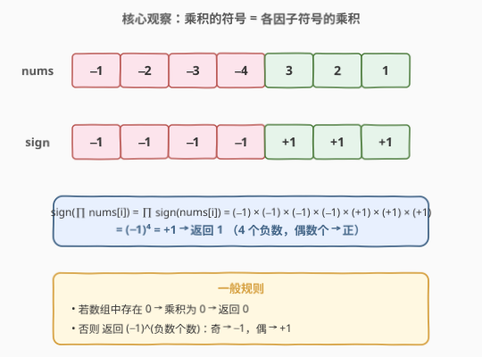
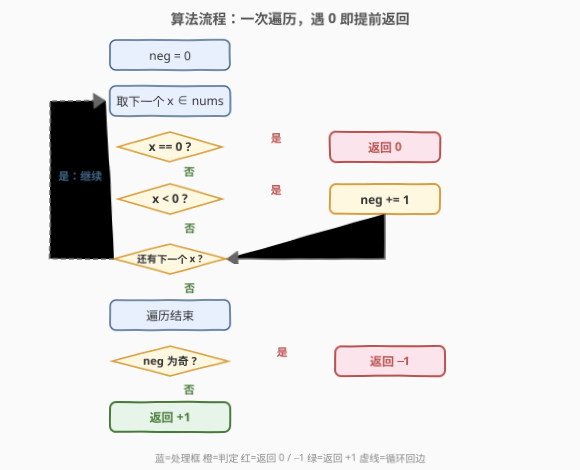
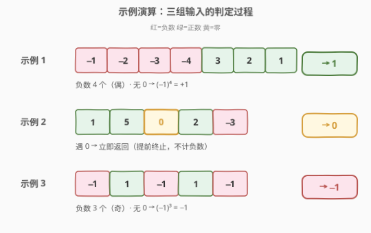

# 数组元素积的符号

- **题目名称**：数组元素积的符号
- **链接**：[1822. 数组元素积的符号](https://leetcode.cn/problems/sign-of-the-product-of-an-array/)
- **难度**：简单
- **标签**：数组、数学

## 1. 题目概述

已知一个函数 `signFunc(x)`，它会根据 `x` 的正负返回：

- `1`，如果 `x` 是正数；
- `-1`，如果 `x` 是负数；
- `0`，如果 `x` 等于 `0`。

给你一个整数数组 `nums`，令 `product` 为 `nums` 中所有元素的**乘积**，返回 `signFunc(product)`。

**示例 1**：

```text
输入：nums = [-1,-2,-3,-4,3,2,1]
输出：1
解释：数组中所有元素的乘积是 144 ，signFunc(144) = 1
```

**示例 2**：

```text
输入：nums = [1,5,0,2,-3]
输出：0
解释：数组中所有元素的乘积是 0 ，signFunc(0) = 0
```

**示例 3**：

```text
输入：nums = [-1,1,-1,1,-1]
输出：-1
解释：数组中所有元素的乘积是 -1 ，signFunc(-1) = -1
```

**约束条件**：

- `1 <= nums.length <= 1000`
- `-100 <= nums[i] <= 100`
- `nums[i]` 的乘积**保证** fits in a 32-bit integer（但仍应避免实际连乘）

> 💡 **核心矛盾**：题目要的是乘积的**符号**而非乘积本身。直接连乘虽然在本题数据范围内不会溢出（题目保证 32 位内），但完全没必要——符号这个「一比特信息」被淹没在一长串乘法里。能否只追踪符号，跳过数值？

---

## 2. 解题思路

### 2.1 暴力思路：连乘再判符号

最直觉的做法：遍历数组把所有元素乘起来得到 `product`，再根据 `product > 0 / < 0 / == 0` 返回 `1 / -1 / 0`。

```text
product = 1
for x in nums: product *= x
return 0 if product == 0 else (1 if product > 0 else -1)
```

时间 $O(n)$，空间 $O(1)$，能 AC。但有两个隐患：

1. **溢出风险**：虽然本题保证乘积在 32 位内，但若约束放宽（元素更多、更大），连乘会迅速溢出，且溢出后的符号毫无意义。
2. **做了多余的功**：乘法是重计算，而题目只需要「正负零」三态。每乘一个数，真正影响符号的只有它的**符号位**，数值大小是噪声。

> 💡 转机：把「累乘数值」降级为「累乘符号」。一旦遇到 `0`，乘积必为 `0`，可以**立刻返回**——连剩下的元素都不必看。

### 2.2 核心观察：只追踪符号，不算乘积



把每个数 $x_i$ 拆成「符号」与「绝对值」两部分，乘积的符号只取决于各因子符号的乘积：

$$\operatorname{sign}\!\left(\prod_i x_i\right) = \prod_i \operatorname{sign}(x_i), \qquad \operatorname{sign}(x_i) \in \{-1, 0, +1\}$$

由此得到三条规则：

1. **任一因子为 $0$** $\Rightarrow$ 乘积为 $0$ $\Rightarrow$ 返回 `0`。（遇到 `0` 可立即提前返回。）
2. **否则**，乘积的符号由**负数的个数**决定：每两个负数相乘得正，成对抵消。
3. 故 **负数个数为偶** $\Rightarrow$ 乘积为正 $\Rightarrow$ 返回 `1`；**负数个数为奇** $\Rightarrow$ 乘积为负 $\Rightarrow$ 返回 `-1`。

合并成公式（无 `0` 时）：

$$\text{结果} = (-1)^{\,\text{neg\_count}}$$

> 💡 **为什么成立？** 乘法的符号法则：同号得正、异号得正负取决于负数个数。正数对符号无贡献（乘 $+1$ 不变），`0` 直接清零，只有负数会翻转符号——每出现一个负数翻转一次，故最终符号由负数个数的奇偶性决定。这就是把「$n$ 个数连乘」压缩成「数负数个数」的代数根基。

### 2.3 算法流程图



一次遍历，维护计数器 `neg`：

- 遇到 `0` → 立即返回 `0`（提前终止，不必扫描剩余元素）；
- 遇到负数 → `neg += 1`；
- 遍历结束后 → `neg` 为奇返回 `-1`，为偶返回 `1`。

> 💡 **提前返回**是效率关键：一旦撞到 `0`，后续元素对结果再无影响，直接跳出。最坏情况（无 `0`）才扫完整串。

### 2.4 示例演算



以题目给出的三个示例逐个验证：

| 示例 | `nums` | 负数个数 | 是否含 0 | 判定路径 | 结果 |
|------|--------|----------|----------|----------|------|
| 1 | `[-1,-2,-3,-4,3,2,1]` | 4（偶） | 否 | 扫完 → $(-1)^4=+1$ | `1` |
| 2 | `[1,5,0,2,-3]` | —（不关心） | 是（第 3 个） | 遇 0 立即返回 | `0` |
| 3 | `[-1,1,-1,1,-1]` | 3（奇） | 否 | 扫完 → $(-1)^3=-1$ | `-1` |

> 💡 示例 2 体现了「提前返回」的价值：在 `0` 处即停，**从未访问** `2` 和 `-3`，更没有去数负数个数。这正是符号追踪相比连乘的额外收益。

---

## 3. 参考代码

### C++

```cpp
class Solution {
  public:
    int arraySign(vector<int>& nums) {
        int neg = 0;
        for (int x : nums) {
            if (x == 0) return 0;      // 遇 0 立即返回
            if (x < 0) neg++;
        }
        return neg % 2 == 1 ? -1 : 1;  // 负数个数为奇 → -1，为偶 → 1
    }
};
```

### Python

```python
class Solution:
    def arraySign(self, nums: List[int]) -> int:
        neg = 0
        for x in nums:
            if x == 0:
                return 0
            if x < 0:
                neg += 1
        return -1 if neg % 2 else 1
```

### Python（符号累乘版，对照用）

```python
class Solution:
    def arraySign(self, nums: List[int]) -> int:
        sign = 1
        for x in nums:
            if x == 0:
                return 0
            if x < 0:
                sign = -sign
        return sign
```

> ⚠️ **两种写法等价**：「数负数个数再判奇偶」与「累乘符号 `sign = -sign`」本质相同——后者每遇负数翻转一次，等价于 $(-1)^{\text{neg}}$。计数版语义更直观（直接对应公式 $(-1)^{\text{neg}}$），累乘版更紧凑。面试建议先写计数版并点出提前返回，再提累乘版作为等价实现。

---

## 4. 复杂度分析

| 维度 | 复杂度 | 说明 |
|------|--------|------|
| 时间复杂度 | $O(n)$ | 最坏情况（无 `0`）遍历整个数组一次；含 `0` 时在首个 `0` 处提前终止，实际访问元素更少 |
| 空间复杂度 | $O(1)$ | 仅用计数变量 `neg`（或符号变量 `sign`），与输入规模无关 |

> 💡 与连乘法的对比：连乘法时间同为 $O(n)$、空间 $O(1)$，但 (1) 存在溢出隐患（约束放宽时即爆）；(2) 无法在遇到 `0` 时获得额外收益以外的语义清晰度——连乘遇到 `0` 也会得到 `0`，但中间过程做了大量无用的乘法。符号追踪法把「重计算」替换为「轻判定」，是典型的「降维求解」。

---

## 5. 扩展：符号乘法半群与提前终止

### 5.1 $\{-1, 0, +1\}$ 是乘法半群

令 $S = \{-1, 0, +1\}$，则 $S$ 在普通乘法下**封闭**：任意两个 $S$ 中元素相乘结果仍在 $S$ 内。这意味着我们可以放心地只在 $S$ 中跟踪状态，永远不会「跑出」这三态——这正是符号追踪可行的代数基础。

更一般地，`signFunc` 是一个**乘法同态**：

$$\operatorname{sign}(a \cdot b) = \operatorname{sign}(a) \cdot \operatorname{sign}(b)$$

即「先乘再取符号」等于「先取符号再乘」。本题利用这一同态把「$\mathbb{Z}$ 上的连乘」投射到「$S$ 上的连乘」，把无限状态空间压缩成三态。

### 5.2 提前终止的期望收益

设数组长度为 $n$，每个元素为 `0` 的概率为 $p$（独立），则首个 `0` 出现位置服从几何分布，期望位置约为 $1/p$。当 $p$ 较大时，平均访问元素数远小于 $n$。即便最坏情况（无 `0`，$p=0$）仍需 $O(n)$，但提前返回让算法在「含零」实例上显著加速，且**零成本**获得这一收益——只需一个 `if` 判断。

### 5.3 若题目改为「乘积本身」

若题目要求返回乘积的**数值**而非符号，则符号追踪不再适用，需用大数乘法或对数累加（牺牲精度）。本题只问符号，恰好让同态投射派上用场——**问什么决定算什么**。

---

## 6. 面试要点

**Q1：为什么不直接连乘？**

> 连乘在本题 32 位保证下能 AC，但 (1) 约束放宽即溢出，溢出后符号无意义；(2) 题目只要符号这一「一比特信息」，连乘做了大量无用的数值计算。用符号同态 $\operatorname{sign}(ab)=\operatorname{sign}(a)\operatorname{sign}(b)$ 把状态压缩到 $\{-1,0,+1\}$，只数负数个数即可。

**Q2：遇到 0 为什么能立即返回？**

> 乘积中只要有一个因子为 `0`，整个乘积必为 `0`，后续元素无论如何都改不回非零。故遇到 `0` 可直接 `return 0`，不必扫描剩余元素——这是提前终止，最坏 $O(n)$，含零实例上更优。

**Q3：负数个数的奇偶性如何决定符号？**

> 正数乘 $+1$ 不改变符号；每出现一个负数翻转一次符号（乘 $-1$）。故 $k$ 个负数等价于乘 $(-1)^k$：$k$ 偶 → $+1$（正），$k$ 奇 → $-1$（负）。前提是无 `0`——`0` 已提前短路。

**Q4：「数负数个数」和「累乘符号 sign = -sign」两种写法哪个好？**

> 完全等价。累乘版每遇负数 `sign = -sign`，最终 `sign` 即 $(-1)^{\text{neg}}$。计数版直接对应公式 $(-1)^{\text{neg}}$，语义更清晰、便于解释；累乘版更紧凑。面试先写计数版点出提前返回，再提累乘版作等价对照。

**Q5：如果数组元素是浮点数怎么办？**

> 符号规则不变（同态对实数同样成立），但仍需处理「精确零」与「极小正数」的边界。若元素可能为 `0.0` / `-0.0`，需统一判定 `x == 0`。若涉及 NaN 则需额外过滤。核心「数负数 + 遇零短路」逻辑对整数和浮点都适用。

---

## 7. 同类练习题

- [229. 求众数 II](https://leetcode.cn/problems/majority-element-ii/)（[站内题解](../0201-0300/229_多数元素II.md)）：同为「降维跟踪」思想——把「统计全部频次」压缩成「维护两个候选 + 计数」，用摩尔投票把 $O(n)$ 空间压到 $O(1)$
- [136. 只出现一次的数字](https://leetcode.cn/problems/single-number/)（[站内题解](../0101-0200/136_只出现一次的数字.md)）：同为「用代数性质替代显式统计」——异或满足结合律与自反性 $a \oplus a = 0$，把「找落单数」压缩成一次异或扫描，对照本题的符号同态
- [268. 缺失数字](https://leetcode.cn/problems/missing-number/)（[站内题解](../0201-0300/268_丢失的数字.md)）：同为「同态投射」——用求和公式或异或把「找缺失」转化为 $O(1)$ 空间一次扫描，思路与符号追踪一致
- [258. 各位相加](https://leetcode.cn/problems/add-digits/)（[站内题解](../0201-0300/258_各位相加.md)）：同为「数学规律替代循环」——数字根公式 $(num-1)\bmod 9+1$ 一步出结果，体会「问什么算什么」的降维
- [1342. 将数字变成 0 的操作次数](https://leetcode.cn/problems/number-of-steps-to-reduce-a-number-to-zero/)（[站内题解](../1301-1400/1342_将数字变成0的操作步骤数.md)）：同为简单模拟中的「按位/按符号判定」——偶数除二、奇数减一，对照本题按正负零分支处理
