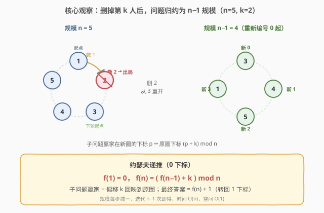
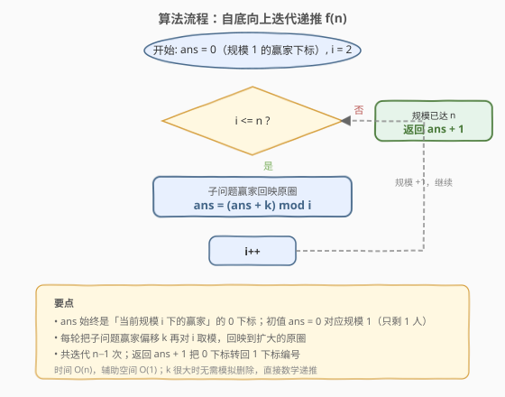
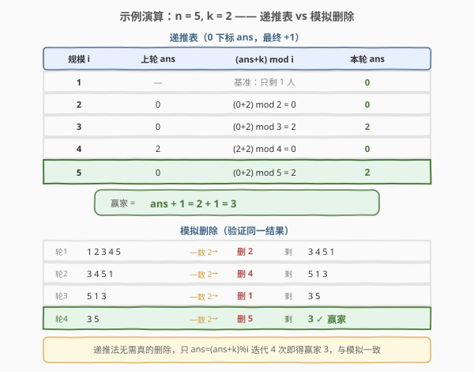

# 找出游戏的获胜者

- **题目名称**：找出游戏的获胜者
- **链接**：[1823. 找出游戏的获胜者](https://leetcode.cn/problems/find-the-winner-of-the-circular-game/)
- **难度**：中等
- **标签**：递归、数学、队列模拟

## 1. 题目概述

共有 `n` 名小伙伴一起做游戏。小伙伴们围成一圈，按**顺时针顺序**从 `1` 到 `n` 编号。从编号为 `1` 的小伙伴开始顺时针数 `k` 个，**被数到的小伙伴离开圈子**。

一名小伙伴离开后，**从下一个小伙伴开始**继续顺时针数 `k` 个，被数到的小伙伴离开圈子。如此重复，直到圈中只剩最后一名小伙伴——即为**游戏的获胜者**。返回获胜者的编号。

**示例 1**：

```text
输入：n = 5, k = 2
输出：3
解释：游戏步骤如下：
      1) 1 2 3 4 5 —— 从 1 数 2 个 → 2 离开，剩 1 3 4 5，从 3 继续
      2) 3 4 5 1 —— 从 3 数 2 个 → 4 离开，剩 1 3 5，从 5 继续
      3) 5 1 3   —— 从 5 数 2 个 → 1 离开，剩 3 5，从 3 继续
      4) 3 5     —— 从 3 数 2 个 → 5 离开，剩 3
      获胜者：3
```

**示例 2**：

```text
输入：n = 6, k = 5
输出：1
```

**约束条件**：

- `1 <= k <= n <= 500`

> 💡 本题是经典的**约瑟夫环（Josephus）问题**。`n` 最大仅 500，模拟删除可过；但真正的最优解是一个 $O(n)$ 的**数学递推**——把「规模 $n$ 的问题」归约为「规模 $n-1$ 的子问题」，无需真正模拟任何删除。

---

## 2. 解题思路

### 2.1 暴力思路

最直觉的做法是**真的模拟整个删除过程**：

- 用一个队列或列表装下 `1..n`；
- 每轮把队首的 `k-1` 个人依次搬到队尾（相当于顺时针数过 `k-1` 个），此时队首就是第 `k` 个，将其弹出（出局）；
- 重复直到队列只剩 1 人。

这种写法直观、容易写对，但每轮要做 $O(k)$ 次搬运、共 $n-1$ 轮，**时间 $O(nk)$**（列表 `pop` 版本则为 $O(n^2)$，因为每次删除要搬移后续元素）。当 $n$ 很大、`k` 也很大时会很慢——它没有利用「每轮删除后，剩下的人构成一个**同构的小一圈**的子问题」这一结构。

### 2.2 核心观察：约瑟夫递推



为推导递推，把所有人按 **0 下标**重新编号为 $0, 1, \dots, n-1$（最后答案再 `+1` 转回 1 下标）。

**关键一步：第一轮删除后发生了什么？**

- 从下标 `0` 开始数 `k` 个，第 `k` 个被数到的人是下标 $k-1$，他离开。
- 下一个**重新开始计数**的人是下标 $k$（顺时针下一位）。
- 圈中剩下 $n-1$ 人，**从下标 $k$ 起**按顺时针重排，把它们**重新编号**为 $0, 1, \dots, n-2$：

  $$\text{新下标 } j \;\longleftrightarrow\; \text{原下标 } (k + j) \bmod n$$

- 也就是说：**剩下这 $n-1$ 个人的局面，和「规模 $n-1$、同样数 $k$」的约瑟夫子问题完全同构**，只是编号做了一个 $+k$ 的循环平移。

> 💡 **关键直觉**：删一人后剩下的圈，是一个「缩小版」的同一个问题。我们不必关心是谁被删，只需关心**子问题的赢家在缩小版圈里的下标**，再把它平移回原圈。

设 $f(n)$ 为「规模 $n$ 时赢家在 0 下标圈中的位置」。若已知子问题赢家在「缩小版圈」的下标 $f(n-1)$，回映到原圈就是：

$$\text{原下标} = (k + f(n-1)) \bmod n$$

于是得到**约瑟夫递推**：

$$f(1) = 0, \qquad f(n) = \bigl(f(n-1) + k\bigr) \bmod n$$

最终答案为 $f(n) + 1$（转回 1 下标）。

> ⚠️ 注意递推里是 $+k$ 而非 $+(k-1)$：被删的是下标 $k-1$，但**重排起点**是下标 $k$，所以平移量是 $k$。这是最容易写错的一个细节。

### 2.3 算法流程图



把递推从 $f(1)$ 一路迭代到 $f(n)$，**自底向上**即可，无需递归栈：

- 初始 `ans = 0`（对应规模 1，只剩 1 人，赢家就是下标 0）；
- 让规模 `i` 从 `2` 增长到 `n`，每步 `ans = (ans + k) % i`；
- 结束后 `ans` 即 $f(n)$，返回 `ans + 1`。

共迭代 $n-1$ 次，**常数空间**。

### 2.4 示例演算



以 `n = 5, k = 2` 为例，递推表与模拟删除对照如下：

| 规模 $i$ | 上轮 ans | $(ans+k) \bmod i$ | 本轮 ans |
|----------|----------|-------------------|----------|
| 1 | — | 基准：只剩 1 人 | 0 |
| 2 | 0 | $(0+2) \bmod 2 = 0$ | 0 |
| 3 | 0 | $(0+2) \bmod 3 = 2$ | 2 |
| 4 | 2 | $(2+2) \bmod 4 = 0$ | 0 |
| 5 | 0 | $(0+2) \bmod 5 = 2$ | 2 |

最终 $f(5) = 2$，赢家 $= 2 + 1 = 3$，与右侧模拟删除逐轮得到的结果完全一致。

> 💡 对照模拟删除：轮 1 删 2 → 轮 2 删 4 → 轮 3 删 1 → 轮 4 删 5 → 剩 3。递推法**从未真正删除任何人**，仅靠 4 次取模运算就定位到赢家 3。

---

## 3. 参考代码

### C++（迭代递推，O(n) / O(1)）

```cpp
class Solution {
  public:
    int findTheWinner(int n, int k) {
        int ans = 0;                       // f(1) = 0：规模 1 的赢家（0 下标）
        for (int i = 2; i <= n; i++) {
            ans = (ans + k) % i;           // 子问题赢家回映到原圈
        }
        return ans + 1;                    // 转回 1 下标编号
    }
};
```

### Python（迭代递推，O(n) / O(1)）

```python
class Solution:
    def findTheWinner(self, n: int, k: int) -> int:
        ans = 0                            # f(1) = 0
        for i in range(2, n + 1):
            ans = (ans + k) % i
        return ans + 1
```

### Python（递归版，对应递推定义直译）

```python
class Solution:
    def findTheWinner(self, n: int, k: int) -> int:
        def f(n: int) -> int:
            return 0 if n == 1 else (f(n - 1) + k) % n
        return f(n) + 1
```

> ⚠️ 递归版语义最贴近递推定义、便于讲解，但空间为 $O(n)$（递归栈深度 $n$），且 `n` 很大时有栈溢出风险。**面试中推荐写迭代版**：把「自顶向下递归」改写为「自底向上循环」，既省栈空间又更高效。

---

## 4. 复杂度分析

| 维度 | 复杂度 | 说明 |
|------|--------|------|
| 时间复杂度 | $O(n)$ | 一个 `for` 循环从 `2` 跑到 `n`，每轮一次加法和取模，共 $n-1$ 次常数操作 |
| 空间复杂度 | $O(1)$ | 仅用 `ans`、`i` 两个变量；递归版则为 $O(n)$ 递归栈 |

> 与模拟删除的对比：队列模拟 $O(nk)$、列表 `pop` 模拟 $O(n^2)$，均高于递推的 $O(n)$。递推法在 `n` 扩大到 $10^5$ 甚至更大时依然秒过（见同类练习「剑指 Offer 62」）。

---

## 5. 扩展：模拟删除法

当 `n` 不大或题目要求还原删除过程时，模拟法仍然是有价值的写法。两种常见实现：

### 5.1 队列模拟（循环搬运 + 弹出）

把当前队首的 `k-1` 人搬到队尾，此时队首就是第 `k` 个，直接弹出：

```python
from collections import deque

class Solution:
    def findTheWinner(self, n: int, k: int) -> int:
        q = deque(range(1, n + 1))
        while len(q) > 1:
            for _ in range(k - 1):        # 数过的 k-1 人搬到队尾
                q.append(q.popleft())
            q.popleft()                   # 第 k 个人出局
        return q[0]
```

时间 $O(nk)$（每轮搬 `k-1` 次，共 `n-1` 轮），空间 $O(n)$。

### 5.2 列表 + 下标跳跃

用一个列表维护剩余的人，靠取模定位被删下标，删除后更新起点：

```python
class Solution:
    def findTheWinner(self, n: int, k: int) -> int:
        people = list(range(1, n + 1))
        cur = 0
        while len(people) > 1:
            cur = (cur + k - 1) % len(people)   # 数 k 个，下标前进 k-1
            people.pop(cur)                      # 出局（cur 已自动指向下一起点）
        return people[0]
```

> 💡 注意 `pop(cur)` 后，原 `cur` 位置上的元素就是顺时针下一位，**无需再 `+1`**——这是下标跳跃法的一个易错点。时间 $O(n^2)$（每次 `pop` 搬移后续元素），空间 $O(n)$。

---

## 6. 面试要点

1. **为什么递推里是 $+k$ 而不是 $+(k-1)$？**

   - 被删的是下标 $k-1$，但删完后**重新计数的起点**是下标 $k$。子问题把「从下标 $k$ 起」的人重编号为 $0, 1, \dots$，所以子问题赢家下标 $f(n-1)$ 回映到原圈要 $+k$ 再 $\bmod n$。被删位置（$k-1$）和重排偏移（$k$）相差 1，这是最常见的手误点。

2. **递推的边界 $f(1)=0$ 怎么理解？**

   - 规模为 1 时圈中只剩 1 人，他既是参与者也是赢家，在 0 下标圈里位置就是 0。这是递推的最小子问题，无需任何删除。最终答案再 `+1` 转回 1 下标编号。

3. **为什么能把删人后的局面看成「同一个子问题」？**

   - 删一人后剩下 $n-1$ 人仍围成一圈，**仍从某一位开始顺时针数 $k$ 个**，规则完全相同——只是编号起点被循环平移了 $k$。结构同构，故可用同一个 $f$ 函数递推，差别仅是一个可逆的下标平移。

4. **迭代版相比递归版好在哪？**

   - 递归版 `f(n) = (f(n-1)+k) % n` 是尾递归式的单链依赖，改写为「从 $i=2$ 到 $n$ 累推」即可消除递归栈，空间从 $O(n)$ 降到 $O(1)$，并避免大 `n` 下的栈溢出。这也是「自顶向下递归 → 自底向上递推」的通用优化套路。

5. **模拟法和递推法各适合什么场景？**

   - `n` 小（如本题 $n \le 500$）或题目要求还原删除顺序时，模拟法直观、易调试；`n` 大（$10^5$ 以上，见「剑指 Offer 62」）时只有 $O(n)$ 递推能过。面试中先讲模拟建立直觉，再推导递推展示数学功底，是较完整的答题节奏。

---

## 7. 同类练习题

- [剑指 Offer 62. 圆圈中最后剩下的数字](https://leetcode.cn/problems/yuan-quan-zhong-zui-hou-sheng-xia-de-shu-zi-lcof/)：约瑟夫问题**直接同款**，0 下标、$n$ 高达 $10^5$，必须用 $O(n)$ 递推否则超时，正好检验本递推的可扩展性
- [390. 消除游戏](https://leetcode.cn/problems/elimination-game/)：双向交替消除，同为「递推找最后剩者」，但归约方向与下标平移更绕，可对照体会递推建模的差异
- [60. 第k个排列](https://leetcode.cn/problems/permutation-sequence/)（[站内题解](../0001-0100/60_第k个排列.md)）：数学解码型递推（康托尔展开），同为「不模拟、用数学归约直接定位答案」的思路
- [509. 斐波那契数](https://leetcode.cn/problems/fibonacci-number/)（[站内题解](../0501-0600/509_斐波那契数.md)）：最基础的一维递推 $f(n)=f(n-1)+f(n-2)$，体会「$f(n)$ 由更小规模推出」的归约骨架
- [264. 丑数 II](https://leetcode.cn/problems/ugly-number-ii/)（[站内题解](../0201-0300/264_丑数II.md)）：多路归并式递推生成序列，递推型问题的另一形态，对照「递推构造序列」与「递推定位单点」的区别
