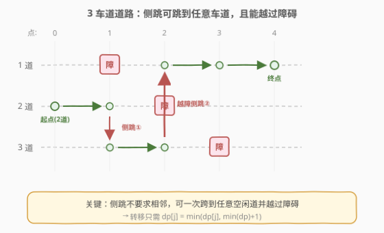
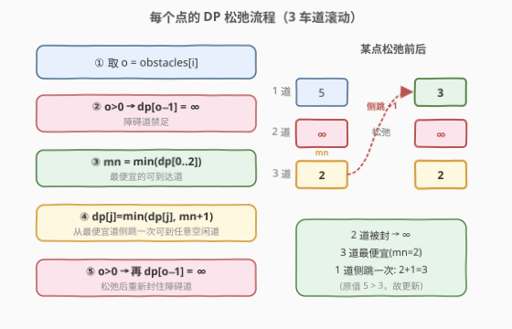
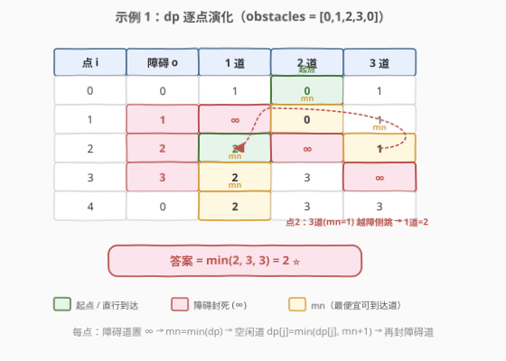

# 最少侧跳次数

- **题目名称**：最少侧跳次数
- **链接**：[1824. 最少侧跳次数](https://leetcode.cn/problems/minimum-side-jumps/)
- **难度**：中等
- **标签**：动态规划、贪心、数组

## 1. 题目概述

有一条长度为 $n$ 的 **3 车道道路**，由 $n+1$ 个点组成，编号 $0$ 到 $n$。一只青蛙从 **点 0 的第 2 车道** 出发，要跳到点 $n$。途中可能有障碍。

给定长度为 $n+1$ 的数组 `obstacles`，其中 `obstacles[i]`（取值 $0\sim 3$）表示点 $i$ 处 `obstacles[i]` 号车道有障碍；`obstacles[i] == 0` 表示该点无障碍。**每个点至多有一条车道有障碍**。

- 青蛙只能从点 $i$ 沿**同一车道**前进到点 $i+1$，前提是点 $i+1$ 该车道无障碍。
- 为避障，青蛙可在**同一点**进行一次**侧跳**，跳到**另一条车道**（**即使不相邻也行**），前提是新车道在该点无障碍。每次侧跳代价为 $1$。
- 特别地，**侧跳时可以越过障碍**（题面：青蛙只有在侧跳时才能越过障碍）。

返回从点 0 的 2 车道出发、到达点 $n$ 任意车道所需的**最少侧跳次数**。保证点 0 和点 $n$ 无障碍。

**示例 1**：

```text
输入：obstacles = [0,1,2,3,0]
输出：2
解释：最优方案如箭头所示，共 2 次侧跳。
注意青蛙在点 2 侧跳时越过了 2 车道的障碍。
```

**示例 2**：

```text
输入：obstacles = [0,1,1,3,3,0]
输出：0
解释：2 车道全程无障碍，无需侧跳。
```

**示例 3**：

```text
输入：obstacles = [0,2,1,0,3,0]
输出：2
解释：最优方案共 2 次侧跳。
```

**约束条件**：

- `obstacles.length == n + 1`
- $1 \le n \le 5 \times 10^5$
- $0 \le \text{obstacles}[i] \le 3$
- `obstacles[0] == obstacles[n] == 0`

---

## 2. 解题思路

### 2.1 暴力思路

把状态定义为 `(当前点, 当前车道)`，在所有"前进 / 侧跳"选择上做 BFS 或 DFS 枚举。状态数 $O(n)$，但每个点的侧跳组合会撑出大量路径，搜索复杂度难以控制，且 $n$ 可达 $5\times10^5$。

更自然的做法是**动态规划**：每个点只关心"到达该点每条车道的最小代价"。

### 2.2 核心观察：3 车道滚动 DP（侧跳可越障）



只有 3 条车道，所以每一点只需维护 3 个值 $dp[0], dp[1], dp[2]$（分别表示到达当前点 1/2/3 车道的最少侧跳数）。两个关键观察把转移化到极简：

> 💡 **观察 1（障碍 = 禁足）**：若点 $i$ 的 $o$ 号车道有障碍，则该点不能处在 $o$ 车道，直接令 $dp[o-1] = \infty$。

> 💡 **观察 2（侧跳可到任意道、可越障）**：题面明确"侧跳可跳到另一条车道（即使不相邻）"，且"侧跳时能越过障碍"。于是从**当前最便宜的可到达车道**出发，**一次侧跳**就能落在任意其他空闲车道上。

由此，每个点的转移只有两步：

1. **障碍道置 $\infty$**：`if o: dp[o-1] = INF`。
2. **松弛**：令 $mn = \min(dp)$（最便宜的可到达车道）。每条空闲车道要么沿原道直行到达（代价就是当前 $dp[j]$），要么从最便宜的车道侧跳一次过来（代价 $mn + 1$）。故
   $$dp[j] = \min(dp[j],\; mn + 1)$$
   再把障碍道重新置 $\infty$（松弛可能临时改了它）。

> ⚠️ 为什么是 $mn+1$ 而不是 $mn+|k-j|$？因为侧跳**不要求相邻**，从任意车道到任意车道都只算 1 次。若误按"相邻才 1 次"建模，点 2 处从 3 道跨过被堵的 2 道到 1 道就无法实现，示例 1 会算成无解——这恰恰是本题最大的坑。

初始：点 0 无障碍，青蛙在 2 车道代价为 $0$，侧跳到 1/3 车道各 $1$ 次，故 $dp = [1, 0, 1]$。

### 2.3 算法流程图



### 2.4 示例演算

以示例 1 `obstacles = [0,1,2,3,0]` 为例，逐点观察 $dp$ 的演化（$\infty$ 表示该道被障碍封死）：



关键一步在**点 2**：2 车道被封，3 车道代价 $1$ 是最便宜的可到达道；1 车道虽不相邻，但凭"侧跳可越障"以 $1+1=2$ 一次跳到。随后点 3 的 3 车道被封，沿 1 车道直行即可。最终 $\min(2,3,3) = 2$。

---

## 3. 参考代码

### C++

```cpp
class Solution {
  public:
    int minSideJumps(vector<int>& obstacles) {
        int dp[3] = {1, 0, 1};      // 点 0：2 道代价 0，1/3 道各需 1 次侧跳
        const int INF = 1e9;
        for (int o : obstacles) {
            if (o) dp[o - 1] = INF;          // 障碍道禁足
            int mn = min({dp[0], dp[1], dp[2]});
            for (int i = 0; i < 3; i++)      // 从最便宜的可到达道侧跳一次
                dp[i] = min(dp[i], mn + 1);
            if (o) dp[o - 1] = INF;          // 松弛后重新封住障碍道
        }
        return min({dp[0], dp[1], dp[2]});
    }
};
```

### Python

```python
class Solution:
    def minSideJumps(self, obstacles: List[int]) -> int:
        INF = 10 ** 9
        dp = [1, 0, 1]  # 点 0：2 道代价 0，1/3 道各需 1 次侧跳
        for o in obstacles:
            if o:
                dp[o - 1] = INF            # 障碍道禁足
            mn = min(dp)
            for i in range(3):             # 从最便宜的可到达道侧跳一次
                dp[i] = min(dp[i], mn + 1)
            if o:
                dp[o - 1] = INF            # 松弛后重新封住障碍道
        return min(dp)
```

---

## 4. 复杂度分析

| 维度 | 复杂度 | 说明 |
|------|--------|------|
| 时间复杂度 | $O(n)$ | 逐点遍历一次，每点对 3 个车道做常数次操作 |
| 空间复杂度 | $O(1)$ | 只维护长度为 3 的 `dp` 数组，与 $n$ 无关 |

---

## 5. 扩展：两阶段视角（到达 + 侧跳）

把每点的转移拆成两个阶段，有时更直观：

1. **到达**：沿原车道从上一点直行过来，代价沿用上一点的 $dp$（即不改动）。
2. **侧跳**：在该点内部，从任意空闲道跳到任意空闲道，代价 $1$。等价于"以到达阶段的最小值 $mn$ 为锚，每个空闲道都可降到 $mn+1$"。

这正好对应代码里的 `mn = min(dp); dp[i] = min(dp[i], mn+1)`。若题目改成"侧跳只能到相邻车道且不能越障"，则松弛需改成两遍相邻传递（$dp[j] = \min(dp[j], dp[j\pm1]+1)$），中间道被封时无法跨越——本题的"可越障"设定正是为了规避这种死锁。

---

## 6. 面试要点

1. **为什么侧跳代价统一是 1 而非按车道距离？**
   - 题面明确侧跳可跳到"另一条车道（即使不相邻）"，且能越过障碍，故任意两车道间都是 1 次侧跳，不必按 $|k-j|$ 计费。

2. **障碍道为什么要松弛后再置一次 $\infty$？**
   - 松弛式 `dp[i] = min(dp[i], mn+1)` 会把所有车道（含障碍道）都尝试更新；障碍道必须重新封住，否则下一点会误以为能沿该道直行。

3. **初始 $dp$ 为什么是 $[1,0,1]$？**
   - 点 0 无障碍，青蛙在 2 道代价 $0$；侧跳到 1 或 3 道各需 $1$ 次，故 $[1,0,1]$。

4. **为什么不用二维 DP 表？**
   - 转移只依赖上一点的状态，用滚动数组（长度 3）即可，空间 $O(1)$。

5. **如果点 0 或点 $n$ 也有障碍怎么办？**
   - 本题保证 `obstacles[0] == obstacles[n] == 0`；若不保证，需在起点排除非 2 道的初始侧跳合法性、在终点取 $\min$ 时跳过被封道。

---

## 7. 同类练习题

- [1289. 下降路径最小和 II](https://leetcode.cn/problems/minimum-falling-path-sum-ii/)：逐行选列、相邻行不同列的最小代价 DP，"换道取最小 + 转移"的同构套路
- [63. 不同路径 II](https://leetcode.cn/problems/unique-paths-ii/)：带障碍的网格路径计数 DP，障碍置 0 的思路与本题障碍置 $\infty$ 同源
- [64. 最小路径和](https://leetcode.cn/problems/minimum-path-sum/)：网格最小代价路径 DP，障碍路径 DP 的入门版
- [1463. 摘樱桃 II](https://leetcode.cn/problems/cherry-pickup-ii/)：两机器人在行间换道采樱桃，多代理换道 DP
