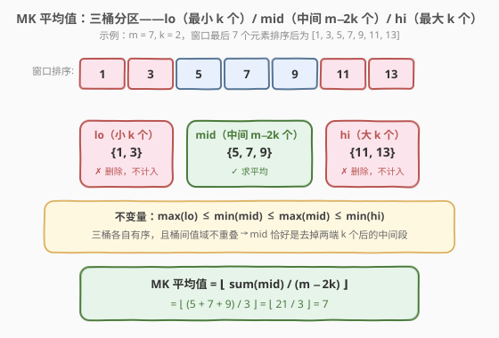
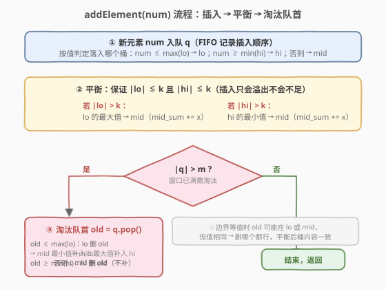
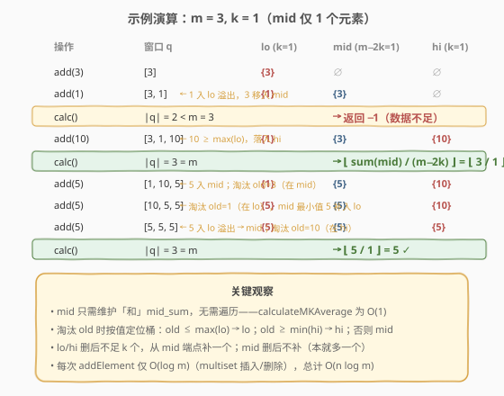

# LeetCode 求出 MK 平均值 题解

## 1. 题目概述

- **标题 / 题号**：求出 MK 平均值（#1825，hard）
- **链接**：https://leetcode.cn/problems/finding-mk-average/
- **难度**：困难
- **标签**：设计、有序集合、滑动窗口、堆、数据流

**题意**：给定整数 `m` 和 `k`，以及数据流形式的若干整数。实现 `MKAverage` 类，支持两种操作：

- `addElement(int num)`：往数据流中插入新元素 `num`。
- `calculateMKAverage()`：若数据流中少于 `m` 个元素返回 `-1`；否则取**最后 `m` 个元素**，删除其中最小的 `k` 个和最大的 `k` 个，对剩余 $m - 2k$ 个元素求平均值并**向下取整**。

**示例 1**：

```text
输入：
["MKAverage", "addElement", "addElement", "calculateMKAverage",
 "addElement", "calculateMKAverage", "addElement", "addElement",
 "addElement", "calculateMKAverage"]
[[3, 1], [3], [1], [], [10], [], [5], [5], [5], []]
输出：[null, null, null, -1, null, 3, null, null, null, 5]

解释：m = 3, k = 1（mid 仅保留 1 个元素）
  add(3)  → 数据流 [3]
  add(1)  → 数据流 [3, 1]
  calc()  → 元素数 2 < 3，返回 −1
  add(10) → 数据流 [3, 1, 10]，最后 3 个 = [3, 1, 10]
            删最小 1 个 {1}、最大 1 个 {10}，剩 {3}，avg = 3
  add(5)  → 数据流 [3, 1, 10, 5]，最后 3 个 = [1, 10, 5]
            删 {1} 和 {10}，剩 {5}，avg = 5
  add(5)  → 最后 3 个 = [10, 5, 5]，删 {10} 和 {5}，剩 {5}，avg = 5
  add(5)  → 最后 3 个 = [5, 5, 5]，删 {5} 和 {5}，剩 {5}，avg = 5
  calc()  → 返回 5
```

**约束**：

- $3 \le m \le 10^5$
- $1 \le 2k < m$（保证 $m - 2k \ge 1$，即 mid 永不空）
- $1 \le \text{num} \le 10^5$
- `addElement` 与 `calculateMKAverage` 的**总调用次数**不超过 $10^5$

> 💡 **关键观察**：题目本质是「**滑动窗口 + 去掉两端极值后求均值**」。窗口大小固定为 `m`（FIFO 淘汰最旧元素），每次查询需快速得到「去掉最小 `k` 个与最大 `k` 个后中间段的和」。难点在于：数据流**既有插入又有删除**，且单次操作要 $O(\log m)$ 级别，暴力排序 $O(m \log m)$ 必然超时。

## 2. 解题思路

### 2.1 暴力思路：每次查询排序

最直观的做法：`addElement` 直接把 `num` 追加到列表尾部，超出 `m` 时弹出队首；`calculateMKAverage` 时复制最后 `m` 个元素排序，删去前后各 `k` 个，对中间段求和取平均。

```text
addElement(num):
    q.push(num)
    if |q| > m: q.pop_left()
calculateMKAverage():
    if |q| < m: return -1
    sorted_window = sorted(q)
    middle = sorted_window[k : m-k]
    return sum(middle) // (m - 2*k)
```

若总操作 $n = 10^5$、$m = 10^5$，每次查询 $O(m \log m) \approx 10^5 \times 17$，最坏 $10^5$ 次查询共 $\approx 1.7 \times 10^{11}$，**严重超时**。瓶颈在于：**每次查询都从头排序**，没有复用前一次的有序状态。

### 2.2 核心观察：三桶分区（lo / mid / hi）



借鉴 [Day 23 数据流的中位数（295）](../0201-0300/295_数据流的中位数.md) 的「双堆分两区」思想，本题需要**分三区**：将窗口内 $m$ 个元素按值域划分为三个**有序集合**：

| 桶 | 大小 | 内容 | 作用 |
|----|------|------|------|
| `lo` | $k$ | 最小的 $k$ 个元素 | 待删除的极小值段 |
| `mid` | $m - 2k$ | 中间的 $m - 2k$ 个元素 | **求和目标**，维护 `mid_sum` |
| `hi` | $k$ | 最大的 $k$ 个元素 | 待删除的极大值段 |

**不变量**：$\max(\text{lo}) \le \min(\text{mid}) \le \max(\text{mid}) \le \min(\text{hi})$。三桶各自有序、桶间值域不重叠，使得 `mid` 恰好就是「去掉两端 $k$ 个后的中间段」。

> 💡 **为什么用三个有序集合而非两个堆？** 295 题只需找中位数（一个分界点），双堆足够。本题需要**同时跳过最小 $k$ 个和最大 $k$ 个**，有**两个分界点**，故需三段。更关键的是：堆**不支持 $O(\log n)$ 删除任意元素**，而本题数据流有 FIFO 淘汰，必须删旧元素。`multiset` / `SortedList` 支持 $O(\log n)$ 任意删除，是本题的正确工具。参见 [Day 30 滑动窗口中位数（480）](../0401-0500/480_滑动窗口中位数.md) 中「双堆 + 延迟删除」的对照方案。

> ⚠️ **mid 只需维护「和」**：`calculateMKAverage` 返回 $\lfloor \text{mid\_sum} / (m - 2k) \rfloor$。每次往 `mid` 插入/删除元素时同步增减 `mid_sum`，查询时 $O(1)$ 直接返回——无需遍历 `mid`。

### 2.3 算法流程图



**`addElement(num)` 三步走**：

**① 插入**：将 `num` 放入合适的桶（按值判定，保持桶间有序）：

```text
if |lo| < k 或 num ≤ max(lo):     lo.insert(num)      // 属于小段
else if |hi| < k 或 num ≥ min(hi): hi.insert(num)      // 属于大段
else:                              mid.insert(num); mid_sum += num  // 属于中段
```

**② 平衡**：插入只可能让 `lo` 或 `hi` **溢出**（大小超过 $k$），把多出的端点搬到 `mid`：

```text
if |lo| > k:  x = max(lo);  lo.erase(x);  mid.insert(x); mid_sum += x   // lo 最大 → mid
if |hi| > k:  x = min(hi);  hi.erase(x);  mid.insert(x); mid_sum += x   // hi 最小 → mid
```

**③ 淘汰队首**：若 $|q| > m$，弹出队首 `old`，按值定位其所在桶并删除，再视情况从 `mid` 端点补一个回 `lo`/`hi`：

```text
old = q.pop_front()
if old ≤ max(lo):              // old 在 lo（或边界等值，见下方说明）
    lo.erase(old)
    if mid 非空: x = min(mid); mid.erase(x); mid_sum -= x; lo.insert(x)   // 从 mid 借最小补 lo
elif old ≥ min(hi):            // old 在 hi（或边界等值）
    hi.erase(old)
    if mid 非空: x = max(mid); mid.erase(x); mid_sum -= x; hi.insert(x)   // 从 mid 借最大补 hi
else:                          // old 在 mid
    mid.erase(old); mid_sum -= old                                          // mid 本就多一个，无需补
```

> 💡 **边界等值的「删哪个都行」性质**：当 `old == max(lo)` 且 `mid` 中也有同值元素时，`old ≤ max(lo)` 为真，会从 `lo` 删除。这看似删错了桶（`old` 实际可能在 `mid`），但紧接着从 `mid` 借最小元素补回 `lo`——而 `mid` 的最小值恰好等于 `old`。净效果等价于直接从 `mid` 删除 `old`，桶内容完全一致。**值相同 → 物理身份无关紧要**，这是有序多重集合处理重复元素的核心技巧。

> ⚠️ **为何 `mid` 删除后不补？** 插入时 `mid` 临时多存了 1 个（$m - 2k + 1$），淘汰 `old` 后正好回到 $m - 2k$，`lo`/`hi` 仍是 $k$，无需补充。而 `old` 在 `lo`/`hi` 时，该桶少 1 个，必须从 `mid` 端点借一个回来。

### 2.4 示例演算

以 `m = 3, k = 1` 为例，逐步追踪三桶状态：



| 操作 | 窗口 q | lo (k=1) | mid (1) | hi (k=1) | 说明 |
|------|--------|----------|---------|----------|------|
| `add(3)` | `[3]` | `{3}` | `∅` | `∅` | lo 不足 k，直接入 lo |
| `add(1)` | `[3,1]` | `{1}` | `{3}` | `∅` | 1 入 lo 溢出，3 移入 mid |
| `calc()` | `|q|=2<3` | — | — | — | 返回 **−1** |
| `add(10)` | `[3,1,10]` | `{1}` | `{3}` | `{10}` | 10 ≥ max(lo)，入 hi |
| `calc()` | `|q|=3` | — | sum=3 | — | ⌊3/1⌋ = **3** ✓ |
| `add(5)` | `[1,10,5]` | `{1}` | `{5}` | `{10}` | 5 入 mid；淘汰 old=3（在 mid，直接删） |
| `add(5)` | `[10,5,5]` | `{5}` | `{5}` | `{10}` | 5 入 mid；淘汰 old=1（在 lo），mid 最小 5 补入 lo |
| `add(5)` | `[5,5,5]` | `{5}` | `{5}` | `{5}` | 5 入 lo 溢出→mid；淘汰 old=10（在 hi），mid 最大 5 补入 hi |
| `calc()` | `|q|=3` | — | sum=5 | — | ⌊5/1⌋ = **5** ✓ |

## 3. 参考代码

### C++

```cpp
class MKAverage {
private:
    int m, k;
    long long mid_sum = 0;
    multiset<int> lo, mid, hi;   // lo: 最小 k 个 | mid: 中间 m-2k 个 | hi: 最大 k 个
    queue<int> q;                 // FIFO 窗口

    void insert(int num) {
        if ((int)lo.size() < k || num <= *lo.rbegin()) {
            lo.insert(num);
        } else if ((int)hi.size() < k || num >= *hi.begin()) {
            hi.insert(num);
        } else {
            mid.insert(num);
            mid_sum += num;
        }
        if ((int)lo.size() > k) {            // lo 溢出 → 最大搬入 mid
            auto it = prev(lo.end());
            int x = *it;
            lo.erase(it);
            mid.insert(x);
            mid_sum += x;
        }
        if ((int)hi.size() > k) {            // hi 溢出 → 最小搬入 mid
            auto it = hi.begin();
            int x = *it;
            hi.erase(it);
            mid.insert(x);
            mid_sum += x;
        }
    }

    void remove(int old) {
        if (!lo.empty() && old <= *lo.rbegin()) {       // old 在 lo（或边界等值）
            lo.erase(lo.find(old));
            if (!mid.empty()) {                         // mid 借最小补 lo
                auto it = mid.begin();
                int x = *it;
                mid.erase(it);
                mid_sum -= x;
                lo.insert(x);
            }
        } else if (!hi.empty() && old >= *hi.begin()) { // old 在 hi（或边界等值）
            hi.erase(hi.find(old));
            if (!mid.empty()) {                         // mid 借最大补 hi
                auto it = prev(mid.end());
                int x = *it;
                mid.erase(it);
                mid_sum -= x;
                hi.insert(x);
            }
        } else {                                        // old 在 mid
            mid.erase(mid.find(old));
            mid_sum -= old;
        }
    }

public:
    MKAverage(int m, int k) : m(m), k(k) {}

    void addElement(int num) {
        q.push(num);
        insert(num);
        if ((int)q.size() > m) {
            int old = q.front();
            q.pop();
            remove(old);
        }
    }

    int calculateMKAverage() {
        if ((int)q.size() < m) return -1;
        return (int)(mid_sum / (m - 2 * k));
    }
};
```

### Python

```python
from sortedcontainers import SortedList
from collections import deque


class MKAverage:
    def __init__(self, m: int, k: int):
        self.m = m
        self.k = k
        self.lo = SortedList()
        self.mid = SortedList()
        self.hi = SortedList()
        self.mid_sum = 0
        self.q = deque()

    def _insert(self, num: int) -> None:
        if len(self.lo) < self.k or num <= self.lo[-1]:
            self.lo.add(num)
        elif len(self.hi) < self.k or num >= self.hi[0]:
            self.hi.add(num)
        else:
            self.mid.add(num)
            self.mid_sum += num
        if len(self.lo) > self.k:               # lo 溢出 → 最大搬入 mid
            x = self.lo.pop()
            self.mid.add(x)
            self.mid_sum += x
        if len(self.hi) > self.k:               # hi 溢出 → 最小搬入 mid
            x = self.hi.pop(0)
            self.mid.add(x)
            self.mid_sum += x

    def _remove(self, old: int) -> None:
        if self.lo and old <= self.lo[-1]:      # old 在 lo（或边界等值）
            self.lo.remove(old)
            if self.mid:                        # mid 借最小补 lo
                x = self.mid.pop(0)
                self.mid_sum -= x
                self.lo.add(x)
        elif self.hi and old >= self.hi[0]:     # old 在 hi（或边界等值）
            self.hi.remove(old)
            if self.mid:                        # mid 借最大补 hi
                x = self.mid.pop()
                self.mid_sum -= x
                self.hi.add(x)
        else:                                   # old 在 mid
            self.mid.remove(old)
            self.mid_sum -= old

    def addElement(self, num: int) -> None:
        self.q.append(num)
        self._insert(num)
        if len(self.q) > self.m:
            self._remove(self.q.popleft())

    def calculateMKAverage(self) -> int:
        if len(self.q) < self.m:
            return -1
        return self.mid_sum // (self.m - 2 * self.k)
```

> 💡 **实现细节**：① C++ 用 `multiset`（允许重复、有序、$O(\log n)$ 插入/删除/查找），`*lo.rbegin()` 取最大、`*hi.begin()` 取最小。② 删除时用 `lo.find(old)` 拿到迭代器再 `erase(it)`，**只删一个**；若直接 `erase(value)` 会删掉所有等于 `old` 的元素，破坏大小。③ Python 用 `SortedList`（LeetCode 内置 `sortedcontainers`），`pop()` 弹最大、`pop(0)` 弹最小，`remove(value)` 删首个匹配。④ `mid_sum` 用 `long long`（C++），最坏 $m = 10^5$ 个 $10^5$ 累加达 $10^{10}$，超出 `int` 范围。

> ⚠️ **C++ 删除迭代器 vs 删除值的区别**：`multiset::erase(iterator)` 只删该迭代器指向的一个元素；`multiset::erase(value)` 删**所有**等于该值的元素。本题需严格删一个，必须用 `find` 取迭代器。这是 `multiset` 与 `set` 最易踩的坑。

## 4. 复杂度分析

| 维度 | 复杂度 | 说明 |
|------|--------|------|
| `addElement` 时间 | $O(\log m)$ | 三桶各一次 `multiset` 插入 + 至多两次搬运（每次插入/删除 $O(\log m)$），合计常数次 $O(\log m)$ 操作 |
| `calculateMKAverage` 时间 | $O(1)$ | 直接返回 `mid_sum / (m - 2k)`，无需遍历 |
| 空间 | $O(m)$ | 三桶共存 $m$ 个元素 + 队列 $m$ 个元素，合计 $O(m)$ |

> ⚠️ 暴力 $O(m \log m)$ 每次查询、总 $O(n \cdot m \log m) \approx 10^{11}$；优化后单次 $O(\log m)$、总 $O(n \log m) \approx 10^5 \times 17 \approx 1.7 \times 10^6$，快约 $10^5$ 倍。核心是**用三桶维护有序分区，把每次查询的排序成本均摊到每次插入的 $O(\log m)$**。

## 5. 扩展：与双堆延迟删除方案（480 风格）的对比

[480. 滑动窗口中位数](../0401-0500/480_滑动窗口中位数.md) 用「双堆 + 延迟删除」处理滑动窗口中位数。本题也可借鉴：用两个堆分别维护 `lo`（大根堆，存最小 $k$ 个）和 `hi`（小根堆，存最大 $k$ 个），`mid` 用平衡结构或堆 + 延迟删除。但堆不支持 $O(\log n)$ 任意删除，必须引入 `delayed` 哈希表记录待删元素、并在堆顶懒清理。

| 方案 | 数据结构 | 单次 addElement | 实现复杂度 | 适用场景 |
|------|---------|----------------|-----------|---------|
| **三有序集合** | `multiset`×3 / `SortedList`×3 | $O(\log m)$ | 中等 | 通用，本题首选 |
| 双堆 + 延迟删除 | `priority_queue`×2 + `delayed` 哈希 | $O(\log m)$ 摊还 | 高（懒清理逻辑繁琐） | 仅当无 `SortedList` 可用时 |
| 值域树状数组 | BIT（计数 + 求和） | $O(\log V)$，$V = 10^5$ | 中等 | 值域小且已知 |

> 💡 **选择依据**：C++ 有 `multiset`、Python 有 `sortedcontainers`，三集合方案最简洁直观。若面试中不允许用 `SortedList`，值域 BIT 是稳妥替代——本题 $1 \le \text{num} \le 10^5$，值域不大，BIT 二分找第 $k$ 小 + 区间求和可 $O(\log V)$ 完成所有操作。

> ⚠️ **值域 BIT 思路**：开两个 BIT——`cnt` 记录每个值出现次数、`sum` 记录每个值的和。`addElement` 时更新两个 BIT；淘汰 `old` 时减去对应计数与和。`calculateMKAverage` 时，在 `cnt` 上二分找到第 $k$ 小和第 $(m-k)$ 小的值，再用 `sum` BIT 求中间段之和。优点是 $O(\log V)$ 且不依赖 `SortedList`，缺点是需要值域连续且不大。

## 6. 面试要点

1. **为什么用三个有序集合而不是两个堆？**

   > 本题需要**同时跳过最小 $k$ 个和最大 $k$ 个**，有两个分界点，必须分三段。295 题只有一个分界点（中位数），双堆即可。更关键的是堆不支持 $O(\log n)$ 删除任意元素，而本题有 FIFO 淘汰，必须删旧元素——`multiset`/`SortedList` 支持 $O(\log n)$ 任意删除，是正确选择。

2. **如何定位被淘汰的 `old` 在哪个桶？删错桶怎么办？**

   > 用值比较：`old ≤ max(lo)` → lo；`old ≥ min(hi)` → hi；否则 mid。当 `old` 等于桶间边界值时，可能在 `lo` 或 `mid`（同值跨桶），但**值相同 → 删哪个物理元素都等价**。若误从 `lo` 删，紧接着从 `mid` 借最小补回 `lo`，而 `mid` 最小值恰等于 `old`，净效果与直接从 `mid` 删一致。

3. **为什么 `mid` 删除后不补充，而 `lo`/`hi` 删除后要从 `mid` 借？**

   > 插入时 `mid` 临时多存 1 个（$m - 2k + 1$），淘汰 `old` 在 `mid` 时正好回到 $m - 2k$，`lo`/`hi` 仍各 $k$ 个，无需补。但 `old` 在 `lo`/`hi` 时，该桶少 1 个，必须从 `mid` 端点借一个回来维持大小 $k$。

4. **`mid_sum` 为什么用 `long long`？溢出风险多大？**

   > 最坏 $m = 10^5$、每个元素 $10^5$，`mid` 段和最坏 $10^5 \times 10^5 = 10^{10}$，超出 32 位 `int` 上限 $\approx 2.1 \times 10^9$。必须用 `long long`（C++）或 Python 的任意精度整数。这是「累加器类型」的常见坑：**累加上限 = 元素数 × 元素值上界**，先估算再选类型。

5. **本题与 [480. 滑动窗口中位数](https://leetcode.cn/problems/sliding-window-median/) 的异同？**

   > 两者都是「滑动窗口 + 有序数据结构维护」。480 求中位数（一个分界点），用双堆 + 延迟删除；1825 求去两端 $k$ 个后的均值（两个分界点），用三有序集合。480 的窗口每次查询都需输出，1825 的 `calc` 可 $O(1)$ 返回（因 `mid_sum` 增量维护）。核心差异：**分界点数量决定数据结构段数**——1 个分界用双堆，2 个分界用三集合。

> 💡 **一句话总结**：本题是「三桶分区 + 增量维护和」的经典设计题——用三个有序集合分别维护最小段、中间段、最大段，插入时按值落桶并平衡，淘汰时按值定位并从中间段借补，`mid_sum` 让查询 $O(1)$。核心思想是**把排序成本均摊到每次 $O(\log m)$ 的插入/删除**。

## 同类练习题

| # | 题目 | 与本题的关联 |
|---|------|-------------|
| 295 | [数据流的中位数](https://leetcode.cn/problems/find-median-from-data-stream/)（[题解](../0201-0300/295_数据流的中位数.md)） | 双堆维护一个分界点（中位数），是本题「三集合分两段」思想的退化版（一段用堆、不需删旧元素） |
| 480 | [滑动窗口中位数](https://leetcode.cn/problems/sliding-window-median/)（[题解](../0401-0500/480_滑动窗口中位数.md)） | 双堆 + 延迟删除处理滑动窗口中位数，对照「堆 + 懒删」与本题「有序集合直接删」两种删旧元素的方案 |
| 239 | [滑动窗口最大值](https://leetcode.cn/problems/sliding-window-maximum/)（[题解](../0201-0300/239_滑动窗口最大值.md)） | 单调队列 $O(n)$ 求窗口最大值，对照「单一极值可用单调队列」与本题「需去两端 $k$ 个无法用单调队列」 |
| 146 | [LRU 缓存](https://leetcode.cn/problems/lru-cache/)（[题解](../0101-0200/146_LRU缓存.md)） | 哈希 + 双向链表的设计题，同属「数据结构设计 + FIFO 淘汰」范式，对照淘汰策略的实现差异 |
| 460 | [LFU 缓存](https://leetcode.cn/problems/lfu-cache/)（[题解](../0401-0500/460_LFU缓存.md)） | 频率桶 + 哈希的复杂设计题，同属「多桶分区 + 增量维护」的设计思路 |
