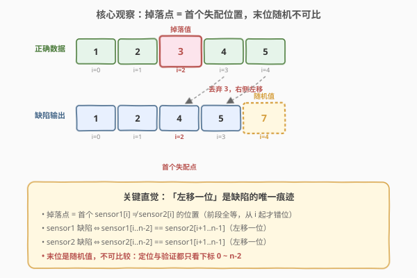
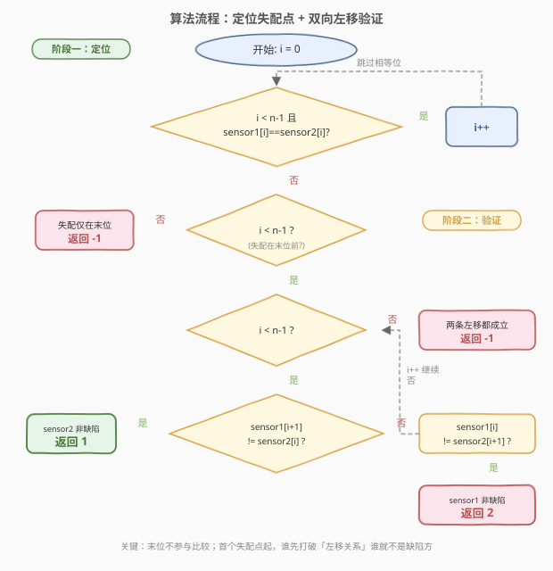

# 有缺陷的传感器

- **题目名称**：有缺陷的传感器
- **链接**：[1826. 有缺陷的传感器](https://leetcode.cn/problems/faulty-sensor/)
- **难度**：简单
- **标签**：数组、双指针、模拟

## 1. 题目概述

实验室同时使用**两个**传感器采集数据。给定长度相同的数组 `sensor1` 与 `sensor2`，其中 `sensor1[i]`、`sensor2[i]` 分别是两个传感器对第 `i` 个数据点的采集值。

这类传感器**可能存在缺陷**：它会丢弃**某一个**数据点（掉落值），丢弃后其右侧所有数据点**向左移动一位**，而**最后一个位置**被某个**随机值**替换（保证该随机值不等于掉落值）。

- 例如正确数据为 `[1,2,3,4,5]`，若 `3` 被丢弃，传感器返回 `[1,2,4,5,7]`（末位可以是任意值，不限于 `7`）。

可以确定**最多有一个**传感器有缺陷。请返回有缺陷的传感器编号（`1` 或 `2`）；若任一传感器没有缺陷，或**无法**确定，返回 `-1`。

**示例 1**：

```text
输入：sensor1 = [2,3,4,5], sensor2 = [2,1,3,4]
输出：1
解释：传感器 2 返回了所有正确的数据。传感器 1 丢弃了第二个数据点（值 1），
      末位被替换为 5。
```

**示例 2**：

```text
输入：sensor1 = [2,2,2,2,2], sensor2 = [2,2,2,2,5]
输出：-1
解释：无法判定哪个传感器有缺陷。若任一传感器丢弃的是最后一位，
      另一个传感器都能给出与之对应的输出。
```

**示例 3**：

```text
输入：sensor1 = [2,3,2,2,3,2], sensor2 = [2,3,2,3,2,7]
输出：2
解释：传感器 1 返回了所有正确的数据。传感器 2 丢弃了第四个数据点，
      末位被替换为 7。
```

**约束条件**：

- `sensor1.length == sensor2.length`
- `1 <= sensor1.length <= 100`
- `1 <= sensor1[i], sensor2[i] <= 100`

> 💡 本题的关键在于**末位是随机值、不可信**。因此所有比较只能在前 `n-1` 个位置（下标 `0` 到 `n-2`）上进行，最后一个位置既不能用来定位掉落点，也不能用来验证，只能丢弃。

---

## 2. 解题思路

### 2.1 暴力思路

最直觉的做法是枚举「哪个传感器、在哪个位置丢弃了数据」，再逐一构造出缺陷后的数组与输入比对：

- 假设 `sensor1` 在位置 `k` 丢弃了数据（即正确的数组是 `sensor2`），则缺陷数组应为 `[sensor2[0..k-1], sensor2[k+1..n-1], 随机值]`，即前 `k` 个不变、从 `k+1` 起整体左移一位、末位任意。
- 对每个 `k` 检查 `sensor1[0..k-1] == sensor2[0..k-1]` 且 `sensor1[k..n-2] == sensor2[k+1..n-1]`（末位 `sensor1[n-1]` 跳过，因为是随机值）。
- 对 `sensor2` 同理枚举。

这种写法正确但需要双重循环（枚举 `k` + 逐位比对），虽因 $n \le 100$ 也能通过，却未能利用「掉落点就是首个失配位置」这一结构，存在冗余。

### 2.2 核心观察：首个失配点即掉落点，末位随机不可比



**观察一：掉落点就是首个失配位置。** 若 `sensor1` 有缺陷、在位置 `k` 丢弃了数据，则 `sensor1[0..k-1]` 与正确值（`sensor2`）完全一致，从 `k` 开始才因左移而错位。因此从左向右扫描，**第一个 `sensor1[i] != sensor2[i]` 的位置 `i` 就是掉落点**（若两传感器互换角色，同理）。

**观察二：末位是随机值，不能参与比较。** 无论哪个传感器有缺陷，其末位都被替换成了与掉落值无关的随机值。因此：

- 扫描定位失配点时只看下标 `0` 到 $n-2$（不到末位）；
- 比对左移后的序列时也只比对到 $n-2$，**末位一律跳过**。

> ⚠️ 若首个失配已经出现在末位（即前 $n-1$ 个位置全等），则无法判定——任一传感器都可能是「丢弃了最后一位、末位填了随机值」的那个。这正是示例 2 返回 `-1` 的原因。

**观察三：双向同时验证，谁先失败谁就不是缺陷方。** 在失配点 `i` 之后，若 `sensor1` 有缺陷，则应有 `sensor1[j] == sensor2[j+1]`（`sensor1` 是 `sensor2` 左移一位的结果）；若 `sensor2` 有缺陷，则应有 `sensor2[j] == sensor1[j+1]`。从 `i` 起向后同时检查这两条性质，**谁的性质先被打破，谁就不是缺陷方**，另一方便是答案；若两条性质始终同时成立到末尾，则无法区分，返回 `-1`。

> 💡 关键直觉：**「左移一位」是缺陷的唯一痕迹**。`sensor1` 缺陷 ⇔ `sensor1` 是 `sensor2` 的左移；`sensor2` 缺陷 ⇔ `sensor2` 是 `sensor1` 的左移。两条「左移关系」中至多一条成立——因为题设保证至多一个传感器有缺陷。于是问题从「枚举掉落点」简化为「自首个失配点起，验证哪一侧满足左移关系」。

### 2.3 算法流程图



流程分两个阶段：

1. **定位阶段**：`i` 从 `0` 起向后，跳过所有 `sensor1[i] == sensor2[i]` 的位置，停在首个失配处（且只扫到 $n-2$，末位不参与）。
2. **验证阶段**：`i` 继续向后到 $n-2$，每步做两次比较：
   - `sensor1[i+1] != sensor2[i]`？若是，说明 `sensor2` 不满足「等于 `sensor1` 左移」⇒ `sensor2` 不是缺陷方 ⇒ **返回 1**；
   - `sensor1[i] != sensor2[i+1]`？若是，说明 `sensor1` 不满足「等于 `sensor2` 左移」⇒ `sensor1` 不是缺陷方 ⇒ **返回 2**；
   - 两者都满足则继续。
3. 验证阶段正常结束仍未分晓 ⇒ **返回 -1**（两条左移关系同时成立，无法区分；或失配仅在末位）。

### 2.4 示例演算

![示例演算：sensor1 = [2,3,4,5], sensor2 = [2,1,3,4]](../images/faulty_sensor_walkthrough.svg)

以示例 1 `sensor1 = [2,3,4,5]`、`sensor2 = [2,1,3,4]`（$n=4$）为例：

- **定位阶段**（扫到 $n-2=2$）：
  - `i=0`：`sensor1[0]=2 == sensor2[0]=2`，跳过，`i=1`。
  - `i=1`：`sensor1[1]=3 != sensor2[1]=1`，**失配**，定位阶段结束，`i=1`。
- **验证阶段**（`i` 从 1 到 $n-2=2$）：
  - `i=1`：检查 `sensor1[2]=4` vs `sensor2[1]=1` → `4 != 1`，**`sensor2` 不满足左移关系** ⇒ 返回 **1**。

> 💡 解释：若 `sensor2` 有缺陷（在位置 1 丢弃），则 `sensor2` 应是 `sensor1` 左移一位的结果，即 `sensor2[1]` 应等于 `sensor1[2]=4`，但实际 `sensor2[1]=1`，矛盾。反之 `sensor1` 有缺陷时 `sensor1[1]` 应等于 `sensor2[2]=3`，而 `sensor1[1]=3` 恰好成立（此步未触发返回）。故 `sensor1` 是缺陷方。扫描在 `i=1` 即停止，**从未访问末位** `sensor1[3]=5`（随机值）。

---

## 3. 参考代码

### C++（定位失配 + 双向左移验证）

```cpp
class Solution {
  public:
    int badSensor(vector<int>& sensor1, vector<int>& sensor2) {
        int n = sensor1.size();
        int i = 0;
        // 定位阶段：跳过所有相等位，停在首个失配处（只扫到 n-2，末位不参与）
        for (; i < n - 1 && sensor1[i] == sensor2[i]; ++i) {}
        // 验证阶段：双向检查「左移一位」关系
        for (; i < n - 1; ++i) {
            if (sensor1[i + 1] != sensor2[i]) return 1;   // sensor2 不满足左移 ⇒ sensor1 缺陷
            if (sensor1[i] != sensor2[i + 1]) return 2;   // sensor1 不满足左移 ⇒ sensor2 缺陷
        }
        return -1;                                        // 两条关系同时成立或失配仅在末位
    }
};
```

### Python（定位失配 + 双向左移验证）

```python
class Solution:
    def badSensor(self, sensor1: List[int], sensor2: List[int]) -> int:
        n = len(sensor1)
        i = 0
        # 定位阶段：跳过所有相等位，停在首个失配处（只扫到 n-2，末位不参与）
        while i < n - 1 and sensor1[i] == sensor2[i]:
            i += 1
        # 验证阶段：双向检查「左移一位」关系
        while i < n - 1:
            if sensor1[i + 1] != sensor2[i]:
                return 1   # sensor2 不满足左移 ⇒ sensor1 缺陷
            if sensor1[i] != sensor2[i + 1]:
                return 2   # sensor1 不满足左移 ⇒ sensor2 缺陷
            i += 1
        return -1          # 两条关系同时成立或失配仅在末位
```

> ⚠️ **两个 `if` 的顺序与短路**：在题设「至多一个传感器有缺陷」前提下，从首个失配点起，两条左移关系中至多一条会全程成立。因此先检测到哪条关系被打破，就能立即判定另一方为缺陷方。若某一步两条同时被打破，说明输入不满足题设（既非 sensor1 左移也非 sensor2 左移），但力扣用例保证不会出现此情况；代码按「先 1 后 2」的顺序返回，与官方题解一致。

---

## 4. 复杂度分析

| 维度 | 复杂度 | 说明 |
|------|--------|------|
| 时间复杂度 | $O(n)$ | 两个阶段共用一个下标 `i`，从 `0` 递增到至多 $n-1$，每个位置只做常数次比较；定位阶段在首个失配处停止，验证阶段在首次判定处提前返回 |
| 空间复杂度 | $O(1)$ | 仅用下标 `i` 与长度 `n`，无额外数据结构 |

> 与暴力枚举法对比：暴力法对每个候选掉落点 $k$ 都要重新逐位比对，最坏 $O(n^2)$；本题解利用「掉落点 = 首个失配点」将枚举降为单次线性扫描，且末位随机值被显式排除在比较之外。

---

## 5. 扩展：为何末位不能用来验证？

本题最容易踩的坑是**误把末位当作有效数据**。设想如下思路：「若 `sensor1` 有缺陷，则 `sensor1[0..n-2]` 应等于 `sensor2[1..n-1]`，再额外校验 `sensor1[n-1] == sensor2[n-1]`」——这会出错，因为 `sensor1[n-1]` 是随机值，与 `sensor2[n-1]` 无必然关系。

反过来，有人可能想到用「末位应等于其前一位的重复」来判定缺陷。但题面明确说末位是**随机值**（不等于掉落值即可，不必等于前一位），因此「末位 == 前一位」并不成立。这也是本题与「末位重复前一位」类题目的本质区别——**末位完全不可信，必须丢弃**。

> 💡 正因末位不可信，定位阶段才只扫到 $n-2$：若前 $n-1$ 个位置全等、仅末位不同，无法区分是哪个传感器丢弃了最后一位（两种假设都自洽），只能返回 `-1`。

---

## 6. 面试要点

1. **为什么掉落点就是首个失配位置？**

   - 若 `sensor1` 在位置 `k` 丢弃数据，则 `sensor1[0..k-1]` 与正确值（`sensor2`）逐位相同，从 `k` 起才因左移而错位。所以从左向右扫描，第一个不相等的位置即为掉落点。反之若 `sensor2` 有缺陷，同理首个失配点也是它的掉落点——两种假设共享同一个失配位置 `i`。

2. **为什么末位不能参与比较？**

   - 题面规定末位被替换为**随机值**（仅保证不等于掉落值）。它既可能等于正确末位、也可能不等，无法作为判定依据。因此定位阶段只扫到 $n-2$，验证阶段也只比对到 $n-2$，末位一律跳过。

3. **两条 `if` 同时满足时为什么继续、不直接返回？**

   - 在某个中间位置，`sensor1[i+1]==sensor2[i]` 与 `sensor1[i]==sensor2[i+1]` 同时成立，只说明**到目前为止**两个传感器都可能是缺陷方，还需向后继续验证，直到某一步其中一条被打破，才能排除一方。若一直到 $n-2$ 两条都成立，则两种假设自洽、无法区分，返回 `-1`。

4. **若前 $n-1$ 个位置全等、仅末位不同，为什么返回 `-1`？**

   - 此时失配仅在末位（随机值）。无论假设 `sensor1` 还是 `sensor2` 丢弃了最后一位，另一个传感器的前 $n-1$ 个位置都与之吻合，两种假设都自洽，无法判定。这正是示例 2 的情形。

5. **题设「至多一个传感器有缺陷」在算法中起什么作用？**

   - 它保证了从首个失配点起，两条左移关系中**至多一条**全程成立。因此一旦某条关系在某个位置被打破，另一条必然成立，可直接返回另一方。若无此保证，可能出现两条都失败（两传感器都有缺陷）或都需要额外校验的情况，逻辑需重新设计。

---

## 7. 同类练习题

- [724. 寻找数组的中心下标](https://leetcode.cn/problems/find-pivot-index/)：同为数组线性扫描定位「分界点」，本题定位首个失配点、724 定位前缀和等于后缀和的位置，都靠一次遍历锁定关键下标
- [283. 移动零](https://leetcode.cn/problems/move-zeroes/)：数组元素「左移 / 搬移」类操作的双指针模板，与本题「丢弃后整体左移一位」的数据移动模式同源
- [925. 长按键入](https://leetcode.cn/problems/long-pressed-name/)：双指针比对「一段 vs 一段」是否匹配，处理「重复 / 错位」比对，思路与本题双向左移验证相近
- [844. 比较含退格的字符串](https://leetcode.cn/problems/backspace-string-compare/)：两个序列经「编辑操作」后是否一致的比对题，与本题「一个序列是另一个左移后结果」的判定同属「编辑后比对」家族
- [392. 判断子序列](https://leetcode.cn/problems/is-subsequence/)（[站内题解](../0301-0400/392_判断子序列.md)）：双指针逐位匹配的招牌题，本题验证「左移关系」时也是双指针逐位比对 `sensor1[i+1]` vs `sensor2[i]`
