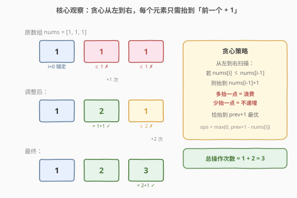
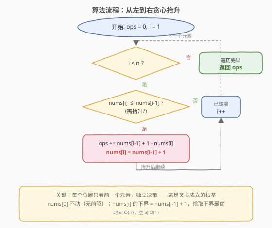

# 最少操作使数组递增

- **题目名称**：最少操作使数组递增
- **链接**：[1827. 最少操作使数组递增](https://leetcode.cn/problems/minimum-operations-to-make-the-array-increasing/)
- **难度**：简单
- **标签**：数组、贪心

## 1. 题目概述

给你一个整数数组 `nums`（**下标从 0 开始**）。每一次操作中，你可以选择数组中**一个**元素，并将它**增加 1**。请你返回使 `nums` **严格递增**的**最少**操作次数。

严格递增的定义：对于所有 $0 \le i < \text{nums.length} - 1$ 都有 $\text{nums}[i] < \text{nums}[i+1]$。长度为 1 的数组视为严格递增。

**示例 1**：

```text
输入：nums = [1,1,1]
输出：3
解释：
  1) 增加 nums[2]，数组变为 [1,1,2]
  2) 增加 nums[1]，数组变为 [1,2,2]
  3) 增加 nums[2]，数组变为 [1,2,3]
```

**示例 2**：

```text
输入：nums = [1,5,2,4,1]
输出：14
```

**示例 3**：

```text
输入：nums = [8]
输出：0
```

**约束条件**：

- $1 \le \text{nums.length} \le 5000$
- $1 \le \text{nums}[i] \le 10^4$

> 💡 **核心矛盾**：每个元素只能**加**不能减，要让全数组严格递增。直觉上，从左到右扫一遍——若当前元素不够大，就把它「恰好抬到前一个 + 1」，多抬一点浪费、少抬一点不递增。这种「每个位置独立取最小允许值」的局部最优恰好拼出全局最优，正是贪心的典型信号。

---

## 2. 解题思路

### 2.1 暴力思路

一个朴素的尝试是：对每个不满足 $\text{nums}[i] < \text{nums}[i+1]$ 的位置，逐次 +1 直到满足。但逐次模拟效率低（单位置可能需抬数千次），且需要想清楚「抬到多少才停」。

更直接的想法：既然只加不减，`nums[0]` 永远不用动（它没有前驱）。对 $i \ge 1$，$\text{nums}[i]$ 的**最小合法值**就是 $\text{nums}[i-1] + 1$。如果 $\text{nums}[i]$ 已经大于 $\text{nums}[i-1]$，无需操作；否则补到 $\text{nums}[i-1] + 1$ 即可。

### 2.2 核心观察：贪心——每个位置恰取下界



关键洞察分两层：

**第一层：局部下界。** 由于只能加不能减，$\text{nums}[0]$ 固定不变。对 $i \ge 1$，严格递增要求 $\text{nums}[i] \ge \text{nums}[i-1] + 1$。因此 $\text{nums}[i]$ 的最小合法值（下界）为：

$$\text{nums}[i] \ge \text{nums}[i-1] + 1$$

若当前值已满足，操作数为 0；否则需要补 $\text{nums}[i-1] + 1 - \text{nums}[i]$ 次。

**第二层：贪心最优性（交换论证）。** 为什么「恰抬到下界」是全局最优？因为抬高 $\text{nums}[i]$ 到超过 $\text{nums}[i-1] + 1$ 只会：

- **增加当前操作数**（多抬了）；
- **抬高后续元素的下界**（$\text{nums}[i+1]$ 的最小值变成更大的 $\text{nums}[i]+1$），可能迫使后续也多操作。

因此任何「抬过头」的策略都不会比「恰抬到下界」更优。每个位置取下界 $=$ 局部最优 $=$ 全局最优。

> 💡 **贪心成立的关键**：操作只能「加」不能「减」，且每个位置的决策**只依赖前一个位置**的最终值。从左到右逐位置取最小合法值，前一个一旦确定就不回头修改——这正是贪心「无后效性」的体现。

### 2.3 算法流程图



流程核心是一个从 $i = 1$ 到 $n-1$ 的循环：检查 $\text{nums}[i] \le \text{nums}[i-1]$ 是否成立。若是，计算操作数 $\text{nums}[i-1] + 1 - \text{nums}[i]$ 并累加，同时更新 $\text{nums}[i] = \text{nums}[i-1] + 1$；若否，跳过。循环结束返回总操作数。

### 2.4 示例演算

![示例演算：nums = [1, 5, 2, 4, 1]](../images/1827_example_walkthrough.svg)

以 `nums = [1, 5, 2, 4, 1]` 为例：

| $i$ | 比较 | 本轮操作 | 累计操作 | 调整后数组 |
|-----|------|----------|----------|------------|
| 0 | —（锚定） | 0 | 0 | [1, 5, 2, 4, 1] |
| 1 | $5 > 1$ ✓ | 0 | 0 | [1, 5, 2, 4, 1] |
| 2 | $2 \le 5$ ✗ | $5+1-2 = 4$ | 4 | [1, 5, **6**, 4, 1] |
| 3 | $4 \le 6$ ✗ | $6+1-4 = 3$ | 7 | [1, 5, 6, **7**, 1] |
| 4 | $1 \le 7$ ✗ | $7+1-1 = 7$ | 14 | [1, 5, 6, 7, **8**] |

总操作次数 $= 0 + 0 + 4 + 3 + 7 = 14$ ✓

> 💡 注意 $i = 1$ 时 $5 > 1$ 已满足递增，跳过；但 $i = 2$ 时比较的不再是原数组中的 $5$，而是**可能已被更新过的** $\text{nums}[1]$。本题中 $\text{nums}[1]$ 未被改动（仍为 5），但若前面有抬升，后续比较基于更新后的值——这正是「从左到右传递」的体现。

---

## 3. 参考代码

### C++

```cpp
class Solution {
  public:
    int minOperations(vector<int>& nums) {
        int ops = 0;
        for (int i = 1; i < (int)nums.size(); i++) {
            if (nums[i] <= nums[i - 1]) {
                ops += nums[i - 1] + 1 - nums[i];
                nums[i] = nums[i - 1] + 1;
            }
        }
        return ops;
    }
};
```

### Python

```python
class Solution:
    def minOperations(self, nums: List[int]) -> int:
        ops = 0
        for i in range(1, len(nums)):
            if nums[i] <= nums[i - 1]:
                ops += nums[i - 1] + 1 - nums[i]
                nums[i] = nums[i - 1] + 1
        return ops
```

### Python（不修改原数组，额外变量记前驱值）

```python
class Solution:
    def minOperations(self, nums: List[int]) -> int:
        ops = 0
        prev = nums[0]
        for i in range(1, len(nums)):
            if nums[i] <= prev:
                ops += prev + 1 - nums[i]
                prev = prev + 1
            else:
                prev = nums[i]
        return ops
```

> 💡 **两种写法对比**：第一种直接在 `nums` 上原地更新，简洁直观；第二种用 `prev` 变量记录前驱最终值，不修改输入数组。面试中若强调「不破坏输入」可用第二种，但逻辑等价。注意 `nums[i] <= nums[i-1]` 的判断用的是**更新后**的 `nums[i-1]`（或 `prev`），保证传递性。

> ⚠️ **溢出说明**：$n \le 5000$，$\text{nums}[i] \le 10^4$，最坏情况下每个元素都需抬升，累计操作数上界约 $5000 \times 5000 \approx 2.5 \times 10^7$，远在 `int` 范围内（$\approx 2.1 \times 10^9$），无需 `long long`。

---

## 4. 复杂度分析

| 维度 | 复杂度 | 说明 |
|------|--------|------|
| 时间复杂度 | $O(n)$ | 一次线性扫描，每个位置 $O(1)$ 判断与更新 |
| 空间复杂度 | $O(1)$ | 原地修改仅用 `ops` 累加器；若不修改输入则多用一个 `prev` 变量，仍为 $O(1)$ |

> 💡 本题的精妙在于把「最少操作」这个看似需要全局规划的问题，降维成「逐位置取下界」的局部贪心。关键观察是：操作只能加不能减 + 每个位置只依赖前驱，使得贪心无后效性，一遍扫描即得最优解。

---

## 5. 扩展：贪心正确性证明

### 5.1 形式化论证

设最优解将 `nums` 变为严格递增数组 `nums'`，总操作数为 $\sum_i (\text{nums}'[i] - \text{nums}[i])$（其中 $\text{nums}'[i] \ge \text{nums}[i]$，因为只能加）。

**贪心解** $\text{nums}^*[i]$ 满足：

$$\text{nums}^*[i] = \max(\text{nums}[i],\ \text{nums}^*[i-1] + 1)$$

即「取原值与前驱加一的较大者」。

** Claim**：对任意 $i$，$\text{nums}^*[i] \le \text{nums}'[i]$。

**归纳证明**：

- **基底**（$i = 0$）：$\text{nums}'[0] \ge \text{nums}[0] = \text{nums}^*[0]$，且 $\text{nums}^*[0]$ 取最小值 $\text{nums}[0]$。
- **归纳**（$i \ge 1$）：由严格递增 $\text{nums}'[i] \ge \text{nums}'[i-1] + 1 \ge \text{nums}^*[i-1] + 1$（归纳假设）。又 $\text{nums}'[i] \ge \text{nums}[i]$。故 $\text{nums}'[i] \ge \max(\text{nums}[i],\ \text{nums}^*[i-1] + 1) = \text{nums}^*[i]$。

因此 $\text{nums}^*[i] \le \text{nums}'[i]$ 对所有 $i$ 成立，即贪心解的每个元素都 $\le$ 最优解的对应元素，故 $\sum (\text{nums}^*[i] - \text{nums}[i]) \le \sum (\text{nums}'[i] - \text{nums}[i])$。而贪心解本身合法（严格递增），故它就是最优解。$\blacksquare$

### 5.2 如果操作可以「加减任意值」？

若放宽为「每次操作可将元素变为任意值」，则问题退化为「使数组严格递增的最小修改次数」——这等价于求**最长严格递增子序列（LIS）**，答案为 $n - \text{LIS}$。但本题限定只能 +1，无法降低元素，故 LIS 思路不适用，贪心「逐位置抬到下界」才是正解。

---

## 6. 面试要点

**Q1：为什么贪心是正确的？**

> 操作只能加不能减，且每个位置的最终值只依赖前驱。从左到右逐位置取下界 $\text{nums}[i] = \max(\text{nums}[i],\ \text{nums}[i-1]+1)$，可归纳证明贪心解的每个元素 $\le$ 任意合法解的对应元素，故总操作数最小。

**Q2：为什么不能只比较原始数组中相邻元素？**

> 因为前驱可能被抬升过。例如 `nums = [1, 1, 1]`，$i = 2$ 时比较的不是原 $\text{nums}[1] = 1$，而是更新后的 $\text{nums}[1] = 2$。必须用更新后的前驱值（原地修改或 `prev` 变量），否则会漏算操作数。

**Q3：如果操作可以加减任意值，解法会变吗？**

> 会。若可任意修改，问题等价于求最长严格递增子序列（LIS），答案为 $n - \text{LIS}$。但本题限定只能 +1，元素无法降低，LIS 思路不适用。

**Q4：时间 / 空间复杂度各是多少？**

> 时间 $O(n)$——一次线性扫描，每个位置 $O(1)$。空间 $O(1)$——原地修改仅一个累加器，或用 `prev` 变量不修改输入。

**Q5：累计操作数会溢出吗？**

> 不会。$n \le 5000$，$\text{nums}[i] \le 10^4$，最坏情况累计约 $2.5 \times 10^7$，远在 `int` 范围内。若 $n$ 与 $\text{nums}[i]$ 更大则需 `long long`。

---

## 7. 同类练习题

- [1800. 最大升序子数组和](https://leetcode.cn/problems/maximum-ascending-subarray-sum/)（[站内题解](../1701-1800/1800_最大升序子数组和.md)）：同为「数组一次遍历 + 升序判定」的简单题，对照「扫描升序段求和」与「扫描抬升使递增」两种遍历应用
- [300. 最长递增子序列](https://leetcode.cn/problems/longest-increasing-subsequence/)（[站内题解](../0201-0300/300_最长递增子序列.md)）：严格递增主题的经典题；若本题操作可任意加减，则退化为 $n - \text{LIS}$，对照理解「只能加」的约束如何改变问题结构
- [334. 递增的三元子序列](https://leetcode.cn/problems/increasing-triplet-subsequence/)（[站内题解](../0301-0400/334_递增的三元子序列.md)）：贪心维护双阈值判定 LIS≥3，与本题「逐位置取下界」同属贪心处理递增关系
- [435. 无重叠区间](https://leetcode.cn/problems/non-overlapping-intervals/)（[站内题解](../0401-0500/435_无重叠区间.md)）：贪心区间调度，按右端点排序后逐区间决策；对照「区间贪心」与「数组贪心」两种贪心范式
- [45. 跳跃游戏 II](https://leetcode.cn/problems/jump-game-ii/)（[站内题解](../0001-0100/45_跳跃游戏II.md)）：贪心维护当前可达范围，同为「一次遍历 + 局部最优拼全局最优」的贪心招牌题
