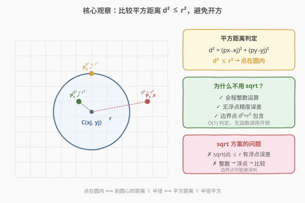
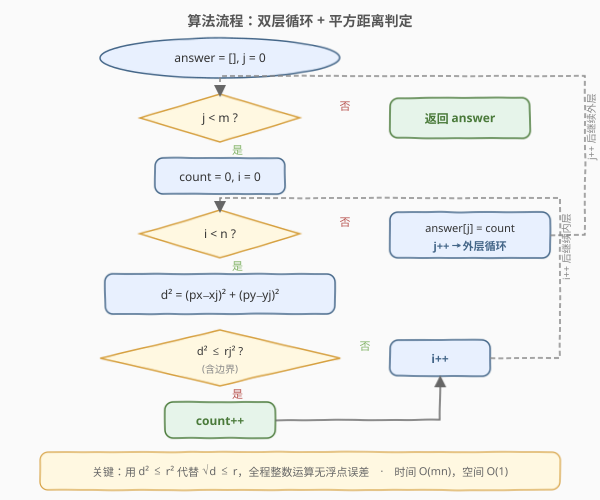

# LeetCode 统计一个圆中点的数目 题解

## 1. 题目概述

- **标题 / 题号**：统计一个圆中点的数目（#1828，medium）
- **链接**：https://leetcode.cn/problems/queries-on-number-of-points-inside-a-circle/
- **难度**：中等
- **标签**：数组、数学、几何

**题意**：给你一个数组 `points`，其中 `points[i] = [xi, yi]`，表示第 `i` 个点在二维平面上的坐标。多个点可能会有**相同**的坐标。

同时给你一个数组 `queries`，其中 `queries[j] = [xj, yj, rj]`，表示一个圆心在 `(xj, yj)` 且半径为 `rj` 的圆。

对于每一个查询 `queries[j]`，计算在第 `j` 个圆**内**点的数目。如果一个点在圆的**边界上**，同样认为它在圆**内**。

返回一个数组 `answer`，其中 `answer[j]` 是第 `j` 个查询的答案。

**示例 1**：

```text
输入：points = [[1,3],[3,3],[5,3],[2,2]], queries = [[2,3,1],[4,3,1],[1,1,2]]
输出：[3,2,2]
解释：
  queries[0] 圆心 (2,3) r=1  → 点 [1,3],[3,3],[2,2] 在内，共 3 个
  queries[1] 圆心 (4,3) r=1  → 点 [3,3],[5,3] 在内，共 2 个
  queries[2] 圆心 (1,1) r=2  → 点 [1,3],[2,2] 在内，共 2 个
```

**示例 2**：

```text
输入：points = [[1,1],[2,2],[3,3],[4,4],[5,5]], queries = [[1,2,2],[2,2,2],[4,3,2],[4,3,3]]
输出：[2,3,2,4]
```

**约束**：

- $1 \le \text{points.length} \le 500$
- $\text{points}[i].\text{length} = 2$
- $0 \le x_i, y_i \le 500$
- $1 \le \text{queries.length} \le 500$
- $\text{queries}[j].\text{length} = 3$
- $0 \le x_j, y_j \le 500$
- $1 \le r_j \le 500$
- 所有坐标均为整数

> 💡 **核心矛盾**：对每个查询圆，快速判定哪些点落在圆内。点在圆内的充要条件是「到圆心的距离 ≤ 半径」。直觉上，对每个查询遍历所有点逐一判定即可——$m$ 个查询 × $n$ 个点 = $O(mn)$，约束下最多 $500 \times 500 = 2.5 \times 10^5$ 次判定，完全可行。关键在于判定时**用平方距离代替开方**，避免浮点误差。

## 2. 解题思路

### 2.1 暴力思路

对每个查询 `queries[j] = [xj, yj, rj]`，遍历所有点 `points[i] = [px, py]`，计算欧几里得距离 $d = \sqrt{(px - x_j)^2 + (py - y_j)^2}$，若 $d \le r_j$ 则计数加一。

这个思路正确，但有一个隐患：`sqrt` 将整数运算转为浮点运算，可能产生精度问题。例如当 $d^2$ 恰好等于 $r^2$ 时（点在边界上），`sqrt` 的结果可能因浮点误差变为略大于 $r$，导致边界点被误判为圆外。虽然本题坐标范围小、测试数据可能不触发此问题，但在工程实践中应避免不必要的浮点运算。

### 2.2 核心观察：比较平方距离，避免开方



关键洞察：**判定 $d \le r$ 等价于判定 $d^2 \le r^2$**（因为 $d, r \ge 0$，平方函数在非负区间单调递增）。而 $d^2$ 可以直接用整数计算：

$$d^2 = (px - x_j)^2 + (py - y_j)^2$$

$$r^2 = r_j^2$$

两者都是整数，直接比较 $d^2 \le r^2$ 即可，**全程无需 `sqrt`**。

> 💡 **为什么不用 sqrt？** 平方距离判定有三重优势：
> - **整数运算**：$(px - x_j)^2 + (py - y_j)^2$ 和 $r_j^2$ 都是整数，比较无精度损失
> - **边界安全**：$d^2 = r^2$ 时精确命中，不会因浮点误差误判
> - **性能更优**：省去 `sqrt` 函数调用，每次判定仅需两次减法、两次乘法、一次加法、一次比较

### 2.3 算法流程图



流程是一个标准的双层循环：
- **外层循环**遍历每个查询 `queries[j]`
- 对每个查询，初始化 `count = 0`，**内层循环**遍历所有点 `points[i]`
- 对每个点，计算 $d^2 = (px - x_j)^2 + (py - y_j)^2$，若 $d^2 \le r_j^2$ 则 `count++`
- 内层循环结束后，`answer[j] = count`

### 2.4 示例演算

![示例演算：points = [[1,3],[3,3],[5,3],[2,2]]](../images/1828_example_walkthrough.svg)

以示例 1 为例，`points = [[1,3],[3,3],[5,3],[2,2]]`，`queries = [[2,3,1],[4,3,1],[1,1,2]]`：

**查询 0**：`[2, 3, 1]`，$r^2 = 1$

| 点 | $d^2 = (px-2)^2 + (py-3)^2$ | $\le 1$? | 结果 |
|----|------------------------------|----------|------|
| [1,3] | $1 + 0 = 1$ | $\le 1$ ✓ | 在内 |
| [3,3] | $1 + 0 = 1$ | $\le 1$ ✓ | 在内 |
| [5,3] | $9 + 0 = 9$ | $> 1$ ✗ | 在外 |
| [2,2] | $0 + 1 = 1$ | $\le 1$ ✓ | 在内 |

`count = 3`

**查询 1**：`[4, 3, 1]`，$r^2 = 1$

| 点 | $d^2 = (px-4)^2 + (py-3)^2$ | $\le 1$? | 结果 |
|----|------------------------------|----------|------|
| [1,3] | $9 + 0 = 9$ | $> 1$ ✗ | 在外 |
| [3,3] | $1 + 0 = 1$ | $\le 1$ ✓ | 在内 |
| [5,3] | $1 + 0 = 1$ | $\le 1$ ✓ | 在内 |
| [2,2] | $4 + 1 = 5$ | $> 1$ ✗ | 在外 |

`count = 2`

**查询 2**：`[1, 1, 2]`，$r^2 = 4$

| 点 | $d^2 = (px-1)^2 + (py-1)^2$ | $\le 4$? | 结果 |
|----|------------------------------|----------|------|
| [1,3] | $0 + 4 = 4$ | $\le 4$ ✓ | 在内（边界） |
| [3,3] | $4 + 4 = 8$ | $> 4$ ✗ | 在外 |
| [5,3] | $16 + 4 = 20$ | $> 4$ ✗ | 在外 |
| [2,2] | $1 + 1 = 2$ | $\le 4$ ✓ | 在内 |

`count = 2`

> 💡 注意查询 2 中点 `[1,3]`：$d^2 = 0 + 4 = 4 = r^2$，恰好在边界上。用平方距离判定精确命中 $4 \le 4$ ✓，而若用 `sqrt(4) = 2.0 \le 2` 在本例中恰好不出错——但这不保证在所有情况下 `sqrt` 都精确。平方距离判定从根源上消除了此风险。

最终结果：`answer = [3, 2, 2]` ✓

## 3. 参考代码

### C++

```cpp
class Solution {
  public:
    vector<int> countPoints(vector<vector<int>>& points,
                            vector<vector<int>>& queries) {
        int m = queries.size();
        vector<int> answer(m, 0);
        for (int j = 0; j < m; j++) {
            int xj = queries[j][0], yj = queries[j][1], rj = queries[j][2];
            int r2 = rj * rj;
            int count = 0;
            for (auto& p : points) {
                int dx = p[0] - xj;
                int dy = p[1] - yj;
                if (dx * dx + dy * dy <= r2) {
                    count++;
                }
            }
            answer[j] = count;
        }
        return answer;
    }
};
```

### Python

```python
class Solution:
    def countPoints(self, points: List[List[int]], queries: List[List[int]]) -> List[int]:
        answer = []
        for xj, yj, rj in queries:
            r2 = rj * rj
            count = 0
            for px, py in points:
                dx = px - xj
                dy = py - yj
                if dx * dx + dy * dy <= r2:
                    count += 1
            answer.append(count)
        return answer
```

### Python（列表推导式简洁版）

```python
class Solution:
    def countPoints(self, points: List[List[int]], queries: List[List[int]]) -> List[int]:
        return [
            sum((px - xj) ** 2 + (py - yj) ** 2 <= rj * rj for px, py in points)
            for xj, yj, rj in queries
        ]
```

> 💡 **三种写法对比**：第一种 C++ 风格逐变量展开，可读性最佳；第二种 Python 显式循环，逻辑清晰；第三种列表推导式一行搞定，Pythonic 但可读性稍降。三者逻辑完全等价，面试中推荐第二种——既清晰又不啰嗦。

> ⚠️ **溢出说明**：坐标范围 $[0, 500]$，$dx, dy \in [-500, 500]$，$dx^2 + dy^2 \le 500^2 + 500^2 = 500000$，$r_j^2 \le 500^2 = 250000$。所有中间值远在 `int` 范围内（$\approx 2.1 \times 10^9$），无需 `long long`。

## 4. 复杂度分析

| 维度 | 复杂度 | 说明 |
|------|--------|------|
| 时间复杂度 | $O(mn)$ | $m$ 个查询，每个查询遍历 $n$ 个点，每次判定 $O(1)$；约束下最多 $500 \times 500 = 2.5 \times 10^5$ 次 |
| 空间复杂度 | $O(m)$ | 仅需存储 `answer` 数组（$m$ 个元素），不含输出则为 $O(1)$ |

> 💡 本题的精妙不在于算法复杂度——$O(mn)$ 的暴力本身就是最优解。关键在于**实现细节**：用平方距离代替开方，将浮点判定转为整数判定，从根源上消除精度问题。这是「几何题用整数运算」的经典范式。

## 5. 扩展：数据规模更大时的优化

本题 $m, n \le 500$，$O(mn)$ 完全够用。若数据规模增大（如 $n = 10^5$），可考虑以下优化：

### 5.1 按 x 坐标排序 + 二分剪枝

将点按 $x$ 坐标排序。对每个查询 `(xj, yj, rj)`，只有 $x \in [x_j - r_j, x_j + r_j]$ 的点可能在圆内。用二分找到该 x 范围内的点，再逐一判定 y 方向。当圆较小时，内层循环大幅缩减。

- 预处理排序：$O(n \log n)$
- 每次查询：$O(\log n + k)$，其中 $k$ 为 x 范围内的点数
- 总时间：$O(n \log n + m \log n + \sum k_j)$

### 5.2 网格分桶

由于坐标范围有限（$[0, 500]$），可将平面划分为 $\lceil 501 / B \rceil \times \lceil 501 / B \rceil$ 个网格桶（$B$ 为桶大小），每个桶存落在其中的点。查询时只遍历与圆相交的桶。

- 预处理：$O(n)$
- 每次查询：$O(\text{圆面积} / B^2 \times \text{平均桶内点数})$

这两种优化在 $n$ 远大于 $m$ 时收益显著，但增加了实现复杂度。本题规模下暴力即可，过早优化反而降低代码可维护性。

## 6. 面试要点

**Q1：为什么用平方距离而不是直接算距离？**

> 因为 $d \le r \iff d^2 \le r^2$（$d, r \ge 0$ 时单调递增）。用平方距离全程整数运算，避免 `sqrt` 的浮点精度误差，尤其保证边界点（$d^2 = r^2$）不被误判。同时省去函数调用，性能更优。

**Q2：点在圆边界上怎么处理？**

> 题目明确「边界上的点也算在圆内」。用 $d^2 \le r^2$（含等号）即可，边界点 $d^2 = r^2$ 精确命中，无需特殊处理。

**Q3：时间 / 空间复杂度各是多少？**

> 时间 $O(mn)$——$m$ 个查询 × $n$ 个点，每次 $O(1)$ 判定。空间 $O(m)$——仅存 `answer` 数组（不计输出则 $O(1)$）。

**Q4：如果 $n$ 很大（如 $10^5$），怎么优化？**

> 将点按 $x$ 坐标排序，每次查询用二分定位 $x \in [x_j - r_j, x_j + r_j]$ 范围内的点，只对这些点判定 y 方向。预处理 $O(n \log n)$，每次查询 $O(\log n + k)$。也可用网格分桶，按空间局部性减少候选点。

**Q5：坐标和半径都是整数，$d^2$ 会溢出吗？**

> 不会。坐标 $\le 500$，$dx, dy \in [-500, 500]$，$d^2 \le 500^2 + 500^2 = 5 \times 10^5$，远在 `int` 范围内。若坐标范围达 $10^9$ 则需 `long long`。

## 同类练习题

| # | 题目 | 与本题的关联 |
|---|------|-------------|
| 1822 | [数组元素积的符号](https://leetcode.cn/problems/sign-of-the-product-of-an-array/)（[站内题解](../1801-1900/1822_数组元素积的符号.md)） | 同为「避免不必要运算」的思路——本题避免开方，1822 避免实际乘法只看符号，对照「简化判定」的工程思维 |
| 149 | [直线上最多的点数](https://leetcode.cn/problems/max-points-on-a-line/)（[站内题解](../0101-0200/149_直线上最多的点数.md)） | 几何题用整数运算的经典范式——用 GCD 化简分数表示斜率避免浮点误差，与本题「平方距离代替开方」同属「整数几何」思想 |
| 223 | [矩形面积](https://leetcode.cn/problems/rectangle-area/) | 几何计算题，同样需要仔细处理边界条件和整数运算，对照不同几何场景下的判定技巧 |
| 1497 | [检查数组对是否可以被 k 整除](https://leetcode.cn/problems/check-if-array-pairs-are-divisible-by-k/) | 数学判定题，用同余代替除法避免精度问题，与本题「用等价整数运算替代浮点运算」思路一致 |
| 1401 | [圆和矩形是否有重叠](https://leetcode.cn/problems/circle-and-rectangle-overlapping/) | 圆与矩形重叠判定，同样需要平方距离判定 + 边界 clamp 技巧，是本题「点在圆内」判定的进阶版 |
