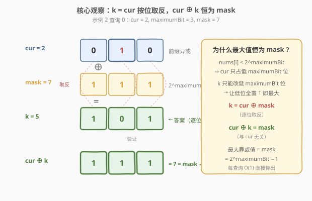
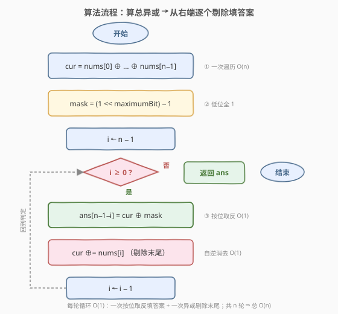
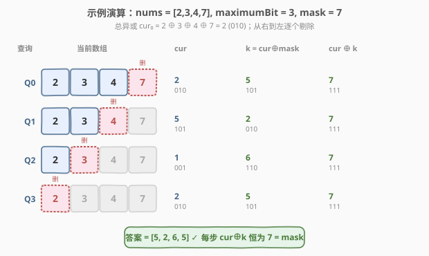

# LeetCode 每个查询的最大异或值 题解

## 1. 题目概述

- **标题 / 题号**：每个查询的最大异或值（#1829，medium）
- **链接**：https://leetcode.cn/problems/maximum-xor-for-each-query/
- **难度**：中等
- **标签**：位运算、数组、前缀异或

**题意**：给你一个**有序**数组 `nums`，它由 $n$ 个非负整数组成，同时给你一个整数 $\text{maximumBit}$。你需要执行以下查询 $n$ 次：

1. 找到一个非负整数 $k < 2^{\text{maximumBit}}$，使得 $\text{nums}[0] \oplus \text{nums}[1] \oplus \dots \oplus \text{nums}[\text{nums.length}-1] \oplus k$ 的结果**最大化**。$k$ 即第 $i$ 个查询的答案。
2. 从当前数组 `nums` 删除**最后**一个元素。

返回数组 `answer`，其中 `answer[i]` 是第 $i$ 个查询的结果。

**示例 1**：

```text
输入：nums = [0,1,1,3], maximumBit = 2
输出：[0,3,2,3]
解释：
  第 1 个查询：nums = [0,1,1,3]，k = 0，因为 0 XOR 1 XOR 1 XOR 3 XOR 0 = 3
  第 2 个查询：nums = [0,1,1]，  k = 3，因为 0 XOR 1 XOR 1 XOR 3 = 3
  第 3 个查询：nums = [0,1]，    k = 2，因为 0 XOR 1 XOR 2 = 3
  第 4 个查询：nums = [0]，      k = 3，因为 0 XOR 3 = 3
```

**示例 2**：

```text
输入：nums = [2,3,4,7], maximumBit = 3
输出：[5,2,6,5]
解释：
  第 1 个查询：nums = [2,3,4,7]，k = 5，因为 2 XOR 3 XOR 4 XOR 7 XOR 5 = 7
  第 2 个查询：nums = [2,3,4]，  k = 2，因为 2 XOR 3 XOR 4 XOR 2 = 7
  第 3 个查询：nums = [2,3]，    k = 6，因为 2 XOR 3 XOR 6 = 7
  第 4 个查询：nums = [2]，      k = 5，因为 2 XOR 5 = 7
```

**示例 3**：

```text
输入：nums = [0,1,2,2,5,7], maximumBit = 3
输出：[4,3,6,4,6,7]
```

**约束**：

- $\text{nums.length} = n$
- $1 \le n \le 10^5$
- $1 \le \text{maximumBit} \le 20$
- $0 \le \text{nums}[i] < 2^{\text{maximumBit}}$
- `nums` 中的数字已经按**升序**排好序

> 💡 **关键约束**：$\text{nums}[i] < 2^{\text{maximumBit}}$ 是本题的「题眼」——它保证任意时刻前缀异或值也 $< 2^{\text{maximumBit}}$，于是最优 $k$ 恰好是「按位取反」可直接写出，无需 Trie。而「有序」其实是个**烟雾弹**：异或满足交换律与结合律，元素顺序不影响前缀异或值，排序属性对解法毫无作用。

## 2. 解题思路

### 2.1 暴力思路：每个查询重算前缀异或 + 枚举 k

对每个查询：

1. 从头异或到当前数组末尾，得到当前前缀异或值 $\text{cur}$，单次 $O(n)$；
2. 枚举 $k \in [0, 2^{\text{maximumBit}})$，逐一计算 $\text{cur} \oplus k$ 取最大，单次 $O(2^{\text{maximumBit}})$。

总复杂度 $O\!\left(n \cdot (n + 2^{\text{maximumBit}})\right)$。当 $n = 10^5$、$\text{maximumBit} = 20$ 时高达 $10^{10}$ 量级，严重超时。

> ⚠️ **两处浪费**：① 每次查询都从头算前缀异或，忽略了「相邻查询只差末尾一个元素」的增量关系；② 枚举 $k$ 完全没有利用「异或值与 $k$ 的位结构」——最大值其实可以直接算出。下面分别击破。

### 2.2 核心观察：最优 k = 前缀异或按位取反



设当前前缀异或值为 $\text{cur} = \text{nums}[0] \oplus \dots \oplus \text{nums}[\text{末}]$。我们要选 $k < 2^{\text{maximumBit}}$ 最大化 $\text{cur} \oplus k$。

**第一层：高位固定，低位可全置 1。**

由于 $\text{nums}[i] < 2^{\text{maximumBit}}$，它们的异或 $\text{cur}$ 也 $< 2^{\text{maximumBit}}$（只有低 $\text{maximumBit}$ 位可能为 1）。而 $k < 2^{\text{maximumBit}}$ 同样只有低 $\text{maximumBit}$ 位。于是 $\text{cur} \oplus k$ 的**高位（$\ge \text{maximumBit}$ 位）恒为 0**，只有低 $\text{maximumBit}$ 位可变。

要最大化 $\text{cur} \oplus k$，只需让它的低 $\text{maximumBit}$ 位**全为 1**——即每位上 $k_b = 1 - \text{cur}_b$。这正是「按位取反」。

**第二层：k = cur XOR mask，结果恒为 mask。**

定义 $\text{mask} = 2^{\text{maximumBit}} - 1$（低 $\text{maximumBit}$ 位全 1）。取：

$$\boxed{k = \text{cur} \oplus \text{mask}}$$

则：

$$\text{cur} \oplus k = \text{cur} \oplus (\text{cur} \oplus \text{mask}) = \text{mask} = 2^{\text{maximumBit}} - 1$$

即**无论 $\text{cur}$ 是多少，最大异或值恒为 $\text{mask}$**。同时由于 $\text{cur} < 2^{\text{maximumBit}}$ 且 $\text{mask} < 2^{\text{maximumBit}}$，二者异或结果也 $< 2^{\text{maximumBit}}$，故 $k < 2^{\text{maximumBit}}$ 合法。

> 💡 **直觉记忆**：异或是「不进位加法」。要让 $\text{cur} \oplus k$ 每位都变 1，$k$ 就得在 $\text{cur}$ 为 1 的位上填 0、为 0 的位上填 1——也就是把 $\text{cur}$ 在 $\text{maximumBit}$ 位内「翻个面」。示例 2 的第 1 个查询：$\text{cur} = 2 = \texttt{010}$，$k = \texttt{101} = 5$，$\text{cur} \oplus k = \texttt{111} = 7 = \text{mask}$。

> ⚠️ **为什么 $\text{nums}[i] < 2^{\text{maximumBit}}$ 不可少？** 若允许 $\text{nums}[i] \ge 2^{\text{maximumBit}}$，则 $\text{cur}$ 可能有高位为 1，而 $k$ 的高位强制为 0（因 $k < 2^{\text{maximumBit}}$），这些高位「翻不掉」，最大值就不再是 $\text{mask}$，$k = \text{cur} \oplus \text{mask}$ 也可能越界。本题靠这条约束把问题简化为纯位运算。

### 2.3 算法流程图



**步骤**：

1. **算总异或**：$\text{cur} \leftarrow \text{nums}[0] \oplus \dots \oplus \text{nums}[n-1]$（一次遍历）。
2. **算掩码**：$\text{mask} \leftarrow 2^{\text{maximumBit}} - 1$。
3. **从右到左剔除**：令 $i$ 从 $n-1$ 递减到 $0$：
   - 第 $(n-1-i)$ 个查询的答案 $= \text{cur} \oplus \text{mask}$；
   - 执行 $\text{cur} \leftarrow \text{cur} \oplus \text{nums}[i]$（把末尾元素 $\text{nums}[i]$ 从异或中「拿掉」，为下一查询准备）。
4. **返回**答案数组。

> 💡 **为什么从右到左？** 查询 $0$ 用全部 $n$ 个元素，查询 $1$ 用前 $n-1$ 个（删末尾），查询 $i$ 用前 $n-i$ 个。相邻查询只差末尾一个元素，而异或有自逆性 $a \oplus a = 0$——把要删的元素再异或一次就「抵消」掉了。于是维护一个游标 $\text{cur}$，从「全量异或」出发，每步异或掉末尾元素即得下一查询的前缀异或，无需重算。这正是 [1310. 子数组异或查询](../1301-1400/1310_子数组异或查询.md) 中「前缀异或 + 自逆消去」思想的在线版变体。

### 2.4 示例演算

以示例 2 `nums = [2,3,4,7]`、$\text{maximumBit} = 3$ 为例（$\text{mask} = 7 = \texttt{111}$）：



先算总异或：$\text{cur} = 2 \oplus 3 \oplus 4 \oplus 7 = 2 = \texttt{010}$。

| 查询 | 当前数组 | $\text{cur}$（二进制） | $k = \text{cur} \oplus \text{mask}$ | $\text{cur} \oplus k$ | 删除元素 | 删除后 $\text{cur}$ |
|------|----------|------------------------|--------------------------------------|------------------------|----------|----------------------|
| 0 | [2,3,4,7] | $2 = \texttt{010}$ | $2 \oplus 7 = 5 = \texttt{101}$ | $\texttt{111} = 7$ | 7 | $2 \oplus 7 = 5$ |
| 1 | [2,3,4]   | $5 = \texttt{101}$ | $5 \oplus 7 = 2 = \texttt{010}$ | $\texttt{111} = 7$ | 4 | $5 \oplus 4 = 1$ |
| 2 | [2,3]     | $1 = \texttt{001}$ | $1 \oplus 7 = 6 = \texttt{110}$ | $\texttt{111} = 7$ | 3 | $1 \oplus 3 = 2$ |
| 3 | [2]       | $2 = \texttt{010}$ | $2 \oplus 7 = 5 = \texttt{101}$ | $\texttt{111} = 7$ | 2 | $2 \oplus 2 = 0$ |

**最终答案**：$[5, 2, 6, 5]$ ✓

> 💡 **看「按位取反」的规律**：每一行 $k$ 的二进制恰好是 $\text{cur}$ 的逐位翻转（$\texttt{010} \to \texttt{101}$、$\texttt{101} \to \texttt{010}$、$\texttt{001} \to \texttt{110}$、$\texttt{010} \to \texttt{101}$），而 $\text{cur} \oplus k$ 恒为 $\texttt{111} = 7 = \text{mask}$。这印证了 2.2 的结论：最大异或值与 $\text{cur}$ 无关，永远是 $\text{mask}$。

## 3. 参考代码

### C++

```cpp
class Solution {
public:
    vector<int> getMaximumXor(vector<int>& nums, int maximumBit) {
        int n = nums.size();
        int mask = (1 << maximumBit) - 1;
        int cur = 0;
        for (int x : nums) cur ^= x;
        vector<int> ans(n);
        for (int i = n - 1; i >= 0; i--) {
            ans[n - 1 - i] = cur ^ mask;
            cur ^= nums[i];
        }
        return ans;
    }
};
```

### Python

```python
class Solution:
    def getMaximumXor(self, nums: List[int], maximumBit: int) -> List[int]:
        mask = (1 << maximumBit) - 1
        cur = 0
        for x in nums:
            cur ^= x
        ans = []
        for i in range(len(nums) - 1, -1, -1):
            ans.append(cur ^ mask)
            cur ^= nums[i]
        return ans
```

### Python（前缀异或正向填写 + 反转）

```python
class Solution:
    def getMaximumXor(self, nums: List[int], maximumBit: int) -> List[int]:
        mask = (1 << maximumBit) - 1
        prefix = 0
        ans = []
        for x in nums:
            prefix ^= x          # prefix = nums[0] ^ ... ^ nums[i]
            ans.append(prefix ^ mask)
        ans.reverse()            # 反转：最后一段（全量）对应查询 0
        return ans
```

> 💡 **两种写法对比**：第一种从右端「做减法」——维护全量异或，逐个剔除末尾元素，答案天然按查询顺序产出，无需反转。第二种从左端「做加法」——边累加前缀异或边填答案，但填出的是逆序（最后一步才覆盖全量，对应查询 0），故末尾 `reverse`。二者都只额外用 $O(1)$ 变量（不计输出数组），逻辑等价；第一种更贴合「查询从全量开始逐个删尾」的题意叙述。

> ⚠️ **溢出 / 类型说明**：$\text{maximumBit} \le 20$，$\text{mask} = 2^{20} - 1 \approx 10^6$，$\text{nums}[i] < 2^{20}$，前缀异或也 $< 2^{20}$，均在 `int`（$\approx 2.1 \times 10^9$）范围内，C++ 无需 `long long`。Python 整数任意精度，无溢出问题。

## 4. 复杂度分析

| 维度 | 复杂度 | 说明 |
|------|--------|------|
| 时间复杂度 | $O(n)$ | 一次正向遍历算总异或 $O(n)$ + 一次从右到左遍历填答案 $O(n)$，每个元素仅参与常数次异或 |
| 空间复杂度 | $O(1)$ | 仅用 `cur`、`mask` 等常数变量；返回的 `ans` 数组不计入额外空间（题目要求返回） |

> 💡 **与暴力的对比**：暴力 $O\!\left(n^2 + n \cdot 2^{\text{maximumBit}}\right)$ 在 $n = 10^5$、$\text{maximumBit} = 20$ 时约 $10^{10}$；本解法 $O(n) \approx 10^5$，快约 $10^5$ 倍。两处增益：① 用「游标异或剔除」把每查询的前缀异或从 $O(n)$ 降为 $O(1)$；② 用「按位取反」把枚举 $k$ 从 $O(2^{\text{maximumBit}})$ 降为 $O(1)$。

## 5. 扩展：前缀异或视角与「有序」烟雾弹

### 5.1 前缀异或的统一视角

定义前缀异或 $\text{prefix}[i] = \text{nums}[0] \oplus \dots \oplus \text{nums}[i-1]$（$\text{prefix}[0] = 0$ 为异或单位元）。则查询 $i$（用前 $n-i$ 个元素）的前缀异或为 $\text{prefix}[n-i]$，答案为：

$$\text{ans}[i] = \text{prefix}[n-i] \oplus \text{mask}$$

这与 [1310. 子数组异或查询](../1301-1400/1310_子数组异或查询.md) 的 $\text{XOR}(L, R) = \text{prefix}[R+1] \oplus \text{prefix}[L]$ 同源——都依赖异或的**自逆性**（$a \oplus a = 0$）做「消去公共前缀」。区别在于：1310 查任意区间 $[L, R]$ 用两个前缀异或消去；本题查询区间恒为 $[0, n-i-1]$（恒从下标 0 起），所以只需一个前缀异或 $\text{prefix}[n-i]$，再异或 $\text{mask}$ 取最优 $k$。

### 5.2 「有序」为什么是烟雾弹？

题目强调 `nums` 升序，但异或满足**交换律**与**结合律**：

$$a \oplus b = b \oplus a, \quad (a \oplus b) \oplus c = a \oplus (b \oplus c)$$

故「全体异或」与元素顺序无关——无论 `nums` 是否排序，前缀异或值都一样，解法完全不依赖有序性。题目加这条约束可能是为了：① 让「删除末尾元素」对应删除当前最大值，制造一些误导；② 与某些需要排序的异或题（如 [1707. 与数组中元素的最大异或值](../1701-1800/1707_与数组中元素的最大异或值.md) 需按 $m$ 排序）形成对照。面试时若被问「有序有什么用」，诚实回答「对异或无影响」即可，体现对运算性质的清醒认识。

> 💡 **如果取消 $\text{nums}[i] < 2^{\text{maximumBit}}$ 约束？** 则 $\text{cur}$ 可能有 $\ge \text{maximumBit}$ 的高位为 1，这些高位在 $\text{cur} \oplus k$ 中无法被 $k$ 翻转（$k$ 高位恒 0），最大值不再是 $\text{mask}$。此时 $k$ 的最优取法是：低 $\text{maximumBit}$ 位仍取 $\text{cur}$ 的逐位取反（让低位全 1），高位无法改变。即 $k = (\sim\text{cur}) \mathbin{\&} \text{mask}$（按位取反后掩码到低位），最大值为 $(\text{cur} \mathbin{\&} \sim\text{mask}) \mid \text{mask}$。本题因约束保证了 $\text{cur} \mathbin{\&} \sim\text{mask} = 0$，退化为 $k = \text{cur} \oplus \text{mask}$。

## 6. 面试要点

**Q1：为什么最优 $k$ 是 $\text{cur} \oplus \text{mask}$？**

> 由于 $\text{nums}[i] < 2^{\text{maximumBit}}$，前缀异或 $\text{cur}$ 也 $< 2^{\text{maximumBit}}$，只有低 $\text{maximumBit}$ 位可能为 1。$k$ 同样只占低 $\text{maximumBit}$ 位，所以 $\text{cur} \oplus k$ 的高位恒 0，最大化只需让低 $\text{maximumBit}$ 位全 1——即 $k$ 取 $\text{cur}$ 的逐位取反 $= \text{cur} \oplus \text{mask}$。此时 $\text{cur} \oplus k = \text{mask} = 2^{\text{maximumBit}} - 1$，且 $k < 2^{\text{maximumBit}}$ 合法。

**Q2：相邻查询之间如何 $O(1)$ 更新前缀异或？**

> 查询 $i$ 用前 $n-i$ 个元素，查询 $i+1$ 用前 $n-i-1$ 个——只差末尾的 $\text{nums}[n-i-1]$。由异或自逆性 $a \oplus a = 0$，把要删的元素再异或一次即抵消：$\text{cur}_{i+1} = \text{cur}_i \oplus \text{nums}[n-i-1]$。从全量异或出发，从右到左逐个剔除，每步 $O(1)$，无需重算前缀。

**Q3：「nums 有序」对解法有影响吗？**

> 没有。异或满足交换律与结合律，全体异或值与元素顺序无关，「有序」是烟雾弹。面试中应主动指出这一点，体现对运算性质的把握，避免被误导去排序或二分。

**Q4：时间 / 空间复杂度各是多少？**

> 时间 $O(n)$——一次正向遍历算总异或 + 一次反向遍历填答案，每元素常数次异或。空间 $O(1)$——仅 `cur`、`mask` 等常数变量，返回数组不计额外空间。

**Q5：如果 $\text{nums}[i]$ 可以 $\ge 2^{\text{maximumBit}}$，解法怎么改？**

> $\text{cur}$ 可能有高位为 1 而 $k$ 高位恒 0，最大值不再是 $\text{mask}$。此时 $k$ 取 $(\sim\text{cur}) \mathbin{\&} \text{mask}$（只翻转低 $\text{maximumBit}$ 位），最大值为 $(\text{cur} \mathbin{\&} \sim\text{mask}) \mid \text{mask}$——高位保留 $\text{cur}$ 的值，低位全置 1。本题的约束让高位为 0，才退化成简洁的 $\text{cur} \oplus \text{mask}$。

> 💡 **一句话总结**：约束 $\text{nums}[i] < 2^{\text{maximumBit}}$ 让前缀异或只占低位 $\Rightarrow$ 最优 $k$ 就是 $\text{cur}$ 按位取反 $= \text{cur} \oplus \text{mask}$，最大值恒为 $\text{mask}$；游标从右端逐个异或剔除，每查询 $O(1)$，总 $O(n)$。

## 同类练习题

| # | 题目 | 与本题的关联 |
|---|------|-------------|
| 1310 | [子数组异或查询](https://leetcode.cn/problems/xor-queries-of-a-subarray/)（[站内题解](../1301-1400/1310_子数组异或查询.md)） | 前缀异或的母题——用 $\text{prefix}[R+1] \oplus \text{prefix}[L]$ 消去公共前缀做区间异或查询，对照本题「游标剔除」与「前缀数组」两种前缀异或应用 |
| 1707 | [与数组中元素的最大异或值](https://leetcode.cn/problems/maximum-xor-with-an-element-from-array/)（[站内题解](../1701-1800/1707_与数组中元素的最大异或值.md)） | 二进制 Trie + 离线排序求带约束最大异或——对照「Trie 贪心求最大异或」与「本题靠约束直接按位取反」两种求最大异或的路径 |
| 421 | [数组中两个数的最大异或值](https://leetcode.cn/problems/maximum-xor-of-two-numbers-in-an-array/)（[站内题解](../0401-0500/421_数组中两个数的最大异或值.md)） | 二进制 Trie 求最大异或的经典题——理解 Trie 贪心后更能体会本题「约束让 Trie 退化为 $O(1)$ 公式」的精妙 |
| 136 | [只出现一次的数字](https://leetcode.cn/problems/single-number/) | 全体异或自消成对元素——异或自逆性 $a \oplus a = 0$ 的最纯粹应用，是本题「剔除末尾元素」技巧的思想源头 |
| 191 | [位 1 的个数](https://leetcode.cn/problems/number-of-1-bits/)（[站内题解](../0001-0100/191_位1的个数.md)） | 位运算基础——熟悉按位运算后，本题的「按位取反 $= \text{cur} \oplus \text{mask}$」就是顺手的位操作 |
