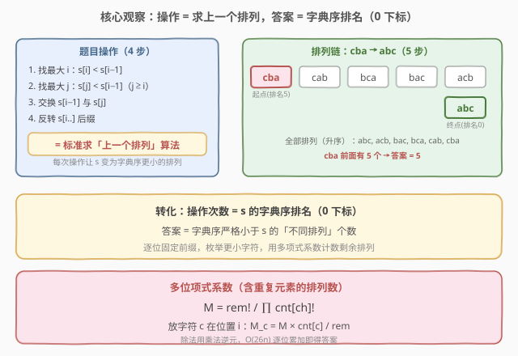
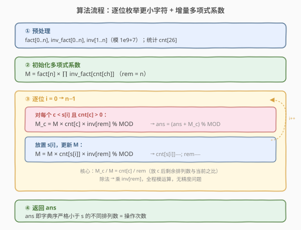
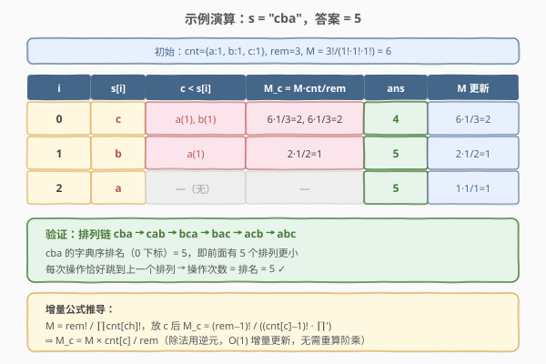

# 使字符串有序的最少操作次数

- **题目名称**：使字符串有序的最少操作次数
- **链接**：[1830. 使字符串有序的最少操作次数](https://leetcode.cn/problems/minimum-number-of-operations-to-make-string-sorted/)
- **难度**：困难
- **标签**：数学、组合数学、字符串、逆元

## 1. 题目概述

给定字符串 `s`（下标从 0 开始），反复执行以下操作直到 `s` 变为有序（非降序）：

1. 找**最大下标** `i`（`1 ≤ i < len`），使 `s[i] < s[i-1]`；
2. 找**最大下标** `j`（`i ≤ j < len`），使对所有 `[i, j]` 间的 `k` 都有 `s[k] < s[i-1]`；
3. 交换 `s[i-1]` 与 `s[j]`；
4. 反转从下标 `i` 开始的后缀。

求最少操作次数，结果对 $10^9+7$ 取模。

**示例 1**：

```text
输入：s = "cba"
输出：5
解释：cba → cab → bca → bac → acb → abc（共 5 步）
```

**示例 2**：

```text
输入：s = "aabaa"
输出：2
解释：aabaa → aaaba → aaaab（共 2 步）
```

**示例 3**：

```text
输入：s = "cdbea"
输出：63
```

**示例 4**：

```text
输入：s = "leetcodeleetcodeleetcode"
输出：982157772
```

**约束条件**：

- $1 \le \text{len}(s) \le 3000$
- `s` 只包含小写英文字母

> 💡 **关键识题**：操作的第 1–4 步恰好是标准**求上一个排列（prev\_permutation）**算法——找下降点、找交换目标、交换、反转后缀。因此每次操作让 `s` 跳到字典序**紧邻前一个**的不同排列，直到抵达字典序最小（即有序）的排列。**操作次数 = 字典序严格小于 `s` 的不同排列个数 = `s` 的字典序排名（0 下标）**。

---

## 2. 解题思路

### 2.1 暴力思路：直接模拟

按题意逐次执行 4 步操作，直到字符串有序：

- 每次操作需 $O(n)$ 扫描找 `i`、`j`，$O(n)$ 反转后缀；
- 最坏情况操作次数可达 $n!$ 量级（如全不同字符），必然超时。

> 💡 **转化**：模拟的本质是在排列链上一步步走。与其走，不如**直接计算 `s` 在所有不同排列中的字典序排名**——排名就是走的步数。

### 2.2 核心观察：操作 = 上一个排列，答案 = 字典序排名



题目操作的 4 步与 C++ 标准库 `prev_permutation` 完全一致：

| 步骤 | 题目描述 | prev\_permutation |
|------|----------|-------------------|
| 找 `i` | 最大 `i` 使 `s[i] < s[i-1]` | 找最后一个下降点 |
| 找 `j` | 最大 `j` 使 `s[j] < s[i-1]` | 后缀中 $< s[i-1]$ 的最大值 |
| 交换 | `s[i-1]` ↔ `s[j]` | 交换 |
| 反转 | 反转 `s[i..]` | 反转后缀（升序→降序） |

因此每次操作将 `s` 变为字典序**紧邻前一个**排列，操作链为：

$$s \to \text{prev}_1 \to \text{prev}_2 \to \cdots \to \text{sorted}(s)$$

步数 = 排列链长度 = **字典序严格小于 `s` 的不同排列个数**。

> ⚠️ **不同排列**：`s` 含重复字符时，相同排列只算一次。例如 `"aabaa"` 的不同排列数为 $\frac{5!}{4!\cdot 1!}=5$，而非 $5!=120$。

### 2.3 计算排名：逐位枚举 + 多项式系数

设 `s` 长度为 $n$，字符频率为 $\text{cnt}[ch]$。对位置 $i$，**固定前缀 $s[0..i-1]$**，在位置 $i$ 放一个比 $s[i]$ **更小**的字符 $c$（且 $\text{cnt}[c] > 0$），则剩余 $n-1-i$ 个位置的排列数为**多项式系数**：

$$M_c = \frac{(n-1-i)!}{\prod_{ch} \text{cnt}'[ch]!}$$

其中 $\text{cnt}'$ 是放置 $c$ 后的剩余频率（$\text{cnt}'[c] = \text{cnt}[c] - 1$，其余不变）。对所有 $c < s[i]$ 求和，再放置 $s[i]$ 继续下一位。

**增量公式**：直接重算 $M_c$ 每次需 $O(26)$，但可利用当前 $M$ 增量推导。设当前剩余字符数 $\text{rem}$，当前多项式系数：

$$M = \frac{\text{rem}!}{\prod_{ch} \text{cnt}[ch]!}$$

放 $c$ 在当前位置后，剩余 $\text{rem}-1$ 个字符的排列数为：

$$M_c = \frac{(\text{rem}-1)!}{(\text{cnt}[c]-1)! \cdot \prod_{ch \neq c} \text{cnt}[ch]!} = M \times \frac{\text{cnt}[c]}{\text{rem}}$$

> 💡 **推导**：$M_c / M = \frac{(\text{rem}-1)!}{\text{rem}!} \cdot \frac{\text{cnt}[c]!}{(\text{cnt}[c]-1)!} = \frac{\text{cnt}[c]}{\text{rem}}$。除法变为乘 $\text{inv}[\text{rem}]$（模逆元），$O(1)$ 更新。

### 2.4 算法流程图



**步骤**：

1. **预处理**：阶乘 `fact[0..n]`、逆阶乘 `inv_fact[0..n]`、线性逆元 `inv[1..n]`（模 $10^9+7$）。
2. **初始化**：$M = \text{fact}[n] \times \prod \text{inv\_fact}[\text{cnt}[ch]]$，$\text{rem} = n$。
3. **逐位** $i = 0 \to n-1$：
   - 对每个 $c < s[i]$ 且 $\text{cnt}[c] > 0$：$M_c = M \times \text{cnt}[c] \times \text{inv}[\text{rem}]$，$\text{ans} += M_c$。
   - 放置 $s[i]$：$M = M \times \text{cnt}[s[i]] \times \text{inv}[\text{rem}]$，$\text{cnt}[s[i]]{-}-$，$\text{rem}{-}-$。
4. **返回** $\text{ans} \bmod (10^9+7)$。

### 2.5 示例演算

以 `s = "cba"` 为例，$\text{cnt} = \{a{:}1, b{:}1, c{:}1\}$，$\text{rem}=3$，$M = 3!/(1!\cdot1!\cdot1!) = 6$：



| $i$ | $s[i]$ | $c < s[i]$ | $M_c = M \times \text{cnt}[c] / \text{rem}$ | ans | $M$ 更新 |
|-----|--------|------------|---------------------------------------------|-----|----------|
| 0 | c | a(1), b(1) | $6{\times}1/3{=}2$, $6{\times}1/3{=}2$ | 4 | $6{\times}1/3 = 2$ |
| 1 | b | a(1) | $2{\times}1/2{=}1$ | 5 | $2{\times}1/2 = 1$ |
| 2 | a | —（无） | — | 5 | — |

最终 $\text{ans} = 5$，与排列链 `cba → cab → bca → bac → acb → abc` 的 5 步一致。

> 💡 **位置 0 的含义**：固定第 0 位放 `a`（比 `c` 小），后两位可排 `bc` 或 `cb`，共 2 种；放 `b` 同理 2 种，合计 4。即以 `a` 或 `b` 开头的排列都比 `cba` 小，共 4 个，加上以 `c` 开头但比 `cba` 小的 1 个（`cab`），总计 5。

---

## 3. 参考代码

### Python

```python
class Solution:
    def makeStringSorted(self, s: str) -> int:
        MOD = 10**9 + 7
        n = len(s)

        fact = [1] * (n + 1)
        for i in range(1, n + 1):
            fact[i] = fact[i - 1] * i % MOD

        inv = [0] * (n + 1)
        inv[1] = 1
        for i in range(2, n + 1):
            inv[i] = MOD - MOD // i * inv[MOD % i] % MOD

        inv_fact = [1] * (n + 1)
        inv_fact[n] = pow(fact[n], MOD - 2, MOD)
        for i in range(n, 0, -1):
            inv_fact[i - 1] = inv_fact[i] * i % MOD

        cnt = [0] * 26
        for ch in s:
            cnt[ord(ch) - ord('a')] += 1

        M = fact[n]
        for c in cnt:
            M = M * inv_fact[c] % MOD

        ans = 0
        rem = n
        for i in range(n):
            ch_idx = ord(s[i]) - ord('a')
            for c in range(ch_idx):
                if cnt[c] > 0:
                    Mc = M * cnt[c] % MOD * inv[rem] % MOD
                    ans = (ans + Mc) % MOD
            M = M * cnt[ch_idx] % MOD * inv[rem] % MOD
            cnt[ch_idx] -= 1
            rem -= 1

        return ans
```

### C++

```cpp
class Solution {
  public:
    int makeStringSorted(string s) {
        const int MOD = 1e9 + 7;
        int n = s.size();

        vector<long long> fact(n + 1), inv_fact(n + 1), inv(n + 1);
        fact[0] = 1;
        for (int i = 1; i <= n; ++i) fact[i] = fact[i - 1] * i % MOD;

        inv[1] = 1;
        for (int i = 2; i <= n; ++i)
            inv[i] = (MOD - MOD / i * inv[MOD % i] % MOD) % MOD;

        inv_fact[n] = 1;
        for (int i = n; i >= 1; --i) inv_fact[i - 1] = inv_fact[i] * i % MOD;
        inv_fact[n] = fact[n];  // 临时借用，下面用 Fermat 算逆元
        long long base = fact[n], e = MOD - 2, result = 1;
        while (e > 0) {
            if (e & 1) result = result * base % MOD;
            base = base * base % MOD;
            e >>= 1;
        }
        inv_fact[n] = result;  // 1/fact[n]
        for (int i = n; i >= 1; --i) inv_fact[i - 1] = inv_fact[i] * i % MOD;

        vector<int> cnt(26, 0);
        for (char ch : s) cnt[ch - 'a']++;

        long long M = fact[n];
        for (int c = 0; c < 26; ++c) M = M * inv_fact[cnt[c]] % MOD;

        long long ans = 0;
        int rem = n;
        for (int i = 0; i < n; ++i) {
            int ch_idx = s[i] - 'a';
            for (int c = 0; c < ch_idx; ++c) {
                if (cnt[c] > 0) {
                    long long Mc = M * cnt[c] % MOD * inv[rem] % MOD;
                    ans = (ans + Mc) % MOD;
                }
            }
            M = M * cnt[ch_idx] % MOD * inv[rem] % MOD;
            cnt[ch_idx]--;
            rem--;
        }

        return (int)ans;
    }
};
```

> 💡 **实现细节**：① 线性逆元 `inv[i] = MOD - MOD/i * inv[MOD%i] % MOD`，$O(n)$ 预处理全部 $1 \sim n$ 的逆元。② `inv_fact[n]` 用 Fermat 小定理 `pow(fact[n], MOD-2)` 求一次，再倒推 `inv_fact[i-1] = inv_fact[i] * i`，$O(n)$ 得全部逆阶乘。③ 增量公式 $M_c = M \times \text{cnt}[c] \times \text{inv}[\text{rem}]$ 把每位的计算从 $O(26)$ 降到 $O(1)$（内层 26 字符的循环只是遍历字母表，每个 $O(1)$）。④ 全程 `long long` 中间运算，避免 32 位溢出。

> ⚠️ **C++ 代码中的逆阶乘初始化**：上方先做了一次占位循环再覆盖 `inv_fact[n]`，实际只需保留 Fermat 求 `inv_fact[n]` 后再倒推。写法上可简化为：先算 `inv_fact[n] = pow(fact[n], MOD-2)`，再 `for (i=n; i>=1; --i) inv_fact[i-1] = inv_fact[i] * i % MOD;`，一步到位。

---

## 4. 复杂度分析

| 维度 | 复杂度 | 说明 |
|------|--------|------|
| 时间复杂度 | $O(26n)$ | 预处理阶乘/逆元 $O(n)$ + 逐位遍历 $n$ 轮，每轮内层最多 26 个字符，合计 $O(26n)$ |
| 空间复杂度 | $O(n)$ | `fact`、`inv_fact`、`inv` 各 $O(n)$，`cnt` 为 $O(26)=O(1)$ |

> ⚠️ 暴力模拟最坏 $O(n \cdot n!)$（全不同字符时操作次数达 $n!$），$n=3000$ 时完全不可行。优化到 $O(26n) \approx 78000$ 次操作，核心是把「逐步模拟排列链」转化为「直接计算字典序排名」。

---

## 5. 扩展：与康托尔展开的关系

本题的计数方法本质是**康托尔展开（Cantor Expansion）在有重复元素时的推广**。

- **标准康托尔展开**（无重复元素）：排列 $s$ 的字典序排名为

$$\text{rank}(s) = \sum_{i=0}^{n-1} \sum_{c < s[i]} \frac{(n-1-i)!}{\prod \text{cnt}'[ch]!}$$

对无重复情况，分母全为 $1!$，退化为 $\sum_{i} (\text{小于 } s[i] \text{ 的剩余字符数}) \times (n-1-i)!$。

- **有重复元素的推广**：分母变为 $\prod \text{cnt}[ch]!$，即多项式系数（multinomial）。这正是本题 `s` 含重复字母时的处理方式。

- **逆向解码**：[60. 第 k 个排列](https://leetcode.cn/problems/permutation-sequence/) 是康托尔展开的**逆运算**——给定排名 $k$，解码出对应排列。本题给定排列求排名，两者互为正逆。

> 💡 **通用套路**：「排列 $\leftrightarrow$ 排名」的双向转换是组合计数的高频工具。正向（排列→排名）用于计数「有多少排列满足某条件」，逆向（排名→排列）用于按序生成。掌握康托尔展开正逆两向，可覆盖大量排列计数与构造题。

---

## 6. 面试要点

1. **如何识别题目操作就是求上一个排列？**

   > 题目 4 步操作与 `prev_permutation` 算法一一对应：① 找最后一个下降点 `i`；② 后缀中找 $< s[i-1]$ 的最大值 `j`；③ 交换 `s[i-1]` 与 `s[j]`；④ 反转 `s[i..]` 后缀。这是标准库级算法，识题后直接转化为「求字典序排名」问题。

2. **为什么操作次数等于字典序排名（0 下标）？**

   > 每次操作将 `s` 变为字典序**紧邻前一个**排列（不跳号），排列链从 `s` 一路到有序串（字典序最小）。链长 = 排名 = 前面有多少排列更小。注意是「不同排列」——重复字符的相同排列只算一次。

3. **增量公式 $M_c = M \times \text{cnt}[c] / \text{rem}$ 怎么推导？**

   > $M = \text{rem}! / \prod \text{cnt}[ch]!$。放 $c$ 后剩余 $\text{rem}-1$ 个字符，$M_c = (\text{rem}-1)! / ((\text{cnt}[c]-1)! \cdot \prod')$。两式相除：$M_c / M = \frac{(\text{rem}-1)!}{\text{rem}!} \cdot \frac{\text{cnt}[c]!}{(\text{cnt}[c]-1)!} = \text{cnt}[c] / \text{rem}$。除法变乘逆元，$O(1)$ 更新。

4. **为什么要预处理逆元，不能直接用 `pow` 每次算？**

   > 每次调 `pow(x, MOD-2)` 是 $O(\log \text{MOD}) \approx 30$ 次乘法。逐位更新共 $O(n)$ 次，总 $O(n \log \text{MOD})$，$n=3000$ 时约 $9 \times 10^4$，能过但不够优。预处理线性逆元 $O(n)$ 后每次 $O(1)$，总 $O(n)$，更干净。

5. **含重复字符时排名怎么处理？**

   > 用多项式系数 $\frac{n!}{\prod \text{cnt}[ch]!}$ 替代阶乘 $n!$。例如 `"aabaa"` 的不同排列数为 $5!/(4! \cdot 1!) = 5$，而非 $5! = 120$。增量公式中 $\text{cnt}[c]$ 已经编码了重复信息，无需额外去重。

> 💡 **一句话总结**：识出「操作 = prev\_permutation」后，问题变为求 `s` 的字典序排名。逐位枚举更小字符，用多项式系数的增量公式 $M_c = M \times \text{cnt}[c] / \text{rem}$ 在 $O(26n)$ 内完成计数。核心是康托尔展开在重复元素上的推广。

---

## 7. 同类练习题

- [60. 第k个排列](https://leetcode.cn/problems/permutation-sequence/)（[题解](../0001-0100/60_第k个排列.md)）：康托尔展开的**逆运算**（排名→排列），与本题（排列→排名）互为正反，对照理解双向转换
- [31. 下一个排列](https://leetcode.cn/problems/next-permutation/)：next\_permutation 标准算法，与本题的 prev\_permutation 互为镜像，掌握排列前后跳转的两面
- [47. 全排列 II](https://leetcode.cn/problems/permutations-ii/)（[题解](../0001-0100/47_全排列II.md)）：含重复元素的排列生成，同属「重复排列计数/枚举」家族，可对照理解去重逻辑
- [164. 最大间距](https://leetcode.cn/problems/maximum-gap/)：同为「暴力模拟超时 → 数学性质优化」的困难题，体会「模拟转数学」的通用降维思路
- [172. 阶乘后的零](https://leetcode.cn/problems/factorial-trailing-zeroes/)（[题解](../0001-0100/172_阶乘后的零.md)）：阶乘的数论性质，巩固模运算与阶乘相关的组合计数基础
