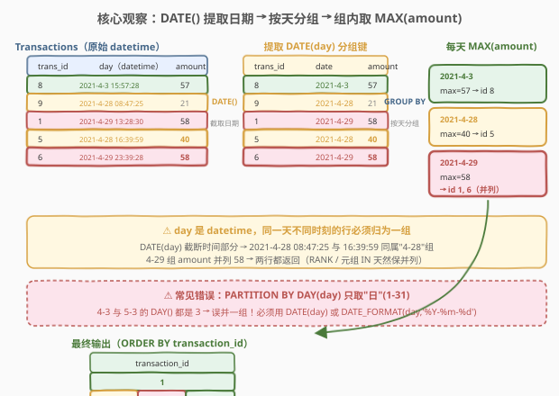
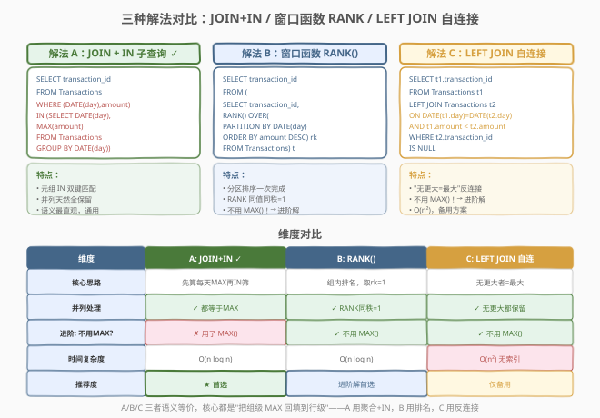
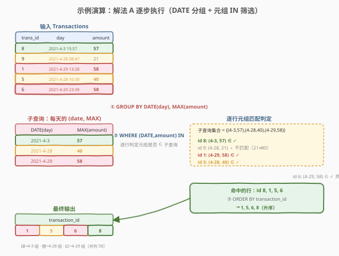

# 每天的最大交易

- **题目名称**：每天的最大交易
- **链接**：[1831. 每天的最大交易](https://leetcode.cn/problems/maximum-transaction-each-day/)
- **难度**：中等
- **标签**：数据库、SQL、`GROUP BY`、`MAX()`、窗口函数、`RANK()`、元组 IN、自连接、反连接（anti-join）、`DATE()` 函数、分组求最值

## 1. 题目概述

给定 `Transactions` 表（交易记录，含交易 ID、日期时间、金额），编写 SQL 查询报告**每天交易金额 `amount` 最大的交易 ID**。如果一天中有多个这样的交易（并列最大），返回这些交易的 ID。结果根据 `transaction_id` **升序排列**。

**表结构**：

```text
Table: Transactions
+----------------+----------+
| Column Name    | Type     |
+----------------+----------+
| transaction_id | int      |  ← 具有唯一值
| day            | datetime |
| amount         | int      |
+----------------+----------+
每行包括了该次交易的信息。
```

> 💡 **关键约束**：`transaction_id` 具有唯一值（可视为主键）；`day` 是 **`datetime` 类型**——同一天的不同交易有不同的时间部分（时、分、秒），但它们属于同一天，必须归为同一组。这是本题与 184（部门工资最高）等经典"分组求最值"题的关键区别：**分组键不是现成的列，而要从 `datetime` 中用 `DATE()` 提取**。

**示例 1**：

```text
输入：
Transactions 表:
+----------------+--------------------+--------+
| transaction_id | day                | amount |
+----------------+--------------------+--------+
| 8              | 2021-4-3 15:57:28  | 57     |
| 9              | 2021-4-28 08:47:25 | 21     |
| 1              | 2021-4-29 13:28:30 | 58     |
| 5              | 2021-4-28 16:39:59 | 40     |
| 6              | 2021-4-29 23:39:28 | 58     |
+----------------+--------------------+--------+

输出:
+----------------+
| transaction_id |
+----------------+
| 1              |
| 5              |
| 6              |
| 8              |
+----------------+

解释：
"2021-4-3"  → 只有 id=8 一笔，amount=57，直接入选。
"2021-4-28" → 有两笔：id=5(amount=40) 和 id=9(amount=21)，最大是 40 → id=5 入选。
"2021-4-29" → 有两笔：id=1(amount=58) 和 id=6(amount=58)，并列最大 → 两者都入选。
最后按 transaction_id 升序排列 → 1, 5, 6, 8。
```

**约束条件**：

- `transaction_id` 是该表具有唯一值的列
- `day` 为 `datetime` 类型
- 结果按 `transaction_id` 升序排列
- 并列最大者全部返回

**进阶**：你能不使用 `MAX()` 函数解决这道题目吗？

> 💡 本题是 SQL **"分组求最值"母题**的变体——核心套路与 184（部门工资最高）完全一致："先算每组 MAX，再筛等于 MAX 的行"。唯一的 twist 是**分组键隐藏在 `datetime` 中**，需要 `DATE(day)` 提取日期部分。难点三处：① **`DATE()` 截断时间**——同一天不同时刻必须归为一组；② **并列处理**——4-29 两个 58 都要返回；③ **进阶不用 `MAX()`**——窗口函数 `RANK` 或自连接反连接均可。

---

## 2. 解题思路

### 2.1 暴力思路：逐交易扫描同天其他交易

最直觉的过程式思路：对 `Transactions` 的每一行 `t1`，去同一天的其他交易里扫一遍看有没有金额比 `t1.amount` 更大的——没有就说明 `t1` 是当天最大。这在 Python/C++ 里是嵌套循环，但**纯 SQL 没有逐行循环语句**——需要换成三种"集合式"表达：① 先算每天 MAX 再 IN 筛行；② 窗口函数给每行打天内排名；③ 自连接把"有没有更大"显式化为 NULL。三者殊途同归，与 184 完全同构。

### 2.2 核心观察：DATE() 提取分组键 + 分组聚合与行筛选解耦



**关键洞察**：本题有两层难点。

**第一层：分组键的提取。** `day` 列是 `datetime`，同一天的交易时间不同（如 4-28 的 `08:47:25` 与 `16:39:59`），若直接按 `day` 分组，每条交易自成一组——必须用 `DATE(day)` 截断时间部分，只保留 `YYYY-MM-DD`，才能把同一天的交易归为一组。

$$\text{分组键} = \text{DATE}(\text{day}) = \text{截断时间后的纯日期}$$

**第二层：组级与行级的解耦。** "每天最大金额"是一个**组级聚合值**（一天一个 MAX），而要返回的是**行级信息**（具体 `transaction_id`）。`GROUP BY` 后只能 SELECT 聚合列或分组键，拿不到同组的 `transaction_id`。解法是**两步解耦**：

1. **先算组级**：子查询 `SELECT DATE(day), MAX(amount) FROM Transactions GROUP BY DATE(day)` 得到每天的 `(date, maxAmount)` 二维表；
2. **再筛行级**：外层 `WHERE (DATE(day), amount) IN (子查询)` 把"等于当天 MAX"的行筛出来。

$$\text{交易为当天最大} \iff (\text{DATE}(\text{day}), \text{amount}) \in \{(\text{DATE}(\text{day}), \max(\text{amount})) : \text{date} \in \text{日期集合}\}$$

> ⚠️ **常见错误：误用 `DAY(day)` 而非 `DATE(day)`**。MySQL 的 `DAY(date)` 函数返回**月份中的第几天**（1-31），而非完整日期。若写 `PARTITION BY DAY(day)` 或 `GROUP BY DAY(day)`，则 4 月 3 日与 5 月 3 日的 `DAY()` 都返回 3，会被错误地归为一组。**必须用 `DATE(day)`**（返回 `YYYY-MM-DD`）或 `DATE_FORMAT(day, '%Y-%m-%d')` 才能正确按天分组。这是本题最易踩的坑。

### 2.3 三种解法对比



| 维度 | 解法 A：JOIN + IN 子查询 | 解法 B：窗口函数 RANK() | 解法 C：LEFT JOIN 自连接 |
|------|------------------------|----------------------|------------------------|
| **思路** | 先算每天 MAX，再 IN 筛"等于 MAX"的行 | 给每行打天内金额降序排名，取 `rk=1` | 找"同天没有金额比自己高的"——最大值即无更大值 |
| **写法** | `WHERE (DATE(day),amount) IN (SELECT DATE(day),MAX(amount)... GROUP BY DATE(day))` | `RANK() OVER (PARTITION BY DATE(day) ORDER BY amount DESC)` | `LEFT JOIN t2 ON DATE(t1.day)=DATE(t2.day) AND t1.amount < t2.amount WHERE t2.id IS NULL` |
| **并列处理** | ✓ 天然保留（并列者都等于 MAX） | ✓ `RANK` 同额同秩并列第一 | ✓ 天然保留（并列者都"无更大"） |
| **不用 MAX()？** | ✗ 用了 `MAX()` | ✓ **不用 MAX()**（用 `RANK` 排序代替） | ✓ **不用 MAX()**（用反连接代替） |
| **推荐度** | ✓ **首选**，语义最直观 | ✓ 进阶解首选，不用 MAX() | △ 仅备用，性能差 |
| **复杂度** | $O(n \log n)$（分组排序 + 哈希 IN） | $O(n \log n)$（分区排序） | $O(n^2)$（无索引自连接，最差） |

> 💡 **进阶"不用 MAX()"的两种思路**：解法 B 用 `RANK() OVER (PARTITION BY ... ORDER BY amount DESC)` 代替 `MAX`——排名为 1 即最大，本质是"用排序代替聚合"；解法 C 用 `LEFT JOIN + IS NULL` 反连接——"不存在更大的即最大"，本质是"用连接的空值代替聚合"。两者都不调用 `MAX()` 函数，却殊途同归地找到每组最大值。

### 2.4 示例演算



以示例数据 `Transactions = [(8, 4-3 15:57, 57), (9, 4-28 08:47, 21), (1, 4-29 13:28, 58), (5, 4-28 16:39, 40), (6, 4-29 23:39, 58)]` 为例，观察解法 A 的三步执行：

| 步骤 | 操作 | 结果 |
|------|------|------|
| ① | `GROUP BY DATE(day), MAX(amount)` | `{(2021-4-3, 57), (2021-4-28, 40), (2021-4-29, 58)}`（每天最大金额） |
| ② | `WHERE (DATE(day), amount) IN 子查询` | 逐行判定元组是否属于子查询集合 |
| ③ | `ORDER BY transaction_id` | 升序排列命中行 |

**逐行元组匹配过程**（子查询集合 = `{(4-3, 57), (4-28, 40), (4-29, 58)}`）：

| trans_id | DATE(day) | amount | 元组 `(DATE, amount)` | 是否 ∈ 子查询 | 结果 |
|----------|-----------|--------|----------------------|--------------|------|
| 8 | 2021-4-3 | 57 | `(4-3, 57)` | ✓ 命中 `(4-3, 57)` | 保留 |
| 9 | 2021-4-28 | 21 | `(4-28, 21)` | ✗ 不匹配（21 ≠ 40） | 过滤 |
| 1 | 2021-4-29 | 58 | `(4-29, 58)` | ✓ 命中 `(4-29, 58)` | 保留 |
| 5 | 2021-4-28 | 40 | `(4-28, 40)` | ✓ 命中 `(4-28, 40)` | 保留 |
| 6 | 2021-4-29 | 58 | `(4-29, 58)` | ✓ 命中 `(4-29, 58)`（并列） | 保留 |

命中行 `id = {8, 1, 5, 6}`，按 `transaction_id` 升序 → **`1, 5, 6, 8`**。

> 💡 **元组 IN 天然处理并列**：4-29 组中 id=1 和 id=6 的 amount 都是 58，它们的元组 `(4-29, 58)` 都等于子查询中的 `(4-29, 58)`，都命中 IN，故并列全保留。这与 184（部门工资最高）的并列处理完全同构——"等于 MAX 的行"天然包含所有并列者。

---

## 3. 参考代码

### SQL（解法 A：JOIN + IN 子查询，推荐）

```sql
SELECT transaction_id
FROM Transactions
WHERE (DATE(day), amount) IN (
    SELECT DATE(day), MAX(amount)
    FROM Transactions
    GROUP BY DATE(day)
)
ORDER BY transaction_id;
```

> 💡 **写法要点**：
> - 子查询 `SELECT DATE(day), MAX(amount) ... GROUP BY DATE(day)` 先算每天最大金额，得到一张 `(date, maxAmount)` 二维表。
> - `WHERE (DATE(day), amount) IN (...)` 用**元组 IN** 同时匹配日期与金额两键——严格保证"该交易在当天内最大"，杜绝跨天串值。
> - `DATE(day)` 截断 `datetime` 的时间部分，只保留 `YYYY-MM-DD`，把同一天不同时刻的交易归为一组。
> - `ORDER BY transaction_id` 满足题目要求的升序输出。
> - ⚠️ 若数据库不支持元组 IN（如老旧 MySQL 5.x），见下方解法 A'。

### SQL（解法 A'：JOIN 子查询，兼容老版本）

```sql
SELECT t.transaction_id
FROM Transactions t
JOIN (
    SELECT DATE(day) AS d, MAX(amount) AS max_amount
    FROM Transactions
    GROUP BY DATE(day)
) m
    ON DATE(t.day) = m.d
   AND t.amount = m.max_amount
ORDER BY t.transaction_id;
```

> 💡 **写法要点**：把子查询从 `WHERE IN` 改为 `JOIN`——`JOIN 子查询 m ON DATE(t.day) = m.d AND t.amount = m.max_amount`。语义与元组 IN 完全等价（都是"日期+金额双键匹配"），但用 JOIN 表达，所有数据库通用，且优化器更易走哈希连接。**面试中若被追问"元组 IN 不通用怎么办"，答此 JOIN 版本**。

### SQL（解法 B：窗口函数 RANK()，不用 MAX()）

```sql
SELECT transaction_id
FROM (
    SELECT transaction_id,
           RANK() OVER (
               PARTITION BY DATE(day)
               ORDER BY amount DESC
           ) AS rk
    FROM Transactions
) t
WHERE rk = 1
ORDER BY transaction_id;
```

> 💡 **写法要点**：
> - `RANK() OVER (PARTITION BY DATE(day) ORDER BY amount DESC)` 给每行打天内金额降序排名——同一天按 amount 从高到低标 1,2,3...，**同额同秩**（并列者都是 1）。
> - `PARTITION BY DATE(day)` 是"分组键"，对应 `GROUP BY DATE(day)`；`ORDER BY amount DESC` 决定排名方向。
> - 外层 `WHERE rk = 1` 取每天第一名——并列者 rk 都是 1，全保留。
> - ✓ **不用 `MAX()`**——用 `RANK` 排序代替聚合，排名为 1 即最大，是进阶"不用 MAX()"的标准解法。
> - ⚠️ **绝不能用 `ROW_NUMBER()`**——它给并列者也分不同号，会丢掉其中一个。本题用 `RANK` 或 `DENSE_RANK` 均可（Top-1 场景两者结果相同）。
> - 需 MySQL 8.0+ / PostgreSQL / SQL Server 等支持窗口函数的版本。

### SQL（解法 C：LEFT JOIN 自连接，不用 MAX()）

```sql
SELECT t1.transaction_id
FROM Transactions t1
LEFT JOIN Transactions t2
    ON DATE(t1.day) = DATE(t2.day)
   AND t1.amount < t2.amount
WHERE t2.transaction_id IS NULL
ORDER BY t1.transaction_id;
```

> 💡 **写法要点**：
> - `LEFT JOIN Transactions t2 ON DATE(t1.day) = DATE(t2.day) AND t1.amount < t2.amount`：找"同一天里金额比自己**严格更高**的"交易 `t2`。
> - 若**找不到**（即没有同天的交易金额比自己高），`t2.*` 全 NULL，`WHERE t2.transaction_id IS NULL` 筛出这些行——正是当天最大者。
> - ✓ **天然处理并列**：并列最大者（如 id=1 和 id=6 都是 58）互相之间 `t1.amount < t2.amount` 不成立（58 < 58 为假），LEFT JOIN 都补 NULL，两人都保留。
> - ✓ **不用 `MAX()`**——用"反连接找无更大者"代替聚合，是进阶"不用 MAX()"的另一种解法。
> - ⚠️ `ON` 条件里 `t1.amount < t2.amount` 必须用**严格小于**——若用 `<=`，并列者会找到对方（58 ≤ 58 为真），被误判为"有更高者"而过滤掉。
> - 复杂度 $O(n^2)$（无索引时自连接逐对比较），数据量大时性能差，仅作备用。这一思想承接 184 解法 C 与 1581（反连接招牌题）。

### Python（pandas）

```python
import pandas as pd

def maximum_transaction_each_day(transactions: pd.DataFrame) -> pd.DataFrame:
    transactions = transactions.copy()
    transactions['date'] = pd.to_datetime(transactions['day']).dt.date
    max_amount = transactions.groupby('date')['amount'].transform('max')
    result = transactions[transactions['amount'] == max_amount]
    result = result.sort_values('transaction_id')
    return result[['transaction_id']]
```

> 💡 **pandas 对照**：
> - `pd.to_datetime(df['day']).dt.date` 对应 SQL 的 `DATE(day)`——截断 datetime 的时间部分，只保留日期，是 pandas 版的"提取分组键"。
> - `groupby('date')['amount'].transform('max')` 是 pandas 版的"窗口函数"——`transform` 把组级 MAX 广播回每行（长度与原表相同），对应 SQL 的 `MAX(amount) OVER (PARTITION BY DATE(day))`。
> - `df['amount'] == max_amount` 逐行判定，并列者都为 True 全保留，对应解法 A 的"等于 MAX 即最大"。
> - `sort_values('transaction_id')` 对应 SQL 的 `ORDER BY transaction_id`。
> - ⚠️ **不能用 `idxmax`**——它只返回第一个最大值的下标，会丢掉并列者；`transform` + 布尔掩码才能正确处理并列，与 184 的 pandas 解法完全同构。

---

## 4. 复杂度分析

| 维度 | 复杂度 | 说明 |
|------|--------|------|
| **时间（解法 A）** | $O(n \log n)$ | 子查询 `GROUP BY DATE(day)` 排序/哈希聚合 $O(n \log n)$，外层 `IN` 哈希查找 $O(n)$。$n$ = Transactions 行数 |
| **时间（解法 A'）** | $O(n \log n)$ | 同 A，`JOIN 子查询` 走哈希连接，复杂度等价 |
| **时间（解法 B）** | $O(n \log n)$ | `RANK() OVER (PARTITION BY DATE(day) ORDER BY amount DESC)` 需分区排序 $O(n \log n)$，外层过滤 $O(n)$ |
| **时间（解法 C）** | $O(n^2)$ ~ $O(n \log n)$ | 自连接逐对比较；无索引时 $O(n^2)$（每行扫全表）；`(DATE(day), amount)` 有复合索引时可降到 $O(n \log n)$ |
| **空间** | $O(n)$ | 子查询物化 / 窗口函数排序缓冲 / 自连接中间结果 |
| **结果行数** | $O(k)$ | $k$ = 各天最大交易总数（含并列），$m \le k \le n$（$m$ = 不同日期数） |

> ⚠️ SQL 复杂度取决于**执行计划与索引**：解法 A/B 在 `(DATE(day), amount)` 有函数索引或生成列索引时性能最佳。MySQL 对 `DATE(day)` 这种函数表达式默认不走索引（除非建函数索引或生成列），数据量大时可考虑新增一列 `date_only` 并建索引。面试中说明"首选 A/A'，B 在支持窗口函数时是进阶最优，C 仅作备用"即可。

---

## 5. 扩展：DATE() 截断与不用 MAX() 的思路

### 5.1 datetime 分组的各种截断函数

本题的 `day` 是 `datetime`，按"天"分组需要截断时间。MySQL 提供多种截断函数，适用场景各异：

| 函数 | 返回值 | 示例（`2021-4-28 16:39:59`） | 用途 |
|------|--------|------------------------------|------|
| `DATE(day)` | `date` 类型 | `2021-4-28` | ✓ **按天分组**（本题正解） |
| `DATE_FORMAT(day, '%Y-%m-%d')` | 字符串 | `'2021-04-28'` | 按天分组（字符串形式，跨库通用） |
| `DAY(day)` | int（1-31） | `28` | ⚠️ **只取日号**，跨月冲突！ |
| `YEAR(day)` / `MONTH(day)` | int | `2021` / `4` | 按年/月分组 |
| `DATE_FORMAT(day, '%Y-%m')` | 字符串 | `'2021-04'` | 按月分组（如 1193 每月交易） |

> ⚠️ **本题最易踩的坑**：把 `DATE(day)` 误写成 `DAY(day)`。`DAY()` 只返回日号（1-31），4-3 与 5-3 的 `DAY()` 都是 3 会被误并一组。**必须用 `DATE(day)` 或 `DATE_FORMAT(day, '%Y-%m-%d')`**。

### 5.2 "不用 MAX()"的两种思路

题目进阶要求不使用 `MAX()` 函数。这本质上是问：**除了"聚合 + 筛选"，还有哪些方式能找到每组最大值？**

| 思路 | 解法 | 如何代替 MAX | 本质 |
|------|------|-------------|------|
| **排序代替聚合** | 解法 B：`RANK() OVER (PARTITION BY ... ORDER BY amount DESC)` | 排名第 1 = 最大 | 用"排序"代替"聚合" |
| **反连接代替聚合** | 解法 C：`LEFT JOIN + IS NULL` | "不存在更大的" = 最大 | 用"连接空值"代替"聚合" |

```sql
-- 思路 B：排序代替聚合（窗口函数）
SELECT transaction_id FROM (
    SELECT transaction_id,
           RANK() OVER (PARTITION BY DATE(day) ORDER BY amount DESC) AS rk
    FROM Transactions
) t WHERE rk = 1 ORDER BY transaction_id;

-- 思路 C：反连接代替聚合（自连接）
SELECT t1.transaction_id
FROM Transactions t1
LEFT JOIN Transactions t2
    ON DATE(t1.day) = DATE(t2.day) AND t1.amount < t2.amount
WHERE t2.transaction_id IS NULL
ORDER BY t1.transaction_id;
```

> 💡 这两种"不用 MAX"的思路可泛化到所有"分组求最值"场景——只要把"组级 MAX"换成"组内排序第 1"或"无更大者"，就能绕开 `MAX()` 聚合函数。

### 5.3 "分组求最值"母题的泛化

本题与 184（部门工资最高）共享同一套"分组求最值"模板，唯一差异是分组键的来源：

| 题目 | 分组键 | 最值列 | 分组键来源 |
|------|--------|--------|-----------|
| 184 部门工资最高 | `departmentId` | `salary` | 现成列 |
| **1831 每天最大交易** | `DATE(day)` | `amount` | **从 datetime 提取** |
| 1549 每件商品最新订单 | `product_id` | `order_date` | 现成列 |
| 1596 每位顾客最常订购商品 | `customer_id` | `order_count` | 现成列（需先聚合再取最值） |

```sql
-- 模板 A：JOIN + IN 子查询（Top-1，通用）
SELECT a.id
FROM A a
WHERE (group_key, val) IN (
    SELECT group_key, MAX(val) FROM A GROUP BY group_key
)
ORDER BY a.id;

-- 模板 B：窗口函数（Top-K，改 N 即可）
SELECT id FROM (
    SELECT id, RANK() OVER (PARTITION BY group_key ORDER BY val DESC) AS rk
    FROM A
) t WHERE rk <= N ORDER BY id;
```

> 💡 只需替换表名、分组键、排序值即可套用——所有"每班成绩最高""每类商品最贵""每天交易最大"类 SQL 题都是这个模板的实例。本题的 twist 只是 `group_key = DATE(day)` 需要函数提取。

---

## 6. 面试要点

1. **`DATE(day)` 和 `DAY(day)` 的区别？为什么本题必须用 `DATE()`？**

   - `DATE(day)` 返回完整的 `YYYY-MM-DD` 日期（如 `2021-4-28`），`DAY(day)` 只返回月份中的日号（1-31，如 `28`）。若误用 `DAY(day)` 分组，4 月 28 日与 5 月 28 日的 `DAY()` 都返回 28，会被错误地归为一组——跨月的同日号交易混在一起。**必须用 `DATE(day)` 截断时间部分、保留完整日期**，或用 `DATE_FORMAT(day, '%Y-%m-%d')`（字符串形式，跨库通用）。这是本题最易踩的坑。

2. **如何处理并列最大？三种解法各自如何保证并列全返回？**

   - 解法 A：并列者的 `(DATE(day), amount)` 元组都等于子查询中的 `(DATE(day), MAX(amount))`，都命中 IN，全保留。
   - 解法 B：`RANK` 给同额者相同排名（都是 1），`WHERE rk = 1` 全取。
   - 解法 C：并列最大者（如 id=1 和 id=6 都是 58）互相之间 `t1.amount < t2.amount` 不成立（58 < 58 为假），LEFT JOIN 都补 NULL，都保留。
   - ⚠️ 唯一会出错的是误用 `ROW_NUMBER()`——它给并列者分不同号，会丢人。

3. **进阶"不用 MAX()"怎么解？**

   - 两种思路：① **排序代替聚合**——用 `RANK() OVER (PARTITION BY DATE(day) ORDER BY amount DESC)` 给每天的交易按金额降序排名，`WHERE rk = 1` 取第一名，排名为 1 即最大，不调用 `MAX()`；② **反连接代替聚合**——`LEFT JOIN Transactions t2 ON 同天 AND t1.amount < t2.amount WHERE t2.id IS NULL`，"不存在更大的即最大"，也不调用 `MAX()`。前者 $O(n \log n)$ 性能好，后者 $O(n^2)$ 仅作备用。

4. **为什么用元组 IN 而非两个标量 IN？**

   - `WHERE DATE(day) IN (...) AND amount IN (...)` 会误判——"4-3 的最大金额 57"与"4-28 的最大金额 40"凑在一起，可能把"4-3 中金额恰为 40 的交易"也选上（40 ∈ {57, 40, 58}）。**元组 IN `(DATE(day), amount) IN (...)` 把"日期-金额"作为一个整体匹配**，严格保证"该交易在当天内最大"，杜绝跨天串值。这与 184 的"元组 IN 防跨部门串值"完全同构。

5. **三种解法性能差异？面试首选哪个？**

   - 解法 A/A'（JOIN + 子查询）：$O(n \log n)$，优化器常改写为半连接或哈希连接，性能稳定，**通用首选**。
   - 解法 B（窗口函数）：$O(n \log n)$，分区排序一次完成，**进阶"不用 MAX()"的首选**，扩展到 Top-K 最优雅。
   - 解法 C（LEFT JOIN 自连接）：$O(n^2)$（无索引），最差，**仅作禁用窗口函数且不用 MAX 时的备用**。
   - 面试答："首选 A——语义直观、通用；若要求不用 MAX()，选 B（窗口函数 RANK），性能最优且扩展性好；C 仅在禁用窗口函数时用。三者核心都是'把组级 MAX 回填到行级'，只是 A 用聚合+IN，B 用排序排名，C 用反连接。"

> 💡 **一句话总结**：1831 是 184（部门工资最高）的 datetime 变体——核心就一句 `WHERE (DATE(day), amount) IN (SELECT DATE(day), MAX(amount) ... GROUP BY DATE(day))`。考点三处：① **`DATE()` 截断时间**（误用 `DAY()` 只取日号会跨月并组）；② **并列处理**（元组 IN / RANK / 严格小于 三种解法各自保证）；③ **进阶不用 MAX()**（`RANK` 排序或 `LEFT JOIN` 反连接代替聚合）。记住"DATE 提取分组键 + 分组聚合与行筛选解耦"这条公式，所有"每组取最值行 + datetime 分组"SQL 题都能套用。

---

## 7. 同类练习题

- [184. 部门工资最高的员工](https://leetcode.cn/problems/department-highest-salary/)：1831 的母题——"分组求最值"招牌题，核心套路完全一致（元组 IN / RANK / 自连接三解法），唯一差异是 184 分组键为现成列 `departmentId`，1831 需从 `datetime` 用 `DATE()` 提取
- [1581. 进店却未进行过交易的顾客](https://leetcode.cn/problems/customer-who-visited-but-did-not-make-any-transactions/)：解法 C 的反连接思想源头——`LEFT JOIN + IS NULL` 找"无匹配"，1581 找"无交易"，1831 找"无更大"，共享"外连接补 NULL + IS NULL 筛"骨架
- [1193. 每月交易 I](https://leetcode.cn/problems/monthly-transactions-i/)：同为 `Transactions` 表 + `datetime` 分组——1193 用 `DATE_FORMAT(day, '%Y-%m')` 按月分组统计，1831 用 `DATE(day)` 按天分组取最值，对比不同截断粒度
- [1549. 每件商品的最新订单](https://leetcode.cn/problems/latest-orders-per-customer/)：同属"分组求最值"家族——1549 取每组 `order_date` 最大行（日期本身就是最值列），1831 取每组 `amount` 最大行，两者共享 `RANK`/`JOIN+IN` 模板
- [185. 部门工资前三高的所有员工](https://leetcode.cn/problems/department-top-three-salaries/)：184/1831 的 Top-K 进阶版——把"最高"扩到"前三高"，标准解法把 `RANK() = 1` 改为 `DENSE_RANK() <= 3`，展示窗口函数的扩展优势
