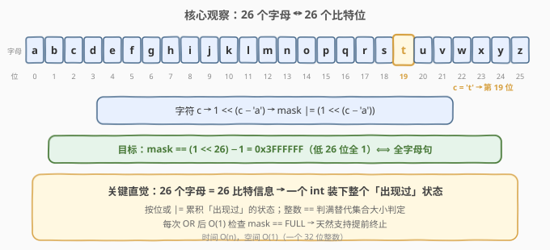
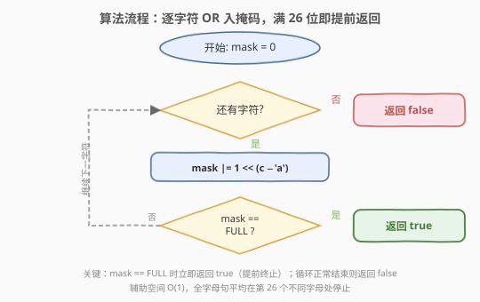
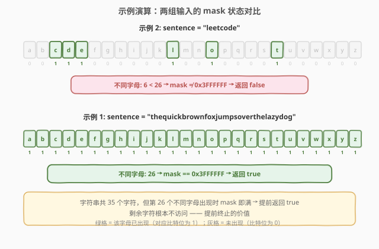

# 判断句子是否为全字母句

- **题目名称**：判断句子是否为全字母句
- **链接**：[1832. 判断句子是否为全字母句](https://leetcode.cn/problems/check-if-the-sentence-is-pangram/)
- **难度**：简单
- **标签**：哈希表、位运算、字符串

## 1. 题目概述

**全字母句** 指包含英语字母表中每个字母至少一次的句子。给你一个仅由小写英文字母组成的字符串 `sentence`，请你判断 `sentence` 是否为全字母句。如果是，返回 `true`；否则，返回 `false`。

**示例 1**：

```text
输入：sentence = "thequickbrownfoxjumpsoverthelazydog"
输出：true
解释：sentence 包含英语字母表中每个字母至少一次。
```

**示例 2**：

```text
输入：sentence = "leetcode"
输出：false
```

**约束条件**：

- `1 <= sentence.length <= 1000`
- `sentence` 由小写英语字母组成

> 💡 **核心矛盾**：要判断「26 个字母是否都出现过」——这是一个**集合成员判定**问题。关键观察：26 个字母恰好对应 26 个比特位，一个 32 位整数就能装下整个「出现过」的状态。能否用一个整数替代整个哈希集合？

---

## 2. 解题思路

### 2.1 暴力思路：哈希集合统计

最直觉的做法：遍历 `sentence`，把每个字符放入哈希集合，最后检查集合大小是否为 26。

```text
seen = set()
for c in sentence: seen.add(c)
return len(seen) == 26
```

时间 $O(n)$，空间 $O(26) = O(1)$（字母表大小固定）。能 AC，但有两个可以优化的点：

1. **空间浪费**：26 个字母的状态只需要 26 比特信息，而哈希集合用了一个完整的哈希表结构（桶、链表/开放寻址等），开销远大于「26 个 bit」。
2. **无法提前终止**：朴素集合写法必须扫描完整个字符串才能检查集合大小。而实际上，一旦 26 个字母全部出现，后续字符对结果再无影响——应当立即返回 `true`。

> 💡 转机：把「哈希集合」压缩成「一个 32 位整数的 26 个比特位」。集合的「添加」操作变成「按位或」，「大小 == 26」的判定变成「整数 == (1<<26)−1」，且每次 OR 后都能 $O(1)$ 地检查是否已满——天然支持提前终止。

### 2.2 核心观察：位掩码替代哈希集合



英语字母表恰好 26 个字母，而一个 32 位整数有 32 个比特位——**完美容纳**。建立映射：

$$\text{字母 } c \in \{\text{a}, \dots, \text{z}\} \;\longrightarrow\; \text{第 } (c - \text{'a'}) \text{ 位}, \quad 0 \le c - \text{'a'} \le 25$$

对每个字符执行按位或：

$$\text{mask} \;\big|\!\!=\; 1 \ll (c - \text{'a'})$$

「全字母句」等价于 `mask` 的低 26 位全为 1，即：

$$\text{mask} == (1 \ll 26) - 1 = \texttt{0x3FFFFFF}$$

> 💡 **为什么成立？** 按位或 `|=` 天然实现了集合的「并」语义：每个比特位是一个布尔变量（0=未出现，1=已出现），`mask |= (1 << k)` 就是把第 k 位翻为 1（已出现则不变）。26 个比特位全为 1 ⟺ 26 个字母都出现过。这就是把「大小为 26 的集合」压缩成「一个整数」的根源——信息量恰好是 26 比特，不多不少。

### 2.3 算法流程图



一次遍历，维护掩码 `mask`：

- 初始化 `mask = 0`（所有字母均未出现）。
- 对每个字符 `c`：`mask |= 1 << (c - 'a')`，将对应比特位置 1。
- 每次 OR 后检查 `mask == FULL`：若相等，说明 26 个字母已全部出现，**立即返回 `true`**（提前终止）。
- 遍历正常结束（未触发提前返回）→ 返回 `false`。

> 💡 **提前终止**是效率关键：对于真正的全字母句，一旦第 26 个不同字母出现就立即返回，**不再扫描剩余字符**。最坏情况（非全字母句）才扫完整串。

### 2.4 示例演算



以题目给出的两个示例逐个验证：

| 示例 | `sentence` | 不同字母数 | mask 最终值 | 判定路径 | 结果 |
|------|-----------|-----------|------------|----------|------|
| 1 | `"thequickbrownfoxjumpsoverthelazydog"` | 26 | `0x3FFFFFF` | 扫到第 26 个不同字母 → `mask == FULL` → 提前返回 | `true` |
| 2 | `"leetcode"` | 6（l,e,t,c,o,d） | 仅 6 位置 1 | 扫完整串 → `mask ≠ FULL` | `false` |

> 💡 示例 1 的字符串有 35 个字符，但只需扫到第 26 个**不同**字母出现的位置即可提前返回——剩余字符根本不访问。示例 2 只有 8 个字符、6 种字母，扫完即知不全。

---

## 3. 参考代码

### C++（位掩码 + 提前终止）

```cpp
class Solution {
  public:
    bool checkIfPangram(string sentence) {
        int mask = 0;
        const int FULL = (1 << 26) - 1;    // 0x3FFFFFF，低 26 位全 1
        for (char c : sentence) {
            mask |= 1 << (c - 'a');        // 将对应比特位置 1
            if (mask == FULL) return true; // 26 个字母全部出现，提前返回
        }
        return false;
    }
};
```

### Python（位掩码 + 提前终止）

```python
class Solution:
    def checkIfPangram(self, sentence: str) -> bool:
        mask = 0
        full = (1 << 26) - 1
        for c in sentence:
            mask |= 1 << (ord(c) - ord('a'))
            if mask == full:
                return True
        return False
```

### Python（集合一行流，对照用）

```python
class Solution:
    def checkIfPangram(self, sentence: str) -> bool:
        return len(set(sentence)) == 26
```

> ⚠️ **两种写法的对比**：集合写法 `len(set(sentence)) == 26` 简洁优雅、工程中常用，但 (1) 必须扫描整个字符串构建完整集合，无法提前终止；(2) 空间开销为一个哈希集合（远大于 4 字节整数）。位掩码写法用一个 `int` 记录全部状态，且能在第 26 个不同字母出现时立即返回。面试建议先写位掩码版点出提前终止，再提集合版作为对照。

---

## 4. 复杂度分析

| 维度 | 复杂度 | 说明 |
|------|--------|------|
| 时间复杂度 | $O(n)$ | 最坏情况（非全字母句）遍历整个字符串一次；全字母句在第 26 个不同字母处提前终止，实际访问字符数少于 $n$ |
| 空间复杂度 | $O(1)$ | 仅用一个 32 位整数 `mask`（4 字节），与输入规模无关 |

> 💡 与哈希集合法的对比：集合法时间同为 $O(n)$、空间 $O(1)$（26 个元素固定），但 (1) 无法提前终止，必扫完整串；(2) 哈希集合的实际内存开销远大于一个整数。位掩码法把「26 元素集合」压缩为「一个整数的 26 个比特」，是信息量精确匹配的极致压缩。

---

## 5. 扩展：位掩码与集合的等价性

### 5.1 按位或是集合并运算

位掩码本质上是**全集为 $\{0, 1, \dots, 25\}$ 的子集的紧凑表示**。每个整数 `mask` 的第 $k$ 位表示元素 $k$ 是否在子集中。在此表示下：

| 集合运算 | 位运算 | 说明 |
|----------|--------|------|
| 添加元素 $k$ | `mask \|= (1 << k)` | 第 $k$ 位置 1 |
| 删除元素 $k$ | `mask &= ~(1 << k)` | 第 $k$ 位置 0 |
| 测试元素 $k$ | `mask & (1 << k)` | 第 $k$ 位是否为 1 |
| 集合并 | `a \| b` | 按位或 |
| 集合交 | `a & b` | 按位与 |
| 集合大小 | `popcount(mask)` | 数 1 的个数 |
| 集合为满 | `mask == FULL` | 所有位为 1 |

本题只需「添加」+「判满」，故 `|=` + `== FULL` 足矣。

### 5.2 提前终止的期望收益

设字符串长度为 $n$，字符在字母表上均匀分布。全字母句中第 26 个不同字母出现的位置是经典的**优惠券收集问题**（Coupon Collector），期望位置约为 $26 \cdot H_{26} \approx 26 \times 3.85 \approx 100$（$H_{26}$ 为第 26 个调和数）。当 $n \gg 100$ 时，提前终止可跳过大量字符；最坏情况（非全字母句）仍需 $O(n)$。

### 5.3 若字母表扩大

若题目改为「判断是否包含所有 ASCII 可见字符」（约 95 个），则 32 位整数不够用，需改用 (1) 多个整数拼接；(2) `std::bitset<95>`；(3) 回退到哈希集合。位掩码法的适用前提是**状态空间 ≤ 64**（一个 64 位整数的位数）。

---

## 6. 面试要点

**Q1：为什么用位掩码而不是哈希集合？**

> 26 个字母的状态恰好是 26 比特信息，一个 32 位整数即可完整表示。哈希集合虽能工作，但 (1) 内存开销远大于一个整数；(2) 无法在每次添加后 $O(1)$ 检查「是否已满」从而提前终止。位掩码把「添加」变成 `|=`，「判满」变成 `== FULL`，天然支持提前返回。

**Q2：提前终止在什么情况下有收益？**

> 对于真正的全字母句，一旦第 26 个不同字母出现就立即返回 `true`，不再扫描剩余字符。字符串越长、字母分布越均匀，收益越大（期望在第 $\sim 100$ 个字符处终止）。非全字母句无法提前终止，仍需扫完整串。

**Q3：`(1 << 26) - 1` 的值是多少？为什么代表「全字母」？**

> `(1 << 26) - 1 = 0x3FFFFFF = 67108863`，二进制为低 26 位全 1、高位全 0。每个比特位对应一个字母（a=第 0 位，…，z=第 25 位），全 1 意味着 26 个字母都出现过，故 `mask == 0x3FFFFFF` 即为全字母句。

**Q4：如果字符串包含大写字母怎么办？**

> 题目保证全小写。若放宽为大小写混合，可在 OR 前统一转小写（`c |= 0x20` 或 `tolower(c)`），再按 `c - 'a'` 映射到位位置。逻辑不变，只需一步预处理。

**Q5：位掩码法和集合法的时间复杂度都是 $O(n)$，实际差异在哪？**

> 渐进复杂度相同，差异在常数因子和提前终止能力：(1) 位运算 `|=` 和 `==` 是单条 CPU 指令，比哈希集合的「插入+可能的 rehash」快得多；(2) 位掩码法每次 OR 后检查 `mask == FULL` 即可提前返回，集合法需在最后才检查 `len(seen) == 26`。在大规模全字母句上，位掩码法的实际访问字符数远少于 $n$。

---

## 7. 同类练习题

- [268. 丢失的数字](https://leetcode.cn/problems/missing-number/)（[站内题解](../0201-0300/268_丢失的数字.md)）：同为「完整性判定」——检查 0..n 中缺失哪个数，可用求和公式或异或把 $O(n)$ 空间压缩到 $O(1)$，思路与本题「用位掩码压缩集合」一脉相承
- [389. 找不同](https://leetcode.cn/problems/find-the-difference/)（[站内题解](../0301-0400/389_找不同.md)）：同为字符级位运算——在两个字符串中找多出的那个字符，用异或 `^` 抵消相同字符，对照本题用 `|=` 累积不同字符
- [191. 位 1 的个数](https://leetcode.cn/problems/number-of-1-bits/)（[站内题解](../0001-0100/191_位1的个数.md)）：位运算基础——`n & (n-1)` 消最低位 1，若需统计 mask 中已出现字母数（而非判满），即用此技巧数 1 的个数
- [1160. 拼写单词](https://leetcode.cn/problems/find-words-that-can-be-formed-by-characters/)（[站内题解](../1101-1200/1160_拼写单词.md)）：同为字符频率统计——判断单词能否由给定字符集拼出，是本题「字符出现判定」的频率升级版（需计数而非仅判存在）
- [136. 只出现一次的数字](https://leetcode.cn/problems/single-number/)（[站内题解](../0101-0200/136_只出现一次的数字.md)）：同为「用位运算替代显式统计」——异或满足自反性 $a \oplus a = 0$，把「找落单数」压缩成一次异或扫描，对照本题的按位或累积
