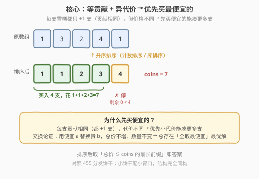
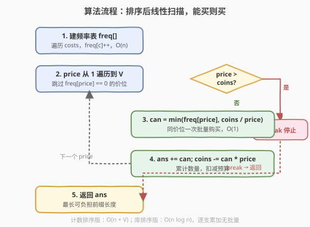
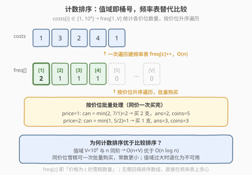

# LeetCode 雪糕的最大数量 题解

## 1. 题目概述

- **标题 / 题号**：雪糕的最大数量（#1833，medium）
- **链接**：https://leetcode.cn/problems/maximum-ice-cream-bars/
- **难度**：中等
- **标签**：贪心、排序、计数排序、数组

**题意**：商店有 `n` 支雪糕，价格用数组 `costs` 表示，`costs[i]` 为第 `i` 支雪糕的现金价格。Tony 有 `coins` 现金，想要买**尽可能多**的雪糕（可按任意顺序购买）。返回能买到的雪糕**最大数量**。

> ⚠️ **题目硬性要求**：必须使用**计数排序**解决此问题（而非直接调用库排序）。

**示例 1**：

```text
输入：costs = [1,3,2,4,1], coins = 7
输出：4
解释：买下标 0、1、2、4 的雪糕，总价 1 + 3 + 2 + 1 = 7
```

**示例 2**：

```text
输入：costs = [10,6,8,7,7,8], coins = 5
输出：0
解释：钱不够买任何一支雪糕
```

**示例 3**：

```text
输入：costs = [1,6,3,1,2,5], coins = 20
输出：6
解释：买下全部雪糕，总价 1 + 6 + 3 + 1 + 2 + 5 = 18
```

**约束**：

- $\text{costs.length} == n$
- $1 \le n \le 10^5$
- $1 \le \text{costs}[i] \le 10^5$
- $1 \le \text{coins} \le 10^8$

> 💡 **核心矛盾**：要「数量最多」而非「总价最高」。每支雪糕贡献相同（都只 +1 支），但消耗的现金不同。直觉上——便宜的优先买，用更少的钱凑出更多支数。这正是贪心的典型信号：**每单位贡献相同，优先选代价最小的**。

## 2. 解题思路

### 2.1 暴力思路

最朴素的想法是枚举所有子集，对每个子集求总价，找出总价 $\le \text{coins}$ 的最大子集大小。但子集数为 $2^n$，$n = 10^5$ 时完全不可行。

稍进一步的思路：能否用动态规划？把问题看作「容量为 `coins`、物品重量为 `costs[i]`、每件物品价值为 1」的 0-1 背包。但 `coins` 高达 $10^8$，DP 表规模过大；而每件物品「价值」都相同（=1），用背包这种「价值各异」的通用工具明显过重——这暗示存在更直接的贪心结构。

### 2.2 核心观察：贪心——优先买最便宜的



关键洞察分两层：

**第一层：等贡献 + 异代价 → 优先小代价。** 每支雪糕对「数量」的贡献都是 1（等贡献），但消耗的现金不同（异代价）。在预算有限时，要让「数量」最大化，自然应优先选代价最小的——即**先把便宜的买完，再考虑贵的**。

**第二层：贪心最优性（交换论证）。** 设某最优解 $S^*$ 没有买最便宜的某支 $a$，却买了较贵的某支 $b$（$\text{costs}[b] \ge \text{costs}[a]$）。把 $b$ 换成 $a$ 后，总价不增、数量不变，仍是合法解。因此总存在一个「全取最便宜」的最优解。形式化地：

> 设排序后价格为 $c_1 \le c_2 \le \cdots \le c_n$。最优解取 $k$ 支，则总价最小的 $k$ 支一定是 $c_1, c_2, \ldots, c_k$（前缀）。若 $\sum_{i=1}^{k} c_i \le \text{coins}$ 且 $\sum_{i=1}^{k+1} c_i > \text{coins}$，则答案恰为 $k$。

> 💡 **贪心成立的条件**：(1) 每件物品价值相同（都是 1 支）；(2) 物品可任意选取顺序；(3) 代价非负。三者缺一不可。若每支雪糕「价值不同」（如带来不同快乐值），则退化为 0-1 背包，贪心失效。

### 2.3 算法流程图



流程核心：将 `costs` **升序排序**后，从左到右逐支扫描——若当前雪糕价格 $\le$ 剩余现金，则买下（数量 +1，现金扣减）；否则停止（后面的更贵，必然也买不起）。返回累计数量。

> ⚠️ **提前终止**：一旦遇到买不起的雪糕，由于数组已升序，后续雪糕只会更贵，可直接 `break`。这是排序带来的关键优化，使最坏情况也只需一次线性扫描。

### 2.4 示例演算

![示例演算：costs = [1,3,2,4,1], coins = 7](../images/1833_example_walkthrough.svg)

以 `costs = [1, 3, 2, 4, 1]`, `coins = 7` 为例。排序后为 $[1, 1, 2, 3, 4]$：

| 步骤 | 当前价 | 剩余 coins | 能否买 | 累计数量 |
|------|--------|-----------|--------|----------|
| 1 | 1 | 7 | ✓ | 1 |
| 2 | 1 | 6 | ✓ | 2 |
| 3 | 2 | 5 | ✓ | 3 |
| 4 | 3 | 3 | ✓ | 4 |
| 5 | 4 | 0 | ✗（$4 > 0$） | 4（停止） |

最终返回 $4$ ✓

> 💡 注意第 5 步：剩余现金为 0，最便宜未买的雪糕要 4 元，买不起即停止。若不排序而按原顺序 `[1,3,2,4,1]` 贪心，会在买到 `[1,3,2]`（花费 6）后遇到价格 4 买不起，错失第 2 支价格 1 的雪糕——这正是「必须先排序」的根本原因。

## 3. 参考代码

### C++（计数排序版——满足题目硬性要求）

```cpp
class Solution {
  public:
    int maxIceCream(vector<int>& costs, int coins) {
        const int MAXC = 100001;
        int freq[MAXC] = {0};
        for (int c : costs) freq[c]++;

        int ans = 0;
        for (int price = 1; price < MAXC && coins >= price; price++) {
            if (freq[price] == 0) continue;
            // 能买多少支此价位的雪糕：受 freq 限制与预算限制取较小
            long long can = min((long long)freq[price], (long long)coins / price);
            ans += (int)can;
            coins -= (int)(can * price);
        }
        return ans;
    }
};
```

### Python（计数排序版）

```python
class Solution:
    def maxIceCream(self, costs: List[int], coins: int) -> int:
        MAXC = 100001
        freq = [0] * MAXC
        for c in costs:
            freq[c] += 1

        ans = 0
        for price in range(1, MAXC):
            if price > coins or freq[price] == 0:
                if price > coins:
                    break
                continue
            can = min(freq[price], coins // price)
            ans += can
            coins -= can * price
        return ans
```

### Python（库排序版——对照理解贪心本质）

```python
class Solution:
    def maxIceCream(self, costs: List[int], coins: int) -> int:
        costs.sort()
        ans = 0
        for c in costs:
            if c > coins:
                break
            coins -= c
            ans += 1
        return ans
```

> 💡 **两种实现对比**：库排序版简洁直观，体现贪心本质；计数排序版利用值域小（$\text{costs}[i] \le 10^5$）的特性，用频率表替代比较排序，时间 $O(n + V)$（$V = 10^5$）优于 $O(n \log n)$，且题目明确要求此实现。计数排序还能「按价位批量购买」（一次 `min(freq, coins/price)` 处理同价全部雪糕），无需逐支累加。

> ⚠️ **溢出说明**：`coins` 高达 $10^8$，`coins / price` 与 `can * price` 均可能超过 `int` 上界（$\approx 2.1 \times 10^9$）的潜在风险点——但本题 `coins ≤ 10^8`，`freq[price] ≤ n ≤ 10^5`，乘积 $\le 10^{13}$，故 C++ 中用 `long long` 中间变量承接 `can` 与乘法，避免溢出。

## 4. 复杂度分析

| 维度 | 复杂度 | 说明 |
|------|--------|------|
| 时间复杂度 | $O(n + V)$ | 计数排序：建频率表 $O(n)$ + 遍历值域 $O(V)$，$V = 10^5$；库排序版为 $O(n \log n)$ |
| 空间复杂度 | $O(V)$ | 频率数组 `freq` 大小为 $V + 1 = 10^5 + 1$；库排序版为 $O(\log n)$（原地排序栈空间） |

> 💡 本题是**计数排序的典型甜区**：值域 $V$ 与 $n$ 同阶（都约 $10^5$），$O(n + V)$ 优于 $O(n \log n)$，且空间开销可接受。若值域远大于 $n$（如 $\text{costs}[i] \le 10^9$），计数排序退化为不可用，需回到比较排序。

## 5. 扩展：为什么题目要求计数排序？



### 5.1 计数排序的本质

计数排序不是「比较型」排序，而是**键索引排序**：当键值取值有限且密集时，直接用「值 → 桶号」的映射，统计每个值出现次数，再按值顺序输出。它的核心优势：

- **无比较**：打破 $O(n \log n)$ 的比较排序下界，达到 $O(n + V)$。
- **稳定**：相同值的相对顺序保持（按「前缀和 + 逆序回填」实现时）。

### 5.2 本题为何契合计数排序

| 条件 | 本题 | 是否满足 |
|------|------|----------|
| 键值取值有限 | $\text{costs}[i] \in [1, 10^5]$ | ✓ |
| 值域与 $n$ 同阶 | $V = 10^5 \approx n$ | ✓ |
| 只需按值排序 | 不关心稳定性，只关心升序 | ✓（频率表即可，无需回填） |

### 5.3 进一步优化：批量购买

计数排序天然支持「按价位批量处理」：同价位的 `freq[price]` 支雪糕，可一次性计算能买多少——`min(freq[price], coins // price)`，避免逐支循环。这在同价位雪糕很多时（如全部价格为 1）显著减少循环次数，从 $O(n)$ 降到 $O(V)$ 的实际常数。

> 💡 **对比 1827**：[1827. 最少操作使数组递增](1827_最少操作使数组递增.md)同为「数组 + 贪心」，但不需排序（按位置顺序贪心即可）；本题因「可任意顺序购买」而必须先排序，揭示「贪心前是否需排序」取决于决策是否依赖原始顺序。

## 6. 面试要点

**Q1：为什么贪心（优先买最便宜）是正确的？**

> 每支雪糕对数量的贡献相同（都 +1），代价各异。用交换论证：若最优解买了贵的 $b$ 却没买便宜的 $a$（$\text{costs}[a] \le \text{costs}[b]$），把 $b$ 换成 $a$ 后总价不增、数量不变，仍合法。故总存在「全取最便宜」的最优解，即排序后取最长可负担前缀。

**Q2：为什么必须先排序？不排序会怎样？**

> 不排序按原顺序贪心会在「先遇到贵的」时浪费预算，错失后面便宜的。如 `[1,3,2,4,1]` 按原序买到 `[1,3,2]`（花 6）后遇 4 买不起，但还有一支 1 元的没买——若先排序 `[1,1,2,3,4]`，能买到 4 支。排序保证「先便宜后贵」，让预算花在刀刃上。

**Q3：为什么用计数排序而不是快排？**

> 题目硬性要求；且本题值域 $V \le 10^5$ 与 $n$ 同阶，计数排序 $O(n + V)$ 优于快排 $O(n \log n)$。此外计数排序支持「按价位批量购买」，常数更小。若值域过大（如 $10^9$）则不可用，需回到比较排序。

**Q4：溢出风险在哪里？如何规避？**

> `coins / price` 与 `can * price` 可能较大。虽本题 `coins ≤ 10^8`、`can ≤ n ≤ 10^5`，乘积上界 $10^{13}$ 超 `int`。C++ 中用 `long long` 承接中间量，最后再转回 `int`。Python 无此问题（大整数自动）。

**Q5：本题与 0-1 背包有何关系？为什么不用 DP？**

> 本题可看作「价值全为 1」的 0-1 背包。通用 0-1 背包需 $O(n \cdot \text{coins})$，而 `coins ≤ 10^8` 使表过大。但「价值全相同」这一约束使问题具有贪心结构（优先小代价），退化为一遍排序 + 扫描，$O(n \log n)$ 或 $O(n + V)$ 即可。这正是「特殊结构 → 专用算法」的典型体现。

## 同类练习题

| # | 题目 | 与本题的关联 |
|---|------|-------------|
| 455 | [分发饼干](https://leetcode.cn/problems/assign-cookies/) | 经典「贪心 + 排序」招牌题，用小饼干满足小胃口小孩，与本题「小预算买便宜雪糕」结构完全同构，对照理解「等贡献异代价优先小代价」范式 |
| 1827 | [最少操作使数组递增](https://leetcode.cn/problems/minimum-operations-to-make-the-array-increasing/)（[站内题解](1827_最少操作使数组递增.md)） | 同为「数组 + 贪心」简单题，但无需排序（按位置顺序贪心），对照「贪心前是否需排序」取决于决策是否依赖原始顺序 |
| 435 | [无重叠区间](https://leetcode.cn/problems/non-overlapping-intervals/)（[站内题解](../0401-0500/435_无重叠区间.md)） | 贪心区间调度，按右端点排序后逐区间决策；对照「排序 + 一次扫描」的贪心模板在区间问题上的应用 |
| 322 | [零钱兑换](https://leetcode.cn/problems/coin-change/)（[站内题解](../0301-0400/322_零钱兑换.md)） | 完全背包 DP 求最少硬币数；与本题对照——若问「最少钱数买恰好 k 支」或「价值各异」则需 DP，本题因「价值全 1」退化为贪心 |
| 881 | [救生艇](https://leetcode.cn/problems/boats-to-save-people/) | 排序 + 双指针贪心，每船限载两人；同为「排序后线性扫描」范式，但引入双指针配对决策，对照本题「单指针逐个取」的简化版 |
