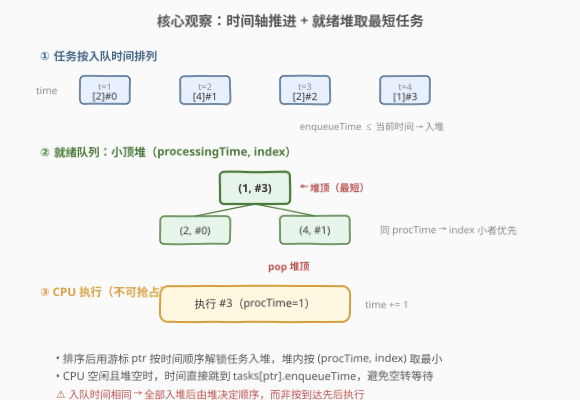
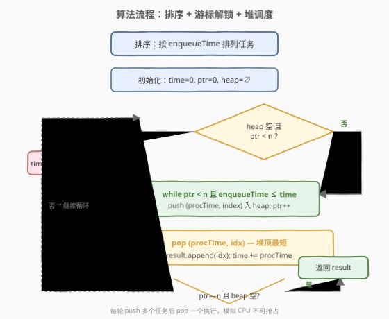
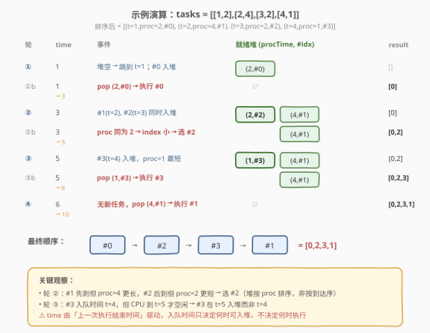

# 单线程 CPU

- **题目名称**：单线程 CPU
- **链接**：[1834. Single-Threaded CPU](https://leetcode.cn/problems/single-threaded-cpu/)
- **难度**：中等
- **标签**：堆、优先队列、排序、模拟、贪心

## 1. 题目概述

给定一个二维数组 `tasks`，其中 `tasks[i] = [enqueueTimei, processingTimei]` 表示第 `i` 项任务在 `enqueueTimei` 时刻进入队列，需要 `processingTimei` 的时长完成。有一个单线程 CPU 按如下规则运行：

- 若 CPU 空闲且队列中无任务，CPU 保持空闲。
- 若 CPU 空闲且队列中有任务，选择 **执行时间最短** 的任务开始执行；若最短执行时间相同，选择 **下标最小** 的任务。
- 一旦开始执行，CPU 在完成整个任务前不会停止（**不可抢占**）。
- 完成一项任务后可立即开始下一项。

返回 CPU 处理任务的顺序（下标数组）。

**示例 1**：

```text
输入：tasks = [[1,2],[2,4],[3,2],[4,1]]
输出：[0,2,3,1]
```

**示例 2**：

```text
输入：tasks = [[7,10],[7,12],[7,5],[7,4],[7,2]]
输出：[4,3,2,0,1]
```

**约束条件**：

- $\text{tasks.length} = n$，$1 \le n \le 10^5$
- $1 \le \text{enqueueTime}_i, \text{processingTime}_i \le 10^9$

> 💡 **关键直觉**：CPU 在每个时刻面对的候选集是动态变化的——任务按入队时间陆续到达，而 CPU 要从中选「执行时间最短」的。这是典型的「**时间驱动解锁 + 优先队列取最值**」调度模型：用排序管理到达顺序，用小顶堆维护当前可选任务中的最短者。

---

## 2. 解题思路

### 2.1 暴力思路：每轮线性扫描

每次 CPU 空闲时，扫描所有尚未执行的任务，筛出 `enqueueTime ≤ 当前时间` 的子集，再在其中找 `processingTime` 最小（同则 `index` 最小）的任务。单次扫描 $O(n)$，共 $n$ 轮，总 $O(n^2)$。$n = 10^5$ 时必超时。

> ⚠️ 瓶颈不在「找最值」本身（可用堆优化），而在于**任务到达是时间驱动的**——不能一次性把所有任务丢进堆，因为尚未到达的任务不可选。必须按时间推进逐步解锁。

### 2.2 核心观察：排序 + 小顶堆 + 游标



将问题拆成三件事：

1. **任务按到达顺序解锁**：把任务按 `enqueueTime` 排序，用游标 `ptr` 逐个推进。当前时间 `time` 到达某任务的 `enqueueTime` 时，该任务才可入堆。
2. **就绪任务用小顶堆管理**：堆中存 `(processingTime, index)`，堆顶即「执行时间最短、同则下标最小」的任务——恰好是 CPU 的选择。
3. **CPU 空闲时时间跳跃**：若 CPU 空闲（堆空）但还有未到达的任务，`time` 直接跳到 `tasks[ptr].enqueueTime`，避免空转。

三步循环：

```
while 还有任务未入堆 或 堆非空:
    if 堆空: time = tasks[ptr].enqueueTime      # 跳过空转
    while ptr < n 且 tasks[ptr].enqueueTime ≤ time:
        push (procTime, index) 入堆; ptr++
    pop 堆顶 (procTime, idx)
    result.append(idx)
    time += procTime
```

> ⚠️ **常见错误**：① 一次性把所有任务入堆——忽略了任务尚未到达；② 不做时间跳跃，CPU 空闲时 `time` 逐单位递增——`enqueueTime` 可达 $10^9$，必 TLE；③ 堆只存 `processingTime` 忘记存 `index`——同 `processingTime` 时无法正确按下标排序。

### 2.3 算法流程图



### 2.4 示例演算



以示例 1 `tasks = [[1,2],[2,4],[3,2],[4,1]]` 为例，排序后仍为原序（`enqueueTime` 已递增）：

| 轮次 | time | 事件 | 就绪堆 | result |
|------|------|------|--------|--------|
| ① | 1 | 堆空 → 跳到 t=1；#0 入堆 | {(2,#0)} | [] |
| ①b | 1→3 | pop (2,#0)，执行 #0 | ∅ | [0] |
| ② | 3 | #1(t=2)、#2(t=3) 入堆 | {(2,#2), (4,#1)} | [0] |
| ②b | 3→5 | proc 同为 2 → index 小 → 选 #2 | {(4,#1)} | [0,2] |
| ③ | 5 | #3(t=4) 入堆，proc=1 最短 | {(1,#3), (4,#1)} | [0,2] |
| ③b | 5→6 | pop (1,#3)，执行 #3 | {(4,#1)} | [0,2,3] |
| ④ | 6→10 | 无新任务，pop (4,#1)，执行 #1 | ∅ | [0,2,3,1] |

> 💡 **轮 ② 是本题精髓**：#1 先到达（t=2）但执行时间更长（4），#2 后到达（t=3）但执行时间更短（2）——CPU 在 t=3 时从两者中选 #2。这正说明选择依据是 `processingTime` 而非到达顺序，堆恰能高效维护这一选择。

---

## 3. 参考代码

### Python

```python
import heapq

class Solution:
    def getOrder(self, tasks: list[list[int]]) -> list[int]:
        n = len(tasks)
        # (enqueueTime, processingTime, index)
        indexed = sorted(
            (tasks[i][0], tasks[i][1], i) for i in range(n)
        )

        result = []
        heap = []
        time = 0
        ptr = 0

        while ptr < n or heap:
            # CPU 空闲且无就绪任务 → 跳到下一个任务的入队时间
            if not heap:
                time = max(time, indexed[ptr][0])

            # 把所有 enqueueTime ≤ time 的任务入堆
            while ptr < n and indexed[ptr][0] <= time:
                _, proc, idx = indexed[ptr]
                heapq.heappush(heap, (proc, idx))
                ptr += 1

            # 取执行时间最短（同则下标最小）的任务
            proc, idx = heapq.heappop(heap)
            result.append(idx)
            time += proc

        return result
```

### C++

```cpp
class Solution {
public:
    vector<int> getOrder(vector<vector<int>>& tasks) {
        int n = tasks.size();
        // (enqueueTime, processingTime, index)
        vector<tuple<int, int, int>> indexed;
        indexed.reserve(n);
        for (int i = 0; i < n; ++i) {
            indexed.emplace_back(tasks[i][0], tasks[i][1], i);
        }
        sort(indexed.begin(), indexed.end());

        // 小顶堆：(processingTime, index)
        priority_queue<pair<int, int>, vector<pair<int, int>>,
                       greater<pair<int, int>>> pq;

        vector<int> result;
        result.reserve(n);
        long long time = 0;
        int ptr = 0;

        while (ptr < n || !pq.empty()) {
            if (pq.empty()) {
                time = max(time, (long long)get<0>(indexed[ptr]));
            }
            while (ptr < n && get<0>(indexed[ptr]) <= time) {
                pq.emplace(get<1>(indexed[ptr]), get<2>(indexed[ptr]));
                ++ptr;
            }
            auto [proc, idx] = pq.top();
            pq.pop();
            result.push_back(idx);
            time += proc;
        }

        return result;
    }
};
```

> 💡 **实现细节**：① Python `sorted` 对元组按字典序排列，即先按 `enqueueTime` 排——同 `enqueueTime` 的排列顺序不影响正确性（它们都会在同一时刻入堆，由堆重排）。② 堆存 `(processingTime, index)` 而非 `(processingTime, enqueueTime, index)`，因为入堆后 `enqueueTime` 不再参与选择，省去冗余字段。③ C++ 中 `time` 用 `long long`：单次 `proc` 虽不超 $10^9$，但累加后可达 $n \times 10^9 = 10^{14}$，`int` 会溢出。④ `greater<pair<int,int>>` 对 `pair` 按字典序比较，即先比 `processingTime`、同则比 `index`，天然实现题目的双关键字排序。

---

## 4. 复杂度分析

| 维度 | 复杂度 | 说明 |
|------|--------|------|
| **时间** | $O(n \log n)$ | 排序 $O(n \log n)$；每个任务恰好入堆一次、出堆一次，共 $2n$ 次堆操作，每次 $O(\log n)$ |
| **空间** | $O(n)$ | 排序的索引数组 $O(n)$ + 堆最多存 $n$ 个任务 $O(n)$ |

> 💡 **摊还保证**：外层 `while` 看似嵌套了内层 `while`，但内层每轮必使 `ptr++`，`ptr` 从 0 单调增至 $n$，故内层总迭代次数恰为 $n$，不与外层相乘。

---

## 5. 扩展：与不可抢占调度的关系

本题是**非抢占式最短作业优先（SJF Non-preemptive）**调度的直接实现。在操作系统理论中：

- **SJF（Shortest Job First）**：每次从就绪队列选预计执行时间最短的任务，能最小化平均等待时间。
- **非抢占**：一旦开始执行就不会被新到达的更短任务打断——这正是本题的约束。

若改为**抢占式 SJF（SRTF, Shortest Remaining Time First）**，则每当新任务到达且其 `processingTime` 小于当前运行任务的**剩余时间**时，需暂停当前任务切换。此时需要额外的「剩余时间」跟踪和更复杂的事件驱动逻辑。

> 💡 本题之所以能用堆而非事件队列，关键在于**不可抢占**——CPU 只在任务完成时才重新选择，选择点数量恰为 $n$。若改为抢占式，每个任务到达也是一个选择点，但仍可用堆维护，只是事件种类从「完成」变为「完成 + 到达」。

---

## 6. 面试要点

1. **为什么不能一次性把所有任务入堆？**

   > 任务有 `enqueueTime` 约束——尚未到达的任务不在候选集中。若一次性入堆，CPU 可能在 t=1 时选择一个 t=100 才到达的任务，违反题意。必须用游标 `ptr` 按时间推进逐步解锁。

2. **CPU 空闲时如何处理时间跳跃？为什么不能逐单位递增？**

   > `enqueueTime` 可达 $10^9$，逐单位递增会 TLE。当堆空且仍有未到达任务时，直接 `time = tasks[ptr].enqueueTime` 跳跃到下一个任务的到达时刻——中间这段时间 CPU 确实无事可做，跳跃是正确且必要的。

3. **堆的元素为什么是 `(processingTime, index)` 而不是 `(processingTime, enqueueTime, index)`？**

   > 入堆时 `enqueueTime ≤ time` 已满足，之后不再参与选择。选择依据是「执行时间最短、同则下标最小」，只需 `(processingTime, index)` 双关键字。多存 `enqueueTime` 是冗余。

4. **`time` 为什么要用 `long long`（C++）？**

   > 单次 `processingTime` 虽不超 $10^9$，但 $n = 10^5$ 个任务串行执行后 `time` 可达 $10^{14}$，远超 `int` 的 $2.1 \times 10^9$ 上限。Python 天然大整数无此问题。

5. **内层 `while` 会不会导致总复杂度退化到 $O(n^2)$？**

   > 不会。内层 `while` 每轮使 `ptr++`，`ptr` 从 0 单调增至 $n$，总迭代次数恰为 $n$。每个任务入堆一次、出堆一次，堆操作总数 $2n$，每次 $O(\log n)$，总 $O(n \log n)$。

> 💡 **一句话总结**：排序按 `enqueueTime` + 游标 `ptr` 解锁入堆 + 小顶堆 `(procTime, index)` 取最短 + 空闲时时间跳跃。$O(n \log n)$ 模拟不可抢占 SJF 调度。

---

## 7. 同类练习题

- [1882. 使用服务器处理任务](https://leetcode.cn/problems/process-tasks-using-servers/)：双堆（空闲服务器堆 + 忙碌服务器按完成时间堆）在线调度，与本题「时间驱动 + 堆取最优」同范式，增加了多服务器维度
- [502. IPO](https://leetcode.cn/problems/ipo/)（[题解](../0501-0600/502_IPO.md)）：排序按资本解锁 + 大顶堆取最大利润，与本题「游标解锁 + 堆取最值」思想一脉相承（方向相反：取最大而非最小）
- [1801. 积压订单中的订单总数](https://leetcode.cn/problems/number-of-orders-in-the-backlog/)（[题解](../1801-1900/1801_积压订单中的订单总数.md)）：双堆在线撮合 + 批量消减，同属「堆维护动态最值 + 在线处理」家族
- [1705. 吃苹果的最大数量](https://leetcode.cn/problems/maximum-number-of-eaten-apples/)（[题解](../1701-1800/1705_吃苹果的最大数目.md)）：按天数推进 + 小顶堆按腐烂日期取最优苹果，与本题「时间驱动 + 堆调度」结构高度一致
