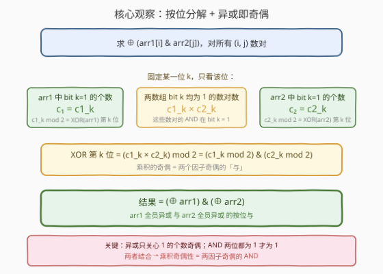
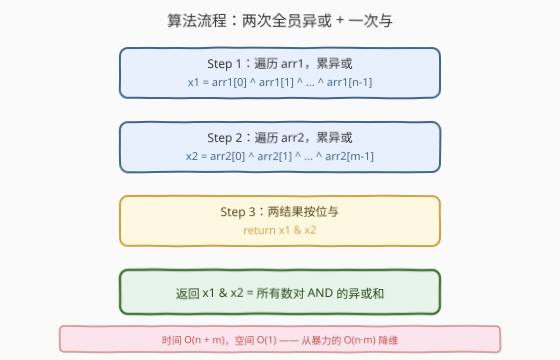
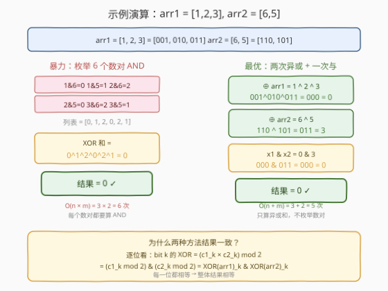

# LeetCode 所有数对按位与结果的异或和 题解

## 1. 题目概述

- **标题 / 题号**：所有数对按位与结果的异或和（#1835，hard）
- **链接**：https://leetcode.cn/problems/find-xor-sum-of-all-pairs-bitwise-and/
- **难度**：困难
- **标签**：位运算、数学、数组

**题意**：给定两个下标从 0 开始的非负整数数组 `arr1` 和 `arr2`。对每个数对 $(i, j)$（$0 \le i < \text{arr1.length}$，$0 \le j < \text{arr2.length}$），构造 `arr1[i] & arr2[j]`（按位与）。返回所有这些按位与结果的**异或和**（XOR sum）。

> 列表的**异或和**指对所有元素逐个异或的结果。例如 $[1,2,3,4]$ 的异或和 $= 1 \oplus 2 \oplus 3 \oplus 4 = 4$。

**示例 1**：

```text
输入：arr1 = [1,2,3], arr2 = [6,5]
输出：0
解释：列表 = [1&6, 1&5, 2&6, 2&5, 3&6, 3&5] = [0,1,2,0,2,1]
      异或和 = 0 ^ 1 ^ 2 ^ 0 ^ 2 ^ 1 = 0
```

**示例 2**：

```text
输入：arr1 = [12], arr2 = [4]
输出：4
解释：列表 = [12 & 4] = [4]，异或和 = 4
```

**约束**：

- $1 \le \text{arr1.length}, \text{arr2.length} \le 10^5$
- $0 \le \text{arr1}[i], \text{arr2}[j] \le 10^9$

> 💡 **关键观察**：暴力枚举所有 $n \times m$ 个数对是 $O(10^{10})$，必超时。突破口在于**异或的按位独立性**——可以逐位分析。对每一位 $k$，`arr1[i] & arr2[j]` 在该位为 1 当且仅当 arr1[i] 和 arr2[j] 在该位**都为 1**。于是该位上 1 的总数 $= c_1^{(k)} \times c_2^{(k)}$（两个数组中该位为 1 的元素个数之积），而异或只关心这个总数的**奇偶性**。关键等式：$(a \times b) \bmod 2 = (a \bmod 2) \mathrel{\&} (b \bmod 2)$——乘积的奇偶等于两因子奇偶的按位与。而 $c_1^{(k)} \bmod 2$ 恰好是 $\bigoplus \text{arr1}$ 第 $k$ 位的值。因此最终答案 $= \left(\bigoplus \text{arr1}\right) \mathrel{\&} \left(\bigoplus \text{arr2}\right)$，只需 $O(n + m)$。

## 2. 解题思路

### 2.1 暴力思路：枚举所有数对

双重循环枚举所有 $(i, j)$，计算 `arr1[i] & arr2[j]`，异或累加。时间复杂度 $O(n \cdot m)$，当 $n = m = 10^5$ 时约 $10^{10}$ 次运算，严重超时。

> ⚠️ **症结**：逐个数对计算 AND 完全忽略了「异或」的代数结构。异或不是普通加法——它**按位独立**且**只关心 1 的奇偶个数**。这给了我们「逐位聚合」的可能：不必算出每个数对的 AND 值，只需知道每一位上有多少个数对的 AND 结果在该位为 1，再判奇偶即可。

### 2.2 核心观察：按位分解 + 乘积奇偶性



**第一步：异或的按位独立性。**

异或运算的每一位互不影响——第 $k$ 位的异或结果只取决于所有操作数在第 $k$ 位上 1 的个数是奇还是偶。因此可以**固定某一位 $k$，单独分析**。

**第二步：AND 在某位为 1 的条件。**

`arr1[i] & arr2[j]` 在第 $k$ 位为 1，当且仅当 arr1[i] 和 arr2[j] 在第 $k$ 位**都为 1**。设：

- $c_1^{(k)}$ = arr1 中第 $k$ 位为 1 的元素个数
- $c_2^{(k)}$ = arr2 中第 $k$ 位为 1 的元素个数

则所有 $n \times m$ 个数对中，AND 结果在第 $k$ 位为 1 的数对数为 $c_1^{(k)} \times c_2^{(k)}$（从 arr1 的 $c_1^{(k)}$ 个「1」中选一个、arr2 的 $c_2^{(k)}$ 个「1」中选一个，组合数即乘积）。

**第三步：异或只关心奇偶 → 乘积奇偶性。**

第 $k$ 位的异或结果 $= \left(c_1^{(k)} \times c_2^{(k)}\right) \bmod 2$。关键等式：

$$\boxed{(a \times b) \bmod 2 = (a \bmod 2) \mathrel{\&} (b \bmod 2)}$$

**证明**：$a \times b$ 为奇数当且仅当 $a$ 和 $b$ 同时为奇数（奇×奇=奇，其余为偶）。而 $a \bmod 2$ 和 $b \bmod 2$ 恰好是 $a, b$ 的奇偶标志（0 或 1），两者的按位与恰在「都为 1」时为 1——完美对应「同时为奇」。

**第四步：奇偶性 = 异或结果的对应位。**

$c_1^{(k)} \bmod 2$ 是什么？arr1 中第 $k$ 位为 1 的元素个数的奇偶性——这恰好等于 $\bigoplus_{i} \text{arr1}[i]$ 在第 $k$ 位的值（异或就是数 1 的奇偶）。同理 $c_2^{(k)} \bmod 2 = \left(\bigoplus_j \text{arr2}[j]\right)_k$。

综合四步：

$$\boxed{\text{结果} = \left(\bigoplus_{i} \text{arr1}[i]\right) \mathrel{\&} \left(\bigoplus_{j} \text{arr2}[j]\right)}$$

> 💡 **为什么这么优美？** 「异或」数 1 的奇偶，「与」要求两位都为 1。「乘积的奇偶」恰好等于「两因子奇偶的与」——这是数论中一个朴素的事实（奇×奇=奇），但它让 $O(n \cdot m)$ 的数对枚举直接坍缩为 $O(n + m)$ 的两次全员异或。本质上，我们利用了异或的**线性性**（按位独立 + 只看奇偶）把「数对的 AND」拆解为「单数组的奇偶统计」。

### 2.3 算法流程图



**步骤**：

1. **遍历 arr1**，累异或得 $x_1 = \text{arr1}[0] \oplus \text{arr1}[1] \oplus \cdots \oplus \text{arr1}[n-1]$。
2. **遍历 arr2**，累异或得 $x_2 = \text{arr2}[0] \oplus \text{arr2}[1] \oplus \cdots \oplus \text{arr2}[m-1]$。
3. **返回** $x_1 \mathbin{\&} x_2$。

> 💡 **为何无需特殊处理？** 两个数组各自异或时，元素顺序不影响结果（异或满足交换律与结合律）。$x_1$ 和 $x_2$ 都是非负整数（数组元素非负），按位与直接给出答案，无需考虑符号或溢出。$10^9 < 2^{30}$，30 位运算在所有语言中都是 $O(1)$。

### 2.4 示例演算

以示例 1 `arr1 = [1, 2, 3]`、`arr2 = [6, 5]` 为例（用 3 位二进制演示）：



| 数 | 3 位二进制 |
|----|-----------|
| 1  | 001 |
| 2  | 010 |
| 3  | 011 |
| 6  | 110 |
| 5  | 101 |

**暴力**：6 个数对的 AND $= [1\&6, 1\&5, 2\&6, 2\&5, 3\&6, 3\&5] = [0, 1, 2, 0, 2, 1]$，异或和 $= 0 \oplus 1 \oplus 2 \oplus 0 \oplus 2 \oplus 1 = 0$。

**最优**：
- $x_1 = 1 \oplus 2 \oplus 3 = 001 \oplus 010 \oplus 011 = 000 = 0$
- $x_2 = 6 \oplus 5 = 110 \oplus 101 = 011 = 3$
- 结果 $= 0 \mathbin{\&} 3 = 000 \mathbin{\&} 011 = 000 = 0$ ✓

> 💡 **逐位验证**：以 bit 2（最高位）为例。arr1 中 bit2=1 的元素：无（1=001, 2=010, 3=011，bit2 均为 0），$c_1^{(2)} = 0$。所以该位上 AND 为 1 的数对数 $= 0 \times c_2^{(2)} = 0$（偶），异或结果 bit2 = 0。对应 $x_1$ bit2 $= 0$，$x_2$ bit2 $= 0$，AND $= 0$ ✓。再看 bit 1：arr1 中 bit1=1 的有 $\{2, 3\}$（$c_1^{(1)} = 2$，偶），$c_1^{(1)} \bmod 2 = 0$，所以该位异或结果 $= 0$。对应 $x_1$ bit1 $= 0$，AND 后仍为 $0$ ✓。

## 3. 参考代码

### C++

```cpp
class Solution {
public:
    int getXORSum(vector<int>& arr1, vector<int>& arr2) {
        int x1 = 0, x2 = 0;
        for (int v : arr1) x1 ^= v;
        for (int v : arr2) x2 ^= v;
        return x1 & x2;
    }
};
```

### Python

```python
class Solution:
    def getXORSum(self, arr1: List[int], arr2: List[int]) -> int:
        x1 = 0
        for v in arr1:
            x1 ^= v
        x2 = 0
        for v in arr2:
            x2 ^= v
        return x1 & x2
```

> 💡 **Python 简洁版**：可用 `functools.reduce(operator.xor, arr1, 0)` 一行求异或和，但显式循环更清晰且常数更小。Python 整数无限精度，无需掩码——数组元素非负，异或结果也非负，按位与语义与 C++ 完全一致。

> ⚠️ **注意区分 `&` 和 `^`**：最终一步是**按位与** `&`（不是异或 `^`）。乘积奇偶性对应的是「两因子都为奇」即 AND，而非 XOR。若误写为 `x1 ^ x2` 会在多数测试用例上出错。

## 4. 复杂度分析

| 维度 | 复杂度 | 说明 |
|------|--------|------|
| 时间 | $O(n + m)$ | 遍历 arr1 做 $n$ 次异或 + 遍历 arr2 做 $m$ 次异或 + 1 次按位与 |
| 空间 | $O(1)$ | 仅用 `x1`、`x2` 两个变量 |

> 💡 **与暴力对比**：暴力 $O(n \cdot m) \approx 10^{10}$；本解法 $O(n + m) \approx 2 \times 10^5$，快约 $10^5$ 倍。核心增益来自「按位分解 + 乘积奇偶性」把数对枚举降维为单数组统计。

## 5. 扩展：更一般的「数对运算的异或和」

本题的思路可以推广到一类问题：**求所有数对 $(i, j)$ 的某种位运算结果的异或和**。关键在于：

| 数对运算 | 异或和能否化简？ | 化简结果 |
|----------|------------------|----------|
| `arr1[i] & arr2[j]`（本题） | ✅ 能 | $(\oplus \text{arr1}) \mathbin{\&} (\oplus \text{arr2})$ |
| `arr1[i] \| arr2[j]` | ✅ 能 | $(\oplus \text{arr1}) \mathbin{\|} (\oplus \text{arr2})$ 的补——更精确地，利用 $\text{a \| b} = \neg(\neg a \mathbin{\&} \neg b)$，可得结果 $= \neg\left((\oplus \neg\text{arr1}) \mathbin{\&} (\oplus \neg\text{arr2})\right)$ 在固定位宽下 |
| `arr1[i] ^ arr2[j]` | ✅ 能 | 若 $n$ 为偶数则结果 $= 0$（每个 arr1 元素被异或 $m$ 次，偶数次消去）；若 $n$ 为奇数则 $= \oplus \text{arr2}$（类似分析） |

> 💡 **核心原则**：只要数对运算在每一位上满足「该位结果 = arr1 该位 × arr2 该位」的某种**乘法结构**，就能用乘积奇偶性化简。AND 和 OR 都满足（AND 是直接乘法，OR 可通过 De Morgan 转化为 AND）。XOR 不满足乘法结构，但 XOR 有更简单的性质——每个元素被使用对方长度次，直接判奇偶即可。

## 6. 面试要点

**Q1：为什么可以「逐位分析」而不影响正确性？**

> 异或运算的每一位是**完全独立**的——第 $k$ 位的异或结果只取决于所有操作数在第 $k$ 位上 1 的个数的奇偶，与其它位无关。因此可以把一个 $30$ 位的异或和问题拆成 $30$ 个独立的「单 bit」问题，逐位求解后再拼回整数。这是所有「异或 + 位运算」问题的通用分析手法。

**Q2：$(a \times b) \bmod 2 = (a \bmod 2) \mathbin{\&} (b \bmod 2)$ 为什么成立？**

> $a \times b$ 为奇数当且仅当 $a, b$ 同时为奇数（奇×奇=奇，奇×偶=偶，偶×偶=偶）。$a \bmod 2$ 和 $b \bmod 2$ 是奇偶标志（1=奇，0=偶），按位与恰在「两者都为 1」时为 1——对应「同时为奇」即「乘积为奇」。这把「数对计数」的奇偶判断转化为「两个单数组奇偶标志的与」。

**Q3：为什么 $c_1^{(k)} \bmod 2$ 等于 $\bigoplus \text{arr1}$ 的第 $k$ 位？**

> $\bigoplus \text{arr1}$ 的第 $k$ 位 $=$ arr1 所有元素在第 $k$ 位的异或 $= $ 「第 $k$ 位为 1 的元素个数」$\bmod 2$（因为 $1 \oplus 1 = 0$ 消去成对，$0$ 不影响）。而这个「个数」正是 $c_1^{(k)}$。所以 $c_1^{(k)} \bmod 2 = (\bigoplus \text{arr1})_k$。这一步把「统计某位为 1 的元素个数」与「全员异或」画上了等号。

**Q4：如果题目改为求所有数对 `arr1[i] | arr2[j]` 的异或和，怎么解？**

> 利用 De Morgan 律：$a \| b = \neg(\neg a \mathbin{\&} \neg b)$。对固定位宽（如 30 位），把 arr1、arr2 每个元素取反（`~v & MASK`），套用本题结论得 $(\oplus \neg\text{arr1}) \mathbin{\&} (\oplus \neg\text{arr2})$，最后整体取反即得 OR 版的异或和。关键是「OR 的该位为 1」等价于「取反后 AND 的该位为 0」，乘积奇偶性仍适用。

**Q5：最后一步为什么是 `&` 而不是 `^`？**

> 乘积的奇偶性 $= (a \bmod 2) \mathbin{\&} (b \bmod 2)$，是「与」不是「异或」。直观理解：「乘积为奇」要求两因子**同时**为奇，这是 AND 语义（都为 1 才为 1），而非 XOR 语义（不同才为 1）。若误用 `^`，会在「一个数组某位奇偶为 1、另一个为 0」时给出错误结果。

> 💡 **一句话总结**：逐位看，AND 数对中该位为 1 的个数 $= c_1^{(k)} \times c_2^{(k)}$，异或只取奇偶 $= (c_1^{(k)} \bmod 2) \mathbin{\&} (c_2^{(k)} \bmod 2) = (\oplus \text{arr1})_k \mathbin{\&} (\oplus \text{arr2})_k$，逐位拼回即得结果 $= (\oplus \text{arr1}) \mathbin{\&} (\oplus \text{arr2})$。

## 同类练习题

| # | 题目 | 与本题的关联 |
|---|------|-------------|
| 371 | [两整数之和](https://leetcode.cn/problems/sum-of-two-integers/)（[题解](../0301-0400/371_两整数之和.md)） | 位运算模拟加法的母题——展示异或「无进位和」与按位与「进位」的拆分，与本题「异或即奇偶、与即同时为 1」互为补充，打牢按位思考基本功 |
| 136 | [只出现一次的数字](https://leetcode.cn/problems/single-number/) | 异或消去律 $x \oplus x = 0$ 的经典应用——与本题「异或只关心 1 的奇偶个数」同源，展示异或的线性性 |
| 1442 | [形成两个异或相等数组的三元组数目](https://leetcode.cn/problems/count-triplets-that-can-form-two-arrays-of-equal-xor/) | 异或前缀性质 + 计数——利用 $a = b \Leftrightarrow a \oplus b = 0$ 把三元组计数转为同值下标对计数，是异或代数性质的另一应用 |
| 1803 | [统计异或值在范围内的数对有多少](https://leetcode.cn/problems/count-pairs-with-xor-in-a-range/)（[题解](1803_统计异或值在范围内的数对有多少.md)） | 数对异或的计数问题——同样是「数对 + 位运算」，但目标是计数而非求异或和，用二进制 Trie 而非代数化简 |
| 1720 | [解码异或后的数组](https://leetcode.cn/problems/decode-xored-array/)（[题解](../1701-1800/1720_解码异或后的数组.md)） | 异或的可逆性——利用 $a \oplus b = c \Leftrightarrow b = a \oplus c$ 由前缀异或反推原数组，与本题「异或即奇偶统计」展示同一运算的两种视角：前者用可逆性解码，后者用奇偶性化简 |
