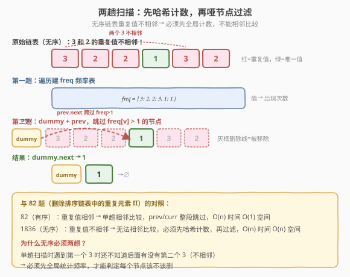
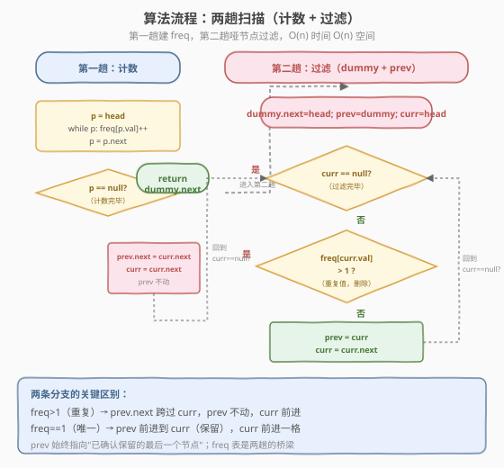
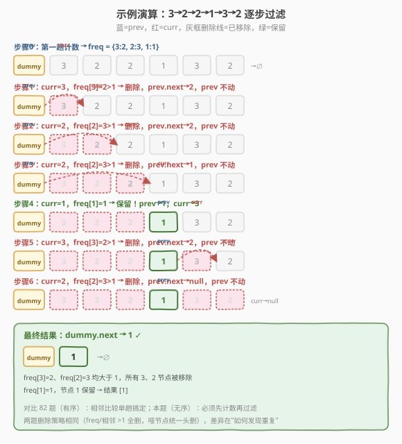

# LeetCode 从未排序的链表中移除重复元素 题解

## 1. 题目概述

- **标题 / 题号**：从未排序的链表中移除重复元素（#1836，medium）
- **链接**：https://leetcode.cn/problems/remove-duplicates-from-an-unsorted-linked-list/
- **难度**：中等
- **标签**：链表、哈希表

**题意**：给定一个**未排序**的单链表的头节点 `head`，删除链表中所有**出现超过一次**的值的节点——即若某个值在链表里出现 $\geq 2$ 次，则该值对应的**所有节点**都要删除，一个不留。返回结果链表的头节点。

**与 [82 题](../0001-0100/82_删除排序链表中的重复元素II.md) 的关键区别**：82 题链表**已排序**（重复值相邻，可单趟相邻比较）；本题链表**无序**，重复值可能分散在任意位置，**无法**靠相邻比较发现，必须先全局统计频率。

**示例 1**：

```text
输入：head = [1,2,3,2]
输出：[1,3]
解释：2 出现两次，全部删除；1、3 各出现一次，保留。
```

**示例 2**：

```text
输入：head = [2,1,1,2]
输出：[]
解释：2 出现两次、1 出现两次，全部删除，链表为空。
```

**示例 3**：

```text
输入：head = [3,2,2,1,3,2]
输出：[1]
解释：3 出现两次、2 出现三次，全部删除；1 出现一次，保留。
```

**约束**：

- 链表中节点数目在范围 `[1, 10^5]` 内
- `1 <= Node.val <= 10^5`

> 💡 本题是 82 题的"无序版"——同样是"重复值全删"，但前提从"已排序"变为"无序"。这一变化看似微小，却从根本上改变了"如何发现重复"：82 题靠相邻比较（`curr.val == curr.next.val`）单趟搞定，`O(1)` 空间；本题重复值不相邻，遇到第一个某值时**还不知道后面还有没有相同的值**，必须先全局计数，再据频率过滤，空间升到 `O(n)`。

## 2. 解题思路

### 2.1 暴力思路：每个节点都全表搜一遍

对每个节点，遍历整个链表看它的值是否还在别处出现，若是则删除。

- 时间 `O(n^2)`，`n` 到 `10^5` 必然超时。
- 没有意识到"频率"是可以**预先一次性算好**的全局信息。

> ⚠️ 暴力法的根本问题：把"判定某个值是否重复"这个**可预计算**的查询，退化成了每次 `O(n)` 的实时搜索。其实只需遍历一遍把每个值的出现次数存进哈希表，之后每个节点的去留判定就变成 `O(1)` 查表——总时间降为 `O(n)`。

### 2.2 核心观察：两趟扫描——先哈希计数，再哑节点过滤

本题的解法拆成**两趟**，以哈希频率表为桥梁：

**第一趟（计数）**：遍历链表，用哈希表 `freq` 统计每个值的出现次数。

**第二趟（过滤）**：引入**哑节点** `dummy`（`dummy.next = head`），用 `prev/curr` 双指针遍历：

- `prev`：始终指向**已确认保留的最后一个节点**。
- `curr`：当前正在判定的节点。

**两条分支**（判定依据从 82 题的"相邻比较"换成"查 freq 表"）：

1. **重复**（`freq[curr.val] > 1`）：`curr` 要删。令 `prev.next = curr.next`（跨过 `curr`），`curr = curr.next`。**`prev` 不动**——因为新 `curr` 也可能是重复值。

2. **唯一**（`freq[curr.val] == 1`）：`curr` 保留。`prev = curr`（prev 前进），`curr = curr.next`。



**为什么无序必须两趟？** 单趟扫描时，遇到第一个 `3`（示例 3 的位置 0），此刻无法知道位置 4 还有一个 `3`——重复值不相邻，"向后看一眼"不够。只有先全局统计频率，才能在第二趟里对每个节点立刻做出 `O(1)` 的去留判定。哈希表把"是否重复"这个全局信息**预计算并缓存**，第二趟只需查表。

> 💡 **与 82 题的对照**：两题的**删除策略完全相同**——都是"重复值全删 + 哑节点统一头删 + prev 守锚点跨过被删节点"。唯一差异在**如何发现重复**：82 题利用有序性（相邻比较，`O(1)` 空间）；本题失去有序性，改用哈希计数（`O(n)` 空间）。可以理解为：**有序性是一种"免费的频率信息"**，一旦失去，就得自己用 `O(n)` 空间把它算回来。

### 2.3 算法流程图



**完整步骤**：

1. **第一趟计数**：`p = head`，`while p`：`freq[p.val]++`，`p = p.next`。
2. **第二趟过滤**：`dummy = ListNode(0, head)`，`prev = dummy`，`curr = head`。
3. **循环**：当 `curr != null`：
   - 若 `freq[curr.val] > 1`：`prev.next = curr.next`（跨过 curr），`curr = curr.next`（prev 不动）。
   - 否则：`prev = curr`（保留），`curr = curr.next`。
4. **返回** `dummy.next`。

> ⚠️ **prev 在重复分支中不前进**：跨过 `curr` 后，新的 `curr`（原 `curr.next`）也可能是个重复值。若 `prev` 贸然前进到它，而它恰要被删，`prev` 就指向了待删节点——逻辑出错。`prev` 必须守在最后一个**确认保留**的节点处，等 `curr` 确认唯一后才前进。这与 82 题"prev 守锚点"的思想完全一致。

### 2.4 示例演算

以 `head = [3,2,2,1,3,2]`（示例 3）为例，注意两个 `3` 分散在位置 0 和 4、三个 `2` 分散在位置 1、2、5——**都不相邻**：



| 步骤 | prev 位置 | curr 位置 | freq[curr.val] | 判断 | 动作 |
|------|-----------|-----------|----------------|------|------|
| 步骤 0 | — | — | — | 第一趟 | freq = {3:2, 2:3, 1:1} |
| 步骤 1 | dummy | 3（位0） | 2 | >1 删除 | prev.next→2，prev 不动 |
| 步骤 2 | dummy | 2（位1） | 3 | >1 删除 | prev.next→2，prev 不动 |
| 步骤 3 | dummy | 2（位2） | 3 | >1 删除 | prev.next→1，prev 不动 |
| 步骤 4 | dummy | 1（位3） | 1 | ==1 保留 | prev→1，curr→3 |
| 步骤 5 | 1 | 3（位4） | 2 | >1 删除 | prev.next→2，prev 不动 |
| 步骤 6 | 1 | 2（位5） | 3 | >1 删除 | prev.next→null，curr→null |
| 结束 | 1 | null | — | curr==null | 返回 dummy.next → **1** |

注意步骤 1–3：`prev` 始终停在 `dummy`，连续跨过三个重复节点（3、2、2），直到步骤 4 遇到唯一的 `1` 才前进。步骤 5–6 `prev` 停在 `1`，再次跨过末尾的 3、2，最终 `prev.next = null`，结果只剩 `1`。

> 💡 **对比 82 题的同思路**：82 题处理 `[1,2,3,3,4,4,5]` 时，重复的 3、4 **相邻**，`prev` 停在 2 一次跳过 `3→3` 即可。本题重复值**分散**，`prev` 要逐个跨过（步骤 1 跨 3、步骤 2 跨 2、步骤 3 跨 2……），但靠 `freq` 表每次都能 `O(1)` 判定，无需回头搜索。

## 3. 参考代码

### C++

```cpp
/**
 * Definition for singly-linked list.
 * struct ListNode {
 *     int val;
 *     ListNode *next;
 *     ListNode() : val(0), next(nullptr) {}
 *     ListNode(int x) : val(x), next(nullptr) {}
 *     ListNode(int x, ListNode *next) : val(x), next(next) {}
 * };
 */
class Solution {
  public:
    ListNode* deleteDuplicatesUnsorted(ListNode* head) {
        // 第一趟：哈希计数
        unordered_map<int, int> freq;
        for (ListNode* p = head; p != nullptr; p = p->next) {
            freq[p->val]++;
        }

        // 第二趟：哑节点 + prev/curr 过滤
        ListNode* dummy = new ListNode(0, head);
        ListNode* prev = dummy;
        ListNode* curr = head;

        while (curr != nullptr) {
            if (freq[curr->val] > 1) {
                prev->next = curr->next;      // 跨过 curr，prev 不动
                curr = curr->next;
            } else {
                prev = curr;                  // 保留，prev 前进
                curr = curr->next;
            }
        }

        return dummy->next;
    }
};
```

### Python

```python
# Definition for singly-linked list.
# class ListNode:
#     def __init__(self, val=0, next=None):
#         self.val = val
#         self.next = next
class Solution:
    def deleteDuplicatesUnsorted(self, head: Optional[ListNode]) -> Optional[ListNode]:
        # 第一趟：哈希计数
        freq = {}
        p = head
        while p:
            freq[p.val] = freq.get(p.val, 0) + 1
            p = p.next

        # 第二趟：哑节点 + prev/curr 过滤
        dummy = ListNode(0, head)
        prev = dummy
        curr = head

        while curr:
            if freq[curr.val] > 1:
                prev.next = curr.next           # 跨过 curr，prev 不动
                curr = curr.next
            else:
                prev = curr                    # 保留，prev 前进
                curr = curr.next

        return dummy.next
```

> 💡 两版代码逻辑完全一致。与 82 题代码相比，**结构几乎相同**（哑节点 + prev/curr + 两条分支），只有两处差异：(1) 开头多了第一趟 `freq` 计数；(2) 第二趟的判定条件从 `curr.val == curr.next.val`（相邻比较）换成 `freq[curr.val] > 1`（查表），且不再需要内层 `while` 跳过整组——因为无序链表里同值节点不相邻，逐个判定即可。

## 4. 复杂度分析

| 维度 | 复杂度 | 说明 |
|------|--------|------|
| **时间复杂度** | `O(n)` | 第一趟计数遍历一次 `O(n)`，第二趟过滤遍历一次 `O(n)`，总计 `O(n)` |
| **空间复杂度** | `O(n)` | 哈希表 `freq` 存所有不同值的出现次数，最坏 `n` 个不同值 `O(n)`；另用 `dummy`/`prev`/`curr` 常数指针 |

> ⚠️ **与 82 题的空间对比**：82 题 `O(1)` 空间，本题 `O(n)` 空间。多出的 `O(n)` 是"无序性"的代价——失去了"相邻即重复"的有序性，就得用哈希表把全局频率信息显式存下来。这是**时间换空间的反面**：这里是用**空间换"判定能力"**，没有 `freq` 表就无法在单趟里判定分散的重复值。

## 5. 扩展：值域较小时用数组代替哈希表

若约束保证 `Node.val` 取值范围较小（如 `1 <= Node.val <= 10^5`），可用**定长数组**代替哈希表：

```cpp
int freq[100001] = {0};
for (ListNode* p = head; p; p = p->next) freq[p->val]++;
```

- 数组下标直接对应值，访问比 `unordered_map` 更快（无哈希开销，缓存友好）。
- 空间仍为 `O(V)`（`V` 为值域大小），当 `V` 与 `n` 同阶时即 `O(n)`。
- 若值域很大或含负数，则哈希表更通用——本题约束 `1 <= Node.val <= 10^5`，两种做法皆可，数组版常数更优。

> 💡 **数组 vs 哈希表的取舍**：值域 `V` 远小于 `n` 时数组更优（`O(V)` 空间，访问 `O(1)` 且常数小）；值域与 `n` 同阶或更大、或值离散稀疏时，哈希表 `O(n)` 空间更省。面试中可先写哈希表（通用），再提及"值域小可换数组优化常数"，展示对底层的敏感度。

## 6. 面试要点

1. **和 82 题的核心差异是什么？**

   - **82（有序）**：链表已排序，重复值相邻 → 单趟相邻比较（`curr.val == curr.next.val`），内层 `while` 跳过整组，`O(n)` 时间 `O(1)` 空间。
   - **1836（无序）**：链表无序，重复值分散 → 无法相邻比较，必须先哈希计数，再据 `freq` 过滤，`O(n)` 时间 `O(n)` 空间。
   - 两题**删除策略相同**（重复全删 + 哑节点 + prev 守锚点），差异仅在"如何发现重复"。

2. **为什么无序链表不能像 82 题那样单趟解决？**

   - 单趟扫描遇到第一个某值时，**不知道后面还有没有相同的值**（不相邻，向后看一眼不够）。
   - 必须先全局统计频率，才能对每个节点立刻做出 `O(1)` 去留判定。
   - 有序性是一种"免费的频率信息"——一旦失去，就得用 `O(n)` 空间把频率信息算回来。

3. **prev 在重复分支中为什么不前进？**

   - 跨过 `curr` 后，新的 `curr`（原 `curr.next`）也可能是重复值（如 `[3,2,2]` 连续三个都重复）。
   - 若 `prev` 前进到这个新 `curr`，而它恰要被删，`prev` 就指向了待删节点——逻辑出错。
   - `prev` 守在最后一个**确认保留**的节点处，等 `curr` 确认唯一后才前进。与 82 题完全一致。

4. **为什么需要哑节点？**

   - 头节点本身可能是重复值（如示例 2 `[2,1,1,2]`，头节点 `2` 要被删）。
   - 哑节点让 `prev` 一开始指向 `dummy`，`prev.next` 可安全跨过头节点，统一"头删"与"非头删"边界，最终返回 `dummy.next`。与 82 题同理。

5. **能否合并成一趟？**

   - 不能。判定一个节点是否该删，需要知道该值在**整条链表**中的总出现次数，这个信息只有在遍历完整条链表后才完备。
   - 一趟扫描里"边走边删"会漏判：删掉第一个 `3` 后，无法在遇到第二个 `3` 时回溯补救。两趟是信息依赖决定的，非实现技巧。

> 💡 **一句话总结**：1836 是 82 的无序版——同样的"重复全删 + 哑节点 + prev 守锚点"删除策略，但失去了"重复相邻"的有序性，改用**两趟扫描**：第一趟哈希计数建 `freq`，第二趟据 `freq > 1` 逐节点过滤。`O(n)` 时间 `O(n)` 空间，多出的空间是无序性的代价。核心是"**有序性 = 免费的频率信息，失去则用哈希表买回来**"。

## 同类练习题

| # | 题目 | 与本题的关联 |
|---|------|-------------|
| 82 | [删除排序链表中的重复元素 II](https://leetcode.cn/problems/remove-duplicates-from-sorted-list-ii/)（[题解](../0001-0100/82_删除排序链表中的重复元素II.md)） | 本题的"有序版"，单趟相邻比较 `O(1)` 空间，前置题 |
| 83 | [删除排序链表中的重复元素](https://leetcode.cn/problems/remove-duplicates-from-sorted-list/) | 重复留一的有序版，单指针相邻比较，82/1836 的最简前置 |
| 203 | [移除链表元素](https://leetcode.cn/problems/remove-linked-list-elements/) | 删除等于给定值的所有节点，哑节点统一头删，比本题更简单（不需频率判定） |
| 21 | [合并两个有序链表](https://leetcode.cn/problems/merge-two-sorted-lists/) | 哑节点 + 双指针的另一经典应用，"prev/tail 锚定 + 逐节点调整 next" |
| 19 | [删除链表的倒数第 N 个节点](https://leetcode.cn/problems/remove-nth-node-from-end-of-list/) | 哑节点防止删除头节点时的空指针，同一哑节点模式 |
