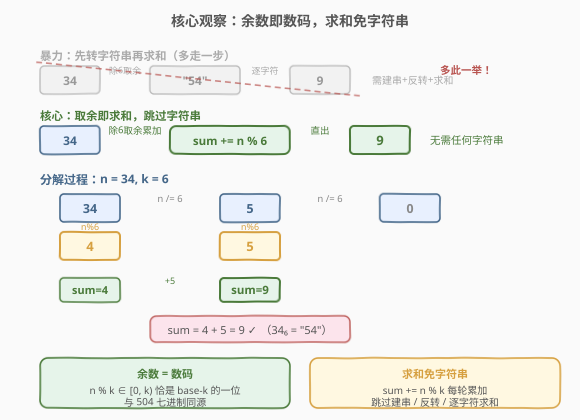
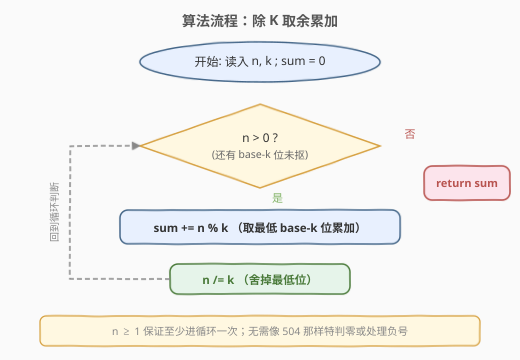
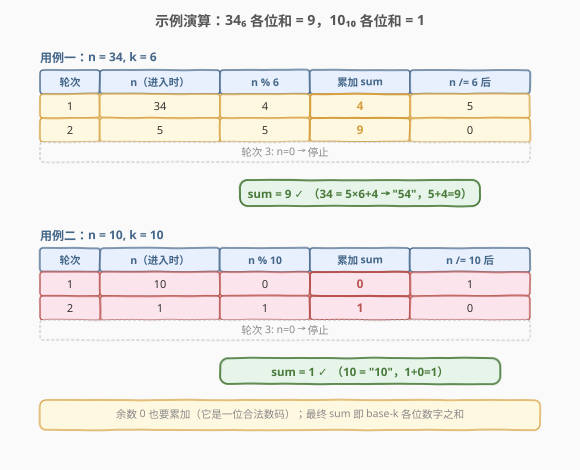

# K进制表示下的各位数字总和

- **题目名称**：K进制表示下的各位数字总和
- **链接**：[1837. K进制表示下的各位数字总和](https://leetcode.cn/problems/sum-of-digits-in-base-k/)
- **难度**：简单
- **标签**：数学

## 1. 题目概述

给定一个十进制整数 `n` 和一个进制 `k`（$2 \le k \le 10$），将 `n` 转换为 **`k` 进制**表示，然后返回其**各位数字之和**。

**示例 1**：

```text
输入：n = 34, k = 6
输出：9
解释：34 的 6 进制表示为 "54"，各位数字之和 = 5 + 4 = 9。
```

**示例 2**：

```text
输入：n = 10, k = 10
输出：1
解释：10 的 10 进制表示为 "10"，各位数字之和 = 1 + 0 = 1。
```

**约束条件**：

- $1 \le n \le 100$
- $2 \le k \le 10$

> 💡 题目只要求「各位数字之和」，并不要求输出 `k` 进制字符串本身。这一点是下文优化的关键——**我们根本不需要把字符串造出来**。

---

## 2. 解题思路

### 2.1 暴力思路：先转字符串再求和

最直观的做法分两步：先用「除 `k` 取余」把 `n` 转成 `k` 进制字符串（与 [504. 七进制数](https://leetcode.cn/problems/base-7/) 同模板），再遍历字符串逐字符求和。

```python
digits = []
while n > 0:
    digits.append(n % k)
    n //= k
ans = sum(digits)          # 字符串都不必真造，直接对余数列表求和
```

> ⚠️ 写到这里其实已经能看出：**每一位数字恰好就是 `n % k` 得到的余数**。既然最终只是求和，收集到列表里再 `sum`，与边取余边累加完全等价——连列表都是多余的。

### 2.2 核心观察：余数即数码，求和免字符串



`k` 进制的每一位数码取值范围为 $[0, k)$，而 `n % k` 的结果也恰好落在 $[0, k)$——**余数就是这一位的数码**。于是「转换 + 求和」可以合并成一步循环：

$$\text{sum} = \sum_{\text{各轮}} (n \bmod k), \qquad n \leftarrow \lfloor n / k \rfloor$$

每轮做两件事：

- 取余数 `d = n % k`，它就是当前最低位的 `k` 进制数码，直接 `sum += d`；
- 整除 `n //= k`，舍掉已处理的最低位，把高位整体右移。

直到 `n == 0`，所有位都抠完，`sum` 即为答案。

> 💡 **为何能跳过字符串**：题目只要求数字之和，不要求字符串本身。而 `k` 进制字符串的每个字符与每次取余一一对应。把「收集字符→遍历求和」折叠成「取余即累加」，省掉了建表 / 建串 / 反转 / 二次遍历的全部开销。这是「问题只问聚合值，不必还原表示」时的通用简化思路。

以 `n = 34, k = 6` 验证：

| 步骤 | `n` | `n % 6` | 累加 `sum` | 新 `n = n // 6` |
|------|-----|---------|------------|-----------------|
| 第 1 轮 | 34 | 4 | 0 + 4 = 4 | 5 |
| 第 2 轮 | 5 | 5 | 4 + 5 = 9 | 0 |
| 第 3 轮 | 0 | — | 停止 | — |

结果 `sum = 9` ✓（$34 = 5 \times 6 + 4$，即 6 进制 `"54"`，$5 + 4 = 9$）。

### 2.3 算法流程图



流程极简：初始化 `sum = 0`，循环「取余累加 + 整除缩位」，直到 `n` 归零返回 `sum`。由于约束保证 $n \ge 1$，至少进循环一次，无需像 504 那样特判 `n == 0` 或处理负号。

### 2.4 示例演算



逐步展示两个用例：

**用例一：`n = 34, k = 6` → `9`**

- 第 1 轮：`34 % 6 = 4`，`sum = 4`，`n = 5`；
- 第 2 轮：`5 % 6 = 5`，`sum = 9`，`n = 0`；停止。`sum = 9` ✓。

**用例二：`n = 10, k = 10` → `1`**

- 第 1 轮：`10 % 10 = 0`，`sum = 0`，`n = 1`；
- 第 2 轮：`1 % 10 = 1`，`sum = 1`，`n = 0`；停止。`sum = 1` ✓。

> ⚠️ 注意用例二中第 1 轮余数为 `0`，它是 10 进制 `"10"` 的个位，**是合法数码必须累加**（虽然加 0 不改变和，但循环不能因此提前终止——提前终止会漏掉高位）。

---

## 3. 参考代码

### C++

```cpp
class Solution {
  public:
    int sumBase(int n, int k) {
        int sum = 0;
        while (n > 0) {
            sum += n % k;          // 取最低 k 进制位，直接累加
            n /= k;                // 舍掉最低位
        }
        return sum;
    }
};
```

### Python

```python
class Solution:
    def sumBase(self, n: int, k: int) -> int:
        total = 0
        while n > 0:
            total += n % k         # 取最低 k 进制位，直接累加
            n //= k                # 舍掉最低位
        return total
```

> ⚠️ Python 中整除务必用 `//`（地板除），用 `/` 会得到浮点数导致 `n` 变成 `float`，后续取余虽能运行但类型不干净。

---

## 4. 复杂度分析

| 维度 | 复杂度 | 说明 |
|------|--------|------|
| 时间复杂度 | $O(\log_k n)$ | 每轮 `n` 缩小到原来的 $1/k$，循环次数即 `k` 进制位数，约为 $\lfloor\log_k n\rfloor + 1$ |
| 空间复杂度 | $O(1)$ | 仅用 `sum`、`n` 等常数个整型变量，不建字符串 / 列表 |

> 💡 题目上界 $n = 100$、$k \ge 2$，循环最多 $\lfloor\log_2 100\rfloor + 1 = 7$ 次，实际为常数级；但按位数增长的渐进界 $O(\log_k n)$ 是更本质的刻画。

---

## 5. 扩展：数码和与同余性质

`k` 进制数码和有一个经典数论性质——**同余压缩**：

$$n \equiv \text{digitSum}_k(n) \pmod{k - 1}$$

直观理解：$k \equiv 1 \pmod{k-1}$，于是 $n = \sum d_i k^i \equiv \sum d_i \cdot 1^i = \sum d_i \pmod{k-1}$。这正是十进制下「一个数模 9 等于其数码和模 9」（[258. 各位相加](https://leetcode.cn/problems/add-digits/) 的核心）在任意 `k` 进制下的推广。

> ⚠️ 但同余式只给出 **数码和模 $k-1$** 的值，不能直接定出数码和本身（数码和可能远大于 $k-1$）。例如 `n = 34, k = 6` 时数码和为 9，而 $9 \bmod 5 = 4 = 34 \bmod 5$ ✓，但仅凭 $34 \bmod 5 = 4$ 无法断定数码和是 9 而非 4。因此本题仍需逐位累加，模运算只能用于校验或 [258](https://leetcode.cn/problems/add-digits/) 那类「反复相加到一位」的特化场景。

---

## 6. 面试要点

1. **为什么不需要真的把 `n` 转成 `k` 进制字符串？**

   - 题目只问「各位数字之和」这一聚合值，不要求字符串本身。而 `k` 进制每一位数码恰好等于对应轮次的余数 `n % k`（取值 $[0, k)$）。把「收集字符 → 遍历求和」折叠成「取余即累加」，省掉了建串 / 反转 / 二次遍历。核心是识别「只问聚合、不需还原表示」时可省去表示构造。

2. **循环条件为什么是 `n > 0` 而不是 `n >= 0`？**

   - `n == 0` 时所有位已抠完，余数也无意义（0 % k = 0 是冗余的）。用 `n > 0` 恰好在 `n` 归零时退出，不多做一轮无用取余。注意约束保证 $n \ge 1$，故不必特判 `n == 0` 的输入（若输入可能为 0，则应直接 `return 0`）。

3. **余数为 0 的轮次能不能跳过？**

   - 不能跳过**循环**，但累加 0 不影响和。关键在于 `n //= k` 必须执行以推进到高位——若见余数为 0 就 `continue` 跳过整除，会死循环。正确做法是每轮无条件执行「取余累加 + 整除」，余数 0 自然加了个 0 不改变 `sum`，但 `n` 照常缩位。用例二 `n=10, k=10` 第 1 轮余数 0 正是此情形。

4. **和 [504. 七进制数](https://leetcode.cn/problems/base-7/) 的区别是什么？**

   - 两者共享「除 `k` 取余」母模板。504 要**输出字符串**，故需收集余数到列表、处理负号、最后反转；本题只要**数码和**，连列表都不必建，取余即累加。对照两题能看出：「还原表示」比「求聚合值」多了表示构造的开销——这是判断能否简化的分水岭。

5. **`k = 10` 时本题退化成什么？**

   - 退化成「十进制各位数字之和」，即 [258. 各位相加](https://leetcode.cn/problems/add-digits/) 的一次相加（不做反复相加到一位）。例如 `n = 10` → `1 + 0 = 1`。`k` 进制是十进制数码和的自然推广。

---

## 7. 同类练习题

- [504. 七进制数](https://leetcode.cn/problems/base-7/)：同源「除 K 取余」母模板，但需输出字符串（含负号 + 反转），对比「还原表示」与「只求聚合」的开销差异
- [258. 各位相加](https://leetcode.cn/problems/add-digits/)：`k = 10` 的特例 + 反复相加到一位，可结合第 5 节同余性质 $O(1)$ 求解
- [168. Excel表列名称](https://leetcode.cn/problems/excel-sheet-column-title/)（[题解](../0001-0100/168_Excel表列名称.md)）：1-indexed 进制转换的「分解」方向，对比「含 0 数码」的普通进制（本题）与「无 0 数码」的 off-by-one 处理
- [1838. 最高频元素的频数](https://leetcode.cn/problems/frequency-of-the-most-frequent-element/)：同题号区间相邻题，虽套路不同（排序 + 滑动窗口），可作序号补全的顺带练习
