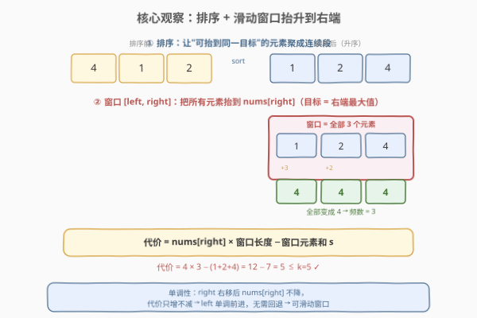
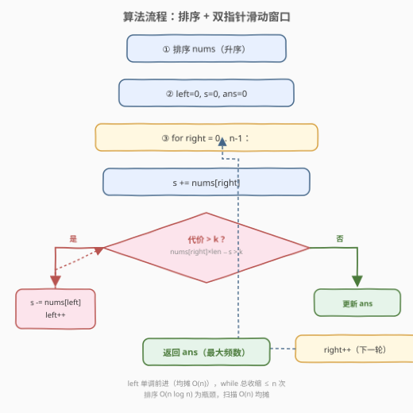

# 最高频元素的频数

- **题目名称**：最高频元素的频数
- **链接**：[1838. 最高频元素的频数](https://leetcode.cn/problems/frequency-of-the-most-frequent-element/)
- **难度**：中等
- **标签**：数组、滑动窗口、排序、前缀和

## 1. 题目概述

给定整数数组 `nums` 和整数 `k`。每次操作可选择一个下标，将该下标元素值增加 1。执行**最多 `k` 次操作**后，返回数组中最高频元素的**最大可能频数**。

> 💡 **核心矛盾**：操作只能「增加」不能减少，且总操作次数有预算 `k`。要让某个元素出现尽量多次，就要把若干个「比它小的元素」抬升到它的值——自然倾向于选一个**连续的、值接近的目标**，花最少预算凑最多频数。

**示例 1**：

```text
输入：nums = [1,2,4], k = 5
输出：3
解释：对第一个元素执行 3 次递增，对第二个元素执行 2 次递增，此时 nums = [4,4,4]。
4 的频数为 3。
```

**示例 2**：

```text
输入：nums = [1,4,8,13], k = 5
输出：2
解释：可选方案——把 1 抬到 4（3 次）、把 4 抬到 8（4 次）、或把 8 抬到 13（5 次），均得频数 2。
```

**示例 3**：

```text
输入：nums = [3,9,6], k = 2
输出：1
解释：预算不足以把任何两个元素拉到同一值，最高频数仍为 1。
```

**约束条件**：

- $1 \le \text{nums.length} \le 10^5$
- $1 \le \text{nums}[i] \le 10^5$
- $1 \le k \le 10^5$

---

## 2. 解题思路

### 2.1 暴力思路

最朴素的想法：枚举每个元素 `nums[i]` 作为「目标值」，再枚举能被抬到该值的其他元素，贪心地选差值最小的若干个，直到预算耗尽。但每次枚举目标后还要排序选差值，总体 $O(n^2 \log n)$，$n = 10^5$ 不可行。

能否用动态规划？状态难以定义——「预算」与「已选元素」耦合，且操作只增不减，缺乏最优子结构。这暗示需要换一个视角：**把"选哪些元素抬到目标"转化为"一段连续窗口"**。

### 2.2 核心观察：排序 + 滑动窗口



关键洞察分三层：

**第一层：排序让"同目标"的元素聚成连续段。** 操作只能增加元素值，所以被抬升的元素一定 $\le$ 目标值。排序后，所有 $\le$ 目标值的元素连续排列，被选中的就是其中差值最小的一段**前缀**——这天然形成连续窗口。

**第二层：目标一定是窗口内的最大值。** 若窗口 $[\text{left}, \text{right}]$ 要全部变成同一个值 `v`，最优的 `v` 就是 $\text{nums}[\text{right}]$（窗口最大值）。因为选更小的 `v` 要么无法覆盖 $\text{nums}[\text{right}]$（它 $> v$ 无法降低），要么浪费——把所有人抬到一个比最大值更大的值只花更多预算。因此**窗口右端就是目标**。

**第三层：窗口代价有闭式公式。** 把窗口 $[\text{left}, \text{right}]$ 内所有元素抬到 $\text{nums}[\text{right}]$ 的总代价为：

$$\text{cost} = \text{nums}[\text{right}] \times (\text{right} - \text{left} + 1) - \sum_{i=\text{left}}^{\text{right}} \text{nums}[i]$$

即「目标值 × 窗口长度 − 窗口元素和」。用前缀和或滚动累加维护窗口和 $s$，代价可在 $O(1)$ 内算出。

> 💡 **为何能滑动窗口？** 当 `right` 右移时，若窗口 $[\text{left}, \text{right}]$ 代价超 $k$，则对**任意** $\text{right}' > \text{right}$，窗口 $[\text{left}, \text{right}']$ 代价只会更大（$\text{nums}[\text{right}'] \ge \text{nums}[\text{right}]$，抬升基准不降）。故 `left` 只需单调前进，无需回退——这是滑动窗口可行的单调性保证。

### 2.3 算法流程图



流程核心：

1. **排序** `nums`（升序），使同目标元素连续化。
2. 双指针 `left`、`right` 维护窗口，滚动变量 `s` 记窗口元素和。
3. `right` 每右移一格：`s += nums[right]`，计算代价 `nums[right] * len - s`。
4. **若代价 > k**：不断 `s -= nums[left]; left++` 直到代价 $\le k$（收缩左端扔掉最远的元素）。
5. 更新答案 `ans = max(ans, right - left + 1)`。

> ⚠️ **窗口只增不缩的变体**：本题也可让 `left` 只在代价超 $k$ 时前进一格（不回退到使窗口重新合法），最终窗口长度即为答案。两种写法等价，因为窗口一旦达到最大长度就不会再缩小——跟踪 `max` 的标准写法更直观。

### 2.4 示例演算

![示例演算：nums = [1,2,4], k = 5](../images/1838_example_walkthrough.svg)

以 `nums = [1, 2, 4]`, `k = 5` 为例。排序后仍为 $[1, 2, 4]$：

| 步骤 | right | 窗口 | s | 代价 = 4×len − s | 代价 ≤ 5? | ans |
|------|-------|------|---|------------------|-----------|-----|
| 1 | 0 | [1] | 1 | $1 \times 1 - 1 = 0$ | ✓ | 1 |
| 2 | 1 | [1,2] | 3 | $2 \times 2 - 3 = 1$ | ✓ | 2 |
| 3 | 2 | [1,2,4] | 7 | $4 \times 3 - 7 = 5$ | ✓ | 3 |

第 3 步：窗口 $[1,2,4]$ 全部抬到 4，代价 $= (4-1) + (4-2) + (4-4) = 3 + 2 + 0 = 5 = k$，恰好不超预算，频数 $= 3$ ✓

> 💡 对照示例 2 `nums = [1,4,8,13], k = 5`：窗口扩到 $[1,4,8]$ 时代价 $= 8 \times 3 - 13 = 11 > 5$，收缩 `left` 到 1 后窗口 $[4,8]$ 代价 $= 8 \times 2 - 12 = 4 \le 5$，频数 2；继续扩到 $[4,8,13]$ 代价 $= 13 \times 3 - 25 = 14 > 5$，再收缩到 $[8,13]$ 代价 $= 13 \times 2 - 21 = 5 \le 5$，频数仍 2。最终答案 2 ✓

---

## 3. 参考代码

### C++

```cpp
class Solution {
  public:
    int maxFrequency(vector<int>& nums, int k) {
        sort(nums.begin(), nums.end());
        long long s = 0;          // 窗口元素和，用 long long 防溢出
        int ans = 0, left = 0;
        for (int right = 0; right < (int)nums.size(); ++right) {
            s += nums[right];
            // 代价 = nums[right] * 窗口长度 - s，超预算则收缩左端
            while ((long long)nums[right] * (right - left + 1) - s > k) {
                s -= nums[left];
                ++left;
            }
            ans = max(ans, right - left + 1);
        }
        return ans;
    }
};
```

### Python

```python
class Solution:
    def maxFrequency(self, nums: List[int], k: int) -> int:
        nums.sort()
        s = 0
        ans = left = 0
        for right, x in enumerate(nums):
            s += x
            # 代价 = nums[right] * 窗口长度 - s，超预算则收缩左端
            while nums[right] * (right - left + 1) - s > k:
                s -= nums[left]
                left += 1
            ans = max(ans, right - left + 1)
        return ans
```

> ⚠️ **溢出说明**：$\text{nums}[i] \le 10^5$、$n \le 10^5$，乘积 $\text{nums}[\text{right}] \times \text{len}$ 上界达 $10^{10}$，远超 `int`（$\approx 2.1 \times 10^9$）。C++ 中必须用 `long long` 承接 `s` 与乘法中间量；Python 大整数自动处理无需担心。

---

## 4. 复杂度分析

| 维度 | 复杂度 | 说明 |
|------|--------|------|
| 时间复杂度 | $O(n \log n)$ | 排序 $O(n \log n)$ + 双指针扫描 $O(n)$（`left`、`right` 各至多移动 $n$ 次） |
| 空间复杂度 | $O(\log n)$ | 排序递归栈空间（原地排序）；仅常数额外变量 `s`/`left`/`ans` |

> 💡 排序是本题的复杂度瓶颈。若值域 $V$ 与 $n$ 同阶，可用计数排序优化到 $O(n + V)$，但通常 $O(n \log n)$ 已足够。双指针部分的 `while` 嵌套在 `for` 内，但**均摊分析**：`left` 至多前进 $n$ 次，总收缩操作 $\le n$，故扫描整体 $O(n)$。

---

## 5. 扩展：与「替换后的最长重复字符」的对照

本题与 [424. 替换后的最长重复字符](https://leetcode.cn/problems/longest-repeating-character-replacement/) 是**同构问题**，只是操作语义不同：

| 维度 | 1838 最高频元素频数 | 424 替换后最长重复字符 |
|------|---------------------|------------------------|
| 操作 | 把元素 $+1$（数值增量） | 把字符换成任意字符（离散替换） |
| 预算 | $k$ 次增量操作 | $k$ 次替换 |
| 预处理 | **排序**使同目标元素连续 | 字符已离散，无需排序 |
| 窗口代价 | $\text{max} \times \text{len} - \text{sum}$ | $\text{len} - \text{maxCount}$（非目标字符个数） |
| 核心范式 | 排序 + 滑动窗口 | 滑动窗口 + 维护窗口内最大频数 |

两者骨架完全一致：**维护窗口，代价超预算则收缩左端，跟踪最大窗口长度**。区别仅在于「代价」的计算方式——424 因字符离散，代价 = 窗口长度 − 窗口内最高频字符数（即需替换的非目标字符数）；1838 因数值连续，代价需累加差值，故引入排序与前缀和。

> 💡 这对对照揭示了一个通用范式：**"用有限预算把一段元素统一化"** → 滑动窗口。离散场景（424）用频数表算代价，连续场景（1838）用排序 + 前缀和算代价。

---

## 6. 面试要点

**Q1：为什么要先排序？**

> 操作只能增加元素值，被抬升的元素一定 $\le$ 目标。排序后这些元素连续排列，选中的就是一段连续窗口——这是滑动窗口成立的前提。不排序则"可抬到目标的元素"散落各处，无法用双指针维护。

**Q2：为什么目标一定是窗口右端元素？**

> 窗口内最大值在右端（已排序）。选它作为目标，所有其他元素 $\le$ 它，只需增量即可到达；若选更小的目标，右端元素无法降低到该值，必须被排除出窗口，等价于缩小窗口。因此"窗口右端即目标"覆盖所有最优情况。

**Q3：滑动窗口为什么是单调的？left 不会回退？**

> 当 `right` 右移使代价超 $k$ 时，对任意更大的 $\text{right}'$，$\text{nums}[\text{right}'] \ge \text{nums}[\text{right}]$，抬升基准不降，代价只增不减。故当前 `left` 对后续所有 `right'` 都"太远"，必须前进，无需回退——这就是 `while` 收缩后 `left` 单调递增的正确性保证。

**Q4：溢出风险在哪里？如何规避？**

> $\text{nums}[\text{right}] \times \text{len}$ 上界 $10^5 \times 10^5 = 10^{10}$，超 `int`。C++ 中用 `long long` 承接窗口和 `s` 与乘法表达式；Python 无此问题。这是本题最常见的 WA 原因。

**Q5：本题与 424 替换后的最长重复字符有何异同？**

> 同构问题，均为"有限预算统一化一段元素"。骨架同为滑动窗口 + 收缩左端 + 跟踪最大窗口。区别在代价计算：424 字符离散，代价 $= \text{len} - \text{maxCount}$（需替换个数），用频数表；1838 数值连续，代价 $= \text{max} \times \text{len} - \text{sum}$（总增量），需排序 + 前缀和。

---

## 7. 同类练习题

- [424. 替换后的最长重复字符](https://leetcode.cn/problems/longest-repeating-character-replacement/)：与本题**完全同构**，离散字符版的"有限预算统一化"，代价 = 窗口长度 − 最高频字符数，无需排序
- [209. 长度最小的子数组](https://leetcode.cn/problems/minimum-size-subarray-sum/)（[站内题解](../0201-0300/209_长度最小的子数组.md)）：滑动窗口招牌题，正数单调性保证 left 单调前进，对照本题窗口收缩逻辑
- [713. 乘积小于 K 的子数组](https://leetcode.cn/problems/subarray-product-less-than-k/)（[站内题解](../0701-0800/713_乘积小于K的子数组.md)）：滑动窗口 + 计数（`right−left+1`），同为"维护窗口合法并统计"范式
- [3. 无重复字符的最长子串](https://leetcode.cn/problems/longest-substring-without-repeating-characters/)（[站内题解](../0001-0100/3_无重复字符的最长子串.md)）：滑动窗口 + 哈希表收缩左端，对照"窗口非法即收缩"的通用模板
- [1658. 将 x 减到 0 的最小操作数](https://leetcode.cn/problems/minimum-operations-to-reduce-x-to-zero/)：滑动窗口变体，转化为"求和为 sum−x 的最长子数组"，同为排序后窗口求最值
