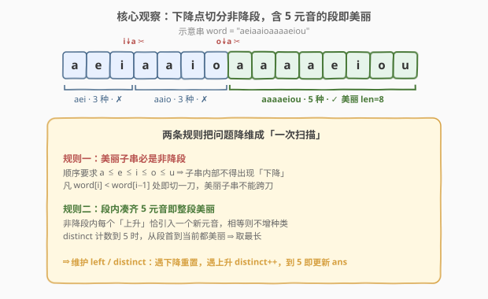
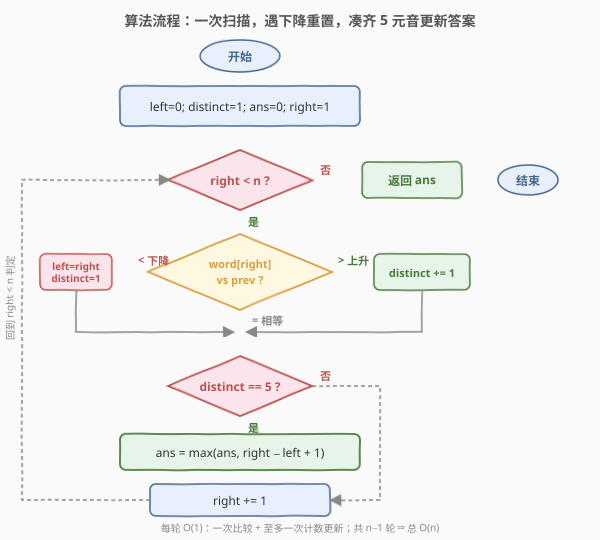
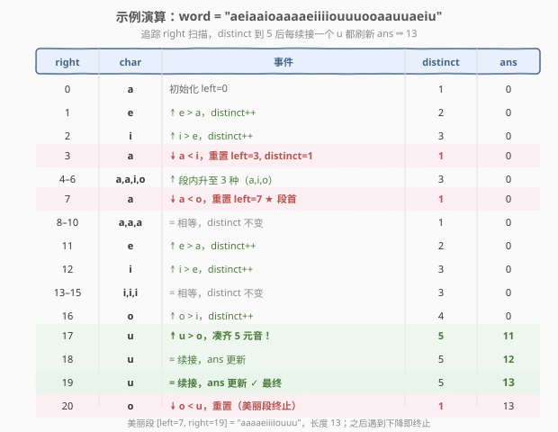

# 所有元音按顺序排布的最长子字符串

- **题目名称**：所有元音按顺序排布的最长子字符串
- **链接**：[1839. 所有元音按顺序排布的最长子字符串](https://leetcode.cn/problems/longest-substring-of-all-vowels-in-order/)
- **难度**：中等
- **标签**：字符串、滑动窗口、双指针

## 1. 题目概述

当一个字符串满足以下两条时，称它是**美丽的**：

1. **全部 5 个元音字母** `a`、`e`、`i`、`o`、`u` 都**至少出现一次**；
2. 这些元音字母**按字典序升序排布**（即所有的 `a` 在 `e` 前，所有的 `e` 在 `i` 前，以此类推）。

例如 `"aeiou"`、`"aaaaaaeiiiioou"` 是美丽的，而 `"uaeio"`、`"aeoiu"`、`"aaaeeeooo"` 不是。

给你一个**只包含元音字母**的字符串 `word`，返回其中**最长美丽子字符串**的长度；若不存在则返回 `0`。子字符串是连续字符序列。

**示例 1**：

```text
输入：word = "aeiaaioaaaaeiiiiouuuooaauuaeiu"
输出：13
解释：最长美丽子字符串是 "aaaaeiiiiouuu" ，长度为 13。
```

**示例 2**：

```text
输入：word = "aeeeiiiioooauuuaeiou"
输出：5
解释：最长美丽子字符串是 "aeiou" ，长度为 5。
```

**示例 3**：

```text
输入：word = "a"
输出：0
解释：没有美丽子字符串，返回 0。
```

**约束条件**：

- $1 \le \text{word.length} \le 5 \times 10^5$
- `word` 只包含字符 `'a'`、`'e'`、`'i'`、`'o'`、`'u'`

> 💡 **题眼**：第二条「按字典序升序排布」是关键——它意味着美丽子串内部**绝不能出现字符下降**。这条单调性把问题从「任意子串」压缩成「非降段」，是降维的入口。

---

## 2. 解题思路

### 2.1 暴力思路：枚举所有子串

枚举所有子串 `[i, j]` 共 $O(n^2)$ 个，对每个子串检查：

- 是否**非降**（任一相邻位 `word[k] >= word[k-1]`）—— $O(n)$；
- 是否**含全部 5 个元音** —— $O(n)$。

总复杂度 $O(n^3)$。即便用前缀和把「检查」优化到 $O(1)$，枚举本身仍 $O(n^2)$，当 $n = 5 \times 10^5$ 时约 $2.5 \times 10^{11}$，必然超时。

> ⚠️ **浪费在哪**：完全忽略了「美丽子串必是非降段」这条结构——任意一个下降点都是美丽子串的**硬边界**，跨过它的子串一律不合法，根本不必枚举。

### 2.2 核心观察：下降点切分非降段



**规则一：美丽子串必是非降段。**

顺序要求 `a ≤ e ≤ i ≤ o ≤ u`，因此美丽子串内部字符序列必须**非降**。凡 `word[i] < word[i-1]` 的位置（下降点）都是美丽子串不可跨越的边界——这些下降点把 `word` 切成若干**极大非降段**，每个美丽子串必完整落在某个非降段内。

**规则二：段内凑齐 5 元音即整段美丽。**

在一个非降段内，每个「上升」`word[right] > word[right-1]` 恰好引入**一个新元音**（因为非降，新字符只能比前一个大，不可能回头补旧的）；「相等」则不增加种类。于是只需一个计数器 `distinct` 跟踪当前段内出现过的元音种类数：

- `distinct == 5` 时，从段首 `left` 到当前 `right` 的整段都满足「含 5 元音 + 非降」 ⇒ **整段美丽**，长度 `right - left + 1` 是候选；
- 由于段内后续相等地推进不会减少种类，`distinct` 一旦到 5 就**持续到段末**，所以最长候选就是该段从首次凑齐 5 元音处到段末的长度——等价于**整个非降段**的长度（前提是该段含 5 元音）。

> 💡 **为什么不用收缩左端？** 通用滑窗（如 [3. 无重复字符的最长子串](../0001-0100/3_无重复字符的最长子串.md)）在条件破坏时收缩 `left`。但本题的非降段一旦确定，`left` 没有收缩的必要——段内任何子区间要么种类不足 5，要么就是「段首到当前」这一种取法最优（越往后越长）。所以 `left` 只在遇到下降点时**整段重置**，不必渐进收缩。这是「单调分段」型滑窗与「去重」型滑窗的分水岭。

### 2.3 算法流程图



一次遍历 `right` 从 `1` 到 `n-1`：

- `word[right] < word[right-1]`：遇下降点，重置 `left = right`、`distinct = 1`（新段只有一个元音）；
- `word[right] > word[right-1]`：上升，引入新元音，`distinct += 1`；
- `word[right] == word[right-1]`：相等，`distinct` 不变；
- 每步末若 `distinct == 5`，用 `right - left + 1` 更新 `ans`。

`left`、`right` 都只增不减，总共至多 $2n$ 次指针移动。

### 2.4 示例演算



以示例 1 `word = "aeiaaioaaaaeiiiiouuuooaauuaeiu"` 追踪关键步骤：

- `right=0..2`：段 `"aei"` 内连续上升，`distinct` 升到 `3`，未到 5；
- `right=3`：`a < i` 下降，重置 `left=3`、`distinct=1`；
- `right=7`：`a < o` 下降，重置 `left=7`、`distinct=1` —— **这是最长美丽段的段首**；
- `right=8..16`：段内 `a→a→a→a→e→i→i→i→i→o` 逐步上升，`distinct` 到 `4`；
- `right=17`：`u > o` 上升，`distinct` 首次到 `5`，`ans = 17 - 7 + 1 = 11`；
- `right=18,19`：续接两个 `u`（相等），`distinct` 仍 5，`ans` 续更新为 `12`、`13`；
- `right=20`：`o < u` 下降，美丽段终止。

最终 `ans = 13` ✓（对应子串 `"aaaaeiiiiouuu"`）。

> 💡 **关键现象**：`distinct` 到 5 之后，段内每续接一个相等字符都会让窗口变长且仍合法——这正是「整段美丽」的体现。所以答案往往出现在「段尾」，无需提前收缩。

---

## 3. 参考代码

### C++

```cpp
class Solution {
public:
    int longestBeautifulSubstring(string word) {
        int n = word.size();
        if (n < 5) return 0;                 // 不足 5 字符必然凑不齐 5 元音
        int ans = 0, left = 0, distinct = 1;
        for (int right = 1; right < n; right++) {
            if (word[right] < word[right - 1]) {
                left = right;                // 下降点：开新段
                distinct = 1;
            } else if (word[right] > word[right - 1]) {
                distinct++;                  // 上升：引入新元音
            }
            if (distinct == 5) {
                ans = max(ans, right - left + 1);
            }
        }
        return ans;
    }
};
```

### Python

```python
class Solution:
    def longestBeautifulSubstring(self, word: str) -> int:
        n = len(word)
        if n < 5:
            return 0
        ans = left = 0
        distinct = 1
        for right in range(1, n):
            if word[right] < word[right - 1]:
                left = right                 # 下降点：开新段
                distinct = 1
            elif word[right] > word[right - 1]:
                distinct += 1                # 上升：引入新元音
            if distinct == 5:
                ans = max(ans, right - left + 1)
        return ans
```

> ⚠️ **细节**：重置时 `distinct = 1` 而非 `0`——新段以 `word[right]` 起始，已含 1 种元音。漏写会少算一种，导致永远到不了 5。另外 `if n < 5: return 0` 是常数级剪枝（5 个字符都凑不齐必然无解），不加也能通过，但能让极短输入直接返回。

---

## 4. 复杂度分析

| 维度 | 复杂度 | 说明 |
|------|--------|------|
| 时间复杂度 | $O(n)$ | `right` 从 `1` 扫到 `n-1`，每步做一次比较 + 至多一次计数/更新，`left` 仅在下降点跳跃且只增不减 |
| 空间复杂度 | $O(1)$ | 仅用 `ans`、`left`、`distinct` 三个整型变量，不依赖字符集大小 |

> 💡 **与暴力的对比**：暴力 $O(n^3)$ / 优化枚举 $O(n^2)$ 在 $n = 5 \times 10^5$ 下超时；本解法 $O(n) \approx 5 \times 10^5$ 次操作。增益来源于「下降点切分」把任意子串压缩成线性个非降段，每段内只需一次线性扫描。

---

## 5. 扩展：等价于「最长含 5 种字符的非降段」

本题可以抽象为一个更一般的模式：**在字符按某种全序排列的串中，找含全部 K 种字符的最长非降段**。本题 $K = 5$、序为 `a < e < i < o < u`。

- **切分依据**：相邻逆序（`word[i] < word[i-1]`）即段边界——这与 [674. 最长连续递增序列](https://leetcode.cn/problems/longest-continuous-increasing-subsequence/) 的「下降点切分取最长递增段」同源，只是那里不要求「种类齐全」。
- **种类计数**：非降段内「上升」必引入新字符、「相等」不增种类——因此 `distinct` 等于「段内上升次数 + 1」。这一计数方式只对**非降段**成立；若段内允许下降，一个字符可能「回头」重复出现而 `distinct` 不该增加，就需要改用哈希集合。本题靠「非降」把哈希省成了计数器。
- **退化情形**：若不要求「种类齐全」（只要求非降），则去掉 `distinct` 与 `distinct == 5` 判定，直接 `ans = max(ans, right - left + 1)`，即为 [674](https://leetcode.cn/problems/longest-continuous-increasing-subsequence/)；若进一步要求「严格递增」（不许相等），则下降与相等都要重置，即 [1446. 连续字符](https://leetcode.cn/problems/consecutive-characters/) 的「等值段」对应处理。

> 💡 因此本题可视为 **[674]（非降段）+ 种类齐全约束（K=5）** 的组合，是「单调分段」型双指针的一个典型样例。

---

## 6. 面试要点

**Q1：为什么美丽子串一定是非降段？**

> 第二条规则要求 `a` 全在 `e` 前、`e` 全在 `i` 前……等价于子串内字符按 `a < e < i < o < u` 字典序非降。一旦子串内出现 `word[k] < word[k-1]`，就破坏了顺序，必不美丽。所以任意美丽子串不能跨越下降点，必完整落在某个极大非降段内。

**Q2：为什么 `left` 不需要像普通滑窗那样渐进收缩？**

> 非降段一旦由下降点确定，段内「种类数」是单调不减的（上升增 1、相等不变）。`distinct` 到 5 后只会持续到段末，段内任何更短的子区间要么种类不足 5，要么长度不如「段首到当前」。所以最优候选就是整个非降段（若它含 5 元音），`left` 只需在下降点整段重置，无需收缩。这与 [3. 无重复字符的最长子串](../0001-0100/3_无重复字符的最长子串.md) 的「去重要收缩」是两种不同滑窗范式。

**Q3：`distinct` 计数为什么不需要哈希集合？**

> 在非降段内，每个「上升」`word[right] > word[right-1]` 引入的字符必然是**没出现过的更大字符**（因为段是非降的，已出现的字符都不会比当前小，新的更大字符不可能重复）。所以「上升次数 + 1」就等于种类数，一个整型计数器即可。若段内允许下降，则需哈希集合去重——本题靠非降性把哈希省掉了。

**Q4：时间 / 空间复杂度各是多少？**

> 时间 $O(n)$——`right` 单次扫描，每步 $O(1)$；`left` 仅在下降点跳跃且单调不减。空间 $O(1)$——仅 `ans`、`left`、`distinct` 三个变量，无哈希表/数组。

**Q5：如果 `word` 可能包含辅音字母，解法怎么改？**

> 辅音字母没有「元音序」中的位置，且不贡献种类数。可把辅音视为「强制下降点」：遇到非元音字符即重置 `left`、`distinct`；其余逻辑不变（仍只对元音计上升/相等）。更稳妥地，先校验字符属于 `{a,e,i,o,u}` 再参与比较，否则直接重置段。

> 💡 **一句话总结**：美丽 = 非降段 + 含 5 元音；下降点切分把串压成线性个段，段内 `distinct` 单调不减到 5 即整段美丽，一次扫描 $O(n)$ 求最长。

---

## 7. 同类练习题

- [3. 无重复字符的最长子串](https://leetcode.cn/problems/longest-substring-without-repeating-characters/)（[站内题解](../0001-0100/3_无重复字符的最长子串.md)）：滑窗母题——对比「去重要收缩左端」与本题「下降点整段重置」两种滑窗范式
- [674. 最长连续递增序列](https://leetcode.cn/problems/longest-continuous-increasing-subsequence/)：「下降点切分取最长非降段」的纯版，去掉本题的「种类齐全」约束即为该题
- [1446. 连续字符](https://leetcode.cn/problems/consecutive-characters/)：等值段切分（K=1 的非降段），下降与相等都要重置，对照「严格递增 vs 非降」的处理差异
- [845. 数组中的最长山脉](https://leetcode.cn/problems/longest-mountain-in-array/)：先升后降的山型段切分，对照「单向非降段」与「升降组合段」的指针推进方式
- [1869. 哪种连续子字符串更长](https://leetcode.cn/problems/longer-contiguous-segments-of-ones-than-zeros/)：等值段计数型应用，同属「相邻比较 + 段内统计」家族（题号相邻可顺带练习）
