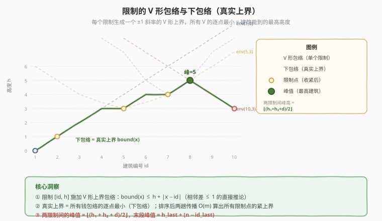
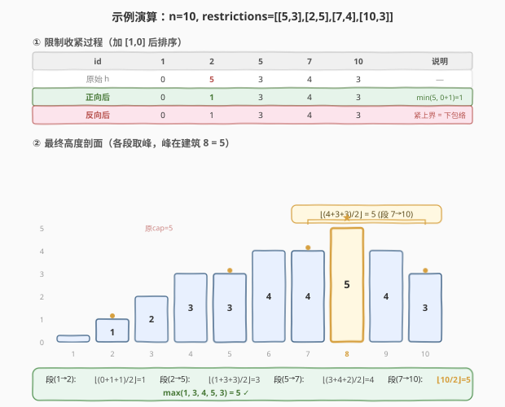

# LeetCode 最高建筑高度 题解

## 1. 题目概述

- **标题 / 题号**：最高建筑高度（#1840，hard）
- **链接**：https://leetcode.cn/problems/maximum-building-height/
- **难度**：困难
- **标签**：数组、排序、贪心、数学

**题意**：城市里要建 `n` 栋新建筑，从 `1` 到 `n` 编号排成一列。规则如下：

- 每栋建筑高度为**非负整数**；
- 第 1 栋建筑高度**必须**为 `0`；
- 任意两栋**相邻**建筑的高度差**不能超过** `1`；
- 部分建筑还有额外的最高高度限制：`restrictions[i] = [idi, maxHeighti]`，表示建筑 `idi` 的高度**不能超过** `maxHeighti`。

每栋建筑在 `restrictions` 中至多出现一次，建筑 `1` 不会出现在 `restrictions` 中。返回**最高建筑**能达到的**最高高度**。

**示例 1**：

```text
输入：n = 5, restrictions = [[2,1],[4,1]]
输出：2
解释：建筑高度分别为 [0,1,2,1,2]，最高建筑高度为 2。
```

**示例 2**：

```text
输入：n = 6, restrictions = []
输出：5
解释：建筑高度分别为 [0,1,2,3,4,5]，最高建筑高度为 5。
```

**示例 3**：

```text
输入：n = 10, restrictions = [[5,3],[2,5],[7,4],[10,3]]
输出：5
解释：建筑高度分别为 [0,1,2,3,3,4,4,5,4,3]，最高建筑高度为 5。
```

**约束**：

- $2 \le n \le 10^9$
- $0 \le \text{restrictions.length} \le \min(n - 1,\ 10^5)$
- $2 \le id_i \le n$，且 $id_i$ **唯一**
- $0 \le maxHeight_i \le 10^9$

> 💡 **核心矛盾**：没有限制时，建筑高度从 0 起逐 1 递增，最高可达 $n-1$。限制条件会「压低」某些位置的高度，而相邻差约束又使这种压低效应**沿列向两侧传播**——一个被限制的建筑会把它的邻居也拉低。难点在于：限制之间会相互制约，需要把所有限制的传播效应**叠加**，才能得到每个位置真正的上界。

## 2. 解题思路

### 2.1 暴力思路：逐位置模拟传播

最直觉的做法是：对所有限制位置（加上建筑 1 高度 0 这一隐含限制）反复传播，直到收敛——每次让相邻限制互相收紧（`h[j] = min(h[j], h[i] + dist)`），重复多轮直到没有值变化。但限制间可能相隔很远（距离可达 $10^9$），每轮传播只跨相邻限制，最坏需 $O(m)$ 轮，每轮 $O(m)$，总计 $O(m^2)$，$m = 10^5$ 时约 $10^{10}$ 次操作，超时。

> ⚠️ **症结**：暴力把传播当成「无序的迭代收敛」，没有利用限制按位置**有序**这一结构。一旦将限制按 $id$ 排序，传播就有了方向——**从左到右一趟**即可传完所有左侧限制的影响，**从右到左一趟**即可传完所有右侧限制的影响，两趟即收敛。

### 2.2 核心观察：限制的「包络」与两趟传播



关键洞察分三步——**包络、传播、取峰**。

**① 包络：一个限制 = 一个 V 形上界**

一个限制 $[id_j, h_j]$ 表示建筑 $id_j$ 的高度 $\le h_j$。由相邻差 $\le 1$，任意位置 $x$ 的高度还满足：

$$\text{height}[x] \le h_j + |x - id_j|$$

这在坐标图上是一条以 $(id_j, h_j)$ 为顶点、斜率为 $\pm 1$ 的 **V 形折线**——即限制 $j$ 对全局施加的**上界包络**。

所有建筑的真实高度上界 = **所有包络的下包络**（取逐点最小）：

$$\text{bound}(x) = \min_{j}\ \big(h_j + |x - id_j|\big)$$

建筑 1 的隐含限制 $[1, 0]$ 也是一个包络：从 $(1, 0)$ 出发的 V 形。

**② 传播：两趟扫描收紧限制点**

直接对每个 $x$ 求下包络不可行（$n$ 达 $10^9$）。但我们只需关注**限制点**上的上界——因为两限制之间的最高点可由两端的上界公式推出（见 ③）。

将所有限制（含 $[1,0]$）按 $id$ 升序排列，记为 $(id_0, h_0), \dots, (id_{m-1}, h_{m-1})$。目标是算出每个限制点的**紧上界** $h_i^* = \min_j(h_j^{orig} + |id_i - id_j|)$。两趟扫描即可：

- **正向（左→右）**：$h_i = \min(h_i,\ h_{i-1} + (id_i - id_{i-1}))$——让左侧所有限制的包络传到右侧。传播后 $h_i$ 包含了所有 $j \le i$ 的限制影响。
- **反向（右→左）**：$h_i = \min(h_i,\ h_{i+1} + (id_{i+1} - id_i))$——让右侧所有限制的包络传到左侧。传播后 $h_i$ 进一步收紧，等于所有 $j \ge i$ 的影响取 min。

两趟后 $h_i = \min(\min_{j \le i}(\cdots),\ \min_{j \ge i}(\cdots)) = \min_{\text{all } j}(h_j^{orig} + |id_i - id_j|)$，恰为下包络在 $id_i$ 处的值。

> 💡 **为什么两趟就够？** 正向传播后 $h_i$ 已含所有左侧限制影响；反向传播时，右侧限制的影响通过「链式 min+距离」逐个传到左侧——因为已排好序，右侧第 $j$ 个限制对位置 $i$ 的影响 $h_j + (id_j - id_i)$ 可分解为沿相邻限制的逐段累加，一趟即可传完。这和「已知数组求前缀 min」只需一趟是同一个道理。

**③ 取峰：两限制间的最高点公式**

限制点收紧后，考虑相邻限制 $(id_i, h_i)$ 与 $(id_{i+1}, h_{i+1})$，间距 $d = id_{i+1} - id_i$。两限制之间的建筑同时受左右两个包络约束：

- 从左限制出发：位置 $id_i + k$ 的上界为 $h_i + k$（向右每步 $+1$）；
- 从右限制出发：位置 $id_i + k$ 的上界为 $h_{i+1} + (d - k)$（向左每步 $+1$）。

取两者较小值，峰值出现在两者**相等**处：

$$h_i + k = h_{i+1} + (d - k) \implies k = \frac{h_{i+1} - h_i + d}{2}$$

代入得峰值高度：

$$\boxed{\;\text{maxH} = h_i + k = \frac{h_i + h_{i+1} + d}{2} = \left\lfloor \frac{h_i + h_{i+1} + d}{2} \right\rfloor\;}$$

用整数除法（`//` 或 `/`）直接处理奇偶情况。对于最后一段（末限制到建筑 $n$），右侧无限制，峰在建筑 $n$ 处：$\text{maxH} = h_{last} + (n - id_{last})$。

### 2.3 算法流程图

![算法流程：加[1,0] → 排序 → 正向传播 → 反向传播 → 逐段取峰 → 返回最大值](../images/1840_algorithm_flow.svg)

1. **加隐含限制**：将 $[1, 0]$ 加入 `restrictions`（建筑 1 高度必须为 0）。
2. **排序**：按 $id$ 升序排列。
3. **正向传播**：$i$ 从 1 到 $m-1$，$h_i = \min(h_i,\ h_{i-1} + id_i - id_{i-1})$。
4. **反向传播**：$i$ 从 $m-2$ 到 0，$h_i = \min(h_i,\ h_{i+1} + id_{i+1} - id_i)$。
5. **逐段取峰**：对每段相邻限制算 $\lfloor(h_i + h_{i+1} + d)/2\rfloor$；对末段算 $h_{last} + (n - id_{last})$。
6. **返回**所有段峰值的最大值。

### 2.4 示例演算

以示例 3 `n=10, restrictions=[[5,3],[2,5],[7,4],[10,3]]` 为例：



**Step 0 — 加 $[1,0]$ 并排序**：

| $id$ | 1 | 2 | 5 | 7 | 10 |
|------|---|---|---|---|----|
| $h$（原始） | 0 | 5 | 3 | 4 | 3 |

**Step 1 — 正向传播**（$h_i = \min(h_i,\ h_{i-1} + id_i - id_{i-1})$）：

| $id$ | 1 | 2 | 5 | 7 | 10 |
|------|---|---|---|---|----|
| $h$ | 0 | $\min(5,\ 0+1)=1$ | $\min(3,\ 1+3)=3$ | $\min(4,\ 3+2)=4$ | $\min(3,\ 4+3)=3$ |

> 💡 位置 2 原始限制 5，但建筑 1 高度 0 距它仅 1 步，包络压到 $0+1=1$，故收紧为 1。

**Step 2 — 反向传播**（$h_i = \min(h_i,\ h_{i+1} + id_{i+1} - id_i)$）：

| $id$ | 1 | 2 | 5 | 7 | 10 |
|------|---|---|---|---|----|
| $h$ | $\min(0,\ 1+1)=0$ | $\min(1,\ 3+3)=1$ | $\min(3,\ 4+2)=3$ | $\min(4,\ 3+3)=4$ | 3 |

收紧后限制不变：$[(1,0),(2,1),(5,3),(7,4),(10,3)]$。

**Step 3 — 逐段取峰**：

| 段 | $h_i$ | $h_{i+1}$ | $d$ | $\lfloor(h_i+h_{i+1}+d)/2\rfloor$ | 说明 |
|----|-------|-----------|-----|-----------------------------------|------|
| (1,0)→(2,1) | 0 | 1 | 1 | $\lfloor 2/2 \rfloor = 1$ | 间距太小，无峰 |
| (2,1)→(5,3) | 1 | 3 | 3 | $\lfloor 7/2 \rfloor = 3$ | 左升右升交汇 |
| (5,3)→(7,4) | 3 | 4 | 2 | $\lfloor 9/2 \rfloor = 4$ | 交汇于 4 |
| (7,4)→(10,3) | 4 | 3 | 3 | $\lfloor 10/2 \rfloor = 5$ | **峰值 5** |
| (10,3)→n=10 | 3 | — | 0 | $3+0=3$ | 末段，已在限制点 |

最大值 $= \max(1, 3, 4, 5, 3) = 5$ ✓

> 💡 **验证峰段 (7,4)→(10,3)**：从 $id=7$ 向右高度 $4,5,4,3$（先升后降），峰在 $id=8$ 处高度 5。$k = (3-4+3)/2 = 1$，峰位置 $7+1=8$，峰高 $4+1=5$。✓

## 3. 参考代码

### C++

```cpp
class Solution {
public:
    long long maxBuilding(int n, vector<vector<int>>& restrictions) {
        // 加入隐含限制 [1, 0]
        restrictions.push_back({1, 0});
        sort(restrictions.begin(), restrictions.end());

        int m = restrictions.size();
        vector<long long> h(m);
        for (int i = 0; i < m; i++) h[i] = restrictions[i][1];

        // 正向传播：左侧限制的包络向右传
        for (int i = 1; i < m; i++) {
            long long d = restrictions[i][0] - restrictions[i - 1][0];
            h[i] = min(h[i], h[i - 1] + d);
        }
        // 反向传播：右侧限制的包络向左传
        for (int i = m - 2; i >= 0; i--) {
            long long d = restrictions[i + 1][0] - restrictions[i][0];
            h[i] = min(h[i], h[i + 1] + d);
        }

        // 逐段取峰
        long long ans = 0;
        for (int i = 0; i < m - 1; i++) {
            long long d = restrictions[i + 1][0] - restrictions[i][0];
            long long peak = (h[i] + h[i + 1] + d) / 2;
            ans = max(ans, peak);
        }
        // 末段：最后一个限制到建筑 n
        long long tail = h[m - 1] + (n - restrictions[m - 1][0]);
        ans = max(ans, tail);

        return ans;
    }
};
```

### Python

```python
class Solution:
    def maxBuilding(self, n: int, restrictions: List[List[int]]) -> int:
        restrictions.append([1, 0])
        restrictions.sort()

        ids = [r[0] for r in restrictions]
        h = [r[1] for r in restrictions]
        m = len(h)

        # 正向传播
        for i in range(1, m):
            d = ids[i] - ids[i - 1]
            h[i] = min(h[i], h[i - 1] + d)
        # 反向传播
        for i in range(m - 2, -1, -1):
            d = ids[i + 1] - ids[i]
            h[i] = min(h[i], h[i + 1] + d)

        # 逐段取峰
        ans = 0
        for i in range(m - 1):
            d = ids[i + 1] - ids[i]
            peak = (h[i] + h[i + 1] + d) // 2
            ans = max(ans, peak)
        # 末段
        tail = h[-1] + (n - ids[-1])
        ans = max(ans, tail)

        return ans
```

> ⚠️ **溢出陷阱（C++）**：$n,\ h_i \le 10^9$，$h_i + h_{i+1} + d$ 可达 $3 \times 10^9$，超出 `int`（$\approx 2.1 \times 10^9$）。`h` 数组与中间运算必须用 `long long`。Python 无此问题。
>
> 💡 **边界：`restrictions` 为空**。此时只有隐含限制 $[1, 0]$，$m=1$，循环不执行，末段直接给出 $0 + (n-1) = n-1$，即示例 2 的结果。

## 4. 复杂度分析

| 维度 | 复杂度 | 说明 |
|------|--------|------|
| 时间复杂度 | $O(m \log m)$ | 排序 $O(m \log m)$；两趟传播 $O(m)$；逐段取峰 $O(m)$；$m = \text{restrictions.length} + 1 \le 10^5 + 1$ |
| 空间复杂度 | $O(m)$ | 存储 `h` 数组与排序 |

> 💡 与暴力的 $O(m^2)$ 迭代收敛相比，关键优化在于**排序后两趟线性传播**——利用限制的位置有序性，把「无序迭代」降为「有向两趟扫描」，与 [684 冗余连接](../0601-0700/684_冗余连接.md)中并查集的「排序后线性处理」思路异曲同工。

## 5. 扩展：两趟传播的正确性论证

### 5.1 为什么两趟传播能得到下包络？

设原始限制为 $(id_j, h_j^{orig})$。限制点 $id_i$ 的真实上界为：

$$h_i^* = \min_{\text{all } j}\ \big(h_j^{orig} + |id_i - id_j|\big) = \min\big(\underbrace{\min_{j \le i}(h_j^{orig} + id_i - id_j)}_{L_i},\ \underbrace{\min_{j \ge i}(h_j^{orig} + id_j - id_i)}_{R_i}\big)$$

**正向传播**计算 $L_i$：由 $h_i = \min(h_i^{orig},\ h_{i-1} + (id_i - id_{i-1}))$，归纳可知传播后 $h_i = \min_{j \le i}(h_j^{orig} + id_i - id_j) = L_i$。

**反向传播**计算 $R_i$ 并取 min：反向传播在正向结果基础上做 $h_i = \min(L_i,\ h_{i+1} + (id_{i+1} - id_i))$。由归纳可证（注意 $L_i \le h_i^{orig}$），最终 $h_i = \min(L_i,\ R_i) = h_i^*$。

### 5.2 峰值公式的可达性

峰值公式给出的是上界，还需证明可达。构造：在 $(id_i, id_{i+1})$ 之间，令每个位置 $id_i + k$ 的高度 $= \min(h_i + k,\ h_{i+1} + d - k)$（取两包络的较小值）。该构造满足相邻差 $\le 1$（两个 $\pm 1$ 斜线的 min 仍满足 Lipschitz 1），且在交汇处取到 $\lfloor(h_i + h_{i+1} + d)/2\rfloor$。各段独立构造后在限制点恰好衔接（两端值等于紧上界），故全局可行。

### 5.3 与 1765「地图中的最高点」的对照

| 维度 | 1765 地图中的最高点 | 1840 最高建筑高度 |
|------|--------------------|--------------------|
| 维度 | 二维网格 | 一维序列 |
| 锚点 | 多个水域（高度 0） | 建筑 1（高度 0）+ 限制点 |
| 相邻约束 | 四邻居差 $\le 1$ | 相邻差 $\le 1$ |
| 求解方式 | 多源 BFS 逐层扩展 | 排序 + 两趟传播 + 取峰 |
| 复杂度 | $O(mn)$ | $O(m \log m)$ |

两者本质都是「在差约束下求最大高度」——1765 是二维多源无序场景用 BFS，1840 是一维有序场景用两趟扫描。维度的降低使传播可沿序列线性进行，无需 BFS。

## 6. 面试要点

**Q1：为什么要把 $[1, 0]$ 加入限制？**

> 建筑 1 高度必须为 0 是题目硬约束，它对全局施加一个从 $(1, 0)$ 出发的 V 形包络。不加入则无法传播这个约束（正向传播的起点缺失），后续限制的紧上界会偏大。加入后 $[1,0]$ 成为排序后的第一个限制，正向传播自然从它开始。

**Q2：为什么两趟传播就够，不需要多轮迭代？**

> 限制按 $id$ 排序后，左侧限制对右侧的影响沿「相邻限制链」单调传播，正向一趟即可让每个点收到所有左侧影响。右侧影响同理，反向一趟完成。两趟覆盖了 $j \le i$ 和 $j \ge i$ 两部分，取 min 即得全部 $j$ 的影响。这与「求数组前缀 min 只需一趟」同理——有序性保证单趟充分。

**Q3：峰值公式 $\lfloor(h_i + h_{i+1} + d)/2\rfloor$ 怎么推导？**

> 两限制间的位置同时受左右包络约束：左包络 $h_i + k$（随 $k$ 递增），右包络 $h_{i+1} + (d-k)$（随 $k$ 递减）。上界取两者 min，峰值在两者相等处：$h_i + k = h_{i+1} + d - k \Rightarrow k = (h_{i+1} - h_i + d)/2$，代回得峰高 $= (h_i + h_{i+1} + d)/2$。奇数时取整（两个交汇位置高度差 1，取较小者），整数除法自然处理。

**Q4：末段（最后限制到建筑 $n$）为什么直接 $h_{last} + (n - id_{last})$？**

> 末段右侧无限制，只有左侧包络 $h_{last} + (x - id_{last})$ 单调递增，故峰在右端点 $x = n$ 处取到 $h_{last} + (n - id_{last})$。若最后限制恰好在 $n$ 处（如示例 3 的 $id=10$），间距为 0，峰就是限制点本身。

**Q5：C++ 中为什么用 `long long`？哪些地方会溢出？**

> $n, h_i \le 10^9$。峰值公式中 $h_i + h_{i+1} + d$ 可达 $3 \times 10^9$；末段 $h_{last} + (n - id_{last})$ 可达 $2 \times 10^9$；正向传播 $h_{i-1} + d$ 可达 $2 \times 10^9$——均超 `int` 上限 $\approx 2.1 \times 10^9$。`h` 数组、距离 `d`、峰值 `peak`、答案 `ans` 都需 `long long`。

## 同类练习题

| # | 题目 | 与本题的关联 |
|---|------|-------------|
| 1802 | [有界数组中指定下标处的最大值](https://leetcode.cn/problems/maximum-value-at-a-given-index-in-a-bounded-array/)（[题解](../1801-1900/1802_有界数组中指定下标处的最大值.md)） | 同为「相邻差 ≤ 1 约束下求最大高度」，但约束是总和上限而非点位限制，用二分答案 + 山峰形公式求解，对照体会「差约束」的不同变体 |
| 1765 | [地图中的最高点](https://leetcode.cn/problems/map-of-highest-peak/)（[题解](../1701-1800/1765_地图中的最高点.md)） | 二维网格版「差约束下求最大高度」，锚点为水域，用多源 BFS 求解；本题是一维有序版，用两趟传播，对照维度的差异如何决定算法选择 |
| 1642 | [可以到达的最远建筑](https://leetcode.cn/problems/furthest-building-you-can-reach/) | 一维建筑高度序列 + 相邻差约束（可梯子/砖块补差），贪心 + 优先队列，对照同一「建筑」背景下的不同问题转化 |
| 410 | [分割数组的最大值](https://leetcode.cn/problems/split-array-largest-sum/) | 排序/有序结构 + 贪心验证的经典题，与本题「排序后线性处理」共享「先排序再贪心」的骨架 |
