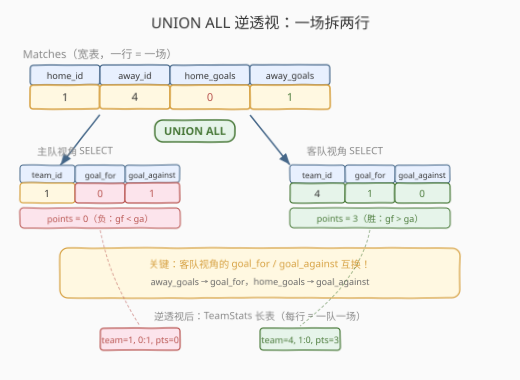
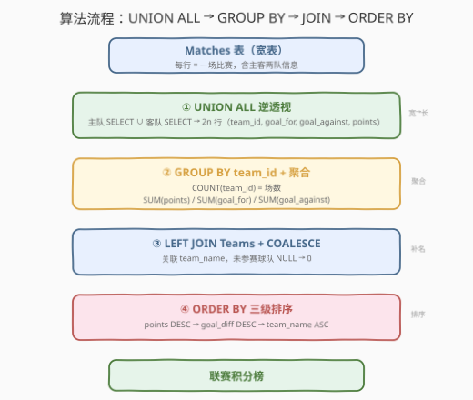
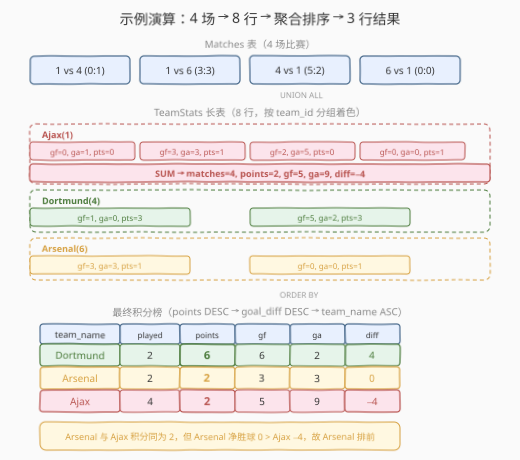

# 联赛信息统计

- **题目名称**：联赛信息统计
- **链接**：[1841. 联赛信息统计](https://leetcode.cn/problems/league-statistics/)
- **难度**：中等
- **标签**：数据库、SQL、`UNION ALL`（逆透视 UNPIVOT）、`GROUP BY` + 聚合、`CASE WHEN`、`LEFT JOIN`、`COALESCE`、多列排序、LeetCode 锁题

## 1. 题目概述

给定 `Teams` 表（球队信息）和 `Matches` 表（比赛记录），编写 SQL 查询报告联赛统计。胜者得 3 分，败者得 0 分；平局双方各得 1 分。每行输出球队名、比赛场数、积分、进球数、失球数、净胜球，按积分降序、净胜球降序、球队名字典序排列。

**表结构**：

```text
Table: Teams
+----------------+---------+
| Column Name    | Type    |
+----------------+---------+
| team_id        | int     |  ← 球队编号（主键）
| team_name      | varchar |  ← 球队名称
+----------------+---------+
team_id 是主键。

Table: Matches
+-----------------+---------+
| Column Name     | Type    |
+-----------------+---------+
| home_team_id    | int     |  ← 主队编号
| away_team_id    | int     |  ← 客队编号
| home_team_goals | int     |  ← 主队进球数
| away_team_goals | int     |  ← 客队进球数
+-----------------+---------+
(home_team_id, away_team_id) 是主键。
每行记录一场比赛，进球多者为胜。
```

> ⚠️ **每场比赛涉及两支球队**：一场比赛在 `Matches` 表中只有一行，但主队和客队各自的统计都需要更新。这是本题的核心难点——`Matches` 表是**宽表**（一行含两队信息），而统计需要按**单支球队**聚合（长表）。如何把「一场两队」的宽表摊成「一行一队」的长表，是解题的关键。

**示例 1**：

```text
输入：
Teams 表:
+---------+-----------+
| team_id | team_name |
+---------+-----------+
| 1       | Ajax      |
| 4       | Dortmund  |
| 6       | Arsenal   |
+---------+-----------+

Matches 表:
+--------------+--------------+-----------------+-----------------+
| home_team_id | away_team_id | home_team_goals | away_team_goals |
+--------------+--------------+-----------------+-----------------+
| 1            | 4            | 0               | 1               |
| 1            | 6            | 3               | 3               |
| 4            | 1            | 5               | 2               |
| 6            | 1            | 0               | 0               |
+--------------+--------------+-----------------+-----------------+

输出：
+-----------+----------------+--------+----------+--------------+-----------+
| team_name | matches_played | points | goal_for | goal_against | goal_diff |
+-----------+----------------+--------+----------+--------------+-----------+
| Dortmund  | 2              | 6      | 6        | 2            | 4         |
| Arsenal   | 2              | 2      | 3        | 3            | 0         |
| Ajax      | 4              | 2      | 5        | 9            | -4        |
+-----------+----------------+--------+----------+--------------+-----------+
```

**解释**：

| 球队 | 比赛场数 | 胜/平/负 | 积分 | 进球 | 失球 | 净胜球 |
|------|---------|---------|------|------|------|--------|
| Ajax (1) | 4 | 0 胜 2 平 2 负 | $0{\times}3 + 2{\times}1 + 2{\times}0 = 2$ | $0{+}3{+}2{+}0 = 5$ | $1{+}3{+}5{+}0 = 9$ | $5{-}9 = -4$ |
| Dortmund (4) | 2 | 2 胜 0 平 0 负 | $2{\times}3 = 6$ | $1{+}5 = 6$ | $0{+}2 = 2$ | $6{-}2 = 4$ |
| Arsenal (6) | 2 | 0 胜 2 平 0 负 | $2{\times}1 = 2$ | $3{+}0 = 3$ | $3{+}0 = 3$ | $3{-}3 = 0$ |

排序：Dortmund（6 分）→ Arsenal（2 分，净胜球 0）→ Ajax（2 分，净胜球 $-4$）。Arsenal 与 Ajax 积分相同，但 Arsenal 净胜球更高，排在前。

> 💡 **核心矛盾**：`Matches` 表每行是一场完整的比赛（含主客两队），但统计需要按**单支球队**聚合。一张比赛行要同时贡献到两支球队的统计——这是典型的**宽表转长表**（UNPIVOT）需求。SQL 中用 `UNION ALL` 把每行「拆」成两行（主队视角 + 客队视角），再 `GROUP BY team_id` 聚合。

---

## 2. 解题思路

### 2.1 暴力思路：逐场扫描，双端更新

最直觉的过程式思维是：遍历每场比赛，同时更新主队和客队的统计累加器。

```text
stats = defaultdict(lambda: {matches: 0, points: 0, gf: 0, ga: 0})
for match in Matches:
    home, away = match.home_team_id, match.away_team_id
    hg, ag = match.home_team_goals, match.away_team_goals
    # 主队
    stats[home].matches += 1; stats[home].gf += hg; stats[home].ga += ag
    # 客队
    stats[away].matches += 1; stats[away].gf += ag; stats[away].ga += hg
    # 积分
    if hg > ag:    stats[home].points += 3
    elif hg < ag:  stats[away].points += 3
    else:          stats[home].points += 1; stats[away].points += 1
```

逻辑正确，但**纯 SQL 没有逐行循环语句**——需要换成「集合式」表达。过程式思维中的「一场更新两队」在 SQL 中对应「一行拆成两行」的逆透视。

> ⚠️ **过程式思维的陷阱**：有人会想「分别算主队统计和客队统计，再合并」——这会导致每个球队出现在两张子表（主队表、客队表）中，合并时需处理「某球队只当过主队没当过客队」的 NULL 情况，`COALESCE` 嵌套层层叠加，代码臃肿且易错。`UNION ALL` 逆透视把两队统一到一张长表，一次性 `GROUP BY` 解决，是更优雅的范式。

### 2.2 核心观察：UNION ALL 逆透视——一场拆两行



关键转换：把 `Matches` 的每行**拆成两行**——主队视角一行、客队视角一行。每行统一为 `(team_id, goal_for, goal_against, points)` 四列：

**主队视角**（从 `Matches` 选主队列）：

$$\text{team\_id} = \text{home\_team\_id},\quad \text{goal\_for} = \text{home\_team\_goals},\quad \text{goal\_against} = \text{away\_team\_goals}$$

**客队视角**（从 `Matches` 选客队列，进球/失球互换）：

$$\text{team\_id} = \text{away\_team\_id},\quad \text{goal\_for} = \text{away\_team\_goals},\quad \text{goal\_against} = \text{home\_team\_goals}$$

两份 `SELECT` 用 `UNION ALL` 拼接，每场比赛变成两行。注意用 `UNION ALL` 而非 `UNION`——主客队视角不会产生完全相同的行，`ALL` 保留全部行且省去去重排序开销。

**积分计算**用 `CASE WHEN`：

$$\text{points} = \begin{cases} 3 & \text{if goal\_for} > \text{goal\_against} \quad (\text{胜}) \\ 1 & \text{if goal\_for} = \text{goal\_against} \quad (\text{平}) \\ 0 & \text{if goal\_for} < \text{goal\_against} \quad (\text{负}) \end{cases}$$

主队和客队的 `CASE WHEN` 逻辑完全对称——只需比较各自的 `goal_for` 与 `goal_against`，不需要关心「对面是谁」。

> 💡 **为什么成立？** 逆透视后，每行代表「一支球队在一场比赛中的表现」——它的 `goal_for` 是自己进的球，`goal_against` 是对手进的球。积分只取决于 `goal_for` 与 `goal_against` 的大小关系，与主客身份无关。这就是为什么主客两份 `SELECT` 的 `CASE WHEN` 完全相同——逆透视把「主客不对称」的宽表转换为「每行自包含」的长表，聚合逻辑由此统一。

### 2.3 算法流程图



**逻辑执行步骤**：

| 步骤 | 子句 | 作用 |
|------|------|------|
| ① | `WITH TeamStats AS (SELECT ... UNION ALL SELECT ...)` | 逆透视：每场比赛拆成主队 + 客队两行，统一为 `(team_id, goal_for, goal_against, points)` |
| ② | `GROUP BY team_id` | 按球队分组 |
| ③ | `COUNT(ts.team_id) / SUM(points) / SUM(goal_for) / SUM(goal_against)` | 聚合：比赛场数、积分、进球、失球 |
| ④ | `LEFT JOIN Teams t ON ...` | 关联球队名称，保证未参赛球队也出现 |
| ⑤ | `COALESCE(..., 0)` | 未参赛球队的 NULL 统计置零 |
| ⑥ | `ORDER BY points DESC, goal_diff DESC, team_name` | 三级排序：积分 → 净胜球 → 球队名 |

> 💡 **SQL 子句执行顺序**：`FROM`（含 `JOIN`/`ON`）→ `WHERE`（本题无额外行级过滤）→ `GROUP BY` → `HAVING`（无）→ `SELECT`（含聚合函数 + `COALESCE`）→ `ORDER BY` → `LIMIT`（无）。CTE `WITH` 在最前面一次性展开，物化为临时表供外层查询引用。

### 2.4 示例演算

以示例 1 的 4 场比赛为例，观察逆透视与聚合的全过程：



**步骤 ①：UNION ALL 逆透视（4 场 → 8 行）**

| 原始比赛 | 拆出的行 | team_id | goal_for | goal_against | 积分 |
|---------|---------|---------|----------|-------------|------|
| 1 vs 4 (0:1) | 主队视角 | 1 (Ajax) | 0 | 1 | 0（负） |
| | 客队视角 | 4 (Dortmund) | 1 | 0 | 3（胜） |
| 1 vs 6 (3:3) | 主队视角 | 1 (Ajax) | 3 | 3 | 1（平） |
| | 客队视角 | 6 (Arsenal) | 3 | 3 | 1（平） |
| 4 vs 1 (5:2) | 主队视角 | 4 (Dortmund) | 5 | 2 | 3（胜） |
| | 客队视角 | 1 (Ajax) | 2 | 5 | 0（负） |
| 6 vs 1 (0:0) | 主队视角 | 6 (Arsenal) | 0 | 0 | 1（平） |
| | 客队视角 | 1 (Ajax) | 0 | 0 | 1（平） |

**步骤 ②③：GROUP BY team_id 聚合**

| team_id | matches_played | points | goal_for | goal_against | goal_diff |
|---------|----------------|--------|----------|--------------|-----------|
| 1 (Ajax) | 4 | $0{+}1{+}0{+}1 = 2$ | $0{+}3{+}2{+}0 = 5$ | $1{+}3{+}5{+}0 = 9$ | $5{-}9 = -4$ |
| 4 (Dortmund) | 2 | $3{+}3 = 6$ | $1{+}5 = 6$ | $0{+}2 = 2$ | $6{-}2 = 4$ |
| 6 (Arsenal) | 2 | $1{+}1 = 2$ | $3{+}0 = 3$ | $3{+}0 = 3$ | $3{-}3 = 0$ |

**步骤 ④⑤⑥：LEFT JOIN Teams + ORDER BY**

| team_name | matches_played | points | goal_for | goal_against | goal_diff |
|-----------|----------------|--------|----------|--------------|-----------|
| Dortmund | 2 | 6 | 6 | 2 | 4 |
| Arsenal | 2 | 2 | 3 | 3 | 0 |
| Ajax | 4 | 2 | 5 | 9 | $-4$ |

> 💡 **排序要点**：Dortmund 积分最高（6），直接排第一。Ajax 与 Arsenal 积分相同（2），但 Arsenal 净胜球（0）> Ajax 净胜球（$-4$），故 Arsenal 排前。若净胜球也相同，则按 `team_name` 字典序排列。

---

## 3. 参考代码

### SQL（解法 A：UNION ALL 逆透视 + CTE + LEFT JOIN，推荐）

```sql
WITH TeamStats AS (
    SELECT home_team_id AS team_id,
           home_team_goals AS goal_for,
           away_team_goals AS goal_against,
           CASE
               WHEN home_team_goals > away_team_goals THEN 3
               WHEN home_team_goals = away_team_goals THEN 1
               ELSE 0
           END AS points
    FROM Matches
    UNION ALL
    SELECT away_team_id AS team_id,
           away_team_goals AS goal_for,
           home_team_goals AS goal_against,
           CASE
               WHEN away_team_goals > home_team_goals THEN 3
               WHEN away_team_goals = home_team_goals THEN 1
               ELSE 0
           END AS points
    FROM Matches
)
SELECT
    t.team_name,
    COUNT(ts.team_id) AS matches_played,
    COALESCE(SUM(ts.points), 0) AS points,
    COALESCE(SUM(ts.goal_for), 0) AS goal_for,
    COALESCE(SUM(ts.goal_against), 0) AS goal_against,
    COALESCE(SUM(ts.goal_for), 0) - COALESCE(SUM(ts.goal_against), 0) AS goal_diff
FROM Teams t
LEFT JOIN TeamStats ts ON t.team_id = ts.team_id
GROUP BY t.team_id, t.team_name
ORDER BY points DESC, goal_diff DESC, team_name;
```

> 💡 **写法要点**：
> - CTE `TeamStats` 用 `UNION ALL` 把每场比赛拆成主队 + 客队两行，统一为 `(team_id, goal_for, goal_against, points)` 四列。
> - `COUNT(ts.team_id)` 而非 `COUNT(*)`：`LEFT JOIN` 未匹配行 `ts.team_id` 为 NULL，`COUNT(列名)` 不计 NULL，正确得到 0；`COUNT(*)` 会把未匹配行也计为 1。
> - `COALESCE(SUM(...), 0)`：未参赛球队的 `SUM` 返回 NULL，用 `COALESCE` 置零。
> - `LEFT JOIN` 保证未参赛球队也出现在结果中（场数 0、积分 0）。
> - `goal_diff` 在外层 SELECT 计算，复用已 `COALESCE` 的 `SUM` 值。
> - 三级排序 `ORDER BY points DESC, goal_diff DESC, team_name`（默认 ASC）。

### SQL（解法 A'：子查询替代 CTE，兼容 MySQL 5.7）

```sql
SELECT
    t.team_name,
    COUNT(ts.team_id) AS matches_played,
    COALESCE(SUM(ts.points), 0) AS points,
    COALESCE(SUM(ts.goal_for), 0) AS goal_for,
    COALESCE(SUM(ts.goal_against), 0) AS goal_against,
    COALESCE(SUM(ts.goal_for), 0) - COALESCE(SUM(ts.goal_against), 0) AS goal_diff
FROM Teams t
LEFT JOIN (
    SELECT home_team_id AS team_id,
           home_team_goals AS goal_for,
           away_team_goals AS goal_against,
           CASE
               WHEN home_team_goals > away_team_goals THEN 3
               WHEN home_team_goals = away_team_goals THEN 1
               ELSE 0
           END AS points
    FROM Matches
    UNION ALL
    SELECT away_team_id AS team_id,
           away_team_goals AS goal_for,
           home_team_goals AS goal_against,
           CASE
               WHEN away_team_goals > home_team_goals THEN 3
               WHEN away_team_goals = home_team_goals THEN 1
               ELSE 0
           END AS points
    FROM Matches
) ts ON t.team_id = ts.team_id
GROUP BY t.team_id, t.team_name
ORDER BY points DESC, goal_diff DESC, team_name;
```

> 💡 **与解法 A 的区别**：仅把 CTE `WITH TeamStats AS (...)` 换成内联子查询 `LEFT JOIN (...) ts`，逻辑完全等价。MySQL 5.7 及更早版本不支持 CTE（`WITH` 子句），需用此写法。MySQL 8.0+ 两者均可，CTE 可读性更好。

### SQL（解法 B：主客分别聚合 + JOIN，不用 UNION ALL）

```sql
SELECT
    t.team_name,
    COALESCE(h.matches_played, 0) + COALESCE(a.matches_played, 0) AS matches_played,
    COALESCE(h.points, 0) + COALESCE(a.points, 0) AS points,
    COALESCE(h.goal_for, 0) + COALESCE(a.goal_for, 0) AS goal_for,
    COALESCE(h.goal_against, 0) + COALESCE(a.goal_against, 0) AS goal_against,
    COALESCE(h.goal_for, 0) + COALESCE(a.goal_for, 0)
        - COALESCE(h.goal_against, 0) - COALESCE(a.goal_against, 0) AS goal_diff
FROM Teams t
LEFT JOIN (
    SELECT home_team_id AS team_id,
           COUNT(*) AS matches_played,
           SUM(CASE WHEN home_team_goals > away_team_goals THEN 3
                    WHEN home_team_goals = away_team_goals THEN 1
                    ELSE 0 END) AS points,
           SUM(home_team_goals) AS goal_for,
           SUM(away_team_goals) AS goal_against
    FROM Matches
    GROUP BY home_team_id
) h ON t.team_id = h.team_id
LEFT JOIN (
    SELECT away_team_id AS team_id,
           COUNT(*) AS matches_played,
           SUM(CASE WHEN away_team_goals > home_team_goals THEN 3
                    WHEN away_team_goals = home_team_goals THEN 1
                    ELSE 0 END) AS points,
           SUM(away_team_goals) AS goal_for,
           SUM(home_team_goals) AS goal_against
    FROM Matches
    GROUP BY away_team_id
) a ON t.team_id = a.team_id
ORDER BY points DESC, goal_diff DESC, team_name;
```

> 💡 **与解法 A 的区别**：解法 B 分别对主队和客队做 `GROUP BY` 聚合，再两次 `LEFT JOIN` 合并到 `Teams`。优点是每张子表只扫一次 `Matches`（无需翻倍行数）；缺点是 `SELECT` 中每个指标都要 `COALESCE(h.?, 0) + COALESCE(a.?, 0)` 两段相加——6 个指标 × 2 段 = 12 次 `COALESCE`，代码冗长且维护性差。解法 A 的 `UNION ALL` 把主客统一到一张长表，`GROUP BY` 一次搞定，是更优雅的范式。

### Python（pandas）

```python
import pandas as pd
import numpy as np

def league_statistics(teams: pd.DataFrame, matches: pd.DataFrame) -> pd.DataFrame:
    home = pd.DataFrame({
        'team_id': matches['home_team_id'],
        'goal_for': matches['home_team_goals'],
        'goal_against': matches['away_team_goals'],
    })
    away = pd.DataFrame({
        'team_id': matches['away_team_id'],
        'goal_for': matches['away_team_goals'],
        'goal_against': matches['home_team_goals'],
    })
    stats = pd.concat([home, away], ignore_index=True)
    stats['points'] = np.where(stats['goal_for'] > stats['goal_against'], 3,
                       np.where(stats['goal_for'] == stats['goal_against'], 1, 0))
    agg = stats.groupby('team_id', as_index=False).agg(
        matches_played=('team_id', 'size'),
        points=('points', 'sum'),
        goal_for=('goal_for', 'sum'),
        goal_against=('goal_against', 'sum'),
    )
    result = teams.merge(agg, on='team_id', how='left').fillna(0)
    result['goal_diff'] = result['goal_for'] - result['goal_against']
    result = result[['team_name', 'matches_played', 'points',
                     'goal_for', 'goal_against', 'goal_diff']]
    result = result.sort_values(['points', 'goal_diff', 'team_name'],
                                ascending=[False, False, True]).reset_index(drop=True)
    return result
```

> 💡 **pandas 对照**：`pd.concat([home, away])` 对应 SQL 的 `UNION ALL` 逆透视；`np.where` 嵌套对应 `CASE WHEN`；`groupby('team_id').agg(...)` 对应 `GROUP BY` + 聚合函数；`merge(..., how='left').fillna(0)` 对应 `LEFT JOIN` + `COALESCE`；`sort_values(..., ascending=[False, False, True])` 对应三级 `ORDER BY`。

---

## 4. 复杂度分析

| 维度 | 复杂度 | 说明 |
|------|--------|------|
| **时间** | $O(n + t \log t)$ | `UNION ALL` 扫描 `Matches` 两次产出 $2n$ 行（$n$ 为比赛数）；`GROUP BY` 对 $2n$ 行哈希聚合 $O(n)$；`LEFT JOIN Teams` $O(n + t)$（$t$ 为球队数）；排序 $O(t \log t)$ |
| **空间** | $O(n)$ | CTE/子查询物化 $2n$ 行中间表；聚合结果 $O(t)$ |
| **结果行数** | $t$ | 等于球队总数（含未参赛球队） |

> ⚠️ SQL 复杂度取决于**执行计划与索引**。`UNION ALL` 的两份 `SELECT` 各全表扫描 `Matches` 一次，合计 $O(n)$；若在 `home_team_id`、`away_team_id` 上建索引且只查特定球队，可走索引。`GROUP BY` 在 `team_id` 有索引时可利用有序读取避免排序。面试中说明「`UNION ALL` 翻倍行数但仍是 $O(n)$，`GROUP BY` 哈希聚合 $O(n)$，排序 $O(t \log t)$」即可。

---

## 5. 扩展：宽表逆透视（UNPIVOT）与 CASE WHEN 积分模型

### 5.1 UNION ALL 是 SQL 的 UNPIVOT

`Matches` 表是**宽表**——一行同时存储主队和客队两方信息。而聚合统计需要按**单支球队**（长表）进行。SQL 没有 `UNPIVOT` 运算符（Oracle/SQL Server 有专用 `UNPIVOT` 子句，MySQL 没有），但 `UNION ALL` 是通用的逆透视手法：

| 宽表行数 | 逆透视后行数 | 拆分方式 |
|----------|-------------|---------|
| $n$ 场比赛 | $2n$ 行球队视角 | 每行拆成主队 `SELECT` + 客队 `SELECT`，`UNION ALL` 拼接 |

> 💡 **通用模式**：任何「一行含 $k$ 个实体」的宽表，都可以用 $k$ 份 `SELECT` + `UNION ALL` 拆成「一行一实体」的长表。本题 $k=2$（主队 + 客队），1811 的三奖牌宽表 $k=3$（金 + 银 + 铜），是同一模式的实例。

### 5.2 CASE WHEN 积分模型

体育联赛的积分规则（胜 3 平 1 负 0）用 `CASE WHEN` 实现，是 SQL 条件映射的典型场景：

```sql
CASE
    WHEN goal_for > goal_against THEN 3   -- 胜
    WHEN goal_for = goal_against THEN 1   -- 平
    ELSE 0                                 -- 负
END
```

> 💡 **为什么用 `ELSE 0` 而非 `WHEN goal_for < goal_against THEN 0`？** `goal_for` 与 `goal_against` 的关系只有三种：`>`、`=`、`<`。前两个 `WHEN` 已覆盖 `>` 和 `=`，剩余情况必然是 `<`，故 `ELSE 0` 等价且更简洁。若积分规则更复杂（如弃权判负扣分），需显式列出所有分支。

### 5.3 COUNT(列名) vs COUNT(*) 的 LEFT JOIN 陷阱

| 写法 | 未参赛球队的结果 | 原因 |
|------|-----------------|------|
| `COUNT(ts.team_id)` | 0 ✓ | `LEFT JOIN` 未匹配行 `ts.team_id` 为 NULL，`COUNT(列名)` 不计 NULL |
| `COUNT(*)` | 1 ✗ | `COUNT(*)` 计所有行（含未匹配的全 NULL 行），未参赛球队被误计为 1 场 |

> ⚠️ **LEFT JOIN + COUNT 的经典坑**：`COUNT(*)` 会把 `LEFT JOIN` 产生的未匹配行（全 NULL 行）也计为 1。统计「有几次匹配」必须用 `COUNT(右表.非空列)` 或 `COUNT(右表.主键)`。这是 SQL 面试高频考点。

---

## 6. 面试要点

**Q1：为什么用 `UNION ALL` 而非 `UNION`？**

> 逆透视后主队视角行 `(home_team_id, ...)` 与客队视角行 `(away_team_id, ...)` 的 `team_id` 列取值不同，不会产生完全相同的行。`UNION` 会额外做去重排序（$O(n \log n)$），而 `UNION ALL` 直接拼接（$O(n)$），省去不必要的开销。**逆透视场景一律用 `UNION ALL`**。

**Q2：为什么用 `LEFT JOIN` 而非 `INNER JOIN`？**

> 联赛统计应包含所有注册球队——即使某球队尚未参赛（`matches_played = 0`）。`LEFT JOIN Teams` 保留全部球队，未参赛球队的聚合列经 `COALESCE(..., 0)` 置零。若用 `INNER JOIN`，未参赛球队会从结果中消失。

**Q3：`COUNT(ts.team_id)` 和 `COUNT(*)` 有什么区别？**

> `LEFT JOIN` 未匹配时产生一行全 NULL 的行。`COUNT(*)` 计所有行包括全 NULL 行（返回 1），而 `COUNT(ts.team_id)` 只计 `ts.team_id` 非 NULL 的行（返回 0）。统计「实际比赛场数」必须用 `COUNT(ts.team_id)`。

**Q4：如果积分规则改为「胜 3 平 1 负 0，且进球数超过 3 个额外加 1 分」，怎么改？**

> 在 `CASE WHEN` 中叠加条件，或在 `points` 表达式上追加。例如：
> ```sql
> CASE WHEN home_team_goals > away_team_goals THEN 3 + IF(home_team_goals > 3, 1, 0)
>      WHEN home_team_goals = away_team_goals THEN 1
>      ELSE 0 END
> ```
> `CASE WHEN` 的分支可灵活组合，是 SQL 表达「条件映射」的标准工具。

**Q5：解法 A（UNION ALL）和解法 B（分别聚合）哪个更好？**

> 解法 A 更优：(1) 代码简洁——`GROUP BY` 一次搞定，解法 B 需 12 次 `COALESCE` 相加；(2) 可维护——积分规则只写一处 `CASE WHEN`，解法 B 要在主队/客队各写一份；(3) 执行计划更优——`UNION ALL` 后一次 `GROUP BY` 走一遍哈希聚合，解法 B 两次 `GROUP BY` + 两次 `JOIN` 合并。解法 B 的唯一优势是不翻倍行数，但 $2n$ 与 $n$ 的渐进复杂度相同。

> 💡 **一句话总结**：1841 是 SQL **"宽表逆透视 + 分组聚合"招牌题**——核心模板「`UNION ALL` 把一场两行拆成一行一队 → `CASE WHEN` 算积分 → `GROUP BY team_id` 聚合 → `LEFT JOIN Teams` 取名 + `COALESCE` 置零 → 三级 `ORDER BY`」。最大要点：**宽表先逆透视才能按单实体聚合**，`COUNT(列名)` 而非 `COUNT(*)` 防 LEFT JOIN 虚计数。

---

## 7. 同类练习题

- [1811. 寻找面试候选人](https://leetcode.cn/problems/find-interview-candidates/)（[站内题解](../1801-1900/1811_寻找面试候选人.md)）：同为 `UNION ALL` 逆透视招牌题——把「一场三奖」的宽表 `Contests` 摊成「一行一奖」的长表 `Medals`，与 1841 的「一场两队」拆行完全同构，只是 $k=3$ vs $k=2$
- [1179. 重新格式化部门表](https://leetcode.cn/problems/reformat-department-table/)：`CASE WHEN` + 聚合函数的行列转换——与 1841 的 `CASE WHEN` 积分模型共享「条件映射」思想，对照「行转列」与「列转行（逆透视）」两个方向
- [586. 订单最多的客户](https://leetcode.cn/problems/customer-placing-the-largest-number-of-orders/)：`GROUP BY` + `COUNT` + `ORDER BY ... LIMIT 1` 分组聚合取极值——对照 1841 理解「分组聚合 + 排序」的基础骨架，1841 在此基础上叠加逆透视与多列排序
- [1174. 即时食物配送 II](https://leetcode.cn/problems/immediate-food-delivery-ii/)：同为「先聚合再关联」——按 `customer_id` 分组取首次订单，再与原表 `JOIN` 筛选，对照 1841 的 `GROUP BY` + `LEFT JOIN` 模式
- [627. 变更性别](https://leetcode.cn/problems/swap-salary/)：`CASE WHEN` 条件更新——`UPDATE SET sex = CASE WHEN ... THEN ... END`，与 1841 的 `CASE WHEN` 积分映射同属「条件表达式」家族，对照 SELECT 中的条件映射与 UPDATE 中的条件更新
