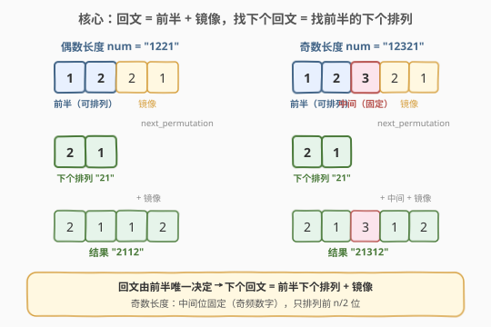
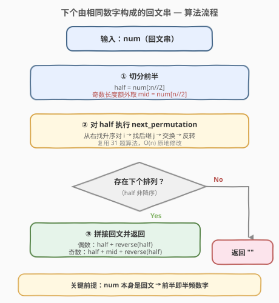
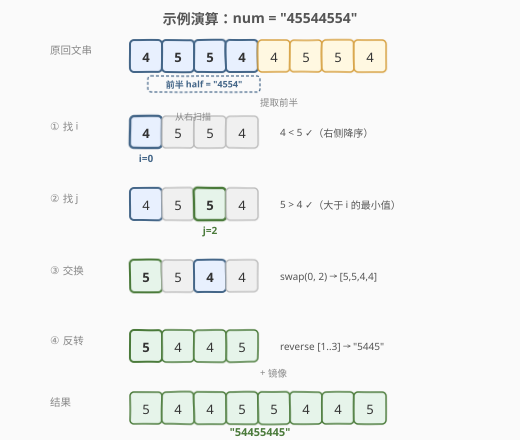

# LeetCode 下个由相同数字构成的回文串 题解

## 1. 题目概述

- **标题 / 题号**：下个由相同数字构成的回文串（#1842，hard）
- **链接**：https://leetcode.cn/problems/next-palindrome-using-same-digits/
- **难度**：困难
- **标签**：字符串、贪心、下一个排列

**题意**：给定一个数字字符串 `num`，表示一个**回文数**。要求用 `num` 的**全部数字**重新排列，得到一个比 `num` **严格更大**的最小回文串。若不存在这样的回文串，返回空字符串 `""`。

**示例 1**：

```text
输入：num = "1221"
输出："2112"
解释：用 {1, 2, 2, 1} 重排能得到的大于 "1221" 的最小回文是 "2112"。
```

**示例 2**：

```text
输入：num = "32123"
输出：""
解释：前半 "32" 已降序，无法得到更大的排列。
```

**示例 3**：

```text
输入：num = "45544554"
输出："54455445"
```

**约束**：

- $1 \leq \text{num.length} \leq 10^5$
- `num` 是一个**回文串**

> 💡 **关键前提**：题目保证 `num` 本身就是回文串。这意味着 `num` 的前半部分天然就是"半频数字"——每个数字在前后两半各出现一半。因此前半部分可以直接提取出来做排列，无需额外统计频率。

## 2. 解题思路

### 2.1 暴力思路：枚举所有排列

生成 `num` 全部数字的所有排列，筛选出回文串，再从中找大于 `num` 的最小者。但 $n$ 个数字的排列数可达 $n!$，$n = 10^5$ 时完全不可行。

> ⚠️ 暴力的痛点在于没抓住"回文串由前半唯一决定"这一结构性质。回文串的后半是前半的镜像，所以只需排列前半即可——排列空间从 $n!$ 缩小到 $(n/2)!$。

### 2.2 核心观察：回文 = 前半 + 镜像，找下个回文 = 找前半的下个排列



回文串的**前半部分唯一决定整个串**——后半只是前半的镜像（奇数长度时中间还夹一个固定字符）。因此：

1. **偶数长度** `n`：回文 = `half + reverse(half)`，其中 `half = num[:n/2]`。
2. **奇数长度** `n`：回文 = `half + mid + reverse(half)`，其中 `half = num[:n//2]`，`mid = num[n//2]`。

要找比 `num` 更大的最小回文，等价于找 `half` 的**下一个排列**（字典序刚好大一点的排列），然后镜像拼接。

> ⚠️ **奇数长度的关键细节**：中间位 `mid` 是频次为奇数的数字（回文串保证只有一个），**必须固定**。只对 `half`（前 $n/2$ 位）做 `next_permutation`，不能动中间位——否则数字频率会被破坏。

### 2.3 算法流程图



**主流程**：

1. 令 `half = num[:n//2]`（转成列表以便原地修改）。若 $n$ 为奇数，记 `mid = num[n//2]`。
2. 对 `half` 执行 `next_permutation`（复用 [31 题](../0001-0100/31_下一个排列.md)算法）：
   - 从右往左找首个 `half[i] < half[i+1]` 的 $i$。
   - 从右往左找首个 `half[j] > half[i]` 的 $j$，交换 `half[i]` 与 `half[j]`。
   - 反转 `half[i+1:]`。
3. 若找不到 $i$（`half` 已降序），返回 `""`。
4. 否则，拼接结果：偶数 → `half + reverse(half)`，奇数 → `half + mid + reverse(half)`。

> 💡 **为什么直接用前半做 next_permutation 就行？** 因为 `num` 是回文串，它的前半恰好是"每个数字取一半频率"的子集。对前半做排列不会改变数字总频率——镜像部分自动补充另一半。这是本题能用 31 题算法直接求解的前提。

### 2.4 示例演算

以 `num = "45544554"`（$n = 8$，偶数）为例：



| 步骤 | 操作 | half 状态 | 说明 |
|------|------|-----------|------|
| ① 找 $i$ | 从右找首个升序对 | `[4,5,5,4]` | `5≥4`、`5≥5`、`4<5` → $i=0$（右侧 `[5,5,4]` 降序） |
| ② 找 $j$ | 右侧找首个 `>4` | 同上 | `4` 不大于 `4`，`5>4` ✓ → $j=2$（值为 5） |
| ③ 交换 | swap(0, 2) | `[5,5,4,4]` | 用 5 替换位置 0 的 4 |
| ④ 反转 | reverse(1..3) | `[5,4,4,5]` | 右侧 `[5,4,4]`→`[4,4,5]` |

最终拼接：`"5445"` + `"5445"` = `"54455445"` ✓

> ⚠️ **验证**：`"54455445"` 确实 $>$ `"45544554"`（首位 $5 > 4$），且数字频率 $\{4:4, 5:4\}$ 与原串一致 ✓。

## 3. 参考代码

### Python

```python
class Solution:
    def nextPalindrome(self, num: str) -> str:
        n = len(num)
        half = list(num[:n // 2])
        mid = num[n // 2] if n % 2 else ""

        if not self._next_permutation(half):
            return ""

        new_half = "".join(half)
        return new_half + mid + new_half[::-1]

    def _next_permutation(self, arr: list[str]) -> bool:
        n = len(arr)
        i = n - 2
        while i >= 0 and arr[i] >= arr[i + 1]:
            i -= 1
        if i < 0:
            return False
        j = n - 1
        while arr[j] <= arr[i]:
            j -= 1
        arr[i], arr[j] = arr[j], arr[i]
        arr[i + 1:] = reversed(arr[i + 1:])
        return True
```

### C++

```cpp
class Solution {
public:
    string nextPalindrome(string num) {
        int n = num.size();
        string half = num.substr(0, n / 2);
        string mid = (n % 2) ? string(1, num[n / 2]) : "";

        if (!next_permutation(half.begin(), half.end()))
            return "";

        string rev_half(half.rbegin(), half.rend());
        return half + mid + rev_half;
    }
};
```

> 💡 **实现细节**：① C++ 直接调用 `std::next_permutation`，返回 `false` 表示已是最大排列。② Python 手写 `_next_permutation`，逻辑与 [31 题](../0001-0100/31_下一个排列.md)完全一致，但找到最大排列时返回 `false` 而非回绕到最小排列。③ `mid` 用空字符串 `""` 表示偶数长度无中间位，拼接时自动跳过。④ `n = 1` 时 `half` 为空，`next_permutation` 返回 `false`，正确返回 `""`。

## 4. 复杂度分析

| 维度 | 复杂度 | 说明 |
|------|--------|------|
| 时间复杂度 | $O(n)$ | `next_permutation` 三次线性扫描（找 $i$、找 $j$、反转），各遍历至多 $n/2$ 个元素；拼接结果 $O(n)$ |
| 空间复杂度 | $O(n)$ | 存储前半 `half`（$n/2$）和结果字符串（$n$）；C++ 中 `half` 是 `num` 的子串拷贝 |

> ⚠️ 虽然空间是 $O(n)$，但这是输出字符串的固有开销。算法本身的**额外**空间为 $O(n/2)$（前半副本），无法原地修改 `num` 因为需要同时读取和写入。

## 5. 扩展：如果 num 不是回文串怎么办？

本题的关键简化在于 `num` **本身就是回文串**，使得前半天然等于"半频数字"。若去掉这个前提（即 `num` 是任意正整数），问题会更复杂：

1. **频率校验**：需先统计数字频率，判断能否组成回文（至多一个奇频数字）。
2. **构建半频集合**：根据频率手动构建前半应有的数字集合（每个数字取 `freq/2` 份）。
3. **找最小合法前半**：前 $n/2$ 位可能不等于半频集合，需要用贪心策略找到大于 `num[:n/2]` 的最小排列。

> 💡 这种泛化版本更接近「给定字符集，构造大于目标的最小回文」的组合问题，需要逐位贪心 + 回溯，复杂度显著上升。本题的"回文输入"约束是让问题退化为 `next_permutation` 的关键。

## 6. 面试要点

1. **为什么 num 是回文串这个前提很重要？**

   > 回文串的前半恰好是"每个数字取一半"的子集。因此直接提取前半做 `next_permutation` 不会改变数字总频率——镜像自动补充另一半。若 `num` 非回文，前半的数字集合可能不对，排列后频率会错。

2. **奇数长度为什么不能对整个前缀（含中间位）做 next_permutation？**

   > 中间位必须是奇频数字（回文串保证唯一）。若对含中间位的前缀做排列，中间位可能变成别的数字，导致频率失衡。例如 `"12321"` 前缀 `"123"` 的下个排列 `"132"` 会把中间从 `3` 变成 `2`，结果 `"13231"` 的频率 $\{1:2, 2:1, 3:2\}$ ≠ 原始 $\{1:2, 2:2, 3:1\}$。

3. **什么时候返回空字符串？**

   > 当前半已降序（字典序最大排列），`next_permutation` 找不到升序对 $i$，说明没有更大的排列可选，返回 `""`。例如 `"32123"` 前半 `"32"` 已降序。

4. **与 31 题（下一个排列）的区别是什么？**

   > 31 题对整个数组做 `next_permutation`，最大排列时回绕到最小排列。本题只对前半做，最大排列时返回空串（不回绕）。此外，本题多一步"镜像拼接"将前半扩展为完整回文。

5. **n = 1 的边界情况如何处理？**

   > `n = 1` 时 `half` 为空串，`next_permutation` 在空列表上 `i = -2 < 0` 直接返回 `false`，结果为 `""`。单个数字无法组成更大的回文，正确。

## 同类练习题

| # | 题目 | 与本题的关联 |
|---|------|-------------|
| 31 | [下一个排列](https://leetcode.cn/problems/next-permutation/)（[题解](../0001-0100/31_下一个排列.md)） | 本题的核心子算法，从右找升序对 + 交换 + 反转，$O(n)$ 原地求下一个字典序排列 |
| 556 | [下一个更大元素 III](https://leetcode.cn/problems/next-greater-element-iii/) | 把整数当数字数组套用 `next_permutation`，同样需判断是否存在更大排列 |
| 266 | [回文排列](https://leetcode.cn/problems/palindrome-permutation/) | 判断字符串能否重排为回文——频率校验部分，是本题"能否构造回文"的前置知识 |
| 409 | [最长回文串](https://leetcode.cn/problems/longest-palindrome/) | 用给定字符集构造最长回文——频率与回文构造的关系，对比本题"用全部数字构造"的约束差异 |
