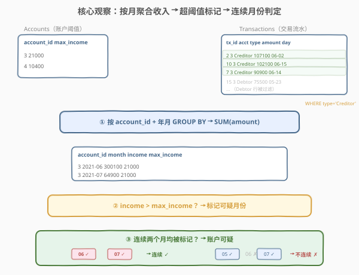
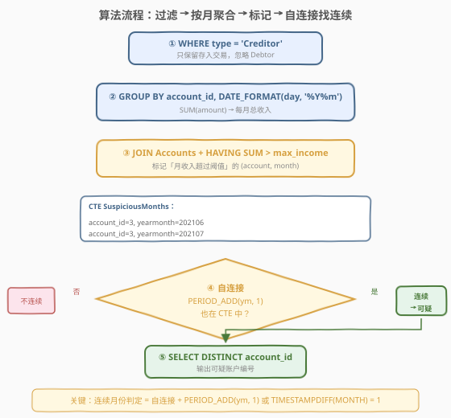
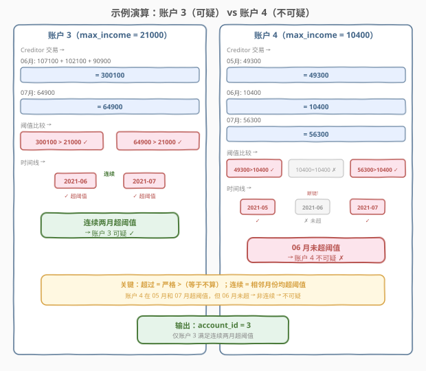

# 可疑银行账户

- **题目名称**：可疑银行账户
- **链接**：[1843. 可疑银行账户 🔒](https://leetcode.cn/problems/suspicious-bank-accounts/)
- **难度**：中等
- **标签**：数据库、SQL、CTE、`GROUP BY`、`HAVING`、自连接、日期处理、连续区间判定

## 1. 题目概述

给定 `Accounts`（账户阈值表）与 `Transactions`（交易流水表）两张表，编写 SQL 查询，报告所有**可疑银行账户**的 `account_id`。如果一个账户在**连续两个及以上月份**的**月总收入**超过 `max_income`，则认为该账户可疑。月总收入 = 当月所有 `type = 'Creditor'`（存入）交易的 `amount` 之和。

**表结构**：

```text
Table: Accounts
+----------------+------+
| Column Name    | Type |
+----------------+------+
| account_id     | int  |  ← 主键
| max_income     | int  |  ← 每月最大收入阈值
+----------------+------+
account_id 是这张表具有唯一值的列。
每行包含一个银行账户每月最大收入的信息。

Table: Transactions
+----------------+----------+
| Column Name    | Type     |
+----------------+----------+
| transaction_id | int      |  ← 主键
| account_id     | int      |  → Accounts.account_id
| type           | ENUM     |  ← 'Creditor' / 'Debtor'
| amount         | int      |
| day            | datetime |
+----------------+----------+
transaction_id 是这张表具有唯一值的列。
type 为 'Creditor' 表示存入，'Debtor' 表示取出。
```

**输出列**：`account_id`。结果可按任意顺序返回。

**示例 1**：

```text
输入：
Accounts 表:
+------------+------------+
| account_id | max_income |
+------------+------------+
| 3          | 21000      |
| 4          | 10400      |
+------------+------------+

Transactions 表:
+----------------+------------+----------+--------+---------------------+
| transaction_id | account_id | type     | amount | day                 |
+----------------+------------+----------+--------+---------------------+
| 2              | 3          | Creditor | 107100 | 2021-06-02 11:38:14 |
| 4              | 4          | Creditor | 10400  | 2021-06-20 12:39:18 |
| 11             | 4          | Debtor   | 58800  | 2021-07-23 12:41:55 |
| 1              | 4          | Creditor | 49300  | 2021-05-03 16:11:04 |
| 15             | 3          | Debtor   | 75500  | 2021-05-23 14:40:20 |
| 10             | 3          | Creditor | 102100 | 2021-06-15 10:37:16 |
| 14             | 4          | Creditor | 56300  | 2021-07-21 12:12:25 |
| 19             | 4          | Debtor   | 101100 | 2021-05-09 15:21:49 |
| 8              | 3          | Creditor | 64900  | 2021-07-26 15:09:56 |
| 7              | 3          | Creditor | 90900  | 2021-06-14 11:23:07 |
+----------------+------------+----------+--------+---------------------+

输出：
+------------+
| account_id |
+------------+
| 3          |
+------------+
```

**解释**：

| account_id | max_income | 月份 | Creditor 收入明细 | 月总收入 | 超阈值？ | 连续？ | 结论 |
|------------|------------|------|-------------------|----------|----------|--------|------|
| 3 | 21000 | 2021-06 | 107100 + 102100 + 90900 | 300100 | ✓（300100 > 21000） | ✓ 06↔07 | **可疑** |
| 3 | 21000 | 2021-07 | 64900 | 64900 | ✓（64900 > 21000） | 连续 | |
| 4 | 10400 | 2021-05 | 49300 | 49300 | ✓（49300 > 10400） | ✗ 05↔06 断 | **不可疑** |
| 4 | 10400 | 2021-06 | 10400 | 10400 | ✗（10400 = 10400，不超） | 链 | |
| 4 | 10400 | 2021-07 | 56300 | 56300 | ✓（56300 > 10400） | ✗ 06↔07 断 | |

> ⚠️ **两个关键语义**：①「超过」是**严格大于**——账户 4 在 2021-06 月收入恰好等于 `max_income`（10400 = 10400），不算超过；②「连续」要求**相邻月份均超阈值**——账户 4 在 05 月和 07 月超阈值但 06 月未超，05 与 07 非相邻，不构成连续。

> 💡 本题是 SQL **"CTE 分阶段 + 自连接判连续"招牌题**——核心四步：① `WHERE type = 'Creditor'` 过滤存入交易；② `GROUP BY account_id, 年月` + `SUM(amount)` 算月收入；③ `HAVING SUM > max_income` 标记超阈值月份；④ CTE 自连接 + `PERIOD_ADD` 或 `TIMESTAMPDIFF` 判定连续月份。难点在于「连续月份」的 SQL 表达——需自连接或窗口函数检测相邻月份。

---

## 2. 解题思路

### 2.1 暴力思路：逐账户逐月扫描

最直觉的过程式思路：对每个账户，按月汇总 Creditor 交易额，与 `max_income` 比较标记超阈值月份，再检查是否存在相邻的两个月均被标记。

```text
result = []
for account in Accounts:
    monthly = {}
    for tx in Transactions:
        if tx.account_id == account.account_id and tx.type == 'Creditor':
            month = truncate_to_month(tx.day)
            monthly[month] = monthly.get(month, 0) + tx.amount
    flagged = [m for m, inc in monthly.items() if inc > account.max_income]
    flagged.sort()
    for i in range(len(flagged) - 1):
        if month_diff(flagged[i], flagged[i+1]) == 1:
            result.append(account.account_id)
            break
return result
```

逻辑正确，但 SQL 表达「按月聚合」最自然的方式是 `GROUP BY` + `SUM`，而「检查连续月份」最自然的方式是**自连接**——把标记后的表与自身连接，查找相邻月份对。

### 2.2 核心观察：CTE 分阶段 + 自连接判连续



**关键洞察**：问题可拆解为三个独立的子问题，每个用一句 SQL 解决：

| 子问题 | SQL 手段 | 说明 |
|--------|----------|------|
| ① 月总收入 | `GROUP BY account_id, DATE_FORMAT(day, '%Y%m')` + `SUM(amount)` + `WHERE type='Creditor'` | 按账户+月份折叠 Creditor 交易 |
| ② 超阈值标记 | `JOIN Accounts` + `HAVING SUM(amount) > max_income` | 保留月收入严格超过阈值的 (account, month) |
| ③ 连续月份 | CTE 自连接 + `PERIOD_ADD(yearmonth, 1)` | 查找下一个月也在标记集中 |

> 💡 **为何用 CTE？** 步骤 ③ 需要引用步骤 ② 的结果做自连接。若把 ② 写成子查询，自连接时需重复写两遍子查询，代码冗长。CTE 把 ② 的结果命名为 `SuspiciousMonths`，自连接时直接引用两次，**逻辑清晰且可读性强**。

> ⚠️ **`HAVING SUM(amount) > AVG(max_income)` 的技巧**：`GROUP BY account_id, yearmonth` 后，同一组内 `max_income` 是常量（每个 account 只有一个 max_income），所以 `AVG(max_income) = max_income`。用 `AVG` 包裹是为了绕过 `ONLY_FULL_GROUP_BY` 限制——`max_income` 不在 `GROUP BY` 中，直接写 `HAVING SUM(amount) > max_income` 会报错，但聚合函数 `AVG(max_income)` 合法。也可用 `MIN(max_income)` 或 `MAX(max_income)`，效果相同。

### 2.3 算法流程图



**逻辑执行步骤**：

| 步骤 | 子句 | 作用 |
|------|------|------|
| ① | `WHERE type = 'Creditor'` | 过滤存入交易，忽略 Debtor |
| ② | `GROUP BY account_id, DATE_FORMAT(day, '%Y%m')` | 按账户+月份折叠交易行 |
| ③ | `HAVING SUM(amount) > AVG(max_income)` | 保留月收入超阈值的组（AVG 绕 ONLY_FULL_GROUP_BY） |
| ④ | CTE 自连接 + `PERIOD_ADD(yearmonth, 1) IN (...)` | 查找下月也在标记集中的行 |
| ⑤ | `SELECT DISTINCT account_id` | 输出可疑账户编号 |

> 💡 **`PERIOD_ADD(yyyymm, n)`**：MySQL 内置函数，将 `yyyymm` 格式的年月加 `n` 个月，返回新的 `yyyymm`。如 `PERIOD_ADD(202106, 1) = 202107`。它自动处理跨年（`PERIOD_ADD(202112, 1) = 202201`），比手动计算月份加减更简洁。也可用 `TIMESTAMPDIFF(MONTH, m1, m2) = 1` 判连续，但需要先把 `yyyymm` 转成 `DATE` 类型。

### 2.4 示例演算

以示例 1 的两个账户为例，观察「按月聚合 → 阈值标记 → 连续判定」的逐步过程：



**步骤 ①②③：过滤 + 按月聚合 + 超阈值标记**

| account_id | yearmonth | Creditor 明细 | 月总收入 | max_income | 超阈值？ |
|------------|-----------|---------------|----------|------------|----------|
| 3 | 202106 | 107100 + 102100 + 90900 | 300100 | 21000 | ✓（300100 > 21000） |
| 3 | 202107 | 64900 | 64900 | 21000 | ✓（64900 > 21000） |
| 4 | 202105 | 49300 | 49300 | 10400 | ✓（49300 > 10400） |
| 4 | 202106 | 10400 | 10400 | 10400 | ✗（10400 = 10400，不超） |
| 4 | 202107 | 56300 | 56300 | 10400 | ✓（56300 > 10400） |

CTE `SuspiciousMonths` 结果（仅保留超阈值行）：

| account_id | yearmonth |
|------------|-----------|
| 3 | 202106 |
| 3 | 202107 |
| 4 | 202105 |
| 4 | 202107 |

**步骤 ④：自连接判定连续月份**

对 CTE 中每一行，检查 `(account_id, PERIOD_ADD(yearmonth, 1))` 是否也在 CTE 中：

| 当前行 | 下月 (PERIOD_ADD+1) | 在 CTE 中？ | 连续？ |
|--------|---------------------|-------------|--------|
| (3, 202106) | 202107 | ✓（3, 202107 在） | ✓ **连续** |
| (3, 202107) | 202108 | ✗ | — |
| (4, 202105) | 202106 | ✗（4, 202106 不在，因 10400 = 10400 未超） | ✗ 断链 |
| (4, 202107) | 202108 | ✗ | — |

**步骤 ⑤：输出**

仅账户 3 存在连续两个月超阈值 → 输出 `account_id = 3`，与示例一致。

> 💡 **账户 4 的断链**：账户 4 在 05 月和 07 月超阈值，但 06 月收入恰好等于 `max_income`（10400 = 10400），不满足**严格大于**，因此 06 月不在 CTE 中。05→06 断链、06→07 断链，05 与 07 非相邻，不构成连续。这是本题最易踩的坑——「超过」不含等于。

---

## 3. 参考代码

### SQL（解法 A：CTE + 自连接 + PERIOD_ADD，推荐）

```sql
WITH SuspiciousMonths AS (
    SELECT
        t.account_id,
        DATE_FORMAT(t.day, '%Y%m') AS yearmonth
    FROM Transactions t
    JOIN Accounts a ON t.account_id = a.account_id
    WHERE t.type = 'Creditor'
    GROUP BY t.account_id, DATE_FORMAT(t.day, '%Y%m')
    HAVING SUM(t.amount) > AVG(a.max_income)
)
SELECT DISTINCT s1.account_id
FROM SuspiciousMonths s1
WHERE (s1.account_id, PERIOD_ADD(s1.yearmonth, 1)) IN (
    SELECT s2.account_id, s2.yearmonth FROM SuspiciousMonths s2
)
ORDER BY s1.account_id;
```

> 💡 **写法要点**：
> - **CTE `SuspiciousMonths`**：先 `JOIN Accounts` 取阈值，再 `WHERE type = 'Creditor'` 过滤存入交易，`GROUP BY account_id, yearmonth` 按月聚合，`HAVING SUM(amount) > AVG(max_income)` 筛超阈值月份。
> - **`AVG(max_income)` 而非 `max_income`**：`max_income` 不在 `GROUP BY` 中，直接引用会触发 `ONLY_FULL_GROUP_BY` 报错。同一组内 `max_income` 为常量，`AVG` 等于原值，绕过限制。
> - **自连接逻辑**：对 CTE 中每一行，用 `PERIOD_ADD(yearmonth, 1)` 算下月，检查 `(account_id, 下月)` 是否也在 CTE 中。若在，说明连续两月超阈值。
> - **`DISTINCT`**：一个账户可能有多对连续月份（如 3 个月连续超阈值会产生 2 对），`DISTINCT` 保证账户只出现一次。
> - ✓ **最推荐**：CTE 分阶段清晰，`PERIOD_ADD` 自动处理跨年，逻辑可读性最佳。

### SQL（解法 B：CTE + 自连接 + TIMESTAMPDIFF，日期型方案）

```sql
WITH SuspiciousMonths AS (
    SELECT
        t.account_id,
        DATE_FORMAT(t.day, '%Y-%m-01') AS month_start
    FROM Transactions t
    JOIN Accounts a ON t.account_id = a.account_id
    WHERE t.type = 'Creditor'
    GROUP BY t.account_id, DATE_FORMAT(t.day, '%Y-%m-01')
    HAVING SUM(t.amount) > AVG(a.max_income)
)
SELECT DISTINCT s1.account_id
FROM SuspiciousMonths s1
JOIN SuspiciousMonths s2
    ON s1.account_id = s2.account_id
    AND TIMESTAMPDIFF(MONTH, s1.month_start, s2.month_start) = 1
ORDER BY s1.account_id;
```

> 💡 **解法 B 与 A 的区别**：用 `DATE_FORMAT(day, '%Y-%m-01')` 把日期截断为**月初 DATE 类型**，再用 `TIMESTAMPDIFF(MONTH, m1, m2) = 1` 判连续。相比 `PERIOD_ADD` 操作 `yyyymm` 字符串/整数，此方案操作 DATE 类型，语义更直观，也更适合需要进一步日期运算的场景（如计算季度、周等）。自连接用 `JOIN` 而非 `IN` 子查询——`JOIN` 在大表上通常比 `IN` 更高效（优化器可走哈希连接）。

### SQL（解法 C：CTE + LAG 窗口函数，单次扫描方案）

```sql
WITH MonthlyIncome AS (
    SELECT
        t.account_id,
        DATE_FORMAT(t.day, '%Y%m') AS yearmonth,
        SUM(t.amount) AS income
    FROM Transactions t
    WHERE t.type = 'Creditor'
    GROUP BY t.account_id, DATE_FORMAT(t.day, '%Y%m')
),
Flagged AS (
    SELECT
        m.account_id,
        m.yearmonth,
        m.income,
        a.max_income,
        CASE WHEN m.income > a.max_income THEN 1 ELSE 0 END AS flag
    FROM MonthlyIncome m
    JOIN Accounts a ON m.account_id = a.account_id
),
WithPrev AS (
    SELECT
        account_id,
        yearmonth,
        flag,
        LAG(yearmonth) OVER (PARTITION BY account_id ORDER BY yearmonth) AS prev_ym,
        LAG(flag)      OVER (PARTITION BY account_id ORDER BY yearmonth) AS prev_flag
    FROM Flagged
)
SELECT DISTINCT account_id
FROM WithPrev
WHERE flag = 1
  AND prev_flag = 1
  AND PERIOD_ADD(prev_ym, 1) = yearmonth
ORDER BY account_id;
```

> 💡 **解法 C 的思路**：用 `LAG()` 窗口函数取**同一账户按月排序后的上一行**，检查当前行和上一行是否都 `flag = 1` 且月份相邻（`PERIOD_ADD(prev_ym, 1) = yearmonth`）。
>
> **与解法 A/B 的对比**：
> - **优势**：避免自连接，逻辑上单次扫描 CTE 即可（窗口函数在分组内排序后取上一行），大数据量时可能更优。
> - **劣势**：需三层 CTE 嵌套（月收入 → 标记 → 加 LAG），代码更长；且 `LAG` 取的是「排序后上一行」而非「上一日历月」——若有月份缺口（如某月无 Creditor 交易），上一行可能不是上一月，因此**必须额外检查 `PERIOD_ADD(prev_ym, 1) = yearmonth`** 确认月份确实相邻。
> - **适用场景**：当需要检查「连续 N 个月」（N > 2）时，窗口函数方案更易扩展（用 `ROWS BETWEEN N PRECEDING AND CURRENT ROW` 窗口框架），而自连接方案需 N-1 次连接。

### Python（pandas）

```python
import pandas as pd

def suspicious_bank_accounts(accounts: pd.DataFrame, transactions: pd.DataFrame) -> pd.DataFrame:
    creditor = transactions[transactions['type'] == 'Creditor'].copy()
    creditor['yearmonth'] = creditor['day'].dt.strftime('%Y%m')
    monthly = creditor.groupby(['account_id', 'yearmonth'])['amount'].sum().reset_index()
    merged = monthly.merge(accounts, on='account_id')
    flagged = merged[merged['amount'] > merged['max_income']].copy()
    flagged = flagged.sort_values(['account_id', 'yearmonth'])
    flagged['prev_ym'] = flagged.groupby('account_id')['yearmonth'].shift(1)
    flagged['prev_flag'] = flagged['amount'].notna().astype(int)
    flagged['next_ym_exists'] = flagged.apply(
        lambda r: pd.Period(r['yearmonth'], freq='M') - pd.Period(r['prev_ym'], freq='M') == 1
        if pd.notna(r['prev_ym']) else False, axis=1
    )
    suspicious = flagged[flagged['next_ym_exists']].drop_duplicates('account_id')
    return suspicious[['account_id']]
```

> 💡 **pandas 对照**：
> - `transactions[transactions['type'] == 'Creditor']`——对应 `WHERE type = 'Creditor'`。
> - `groupby(['account_id', 'yearmonth'])['amount'].sum()`——对应 `GROUP BY account_id, yearmonth` + `SUM(amount)`。
> - `merge(accounts, on='account_id')`——对应 `JOIN Accounts ON account_id`。
> - `merged['amount'] > merged['max_income']`——对应 `HAVING SUM(amount) > max_income`（pandas 中聚合后为普通列，布尔索引等价 `HAVING`）。
> - `.shift(1)`——对应 `LAG()` 窗口函数，取同账户按月排序后的上一行。
> - `pd.Period(...) - pd.Period(...)` —— 对应 `PERIOD_ADD` 判定月份差为 1。

---

## 4. 复杂度分析

| 维度 | 解法 A（CTE + IN） | 解法 B（CTE + JOIN） | 解法 C（CTE + LAG） | pandas |
|------|-------------------|---------------------|---------------------|--------|
| **时间** | $O(T \log T)$ | $O(T \log T)$ | $O(T \log T)$ | $O(T \log T)$ |
| **空间** | $O(A \times M)$（CTE 物化） | $O(A \times M)$（CTE 物化 + 连接中间表） | $O(A \times M)$（三层 CTE） | $O(T)$ |
| **扫表次数** | Transactions 1 次 + CTE 自查 1 次 | Transactions 1 次 + CTE 自连接 1 次 | Transactions 1 次 + 窗口排序 1 次 | 各表 1 次 |
| **可读性** | ✓ **最清晰** | ✓ 清晰 | ✓ 可扩展 | ✓ 直观 |
| **推荐度** | ✓ **首选** | ✓ 日期运算场景 | ✓ 连续 N 月场景 | ✓ 验证用 |

> - $T$ = `Transactions` 行数，$A$ = `Accounts` 行数，$M$ = 每账户平均月份数
> - **时间复杂度**：主要开销在 `GROUP BY` 排序 $O(T \log T)$ 和 CTE 自连接/窗口排序 $O(A \times M \log(A \times M))$。由于 $A \times M \leq T$，总体 $O(T \log T)$。
> - **解法 A vs B**：`IN` 子查询在小数据集上与 `JOIN` 性能相当；大数据集时 `JOIN` 通常更优（优化器可走哈希连接，`IN` 可能退化为逐行查找）。LeetCode 数据规模（$\leq 1000$ 行）三者无差异。
> - **索引优化**：在 `Transactions(account_id, type)` 上建复合索引可加速 `WHERE type = 'Creditor'` 的过滤与分组；`Transactions(day)` 索引有助于按月聚合。

---

## 5. 扩展：连续区间判定与日期截断技法

### 5.1 连续月份判定的三种方案对比

| 方案 | 函数 | 语法 | 优势 | 劣势 |
|------|------|------|------|------|
| **PERIOD_ADD** | `PERIOD_ADD(yyyymm, 1)` | 操作 `yyyymm` 整数/字符串 | 简洁，自动跨年 | 仅 MySQL，非标准 SQL |
| **TIMESTAMPDIFF** | `TIMESTAMPDIFF(MONTH, d1, d2)` | 操作 DATE 类型 | 标准 SQL，语义直观 | 需先转 DATE 类型 |
| **LAG 窗口** | `LAG() OVER (PARTITION BY ... ORDER BY ...)` | 窗口函数取上一行 | 单次扫描，易扩展 N 连续 | 代码长，需额外验证月份相邻 |

> 💡 **跨年处理**：`PERIOD_ADD(202112, 1) = 202201`，自动处理 12 月→1 月的跨年。若手动用 `yearmonth + 1` 会得到 `202113`（错误），因此**月份加减必须用专用函数**，不可直接算术运算。

### 5.2 日期截断：DATE_FORMAT 的两种格式

| 格式 | 输出示例 | 类型 | 用途 |
|------|----------|------|------|
| `'%Y%m'` | `202106` | 字符串/整数 | 配合 `PERIOD_ADD`（需整数参数） |
| `'%Y-%m-01'` | `2021-06-01` | DATE | 配合 `TIMESTAMPDIFF`、日期运算 |

> 💡 选择哪种格式取决于后续操作：用 `PERIOD_ADD` 选 `'%Y%m'`；用 `TIMESTAMPDIFF` 或日期比较选 `'%Y-%m-01'`。两种格式在 `GROUP BY` 中效果相同（都是按月分组）。

### 5.3 若改为「连续 N 个月」

```sql
-- 用窗口函数检查连续 N 个月（以 N=3 为例）
WITH Flagged AS (
    SELECT
        t.account_id,
        DATE_FORMAT(t.day, '%Y%m') AS ym,
        ROW_NUMBER() OVER (PARTITION BY t.account_id ORDER BY DATE_FORMAT(t.day, '%Y%m')) AS rn
    FROM Transactions t
    JOIN Accounts a ON t.account_id = a.account_id
    WHERE t.type = 'Creditor'
    GROUP BY t.account_id, DATE_FORMAT(t.day, '%Y%m')
    HAVING SUM(t.amount) > AVG(a.max_income)
)
SELECT DISTINCT account_id
FROM Flagged f1
WHERE EXISTS (SELECT 1 FROM Flagged f2 WHERE f2.account_id = f1.account_id AND f2.rn = f1.rn + 1 AND PERIOD_ADD(f1.ym, 1) = f2.ym)
  AND EXISTS (SELECT 1 FROM Flagged f3 WHERE f3.account_id = f1.account_id AND f3.rn = f1.rn + 2 AND PERIOD_ADD(f1.ym, 2) = f3.ym);
```

> 💡 **连续 N 个月的通用模式**：用 `ROW_NUMBER()` 给排序后的标记月份编号，检查连续 N 个 `rn` 的月份差是否恰好为 0, 1, ..., N-1。自连接方案需 N-1 次 `EXISTS`，窗口函数方案可用 `ROWS BETWEEN N PRECEDING AND CURRENT ROW` 窗口框架更优雅。

### 5.4 `AVG(max_income)` vs `GROUP BY max_income` 的等价性

| 写法 | `ONLY_FULL_GROUP_BY` 兼容？ | 结果正确？ | 说明 |
|------|---------------------------|-----------|------|
| `HAVING SUM(amount) > AVG(max_income)` | ✓ | ✓ | 聚合函数绕过限制 |
| `HAVING SUM(amount) > MAX(max_income)` | ✓ | ✓ | 同上，MAX=AVG=常量 |
| `HAVING SUM(amount) > max_income` | ✗ 报错 | — | 非聚合列不在 GROUP BY |
| `GROUP BY account_id, yearmonth, max_income` | ✓ | ✓ | 把 max_income 加入 GROUP BY |

> ⚠️ **最佳实践**：若追求代码简洁，用 `AVG(max_income)` 或 `MAX(max_income)` 绕过限制；若追求标准 SQL 兼容性，把 `max_income` 加入 `GROUP BY`（因为 `account_id → max_income` 是函数依赖，加入不影响分组粒度）。LeetCode 环境支持两种写法。

---

## 6. 面试要点

1. **「超过」是严格大于还是大于等于？**

   > 「超过」是**严格大于**（`>`）。账户 4 在 2021-06 月收入恰好等于 `max_income`（10400 = 10400），不算超过。若误用 `>=`，会把 06 月也标记为超阈值，导致账户 4 的 05↔06 和 06↔07 都连续，错误地判定为可疑。这是本题最易踩的语义坑——面试中应主动确认「超过是否含等于」。

2. **如何判定两个月份是否连续？有哪些方案？**

   > 三种方案：① `PERIOD_ADD(yyyymm, 1)`——MySQL 内置函数，把 `yyyymm` 加 1 月，自动跨年，最简洁；② `TIMESTAMPDIFF(MONTH, d1, d2) = 1`——操作 DATE 类型，标准 SQL，语义直观；③ `LAG()` 窗口函数——取排序后上一行，需额外验证月份差为 1（因为可能有缺口）。面试中推荐先说 `PERIOD_ADD` 方案（简洁），再提 `TIMESTAMPDIFF`（标准 SQL），最后说 `LAG`（可扩展 N 连续）。

3. **为什么用 `AVG(max_income)` 而不直接写 `max_income`？**

   > `GROUP BY account_id, yearmonth` 后，`max_income` 不在 `GROUP BY` 中。MySQL 严格模式（`ONLY_FULL_GROUP_BY`，LeetCode 默认开启）会报错——非聚合列必须出现在 `GROUP BY` 中。用 `AVG(max_income)` 把它包装成聚合函数即可绕过限制。由于同一组内 `max_income` 是常量（每个 `account_id` 只有一个 `max_income`），`AVG(max_income) = max_income`，结果不变。也可用 `MAX` 或 `MIN`，或把 `max_income` 加入 `GROUP BY`。

4. **CTE 自连接时，`IN` 子查询和 `JOIN` 有什么区别？**

   > `IN` 子查询（解法 A）语义为「检查 (account, next_month) 是否在标记集中」，适合存在性检查；`JOIN`（解法 B）语义为「连接当前行与下月行」，适合需要同时引用两行数据的场景。小数据集上性能相当；大数据集上 `JOIN` 通常更优（优化器可走哈希连接，`IN` 可能退化为逐行子查询查找）。本题只需检查存在性，`IN` 更简洁；若需输出连续月份对（如 `(account, m1, m2)`），则必须用 `JOIN`。

5. **如果改为「连续 N 个月」，如何扩展？**

   > 自连接方案需 N-1 次 `EXISTS` 子查询，代码随 N 增长而冗长。窗口函数方案更优雅——用 `ROW_NUMBER()` 给标记月份编号，再用 `ROWS BETWEEN N PRECEDING AND CURRENT ROW` 窗口框架检查连续 N 行的月份差是否恰好为 0, 1, ..., N-1。详见 5.3 节。面试中答：「N=2 用自连接或 `LAG` 即可；N 较大时用窗口函数 + `ROW_NUMBER` 方案更易扩展。」

> 💡 **一句话总结**：1843 是 SQL **"CTE 分阶段 + 自连接判连续月份"招牌题**——核心模板「`WHERE type='Creditor'` → `GROUP BY account_id, 年月` → `HAVING SUM > max_income` → CTE 自连接 + `PERIOD_ADD(+1)` 判连续 → `DISTINCT account_id`」。三大要点：**①「超过」是严格 `>`（等于不算）；② 连续月份用 `PERIOD_ADD` 或 `TIMESTAMPDIFF` 判定（不可算术加减）；③ `AVG(max_income)` 绕 `ONLY_FULL_GROUP_BY` 限制**。

---

## 7. 同类练习题

- [1193. 每月交易 I](https://leetcode.cn/problems/monthly-transactions-i/)（[题解](../1101-1200/1193_每月交易I.md)）：`DATE_FORMAT` 按月分组 + `SUM`/`COUNT` 聚合，巩固「按月截断 + `GROUP BY`」基础骨架，1843 的月聚合前置技能
- [1174. 即时食物配送 II](https://leetcode.cn/problems/immediate-food-delivery-ii/)（[题解](../1101-1200/1174_即时食物配送II.md)）：`DATE_FORMAT` + 子查询取首单日期，巩固「日期截断 + 按月聚合」模式
- [1821. 寻找今年具有正收入的客户](https://leetcode.cn/problems/find-customers-with-positive-revenue-this-year/)（[题解](../1801-1900/1821_寻找今年具有正收入的客户.md)）：`WHERE` 行级过滤 + 复合主键，对照 1843 理解「行级筛选 vs 分组聚合 + HAVING」两种过滤范式
- [1809. 没有广告的剧集](https://leetcode.cn/problems/ad-free-sessions/)：`JOIN` + `NOT IN`/`LEFT JOIN ... IS NULL` 找未出现记录，对照 1843 的「自连接找已出现记录」反向逻辑
- [608. 树节点](https://leetcode.cn/problems/tree-node/)：`NOT IN` / `NOT EXISTS` / `LEFT JOIN ... IS NULL` 三种方案等价性，巩固自连接与子查询的选择策略
