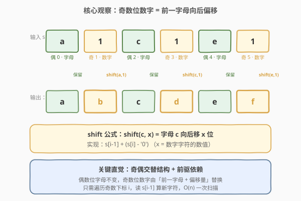
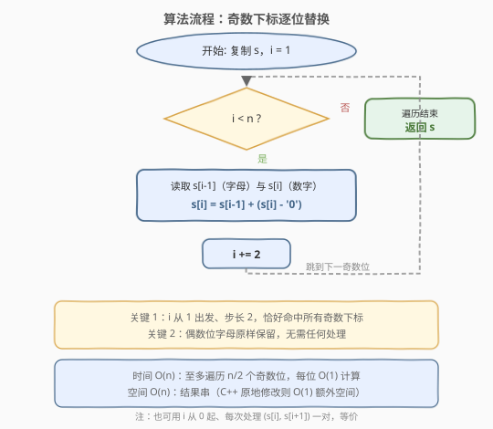
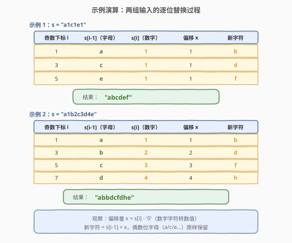

# 将所有数字用字符替换

- **题目名称**：将所有数字用字符替换
- **链接**：[1844. 将所有数字用字符替换](https://leetcode.cn/problems/replace-all-digits-with-characters/)
- **难度**：简单
- **标签**：字符串、模拟

## 1. 题目概述

给你一个下标从 **0** 开始的字符串 `s`，它的 **偶数** 下标处为小写英文字母，**奇数** 下标处为数字。

定义函数 `shift(c, x)`，其中 `c` 是一个字符且 `x` 是一个数字，函数返回字母表中 `c` **后面第** $x$ **个字符**。比方说，`shift('a', 5) = 'f'`、`shift('x', 0) = 'x'`。

对于每个**奇数**下标 $i$，你需要将数字 $s[i]$ 用 $\text{shift}(s[i-1],\; s[i])$ 替换。请替换所有数字以后将字符串 `s` 返回。题目**保证** $\text{shift}(s[i-1],\; s[i])$ 不会超过 `'z'`。

**示例 1**：

```text
输入：s = "a1c1e1"
输出："abcdef"
解释：数字被替换结果如下：
- s[1] -> shift('a', 1) = 'b'
- s[3] -> shift('c', 1) = 'd'
- s[5] -> shift('e', 1) = 'f'
```

**示例 2**：

```text
输入：s = "a1b2c3d4e"
输出："abbdcfdhe"
解释：数字被替换结果如下：
- s[1] -> shift('a', 1) = 'b'
- s[3] -> shift('b', 2) = 'd'
- s[5] -> shift('c', 3) = 'f'
- s[7] -> shift('d', 4) = 'h'
```

**约束条件**：

- `1 <= s.length <= 100`
- `s` 只包含小写英文字母和数字
- 对所有**奇数**下标 $i$，满足 $\text{shift}(s[i-1],\; s[i]) \le$ `'z'`

> 💡 **核心矛盾**：要把每个奇数位的「数字字符」换成「一个字母」，而新字母由「前一字母 + 偏移量」决定。关键观察是字符串的**奇偶交替结构**——偶数位恒为字母（保留不动），奇数位恒为数字（待替换），且每个数字的替换**只依赖它左边紧邻的那一个字母**。能否只扫一遍奇数下标就原地完成所有替换？

---

## 2. 解题思路

### 2.1 暴力思路：逐字符判断

最直觉的做法是遍历每个下标 $i$，判断奇偶：

- 若 $i$ 为偶数：`s[i]` 是字母，**跳过**。
- 若 $i$ 为奇数：`s[i]` 是数字，计算 $\text{shift}(s[i-1],\; s[i])$ 写回。

```text
for i in range(len(s)):
    if i % 2 == 1:                # 奇数位才处理
        s[i] = shift(s[i-1], s[i])
return s
```

这能 AC，但每次都用 `i % 2` 判断奇偶略显冗余——既然待处理的位置**一定是 1, 3, 5, …**，何不直接以步长 2 跳着走？

### 2.2 核心观察：奇偶交替 + 前驱依赖



题目保证字符串呈**严格的「字母-数字-字母-数字-…」交替结构**。这意味着：

1. **偶数位（0, 2, 4, …）** 恒为字母，**永远不需要改动**。
2. **奇数位（1, 3, 5, …）** 恒为数字，**全部需要替换**。
3. 每个奇数位 $i$ 的新字符**只依赖** $s[i-1]$（前一字母，且该字母在偶数位、不会被修改）与 $s[i]$（当前数字）。

因此不必逐位判断奇偶，**直接从 $i = 1$ 出发、步长 2**，恰好命中所有待替换位置：

$$i \in \{1,\; 3,\; 5,\; \dots\}, \quad \text{步长} = 2$$

> 💡 **shift 的本质是字符码加法**：`shift(c, x)` 就是把字母 `c` 在字母表中向后移 $x$ 位。由于小写字母在 ASCII 中连续排列（`'a'`=97, `'b'`=98, …），向后移 $x$ 位等价于字符码加 $x$。而 $s[i]$ 是数字字符 `'0'`–`'9'`，其**数值** $x = s[i] - {}$`'0'`。于是：
>
> $$\text{新字符} = s[i-1] + (s[i] - \text{'0'})$$
>
> 例如 `shift('a', 1) = 'a' + (1 - 0) = 'a' + 1 = 'b'`。题目保证结果不超过 `'z'`，故无需处理溢出。

### 2.3 算法流程图



算法非常简洁——一次遍历奇数下标，每位做一次加法写回：

- **初始化**：复制 `s` 得到可修改的字符数组（Python 中 `list(s)`），下标 $i = 1$。
- **循环**（步长 2）：只要 $i < n$，执行 `s[i] = s[i-1] + (s[i] - '0')`，然后 $i \mathrel{+}= 2$。
- **返回**：遍历结束，拼接字符数组返回。

> 💡 **为什么步长 2 安全？** 因为字符串长度恒为奇数或偶数：若长度为偶数，最后一个下标是奇数（恰被处理）；若长度为奇数，最后一个下标是偶数（字母，本就跳过）。两种情况下步长 2 都不会越界——循环条件 $i < n$ 已兜底。

### 2.4 示例演算



以题目两个示例逐位验证：

| 示例 | 输入 | 奇数位处理 | 输出 |
|------|------|-----------|------|
| 1 | `"a1c1e1"` | i=1: `'a'+1='b'`；i=3: `'c'+1='d'`；i=5: `'e'+1='f'` | `"abcdef"` |
| 2 | `"a1b2c3d4e"` | i=1: `'a'+1='b'`；i=3: `'b'+2='d'`；i=5: `'c'+3='f'`；i=7: `'d'+4='h'` | `"abbdcfdhe"` |

> 💡 注意示例 2 中偶数位字母 `a, b, c, d, e` 全部原样保留，只有奇数位的数字被替换。最终结果里**偶数位不变、奇数位变字母**，整体仍是一串字母。这正是「前驱依赖」的妙处——每个新字母都从**未被改动的前一字母**算出，替换顺序不影响结果。

---

## 3. 参考代码

### C++（原地修改 + 步长 2）

```cpp
class Solution {
  public:
    string replaceDigits(string s) {
        for (int i = 1; i < (int)s.size(); i += 2) {
            s[i] = s[i - 1] + (s[i] - '0');   // shift(s[i-1], s[i]-'0')
        }
        return s;
    }
};
```

### Python（列表修改 + 步长 2）

```python
class Solution:
    def replaceDigits(self, s: str) -> str:
        a = list(s)
        for i in range(1, len(a), 2):
            a[i] = chr(ord(a[i - 1]) + (ord(a[i]) - ord('0')))
        return ''.join(a)
```

### Python（切片一行流，对照用）

```python
class Solution:
    def replaceDigits(self, s: str) -> str:
        a = list(s)
        a[1::2] = [chr(ord(c) + (ord(d) - ord('0')))
                   for c, d in zip(s[::2], s[1::2])]
        return ''.join(a)
```

> ⚠️ **两种写法的对比**：切片写法 `a[1::2] = ...` 简洁优雅，利用 `s[::2]`（所有偶数位字母）与 `s[1::2]`（所有奇数位数字）配对 `zip` 一次性算出全部新字符，工程中常用；但会构造中间列表。`for` 循环步长 2 写法更直白地体现「奇数位逐个替换」的逻辑，面试中先写循环版点出前驱依赖，再提切片版作为对照。

---

## 4. 复杂度分析

| 维度 | 复杂度 | 说明 |
|------|--------|------|
| 时间复杂度 | $O(n)$ | 至多遍历 $\lfloor n/2 \rfloor$ 个奇数下标，每位做 $O(1)$ 的字符码加法 |
| 空间复杂度 | $O(n)$ | Python 需将字符串转为可变列表 `list(s)`，最终 `''.join` 拼回，辅助空间与输入同阶；C++ 的 `string` 本身可变，原地修改，额外空间 $O(1)$ |

> 💡 **C++ vs Python 的空间差异**：C++ 中 `std::string` 是可变容器，`s[i] = ...` 直接原地改字符，无需复制；Python 中 `str` 不可变，必须经 `list(s)` → 修改 → `''.join` 三步，产生 $O(n)$ 辅助空间。这是语言特性决定的，与算法本身无关。返回的字符串是输出本身，不计入辅助空间。

---

## 5. 扩展：shift 的字符码本质

### 5.1 为什么 `c + x` 等价于「字母表中后移 x 位」

小写字母 `'a'`–`'z'` 在 ASCII（及 Unicode）中**连续排列**，码值依次为 97–122。因此：

$$\text{ord}(\text{'a'} + k) = 97 + k, \quad 0 \le k \le 25$$

`shift(c, x)` 要求返回 `c` 后第 $x$ 个字符，即码值增加 $x$：

$$\text{shift}(c,\; x) = \text{chr}(\text{ord}(c) + x)$$

这正是 `s[i-1] + (s[i] - '0')` 的来源——$s[i]$ 是数字字符 `'0'`–`'9'`，其数值 $x = \text{ord}(s[i]) - \text{ord}(\text{'0'})$。

### 5.2 若题目不保证不超过 `'z'`

题目保证 $\text{shift}(s[i-1],\; s[i]) \le$ `'z'`，故无需处理溢出。若放宽此约束，需做**循环回绕**（类似凯撒密码）：

$$\text{新字符} = \text{'a'} + \big((\text{ord}(s[i-1]) - \text{ord}(\text{'a'}) + x) \bmod 26\big)$$

即先归一到 0–25 的相对位置，加偏移后对 26 取模，再加回 `'a'`。这把「可能超出 `'z'`」的情况回绕到 `'a'` 重新开始。

### 5.3 与凯撒密码的关系

本题的 `shift` 操作就是**凯撒密码（Caesar Cipher）**的基本单元：把每个字母按固定偏移量后移。区别在于：

- **凯撒密码**：对**所有**字母统一偏移同一个 $k$。
- **本题**：只对**奇数位**替换，且每个位置的偏移量**由前一个数字决定**（偏移量随位置变化）。

若把本题的「数字」换成统一的密钥 $k$、并对所有字母操作，就退化为标准凯撒加密。

---

## 6. 面试要点

**Q1：为什么用步长 2 而不是逐位判断奇偶？**

> 题目保证字符串呈严格的「字母-数字」交替结构，待替换位置恰为 1, 3, 5, …。步长 2 直接命中所有待处理位、跳过所有偶数位字母，避免每次 `i % 2` 的冗余判断，代码更简洁、语义更聚焦。两种写法时间复杂度同为 $O(n)$，但步长 2 版本常数更小、意图更清晰。

**Q2：`shift(c, x)` 为什么能直接用字符码加法实现？**

> 小写字母 `'a'`–`'z'` 在 ASCII 中连续排列（97–122），「后移 $x$ 位」等价于「字符码加 $x$」。而数字字符 `'0'`–`'9'` 的数值 $x = s[i] - {}$`'0'`。所以新字符 = $s[i-1] + (s[i] - {}$`'0'`$)$。题目保证结果不超过 `'z'`，故无需回绕处理。

**Q3：替换顺序会影响结果吗？**

> 不会。每个奇数位 $i$ 的新字符只依赖 $s[i-1]$，而 $s[i-1]$ 在偶数位、是字母、**永远不会被修改**。因此无论从前向后还是从后向前替换，读到的 $s[i-1]$ 都是原始字母，结果一致。这是「前驱在不可变位置」带来的天然安全性。

**Q4：如果输入不保证奇偶交替结构怎么办？**

> 需先校验：偶数位必须是小写字母、奇数位必须是数字。若结构被破坏（如奇数位出现字母），则 `s[i] - '0'` 会得到错误的「数值」（如 `'a' - '0'` = 49），导致越界。工程中应加输入校验或用 `isdigit()` 判定后再计算。本题约束已排除此情况。

**Q5：Python 为什么要转成 `list` 再改？**

> Python 的 `str` 是**不可变对象**，无法直接 `s[i] = ...` 修改某个字符。必须先 `list(s)` 转为可变字符列表，修改后再 `''.join` 拼回字符串。这带来 $O(n)$ 辅助空间。C++ 的 `std::string` 本身可变，可原地修改，额外空间 $O(1)$。

---

## 7. 同类练习题

- [168. Excel表列名称](https://leetcode.cn/problems/excel-sheet-column-title/)（[站内题解](../0001-0100/168_Excel表列名称.md)）：同为「字符码算术」——把整数转成 A-Z 字母串，`-1 再取余` 处理 1-indexed，对照本题「字母码 + 偏移」的反向操作
- [171. Excel表列序号](https://leetcode.cn/problems/excel-sheet-column-number/)（[站内题解](../0101-0200/171_Excel表列序号.md)）：168 的合成方向——字母串转整数，Horner 累乘加，与本题「字符码加减」同属字符与数值互转家族
- [13. 罗马数字转整数](https://leetcode.cn/problems/roman-to-integer/)（[站内题解](../0001-0100/13_罗马数字转整数.md)）：同为「字符 → 数值」映射——罗马字符按哈希查值 + 左小右大则减的贪心，对照本题数字字符 `'0'-'0'` 取数值的简单映射
- [8. 字符串转换整数 (atoi)](https://leetcode.cn/problems/string-to-integer-atoi/)（[站内题解](../0001-0100/8_字符串转换整数atoi.md)）：同为字符串逐字符模拟——需处理符号、溢出等边界，比本题的字符码加法更复杂，同属字符串扫描题
- [242. 有效的字母异位词](https://leetcode.cn/problems/valid-anagram/)（[站内题解](../0201-0300/242_有效的字母异位词.md)）：同为小写字母字符码运算——用 `count[c - 'a']` 频率统计，对照本题 `s[i-1] + (s[i] - '0')` 的字符码偏移
