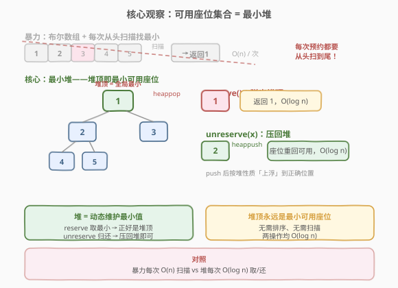
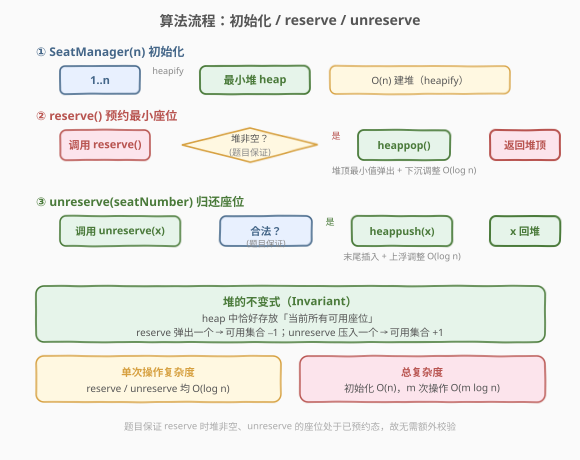
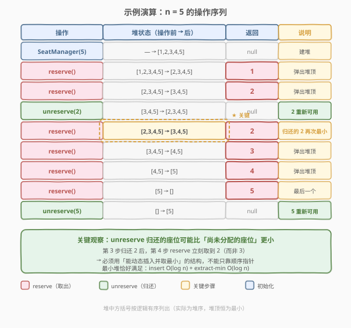

# LeetCode 座位预约管理系统 题解

## 1. 题目概述

- **标题 / 题号**：座位预约管理系统（#1845，medium）
- **链接**：https://leetcode.cn/problems/seat-reservation-manager/
- **难度**：中等
- **标签**：设计、堆、优先队列

**题意**：设计一个管理 `n` 个座位预约的系统，座位编号从 `1` 到 `n`，初始全部可预约。实现 `SeatManager` 类：

- `SeatManager(int n)`：初始化管理 `1..n` 共 `n` 个座位，全部可预约。
- `int reserve()`：返回可以预约的**最小编号**座位，并将其标记为不可预约。
- `void unreserve(int seatNumber)`：将编号 `seatNumber` 的座位重新变为可预约。

**示例 1**：

```text
输入：
["SeatManager","reserve","reserve","unreserve","reserve","reserve","reserve","reserve","unreserve"]
[[5],[],[],[2],[],[],[],[],[5]]
输出：
[null,1,2,null,2,3,4,5,null]
解释：
SeatManager(5)          // 管理 5 个座位
reserve()   -> 1        // 取最小可用，返回 1
reserve()   -> 2        // 取最小可用，返回 2
unreserve(2)            // 归还 2，可用集合变为 {2,3,4,5}
reserve()   -> 2        // 归还的 2 再次最小，返回 2
reserve()   -> 3
reserve()   -> 4
reserve()   -> 5        // 座位全部分配
unreserve(5)            // 归还 5
```

**约束**：

- $1 \le n \le 10^5$
- $1 \le \text{seatNumber} \le n$
- 每次 `reserve` 调用保证至少存在一个可预约座位
- 每次 `unreserve` 调用保证 `seatNumber` 当前处于已预约状态
- `reserve` 与 `unreserve` 调用**总共**不超过 $10^5$ 次

> 💡 注意 `unreserve` 归还的座位**可能比尚未分配的座位编号更小**（如示例中归还 2 后下次取到 2 而非 3）。这决定了不能用「顺序指针」简单了事——需要一个能**动态插入并随时取最小值**的结构。

## 2. 解题思路

### 2.1 暴力思路：布尔数组 + 线性扫描

最直观的做法是用一个长度为 $n+1$ 的布尔数组 `available[]` 标记每个座位是否可预约：

- `reserve()`：从下标 `1` 开始线性扫描，找到第一个 `available[i] == true` 的座位，置 `false` 并返回。
- `unreserve(x)`：直接 `available[x] = true`。

```text
reserve: for i in 1..n: if available[i]: available[i]=False; return i
```

> ⚠️ 问题在于 `reserve` 每次都要**从头扫到尾**找第一个可用座位，单次 $O(n)$。当 $n = 10^5$、操作 $10^5$ 次时，最坏 $O(n \cdot m) = 10^{10}$，明显超时。归还 $O(1)$ 很快，但取最小这一高频操作被扫描拖垮。

### 2.2 核心观察：最小堆——堆顶即最小可用座位



把「当前所有可用座位」放进一个**最小堆**（min-heap），堆顶永远是编号最小的可用座位：

- `reserve()`：弹出堆顶 `heappop`，即最小可用座位，返回它。
- `unreserve(x)`：把 `x` 压回堆 `heappush`，由堆自动维护位置。

$$\text{heap 中恰好存放当前所有可用座位} \quad \Longrightarrow \quad \text{堆顶} = \min(\text{可用集合})$$

两个操作都只需 $O(\log n)$ 的堆调整（弹出后「下沉」、压入后「上浮」），无需任何线性扫描。

> 💡 **为什么暴力不行而堆行**：暴力把「找最小」做成了**显式查询**（每次现扫），而堆把「维护最小」做成了**隐式不变式**——每次插入/删除时顺手维护堆序，查询最小变成 $O(1)$ 读堆顶。这是「动态取最值」场景下用堆替代线性扫描的招牌套路，与 [239. 滑动窗口最大值](https://leetcode.cn/problems/sliding-window-maximum/) 用单调队列维护窗口最值同源（只是这里不要求窗口约束）。

### 2.3 算法流程图



三个流程：

- **初始化** `SeatManager(n)`：把 $1, 2, \dots, n$ 全部压入最小堆。用 `heapify` 可在 $O(n)$ 完成（而非逐个 `heappush` 的 $O(n \log n)$）。
- **`reserve()`**：题目保证堆非空，直接 `heappop` 返回堆顶。
- **`unreserve(x)`**：题目保证 `x` 处于已预约态，直接 `heappush(x)` 归还。

> ⚠️ 题目对两类调用都给出了**合法性保证**（reserve 时至少一个可用、unreserve 的座位确实已预约），因此实现中无需额外校验，把保证当契约用即可。

### 2.4 示例演算



以题目示例 `n = 5` 逐步推演，重点看第 3-4 步：`unreserve(2)` 后堆恢复为 `[2,3,4,5]`，紧接着 `reserve()` 立刻取到 `2`（而非 `3`）。这印证了**归还的座位可能比未分配的更小**，必须用能动态插入取最小的堆。

| 步骤 | 操作 | 堆（操作前 → 后） | 返回 |
|------|------|-------------------|------|
| 0 | `SeatManager(5)` | — → `[1,2,3,4,5]` | null |
| 1 | `reserve()` | `[1,2,3,4,5]` → `[2,3,4,5]` | 1 |
| 2 | `reserve()` | `[2,3,4,5]` → `[3,4,5]` | 2 |
| 3 | `unreserve(2)` | `[3,4,5]` → `[2,3,4,5]` | null |
| 4 | `reserve()` | `[2,3,4,5]` → `[3,4,5]` | **2** ← 归还的 2 再次最小 |
| 5 | `reserve()` | `[3,4,5]` → `[4,5]` | 3 |
| 6 | `reserve()` | `[4,5]` → `[5]` | 4 |
| 7 | `reserve()` | `[5]` → `[]` | 5 |
| 8 | `unreserve(5)` | `[]` → `[5]` | null |

> 💡 表中堆内容按逻辑有序列出便于阅读，实际堆内部是堆序存储（数组 + 堆性质），但**堆顶恒为最小值**这一不变式始终成立。

## 3. 参考代码

### C++

```cpp
class SeatManager {
    priority_queue<int, vector<int>, greater<int>> heap;   // 小顶堆
  public:
    SeatManager(int n) {
        for (int i = 1; i <= n; ++i) heap.push(i);          // 1..n 全部入堆
    }

    int reserve() {
        int seat = heap.top();
        heap.pop();                                          // 弹出最小可用
        return seat;
    }

    void unreserve(int seatNumber) {
        heap.push(seatNumber);                               // 归还，压回堆
    }
};
```

> ⚠️ C++ 的 `priority_queue` 默认是大顶堆，要得到小顶堆需写明三个模板参数 `priority_queue<int, vector<int>, greater<int>>`。`greater<int>` 让「更大者优先级低」，从而堆顶为最小。

### Python

```python
import heapq


class SeatManager:

    def __init__(self, n: int):
        self.heap = list(range(1, n + 1))        # [1, 2, ..., n]
        heapq.heapify(self.heap)                 # O(n) 原地建堆

    def reserve(self) -> int:
        return heapq.heappop(self.heap)          # 弹出最小可用座位

    def unreserve(self, seatNumber: int) -> None:
        heapq.heappush(self.heap, seatNumber)    # 归还，压回堆
```

> 💡 Python 用 `heapq` 模块，`heapify` 可在 $O(n)$ 原地建堆（比逐个 `heappush` 的 $O(n \log n)$ 更优）。`heapq` 是小顶堆语义，直接满足「取最小」需求。

## 4. 复杂度分析

| 维度 | 复杂度 | 说明 |
|------|--------|------|
| 时间复杂度（初始化） | $O(n)$ | `heapify` 线性建堆；若逐个 `push` 则为 $O(n \log n)$ |
| 时间复杂度（`reserve`） | $O(\log n)$ | 堆顶弹出 + 末尾元素下沉调整 |
| 时间复杂度（`unreserve`） | $O(\log n)$ | 末尾插入 + 上浮调整 |
| 空间复杂度 | $O(n)$ | 堆中最多存放 $n$ 个座位编号 |

> 💡 设 `reserve` 与 `unreserve` 总调用次数为 $m$，则总时间 $O(n + m \log n)$。本题 $n, m \le 10^5$，最坏约 $10^5 \times 17 \approx 1.7 \times 10^6$ 次操作，远低于时限。

## 5. 扩展：惰性指针 + 小堆，省掉 $O(n)$ 初始化

若 `n` 极大而实际操作很少（比如 $n = 10^9$ 但只预约几十次），$O(n)$ 初始化与 $O(n)$ 空间都不可接受。可利用一个观察：**从未被预约过的座位天然按 $1, 2, 3, \dots$ 递增**，无需全部入堆，用一个「下一个未分配编号」指针 `nxt` 即可线性推进；只有 `unreserve` 归还的座位才需要入堆。

```python
class SeatManager:
    def __init__(self, n: int):
        self.nxt = 1          # 下一个从未分配的座位编号
        self.heap = []        # 仅存 unreserve 归还的座位

    def reserve(self) -> int:
        if self.heap and self.heap[0] < self.nxt:
            return heapq.heappop(self.heap)   # 归还的更小，优先取
        return self.nxt                       # 否则取下一个未分配的
        # 注意：取完后 nxt += 1（上面 return 时已取走）

    def unreserve(self, seatNumber: int) -> None:
        heapq.heappush(self.heap, seatNumber)
```

> ⚠️ 上面 `reserve` 的 `return self.nxt` 后需 `self.nxt += 1`，完整实现应写作 `seat = self.nxt; self.nxt += 1; return seat`。关键判断是 `heap[0] < nxt`：若堆顶（归还的最小座位）比下一个未分配编号还小，就取堆顶；否则取 `nxt` 并自增。这样初始化 $O(1)$、空间 $O(\text{归还次数})$，适合 `n` 远大于操作次数的场景。

> 💡 本题约束 $n \le 10^5$，标准最小堆解法已足够。此优化展示的是「**利用数据天然有序性避免显式建堆**」的思路——与 [155. 最小栈](https://leetcode.cn/problems/min-stack/) 用辅助栈只记录「必要最值」是同一类省空间思想。

## 6. 面试要点

1. **为什么用最小堆而不是排序数组或布尔数组？**

   - `reserve` 要「取当前最小可用」，`unreserve` 要「动态加入一个可用座位」。布尔数组取最小需 $O(n)$ 扫描；排序数组插入归还座位需 $O(n)$ 挪位。最小堆把「维护最小」变成不变式：插入/删除 $O(\log n)$，取最小 $O(1)$ 读堆顶，两操作均摊高效。核心是识别这是「动态取最小值」场景。

2. **`unreserve` 归还的座位是否可能比未分配的更小？会怎样？**

   - 会，且这是本题关键。示例中 `unreserve(2)` 后下一次 `reserve` 取到 `2` 而非 `3`。正因如此，不能只靠一个顺序指针（指针只能往前走，无法回到已归还的更小编号）。归还的座位必须进入一个能再次被选中的结构，堆的 `heappush` 恰好满足。

3. **初始化用 `heapify` 还是逐个 `push`？差别在哪？**

   - `heapify` 是 $O(n)$，逐个 `push` 是 $O(n \log n)$。`heapify` 利用自底向上的「下沉」调整，每个节点平均移动高度很少，总和为线性。本题 $n \le 10^5$ 差别不大，但面试时应主动提 `heapify` 更优，体现对堆建堆复杂度的理解。C++ 的 `priority_queue` 没有直接 `heapify` 接口，可用 `vector` 先装好再 `priority_queue(begin, end)` 构造（底层走 `make_heap`，同为 $O(n)$）。

4. **C++ 小顶堆怎么写？为什么默认是大顶堆？**

   - `priority_queue<int, vector<int>, greater<int>>`。默认 `priority_queue<int>` 等价于 `priority_queue<int, vector<int>, less<int>>`，`less` 让「较小者优先级低」从而堆顶为最大。`greater` 反过来让堆顶为最小。记住口诀：**比较器描述的是「父比子应满足的关系」的反义**——`greater` 比较器意味着父要 greater，故父取最小。

5. **如果不信任题目保证，如何加防御性校验？**

   - `reserve` 前判 `heap.empty()` 抛异常或返回哨兵；`unreserve(x)` 前可用一个 `set` 或布尔数组记录已预约态，校验 `x` 确实已预约再压栈，防止重复归还导致堆中出现重复编号。但本题有契约保证，工程上可按契约编程省去校验以保性能。

## 同类练习题

| # | 题目 | 与本题的关联 |
|---|------|-------------|
| 239 | [滑动窗口最大值](https://leetcode.cn/problems/sliding-window-maximum/)（[题解](../0201-0300/239_滑动窗口最大值.md)） | 同为「动态维护最值」范式，但带窗口约束 → 单调队列；本题无约束 → 普通最小堆，对比两种「取最值」结构 |
| 155 | [最小栈](https://leetcode.cn/problems/min-stack/)（[题解](../0151-0200/155_最小栈.md)） | 用辅助结构记录「必要最值」省空间，思想可迁移到第 5 节的惰性指针优化 |
| 729 | [我的日程安排表 I](https://leetcode.cn/problems/my-calendar-i/) | 另一道「设计 + 有序结构」题，用平衡树/线段树维护区间，对比「点最值」与「区间最值」的设计差异 |
| 1804 | [实现 Trie II](https://leetcode.cn/problems/implement-trie-ii-prefix-tree/)（[题解](./1804_实现TrieII.md)） | 同题号区间相邻的设计题，对照「数据结构设计」类题目的接口实现套路 |
