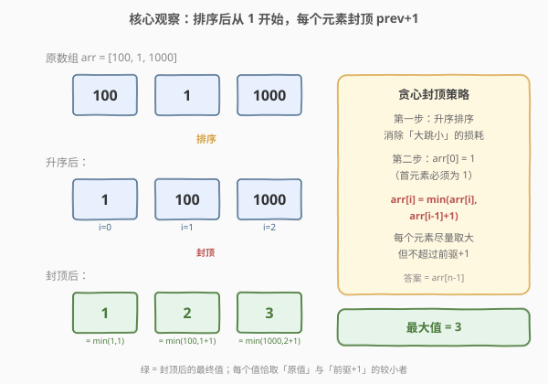
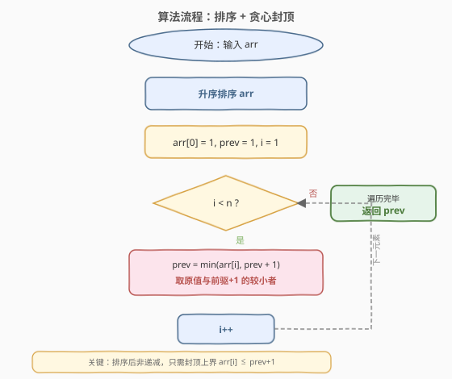

# LeetCode 减小和重新排列数组后的最大元素 题解

## 1. 题目概述

- **标题 / 题号**：减小和重新排列数组后的最大元素（#1846，medium）
- **链接**：https://leetcode.cn/problems/maximum-element-after-decreasing-and-rearranging/
- **难度**：中等
- **标签**：贪心、排序、数组

**题意**：给你一个正整数数组 `arr`。请你对 `arr` 执行一些操作（也可以不进行任何操作），使得数组满足以下条件：

1. `arr` 中**第一个**元素必须为 `1`。
2. 任意相邻两个元素的差的绝对值**小于等于 1**，即对任意 $1 \le i < \text{arr.length}$ 都有 $|\text{arr}[i] - \text{arr}[i-1]| \le 1$。

你可以执行以下 2 种操作任意次：

- **减小** `arr` 中任意元素的值，使其变为一个更小的正整数。
- **重新排列** `arr` 中的元素，以任意顺序。

请你返回执行以上操作后，在满足上述条件下，`arr` 中可能的**最大值**。

**示例 1**：

```text
输入：arr = [2,2,1,2,1]
输出：2
解释：重新排列得到 [1,2,2,2,1]，满足所有条件。arr 中最大元素为 2。
```

**示例 2**：

```text
输入：arr = [100,1,1000]
输出：3
解释：
  1. 重新排列 arr 得到 [1,100,1000]
  2. 将第二个元素减小为 2
  3. 将第三个元素减小为 3
  现在 arr = [1,2,3]，满足所有条件，最大元素为 3。
```

**示例 3**：

```text
输入：arr = [1,2,3,4,5]
输出：5
解释：数组已经满足所有条件，最大元素为 5。
```

**约束**：

- $1 \le \text{arr.length} \le 10^5$
- $1 \le \text{arr}[i] \le 10^9$

> 💡 **核心矛盾**：只能**减小**不能增大，且相邻差 $\le 1$、首元素必须为 1。要最大化最大值，就要让序列从 1 开始「一步步往上爬」——每个位置尽量取大，但被前一个值「卡」住最多只能 $+1$。直觉上，先排序消除「大数夹小数」的跳变损耗，再从左到右贪心地让每个元素取到允许的上界，正是贪心的典型信号。

## 2. 解题思路

### 2.1 暴力思路

最朴素的想法是枚举所有排列，对每个排列模拟「封顶」过程：`arr[0]` 减到 1，之后每个 `arr[i]` 若超过 `arr[i-1]+1` 就减到 `arr[i-1]+1`，取所有排列中末元素的最大值。但排列数为 $n!$，$n = 10^5$ 时完全不可行。

稍进一步：能否用动态规划？但状态空间（排列 + 当前值）过大，且「可任意重排」暗示问题具有贪心结构——排序后顺序确定，每个位置的最优值只依赖前驱。

### 2.2 核心观察：排序 + 贪心封顶



关键洞察分三层：

**第一层：排序消除跳变损耗。** 由于可以任意重排，升序排序后数组变为非递减。这样相邻元素的差 $\text{arr}[i] - \text{arr}[i-1] \ge 0$，绝对值约束 $|\text{arr}[i] - \text{arr}[i-1]| \le 1$ 简化为 $\text{arr}[i] \le \text{arr}[i-1] + 1$——只需关注上界，无需担心「大数后跟小数」导致的大幅减小。

**第二层：贪心取上界。** 要最大化最大值，每个位置应尽量取大。排序后 $\text{arr}[i] \ge \text{arr}[i-1]$，但约束要求 $\text{arr}[i] \le \text{arr}[i-1] + 1$。因此每个位置的最优取值为：

$$\text{arr}[i] = \min(\text{arr}[i],\ \text{arr}[i-1] + 1)$$

即「原值」与「前驱 $+1$」的较小者。首元素固定为 $\text{arr}[0] = 1$（因为 $\text{arr}[0] \ge 1$，若 $> 1$ 则减到 1）。

**第三层：贪心最优性（交换论证）。** 为什么「每个位置取上界」是全局最优？因为抬高某个 $\text{arr}[i]$ 到超过 $\text{arr}[i-1]+1$ 违反约束，而取到 $\min(\text{arr}[i], \text{arr}[i-1]+1)$ 已经是该位置的最大合法值。同时，让 $\text{arr}[i]$ 尽量大也**抬高后续元素的上界**（$\text{arr}[i+1]$ 的天花板变成 $\text{arr}[i]+1$），有利于全局最大化。因此「逐位置取上界」$=$ 局部最优 $=$ 全局最优。

> 💡 **贪心成立的关键**：操作只能「减小」不能增大 + 排序后每个位置的决策**只依赖前一个位置**的最终值。从左到右逐位置取上界，前一个一旦确定就不回头——这正是贪心「无后效性」的体现。

### 2.3 算法流程图



流程核心：先对 `arr` **升序排序**，设定 `prev = 1`（首元素封顶为 1）。然后从 $i = 1$ 到 $n-1$ 循环：更新 `prev = min(arr[i], prev + 1)`。循环结束后 `prev` 即为最大值（数组封顶后仍非递减，末元素最大）。

> ⚠️ **等价写法**：也可以原地修改 `arr`——`arr[0] = 1`，`arr[i] = min(arr[i], arr[i-1]+1)`，最后返回 `arr[n-1]`。两者逻辑等价，用 `prev` 变量可避免修改输入。

### 2.4 示例演算

![示例演算：arr = [100, 1, 1000] → 排序 [1, 100, 1000]](../images/1846_example_walkthrough.svg)

以 `arr = [100, 1, 1000]` 为例。排序后为 $[1, 100, 1000]$：

| $i$ | sorted$[i]$ | prev | $\min(\text{sorted}[i],\ \text{prev}+1)$ | 封顶后数组 |
|-----|-------------|------|------------------------------------------|------------|
| 0 | 1 | —（锚定） | 1 | [1, 100, 1000] |
| 1 | 100 | 1 | $\min(100, 2) = 2$ | [1, **2**, 1000] |
| 2 | 1000 | 2 | $\min(1000, 3) = 3$ | [1, 2, **3**] |

最终最大值 $= 3$ ✓

> 💡 注意 $i = 1$ 时，原始值 $100$ 远大于允许的上界 $1 + 1 = 2$，被封顶到 $2$。$i = 2$ 时，$1000$ 同样被封顶到 $2 + 1 = 3$。即使原值极大，相邻差约束使序列只能以「每步 $+1$」的速度增长——这正是答案上界为 $n$ 的根源（从 $1$ 出发最多增长到 $n$）。

## 3. 参考代码

### C++

```cpp
class Solution {
  public:
    int maximumElementAfterDecrementingAndRearranging(vector<int>& arr) {
        sort(arr.begin(), arr.end());
        int prev = 1;
        for (int i = 1; i < (int)arr.size(); i++) {
            prev = min(arr[i], prev + 1);
        }
        return prev;
    }
};
```

### Python

```python
class Solution:
    def maximumElementAfterDecrementingAndRearranging(self, arr: List[int]) -> int:
        arr.sort()
        prev = 1
        for i in range(1, len(arr)):
            prev = min(arr[i], prev + 1)
        return prev
```

### Python（原地修改版）

```python
class Solution:
    def maximumElementAfterDecrementingAndRearranging(self, arr: List[int]) -> int:
        arr.sort()
        arr[0] = 1
        for i in range(1, len(arr)):
            arr[i] = min(arr[i], arr[i - 1] + 1)
        return arr[-1]
```

> 💡 **两种写法对比**：第一种用 `prev` 变量不修改输入数组（除排序外），更「纯净」；第二种原地修改 `arr`，直接返回末元素。逻辑等价，面试中若强调「不破坏输入」可用第一种。

> ⚠️ **值域说明**：$\text{arr}[i] \le 10^9$，但封顶后最大值不超过 $n \le 10^5$（从 1 开始每步 $+1$）。`prev` 始终 $\le n$，无溢出风险。

## 4. 复杂度分析

| 维度 | 复杂度 | 说明 |
|------|--------|------|
| 时间复杂度 | $O(n \log n)$ | 排序 $O(n \log n)$ + 一次线性扫描 $O(n)$，排序为主导 |
| 空间复杂度 | $O(\log n)$ | 排序栈空间（原地排序）；`prev` 变量 $O(1)$ |

> 💡 本题的精妙在于把「重排 + 减小 + 最大化」这个看似需要全局规划的问题，降维成「排序 + 逐位置取上界」的局部贪心。关键观察是：排序消除绝对值约束的非对称性（只需封顶上界），且每个位置取上界同时有利于后续——贪心无后效性，一遍扫描即得最优解。

## 5. 扩展：排序必要性证明与 $O(n)$ 计数优化

### 5.1 为什么排序是最优重排？

设某个最优解的排列为 $\pi$，对应封顶后序列 $b_0=1,\ b_i = \min(a_{\pi(i)},\ b_{i-1}+1)$。我们要证明：**升序排序后封顶的结果不劣于任意排列**。

**关键引理**：封顶后序列 $b$ 是非递减的（$b_i \le b_{i-1}+1$ 且 $b_i \ge b_{i-1}$，因为 $b_i = \min(a_{\pi(i)}, b_{i-1}+1) \ge \min(a_{\pi(i)}, b_{i-1}+1)$，而 $a_{\pi(i)} \ge 1$ 时... 实际上 $b_i$ 可能 $< b_{i-1}$ 当 $a_{\pi(i)}$ 很小时）。

更直接的论证：若排列 $\pi$ 中存在「逆序」——$a_{\pi(i)} > a_{\pi(i+1)}$，交换两者后，封顶结果不会变差。因为升序排列让大数尽可能靠后，给后面的元素留出更大的增长空间。形式化地，可归纳证明：**升序排列最大化了封顶后序列的字典序**，从而最大化末元素。

### 5.2 $O(n)$ 计数排序优化

由于封顶后最大值不超过 $n$（从 1 开始每步 $+1$），任何 $> n$ 的原始值都会被封顶到 $\le n$。因此可以将所有值「截断」到 $[1, n]$，用计数排序替代比较排序：

```python
class Solution:
    def maximumElementAfterDecrementingAndRearranging(self, arr: List[int]) -> int:
        n = len(arr)
        freq = [0] * (n + 2)
        for x in arr:
            freq[min(x, n + 1)] += 1
        prev = 0
        for v in range(1, n + 2):
            if freq[v] > 0:
                prev = min(v, prev + 1)
        return prev
```

> ⚠️ 此处遍历值域 $[1, n+1]$，对每个有频率的值 $v$，更新 `prev = min(v, prev+1)`。多个同值元素中只有第一个能「踩」到 $v$，其余会被后续的 `prev+1` 链封顶——与排序后逐元素处理等价。时间 $O(n)$，空间 $O(n)$。当 $n$ 很大但值域与 $n$ 同阶时优于 $O(n \log n)$。

> 💡 **对比 1833**：[1833. 雪糕的最大数量](1833_雪糕的最大数量.md)同样利用「值域与 $n$ 同阶」用计数排序优化，但那题值域 $V \le 10^5$ 恰好给定；本题值域高达 $10^9$，但答案上界 $n$ 使我们仍可截断到 $[1,n]$ 做计数——两种「截断值域」的思路异曲同工。

## 6. 面试要点

**Q1：为什么排序后贪心封顶是最优的？**

> 排序后数组非递减，绝对值约束 $|\text{arr}[i]-\text{arr}[i-1]| \le 1$ 简化为 $\text{arr}[i] \le \text{arr}[i-1]+1$（只需封顶上界）。每个位置取 $\min(\text{arr}[i], \text{arr}[i-1]+1)$ 已是该位置的最大合法值，且取大值会抬高后续上界，有利于全局最大化。故逐位置取上界即全局最优。

**Q2：为什么必须先排序？不排序会怎样？**

> 不排序时可能出现「大数后跟小数」，大数被封顶后小数仍可能远小于前驱 $-1$，违反 $|\text{diff}| \le 1$ 需要进一步减小前驱，连锁反应导致更大损耗。如 `[100, 1, 1000]` 不排序直接处理：`arr[0]=1`，`arr[1]=min(1,2)=1`，`arr[2]=min(1000,2)=2`，最大值仅 2；排序后 `[1,100,1000]` 封顶得 `[1,2,3]`，最大值 3。排序让大数靠后，给增长留空间。

**Q3：最大值的上界是多少？为什么？**

> 最大值不超过 $n$（数组长度）。因为首元素固定为 1，每步最多 $+1$，$n$ 个元素最多增长到 $n$。即使 $\text{arr}[i] \le 10^9$，封顶后也 $\le n$。这使得 $O(n)$ 计数排序成为可能（截断值域到 $[1,n]$）。

**Q4：原地修改版和 prev 变量版有何区别？**

> 逻辑等价。原地版 `arr[i] = min(arr[i], arr[i-1]+1)` 直接改数组、返回末元素；`prev` 版用变量记录前驱最终值，不修改输入（排序除外）。面试中若强调「不破坏输入」用 `prev` 版。

**Q5：本题与 945（使数组唯一的最小增量）有何异同？**

> 两者都是「排序 + 贪心」处理数组约束。945 每个元素只能 $+1$ 使全局唯一，贪心策略是「顶到刚好比前一个唯一值大」；本题每个元素只能减小使相邻差 $\le 1$，贪心策略是「封顶到前驱 $+1$」。一个向上顶、一个向下压，但核心都是「排序后逐位置依赖前驱做局部最优」。

## 同类练习题

| # | 题目 | 与本题的关联 |
|---|------|-------------|
| 1827 | [最少操作使数组递增](https://leetcode.cn/problems/minimum-operations-to-make-the-array-increasing/)（[站内题解](1827_最少操作使数组递增.md)） | 同为「数组 + 贪心 + 逐位置依赖前驱」的简单题，但操作方向相反（只能 $+1$ 抬升），对照「向上顶」与「向下压」两种贪心范式 |
| 945 | [使数组唯一的最小增量](https://leetcode.cn/problems/minimum-increment-to-make-array-unique/)（[站内题解](../0901-1000/945_使数组唯一的最小增量.md)） | 排序 + 贪心使数组元素各不相同，每个元素顶到前驱 $+1$，与本题「封顶到前驱 $+1$」镜像对称，对照理解方向相反的贪心 |
| 1833 | [雪糕的最大数量](https://leetcode.cn/problems/maximum-ice-cream-bars/)（[站内题解](1833_雪糕的最大数量.md)） | 同为「排序 + 贪心」中等题，且同样可利用值域截断做计数排序优化，对照两种「截断值域」的思路 |
| 164 | [最大间距](https://leetcode.cn/problems/maximum-gap/) | 排序后分析相邻元素差的经典题，要求 $O(n)$ 时用桶排序；对照「排序后逐对分析」与「排序后逐元素封顶」的不同应用 |
| 1331 | [数组序号转换](https://leetcode.cn/problems/rank-transform-of-an-array/) | 排序 + 哈希做值到序号的映射，同为「排序后线性扫描」范式，但用哈希去重而非贪心封顶 |
