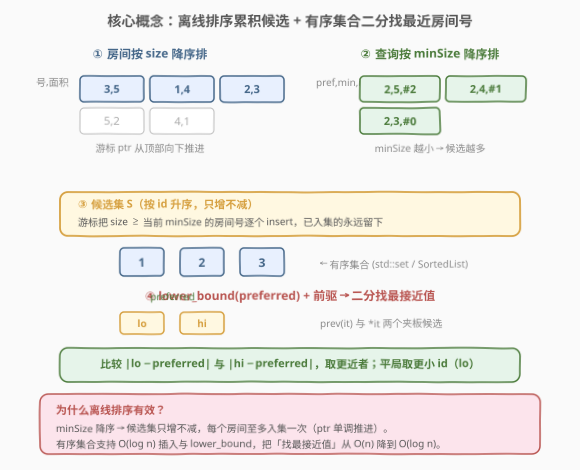
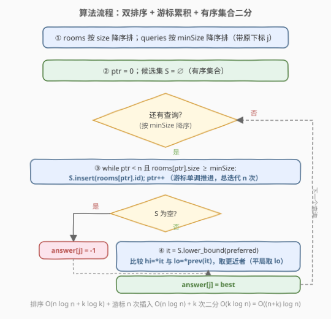
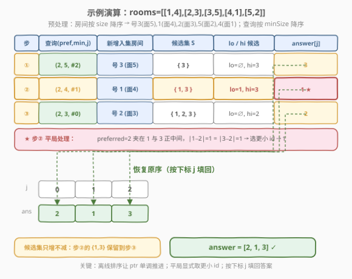

# 最近的房间

- **题目名称**：最近的房间
- **链接**：[1847. 最近的房间](https://leetcode.cn/problems/closest-room/)
- **难度**：困难
- **标签**：排序、有序集合、二分查找、离线处理

## 1. 题目概述

一个酒店里有 `n` 个房间，用二维数组 `rooms` 表示，其中 `rooms[i] = [roomIdi, sizei]` 表示房间号为 `roomIdi`、面积为 `sizei`。每个房间号**互不相同**。

给定 `k` 个查询 `queries`，其中 `queries[j] = [preferredj, minSizej]`。第 `j` 个查询要求在所有 **面积至少为 `minSizej`** 的房间中，找房间号 `id` 使得 $|id - preferred_j|$ 最小；若差的绝对值相等，选**房间号更小**的；若无满足条件的房间，答案为 `-1`。返回长度为 `k` 的答案数组。

**示例 1**：

```text
输入：rooms = [[2,2],[1,2],[3,2]], queries = [[3,1],[3,3],[5,2]]
输出：[3,-1,3]
解释：
  查询 [3,1]：房间 1/2/3 面积均 ≥1，最接近 3 的是 3（|3−3|=0）→ 3
  查询 [3,3]：无房间面积 ≥3 → -1
  查询 [5,2]：房间 1/2/3 面积 ≥2，最接近 5 的是 3（|3−5|=2）→ 3
```

**示例 2**：

```text
输入：rooms = [[1,4],[2,3],[3,5],[4,1],[5,2]], queries = [[2,3],[2,4],[2,5]]
输出：[2,1,3]
解释：
  查询 [2,3]：面积 ≥3 的房间 {1,2,3}，最接近 2 的是 2 → 2
  查询 [2,4]：面积 ≥4 的房间 {1,3}，|1−2|=|3−2|=1，选更小 id → 1
  查询 [2,5]：面积 ≥5 的房间 {3} → 3
```

**约束条件**：

- $n = \text{rooms.length}$，$1 \le n \le 10^5$
- $k = \text{queries.length}$，$1 \le k \le 10^4$
- $1 \le \text{roomId}_i,\ \text{preferred}_j \le 10^7$
- $1 \le \text{size}_i,\ \text{minSize}_j \le 10^7$

> 💡 **关键直觉**：每个查询带一个「面积下限 `minSize`」过滤条件，且要在过滤后的房间号集合中找「最接近 `preferred`」的号。若按查询原序在线处理，每次都要重新筛选 + 找最值，代价高昂。注意到 `minSize` 是个**单调可利用的阈值**——`minSize` 越小，候选房间越多。这正是**离线处理**的信号：把查询按 `minSize` 降序排，房间按 `size` 降序排，随查询推进「只增不减」地累积候选集，用有序集合维护即可。

---

## 2. 解题思路

### 2.1 暴力思路：逐查询线性筛选

对每个查询 `[preferred, minSize]`，遍历所有房间筛出 `size ≥ minSize` 的子集，再在该子集中线性找 $|id - preferred|$ 最小（同则 `id` 最小）的房间。单次查询 $O(n)$，共 $k$ 次查询，总 $O(n \cdot k)$。$n = 10^5,\ k = 10^4$ 时约 $10^9$ 次操作，必然超时。

> ⚠️ 瓶颈有二：① 每次查询都**重复筛选**「面积达标」的房间，不同查询的候选集高度重叠却无法复用；② 在无序子集中找最接近值需**线性扫描**。两处都可优化——前者靠离线排序复用累积，后者靠有序集合二分。

### 2.2 核心观察：离线排序 + 有序集合 + 二分找最接近值



把问题拆成三件事：

1. **离线排序消除重复筛选**：把房间按 `size` **降序**排，查询按 `minSize` **降序**排（保留原下标）。处理查询时，用游标 `ptr` 把所有 `size ≥ minSize` 的房间**一次性**插入候选集——因为后续查询的 `minSize` 只会更小，这些房间**永远留在候选集里**，无需重复筛选。

2. **有序集合维护房间号**：候选集用一个**按 `id` 排序**的有序结构维护（C++ `std::set`、Python `SortedList` / 手动 `bisect` + 列表）。插入 $O(\log n)$，且支持二分定位。

3. **二分找最接近 `preferred` 的号**：在有序集合中 `lower_bound(preferred)` 得到首个 $\ge preferred$ 的房间号（右候选 `hi`），其前驱是最大 $< preferred$ 的号（左候选 `lo`）。最接近值**必在这两个候选中**——理由与「有序数组找最接近值」相同：`preferred` 被相邻两元素夹住，更远的元素距离只会更大。

> 💡 **平局处理**：若 $|lo - preferred| = |hi - preferred|$，按题意选**更小的 `id`**，即选 `lo`。由于 `lo < hi`，平局时直接取 `lo` 即可。

三步循环：

```text
rooms 按 size 降序排；queries 按 minSize 降序排（带原下标）
ptr = 0; 候选集 S = ∅
for 每个查询 (preferred, minSize, 原下标 j):
    while ptr < n 且 rooms[ptr].size ≥ minSize:
        S.insert(rooms[ptr].id); ptr++
    if S 为空: answer[j] = -1
    else:
        hi = S.lower_bound(preferred)   # 首 ≥ preferred
        lo = hi 的前驱                    # 最大 < preferred
        比较 lo/hi 到 preferred 的距离，取更近者（平局取更小 id）
        answer[j] = 选中的 id
```

> ⚠️ **常见错误**：① 按查询原序在线处理，每次重新筛选——未利用 `minSize` 的单调性；② 候选集用无序数组，找最接近值退化为线性扫描；③ 二分只查 `lower_bound` 一个候选，漏掉前驱可能更近（如 `preferred` 恰在两号正中间）；④ 平局时取了 `hi` 而非 `lo`，违反「选更小 `id`」规则。

### 2.3 算法流程图



### 2.4 示例演算



以示例 2 `rooms = [[1,4],[2,3],[3,5],[4,1],[5,2]]`，`queries = [[2,3],[2,4],[2,5]]` 为例。

**预处理**：房间按 `size` 降序 → `[3,5], [1,4], [2,3], [5,2], [4,1]`（即号 3/1/2/5/4，面积 5/4/3/2/1）。查询按 `minSize` 降序并带原下标 → `[(2,5,2), (2,4,1), (2,3,0)]`。

| 处理顺序 | 查询 (pref, minSize, j) | 新增入集房间 (size≥minSize) | 候选集 S（按 id 升序） | lower_bound(pref) | lo / hi 候选 | 距离比较 | answer[j] |
|----------|------------------------|----------------------------|------------------------|-------------------|--------------|----------|-----------|
| ① | (2, 5, 2) | 房间 3（面积 5） | {3} | 3 | lo=∅, hi=3 | 仅 3：\|3−2\|=1 | **3** |
| ② | (2, 4, 1) | 房间 1（面积 4） | {1, 3} | 3 | lo=1, hi=3 | \|1−2\|=1, \|3−2\|=1 → 平局取小 id | **1** |
| ③ | (2, 3, 0) | 房间 2（面积 3） | {1, 2, 3} | 2 | lo=∅, hi=2 | 精确命中：\|2−2\|=0 | **2** |

恢复原序：`answer = [2, 1, 3]`，与期望一致。

> 💡 **查询 ② 是本题精髓**：`preferred=2` 恰好夹在房间号 1 和 3 正中间，两端距离都是 1。按「平局选更小 `id`」规则取 1——这正是题目的 tie-break 约束，必须显式处理，不能默认取 `lower_bound` 的结果。

---

## 3. 参考代码

### Python

```python
from sortedcontainers import SortedList

class Solution:
    def closestRoom(self, rooms: list[list[int]], queries: list[list[int]]) -> list[int]:
        n = len(rooms)
        k = len(queries)

        # 房间按 size 降序排
        rooms_sorted = sorted(rooms, key=lambda r: -r[1])
        # 查询按 minSize 降序排，保留原下标
        queries_sorted = sorted(
            ((q[1], q[0], j) for j, q in enumerate(queries))
        )

        ans = [-1] * k
        sl = SortedList()
        ptr = 0

        for min_size, preferred, j in queries_sorted:
            # 游标推进：把所有 size >= min_size 的房间号入集
            while ptr < n and rooms_sorted[ptr][1] >= min_size:
                sl.add(rooms_sorted[ptr][0])
                ptr += 1

            if not sl:
                ans[j] = -1
                continue

            # 二分找首个 >= preferred 的房间号
            idx = sl.bisect_left(preferred)

            # 候选：idx 与 idx-1（注意边界）
            best = -1
            best_diff = float('inf')
            if idx < len(sl):
                hi = sl[idx]
                d = abs(hi - preferred)
                if d < best_diff or (d == best_diff and hi < best):
                    best_diff, best = d, hi
            if idx > 0:
                lo = sl[idx - 1]
                d = abs(lo - preferred)
                if d < best_diff or (d == best_diff and lo < best):
                    best_diff, best = d, lo

            ans[j] = best

        return ans
```

### C++

```cpp
class Solution {
public:
    vector<int> closestRoom(vector<vector<int>>& rooms,
                            vector<vector<int>>& queries) {
        int n = rooms.size();
        int k = queries.size();

        // 房间按 size 降序排
        sort(rooms.begin(), rooms.end(),
             [](const auto& a, const auto& b) { return a[1] > b[1]; });

        // 查询按 minSize 降序排，保留原下标：(minSize, preferred, idx)
        vector<tuple<int, int, int>> qs;
        qs.reserve(k);
        for (int j = 0; j < k; ++j) {
            qs.emplace_back(queries[j][1], queries[j][0], j);
        }
        sort(qs.begin(), qs.end(),
             [](const auto& a, const auto& b) { return get<0>(a) > get<0>(b); });

        vector<int> ans(k, -1);
        set<int> ids;          // 按 id 升序的候选集
        int ptr = 0;

        for (const auto& [min_size, preferred, j] : qs) {
            // 游标推进：把所有 size >= min_size 的房间号入集
            while (ptr < n && rooms[ptr][1] >= min_size) {
                ids.insert(rooms[ptr][0]);
                ++ptr;
            }
            if (ids.empty()) {
                ans[j] = -1;
                continue;
            }

            // 二分找首个 >= preferred 的房间号
            auto it = ids.lower_bound(preferred);
            int best = -1;
            long long best_diff = LLONG_MAX;

            // 右候选 hi：it 指向首个 >= preferred
            if (it != ids.end()) {
                int hi = *it;
                long long d = llabs((long long)hi - preferred);
                if (d < best_diff) { best_diff = d; best = hi; }
            }
            // 左候选 lo：it 的前驱，最大 < preferred
            if (it != ids.begin()) {
                int lo = *prev(it);
                long long d = llabs((long long)lo - preferred);
                // 平局时 lo < best 必然成立（lo 是更小的 id），故 <= 即可取 lo
                if (d < best_diff || (d == best_diff && lo < best)) {
                    best_diff = d; best = lo;
                }
            }
            ans[j] = best;
        }
        return ans;
    }
};
```

> 💡 **实现细节**：① 查询排序时务必**保留原下标 `j`**，答案要按原序填回 `ans[j]`。② Python 用 `SortedList`（`sortedcontainers` 库）获得 $O(\log n)$ 插入与 `bisect_left`；若环境无此库，可用 `bisect` + 普通列表，但插入 $O(n)$ 会退化（LeetCode 已内置 `sortedcontainers`）。③ C++ `std::set::lower_bound` 是成员函数版本，复杂度 $O(\log n)$；**勿用** `<algorithm>` 的 `lower_bound`，那是 $O(n)$。④ `preferred` 与 `id` 都可达 $10^7$，差值不超 $10^7$，`int` 不会溢出；C++ 中 `llabs` 仅为稳妥写法。⑤ 平局规则：`d == best_diff` 时取更小 `id`——由于 `lo < hi`，平局时 `lo` 必更小，判断 `lo < best` 即可。

> ⚠️ **为什么 `set` 不存房间面积？** 入集时已保证 `size ≥ minSize`，之后面积不再参与查询，候选集只需按 `id` 排序以支持二分找最接近 `preferred` 的号。存面积是冗余。

---

## 4. 复杂度分析

| 维度 | 复杂度 | 说明 |
|------|--------|------|
| **时间** | $O((n + k) \log n)$ | 排序房间 $O(n \log n)$ + 排序查询 $O(k \log k)$；每个房间恰好入集一次，共 $n$ 次插入各 $O(\log n)$；每个查询一次 `lower_bound` $O(\log n)$ + $O(1)$ 候选比较，共 $k$ 次 |
| **空间** | $O(n + k)$ | 候选集最坏存全部 $n$ 个房间号 $O(n)$；查询排序副本 $O(k)$；答案数组 $O(k)$ |

> 💡 **摊还保证**：外层 `for` 看似嵌套了内层 `while`，但内层每轮必使 `ptr++`，`ptr` 从 0 单调增至 $n$，故内层总迭代次数恰为 $n$，不与查询数 $k$ 相乘。这是「游标单调推进」的经典摊还模式，与 [1834. 单线程 CPU](https://leetcode.cn/problems/single-threaded-cpu/) 的入堆游标同理。

> ⚠️ 暴力 $O(n \cdot k) \approx 10^9$ 必超时；优化到 $O((n+k)\log n) \approx (10^5 + 10^4) \times 17 \approx 1.9 \times 10^6$，快约 3 个数量级。核心是把「逐查询筛选」升级为「离线排序 + 游标累积」，把「无序找最接近值」升级为「有序集合二分」。

---

## 5. 扩展：为什么「最接近值」只需查 `lower_bound` 及其前驱？

这与 [1818. 最小绝对差之和](https://leetcode.cn/problems/minimum-absolute-sum-difference/) 中「排序数组找最接近值」是**同一条结论**，只是载体从数组换成有序集合。

设候选集 $S$ 按 `id` 升序，目标 $t = preferred$，$it = \text{lower\_bound}(S,\ t)$（首个 $\ge t$ 的迭代器）：

- **$it = \text{end}$**（$t$ 大于所有元素）：最近值必是 $S$ 的最大值，即 `*prev(end)`。
- **$it = \text{begin}$**（$t$ 小于等于所有元素）：最近值必是 $S$ 的最小值，即 `*begin`。
- **否则**：$\text{lo} = *prev(it) < t \le \text{hi} = *it$，$t$ 被相邻两元素夹住。对任意比 `lo` 更小的元素 $x$，$x \le \text{lo} < t$，距离 $t - x \ge t - \text{lo}$，不会更近；同理比 `hi` 更大的元素也不会更近。故只需比较 `lo` 与 `hi` 两个「夹板」。

> 💡 **推广**：此结论对「在任意有序序列（数组 / `set` / `map` 键）中找最接近目标值的元素」普遍适用——`lower_bound` + 比较左右两个候选，$O(\log n)$ 定位。是二分查找家族的高频子套路，数组版见 [1818](../1801-1900/1818_最小绝对差之和.md)，集合版即本题。

### 其他解法一瞥

- **离线 + 平衡树/线段树**：本质与有序集合等价，只是用线段树按 `id` 区间维护「是否存在面积达标的房间」，查询时在线段树上二分找最近非空叶。复杂度同为 $O((n+k)\log V)$，但实现更重，常数更大。
- **在线做法**：若强制按查询原序且不可离线排序，可用**主席树**按 `id` 维护历史版本的面积最大值，查询时二分——能做但远超面试要求。离线排序是本题的「正解信号」。

---

## 6. 面试要点

1. **为什么要把查询离线排序，而不是按原序在线处理？**

   > 每个查询的候选集是「面积 $\ge$ `minSize` 的所有房间」。若在线处理，每次都要重新筛选，且候选集高度重叠却无法复用。注意到 `minSize` 越小候选越多——把查询按 `minSize` 降序排后，候选集**只增不减**，已入集的房间对所有后续查询都有效，用游标 `ptr` 一次性累积即可。这是「**约束具单调性 → 离线排序**」的招牌信号。

2. **游标 `ptr` 的总推进次数为什么是 $O(n)$ 而非 $O(n \cdot k)$？**

   > 内层 `while` 每轮必使 `ptr++`，`ptr` 从 0 单调增至 $n$ 就不再回头。即便外层循环 $k$ 次，内层总迭代次数被 `ptr` 的上界 $n$ 封顶。这是「游标单调推进」的摊还保证，与 [1834. 单线程 CPU](../1801-1900/1834_单线程CPU.md) 的入堆游标、[209. 长度最小的子数组](https://leetcode.cn/problems/minimum-size-subarray-sum/) 的窗口右端点同理。

3. **二分找最接近值为什么只查 `lower_bound` 及其前驱两个候选？**

   > `lower_bound` 返回首个 $\ge preferred$ 的位置 `it`，故 `*prev(it) < preferred ≤ *it`，目标被相邻两元素夹住。离目标更远的元素距离只会更大（左侧更小、右侧更大），故最近值必在这两个「夹板」中。边界：`it = begin` 只查 `*begin`，`it = end` 只查 `*prev(end)`。

4. **平局时为什么要显式取更小的 `id`，不能直接返回 `lower_bound` 的结果？**

   > 题目规定 $|id - preferred|$ 相等时选**更小 `id`**。`preferred` 恰在两号正中间时（如示例 2 查询 ②，`preferred=2`，候选 `{1,3}`），`lower_bound` 返回的是较大的 `hi=3`，但平局规则要选 `lo=1`。必须显式比较左右候选的距离，平局时取 `lo`。

5. **C++ 中为什么必须用 `std::set::lower_bound` 而非 `<algorithm>` 的 `std::lower_bound`？**

   > `std::set` 是红黑树，成员函数 `lower_bound` 利用树结构直接 $O(\log n)$ 定位。而 `<algorithm>` 的 `std::lower_bound` 对**迭代器区间**做二分，要求随机访问迭代器——`set` 的双向迭代器不满足，调用它会退化为 $O(n)$ 线性扫描，整体复杂度崩到 $O(n \cdot k)$。

> 💡 **一句话总结**：离线把房间按 `size` 降序、查询按 `minSize` 降序，游标单调累积候选房间号入有序集合，每个查询用 `lower_bound` + 前驱二分找最接近 `preferred` 的号，平局取更小 `id`。$O((n+k)\log n)$。

---

## 7. 同类练习题

- [1818. 最小绝对差之和](https://leetcode.cn/problems/minimum-absolute-sum-difference/)（[题解](../1801-1900/1818_最小绝对差之和.md)）：排序数组上 `lower_bound` + 前驱/后继二分找最接近值，本题的「二分子套路」直接来源（载体从数组升级为有序集合）
- [1834. 单线程 CPU](https://leetcode.cn/problems/single-threaded-cpu/)（[题解](../1801-1900/1834_单线程CPU.md)）：排序 + 游标单调推进 + 堆取最值，与本题「游标累积候选」摊还模式同构（堆按 `processingTime` 取最短，集合按 `id` 二分取最近）
- [35. 搜索插入位置](https://leetcode.cn/problems/search-insert-position/)（[题解](../0001-0100/35_搜索插入位置.md)）：`bisect_left` / `lower_bound` 的母题，巩固二分定位首个 $\ge$ 目标的位置与边界处理
- [1705. 吃苹果的最大数量](https://leetcode.cn/problems/maximum-number-of-eaten-apples/)：按时间推进 + 有序结构（堆）取最优，同属「游标单调推进 + 数据结构维护动态候选」范式
- [1882. 使用服务器处理任务](https://leetcode.cn/problems/process-tasks-using-servers/)：双堆在线调度 + 时间驱动解锁，对照本题「离线排序解锁」与彼题「在线时间驱动解锁」的不同解锁策略
