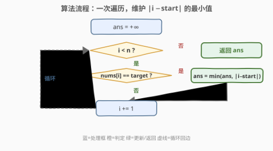
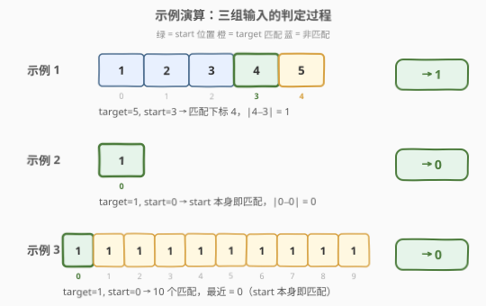

# LeetCode 到目标元素的最小距离 题解

## 1. 题目概述

- **标题 / 题号**：到目标元素的最小距离（#1848，easy）
- **链接**：https://leetcode.cn/problems/minimum-distance-to-the-target-element/
- **难度**：简单
- **标签**：数组、一次遍历

**题意**：给你一个整数数组 `nums`（**下标从 0 开始**）以及两个整数 `target` 和 `start`，请你找出一个下标 `i`，满足 $\text{nums}[i] == \text{target}$ 且 $\text{abs}(i - \text{start})$ **最小化**。返回 $\text{abs}(i - \text{start})$。

题目数据保证 `target` 存在于 `nums` 中。

**示例 1**：

```text
输入：nums = [1,2,3,4,5], target = 5, start = 3
输出：1
解释：nums[4] = 5 是唯一一个等于 target 的值，所以答案是 abs(4 - 3) = 1。
```

**示例 2**：

```text
输入：nums = [1], target = 1, start = 0
输出：0
解释：nums[0] = 1 是唯一一个等于 target 的值，所以答案是 abs(0 - 0) = 0。
```

**示例 3**：

```text
输入：nums = [1,1,1,1,1,1,1,1,1,1], target = 1, start = 0
输出：0
解释：nums 中的每个值都是 1，但 nums[0] 使 abs(i - start) 的结果得以最小化，所以答案是 abs(0 - 0) = 0。
```

**约束**：

- $1 \le \text{nums.length} \le 1000$
- $1 \le \text{nums}[i] \le 10^4$
- $0 \le \text{start} < \text{nums.length}$
- `target` 存在于 `nums` 中

> 💡 **核心矛盾**：在所有值等于 `target` 的下标中，找一个离 `start` 最近的。数组无序，`target` 的出现位置不可预测——可能就在 `start` 旁边，也可能在数组另一端。直觉上，扫一遍所有位置，遇到 `target` 就算距离并维护最小值即可。问题本身没有复杂的结构，关键是想清楚「遍历 + 取最小」这一基本范式。

## 2. 解题思路

### 2.1 暴力思路

最直觉的做法：遍历数组的每个下标 $i$，若 $\text{nums}[i] == \text{target}$，则计算 $|i - \text{start}|$，并维护这些距离的最小值。遍历结束后返回最小值。

```text
ans = +∞
for i = 0 to n-1:
    if nums[i] == target:
        ans = min(ans, |i - start|)
return ans
```

时间 $O(n)$，空间 $O(1)$。由于数组无序、`target` 的位置不可预测，**每个位置都必须检查**——最坏情况下唯一的 `target` 出现在数组末尾，而 `start` 在数组开头，必须扫完整串。因此 $O(n)$ 已经是渐近最优。

> 💡 这道题没有更巧妙的解法能突破 $O(n)$：数组无序意味着无法用二分跳过无关区间，`target` 的分布也无规律可循。暴力即最优。

### 2.2 核心观察：遍历所有位置，命中即更新最小距离

![核心观察：在所有 nums[i]==target 处取 |i−start| 的最小值](../images/1848_concept.svg)

关键洞察分两层：

**第一层：过滤 + 取最值。** 问题本质是一个带条件的求最小值：在集合 $\{i \mid \text{nums}[i] = \text{target}\}$ 上最小化 $|i - \text{start}|$。一次遍历即可同时完成「过滤」（判断 $\text{nums}[i] == \text{target}$）和「取最值」（维护 $\min |i - \text{start}|$）。

**第二层：为什么无法更快？** 数组无序，`target` 的出现位置没有任何规律。无论从左到右扫还是从右到左扫，最坏情况下都需要检查所有 $n$ 个位置才能确定最小距离。这与「有序数组中找最接近值」（可用二分 $O(\log n)$ 解决）形成鲜明对比——**有序性是二分的前提，无序则退化为线性扫描**。

> 💡 **与 1847 的对比**：同为「最近」问题，1847（最近的房间）在有序集合上二分找最接近值，$O(\log n)$；本题数组无序，只能线性扫描 $O(n)$。数据结构的有序性决定了查询效率。

### 2.3 算法流程图



流程核心是一个从 $i = 0$ 到 $n-1$ 的循环：检查 $\text{nums}[i] == \text{target}$ 是否成立。若是，用 $|i - \text{start}|$ 更新答案 `ans`；若否，跳过。循环结束返回 `ans`。初始化 `ans` 为极大值，保证首次命中即被采纳。

### 2.4 示例演算



以题目给出的三个示例逐个验证：

| 示例 | `nums` | `target` | `start` | 匹配下标 | 各 $|i-\text{start}|$ | 结果 |
|------|--------|----------|---------|----------|----------------------|------|
| 1 | `[1,2,3,4,5]` | 5 | 3 | {4} | {1} | `1` |
| 2 | `[1]` | 1 | 0 | {0} | {0} | `0` |
| 3 | `[1,1,1,1,1,1,1,1,1,1]` | 1 | 0 | {0,1,…,9} | {0,1,…,9} | `0` |

> 💡 示例 3 体现了「最小化」的语义：虽然有 10 个匹配下标，但 $|0 - 0| = 0$ 已经是最小可能值（距离非负），故答案为 0。一旦发现距离为 0 的匹配，理论上可以立即返回——这正是双向扩展优化（见第 5 节）的动机。

## 3. 参考代码

### C++

```cpp
class Solution {
  public:
    int getMinDistance(vector<int>& nums, int target, int start) {
        int ans = INT_MAX;
        for (int i = 0; i < (int)nums.size(); i++) {
            if (nums[i] == target) {
                ans = min(ans, abs(i - start));
            }
        }
        return ans;
    }
};
```

### Python

```python
class Solution:
    def getMinDistance(self, nums: List[int], target: int, start: int) -> int:
        ans = float('inf')
        for i, x in enumerate(nums):
            if x == target:
                ans = min(ans, abs(i - start))
        return ans
```

### Python（生成器表达式，一行版）

```python
class Solution:
    def getMinDistance(self, nums: List[int], target: int, start: int) -> int:
        return min(abs(i - start) for i, x in enumerate(nums) if x == target)
```

> 💡 **三种写法对比**：第一种（C++ / Python 循环版）最直观，显式维护 `ans` 变量；第三种（生成器表达式）最简洁，把「过滤 + 取最小」压缩成一行，语义清晰但调试时不如显式循环直观。三者时间复杂度相同，面试建议先写循环版讲清思路，再提生成器表达式作为 Pythonic 的等价写法。

> ⚠️ **初始化说明**：`ans` 初始化为 `INT_MAX` / `float('inf')`，保证首个匹配必然更新 `ans`。由于题目保证 `target` 存在于 `nums` 中，循环结束时 `ans` 一定被更新过，无需处理「未找到」的情况。

## 4. 复杂度分析

| 维度 | 复杂度 | 说明 |
|------|--------|------|
| 时间复杂度 | $O(n)$ | 一次线性扫描，每个位置 $O(1)$ 判断与更新；数组无序，无法跳过无关位置 |
| 空间复杂度 | $O(1)$ | 仅用 `ans` 累加器，与输入规模无关 |

> 💡 本题是「一次遍历维护最值」范式的最简形态——没有排序、没有哈希、没有二分，一个 `for` 循环加一个 `min` 即可。简单题的价值在于确认这一范式是渐近最优的：无序数组上的条件最值查询，$O(n)$ 不可超越。

## 5. 扩展：双向扩展——从 start 向外搜索

### 5.1 思路

线性扫描从 $i = 0$ 开始逐个检查，不考虑 `start` 的位置。一个自然的优化是**从 `start` 出发向两侧扩展**：先检查 $\text{nums}[\text{start}]$（距离 0），再检查 $\text{nums}[\text{start} - 1]$ 和 $\text{nums}[\text{start} + 1]$（距离 1），依此类推。**第一个命中的匹配即为最小距离**，可以立即返回。

```cpp
class Solution {
  public:
    int getMinDistance(vector<int>& nums, int target, int start) {
        int n = nums.size();
        for (int d = 0; d < n; d++) {
            if (start - d >= 0 && nums[start - d] == target) return d;
            if (start + d < n && nums[start + d] == target) return d;
        }
        return -1;  // 不可达，target 保证存在
    }
};
```

### 5.2 两种写法对比

| 维度 | 线性扫描 | 双向扩展 |
|------|----------|----------|
| 最坏时间 | $O(n)$ | $O(n)$ |
| 最佳时间 | $O(n)$（仍需扫完） | $O(1)$（`start` 本身即匹配时） |
| 语义 | 遍历所有位置取最小 | 按距离递增搜索，首命中即返回 |
| 适用场景 | 通用、简洁 | `start` 附近大概率有匹配时更优 |

> 💡 **关键区别在提前终止**：双向扩展一旦命中就返回，而线性扫描必须遍历完所有位置才能确定最小值。当 `nums[start] == target` 时，双向扩展 $O(1)$ 返回 0，线性扫描却仍需 $O(n)$。但最坏情况（唯一匹配在数组一端、`start` 在另一端）两者都是 $O(n)$。

> ⚠️ **正确性保证**：双向扩展按距离 $d = 0, 1, 2, \ldots$ 递增搜索，因此首个命中的匹配**必然**在最小距离处——不存在更近的匹配（否则更小的 $d$ 就已命中）。这本质上是 BFS 的思想：按到 `start` 的距离层层扩展，最先到达的目标即为最近。

## 6. 面试要点

**Q1：为什么线性扫描是渐近最优的？**

> 数组无序，`target` 的出现位置不可预测。无论从哪个方向扫描，最坏情况下唯一的 `target` 在数组末尾而 `start` 在开头，必须检查所有 $n$ 个位置。有序数组可用二分 $O(\log n)$，但无序数组只能 $O(n)$。

**Q2：双向扩展相比线性扫描有什么优势？**

> 双向扩展从 `start` 出发按距离递增向外搜索，首个命中即返回，可提前终止。当 `nums[start] == target` 时 $O(1)$ 返回，而线性扫描仍需 $O(n)$。但最坏情况两者同为 $O(n)$。

**Q3：如果 `target` 不保证存在于 `nums` 中怎么办？**

> 线性扫描版需在循环结束后检查 `ans` 是否仍为初始值（`INT_MAX`），若是则返回 `-1` 表示未找到。双向扩展版的 `for` 循环走完未返回则落到 `return -1`。本题保证存在故无需处理。

**Q4：时间 / 空间复杂度各是多少？**

> 时间 $O(n)$——一次线性扫描，每个位置 $O(1)$ 判断。空间 $O(1)$——仅用一个 `ans` 变量。双向扩展最坏同为 $O(n)$ / $O(1)$，但最佳情况时间 $O(1)$。

**Q5：如果数组已排序，能更快吗？**

> 能。若数组按值排序，可用二分找到 `target` 的首次和末次出现位置（`lower_bound` / `upper_bound`），然后在连续的 `target` 区间 $[lo, hi]$ 上找最接近 `start` 的位置——这又是一个有序区间上的二分，$O(\log n)$。但本题数组无序，不适用。

## 同类练习题

| # | 题目 | 与本题的关联 |
|---|------|-------------|
| 1779 | [找到最近的有相同 X 或 Y 坐标的点](https://leetcode.cn/problems/find-nearest-point-that-has-the-same-x-or-y-coordinate/)（[站内题解](../1701-1800/1779_找到最近的有相同X或Y坐标的点.md)） | 同为「一次遍历维护最小曼哈顿距离」的简单题，对照「过滤候选 + 取最近」的统一范式 |
| 849 | [到最近的人的最大距离](https://leetcode.cn/problems/maximize-distance-to-closest-person/)（[站内题解](../0801-0900/849_到最近的人的最大距离.md)） | 同为「数组中找距离」问题，但目标相反——最大化到最近人的距离，需两次遍历维护左右最近的人 |
| 1200 | [最小绝对差](https://leetcode.cn/problems/minimum-absolute-difference/)（[站内题解](../1101-1200/1200_最小绝对差.md)） | 同为「最小化绝对差」，但需排序后相邻比较，对照「有序 vs 无序」对解法的影响 |
| 747 | [至少是其他数字两倍的最大数](https://leetcode.cn/problems/largest-number-at-least-twice-of-others/)（[站内题解](../0701-0800/747_至少是其他数字两倍的最大数.md)） | 同为「一次遍历找最值」的简单题，对照「维护最大值与次大值」与「维护最小距离」两种遍历应用 |
