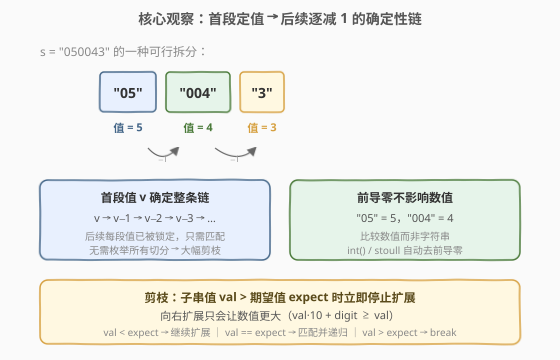
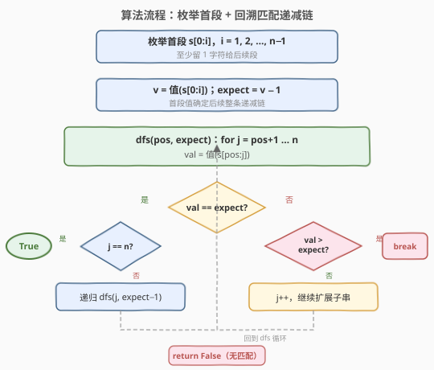
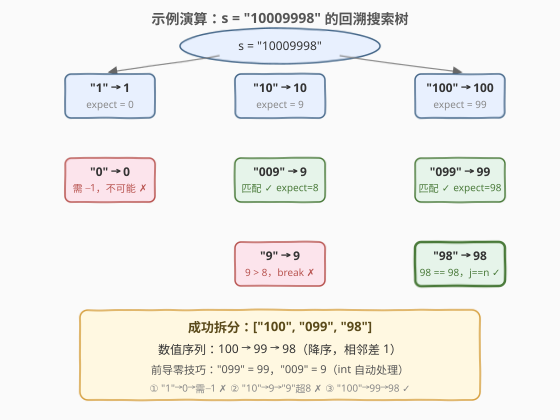

# LeetCode 将字符串拆分为递减的连续值 题解

## 1. 题目概述

- **标题 / 题号**：将字符串拆分为递减的连续值（#1849，medium）
- **链接**：https://leetcode.cn/problems/splitting-a-string-into-descending-consecutive-values/
- **难度**：中等
- **标签**：字符串、回溯、剪枝

**题意**：给定一个仅由数字组成的字符串 `s`，判断能否将其拆分成**两个或更多非空子字符串**，使各子字符串的**数值**按**降序**排列，且每两个相邻子字符串的数值之**差**等于 `1`。

> ⚠️ 比较的是**数值**而非字符串：`"0090"` 的数值为 `90`，`"089"` 的数值为 `89`。前导零不影响数值大小。

**示例 1**：

```text
输入：s = "1234"
输出：false
解释：不存在可行的拆分方法。
```

**示例 2**：

```text
输入：s = "050043"
输出：true
解释：s 可以拆分为 ["05", "004", "3"]，对应数值为 [5, 4, 3]。
      满足按降序排列，且相邻值相差 1。
```

**示例 3**：

```text
输入：s = "9080701"
输出：false
解释：不存在可行的拆分方法。
```

**示例 4**：

```text
输入：s = "10009998"
输出：true
解释：s 可以拆分为 ["100", "099", "98"]，对应数值为 [100, 99, 98]。
      满足按降序排列，且相邻值相差 1。
```

**约束**：

- $1 \le \text{s.length} \le 20$
- `s` 仅由数字组成

> 💡 **关键直觉**：一旦第一段的值 $v$ 确定，后续每段的值就被完全锁定——必须是 $v-1,\ v-2,\ v-3,\ \ldots$。这不是"自由枚举每段"的问题，而是"选定首段后逐段匹配"的问题。这使得搜索树的分支因子极小，回溯 + 剪枝即可高效求解。

## 2. 解题思路

### 2.1 暴力思路：枚举所有切分位置

长度为 $n$ 的字符串有 $n-1$ 个间隙，每个间隙可切或不切，共 $2^{n-1}$ 种分割方案。逐一验证每种方案的数值序列是否满足递减且差 1。$n = 20$ 时 $2^{19} \approx 5 \times 10^5$ 种，每种验证 $O(n)$，总 $O(n \cdot 2^n) \approx 10^7$，勉强不超时但效率低且代码啰嗦。

> ⚠️ 瓶颈：暴力枚举了**大量不可能的切分**——一旦首段值 $v$ 确定，后续每段值就被锁定为 $v-1, v-2, \ldots$，无需自由枚举切分位置，只需逐段匹配特定值。

### 2.2 核心观察：首段定值 + 回溯匹配递减链



把问题拆成两件事：

1. **首段确定整条链**：枚举首段 $s[0\!:\!i]$ 的值 $v$，后续序列被完全锁定为 $v-1,\ v-2,\ v-3,\ \ldots$。每个后续位置只需匹配一个**特定的期望值** `expect`，而非自由选择切分点。

2. **逐段匹配 + 剪枝**：从位置 `pos` 开始，向右扩展子串 $s[\text{pos}\!:\!j]$，计算其数值 `val`：
   - `val == expect`：匹配成功，递归匹配下一段（`expect - 1`）。
   - `val < expect`：继续扩展（向右加数字，val 只增不减）。
   - `val > expect`：**剪枝 break**——继续扩展只会让 val 更大，不可能再匹配。

3. **前导零处理**：`"05"` = 5、`"004"` = 4、`"099"` = 99。数值比较自动忽略前导零，`int()` / `stoull` 天然处理。这使得同一个数值可能有多种字符串表示（如 `5` 可表示为 `"5"`、`"05"`、`"005"`），回溯会自然尝试所有可能。

> 💡 **为什么剪枝有效？** 子串向右扩展一位，新值 $\text{val}' = \text{val} \times 10 + \text{digit} \ge \text{val}$（当 val > 0 时严格递增；val = 0 时不变或递增）。因此一旦 $\text{val} > \text{expect}$，继续扩展只会让差距更大，直接 break。

> ⚠️ **边界：expect = 0**。当 `expect == 0` 且 `val == 0` 时，下一段期望值是 $-1$（不可能匹配任何非负值）。此时不能递归，但仍需 `continue` 尝试更长的全零子串——若它恰好消耗完剩余字符（`j+1 == n`），则匹配成功。

### 2.3 算法流程图



三步循环：

```text
for i = 1 .. n-1:                     # 枚举首段 s[0:i]
    v = 值(s[0:i])
    if v == 0: continue                # 下一段需 -1，不可能
    if dfs(pos = i, expect = v - 1): return true
return false

dfs(pos, expect):
    val = 0
    for j = pos .. n-1:                # 向右扩展子串
        val = val * 10 + digit(s[j])
        if val == expect:
            if j+1 == n: return true   # 消耗完整个字符串
            if expect == 0: continue   # 下一段需 -1，跳过但继续尝试更长全零串
            if dfs(j+1, expect - 1): return true
        elif val > expect:
            break                      # 剪枝：继续扩展只会更大
    return false
```

### 2.4 示例演算



以示例 4 `s = "10009998"` 为例，回溯搜索树如下：

| 尝试 | 首段 | 值 $v$ | expect | 匹配过程 | 结果 |
|------|------|--------|--------|----------|------|
| ① | `"1"` | 1 | 0 | `"0"`(0=0)→需−1 不可能；`"00"`(0=0)→同；`"009"`(9>0) break | ✗ |
| ② | `"10"` | 10 | 9 | `"009"`(9=9)→expect=8→`"9"`(9>8) break | ✗ |
| ③ | `"100"` | 100 | 99 | `"099"`(99=99)→expect=98→`"98"`(98=98, j+1==n) | ✓ |

> 💡 **尝试 ③ 的前导零技巧**：`"099"` 的数值是 99（前导零被 `int()` 自动忽略），恰好匹配 expect=99。这是本题的关键细节——若按字符串比较 `"099" != "99"`，会错误地判定不可行。

> ⚠️ **尝试 ① 的陷阱**：首段值 $v=1$，下一段 expect=0。`"0"` 匹配 0，但之后需要 $-1$（不可能）。然而 `"00"` 也匹配 0，如果它恰好消耗完字符串就可行——但此处后面还有 `"998"`，所以失败。代码中 `expect == 0` 时 `continue` 正是处理这种情况。

## 3. 参考代码

### Python

```python
class Solution:
    def splitString(self, s: str) -> bool:
        n = len(s)

        def dfs(pos: int, expect: int) -> bool:
            val = 0
            for j in range(pos, n):
                val = val * 10 + int(s[j])
                if val == expect:
                    if j + 1 == n:
                        return True
                    if expect == 0:
                        continue
                    if dfs(j + 1, expect - 1):
                        return True
                elif val > expect:
                    break
            return False

        first = 0
        for i in range(n - 1):
            first = first * 10 + int(s[i])
            if first == 0:
                continue
            if dfs(i + 1, first - 1):
                return True
        return False
```

### C++

```cpp
class Solution {
public:
    bool splitString(string s) {
        int n = s.size();
        unsigned long long first = 0;
        for (int i = 0; i < n - 1; ++i) {
            first = first * 10 + (s[i] - '0');
            if (first == 0) continue;
            if (dfs(s, i + 1, first - 1)) return true;
        }
        return false;
    }

private:
    bool dfs(const string& s, int pos, unsigned long long expect) {
        int n = s.size();
        unsigned long long val = 0;
        for (int j = pos; j < n; ++j) {
            val = val * 10 + (s[j] - '0');
            if (val == expect) {
                if (j + 1 == n) return true;
                if (expect == 0) continue;
                if (dfs(s, j + 1, expect - 1)) return true;
            } else if (val > expect) {
                break;
            }
        }
        return false;
    }
};
```

> 💡 **实现细节**：
> - **增量计算 val**：`val = val * 10 + digit`，避免每次重新解析子串，$O(1)$ 扩展。
> - **`first == 0` 跳过**：首段值为 0 时，下一段需匹配 $-1$（不可能），直接跳过。
> - **`expect == 0` continue**：匹配 0 后下一段需 $-1$，不能递归；但更长的全零子串（`"00"`、`"000"`）也等于 0，若恰好消耗完字符串则成功。
> - **C++ 大数处理**：`unsigned long long` 最大 $\approx 1.8 \times 10^{19}$，足以容纳 19 位数字（$10^{19}-1 < 1.8 \times 10^{19}$）。$s$ 长度 $\le 20$，首段最多 19 位，不会溢出。
> - **Python 无溢出**：`int` 任意精度，天然处理大数。

> ⚠️ **C++ 溢出分析**：$s$ 长度 $\le 20$，首段最多 $n-1 = 19$ 位。19 位全 9 $= 9999999999999999999 < 18446744073709551615$（`ULLONG_MAX`），安全。`expect == 0` 时用 `continue` 跳过 `expect - 1` 的减法，避免无符号下溢。

## 4. 复杂度分析

| 维度 | 复杂度 | 说明 |
|------|--------|------|
| **时间** | $O(n^2)$ | $O(n)$ 个首段 $\times$ 每个首段 $O(n)$ 匹配扫描；剪枝使每段匹配 $O(1) \sim O(n)$，总计 $O(n^2)$ |
| **空间** | $O(n)$ | 递归栈深度最多 $n$ 层 |

> 💡 **剪枝效果**：首段值 $v$ 确定后，后续每段值被锁定为 $v-1, v-2, \ldots$。每段匹配时，向右扩展子串直到 $\text{val} \ge \text{expect}$ 即停——由于数值随位数指数增长，通常只需 $O(\log_{10} \text{expect})$ 次比较即可判定。整个搜索树退化为一条链，分支因子接近 1。

> ⚠️ 最坏情况出现在大量前导零时（如 `"100010001000..."`），此时单个 expect=0 的匹配需 $O(n)$ 次全零扩展。但这种情况至多出现在一层，不影响 $O(n^2)$ 的总体界。$n \le 20$ 时最多 $\sim 400$ 次操作，远低于时限。

## 5. 扩展：与同类数字拆分题的对比

本题属于**数字串拆分为满足约束的序列**家族，核心区别在于「序列约束」的不同：

| 题目 | 序列约束 | 首段确定链？ | 搜索分支 |
|------|----------|-------------|----------|
| **1849**（本题） | $a_{i+1} = a_i - 1$ | ✅ 首段值 $v$ 锁定 $v, v{-}1, v{-}2, \ldots$ | 极小（分支因子 ≈ 1） |
| [842. 斐波那契序列](https://leetcode.cn/problems/split-array-into-fibonacci-sequence/) | $a_{i+2} = a_i + a_{i+1}$ | ❌ 前两段共同确定链 | 较大（需枚举前两段） |
| [306. 累加数](https://leetcode.cn/problems/additive-number/) | $a_{i+2} = a_i + a_{i+1}$ | ❌ 同 842 | 较大 |
| [1593. 唯一子串最大数](https://leetcode.cn/problems/split-a-string-into-the-max-number-of-unique-substrings/) | 所有子串互不相同 | ❌ 无递推关系 | 最大（纯回溯 + 去重） |

> 💡 **本题最特殊**：递推关系 $a_{i+1} = a_i - 1$ 只依赖前一项，首段值完全确定后续序列。而 842/306 的 Fibonacci 约束依赖前两项，需枚举前两段才能确定链，搜索空间更大。1593 无递推关系，退化为纯组合搜索。

### 大数处理的替代方案

若 $s$ 长度更大（如 $n \le 100$），`unsigned long long` 会溢出。此时可用**字符串比较**代替数值比较：

1. 去除前导零得到规范形式。
2. 比较长度（更长 = 数值更大），等长时字典序比较。
3. 减法也用字符串模拟（大数减 1）。

但本题 $n \le 20$，`unsigned long long` 足够，无需此优化。

## 6. 面试要点

1. **为什么首段值确定后整条链就被锁定了？**

   > 题目要求相邻段差恰好 1 且降序，即 $a_{i+1} = a_i - 1$。这是一个**一阶递推**——每项只依赖前一项。首段值 $v$ 确定后，序列为 $v, v{-}1, v{-}2, \ldots$，后续每段只需匹配一个特定值，无需枚举切分位置。对比 [842. 斐波那契序列](https://leetcode.cn/problems/split-array-into-fibonacci-sequence/) 的二阶递推 $a_{i+2} = a_i + a_{i+1}$，本题的搜索空间远小。

2. **剪枝条件 `val > expect` 为什么是安全的？**

   > 子串向右扩展一位，新值 $\text{val}' = \text{val} \times 10 + \text{digit}$。当 $\text{val} > 0$ 时 $\text{val}' \ge \text{val} \times 10 > \text{val}$；当 $\text{val} = 0$ 时 $\text{val}' = \text{digit} \ge 0 = \text{val}$。总之 $\text{val}' \ge \text{val}$，一旦 $\text{val} > \text{expect}$，继续扩展只会更大，不可能回到 $\text{expect}$，直接 break。

3. **`expect == 0` 时为什么要 `continue` 而非 `break`？**

   > `expect == 0` 匹配成功后，下一段需要 $-1$（不可能）。但更长的全零子串（`"00"`、`"000"`）的值也是 0——如果它恰好消耗完剩余字符（`j+1 == n`），则匹配成功。因此 `continue` 继续尝试更长的全零串，而非 `break` 放弃。典型场景：`s = "1000"` → `["1", "000"]` → `[1, 0]` ✓。

4. **C++ 中为什么用 `unsigned long long` 而非 `long long`？**

   > $s$ 长度 $\le 20$，首段最多 19 位。19 位全 9 $= 9999999999999999999 \approx 10^{19}$，超过 `long long` 最大值 $\approx 9.2 \times 10^{18}$，但小于 `unsigned long long` 最大值 $\approx 1.8 \times 10^{19}$。用 `unsigned` 可容纳所有合法值。同时通过 `expect == 0` 的 `continue` 避免 `expect - 1` 的无符号下溢。

5. **前导零对算法有什么影响？**

   > 前导零使同一数值有多种字符串表示：`5` 可写成 `"5"`、`"05"`、`"005"` 等。算法用 `int()` / `stoull` 解析数值，自动忽略前导零，因此天然支持。但这也意味着匹配 `expect = 0` 时可能有多个位置都满足（全零串），需逐一尝试——这是 `expect == 0` 时 `continue` 而非 `break` 的根本原因。

> 💡 **一句话总结**：枚举首段值 $v$，后续序列被锁定为 $v{-}1, v{-}2, \ldots$，逐段向右扩展子串匹配期望值，`val > expect` 时剪枝 break。$O(n^2)$ 时间，$O(n)$ 空间。

## 同类练习题

| # | 题目 | 与本题的关联 |
|---|------|-------------|
| 842 | [将数组拆分成斐波那契序列](https://leetcode.cn/problems/split-array-into-fibonacci-sequence/)（[题解](../0801-0900/842_将数组拆分成斐波那契序列.md)） | 同样拆分数字串为满足约束的序列，但约束是二阶递推 $a_{i+2} = a_i + a_{i+1}$，需枚举前两段，搜索分支更大 |
| 306 | [累加数](https://leetcode.cn/problems/additive-number/)（[题解](../0301-0400/306_累加数.md)） | 842 的判定版（返回 true/false），同样二阶递推，可作为 842 的简化练习 |
| 131 | [分割回文串](https://leetcode.cn/problems/palindrome-partitioning/)（[题解](../0101-0200/131_分割回文串.md)） | 字符串回溯分割的母题，每段约束是「回文」而非数值递推，回溯框架通用 |
| 93 | [复原 IP 地址](https://leetcode.cn/problems/restore-ip-addresses/)（[题解](../0001-0100/93_复原IP地址.md)） | 回溯分割数字串为合法 IP 段，每段有「0–255 + 无前导零」约束，对照本题「前导零允许」的差异 |
| 1593 | [拆分字符串使唯一子字符串的数目最大](https://leetcode.cn/problems/split-a-string-into-the-max-number-of-unique-substrings/)（[题解](../1501-1600/1593_拆分字符串使唯一子字符串的数目最大.md)） | 拆分字符串使所有子串互不相同，无递推关系，纯回溯 + 去重，分支因子最大 |
