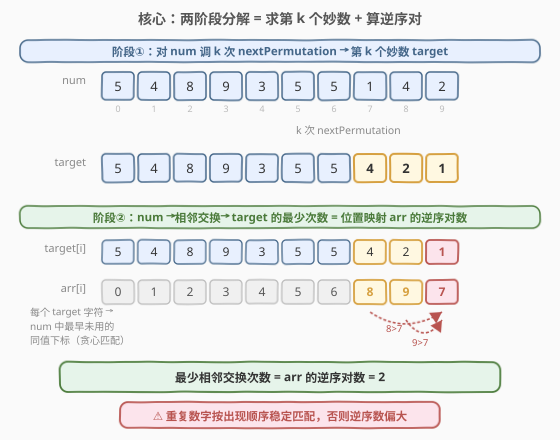
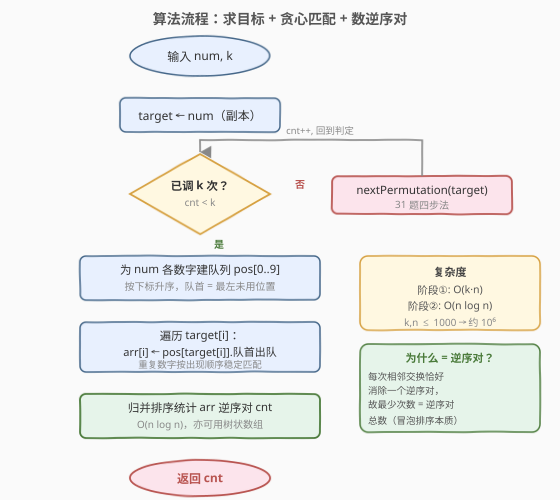
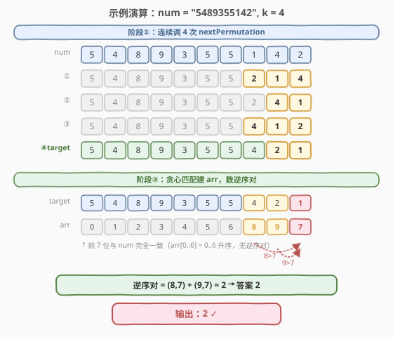

# 邻位交换的最小次数

- **题目名称**：邻位交换的最小次数
- **链接**：[1850. 邻位交换的最小次数](https://leetcode.cn/problems/minimum-adjacent-swaps-to-reach-the-kth-smallest-number/)
- **难度**：中等
- **标签**：字符串、贪心、排列、树状数组

## 1. 题目概述

给你一个表示大整数的字符串 `num`，和一个整数 `k`。如果某个整数是 `num` 中各位数字的一个**排列**且它的**值大于** `num`，则称这个整数为**妙数**。可能存在很多妙数，但只需关注**值最小**的那些。返回要得到第 `k` 个**最小妙数**需要对 `num` 执行的**相邻位数字交换的最小次数**。

**示例 1**：

```text
输入：num = "5489355142", k = 4
输出：2
解释：第 4 个最小妙数是 "5489355421"：
- 交换下标 7 和 8："5489355142" -> "5489355412"
- 交换下标 8 和 9："5489355412" -> "5489355421"
```

**示例 2**：

```text
输入：num = "11112", k = 4
输出：4
解释：第 4 个最小妙数是 "21111"，需 4 次相邻交换。
```

**示例 3**：

```text
输入：num = "00123", k = 1
输出：1
解释：第 1 个最小妙数是 "00132"，交换下标 3 和 4 即可。
```

**约束条件**：

- $2 \le \text{num.length} \le 1000$
- $1 \le k \le 1000$
- `num` 仅由数字组成
- 测试用例按存在第 $k$ 个最小妙数生成

> 💡 **核心矛盾**：题目要的不是「第 $k$ 个妙数本身」，而是「从 `num` 变成它的最少相邻交换次数」。这两件事可以**完全解耦**——先求出目标排列，再独立计算把 `num` 变成它的最小交换代价。能否把一个看似复杂的问题拆成两个经典子问题？

---

## 2. 解题思路

### 2.1 暴力思路：生成所有妙数 + 模拟交换

最直觉的做法是：枚举 `num` 的所有排列，筛出大于 `num` 的、排序后取第 $k$ 个作为 `target`；然后从 `num` 出发，逐次相邻交换模拟逼近 `target`，统计次数。

> ⚠️ **致命缺陷**：$n$ 个数字的排列数最坏 $n!$，$n = 1000$ 时天文数字，根本无法枚举。而且「逐次模拟交换」也未必能得到**最小**次数——乱选交换顺序可能绕远路。两个缺陷都源于没抓住问题的两层结构。

### 2.2 核心观察：两阶段解耦 = 求第 k 个排列 + 算逆序对



关键洞察是**问题天然分两层，且彼此独立**：

**阶段①——求目标 `target`**：「第 $k$ 个最小妙数」就是 `num` 在字典序下的**第 $k$ 个后继排列**。而「下一个排列」是经典算法（[31. 下一个排列](../0001-0100/31_下一个排列.md)）：从右找首个升序对、交换、反转后缀。把这套四步法**连续调用 $k$ 次**，就从 `num` 走到了第 $k$ 个妙数 `target`。无需枚举所有排列。

**阶段②——算最小交换代价**：把 `num` 经相邻交换变成 `target` 的**最少次数**，等于两者之间的**逆序对数**。这是冒泡排序的本质——每次相邻交换恰好消除一个逆序对，故最少次数 = 逆序对总数。

> 💡 **为什么最小交换 = 逆序对数？** 相邻交换只能改变相邻两元素的相对顺序，即每次至多消除一个逆序对。而任何排列都能通过「不断交换相邻的逆序对」变成有序（冒泡排序），恰好需要「逆序对数」次。所以「num → target 的最少相邻交换」= 「把 target 的元素按 num 中出现顺序排列所需的相邻交换」= 位置映射的逆序对数。

**重复数字的处理——稳定贪心匹配**：`num` 可能有重复数字（如示例 1 有三个 `5`、两个 `4`）。为让逆序对数**最小且正确**，对 `target` 中每个字符，应在 `num` 里取**最早未用的同值下标**（即按出现顺序稳定匹配）。形式化：为 `num` 每个数字 $d$ 维护一个下标队列 $\text{pos}[d]$（按下标升序）；遍历 `target[i]`，令 $\text{arr}[i] = \text{pos}[d].\text{pop\_left}()$。得到的 $\text{arr}$ 即「`target` 第 $i$ 位对应 `num` 的哪个原下标」。

> ⚠️ **为什么必须稳定匹配？** 若把 `target` 中的某个 `5` 错配到 `num` 中更靠后的同值 `5`，会让本可保持顺序的同值元素产生**虚假逆序对**，使代价偏大。稳定匹配保证同值元素按原序对应，逆序对数才等于真实最少交换次数。

### 2.3 算法流程图



**完整步骤**：

1. **阶段①**：`target ← num`，循环 $k$ 次调用 `nextPermutation(target)`（四步法：找升序对 $i$ → 找后继 $j$ → 交换 → 反转后缀）。
2. **建队列**：遍历 `num`，把每个数字 $d$ 的原下标按升序存入 $\text{pos}[d]$。
3. **贪心匹配**：遍历 `target[i]`，$d = \text{target}[i]$，$\text{arr}[i] \leftarrow \text{pos}[d].\text{pop\_left}()$（队首出队，游标前进）。
4. **数逆序对**：对 $\text{arr}$ 用**树状数组**（或归并排序）统计逆序对数 $\text{cnt}$。
5. **返回** $\text{cnt}$。

> 💡 **树状数组数逆序对**：$\text{arr}$ 的值域恰为 $[0, n{-}1]$（一组原下标），可用值域 BIT。从左到右遍历 $\text{arr}$，对每个 $x$，已入列且 $> x$ 的个数 $= i - \text{query}(x)$（$i$ 为已处理个数，$\text{query}(x)$ 为值 $\le x$ 的已入列个数），累加即逆序对；再把 $x$ 加入 BIT。

### 2.4 示例演算

以 `num = "5489355142", k = 4` 为例：



**阶段①**——连续 4 次 `nextPermutation`：

| 步骤 | 操作 | 结果 | 变化后缀 |
|------|------|------|----------|
| num | — | `5489355142` | — |
| ① | 后缀 `142`→`214` | `5489355214` | 下标 7,8,9 |
| ② | 后缀 `14`→`41` | `5489355241` | 下标 8,9 |
| ③ | 后缀 `241`→`412` | `5489355412` | 下标 7,8,9 |
| ④ | 后缀 `12`→`21` | `5489355421` | 下标 8,9 |

得到 `target = "5489355421"`。

**阶段②**——贪心匹配建 `arr`：

`num` 各数字下标队列：$\text{pos}[5]=[0,5,6]$、$\text{pos}[4]=[1,8]$、$\text{pos}[8]=[2]$、$\text{pos}[9]=[3]$、$\text{pos}[3]=[4]$、$\text{pos}[1]=[7]$、$\text{pos}[2]=[9]$。按 `target` 逐位出队：

| target 位 | 字符 | 取自 num 下标 | arr[i] |
|-----------|------|---------------|--------|
| 0–6 | 5,4,8,9,3,5,5 | 0,1,2,3,4,5,6 | 0,1,2,3,4,5,6 |
| 7 | 4 | 8（pos[4] 队首 1 已用，取下一个 8） | 8 |
| 8 | 2 | 9 | 9 |
| 9 | 1 | 7 | 7 |

$\text{arr} = [0,1,2,3,4,5,6,8,9,7]$。前 7 位升序无逆序对；末尾 $8,9,7$ 中 $8>7$、$9>7$ 共 **2 个逆序对**，故答案 $= 2$ ✓。

> 💡 注意 `target[7]` 的 `4` 取的是 `num` 下标 8 而非 1——因为 `num` 下标 1 的 `4` 已被 `target[1]` 消费。这正是「稳定贪心匹配」的体现：同值数字按出现顺序依次配对，避免虚假逆序对。

---

## 3. 参考代码

### C++（两阶段 + 树状数组数逆序对）

```cpp
class Solution {
  public:
    int getMinSwaps(string num, int k) {
        int n = num.size();
        // 阶段①：求第 k 个妙数 target
        string target = num;
        for (int i = 0; i < k; i++) nextPermutation(target);

        // 阶段②：贪心匹配建位置映射 arr
        vector<int> pos[10];
        for (int i = 0; i < n; i++) pos[num[i] - '0'].push_back(i);
        int head[10] = {0};
        vector<int> arr(n);
        for (int i = 0; i < n; i++) {
            int d = target[i] - '0';
            arr[i] = pos[d][head[d]++];        // 队首出队
        }
        return countInversions(arr);
    }

  private:
    // 31 题四步法：找升序对 i -> 找后继 j -> 交换 -> 反转后缀
    void nextPermutation(string &s) {
        int n = s.size(), i = n - 2;
        while (i >= 0 && s[i] >= s[i + 1]) --i;
        if (i >= 0) {
            int j = n - 1;
            while (s[j] <= s[i]) --j;
            swap(s[i], s[j]);
        }
        reverse(s.begin() + i + 1, s.end());
    }

    // 值域树状数组统计逆序对，arr 值域恰为 [0, n-1]
    int countInversions(vector<int> &a) {
        int n = a.size(), cnt = 0;
        vector<int> bit(n + 1, 0);
        for (int i = 0; i < n; i++) {
            int x = a[i], s = 0;
            for (int j = x + 1; j > 0; j -= j & (-j)) s += bit[j];   // 值 <= x 的已入列个数
            cnt += i - s;                                             // 已入列且 > x 的个数
            for (int j = x + 1; j <= n; j += j & (-j)) bit[j]++;
        }
        return cnt;
    }
};
```

### Python

```python
class Solution:
    def getMinSwaps(self, num: str, k: int) -> int:
        target = list(num)
        for _ in range(k):
            self._next_permutation(target)

        from collections import deque
        pos = [deque() for _ in range(10)]
        for i, ch in enumerate(num):
            pos[int(ch)].append(i)
        arr = [pos[int(ch)].popleft() for ch in target]
        return self._count_inversions(arr)

    def _next_permutation(self, s):
        n = len(s)
        i = n - 2
        while i >= 0 and s[i] >= s[i + 1]:
            i -= 1
        if i >= 0:
            j = n - 1
            while s[j] <= s[i]:
                j -= 1
            s[i], s[j] = s[j], s[i]
        s[i + 1:] = reversed(s[i + 1:])

    def _count_inversions(self, arr):
        n = len(arr)
        bit = [0] * (n + 1)
        cnt = 0
        for i, x in enumerate(arr):
            s, j = 0, x + 1
            while j > 0:
                s += bit[j]
                j -= j & (-j)
            cnt += i - s
            j = x + 1
            while j <= n:
                bit[j] += 1
                j += j & (-j)
        return cnt
```

> 💡 **游标 / 队列代替删除**：`pos[d]` 只从头部消费，C++ 用 `head[d]` 游标前进、Python 用 `deque.popleft()`，均摊 $O(1)$，避免 `erase`/`pop(0)` 的 $O(n)$ 搬移。若用普通 `list` 的 `pop(0)` 在 Python 中是 $O(n)$，$n=1000$ 时虽能过，但 `deque` 更规范。
>
> ⚠️ **BIT 的 1-indexed 偏移**：`arr` 值 $x \in [0, n{-}1]$ 对应 BIT 位置 $x{+}1$。`query(x)` 查 BIT 位置 $[1, x{+}1]$ 之和 = 值 $\le x$ 的已入列个数；`add(x)` 在位置 $x{+}1$ 处 $+1$。偏移搞反会漏数或越界。

---

## 4. 复杂度分析

| 维度 | 复杂度 | 说明 |
|------|--------|------|
| 时间复杂度 | $O(k \cdot n + n \log n)$ | 阶段①调用 $k$ 次 `nextPermutation`，每次 $O(n)$；阶段②建队列 $O(n)$ + 数逆序对 $O(n \log n)$ |
| 空间复杂度 | $O(n)$ | `pos` 存全部下标共 $n$ 个 + `arr` 数组 $n$ + BIT 数组 $n+1$，均与 $n$ 同阶 |

> ⚠️ 本题 $k, n \le 1000$，$O(k \cdot n) \approx 10^6$、$O(n \log n) \approx 10^4$，总量约 $10^6$ 次操作，轻松通过。若 $k$ 大到 $10^9$，阶段①会超时——但本题约束 $k \le 1000$，无需用康托展开加速求第 $k$ 排列。

---

## 5. 扩展：归并排序数逆序对

树状数组依赖「`arr` 值域恰为 $[0, n{-}1]`」这一性质（本题成立，因为 `arr` 是一组原下标）。更通用的逆序对计数是**归并排序**——在合并两段时，若左段元素 `L[i]` 大于右段元素 `R[j]`，则左段从 `i` 到末尾的所有元素都与 `R[j]` 构成逆序对，累加 `len(L) - i` 即可。归并排序不依赖值域范围，适用于任意可比较元素。

```cpp
int countInversionsMerge(vector<int> &a) {
    int n = a.size();
    vector<int> tmp(n);
    function<int(int, int)> ms = [&](int l, int r) -> int {
        if (l >= r) return 0;
        int m = (l + r) / 2;
        int cnt = ms(l, m) + ms(m + 1, r);
        int i = l, j = m + 1, k = l;
        while (i <= m && j <= r) {
            if (a[i] <= a[j]) tmp[k++] = a[i++];
            else { tmp[k++] = a[j++]; cnt += m - i + 1; }
        }
        while (i <= m) tmp[k++] = a[i++];
        while (j <= r) tmp[k++] = a[j++];
        for (int t = l; t <= r; t++) a[t] = tmp[t];
        return cnt;
    };
    return ms(0, n - 1);
}
```

> 💡 **BIT vs 归并排序**：BIT 需要值域离散化（本题天然是 $[0,n{-}1]$ 故免离散化），但代码短、原地快；归并排序通用、不挑值域，但需 $O(n)$ 辅助数组与递归栈。两者同为 $O(n \log n)$，面试中任选其一即可，点出「相邻交换 = 逆序对」的内核比具体实现更重要。

---

## 6. 面试要点

**Q1：为什么问题能拆成「求第 k 个排列」和「数逆序对」两个独立子问题？**

> 题目问的是「从 `num` 变成第 $k$ 个妙数的最少相邻交换次数」，与「第 $k$ 个妙数是什么」可以解耦：先用 `nextPermutation` 求出目标 `target`（纯排列问题），再独立计算 `num → target` 的最小交换代价（纯逆序对问题）。两个子问题互不依赖，各自套用经典算法即可。

**Q2：为什么「最少相邻交换次数 = 逆序对数」？**

> 相邻交换只能改变相邻两元素的相对顺序，每次至多消除一个逆序对，所以交换次数 $\ge$ 逆序对数。而冒泡排序通过不断交换相邻逆序对，恰好用「逆序对数」次把序列变有序，故下界可达。因此 `num → target` 的最小相邻交换 = 位置映射 `arr` 的逆序对数。

**Q3：重复数字为什么要「稳定贪心匹配」？**

> 若把 `target` 中的某数字错配到 `num` 中更靠后的同值位置，会让本应保持顺序的同值元素产生虚假逆序对，使代价偏大。按出现顺序依次配对（队首出队）保证同值元素相对顺序不变，逆序对数才等于真实最少交换次数。这是「逆序对=最小交换」前提成立的关键。

**Q4：`nextPermutation` 为什么连续调 $k$ 次就得到第 $k$ 个妙数？**

> 「妙数」定义为 `num` 的排列且值大于 `num`，按值升序排列后第 $k$ 个。而 `nextPermutation` 产生的正是字典序后继排列——每次调用得到「比当前大、且尽可能小」的排列。从 `num` 出发连续调 $k$ 次，恰好遍历到第 $k$ 个后继，即第 $k$ 个最小妙数。

**Q5：树状数组数逆序对时，`query(x)` 和 `add(x)` 的偏移为什么是 $x{+}1$？**

> BIT 是 1-indexed，而 `arr` 值 $x \in [0, n{-}1]$ 是 0-indexed，故对应 BIT 位置 $x{+}1$。`query(x)` 查 BIT $[1, x{+}1]$ 之和 = 值 $\le x$ 的已入列个数；`add(x)` 在位置 $x{+}1$ 处 $+1$。把偏移搞反会漏掉或重复计数。

---

## 7. 同类练习题

- [31. 下一个排列](https://leetcode.cn/problems/next-permutation/)（[站内题解](../0001-0100/31_下一个排列.md)）：阶段①的直接基础——四步法求字典序后继排列，本题连续调 $k$ 次即得第 $k$ 个妙数
- [315. 计算右侧小于当前元素的个数](https://leetcode.cn/problems/count-of-smaller-numbers-after-self/)（[站内题解](../0301-0400/315_计算右侧小于当前元素的个数.md)）：归并排序 / 树状数组统计逆序对的经典题，阶段②的算法母题
- [1505. 最多 K 次交换相邻数位后得到的最小整数](https://leetcode.cn/problems/minimum-possible-integer-after-at-most-k-adjacent-swaps-on-digits/)（[站内题解](../1501-1600/1505_最多K次交换相邻数位后得到的最小整数.md)）：同为「相邻交换 + 树状数组算代价」，但方向相反——给定预算 $k$ 求能达成的最小结果，对照本题「求达成特定目标的最小代价」
- [556. 下一个更大元素 III](https://leetcode.cn/problems/next-greater-element-iii/)：把整数当数字数组套 `nextPermutation`，注意越界判断，与本题阶段①同源
- [1850. 邻位交换的最小次数](https://leetcode.cn/problems/minimum-adjacent-swaps-to-reach-the-kth-smallest-number/)：本题自身，串联「下一个排列」与「逆序对」两个经典套路
