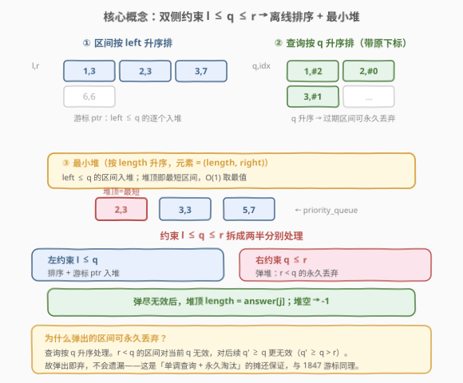
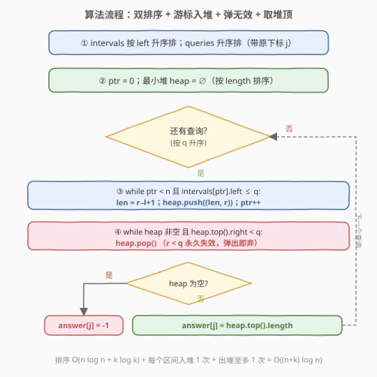
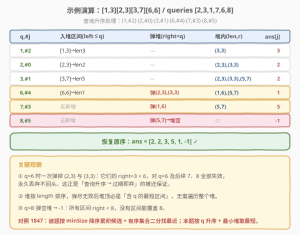

# LeetCode 包含每个查询的最小区间 题解

## 1. 题目概述

- **标题 / 题号**：包含每个查询的最小区间（#1851，hard）
- **链接**：https://leetcode.cn/problems/minimum-interval-to-include-each-element/
- **难度**：困难
- **标签**：数组、排序、堆（优先队列）、离线处理

**题意**：给定一个二维整数数组 `intervals`，其中 `intervals[i] = [left_i, right_i]` 表示第 `i` 个区间（闭区间，包含两端）。再给定一个整数数组 `queries`。第 `j` 个查询的答案是：**包含 `queries[j]` 的所有区间中长度最短的那个区间的长度**；若没有区间包含 `queries[j]`，答案为 `-1`。区间 $[l, r]$ 的长度定义为 $r - l + 1$，包含 `q` 即 $l \le q \le r$。返回长度为 `queries.length` 的答案数组。

**示例 1**：

```text
输入：intervals = [[1,3],[2,3],[3,7],[6,6]], queries = [2,3,1,7,6,8]
输出：[2,2,3,5,1,-1]
解释：
  q=2：含 2 的区间 [1,3](len3)、[2,3](len2) → 最短 len2 → 2
  q=3：含 3 的区间 [1,3](len3)、[2,3](len2)、[3,7](len5) → 最短 len2 → 2
  q=1：含 1 的区间 [1,3](len3) → 3
  q=7：含 7 的区间 [3,7](len5) → 5
  q=6：含 6 的区间 [3,7](len5)、[6,6](len1) → 最短 len1 → 1
  q=8：无区间含 8 → -1
```

**示例 2**：

```text
输入：intervals = [[2,3],[2,5],[1,8],[20,25]], queries = [2,19,5,22]
输出：[2,-1,4,6]
```

**约束**：

- $1 \le \text{intervals.length} \le 10^5$
- $1 \le \text{queries.length} \le 10^5$
- $\text{intervals}[i].\text{length} = 2$
- $1 \le \text{left}_i \le \text{right}_i \le 10^7$
- $1 \le \text{queries}[j] \le 10^7$

> 💡 **关键直觉**：查询 `q` 要找的是同时满足 $l \le q$ 且 $q \le r$ 的最短区间——这是一个**双侧约束**。若对每个查询独立枚举所有区间判定，$n$ 与 $k$ 都到 $10^5$，必然 $O(n \cdot k) \approx 10^{10}$ 超时。注意到约束的两侧都有**单调性可利用**：把查询按 `q` 升序离线处理后，左约束 $l \le q$ 可用游标「只增不减」地入堆，右约束 $q \le r$ 可用最小堆「弹掉过期」地淘汰。这正是与 [1847. 最近的房间](1847_最近的房间.md) 同源的**离线排序 + 数据结构维护动态候选**范式。

## 2. 解题思路

### 2.1 暴力思路：逐查询线性枚举

对每个查询 `q`，遍历所有区间，筛出 $l \le q \le r$ 的子集，再在该子集中线性找最短长度。单次查询 $O(n)$，共 $k$ 次查询，总 $O(n \cdot k)$。$n = k = 10^5$ 时约 $10^{10}$ 次操作，必然超时。

> ⚠️ 瓶颈有二：① 每次查询都**重复枚举**「左端点达标」的区间，不同查询的候选集高度重叠却无法复用；② 在无序子集中找最短需**线性扫描**。两处都可优化——前者靠离线排序复用累积，后者靠最小堆 $O(1)$ 取最值。

### 2.2 核心观察：离线排序 + 游标入堆 + 弹过期



把双侧约束 $l \le q \le r$ 拆成两半，分别用不同机制处理：

1. **左约束 $l \le q$ → 排序 + 游标入堆**：把区间按 `left` 升序排，查询按 `q` 升序排（保留原下标）。处理查询时，用游标 `ptr` 把所有 `left ≤ q` 的区间**一次性**压入最小堆——因为后续查询的 `q` 只会更大，这些区间对后续查询的左约束依然成立，无需重复入堆。堆以 `length` 为键，堆顶即当前最短区间。

2. **右约束 $q \le r$ → 弹堆淘汰过期**：堆中可能残留 `right < q` 的区间（它们不含 `q`）。由于查询按 `q` 升序，一个区间一旦 `right < q`，对所有后续 `q' ≥ q` 更是 `right < q'`，**永久失效**——弹出即弃，不会遗漏。于是每次查询前，循环弹出堆顶所有 `right < q` 的区间。

3. **取堆顶 = 答案**：弹尽无效后，若堆非空，堆顶的 `length` 即「含 `q` 的最短区间长度」；若堆空，答案为 `-1`。

三步循环：

```text
intervals 按 left 升序排；queries 按 q 升序排（带原下标 j）
ptr = 0; 最小堆 heap = ∅  （键 length，存 (length, right)）
for 每个查询 (q, j):
    while ptr < n 且 intervals[ptr].left ≤ q:
        len = right - left + 1
        heap.push((len, right)); ptr++
    while heap 非空 且 heap.top().right < q:
        heap.pop()
    if heap 空: answer[j] = -1
    else:       answer[j] = heap.top().length
```

> 💡 **为什么弹出的区间可永久丢弃？** 查询按 `q` 升序处理。`right < q` 的区间对当前 `q` 无效，对后续 `q' ≥ q` 更无效（$q' \ge q > \text{right}$）。故弹出即弃，无需保留——这是「单调查询 + 永久淘汰」的摊还保证，每个区间至多入堆 1 次、出堆 1 次。

> ⚠️ **常见错误**：① 按查询原序在线处理，每次重新枚举区间——未利用 `q` 的单调性；② 堆只按 `length` 排序却不弹过期，堆顶可能是 `right < q` 的无效区间，得到错误答案；③ 弹过期时只弹一次而非 `while` 循环——堆中可能连续多个过期；④ 入堆条件写成 `left ≤ q` 但忘了区间已按 `left` 排序导致游标错乱。

### 2.3 算法流程图



### 2.4 示例演算



以示例 1 `intervals = [[1,3],[2,3],[3,7],[6,6]]`，`queries = [2,3,1,7,6,8]` 为例。

**预处理**：区间按 `left` 升序 → `[1,3], [2,3], [3,7], [6,6]`（本例已有序）。查询按 `q` 升序并带原下标 → `(1,#2), (2,#0), (3,#1), (6,#4), (7,#3), (8,#5)`。

| 处理顺序 | 查询 (q, j) | 新增入堆区间 (left≤q) | 弹堆 (right<q) | 堆内 (len, right) | ans[j] |
|----------|-------------|----------------------|----------------|-------------------|--------|
| ① | (1, 2) | [1,3]→(3,3) | — | (3,3) | **3** |
| ② | (2, 0) | [2,3]→(2,3) | — | (2,3),(3,3) | **2** |
| ③ | (3, 1) | [3,7]→(5,7) | — | (2,3),(3,3),(5,7) | **2** |
| ④ | (6, 4) | [6,6]→(1,6) | 弹 (2,3)、(3,3)（right=3<6） | (1,6),(5,7) | **1** |
| ⑤ | (7, 3) | 无新增 | 弹 (1,6)（right=6<7） | (5,7) | **5** |
| ⑥ | (8, 5) | 无新增 | 弹 (5,7)（right=7<8）→ 堆空 | ∅ | **-1** |

恢复原序：`ans = [2, 2, 3, 5, 1, -1]`，与期望一致。

> 💡 **步骤 ④ 是本题精髓**：`q=6` 时堆里原本有 `(2,3),(3,3),(5,7)` 三个区间，但前两个的 `right=3 < 6`，不含 6，必须先 `while` 弹尽才能看到真正有效的 `(1,6)` 与 `(5,7)`。堆顶 `(1,6)` 长度 1 即答案。这正是「弹过期」环节的价值——不弹就会错误返回长度 2。

> 💡 **对照 1847**：1847 按 `minSize` 降序累积候选房间号入**有序集合**，再用 `lower_bound` 二分找最接近 `preferred` 的号；本题按 `q` 升序累积候选区间入**最小堆**，再弹过期后 $O(1)$ 取最短。同为「离线排序 + 游标单调推进 + 数据结构维护动态候选」，只是「找最值」的数据结构不同——求最近值用有序集合 + 二分，求最短长度用最小堆 + 取顶。

## 3. 参考代码

### Python

```python
import heapq

class Solution:
    def minInterval(self, intervals: list[list[int]], queries: list[int]) -> list[int]:
        n = len(intervals)
        k = len(queries)

        # 区间按 left 升序排
        intervals.sort(key=lambda x: x[0])
        # 查询按 q 升序排，保留原下标
        qs = sorted((q, j) for j, q in enumerate(queries))

        ans = [-1] * k
        heap = []  # 最小堆：(length, right)
        ptr = 0

        for q, j in qs:
            # 入堆：所有 left <= q 的区间
            while ptr < n and intervals[ptr][0] <= q:
                l, r = intervals[ptr]
                heapq.heappush(heap, (r - l + 1, r))
                ptr += 1
            # 弹无效：right < q 的永久失效
            while heap and heap[0][1] < q:
                heapq.heappop(heap)
            # 堆顶即最短区间
            if heap:
                ans[j] = heap[0][0]

        return ans
```

### C++

```cpp
class Solution {
public:
    vector<int> minInterval(vector<vector<int>>& intervals, vector<int>& queries) {
        int n = intervals.size();
        int k = queries.size();

        // 区间按 left 升序排
        sort(intervals.begin(), intervals.end(),
             [](const auto& a, const auto& b) { return a[0] < b[0]; });

        // 查询按 q 升序排，保留原下标
        vector<pair<int, int>> qs;
        qs.reserve(k);
        for (int j = 0; j < k; ++j) qs.emplace_back(queries[j], j);
        sort(qs.begin(), qs.end());

        vector<int> ans(k, -1);
        // 最小堆：(length, right)，按 length 排序
        priority_queue<pair<int, int>, vector<pair<int, int>>,
                       greater<pair<int, int>>> pq;
        int ptr = 0;

        for (const auto& [q, j] : qs) {
            // 入堆：所有 left <= q 的区间
            while (ptr < n && intervals[ptr][0] <= q) {
                int l = intervals[ptr][0], r = intervals[ptr][1];
                pq.emplace(r - l + 1, r);
                ++ptr;
            }
            // 弹无效：right < q 的永久失效
            while (!pq.empty() && pq.top().second < q) {
                pq.pop();
            }
            // 堆顶即最短区间
            if (!pq.empty()) {
                ans[j] = pq.top().first;
            }
        }
        return ans;
    }
};
```

> 💡 **实现细节**：① 查询排序时务必**保留原下标 `j`**，答案要按原序填回 `ans[j]`。② 堆元素存 `(length, right)`：`length` 作键保证堆顶是最短；`right` 用于判定是否过期。若两区间长度相同，堆会按 `right` 比较，但不影响正确性——长度相同的任一区间都可作为答案。③ C++ 用 `priority_queue` 的 `greater` 版本得到最小堆；`pair` 默认按第一维（`length`）优先比较，正合需求。④ Python `heapq` 是最小堆，直接 `heappush` / `heappop` 即可，`heap[0]` 是堆顶。⑤ 入堆与弹堆的 `while` 都嵌在 `for` 里，但均摊后总操作各 $O(n)$，不与 $k$ 相乘。

> ⚠️ **为什么堆里要存 `right` 而不能只存 `length`？** 弹过期环节必须知道每个区间的 `right` 才能判定 `right < q`。若只存 `length`，无法区分「长度同为 3 但右端点不同」的区间谁过期谁有效。`right` 是过期判定的必要信息。

## 4. 复杂度分析

| 维度 | 复杂度 | 说明 |
|------|--------|------|
| **时间** | $O((n + k) \log n)$ | 排序区间 $O(n \log n)$ + 排序查询 $O(k \log k)$；每个区间至多入堆 1 次出堆 1 次，共 $2n$ 次堆操作各 $O(\log n)$；每个查询至多触发若干次弹堆（总弹堆 ≤ n）+ $O(1)$ 取顶，共 $k$ 轮 |
| **空间** | $O(n + k)$ | 堆最坏存全部 $n$ 个区间 $O(n)$；查询排序副本 $O(k)$；答案数组 $O(k)$ |

> 💡 **摊还保证**：外层 `for` 看似嵌套两个 `while`，但入堆 `while` 每轮必使 `ptr++`，`ptr` 从 0 单调增至 $n$ 就不再回头，总入堆恰 $n$ 次；弹堆 `while` 每轮必弹出一个元素，而元素至多入堆 $n$ 次，故总弹出 ≤ $n$ 次。两个 `while` 的总迭代都被 $n$ 封顶，不与查询数 $k$ 相乘。这是「游标单调推进 + 堆永久淘汰」的经典摊还模式，与 [1847](1847_最近的房间.md) 的游标累积、[1834. 单线程 CPU](1834_单线程CPU.md) 的入堆游标同理。

> ⚠️ 暴力 $O(n \cdot k) \approx 10^{10}$ 必超时；优化到 $O((n+k)\log n) \approx (10^5 + 10^5) \times 17 \approx 3.4 \times 10^6$，快约 3 个数量级。核心是把「逐查询枚举」升级为「离线排序 + 游标入堆」，把「无序找最短」升级为「最小堆 $O(1)$ 取顶」。

## 5. 扩展：为什么「弹过期」必须用 while 循环？

堆顶弹掉一个过期区间后，**新堆顶可能依然过期**。考虑查询 `q=6`，堆中有 `(2,3),(3,3),(5,7),(1,6)` 四个区间（按 length 排：`(1,6),(2,3),(3,3),(5,7)`）。堆顶 `(1,6)` 有效（`right=6 ≥ 6`），看似无需弹——但这只是巧合。换一组数据，若堆顶是 `(1,3)`（`right=3 < 6`），弹掉后新堆顶 `(2,3)` 仍过期（`right=3 < 6`），再弹才到有效的。故必须 `while` 循环弹到堆顶有效或堆空。

> 💡 **本质**：堆按 `length` 排序而非按 `right` 排序，故「过期性」与「堆顶位置」无单调关系——堆顶过期不代表次顶层有效，次顶层也可能过期。`while` 循环是唯一安全的弹法。

### 其他解法一瞥

- **扫描线 + 离散化 + 线段树**：把所有区间端点与查询值离散化到数轴，用线段树维护「每个位置被哪些区间覆盖的最短长度」。区间插入时区间更新最小值，查询时单点查询。复杂度同为 $O((n+k) \log V)$，但实现远比最小堆重，常数更大。
- **在线做法**：若强制按查询原序且不可离线排序，可用**主席树**按 `left` 维护历史版本，查询时在 `left ≤ q` 的版本里二分找 `right ≥ q` 的最短——能做但远超面试要求。离线排序是本题的「正解信号」。

## 6. 面试要点

1. **为什么要把查询离线排序，而不是按原序在线处理？**

   > 每个查询的候选集是「$l \le q$ 且 $q \le r$ 的所有区间」。若在线处理，每次都要重新枚举，且候选集高度重叠却无法复用。注意到查询按 `q` 升序后，左约束 $l \le q$ 的候选集**只增不减**（已入堆的区间对后续更大的 `q` 左约束依然成立），右约束 $q \le r$ 的失效区间**可永久淘汰**（`right < q` 对后续 `q' ≥ q` 更失效）。这是「**约束具单调性 → 离线排序**」的招牌信号，与 [1847](1847_最近的房间.md) 的 `minSize` 单调性同构。

2. **入堆 `while` 和弹堆 `while` 的总迭代次数为什么是 $O(n)$ 而非 $O(n \cdot k)$？**

   > 入堆 `while` 每轮必使 `ptr++`，`ptr` 从 0 单调增至 $n$ 就不再回头，总入堆恰 $n$ 次。弹堆 `while` 每轮必弹出一个元素，而元素至多入堆 $n$ 次，故总弹出 ≤ $n$ 次。两个 `while` 的总迭代都被 $n$ 封顶，即便外层循环 $k$ 次。这是「游标单调推进 + 堆永久淘汰」的摊还保证，与 [1834. 单线程 CPU](1834_单线程CPU.md) 的入堆游标、[1847](1847_最近的房间.md) 的候选累积同理。

3. **弹过期为什么必须用 `while` 循环而不是 `if` 判一次？**

   > 堆按 `length` 排序而非按 `right` 排序，故「过期性」与「堆顶位置」无单调关系。堆顶过期不代表次顶层有效——次顶层也可能 `right < q`。必须 `while` 循环弹到堆顶 `right ≥ q` 或堆空，才能保证堆顶是真正有效的最短区间。

4. **堆元素为什么存 `(length, right)` 而不能只存 `length`？**

   > 弹过期环节必须知道每个区间的 `right` 才能判定 `right < q`。若只存 `length`，无法区分「长度相同但右端点不同」的区间谁过期谁有效。`length` 作堆的键保证堆顶最短，`right` 是过期判定的必要信息，二者缺一不可。

5. **如果查询不排序、强制在线，本题还能做吗？**

   > 可以，但需用**主席树**（可持久化线段树）按 `left` 维护历史版本：将区间按 `left` 升序依次插入主席树，每个版本在 `right` 维度上维护「最短 length」。查询 `q` 时，二分定位到 `left ≤ q` 的最新版本，在该版本的 `right ≥ q` 区间内查最短。复杂度 $O((n+k) \log V)$，但实现远超面试要求。离线排序是面试情境下的正解。

> 💡 **一句话总结**：区间按 `left` 升序、查询按 `q` 升序，游标把 `left ≤ q` 的区间压入最小堆，每次查询前 `while` 弹掉 `right < q` 的过期区间，堆顶 `length` 即答案，堆空则 `-1`。$O((n+k) \log n)$。

## 同类练习题

| # | 题目 | 与本题的关联 |
|---|------|-------------|
| 1847 | [最近的房间](https://leetcode.cn/problems/closest-room/)（[题解](1847_最近的房间.md)） | 离线排序 + 游标累积候选 + 有序集合二分找最近值，本题的姊妹题（数据结构从最小堆换为有序集合，候选从区间换为房间号） |
| 1834 | [单线程 CPU](https://leetcode.cn/problems/single-threaded-cpu/)（[题解](1834_单线程CPU.md)） | 排序 + 游标单调推进入堆 + 堆取最值，与本题「游标入堆 + 弹过期」摊还模式同构 |
| 239 | [滑动窗口最大值](https://leetcode.cn/problems/sliding-window-maximum/)（[题解](../0201-0300/239_滑动窗口最大值.md)） | 单调队列维护窗口最值 + 弹过期，与本题「堆维护动态候选最值 + 弹过期」思想同源（双端队列 vs 优先队列） |
| 719 | [找出第 K 小的数对距离](https://leetcode.cn/problems/find-k-th-smallest-pair-distance/)（[题解](../0701-0800/719_找出第K小的数对距离.md)） | 二分答案 + 双指针计数，对照本题「离线排序 + 堆」的不同最值检索范式 |
| 35 | [搜索插入位置](https://leetcode.cn/problems/search-insert-position/)（[题解](../0001-0100/35_搜索插入位置.md)） | 二分定位基础题，巩固「有序序列中快速定位满足约束的元素」思维，与 1847 的 `lower_bound` 子套路呼应 |
