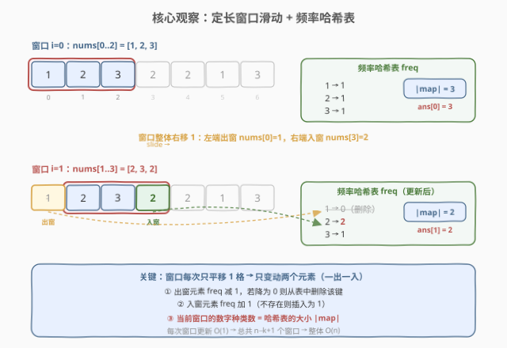
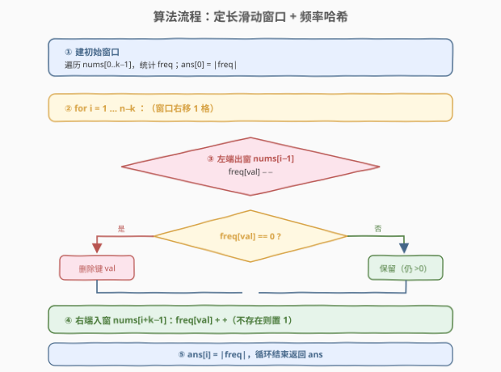

# LeetCode 每个子数组的数字种类数 题解

## 1. 题目概述

- **标题 / 题号**：每个子数组的数字种类数（#1852，medium）
- **链接**：https://leetcode.cn/problems/distinct-numbers-in-each-subarray/
- **难度**：中等
- **标签**：数组、哈希表、滑动窗口

**题意**：给定一个整数数组 `nums` 和一个整数 `k`，求**每个长度为 `k` 的子数组**中**不同数字的个数**。

返回一个长度为 $n - k + 1$ 的数组 `ans`，其中 `ans[i]` 表示子数组 `nums[i .. i+k-1]` 中不同数字的个数。

> 💡 **核心矛盾**：要在所有 $n - k + 1$ 个定长子窗口上统计「种类数」。若对每个窗口独立重新统计，总开销 $O(n \cdot k)$ 不可接受。关键在于**相邻窗口只差两个元素**——前一个窗口左端出一个元素、右端进一个元素，频率表可增量维护。

**示例 1**：

```text
输入：nums = [1,2,3,2,2,1,3], k = 3
输出：[3,2,2,2,3]
解释：
- 子数组 [1,2,3] 中不同数字有 {1,2,3} → 3 种
- 子数组 [2,3,2] 中不同数字有 {2,3}   → 2 种
- 子数组 [3,2,2] 中不同数字有 {2,3}   → 2 种
- 子数组 [2,2,1] 中不同数字有 {1,2}   → 2 种
- 子数组 [2,1,3] 中不同数字有 {1,2,3} → 3 种
```

**约束**：

- $1 \le \text{nums.length} \le 10^5$
- $1 \le \text{nums}[i] \le 10^5$
- $1 \le k \le \text{nums.length}$

## 2. 解题思路

### 2.1 暴力思路

最朴素的做法：对每个起点 $i \in [0, n-k]$，把子数组 `nums[i..i+k-1]` 装进一个集合，取集合大小作为 `ans[i]`。每个窗口 $O(k)$，总共 $O(n \cdot k)$，当 $n, k$ 同阶达 $10^{10}$，不可行。

能否用前缀集合？集合不支持高效「做差」——前缀 $[0..i+k-1]$ 与 $[0..i-1]$ 的差并非简单运算可得的窗口种类数。这提示需要换一个**沿窗口滚动**的视角。

### 2.2 核心观察：定长滑动窗口 + 频率哈希表



关键洞察分三层：

**第一层：相邻窗口只差两个元素。** 定长窗口从 $i$ 滑到 $i+1$ 时，左端 `nums[i]` 离开、右端 `nums[i+k]` 进入，中间 $k-1$ 个元素完全不变。因此不需要重新统计整个窗口，只需对频率表做两次 $O(1)$ 增量更新。

**第二层：用频率哈希表维护「种类数」。** 维护一个哈希表 `freq`，键为元素值、值为该元素在当前窗口内的出现次数。**当前窗口的种类数就是 `freq` 的大小** `|freq|`——这把「种类数」直接绑定到表的大小，无需额外计数器。

**第三层：出窗元素的删除时机。** 当左端元素 `nums[i]` 离开窗口时，先 `freq[val] -= 1`；**若计数降为 0，必须把该键从表中删除**（而不是保留一个值为 0 的条目）。否则 `|freq|` 会偏大，种类数出错。入窗元素则简单：`freq[val] += 1`（不存在时插入为 1）。

> 💡 **为何强调「降为 0 才删」？** 因为窗口内可能有重复元素（如 `[2,3,2]` 中 `2` 出现两次）。只出一个 `2` 时计数从 2 降到 1，元素仍在窗口里，不能删键。只有计数归零才代表该元素彻底离开窗口。这是本题最常见的 off-by-one 陷阱。

### 2.3 算法流程图



流程核心：

1. **建初始窗口**：遍历 `nums[0..k-1]`，填入 `freq`；`ans[0] = |freq|`。
2. **循环滑动** $i = 1 \dots n-k$：
   - **左端出窗** `nums[i-1]`：`freq[val] -= 1`；若 `freq[val] == 0`，删除键 `val`。
   - **右端入窗** `nums[i+k-1]`：`freq[val] += 1`（不存在则置 1）。
   - **记录答案**：`ans[i] = |freq|`。
3. 返回 `ans`。

> ⚠️ **边界**：当 `k == n` 时只有一个窗口，循环不执行，直接返回 `[|freq|]`；当 `k == 1` 时每个窗口就是单个元素，`ans` 全 1——算法自然适配，无需特判。

### 2.4 示例演算

![示例演算：nums = [1,2,3,2,2,1,3], k = 3](../images/1852_example_walkthrough.svg)

以 `nums = [1, 2, 3, 2, 2, 1, 3]`, `k = 3` 为例，共 $7 - 3 + 1 = 5$ 个窗口：

| 步骤 | i | 窗口 | freq 更新 | freq 表 | \|freq\| | ans[i] |
|------|---|------|-----------|---------|---------|--------|
| 初始 | 0 | [1,2,3] | 建表 | {1:1, 2:1, 3:1} | 3 | 3 |
| 滑动 | 1 | [2,3,2] | 删 1（1→0 删键），加 2（1→2） | {2:2, 3:1} | 2 | 2 |
| 滑动 | 2 | [3,2,2] | 删 2（2→1），加 2（1→2） | {2:2, 3:1} | 2 | 2 |
| 滑动 | 3 | [2,2,1] | 删 3（1→0 删键），加 1（插入 1） | {1:1, 2:2} | 2 | 2 |
| 滑动 | 4 | [2,1,3] | 删 2（2→1），加 3（插入 1） | {1:1, 2:1, 3:1} | 3 | 3 |

最终 `ans = [3, 2, 2, 2, 3]` ✓

> 💡 **对照步骤 1 与步骤 2**：步骤 1 删 `1` 时计数 1→0，键被删除（种类数 3→2）；步骤 2 删 `2` 时计数 2→1，键保留（种类数仍为 2）。这正是「降为 0 才删」规则的两次典型应用——一个触发删除、一个不触发。

## 3. 参考代码

### C++

```cpp
class Solution {
  public:
    vector<int> distinctNumbers(vector<int>& nums, int k) {
        int n = nums.size();
        vector<int> ans(n - k + 1);
        unordered_map<int, int> freq;
        for (int i = 0; i < k; ++i) {
            ++freq[nums[i]];
        }
        ans[0] = freq.size();
        for (int i = 1; i + k <= n; ++i) {
            // 左端出窗 nums[i-1]
            int out = nums[i - 1];
            if (--freq[out] == 0) {
                freq.erase(out);
            }
            // 右端入窗 nums[i+k-1]
            ++freq[nums[i + k - 1]];
            ans[i] = freq.size();
        }
        return ans;
    }
};
```

### Python

```python
class Solution:
    def distinctNumbers(self, nums: List[int], k: int) -> List[int]:
        n = len(nums)
        ans = [0] * (n - k + 1)
        freq = {}
        for x in nums[:k]:
            freq[x] = freq.get(x, 0) + 1
        ans[0] = len(freq)
        for i in range(1, n - k + 1):
            # 左端出窗 nums[i-1]
            out = nums[i - 1]
            freq[out] -= 1
            if freq[out] == 0:
                del freq[out]
            # 右端入窗 nums[i+k-1]
            nxt = nums[i + k - 1]
            freq[nxt] = freq.get(nxt, 0) + 1
            ans[i] = len(freq)
        return ans
```

> ⚠️ **实现细节**：C++ 中 `--freq[out]` 返回自减后的值，等于 0 即可 `erase`；若用 `freq[out]--`（后置）则返回旧值，判断会错位。Python 中先减再判 `== 0` 再 `del`，顺序不能乱——删早了会少算、删晚了会多算。

## 4. 复杂度分析

| 维度 | 复杂度 | 说明 |
|------|--------|------|
| 时间复杂度 | $O(n)$ | 初始窗口 $O(k)$ + 滑动 $n-k$ 步每步 $O(1)$ 增删，合计 $O(n)$；哈希操作均摊 $O(1)$ |
| 空间复杂度 | $O(k)$ | `freq` 表至多存放窗口内 $k$ 个不同元素；输出数组 $O(n)$ 不计入额外空间 |

> 💡 **均摊分析**：`freq` 的插入/删除/查询均为均摊 $O(1)$（哈希冲突最坏 $O(k)$ 但极少）。整段滑动过程中每个元素恰好入窗一次、出窗一次，总哈希操作 $2n$ 次，故整体严格 $O(n)$。

## 5. 扩展：值域计数数组优化

当元素值域较小（如 $\text{nums}[i] \le 10^5$）时，可用**定长计数数组**替代哈希表，消除哈希开销并降低常数：

```cpp
vector<int> distinctNumbers(vector<int>& nums, int k) {
    int n = nums.size();
    const int V = 100001;
    vector<int> cnt(V, 0);
    int distinct = 0;
    auto add = [&](int x) { if (cnt[x]++ == 0) ++distinct; };
    auto del = [&](int x) { if (cnt[x]-- == 1) --distinct; };

    vector<int> ans(n - k + 1);
    for (int i = 0; i < k; ++i) add(nums[i]);
    ans[0] = distinct;
    for (int i = 1; i + k <= n; ++i) {
        del(nums[i - 1]);
        add(nums[i + k - 1]);
        ans[i] = distinct;
    }
    return ans;
}
```

| 维度 | 哈希表方案 | 计数数组方案 |
|------|-----------|--------------|
| 适用条件 | 任意值域 | 值域较小且已知 |
| 单次操作 | 均摊 $O(1)$（有哈希开销） | 严格 $O(1)$（数组下标访问） |
| 空间 | $O(k)$（随窗口变化） | $O(V)$（固定，与 $k$ 无关） |
| 种类数获取 | `freq.size()` | 维护独立计数器 `distinct` |

> 💡 **为何计数数组要用独立 `distinct` 计数器？** 因为数组大小固定为 $V$，无法像哈希表那样用「表大小」直接得到种类数——值为 0 的桶仍占位。所以用一个 `distinct` 变量：入窗时 `cnt[x]` 从 0→1 则 `distinct++`，出窗时 `cnt[x]` 从 1→0 则 `distinct--`。本质是把哈希表的「删键」换成「桶归零 + 计数器联动」。

## 6. 面试要点

**Q1：为什么相邻窗口可以 O(1) 更新？**

> 定长窗口从 $i$ 滑到 $i+1$ 时，中间 $k-1$ 个元素完全不变，只有左端 `nums[i]` 出窗、右端 `nums[i+k]` 入窗。对频率表做一次减一次加即可，每次 $O(1)$，故滑动总开销 $O(n)$。

**Q2：为什么出窗元素计数降为 0 时必须删键？**

> 种类数靠 `freq.size()` 反映。若保留值为 0 的条目，表大小会虚高——例如窗口 `[2,3,2]` 删去一个 `2` 后 `2` 仍在窗口（计数 1），但如果之前误删了 `1` 的键没删干净，`size` 就错了。规则是「计数归零⇒元素彻底离开⇒删键」，与「种类数 = 表大小」的语义保持一致。

**Q3：哈希表 vs 计数数组怎么选？**

> 看值域。值域小（如 $\le 10^5$）且确定，用计数数组 + 独立 `distinct` 计数器，常数小、无哈希冲突；值域大或未知（如 $\le 10^9$），用哈希表，空间随窗口实际种类数变化，$O(k)$ 更省。面试中先给哈希表通用解，再提计数数组优化，体现对常数因子的关注。

**Q4：k == n 或 k == 1 的边界如何处理？**

> 无需特判。$k = n$ 时只有 1 个窗口，循环不执行，返回 `[|freq|]`；$k = 1$ 时每窗口单元素，`ans` 全 1，初始窗口建表后每步「出的就是入的」，`freq` 大小始终 1。算法天然覆盖。

**Q5：本题与「无重复字符的最长子串」有何区别？**

> 两者都用滑动窗口 + 频率表，但方向相反：本题是**定长窗口求种类数**（窗口大小固定 $k$，问窗口内有多少种）；3 题是**变长窗口求最长**（种类数上限固定，问窗口能扩到多长）。前者窗口边界由 $k$ 决定、答案由 `|freq|` 决定；后者答案由窗口长度决定、`|freq|` 作为收缩条件。

## 同类练习题

| # | 题目 | 与本题的关联 |
|---|------|-------------|
| 239 | [滑动窗口最大值](https://leetcode.cn/problems/sliding-window-maximum/)（[站内题解](../0201-0300/239_滑动窗口最大值.md)） | 定长滑窗招牌题，用单调队列求窗口最值，对照本题窗口内「聚合」的不同实现（最值 vs 种类数） |
| 1248 | [统计「优美子数组」](https://leetcode.cn/problems/count-number-of-nice-subarrays/)（[站内题解](../1201-1300/1248_统计优美子数组.md)） | 定长/变长窗口计数，窗口内维护满足条件的元素个数，与本题「窗口内统计」范式同源 |
| 1456 | [定长子串中元音的最大数目](https://leetcode.cn/problems/maximum-number-of-vowels-in-a-substring-of-given-length/) | 定长滑窗 + 计数，窗口内维护元音个数，本题的「字符版」简化变体 |
| 3 | [无重复字符的最长子串](https://leetcode.cn/problems/longest-substring-without-repeating-characters/)（[站内题解](../0001-0100/3_无重复字符的最长子串.md)） | 变长滑窗 + 频率表收缩左端，对照「定长求种类数」与「变长求最长」的对偶关系 |
| 713 | [乘积小于 K 的子数组](https://leetcode.cn/problems/subarray-product-less-than-k/)（[站内题解](../0701-0800/713_乘积小于K的子数组.md)） | 滑窗 + 滚动聚合（乘积），同为「窗口内维护一个聚合量并滚动更新」的范式 |
