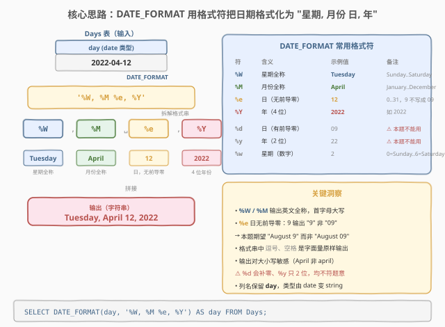
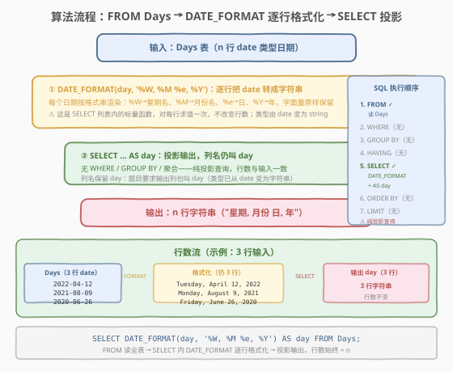
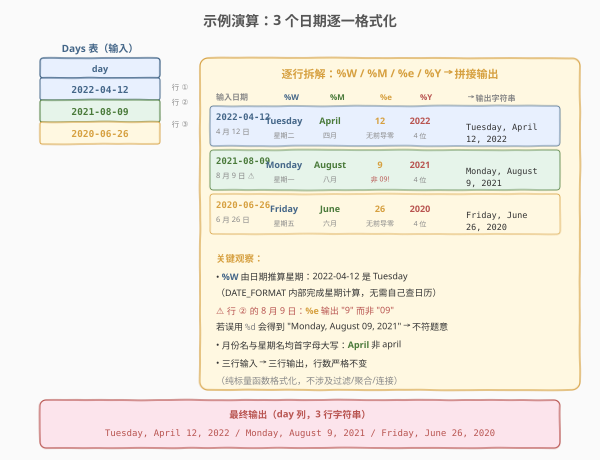

# 转换日期格式

- **题目名称**：转换日期格式
- **链接**：[1853. 转换日期格式 🔒](https://leetcode.cn/problems/convert-date-format/)
- **难度**：简单
- **标签**：数据库、SQL、MySQL、`DATE_FORMAT`、日期函数、字符串格式化

## 1. 题目概述

给定一张 `Days` 表，表中只有一列 `day`（`date` 类型）。请编写 SQL 查询，把每个日期转化为 `"day_name, month_name day, year"` 格式的字符串——即「**星期全称, 月份全称 日(无前导零), 4 位年份**」。返回结果**不计顺序**，输出对大小写敏感。

**表结构**：

```text
Table: Days
+-------------+------+
| Column Name | Type |
+-------------+------+
| day         | date |  ← 主键
+-------------+------+
day 是这个表的主键（具有唯一值）。
```

**输出列**：`day`（字符串类型，列名保持 `day`）。

**示例 1**：

```text
输入：
Days 表:
+------------+
| day        |
+------------+
| 2022-04-12 |
| 2021-08-09 |
| 2020-06-26 |
+------------+

输出：
+-------------------------+
| day                     |
+-------------------------+
| Tuesday, April 12, 2022 |
| Monday, August 9, 2021  |
| Friday, June 26, 2020   |
+-------------------------+
解释：请注意，输出对大小写敏感。
```

**约束条件**：

- `day` 列为 `date` 类型，且是主键（行唯一无重复）。
- 输出列名仍为 `day`，但值由 `date` 变为**字符串**。
- 结果可按任意顺序返回。

> 💡 **关键直觉**：这是 SQL **"日期格式化"入门招牌题**——核心就一句 `DATE_FORMAT(day, '%W, %M %e, %Y')`。看似平淡，考点却在四个格式符的精确选择：① `%W` 取星期全称；② `%M` 取月份全称；③ `%e` 取日（**无前导零**，这是最易踩的坑）；④ `%Y` 取 4 位年份。把「日期 → 指定格式字符串」这一最基础的日期渲染需求，浓缩成一个函数调用。

---

## 2. 解题思路

### 2.1 暴力思路：拆分日期后手工拼接

最直觉的过程式思维是：从 `date` 值中分别取出年、月、日，再分别查出对应的星期名、月份名，最后用逗号和空格拼成目标字符串。

```text
result = []
for row in Days:
    d = row.day                       # date 类型，如 2022-04-12
    weekday = lookup_weekday(d)       # 查日历得 "Tuesday"
    month   = lookup_monthname(d)     # 得 "April"
    daynum  = day_of(d)               # 得 12（不补零）
    year    = year_of(d)              # 得 2022
    result.append(f"{weekday}, {month} {daynum}, {year}")
return result
```

逻辑正确，但 SQL 里根本不必「手工拆 + 查日历」——MySQL 的 `DATE_FORMAT(date, fmt)` 函数正是为此而生：传入一个 `date` 和一个**格式串**，它内部完成星期推算、月份名映射、按格式拼接，一步到位输出字符串。

> ⚠️ **过程式思维的陷阱**：有人会担心「星期几需要自己根据年月日算」——不需要。`DATE_FORMAT` 内部封装了公历星期算法（Zeller 类公式），给一个 `date` 它直接返回 `Tuesday`/`Monday`/`Friday`。把算法题里的「手算星期」思维带到 SQL 里是过度设计。

### 2.2 核心观察：DATE_FORMAT + 四个格式符



题目要求的目标格式 `"day_name, month_name day, year"`，与 MySQL `DATE_FORMAT` 的格式符一一对应：

| 目标片段 | 格式符 | 含义 | 示例值（2022-04-12） |
|----------|--------|------|----------------------|
| 星期全称 | `%W` | Weekday name 全称 | `Tuesday` |
| 月份全称 | `%M` | Month name 全称 | `April` |
| 日（无前导零） | `%e` | Day of month，不补零 | `12` |
| 4 位年份 | `%Y` | Year，4 位 | `2022` |

格式串中的**逗号、空格**是**字面量**，`DATE_FORMAT` 会原样输出。把四符按目标顺序拼成 `'%W, %M %e, %Y'` 即可：

$$\text{输出} = \text{DATE\_FORMAT}(\text{day},\ \text{'\%W, \%M \%e, \%Y'})$$

> 💡 **`%e` vs `%d` 的关键区别**：`%e` 输出日**不补前导零**（9 日 → `"9"`），`%d` **补前导零**（9 日 → `"09"`）。本题示例中 `2021-08-09` 期望输出 `Monday, August 9, 2021`（"9" 而非 "09"），故**必须用 `%e`**。这是本题最易踩的坑——错用 `%d` 会得到 `"Monday, August 09, 2021"`，不符题意。

> ⚠️ **大小写敏感**：`%W`/`%M` 输出的英文全称**首字母大写**（`Tuesday`、`April`），与示例一致。切勿与 `%w`（星期数字 0-6）、`%m`（月份数字 01-12）混淆——MySQL 格式符**大小写不同含义迥异**。

### 2.3 算法流程图



**逻辑执行步骤**：

| 步骤 | 子句 | 作用 |
|------|------|------|
| ① | `FROM Days` | 读取全部日期行（n 行） |
| ② | `SELECT DATE_FORMAT(day, '%W, %M %e, %Y')` | 对每行的 `day` 调用格式化函数，渲染成目标字符串 |
| ③ | `AS day` | 投影输出，列名保持 `day`（类型由 date 变 string） |

> 💡 **SQL 子句执行顺序**：`FROM` → `WHERE`（本题无）→ `GROUP BY`（无）→ `HAVING`（无）→ `SELECT`（含 `DATE_FORMAT`）→ `ORDER BY`（无）→ `LIMIT`（无）。本题是**纯投影查询**——`DATE_FORMAT` 是 `SELECT` 列表内的**标量函数**，对每行求值一次，**不改变行数**，不涉及过滤/聚合/连接。

### 2.4 示例演算

以示例 1 的三个日期为例，观察「逐行格式化」的映射过程：



**逐行拆解**：

| 输入日期 | %W（星期） | %M（月份） | %e（日） | %Y（年） | → 输出字符串 |
|----------|-----------|-----------|---------|---------|--------------|
| 2022-04-12 | Tuesday | April | 12 | 2022 | `Tuesday, April 12, 2022` |
| 2021-08-09 | Monday | August | **9**（非 09） | 2021 | `Monday, August 9, 2021` |
| 2020-06-26 | Friday | June | 26 | 2020 | `Friday, June 26, 2020` |

> 💡 **行 ② 是本题精髓**：`2021-08-09` 的日期是 9 号。`%e` 输出 `"9"`（无前导零），目标字符串为 `Monday, August 9, 2021`。若误用 `%d`，会得到 `"Monday, August 09, 2021"`——多了个前导零，与示例不符。这个 9 号日期正是题目专门用来「钓出 `%e`/`%d` 误用」的测试用例。

> 💡 **星期的自动推算**：`2022-04-12` 是星期几？`DATE_FORMAT` 内部完成公历星期推算，返回 `Tuesday`——你无需自己实现 Zeller 公式或查日历。这正是用数据库内置日期函数而非手写算法的价值。

---

## 3. 参考代码

### SQL（解法 A：DATE_FORMAT，推荐）

```sql
SELECT DATE_FORMAT(day, '%W, %M %e, %Y') AS day
FROM Days;
```

> 💡 **写法要点**：
> - `DATE_FORMAT(day, fmt)`：MySQL 内置日期格式化函数，第一个参数是 `date` 值，第二个是格式串。
> - `'%W, %M %e, %Y'`：四个格式符 + 字面量逗号/空格，按目标顺序拼接。
> - `AS day`：输出列名保持 `day`（题目要求），但值的类型已从 `date` 变为**字符串**。
> - ✓ **最推荐**：一行函数调用完成全部渲染，简洁且语义清晰，是 MySQL 日期格式化的标准写法。

### SQL（解法 B：DAYNAME / MONTHNAME / DAY / YEAR + CONCAT）

```sql
SELECT
    CONCAT(
        DAYNAME(day), ', ',
        MONTHNAME(day), ' ',
        DAY(day), ', ',
        YEAR(day)
    ) AS day
FROM Days;
```

> 💡 **写法要点**：用四个**独立的日期分量函数**分别取出星期名、月份名、日、年，再用 `CONCAT` 拼接。
> - `DAYNAME(day)` → `Tuesday`（等价于 `DATE_FORMAT` 的 `%W`）
> - `MONTHNAME(day)` → `April`（等价于 `%M`）
> - `DAY(day)` → `12`（整数，`CONCAT` 自动转字符串，**天然无前导零**，等价于 `%e`）
> - `YEAR(day)` → `2022`（等价于 `%Y`）
>
> **与解法 A 的对比**：逻辑等价，结果相同。优势在于**每个分量独立可读**——面试口述思路时「分别取星期、月份、日、年再拼接」更直观；劣势是代码更长，且 `CONCAT` 需手动管理分隔符（逗号、空格），易漏易多。`DAY()` 返回整数再由 `CONCAT` 隐式转字符串，天然不带前导零，避开了 `%e`/`%d` 的选择困扰——这是解法 B 的一个意外优点。

### Python（pandas）

```python
import pandas as pd

def convert_date_format(days: pd.DataFrame) -> pd.DataFrame:
    dt = pd.to_datetime(days['day'])
    days['day'] = (
        dt.dt.day_name() + ', ' +
        dt.dt.month_name() + ' ' +
        dt.dt.day.astype(str) + ', ' +
        dt.dt.year.astype(str)
    )
    return days
```

> 💡 **pandas 对照**：
> - `pd.to_datetime(days['day'])`——把列转为 `datetime64` 类型，对应 SQL 的 `date` 类型。
> - `dt.dt.day_name()`——对应 `DAYNAME(day)` / `%W`，返回全称星期名（`Tuesday`）。
> - `dt.dt.month_name()`——对应 `MONTHNAME(day)` / `%M`，返回全称月份名（`April`）。
> - `dt.dt.day.astype(str)`——对应 `DAY(day)` / `%e`，整数日转字符串（`12`、`9`），**天然无前导零**。
> - `dt.dt.year.astype(str)`——对应 `YEAR(day)` / `%Y`，4 位年份转字符串。
> - 字符串拼接用 `+`——对应 SQL 的 `CONCAT`。
>
> ⚠️ **为何不用 `dt.dt.strftime('%A, %B %-d, %Y')`？** pandas 的 `strftime` 沿用 Python 标准库格式符（`%A`=星期、`%B`=月份），与 MySQL 的 `%W`/`%M` **不同**。且「无前导零的日」在 Python 中是 `%-d`（Linux）或 `%#d`（Windows），**平台相关**，LeetCode 虽是 Linux 可用 `%-d`，但为稳妥起见这里用 `day.astype(str)` 显式取整数日，跨平台一致。解法 B 用分量函数拼接正是为了规避此格式符差异，pandas 版同理。

---

## 4. 复杂度分析

| 维度 | 复杂度 | 说明 |
|------|--------|------|
| **时间** | $O(n)$ | 全表扫描一次，每行调用一次 `DATE_FORMAT`（内部 $O(1)$ 公历星期推算），合计 $O(n)$ |
| **空间** | $O(n)$ | 输出 n 行字符串，每行长度固定（约 20-25 字符）；无额外中间存储 |
| **结果行数** | $n$ | 纯投影查询，行数严格等于输入行数，不过滤、不聚合 |

> ⚠️ `DATE_FORMAT` 是 MySQL 内置的标量函数，对每行求值一次，复杂度 $O(1)$。整体 $O(n)$ 来自全表扫描。若 `day` 列有索引，本题也无需利用索引——因为没有过滤/排序条件，必须读全部行，索引不能减少扫描量。面试中说明「全表扫描 $O(n)$，`DATE_FORMAT` 逐行 $O(1)$」即可。

---

## 5. 扩展：MySQL 日期格式符速查与陷阱

### 5.1 DATE_FORMAT 常用格式符

| 格式符 | 含义 | 示例（2022-04-12） | 备注 |
|--------|------|--------------------|------|
| `%W` | 星期全称 | `Tuesday` | Sunday..Saturday |
| `%M` | 月份全称 | `April` | January..December |
| `%e` | 日（无前导零） | `12` | 0..31，9 输出 `"9"` |
| `%Y` | 年（4 位） | `2022` | 如 2022 |
| `%d` | 日（有前导零） | `12` | 00..31，9 输出 `"09"` |
| `%y` | 年（2 位） | `22` | 如 22 |
| `%w` | 星期（数字） | `2` | 0=Sunday..6=Saturday |
| `%a` | 星期缩写 | `Tue` | Sun..Sat |
| `%b` | 月份缩写 | `Apr` | Jan..Dec |
| `%D` | 日（带英文序数后缀） | `12th` | 1st/2nd/3rd/4th.. |
| `%j` | 年内第几天 | `102` | 001..366 |
| `%H` / `%i` / `%s` | 时 / 分 / 秒 | `00` / `00` / `00` | 本题 date 无时间部分 |

> 💡 **大小写陷阱速记**：
> - **大写** `%W`/`%M`/`%Y` → **名称/全称**（星期名、月份名、4 位年）。
> - **小写** `%w`/`%m`/`%y` → **数字/短**（星期数字、月份数字、2 位年）。
> - `%e` 与 `%d` 是例外——都表示「日」，区别仅在前导零：`%e` 不补零、`%d` 补零。记法：`e` = "epoch 风格裸数字"、`d` = "display 补齐两位"。

### 5.2 三个常见错误写法

| 错误写法 | 输出（2021-08-09） | 问题 |
|----------|---------------------|------|
| `'%W, %M %d, %Y'` | `Monday, August 09, 2021` | 用了 `%d` 补前导零，9 变 "09" |
| `'%W, %M %e, %y'` | `Monday, August 9, 21` | 用了 `%y` 只输出 2 位年份 |
| `'%w, %M %e, %Y'` | `2, April 12, 2022` | 用了 `%w` 输出星期数字而非名称 |

> ⚠️ **最易踩的是第一个**：`%d` 与 `%e` 仅一字母之差，输出差异仅在「日 ≤ 9」时显现（10 日以上两者输出相同）。题目特意用 `2021-08-09`（9 号）作为测试用例来捕获这个错误——若你的查询对 12 号日期输出正确，对 9 号却多一个零，说明误用了 `%d`。

### 5.3 替代方案：DAYNAME 系列函数 vs DATE_FORMAT

| 方案 | 写法 | 优势 | 劣势 |
|------|------|------|------|
| `DATE_FORMAT` | `DATE_FORMAT(day, '%W, %M %e, %Y')` | 一行完成，格式串可读 | 需熟记格式符 |
| 分量函数 + `CONCAT` | `CONCAT(DAYNAME(day), ', ', MONTHNAME(day), ' ', DAY(day), ', ', YEAR(day))` | 每个分量独立可读；`DAY()` 天然无前导零 | 代码长，需手动管分隔符 |

> 💡 **何时选哪个？** 格式固定且简单（如本题）→ `DATE_FORMAT` 更简洁；需对某个分量做条件处理（如「英文环境输出 `August`、中文环境输出 `8 月`」）→ 分量函数更灵活，可对 `MONTHNAME` 结果再 `CASE WHEN` 替换。面试中先答 `DATE_FORMAT`（标准写法），再补一句「也可用 `DAYNAME`/`MONTHNAME`/`DAY`/`YEAR` + `CONCAT`，避免 `%e`/`%d` 的前导零选择困扰」即可。

### 5.4 若题目要求其它格式

| 目标格式 | 格式串 | 示例输出 |
|----------|--------|----------|
| `YYYY-MM-DD`（ISO 标准） | `'%Y-%m-%d'` | `2022-04-12` |
| `Mon DD, YYYY`（月份缩写） | `'%b %d, %Y'` | `Apr 12, 2022` |
| `DDth Mon YYYY`（带序数后缀） | `'%D %b %Y'` | `12th Apr 2022` |
| `YYYYMMDD`（紧凑数字） | `'%Y%m%d'` | `20220412` |

> 💡 这些变体展示了 `DATE_FORMAT` 的通用性——同一函数、不同格式串即可渲染任意日期字符串。掌握 `%W`/`%M`/`%e`/`%Y`/`%d`/`%y`/`%b`/`%D` 这几个高频符，绝大多数日期格式化需求都能覆盖。

---

## 6. 面试要点

1. **为什么用 `%e` 而不是 `%d`？**

   > `%e` 输出日**不补前导零**（9 日 → `"9"`），`%d` **补前导零**（9 日 → `"09"`）。本题示例 `2021-08-09` 期望输出 `Monday, August 9, 2021`（"9" 而非 "09"），故必须用 `%e`。两者仅在日 ≤ 9 时有差异——10 日以上输出相同，因此 12 号日期能掩盖 `%d` 的错误，9 号日期才会暴露。题目用 9 号日期作测试正是为此。

2. **`%W`/`%M` 和 `%w`/`%m` 有什么区别？**

   > MySQL 格式符**大小写含义不同**：大写 `%W`/`%M` 输出**名称全称**（`Tuesday`/`April`），小写 `%w`/`%m` 输出**数字**（星期 0-6 / 月份 01-12）。记法：大写 = 名称、小写 = 数字。误用 `%w` 会得到 `2, April 12, 2022`（星期变成数字 2），与目标 `"day_name"` 不符。

3. **`DATE_FORMAT` 是在哪个 SQL 子句阶段执行的？为什么行数不变？**

   > `DATE_FORMAT` 写在 `SELECT` 列表里，属于**投影阶段**（SQL 执行顺序的最后几步）。它是**标量函数**——对每一行求一次值，输入一行输出一个字符串，**不改变行数**。本题没有 `WHERE`/`GROUP BY`/`JOIN`，所以 n 行输入 → n 行输出，行数严格守恒。这与聚合函数（`SUM`/`COUNT` 会折叠行）和过滤（`WHERE` 会减少行）形成对照。

4. **输出列名为什么还是 `day`？类型变了吗？**

   > 用 `AS day` 显式指定输出列名仍为 `day`（题目要求）。但值的**类型已从 `date` 变为字符串**——`DATE_FORMAT` 的返回值是 `VARCHAR`。这是「列名相同、类型不同」的合法场景：SQL 查询结果的列类型由 `SELECT` 表达式决定，不受原表列类型约束。

5. **不用 `DATE_FORMAT`，如何实现？**

   > 用分量函数 + `CONCAT`：`CONCAT(DAYNAME(day), ', ', MONTHNAME(day), ' ', DAY(day), ', ', YEAR(day))`。其中 `DAYNAME`/`MONTHNAME` 返回名称字符串，`DAY`/`YEAR` 返回整数（`CONCAT` 隐式转字符串）。`DAY()` 返回整数天然无前导零，避开了 `%e`/`%d` 的选择——这是分量函数方案的一个意外优点。两种方案结果等价，`DATE_FORMAT` 更简洁，分量函数更直观。

> 💡 **一句话总结**：1853 是 SQL **"日期格式化"入门招牌题**——核心就一句 `SELECT DATE_FORMAT(day, '%W, %M %e, %Y') AS day FROM Days`。三大要点：**① `%W`/`%M` 取星期、月份全称（大写=名称）；② `%e` 取日不补零（9 输出 "9" 非 "09"，区别于 `%d`）；③ 纯投影查询，行数不变**。掌握 `%W`/`%M`/`%e`/`%Y` 四个高频符，所有日期格式化题都能覆盖。

---

## 7. 同类练习题

- [1193. 每月交易 I](https://leetcode.cn/problems/monthly-transactions-i/)（[题解](../1101-1200/1193_每月交易I.md)）：`DATE_FORMAT(day, '%Y-%m')` 按月分组 + `SUM`/`COUNT` 聚合——巩固 `DATE_FORMAT` 的格式符用法，对照本题「格式化输出」与彼题「格式化分组键」两种用途
- [1174. 即时食物配送 II](https://leetcode.cn/problems/immediate-food-delivery-ii/)（[题解](../1101-1200/1174_即时食物配送II.md)）：`DATE_FORMAT` 截断日期到天 + 子查询取首单——巩固「日期格式化作为分组/比较键」的常见模式
- [1141. 查询近 30 天活跃用户数](https://leetcode.cn/problems/user-activity-for-the-past-30-days-i/)（[题解](../1101-1200/1141_查询近30天活跃用户数.md)）：`WHERE` 日期范围过滤 + `GROUP BY` + `COUNT(DISTINCT)`——在 1853 基础上叠加日期范围谓词与分组聚合
- [197. 上升的温度](https://leetcode.cn/problems/rising-temperature/)（[题解](../0101-0200/197_上升的温度.md)）：`DATEDIFF` 日期差计算 + `JOIN` 自连接——对照 1853 的「日期格式化」与彼题的「日期运算（求差）」两种日期函数范式
- [1543. 产品名称格式修复](https://leetcode.cn/problems/fix-product-name-format/)（[题解](../1501-1600/1543_产品名称格式修复.md)）：`TRIM`/`LOWER`/`UPPER` 字符串格式修复 + `DATE_FORMAT` 统一日期展示——同为「SQL 格式化」家族，对照字符串格式化与日期格式化
