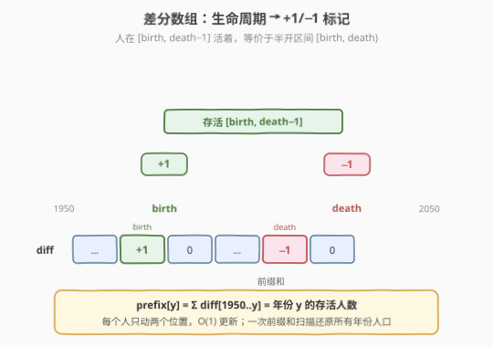
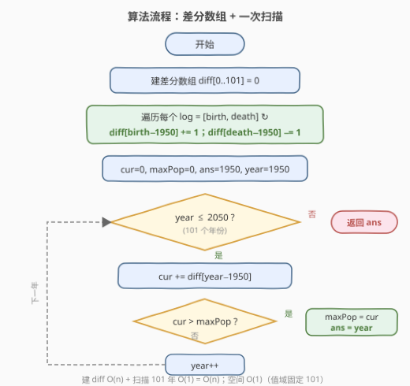

# LeetCode 人口最多的年份 题解

## 1. 题目概述

- **标题 / 题号**：人口最多的年份（#1854，easy）
- **链接**：https://leetcode.cn/problems/maximum-population-year/
- **难度**：简单
- **标签**：数组、差分数组、前缀和

**题意**：给你一个二维整数数组 `logs`，其中每个 `logs[i] = [birth_i, death_i]` 表示第 `i` 个人的出生和死亡年份。年份 `x` 的**人口**定义为这一年期间活着的人的数目。第 `i` 个人被计入年份 `x` 的人口需要满足：`x` 在闭区间 `[birth_i, death_i - 1]` 内。注意，**人不应当计入他们死亡当年的人口中**。返回**人口最多**且**最早**的年份。

**示例 1**：

```text
输入：logs = [[1993,1999],[2000,2010]]
输出：1993
解释：人口最多为 1，而 1993 是人口为 1 的最早年份。
```

**示例 2**：

```text
输入：logs = [[1950,1961],[1960,1971],[1970,1981]]
输出：1960
解释：人口最多为 2，分别出现在 1960 和 1970。其中最早年份是 1960。
```

**约束**：

- `1 <= logs.length <= 100`
- `1950 <= birth_i < death_i <= 2050`

> 💡 **审题关键**：每个人存活年份是**左闭右开**区间 `[birth, death)`——出生当年算活着，死亡当年不算。因此 `death_i` 那年人口要减 1。年份值域只有 `1950..2050` 共 101 年，这 是后续差分数组解法的前提。

## 2. 解题思路

### 2.1 暴力思路：逐年数人头

最直白的做法：对每个年份 `y` 从 `1950` 到 `2050`，遍历所有 `logs`，统计满足 `birth_i <= y < death_i` 的人数，取最大且最早的年份。

- **正确**：覆盖所有年份，不重不漏；
- **效率**：年份 101 个 × 人数最多 100 = 约 $10^4$ 次判定，$O(101 \cdot n)$，毫秒级 AC。

> ⚠️ 本题暴力已能 AC，但每多一个查询都要重数一遍。若把视角从"数每个年份有多少人"换成"每个人对哪些年份有贡献"，就能得到只需 $O(n)$ 预处理、$O(101)$ 还原的差分数组解法——它把"区间加 1"从 $O(\text{区间长度})$ 降到 $O(1)$。

### 2.2 核心观察：差分数组——把生命周期拆成 +1/−1 标记



每个人的存活区间 `[birth, death)` 在年份轴上是一段连续的"人口 +1"区间。如果对每个年份维护一个计数器，逐区间加 1 需要 $O(\text{区间长度})$。**差分数组**的技巧是：只动区间的**两个端点**——

- 在 `birth` 处 `+1`（这一年新增一个人）
- 在 `death` 处 `−1`（这一年少了一个人，因为死亡当年不计入）

记 `diff[y]` 为年份 `y` 相对上一年的**人口变化量**。所有区间写完后，对 `diff` 做一次**前缀和**即可还原每个年份的实际人口：

$$\text{pop}[y] = \sum_{k=1950}^{y} \text{diff}[k]$$

> 💡 **为什么是 `death` 而不是 `death−1`？** 因为存活区间是左闭右开 `[birth, death)`：`death−1` 是最后一年活着（变化量仍在生效），`death` 这年才退出（变化量结束）。所以 `−1` 标记打在 `death` 上，前缀和到 `death` 时自动减掉。这与 [1094. 拼车](../1001-1100/1094_拼车.md)、[1109. 航班预订统计](../1101-1200/1109_航班预订统计.md) 的"区间加 + 两端标记"完全同构。

### 2.3 算法流程图



两阶段：① 遍历 `logs` 建 `diff`（每人 $O(1)$）；② 从 `1950` 到 `2050` 累加前缀和，维护 `maxPop` 与 `ans`。注意更新条件用**严格大于** `cur > maxPop`——相等时不更新，自然保留**最早**的峰值年份。

### 2.4 示例演算

![示例演算：logs = [[1950,1961],[1960,1971],[1970,1981]]](../images/1854_example_walkthrough.svg)

以示例 2 `logs = [[1950,1961],[1960,1971],[1970,1981]]` 为例：

| 步骤 | 操作 | diff 变化 |
|------|------|-----------|
| P0 [1950,1961) | 出生+1 / 退出−1 | `diff[1950]+=1`, `diff[1961]−=1` |
| P1 [1960,1971) | 出生+1 / 退出−1 | `diff[1960]+=1`, `diff[1971]−=1` |
| P2 [1970,1981) | 出生+1 / 退出−1 | `diff[1970]+=1`, `diff[1981]−=1` |

做前缀和得到每年人口：

| 年份段 | 1950–1959 | 1960 | 1961–1969 | 1970 | 1971–1980 | 1981 |
|--------|-----------|------|-----------|------|-----------|------|
| 人口 | 1 | **2** | 1 | **2** | 1 | 0 |

峰值 `2` 出现在 `1960` 和 `1970`，取最早的 `1960` 即为答案。

> 💡 注意 `1960` 处人口从 1 跳到 2（P1 出生），而 `1961` 处人口从 2 跌回 1（P0 退出）。前缀和自动把"出生"和"退出"在同一年份叠加：若同年既有出生又有退出，`diff` 里 `+1` 与 `−1` 抵消，人口不变。

## 3. 参考代码

### C++

```cpp
class Solution {
  public:
    int maximumPopulation(vector<vector<int>>& logs) {
        int diff[102] = {0}; // 下标 0..101 对应年份 1950..2051
        for (auto& log : logs) {
            diff[log[0] - 1950] += 1; // birth 处 +1
            diff[log[1] - 1950] -= 1; // death 处 -1
        }
        int cur = 0, maxPop = 0, ans = 1950;
        for (int y = 0; y <= 100; ++y) { // 1950..2050 共 101 年
            cur += diff[y];
            if (cur > maxPop) { // 严格大于，平局保留更早年份
                maxPop = cur;
                ans = 1950 + y;
            }
        }
        return ans;
    }
};
```

### Python

```python
class Solution:
    def maximumPopulation(self, logs: List[List[int]]) -> int:
        diff = [0] * 102  # 下标 0..101 对应年份 1950..2051
        for birth, death in logs:
            diff[birth - 1950] += 1  # birth 处 +1
            diff[death - 1950] -= 1  # death 处 -1
        cur = max_pop = 0
        ans = 1950
        for y in range(101):  # 1950..2050 共 101 年
            cur += diff[y]
            if cur > max_pop:  # 严格大于，平局保留更早年份
                max_pop = cur
                ans = 1950 + y
        return ans
```

> ⚠️ **两个易错点**：① `−1` 打在 `death` 而非 `death−1`（存活是左闭右开区间）；② 更新条件用 `>` 而非 `>=`，这样遇到相同人口时不会覆盖已记录的更早年份，天然满足"最早"要求。

## 4. 复杂度分析

| 维度 | 复杂度 | 说明 |
|------|--------|------|
| 时间复杂度 | $O(n + 101)$ | 建 `diff` 遍历 $n$ 个 `log`，前缀和扫描 101 个年份 |
| 空间复杂度 | $O(1)$ | `diff` 大小固定为 102，与 $n$ 无关 |

> 💡 由于年份值域固定为 `1950..2050`（101 年），扫描部分是常数 $O(1)$，整体退化为 $O(n)$。即便 $n$ 很大也只线性遍历一次 `logs`。

## 5. 扩展：值域无界时的扫描线解法

差分数组依赖"年份值域有界且较小"这一前提。若题目改为年份范围很大（如 $10^9$ 量级），直接开数组不可行。此时用**扫描线（sorted events）**：

- 把每个 `[birth, death)` 拆成两个事件：`(birth, +1)`、`(death, −1)`。
- 按年份排序（同年份时 `−1` 排前，保证退出先于进入的"净效应"正确——本题不涉及重叠抵消顺序，但扫描线通用做法如此）。
- 顺序遍历事件，维护当前人口 `cur`，记录峰值与最早年份。

```cpp
int maximumPopulation(vector<vector<int>>& logs) {
    vector<pair<int,int>> events;
    for (auto& log : logs) {
        events.push_back({log[0], +1});
        events.push_back({log[1], -1});
    }
    sort(events.begin(), events.end()); // 按年份升序
    int cur = 0, maxPop = 0, ans = 0;
    for (auto& [y, d] : events) {
        cur += d;
        if (cur > maxPop) { maxPop = cur; ans = y; }
    }
    return ans;
}
```

时间 $O(n \log n)$（排序），空间 $O(n)$。当值域有界时退化为差分数组的 $O(n + V)$，是更优选择。

## 6. 面试要点

1. **为什么 `−1` 标记打在 `death` 而不是 `death−1`？**

   - 存活区间是左闭右开 `[birth, death)`：`death−1` 是最后一年活着，`death` 这年退出。前缀和到 `death` 时减 1，正好让 `death` 这年不计入该人。若错打在 `death−1`，则 `death−1` 这年就被错误地减掉了。

2. **差分数组相比暴力的优势？**

   - 暴力对每个年份遍历所有 `log`，$O(V \cdot n)$；差分数组建表 $O(n)$、还原 $O(V)$，把"区间加 1"从 $O(\text{长度})$ 降到 $O(1)$ 端点操作。多次查询时差分数组摊还更优（[1450](../1401-1500/1450_在既定时间做作业的学生人数.md) 正是此场景）。

3. **更新条件为什么用 `>` 而不是 `>=`？**

   - 题目要求"人口最多且最早"。用 `>` 时，遇到与当前峰值相等的人口不更新，自然保留更早记录的年份。若用 `>=` 则会覆盖成更晚的年份，违反"最早"要求。

4. **如果年份范围无界（如 $10^9$）怎么办？**

   - 退化为扫描线：拆事件 + 排序 + 顺序累加，$O(n \log n)$。差分数组是扫描线在"值域有界"时的特例——用数组代替排序，省去 $\log$ 因子。

5. **差分数组的本质是什么？**

   - 它是"区间加"的**逆运算**：前缀和把差分数组还原成原数组，差分把原数组的区间修改压缩成端点修改。本质是"把批量操作转化为增量标记"，与树状数组的 lazy 思想、线段树的区间懒标记同源，只是值域小到能直接用数组承载。

## 同类练习题

| # | 题目 | 与本题的关联 |
|---|------|-------------|
| 1094 | [拼车](https://leetcode.cn/problems/car-pooling/)（[题解](../1001-1100/1094_拼车.md)） | 差分数组判断每段容量是否超载，区间加 + 前缀和 + 阈值判定，与本题同骨架 |
| 1109 | [航班预订统计](https://leetcode.cn/problems/corporate-flight-bookings/)（[题解](../1101-1200/1109_航班预订统计.md)） | 差分数组还原每航班座位数，"区间加 + 前缀和"招牌题 |
| 1450 | [在既定时间做作业的学生人数](https://leetcode.cn/problems/number-of-students-doing-homework-at-a-given-time/)（[题解](../1401-1500/1450_在既定时间做作业的学生人数.md)） | 单次查询一次遍历即最优，多次查询用差分数组预处理，本题的直接前身 |
| 1526 | [形成目标数组的子数组最少增加次数](https://leetcode.cn/problems/minimum-number-of-increments-on-subarrays-to-form-a-target-array/)（[题解](../1501-1600/1526_形成目标数组的子数组最少增加次数.md)） | 差分思想求最少区间加次数，差分数组的进阶应用 |
