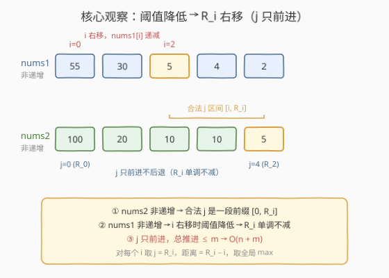
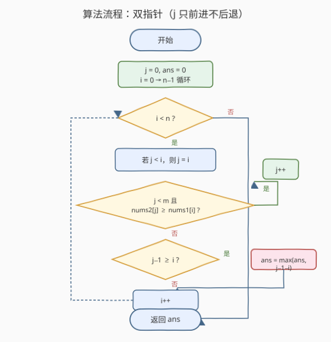

# LeetCode 下标对中的最大距离 题解

## 1. 题目概述

- **标题 / 题号**：下标对中的最大距离（#1855，medium）
- **链接**：https://leetcode.cn/problems/maximum-distance-between-a-pair-of-values/
- **难度**：中等
- **标签**：数组、双指针、二分查找

**题意**：给你两个**非递增**的整数数组 `nums1`​​​​​​ 和 `nums2`​​​​​​，数组下标均从 `0` 开始计数。

下标对 `(i, j)` 中 $0 \le i < \text{nums1.length}$ 且 $0 \le j < \text{nums2.length}$。如果该下标对同时满足 $i \le j$ 且 $\text{nums1}[i] \le \text{nums2}[j]$，则称之为**有效**下标对，该下标对的**距离**为 $j - i$。

返回所有有效下标对 $(i, j)$ 中的**最大距离**。如果不存在有效下标对，返回 `0`。

> 💡 **核心矛盾**：两个数组都非递增，且要求 $i \le j$ 与 $\text{nums1}[i] \le \text{nums2}[j]$ 双约束。要最大化 $j - i$，直觉上想让 $i$ 尽量小、$j$ 尽量大；但 $i$ 越小 $\text{nums1}[i]$ 越大（非递增），反而越难满足 $\text{nums1}[i] \le \text{nums2}[j]$。这正是「单调性 + 双指针」的典型信号——两个约束都随下标单调变化，可以用一个指针的「只前进不后退」摊还掉另一个的扫描成本。

**示例 1**：

```text
输入：nums1 = [55,30,5,4,2], nums2 = [100,20,10,10,5]
输出：2
解释：有效下标对是 (0,0), (2,2), (2,3), (2,4), (3,3), (3,4) 和 (4,4)。
      最大距离是 2，对应下标对 (2,4)。
```

**示例 2**：

```text
输入：nums1 = [2,2,2], nums2 = [10,10,1]
输出：1
解释：有效下标对是 (0,0), (0,1) 和 (1,1)。
      最大距离是 1，对应下标对 (0,1)。
```

**示例 3**：

```text
输入：nums1 = [30,29,19,5], nums2 = [25,25,25,25,25]
输出：2
解释：有效下标对是 (2,2), (2,3), (2,4), (3,3) 和 (3,4)。
      最大距离是 2，对应下标对 (2,4)。
```

**约束**：

- $1 \le \text{nums1.length} \le 10^5$
- $1 \le \text{nums2.length} \le 10^5$
- $1 \le \text{nums1}[i],\ \text{nums2}[j] \le 10^5$
- `nums1` 和 `nums2` 都是**非递增**数组

## 2. 解题思路

### 2.1 暴力思路

最朴素的想法是枚举所有下标对 $(i, j)$：双重循环 $i$ 从 $0$ 到 $n-1$，$j$ 从 $i$ 到 $m-1$，检查 $\text{nums1}[i] \le \text{nums2}[j]$ 是否成立，更新最大距离 $j - i$。时间复杂度 $O(n \cdot m)$，当 $n = m = 10^5$ 时高达 $10^{10}$，不可行。

能否用动态规划？状态 $(i, j)$ 的最优值依赖更小的子问题，但「最大化 $j - i$」缺乏最优子结构——合法对的距离是独立计算的，没有「累加」的递推关系。这说明问题结构不在 DP 而在**单调性**：两个数组都非递增，合法 $j$ 的边界随 $i$ 单调移动。

### 2.2 核心观察：双指针（利用非递增单调性）



关键洞察分三层：

**第一层：固定 $i$ 时，合法 $j$ 是一段前缀。** 由于 `nums2` 非递增，$\text{nums2}[j]$ 随 $j$ 增大而递减。条件 $\text{nums2}[j] \ge \text{nums1}[i]$ 一旦在某处不成立，其后所有 $j$ 也都不成立。因此合法 $j$ 构成 `nums2` 的一段前缀 $[0,\ R_i]$，其中 $R_i$ 是最右边的满足 $\text{nums2}[R_i] \ge \text{nums1}[i]$ 的下标。再叠加 $j \ge i$ 约束，对固定 $i$ 的合法 $j$ 区间为 $[i,\ R_i]$（若 $R_i \ge i$），最大距离贡献为 $R_i - i$。

**第二层：$R_i$ 随 $i$ 单调不减。** `nums1` 非递增意味着 $i$ 增大时 $\text{nums1}[i]$ 递减，门槛降低，能「撑住」的 `nums2` 元素更多，故 $R_i$ 只增不减：

$$R_0 \le R_1 \le \cdots \le R_{n-1}$$

这正是双指针的前提——用一个指针 $j$ 维护 $R_i$，它**只前进不后退**，均摊每个元素被访问一次。

**第三层：为什么取 $R_i$ 即该 $i$ 的最优？** 对固定 $i$，距离 $j - i$ 随 $j$ 增大而增大，故取最大合法 $j = R_i$ 即可。全局答案为 $\max_i (R_i - i)$，遍历一遍即可。

> 💡 **双指针成立的关键**：两个单调性叠加——`nums1` 非递增让 $i$ 右移时阈值降低（$R_i$ 不减），`nums2` 非递增让合法 $j$ 是前缀（$R_i$ 唯一确定）。二者共同保证 $j$ 单调前进，$O(n + m)$ 一遍扫描出解。

### 2.3 算法流程图



流程核心：初始化 `j = 0`、`ans = 0`。循环 $i$ 从 $0$ 到 $n-1$：

1. **保证 $j \ge i$**：若 `j < i` 则 `j = i`（因为约束 $i \le j$，$j$ 不能落后于 $i$）。
2. **推进 $j$**：只要 `j < m` 且 $\text{nums2}[j] \ge \text{nums1}[i]$，就 `j++`。循环结束时 `j` 指向第一个不满足的位置（或越界），故 $R_i = j - 1$。
3. **更新答案**：若 $j - 1 \ge i$（即存在合法 $j$），更新 `ans = max(ans, j - 1 - i)`。

> ⚠️ **`j` 不回退的正确性**：处理完 $i$ 后 `j = R_i + 1`。对 $i+1$，因 $\text{nums1}[i+1] \le \text{nums1}[i]$，原先合法的位置 $[i,\ R_i]$ 对 $i+1$ 仍合法，无需复查；只需尝试把 $j$ 继续往前推。`j` 全程只增不减，总推进次数 $\le m$。

### 2.4 示例演算

![示例演算：nums1 = [55,30,5,4,2], nums2 = [100,20,10,10,5]](../images/1855_example_walkthrough.svg)

以 `nums1 = [55,30,5,4,2]`、`nums2 = [100,20,10,10,5]` 为例：

| $i$ | $\text{nums1}[i]$ | $j$ 起始 | 推进过程 | $R_i = j-1$ | $R_i \ge i$? | 距离 $R_i - i$ | `ans` |
|-----|-------------------|----------|----------|-------------|--------------|----------------|-------|
| 0 | 55 | 0 | $\text{nums2}[0]{=}100\ge55$ → $j{=}1$；$\text{nums2}[1]{=}20<55$ 停 | 0 | ✓ | 0 | 0 |
| 1 | 30 | 1 | $\text{nums2}[1]{=}20<30$ 停 | 0 | ✗（$0<1$） | — | 0 |
| 2 | 5 | 2 | $10\ge5$→$j{=}3$；$10\ge5$→$j{=}4$；$5\ge5$→$j{=}5$（越界）停 | 4 | ✓ | 2 | **2** |
| 3 | 4 | 5 | $j{=}m$，不推进 | 4 | ✓ | 1 | 2 |
| 4 | 2 | 5 | $j{=}m$，不推进 | 4 | ✓ | 0 | 2 |

最终 `ans = 2` ✓，对应下标对 $(2, 4)$。

> 💡 **观察要点**：$i=0$ 时 $\text{nums1}[0]=55$ 较大，$j$ 只能推到 $0$（$\text{nums2}[1]=20<55$），距离为 $0$。$i=2$ 时 $\text{nums1}[2]=5$ 骤降，门槛大降，$j$ 一路推到越界（$R_2=4$），距离跃升到 $2$。这正体现「阈值降低→$R_i$ 右移→距离增大」的核心规律。注意 $i=1$ 无合法对（$\text{nums2}[1]=20<\text{nums1}[1]=30$ 且后续更小），`j` 停在 $1$，下一轮 $i=2$ 时由 `j = max(j, i)` 拉到 $2$ 继续。

## 3. 参考代码

### C++（双指针）

```cpp
class Solution {
  public:
    int maxDistance(vector<int>& nums1, vector<int>& nums2) {
        int n = nums1.size(), m = nums2.size();
        int ans = 0;
        int j = 0;
        for (int i = 0; i < n; i++) {
            if (j < i) j = i;                       // 保证 j >= i
            while (j < m && nums2[j] >= nums1[i]) j++; // 推到第一个不满足处
            if (j - 1 >= i) ans = max(ans, j - 1 - i);
        }
        return ans;
    }
};
```

### Python（双指针）

```python
class Solution:
    def maxDistance(self, nums1: List[int], nums2: List[int]) -> int:
        n, m = len(nums1), len(nums2)
        ans = 0
        j = 0
        for i in range(n):
            if j < i:
                j = i
            while j < m and nums2[j] >= nums1[i]:
                j += 1
            if j - 1 >= i:
                ans = max(ans, j - 1 - i)
        return ans
```

> 💡 **写法细节**：`if (j < i) j = i;` 不可省——当某个 $i$ 无合法 $j$（`while` 一次都没推进）时，`j` 会停在 $i$，下一轮 $i+1$ 需要把它拉齐。若直接写 `j = max(j, i)` 等价且更简洁。
>
> ⚠️ **越界安全**：`while` 条件先判 `j < m` 再取 `nums2[j]`，短路求值避免越界。循环后 `j` 可能等于 $m$，此时 $j-1 = m-1$ 是 `nums2` 末元素下标，访问合法。

## 4. 复杂度分析

| 维度 | 复杂度 | 说明 |
|------|--------|------|
| 时间复杂度 | $O(n + m)$ | 外层 $i$ 遍历 $n$ 次；内层 `while` 中 `j` 全程只增不减，累计推进 $\le m$ 次；总操作 $O(n + m)$ |
| 空间复杂度 | $O(1)$ | 仅 `ans`、`j` 等若干变量，原地扫描 |

> 💡 本题的精妙在于把「枚举所有合法对」的 $O(nm)$ 暴力，借助两个数组的非递增单调性降维成「一个指针只前进」的 $O(n+m)$ 扫描。核心是识别出 $R_i$ 的单调性——它是连接两个数组约束的桥梁，让双指针的「不回退」成为可能。

## 5. 扩展：二分查找解法

若一时没看出 $R_i$ 的单调性，也可对每个 $i$ 在 `nums2` 中**二分查找**最右的 $j$ 满足 $\text{nums2}[j] \ge \text{nums1}[i]$。

由于 `nums2` 非递增，「$\text{nums2}[j] \ge \text{nums1}[i]$」在 $j$ 上是「前段真、后段假」的单调布尔序列（前缀为真），可用闭区间模板找最后一个 `true`：

```cpp
class Solution {
  public:
    int maxDistance(vector<int>& nums1, vector<int>& nums2) {
        int n = nums1.size(), m = nums2.size();
        int ans = 0;
        for (int i = 0; i < n; i++) {
            int lo = i, hi = m - 1, R = i - 1;      // 只在 [i, m-1] 找（j>=i）
            while (lo <= hi) {
                int mid = (lo + hi) / 2;
                if (nums2[mid] >= nums1[i]) {
                    R = mid;
                    lo = mid + 1;
                } else {
                    hi = mid - 1;
                }
            }
            if (R >= i) ans = max(ans, R - i);
        }
        return ans;
    }
};
```

```python
class Solution:
    def maxDistance(self, nums1: List[int], nums2: List[int]) -> int:
        import bisect
        n, m = len(nums1), len(nums2)
        ans = 0
        for i in range(n):
            # nums2 非递增，bisect 找右界需用 key（Python 3.10+）
            lo, hi = i, m - 1
            R = i - 1
            while lo <= hi:
                mid = (lo + hi) // 2
                if nums2[mid] >= nums1[i]:
                    R = mid
                    lo = mid + 1
                else:
                    hi = mid - 1
            if R >= i:
                ans = max(ans, R - i)
        return ans
```

> ⚠️ **查找方向**：`nums2` 非递增（降序），不能直接套标准 `bisect_right`（针对升序）。手写二分时，命中则向右继续找（`lo = mid + 1`），不命中则向左收缩（`hi = mid - 1`），最终 `R` 为最右满足者。初始 `R = i - 1` 表示「未找到」时 $R < i$，自然跳过。
>
> 💡 **两种解法对比**：二分 $O(n \log m)$ 思路直接、不必依赖 $R_i$ 单调性（对每个 $i$ 独立查找即可），适合作为「先想到」的解法；双指针 $O(n + m)$ 进一步利用单调性优化，是更优的最终解。面试中可先讲二分确保正确，再优化到双指针展现单调性洞察。

## 6. 面试要点

**Q1：为什么双指针的 `j` 不需要回退？**

> 因为 $R_i$（对 $i$ 的最右合法 $j$）随 $i$ 单调不减。`nums1` 非递增，$i$ 增大时 $\text{nums1}[i]$ 递减，门槛降低，原先合法的位置对当前 $i$ 仍合法，只需尝试把 $j$ 继续往前推。故 `j` 全程只增不减，累计推进 $\le m$ 次。

**Q2：`if (j < i) j = i;` 这一步的作用是什么？**

> 保证约束 $i \le j$。当某个 $i$ 无合法 $j$（`while` 一次都没推进，`j` 停在 $i$）时，下一轮 $i+1$ 时 `j` 会落后于 $i$，需拉齐到 $i$ 再开始判断。省略会导致用 $j < i$ 的位置算距离，违反 $i \le j$。

**Q3：如果两个数组是「非递减」而不是「非递增」，算法如何调整？**

> 非递减时 $\text{nums1}[i]$ 随 $i$ 增大而递增，门槛升高，$R_i$ 反而单调不增——`j` 应从右往左推进。或者直接把两个数组翻转（reverse）转成非递增情形再套原算法。关键是识别「合法 $j$ 边界随 $i$ 单调移动」这一结构。

**Q4：双指针和二分查找各有什么优劣？**

> 二分 $O(n \log m)$ 对每个 $i$ 独立查找，不依赖 $R_i$ 单调性，思路直接、不易写错，适合先确保正确；双指针 $O(n + m)$ 利用单调性摊还扫描，更优。本题 $n, m \le 10^5$，两者都能过，但双指针展现对单调性的更深洞察。

**Q5：为什么对固定 $i$ 取 $j = R_i$（最大合法 $j$）就是该 $i$ 的最优？**

> 距离 $j - i$ 中 $i$ 固定，$j$ 越大距离越大。合法 $j$ 是前缀 $[i,\ R_i]$，最大者即 $R_i$，故取 $R_i$ 即该 $i$ 的最优。全局最优只需对所有 $i$ 取 $\max(R_i - i)$。

## 同类练习题

| # | 题目 | 与本题的关联 |
|---|------|-------------|
| 2824 | [统计和小于目标的下标对数目](https://leetcode.cn/problems/count-pairs-whose-sum-is-less-than-target/) | 排序 + 双指针计数的简单题，同属「双指针 + 单调性」家族，但本题求最大距离、那题求计数，对照「计数型」与「最值型」双指针的不同用法 |
| 167 | [两数之和 II - 输入有序数组](https://leetcode.cn/problems/two-sum-ii-input-array-is-sorted/) | 有序数组 + 对撞双指针的经典模板，对照「对撞双指针」与本题「同向前进双指针」的两种范式 |
| 977 | [有序数组的平方](https://leetcode.cn/problems/squares-of-a-sorted-array/)（[站内题解](../0901-1000/977_有序数组的平方.md)） | 对撞双指针处理「两端取大」的山谷形数组，同为利用单调性决定指针移动方向，对照不同单调结构下的双指针策略 |
| 209 | [长度最小的子数组](https://leetcode.cn/problems/minimum-size-subarray-sum/)（[站内题解](../0201-0300/209_长度最小的子数组.md)） | 同向前进双指针（滑动窗口）的经典题，对照「窗口收缩/扩张」与本题「$j$ 只前进」的两种同向双指针用法 |
| 719 | [找出第 K 小的数对距离](https://leetcode.cn/problems/find-k-th-smallest-pair-distance/)（[站内题解](../0701-0800/719_找出第K小的数对距离.md)） | 排序 + 双指针计数数对距离，同属「双指针 + 数对」主题，对照「计数第 K 小」与「求最大距离」的不同目标 |
